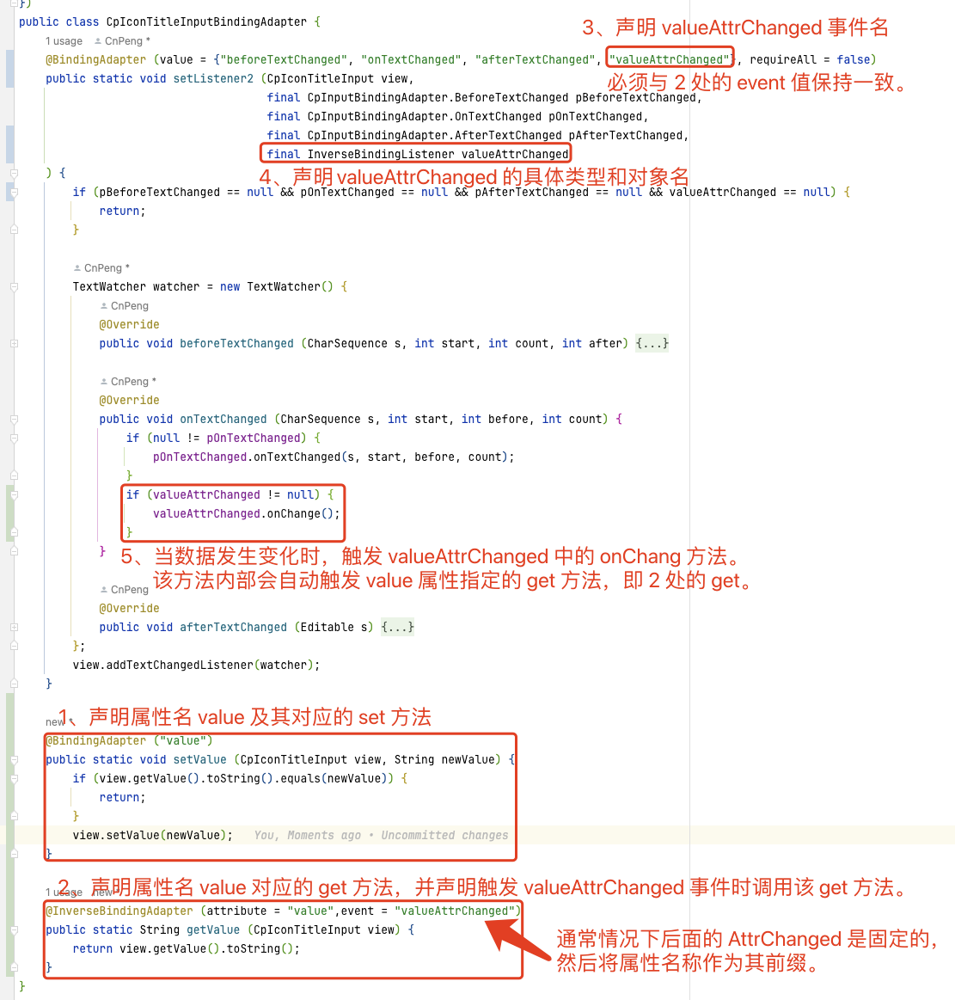
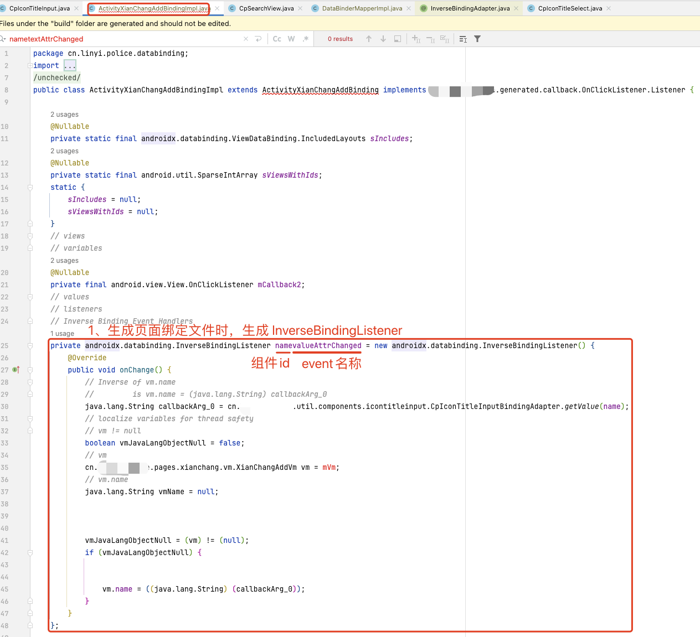
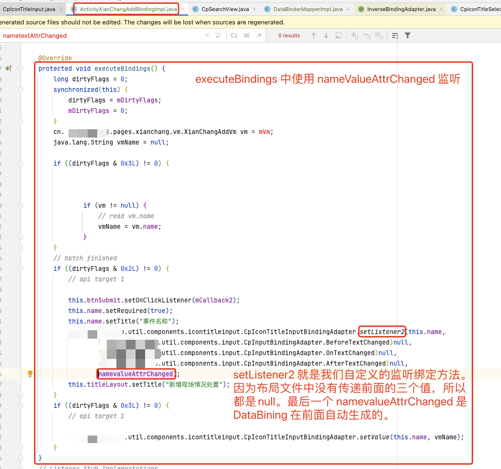

基于 [Data Binding Library 官方指南](https://developer.android.google.cn/topic/libraries/data-binding) 翻译整理。

目录结构：

章节|官方文档
---|---|
<a href="#1">一、概览</a> | [data-binding](https://developer.android.google.cn/topic/libraries/data-binding)
<a href="#2">二、入门</a> | [data-binding/start](https://developer.android.google.cn/topic/libraries/data-binding/start)
<a href="#3">三、布局和绑定表达式</a> | [data-binding/expressions](https://developer.android.google.cn/topic/libraries/data-binding/expressions)
<a href="#4">四、可观察的数据对象</a> | [data-binding/observability](https://developer.android.google.cn/topic/libraries/data-binding/observability)
<a href="#5">五、生成的绑定类</a> | [data-binding/generated-binding](https://developer.android.google.cn/topic/libraries/data-binding/generated-binding)
<a href="#6">六、绑定适配器</a> | [data-binding/binding-adapters](https://developer.android.google.cn/topic/libraries/data-binding/binding-adapters)
<a href="#7">七、将布局视图绑定到架构组件</a> | [data-binding/architecture](https://developer.android.google.cn/topic/libraries/data-binding/architecture)
<a href="#8">八、双向绑定</a> | [data-binding/two-way](https://developer.android.google.cn/topic/libraries/data-binding/two-way)

## 1. 概览

<h6 id="1"></h6>

### 1.1. DataBinding 基本介绍

DataBinding 库可以让我们以非编码的形式将布局和数据进行绑定。

通常情况下， 我们把数据绑定到布局文件时，需要借助 UI 框架层的一些函数。比如，下面的代码通过 `findViewById()` 获取 TextView 控件，然后把 viewModel 对象中的 userName 设置给该控件。

* kotlin版代码

```kotlin
findViewById<TextView>(R.id.sample_text).apply {
    text = viewModel.userName
}
```

* java版代码

```java
TextView textView = findViewById(R.id.sample_text);
textView.setText(viewModel.getUserName());
```

下面的示例代码，则展示了如何使用 DataBinding 将数据直接在布局文件中绑定给对应的控件。通过下面的这种方式，我们省略了上面示例中的 java/Kotlin 代码。注意  `@{ }` 是 DataBinding 的固定格式，花括号内部是具体需要绑定的数据内容。

```xml
<TextView
    android:text="@{viewmodel.userName}" />
```

### 1.2. 如何使用 DataBinding 库

下面介绍一下我们将要学习的 DataBidning 的内容。

#### 1.2.1. 入门

<a href="#2"></a>

主要介绍如何基于　AndroidStudio 搭建 DataBinding 的开发环境。

#### 1.2.2. 布局和绑定表达式

<a href="#3"></a>

绑定表达式能够让我们将 数据变量 和 view 直接进行关联。然后 DataBinding 库会自动生成关联二者时所需的类（classes）。

DataBinding 库提供了可以让我们在布局文件中使用的 `import`、`variable`、`include` 属性, 这些属性用来声明绑定到 View 的数据及其类型。 这些属性的父节点为 `data`, 而 `data` 的父节点为 `layout`, `layout` 的另一个子节点就是 View 的根节点。示例如下:

```xml
<layout xmlns:android="http://schemas.android.com/apk/res/android"
        xmlns:app="http://schemas.android.com/apk/res-auto">
    <data>
        <variable
            name="viewmodel"
            type="com.myapp.data.ViewModel" />
    </data>

    <ConstraintLayout... >
    	 <!-- View/ViewGroup 的根节点 -->
    </ConstraintLayout... >
</layout>
```

#### 1.2.3. 可观察的数据对象

<a href="#4"></a> 

所谓可观察的数据对象，就是当数据发生变化时，能够自动通知布局文件进行刷新。这就类似于回调或监听器的作用。

DataBinding 库提供了一些类和函数，这些类和函数能够实现对数据变化的监听，进而由该库自动实现布局文件的刷新。DataBinding 库可以实现对 对象（object）、字段（field）、集合（collection）的监听。

#### 1.2.4. 生成的绑定类

<a href="#5"></a>

DataBinding 库会自动生成绑定 数据变量 和 View 时所需要的绑定类（binding classes）。我们也可以自定义这个绑定类。

#### 1.2.5. 绑定适配器

<a href="#6"></a>

布局文件中使用的每一个绑定表达式都有一个对应的绑定适配器（bingding adapter）。该绑定适配器内部实现了属性或者监听器与视图的绑定。比如，绑定适配器内部会调用 `setText()` 为 TextView 设置 `android:text` 的属性值，或者调用 `setOnClickListener()` 设置点击监听。

[`android.databinding.adapters`](https://android.googlesource.com/platform/frameworks/data-binding/+/studio-master-dev/extensions/baseAdapters/src/main/java/androidx/databinding/adapters) 包中定义了常用的一些绑定适配器。当然了，我们也可以根据需要自定义一些绑定适配器。示例如下：

* kotlin 版示例

```kotlin
@BindingAdapter("app:goneUnless")
fun goneUnless(view: View, visible: Boolean) {
    view.visibility = if (visible) View.VISIBLE else View.GONE
}
```

* java 版示例

```java
@BindingAdapter("app:goneUnless")
public static void goneUnless(View view, Boolean visible) {
    view.visibility = visible ? View.VISIBLE : View.GONE;
}
```

#### 1.2.6. 将布局视图绑定到架构组件

<a href="#7"></a>

Android Support 库中包含的 [`Architecture Components`](https://developer.android.google.cn/topic/libraries/architecture/index.html) 可以帮助我们构建出更加健壮(robust)、易于测试(testable)、方便维护(maintainable) 的 app。

`Architecture Components` 和 DataBinding 的组合使用，可以进一步简化 UI

#### 1.2.7. 双向数据绑定

<a href="#8"></a>

DataBinding 库支持双向数据绑定。也就是说，当 View 的属性发生变化时可以通知对应的绑定数据进行更新，同理，当绑定数据发生变化时也可以通知 View 去更新对应的属性值。

比如，我们使用双向绑定为 RadioButton 绑定一个文本。当 RadioButton 选中时会显示 “选中”，取消选中时显示 “未选中”；同理，当我们变更文本时，双向绑定就会自动更新 RadioButton 的选中状态。


## 2. 入门

<h6 id="2"></h6>

DataBinding 库是以 support 库的形式提供的，具有良好的兼容性，适用于 Andorid 4.0(API  14) 及以上版本。

使用 DataBinding 时最好保持 Gradle 插件为最新版本。(从 1.5.0 版本的 Gradle 插件开始，都可以支持 DataBinding )。[点击此处可以查看如何升级 Gradle 插件](https://developer.android.google.cn/studio/releases/gradle-plugin.html#updating-plugin)


### 2.1. 启用数据绑定

在 module 的 `build.gradle` 文件的 android 节点中增加 dataBinding 节点即可启用数据绑定。具体如下：

```groovy
android {
    ...
    dataBinding {
        enabled = true
    }
}
```

注意：
**如果当前 module 所依赖的 libraries 中使用了数据绑定，那么，不论 该 module 是否使用了数据绑定，都必须在当前 module 的 gradle 文件中启用数据绑定。**

### 2.2. Android Studio 中对数据绑定的支持

Android Studio 对 DataBinding 的代码提供了诸多支持，如：

* 语法高亮 （ xml 中使用数据绑定的部分会高亮显示）
* 语法错误提示 （ xml 中使用数据绑定的部分如果有错误会爆红提示）
* 代码补全
* 快速跳转 （ Mac 下按住 Cmd , 然后单击数据绑定中使用的 变量或方法，就会跳转到对应的声明位置）

如果我们为数据绑定表达式提供了 `default` 属性及值，那么，在布局编辑器的预览面板中，就会显示 default 的值；程序运行之后，如果数据绑定表达式没有获取到结果，也会展示 default 对应的值。

比如，下面的示例代码中，TextView 的 text 属性绑定的值为 `user.firstName`, 并通过 `default` 关键字配置了默认值为 “彭”。这样，在布局编辑器的预览界面中，该 TextView 中就会显示 “彭” ; 程序部署到手机上运行后，如果 `user.firstName` 的取值为空，那么也会显示 “彭”。

```kotlin
<TextView android:layout_width="wrap_content"
    android:layout_height="wrap_content"
    android:text="@{user.firstName, default=`彭`}"/>
```

如果我们只是单纯的想在布局编辑器的预览界面中查看布局效果，完全可以使用 `tools` 命名空间来实现。`tools` 命名空间实现的内容只在预览时生效，程序部署运行后无效。

**注意：部分资料中只说了 default 属性值可以在预览界面显示，但没有说明数据绑定表达式取不到值时会使用 default 属性值的情况，此处我之前栽过跟头😭**

关于 tools 命名空间的使用，可以参考如下文章：

[Android:Tools命名空间原来是有大用处的](https://www.jianshu.com/p/2912bcba4465)  

[Tools Attributes Reference](https://developer.android.google.cn/studio/write/tool-attributes.html).


### 2.3. 新的数据绑定编译器

#### 2.3.1. 启用新的绑定编译器

从 Android Gradle 插件的 3.1.0-alpha06 版本开始，在生成 绑定类时 使用了新的数据绑定编译器。新的编译器使用增量编译的方式来创建绑定类，极大的提高了程序的构建速度。关于绑定类的更多内容可以查看 <a href="#5">生成的绑定类</a> 一节

在老版本的绑定编译器中，生成绑定类的操作 是与 编译你自己的代码 同步的。所以，在之前的版本中，如果我们自己写的代码出了错误，也会导致生成绑定类的操作终止，然后我们就会在 Android Studio 的 Logcat 面板中看见无数个 `找不到绑定类 ( the binding calsses aren't found )` 的错误提示。而在 **新的绑定编译器中，会先处理绑定类的生成操作，然后再去编译我们自己编写的其他代码**。

在 `gradle.properties` 文件中，新增如下内容即可启用新版的绑定编译器：

```kotlin
android.databinding.enableV2=true
```

注意：

在 3.1 的 Gradle 插件中，绑定编译器向下兼容并不完善，我们必须手动启用新版编译器；但 3.2 开始能够完全向下兼容，并且从 3.2 开始默认启用新版编译器。

#### 2.3.2. 新的绑定编译器的变更

新的绑定编译器做了如下改变：

* 先生成绑定类，然后再去编译我们自己的代码

* 库 module 中的绑定类会被编译/打包到 AAR 文件中. 引用这个库时，不需要再重新编译和生成这些绑定类。（ 关于 AAR 的更多内容，可以查看：[Create an Android Library.](https://developer.android.google.cn/studio/projects/android-library)）

* 当前 module 中定义的绑定适配器不会影响到 依赖库中的绑定适配器。也就是说，绑定适配器的作用域只在当前 module 中。

* If a layout is included in more than one target resource configuration, the data binding library uses android.view.View as the default view type for all views that share the same resource id but not view type. (这个不是很明白，大概描述的如果某个布局文件被多处 include ，那么 DataBinding 库会把 include 这个布局文件的 View 的类型定义为 android.view.View 而不是它的具体类型。)


## 3. 布局和绑定表达式

<h6 id="3"></h6>

在绑定表达式中，我们不只可以绑定数据，也可以绑定用于事件处理的方法/函数。

DataBinding 库会自动生成 将数据/方法 绑定到 view 时所需的绑定类。

DataBinding 的布局文件与普通的布局文件差异很小，DataBinding 的布局文件使用 `<layout></layout>` 作为根节点，其内部又包含两个子节点：

* `<data></data>` 节点，内部包含数据绑定所需要使用的变量或类；
* View 节点，这个节点就是普通布局文件中 View 和 ViewGroup 内容。

下面这个布局文件就是一个 DataBinding 的布局文件：

```kotlin
<?xml version="1.0" encoding="utf-8"?>
<layout xmlns:android="http://schemas.android.com/apk/res/android">
   <data>
       <variable name="user" type="com.example.User"/>
   </data>
   <LinearLayout
       android:orientation="vertical"
       android:layout_width="match_parent"
       android:layout_height="match_parent">
       
       <TextView android:layout_width="wrap_content"
           android:layout_height="wrap_content"
           android:text="@{user.firstName}"/>
           
       <TextView android:layout_width="wrap_content"
           android:layout_height="wrap_content"
           android:text="@{user.lastName}"/>
   </LinearLayout>
</layout>
```

上述代码中，我们在 `<data>` 节点内部通过 `<variable />` 声明了一个类型为 `com.example.User` 的 变量，该变量名为 `user`。

在布局文件中，我们使用绑定表达式为 View 的某个属性赋值时，使用的是 `@{ }` 语法。

在上面的示例代码中，我们分别把 `user.firstName` 和 `user.lastName` 作为 TextView 的 `android:text` 属性值。

**注意：绑定表达式要尽量简洁。**  借助 <a href="#6">绑定适配器</a> 可以简化绑定表达式。


### 3.1. 数据对象

假设我们现在有一个 User 数据类：

kotlin 版写法：

```kotlin
data class User1(val firstName: String, val lastName: String)
```

java 版写法：

```java
public class User1 {
  public final String firstName;
  public final String lastName;
  public User(String firstName, String lastName) {
      this.firstName = firstName;
      this.lastName = lastName;
  }
}
```

上面示例中，属性被定义为 public final，我们构建一个 User 对象后，其属性值不能被再次改变，而且我们只能通过 `user.firstName` 的方式去访问其属性。

下面的 java 示例代码中，我们把属性值定义为 private final , 然后提供 public 的 getxxx 方法。构建对象后，我们只能通过 getxxx 方法访问其属性值。

kotlin版

```kotlin
// Not applicable in Kotlin. CnPeng 这地方没理解透撤
data class User2(val firstName: String, val lastName: String)
```

java版

```kotlin
public class User2 {
  private final String firstName;
  private final String lastName;
  public User(String firstName, String lastName) {
      this.firstName = firstName;
      this.lastName = lastName;
  }
  public String getFirstName() {
      return this.firstName;
  }
  public String getLastName() {
      return this.lastName;
  }
}
```

对于 DataBinding 来说，我们上面定义的两种 User 是等效的。在 `@{user.firstName}` 表达式中，如果 user 是 User1 的实例，那么，它会直接访问 firstName 属性值；如果是 User2 的实例，则会调用 `getFirstName()` 方法，如果在 User2 中把 `getFirstName()` 改为 `firstName()`, 这样也可以被调用。


### 3.2. 创建和获取绑定类

每一个被绑定的布局文件都会生成一个对应的 binding 类。

默认情况下，绑定类的名字取决于布局文件的名字。如 `activity_main.xml` 将会生成 `ActivityMainBinding` 类。在生成绑定类时，会去除下划线，然后遵循驼峰规则，末尾后缀 Binding . 

`ActivityMainBinding` 类内部持有布局文件中的所有绑定对象，并且会自动把绑定给 View 的值计算出来。

通常我们会在填充布局的时候创建和获取绑定类。示例如下：

#### 3.2.1. Activtiy 

在 activity 中，我们使用 `DataBindingUtil.setContentView()` 替代 `setContentView()`

kotlin版

```kotlin
override fun onCreate(savedInstanceState: Bundle?) {
    super.onCreate(savedInstanceState)

    val binding: ActivityMainBinding = DataBindingUtil.setContentView(this, R.layout.activity_main)

    binding.user = User("Test", "User")
}
```

java版

```java
@Override
protected void onCreate(Bundle savedInstanceState) {
   super.onCreate(savedInstanceState);
   ActivityMainBinding binding = DataBindingUtil.setContentView(this, R.layout.activity_main);
   User user = new User("Test", "User");
   binding.setUser(user);
}
```

#### 3.2.2. Fragment、ListView、RecyclerView

在 Fragment、ListView、RecyclerView 中填充视图时，我们使用的是 `DataBindingUtil.inflate()`

kotlin 版

```kotlin
val listItemBinding = DataBindingUtil.inflate(layoutInflater, R.layout.list_item, viewGroup, false)

```

java版

```java
ListItemBinding binding = DataBindingUtil.inflate(layoutInflater, R.layout.list_item, viewGroup, false);
```

### 3.3. 数据绑定的表达式语句

#### 3.3.1. 支持的关键字和操作

数据绑定的表达式语句和其他普通语句类似，它支持如下操作(符)和关键字

* 算数运算符:`+ - * / %`
* 字符串拼接符: `+`
* 逻辑运算符： `&&  ||`
* 位运算(Binary)： `&  |  ^`
* 一元运算（Unary）：`+ - ! ~`
* 位移运算（shift）: `>>  >>>  <<`
* 比较表达式：`== > < >= <=` **注意：`<` 需要使用转义字符 `&lt;` 替代**
* `instanceof` 关键字
* 分组符号（Grouping）：`( )`
* 字面值：字符、字符串、数字、null
* 方法调用
* 属性调用
* 数组元素访问 :`[ ]`
* 三目运算： `?:`
* Cast (类型强转)

示例:

```xml
android:text="@{String.valueOf(index + 1)}"

android:visibility="@{age > 13 ? View.GONE : View.VISIBLE}"

android:transitionName='@{"image_" + id}'

android:marginLeft="@{@dimen/margin + @dimen/avatar_size}"

android:text='@{@string/user_name+bean.name}' 
```

><b>注意</b>：<br>
* xml 中使用 `&&` 时，需要使用 `&amp;&amp;` 进行转义
* xml 中使用 `<` 时，需要使用 `&lt;` 进行转义，包括 `List<Object>`  中的 `<` 也要转义。

#### 3.3.2. 不支持的内容

数据绑定的表达式语句中，不支持如下内容：

* this
* super
* new
* Explicit generic invocation


#### 3.3.3. null 合并操作符——`??`

> CnPeng Swift 中有这种操作符

`??` 的作用是，如果左边的数据不为 null，则以左边的数据为返回值，如果为 null，则以右边的数据作为返回值。

示例:

```kotlin
android:text="@{user.displayName ?? user.lastName}"
```

上述代码等价于下面的代码：

```kotlin
android:text="@{user.displayName != null ? user.displayName : user.lastName}"
```

#### 3.3.4. 属性引用

数据绑定表达式在访问 属性（fields）、get方法（getters）、ObservableField 时都使用如下格式：

```kotlin
android:text="@{user.lastName}"
```

#### 3.3.5. 空指针异常的规避

在数据绑定自动生成的代码中，会进行 null 检查，并规避空指针异常。

比如：在表达式 `@{user.name}` 中, 如果 `user` 为 null, `user.name` 的值也会为 null .如果我们在绑定表达式中引用了 int 类型的 `user.age`, 如果 `user` 为 null ，那么 `user.age` 的值将会为 0 。

也就是说，如果被引用的对象为空，那么会使用对象字段的默认值。

**注意：**

此处的检查和保护，是单层的检查和保护，只检查最外一层，就向上面的表达式一样，只会检查 user，如果 user 为空，会对 name 和 age 给出默认值。但是，如果在 `user.locaiont.state` 这种多层嵌套的表达式中，如果 user 不为空，但是 location 为空，此时，数据绑定将无法做到保护，无法给出默认值。如果这时候没有手动进行判断和操作，就会报空指针异常。

#### 3.3.6. 表达式中的集合（**重点**）

在数据绑定的表达式中，可以通过 `[ ]` 访问 arrays, lists, sparse lists, maps 的元素。

对于 list 和 array , `[ ]` 中传递的是 索引；而对于 map 则需要传递 键名

此外，还可以通过 `@{map.key}` 的方式获取 map 中某个键的值。

此处要注意: `<` 需要用 `&lt;` 替代

```xml
<data>
    <import type="android.util.SparseArray"/>
    <import type="java.util.Map"/>
    <import type="java.util.List"/>
    <variable name="list" type="List&lt;String>"/>
    <variable name="sparse" type="SparseArray&lt;String>"/>
    <variable name="map" type="Map&lt;String, String>"/>
    <variable name="index" type="int"/>
    <variable name="key" type="String"/>
</data>
…
android:text="@{list[index]}"
…
android:text="@{sparse[index]}"
…
android:text="@{map[key]}"
```

#### 3.3.7. 字符串字面值

当绑定表达式中需要使用字符串的字面值时，有两种方式：

##### 3.3.7.1. 单引号包裹双引号

如果字符串字面值使用 双引号包裹，那么，绑定表达式就需要使用 单引号包裹。

```xml
android:text='@{map["firstName"]}'
```

##### 3.3.7.2. 双引号包裹反引号

如果使用双引号包裹绑定表达式，那么，字符串字面值就需要使用 反引号包裹。 

（反引号就是英文状态下键盘左上角的 `~` 按键。）

```xml
android:text="@{map[`firstName`]}"
```

#### 3.3.8. 引用资源

可以通过如下格式访问资源文件

```xml
android:padding="@{large? @dimen/largePadding : @dimen/smallPadding}"

android:marginLeft="@{@dimen/margin + @dimen/avatar_size}"
```

注意：**按照如下方式拼接资源时，需要使用单引号。**

```xml
android:text='@{@string/user_name + bean.name}'
```

此外，需要特别注意的是，**字符串拼接时最好不要直接使用显示的文字表示**，比如：

```xml
android:text='@{"user的name:"+bean.name}'
```

因为不同电脑的编码不同，这样写很容易出现编码错误的问题。


#### 3.3.9. 引用格式化字符串资源

布局文件中引用：

```xml
android:text="@{@string/nameFormat(firstName, lastName)}"
```

格式化字符串资源的定义：

```xml
<string name="nameFormat">%s, %s</string>
```


在绑定表达式中引用资源时和未使用绑定表达式时略有区别，具体如下：

类型|非绑定表达式的引用方式|绑定表达式的引用方式
---|---|---
String[]|	@array |	@stringArray
int[] |	@array|	@intArray
TypedArray |	@array	|@typedArray
Animator | @animator |	@animator
StateListAnimator |	@animator	| @stateListAnimator
color int | @color	| @color
ColorStateList | @color |	@colorStateList


### 3.4. 事件处理

数据绑定表达式也可以绑定一些方法用来处理 View 的事件。

比如，我们可以为 View 的 onClick 属性通过数据绑定表达式绑定一个方法，当触发 View 的 onClick 事件时就会调用 被绑定的方法。

事件对应的属性名称取决于监听器中的回调方法名，比如，`View.OnClickListener` 的回调方法名为 `onClick` , 所以它对应的属性名称就是 `android:onClick`

下面是一些比较特殊的情况，为了避免冲突，Android 为对应的事件定义了额外的属性名称：

类| 监听器 | 属性名
---|---|---
SearchView | setOnSearchClickListener(View.OnClickListener) |android:onSearchClick
ZoomControls | setOnZoomInClickListener(View.OnClickListener) | android:onZoomIn
ZoomControls	| setOnZoomOutClickListener(View.OnClickListener)| android:onZoomOut

通过数据绑定的方式处理 View 的事件时，有两种方式：

* 绑定方法（引用方法）：
	* 被绑定的方法需要**和对应的监听方法有同样的参数和返回值**。当我们把一个方法与 View 的事件绑定以后，DataBinging 就会把这个方法封装到 事件监听器中，然后把这个监听器设置给 View。 
* 绑定监听器：
	* 绑定监听器时使用了 lambda 表达式，同样也会创建一个监听器，当触发 View 的事件时，就会调用 lambda 表达式。
 
#### 3.4.1. 引用函数/方法（绑定方法）

在 Activity 的 layout 布局文件中，我们可以为 View 的 `android:onClick` 属性绑定一个在 Activity 中声明的方法。同样的，我们也可以使用数据绑定的方式为该属性绑定位于任意位置的事件处理的方法。与前一种方式相比，数据绑定的方式会在编译期检查被绑定的方法是否存在，该方法是否与对应监听器的方法具有同样的声明格式（参数和返回值需要一致)，如果不一致就会直接报错。

绑定方法 与 绑定监听器 的主要区别在于：

* 将方法绑定到 view 之后，DataBinding 库就会立即创建一个对应的监听器
* 而绑定监听器时，则是在触发对应的事件时才会创建所需要的监听器。

绑定方法的示例如下：

* 声明方法

```java
// JAVA 版
public class MyHandlers {
    public void onClickFriend(View view) { ... }
}
```

```kotlin
// kotlin 版
class MyHandlers {
    fun onClickFriend(view: View) { ... }
}
```

* 在 `activity_main.xml` 中绑定

```xml
<?xml version="1.0" encoding="utf-8"?>
<layout xmlns:android="http://schemas.android.com/apk/res/android">
   <data>
       <variable name="handlers" type="com.example.MyHandlers"/>
       <variable name="user" type="com.example.User"/>
   </data>
   <LinearLayout
       android:orientation="vertical"
       android:layout_width="match_parent"
       android:layout_height="match_parent">

       <--注意：事件绑定使用双冒号 :: -->
       <TextView android:layout_width="wrap_content"
           android:layout_height="wrap_content"
           android:text="@{user.firstName}"
           android:onClick="@{handlers::onClickFriend}"/>
   </LinearLayout>
</layout>
```

* 为 ActivityMainBinding.class 设置 handlers 对象

在 Activtiy 中构建 MyHandlers 对象，并设置给 ActivityMainBinding

```kotlin
class MainActivity : AppCompatActivity() {

    override fun onCreate(savedInstanceState: Bundle?) {
        super.onCreate(savedInstanceState)

        val binding: ActivityMainBinding = DataBindingUtil.setContentView(this, R.layout.activity_main)

        val handler = MyHandlers()
        binding.handlers = handler
    }
}
``` 

上面的示例代码中，我们创建了一个 `MyHandlers` 类，并在其中声明了一个方法 `onClickFriend` , 因为 onClick 方法接收的参数是 View， 所以，我们也为 `onClickFriend` 定义了一个 view 参数。

然后我们在布局文件的 <data> 节点内部的 <variable> 节点声明了名称为 `handlers` 的变量，其类型为 `com.example.MyHandlers`——也就是我们自定义的类。所有 <variable> 节点声明的变量都会在对应的 xxxBinding.class 类中生成 getter 和 setter。

然后我们为 TextView 的 onClick 绑定了 `onClickFriend` 方法，在这个绑定表达式中，变量和方法之间使用 `::` 连接。（在绑定表达式中, 变量和属性字段之间使用 `.` 连接，如 `user.firstName` ； 另外，早期的 DataBinding 版本中，引用方法也可以使用 `.` 但现在已经不推荐这么用了）

最后，我们在 Activity 中构建 MyHandlers 对象，然后调用 setter 方法将该对象设置到 绑定类中。

注意：**被绑定的方法必须是 public 的**

#### 3.4.2. 绑定监听器

绑定方法时，被绑定的方法必须与对应监听的方法具有相同的参数和返回值；**而在绑定监听器时，只要具有相同的返回值就可以了。**

##### 3.4.2.1. 示例1：

```kotlin
class MainActivity : AppCompatActivity() {

    override fun onCreate(savedInstanceState: Bundle?) {
        super.onCreate(savedInstanceState)

        val binding: ActivityMainBinding = DataBindingUtil.setContentView(this, R.layout.activity_main)

        val handler = MyHandlers()
        binding.handler = handler
        binding.args = "按钮被点击了"
    }
}

class MyHandlers {

    fun onClickButton(args: String, context: Context) {
        Toast.makeText(context, args, Toast.LENGTH_SHORT).show()
    }
}
```

```xml
<layout xmlns:android="http://schemas.android.com/apk/res/android">

    <data>

        <variable
            name="args"
            type="String" />

        <variable
            name="handler"
            type="com.example.android.databinding.basicsample.ui.MyHandlers" />
    </data>

    <LinearLayout
        android:layout_width="match_parent"
        android:layout_height="match_parent">

        <Button
            android:layout_width="wrap_content"
            android:layout_height="wrap_content"
            android:onClick="@{()-> handler.onClickButton(args,context)}"
            android:text="点击查看效果" />

    </LinearLayout>
</layout>
```

运行上面的代码后，点击 Button，就会弹出一个吐司。

需要注意的是，**在 DataBinding 的布局文件中，默认会提供一个 `context` 变量，其值为当前跟布局的  `getContext()` 的返回值**。如果我们有需要，可以重新定义一个 context 并指定它的类型。


##### 3.4.2.2. 示例2：

上述示例代码中，我们并没有声明 `onClick()` 所需要的 view 参数，因为我们在 `onClickButton` 中并没有用到它.

它的完整写法应该是下面的样子：

```xml
android:onClick="@{(view)-> handler.onClickButton(args,context)}"
```

上面的这行代码中，我们在 lambda 表达式的括号中定义了一个名为 view 的参数，这是 OnClickListener 中的 onClick 所需要的参数。

对于监听器回调方法的参数，有两种处理方式：直接省略或者**全**都声明出来。声明出来之后，我们就可以在绑定表达式中使用它。

```kotlin
class MainActivity : AppCompatActivity() {

    override fun onCreate(savedInstanceState: Bundle?) {
        super.onCreate(savedInstanceState)

        val binding: ActivityMainBinding = DataBindingUtil.setContentView(this, R.layout.activity_main)

        val handler = MyHandlers()
        binding.handler = handler
    }
}

class MyHandlers {

    fun onClickButton2(args: String, view: View) {
        Toast.makeText(view.context, args, Toast.LENGTH_SHORT).show()
    }
}
```

```xml
android:onClick="@{(view)-> handler.onClickButton2(args,view)}"
```

##### 3.4.2.3. 示例3：

```xml
<CheckBox android:layout_width="wrap_content" android:layout_height="wrap_content"
      android:onCheckedChanged="@{(cb, isChecked) -> presenter.completeChanged(task,isChecked)}" />
```

##### 3.4.2.4. 示例4：

如果监听器的回调方法有返回值，那么我们的数据绑定表达式也必须有相同的返回值。比如，我们监听 View 的 longClick 事件时，我们的数据绑定表达式也必须返回一个 boolean 值。

```kotlin
class Presenter {
    fun onLongClick(view: View, task: Task): Boolean { }
}
```

```xml
android:onLongClick="@{(theView) -> presenter.onLongClick(theView, task)}"
```

在上面的示例代码中，如果 presenter 为 null ，那么，该数据绑定表达式就会返回对应类型的默认值。引用类型会返回 null， int 类型会返回 0， bololean 类型会返回 false 等等。

##### 3.4.2.5. void 表达式

我们在数据绑定表达式中使用具有断言效果的语句（比如 三目运算）时，我们可以使用 `void` 作为一个分支，示例如下：

```xml
android:onClick="@{(v) -> v.isVisible() ? doSomething() : void}"
```

上面这段代码就表示，如果 view 可见，执行 `doSometthing` 方法， 否则执行 void —— 也就是啥也不干。

注意:

在绑定监听器时，绑定表达式一定要简洁。（CnPeng 其实所有的绑定表达式都应该简洁明了）

### 3.5. import、variale、include

DataBinding 库提供了 import、variable、include 属性。

- import 可以让我们在布局文件中引用类
- variable 可以声明一些我们将要在 绑定表达式中使用的变量
- include 可以实现布局文件的复用

#### 3.5.1. import

就像在 `.java` 或者 `.kt` 文件中一样，如果我们想在布局文件中使用某个类，那么就可以直接通过 import 导入这个类。

示例如下：

```xml
<data>
    <import type="android.view.View"/>
</data>
```

我们导入某个类之后，就可以在绑定表达式中使用这个类了，下面的示例引用了 View 的显示和隐藏属性，具体如下：

```xml
<TextView
   android:text="@{user.lastName}"
   android:layout_width="wrap_content"
   android:layout_height="wrap_content"
   android:visibility="@{user.isAdult ? View.VISIBLE : View.GONE}"/>
```

##### 3.5.1.1. A: 类型别名

如果被导入的类具有相同的类名，为了在使用时避免冲突，我们可以为这个类通过 `alias` 定义一个别名。

```xml
<import type="android.view.View"/>
<import type="com.example.real.estate.View"
        alias="Vista"/>
```

上面的示例中我们为 `com.example.real.estate.View` 定义了一个别名 `Vista`， 这样当我们引用其中的属性或者方法时，就可以直接使用 `Vista.xxx` 进行引用了。而 `View` 则只会指向 `android.view.View`.

##### 3.5.1.2. B: 使用导入的类

在声明变量时，我们可以直接使用已经 import 的类，如：

```xml
<data>
    <import type="com.example.User"/>
    <import type="java.util.List"/>
    <variable name="user" type="User"/>
    <variable name="userList" type="List &lt;User>"/>
</data>
```

我们也可以使用 import 的类进行类型强转，下面的示例中，将 `connection` 属性强转成了 `User` 类型：

```xml
<TextView
   android:text="@{((User)(user.connection)).lastName}"
   android:layout_width="wrap_content"
   android:layout_height="wrap_content"/>
```

import 的类中如果有静态属性和方法，我么也可以直接在绑定表达式中调用. 下面的示例代码中，调用了 MyStringUtils 中的 capitalize() 静态方法

```xml
<data>
    <import type="com.example.MyStringUtils"/>
    <variable name="user" type="com.example.User"/>
</data>
…
<TextView
   android:text="@{MyStringUtils.capitalize(user.lastName)}"
   android:layout_width="wrap_content"
   android:layout_height="wrap_content"/>
```

对于 `java.lang.*` 包下的类，我们在数据绑定的布局文件中，可以直接使用，而不需要 import . 比如  String,

```xml
<data>
	<variable name = "uName" type = "String">
</data>
```

#### 3.5.2. variable

`<variable>` 节点表示声明将要在绑定表达式中使用到的变量。

下面的示例代码中，声明了多个绑定变量。

```xml
<data>
    <import type="android.graphics.drawable.Drawable"/>
    <variable name="user" type="com.example.User"/>
    <variable name="image" type="Drawable"/>
    <variable name="note" type="String"/>
</data>
```

这些变量的类型是在编译期确定下来的，如果某个变量实现了 Observable 或者就是一个  observable collection, 那么，在它的类型就是 Observable 或 observable collection 。否则，就是原类型。

如果某个布局文件有不同的变体（比如：横屏 或 竖屏）, 那么，其中声明的变量会被合并到一个 Binding 类中，所以，这种情况下，我们在不同的文件中不能定义相同的变量。（ When there are different layout files for various configurations (for example, landscape or portrait), the variables are combined. There must not be conflicting variable definitions between these layout files.）

定义的每一个变量都将是自动生成的 Binding 类的属性，而且会在 Binding 类中生成对应的 setter 和 getter。在 setter 被调用之前，这些变量都会持有一个默认值——引用类型默认为null，int 类型默认为 0 等等。

**`context` 是一个特殊的变量名，默认情况下，它的值是当前布局文件根节点的 `getContext()` 的值。如果我们显示的声明了一个同名的变量，该变量的类型和值就会覆盖默认的类型和值。**


#### 3.5.3. include 

数据绑定的布局文件中声明的变量可以传递给被 include 的布局中，在传递时使用 app 或 bind 命名空间，对应的属性名就是变量名。被 include 的布局也应该是以 `<layout></layout>` 作为根节点。

下面的示例代码，分别把 user 传递到了 `name.xml` 和 `contact.xml` 文件中。

```xml
<?xml version="1.0" encoding="utf-8"?>
<layout xmlns:android="http://schemas.android.com/apk/res/android"
        xmlns:bind="http://schemas.android.com/apk/res-auto">
   <data>
       <variable name="user" type="com.example.User"/>
   </data>
   <LinearLayout
       android:orientation="vertical"
       android:layout_width="match_parent"
       android:layout_height="match_parent">

       <include layout="@layout/name"
           bind:user="@{user}"/>

       <include layout="@layout/contact"
           bind:user="@{user}"/>
   </LinearLayout>
</layout>
```

name.xml

```xml
<?xml version="1.0" encoding="utf-8"?>
<layout xmlns:android="http://schemas.android.com/apk/res/android"
        xmlns:bind="http://schemas.android.com/apk/res-auto">
   <data>
       <variable name="user" type="com.example.User"/>
   </data>
   <LinearLayout
       android:orientation="vertical"
       android:layout_width="match_parent"
       android:layout_height="match_parent">

       <TextView
       	 android:layout_width="wrap_content"
           android:layout_height="wrap_content"
       	 android:text="@{user.firstName}"
       	 />
   </LinearLayout>
</layout>
```

如果被 `include` 节点是 `mserge` 的子节点，那么，DataBinding 的数据传递将不会生效，如下：

```xml
<!--这是一个错误的示例，错误的，错误的-->
<?xml version="1.0" encoding="utf-8"?>
<layout xmlns:android="http://schemas.android.com/apk/res/android"
        xmlns:bind="http://schemas.android.com/apk/res-auto">
   <data>
       <variable name="user" type="com.example.User"/>
   </data>

   <!-- 这样不生效 这样不生效 这样不生效 -->
   <merge>
       <include layout="@layout/name"
           bind:user="@{user}"/>
       <include layout="@layout/contact"
           bind:user="@{user}"/>
   </merge>
</layout>
```

## 4. 使用可观察的数据对象

<h6 id="4"></h6>

所谓可观察就是指当数据本身发生变化时，会通知该数据的调用者去刷新。这类似于监听回调。

DataBinding 库中，我们可以把 对象(objects)、属性（fields）和 集合（collections）做成可观察的。

我们在数据绑定中使用非可观察的数据对象时，当对象内部的数据发生变化后，并不能自动实现 UI 的刷新；而可观察的数据对象在数据发生变化时，会自动触发 UI 的更新。


### 4.1. Observable fields

当某个类中的字段比较少的时候，我们如果让该类去实现 `Observable` 显得有些大材小用，这种情况下，我们完全可以把这些属性定义为下面这些预置的 Observable 类型：

* `ObservableBoolean`
* `ObservableByte`
* `ObservableChar`
* `ObservableShort`
* `ObservableInt`
* `ObservableLong`
* `ObservableFloat`
* `ObservableDouble`
* `ObservableParcelable`
* `ObservableField<T>`

Observable fields 实际是一个仅包含一个属性的 observable 对象，在访问数据的时候不需要拆装箱。

访问 Observable fields 内部数据时使用 set() 和 get() 

示例：

```kotlin
class TempActivity : AppCompatActivity() {
    override fun onCreate(savedInstanceState: Bundle?) {
        super.onCreate(savedInstanceState)
        val binding: ActivityTempBinding = DataBindingUtil.setContentView(this, R.layout.activity_temp)

        val statusBean = StatusBean(ObservableInt(0), ObservableField("被点击了么？"))
        binding.statusBean = statusBean

        var clickCount = 0
        binding.tvStatus.setOnClickListener {
            //CnPeng 2019/3/21 8:29 PM 设置新值
            statusBean.status.set(1)
            Log.e("status:", "statusBean.status.get() 用来获取 Int 值，其值为：${statusBean.status.get()}")

            clickCount++
            statusBean.desc.set(clickCount.toString())
        }
    }
}

data class StatusBean(
        val status: ObservableInt,
        val desc: ObservableField<String>
)
```

`activity_temp.xml`

```xml
<?xml version="1.0" encoding="utf-8"?>
<layout xmlns:app="http://schemas.android.com/apk/res-auto"
    xmlns:tools="http://schemas.android.com/tools">

    <data>

        <variable
            name="statusBean"
            type="com.example.android.databinding.basicsample.ui.StatusBean" />
    </data>

    <android.support.constraint.ConstraintLayout xmlns:android="http://schemas.android.com/apk/res/android"
        android:layout_width="match_parent"
        android:layout_height="match_parent">

        <!--在布局文件中以数据绑定的形式引用 ObservableInt 值时会主动调用其 get() 方法-->
        <TextView
            android:id="@+id/tv_status"
            android:layout_width="wrap_content"
            android:layout_height="wrap_content"
            android:layout_marginTop="20dp"
            android:text="@{statusBean.status==1?`点击过了，status 为 1：`:`status 为0，还没有被点击`}"
            app:layout_constraintLeft_toLeftOf="parent"
            app:layout_constraintRight_toRightOf="parent"
            app:layout_constraintTop_toTopOf="parent"
            tools:text="点击状态" />

        <TextView
            android:layout_width="wrap_content"
            android:layout_height="wrap_content"
            android:layout_marginTop="20dp"
            android:text="@{`点击次数：`+statusBean.desc}"
            app:layout_constraintLeft_toLeftOf="parent"
            app:layout_constraintRight_toRightOf="parent"
            app:layout_constraintTop_toBottomOf="@id/tv_status"
            tools:text="这里显示描述" />

    </android.support.constraint.ConstraintLayout>

</layout>
```

### 4.2. Observable collections

在 APP 中存储和处理数据时，我们通常使用的都是静态数据结构，也就是提前定义好一个数据解析类，确定好字段个数和字段类型，当收到服务器返回的 JSON 数据时直接进行解析。与之相对的，不需要提前定义数据解析类的方式称为动态数据结构, 通常我们会借助 collections （List、Map）实现动态数据结构.

Observable collections 和 普通 collections 一样，允许我们通过 键 去访问 值 。

#### 4.2.1. ObservableArrayMap

如果 键 是引用类型，比如 String，此时，建议使用 `ObservableArrayMap` 来组织数据：

```kotlin
class TempActivity : AppCompatActivity() {
    override fun onCreate(savedInstanceState: Bundle?) {
        super.onCreate(savedInstanceState)
        val binding: ActivityTempBinding = DataBindingUtil.setContentView(this, R.layout.activity_temp)

        val user = ObservableArrayMap<String, Any>().apply {
            put("name", "张三")
            put("sex", "男")
            put("age", 23)
        }

        binding.user = user
    }
}
```

`activity_temp.xml`

```xml
<?xml version="1.0" encoding="utf-8"?>
<layout xmlns:tools="http://schemas.android.com/tools">

    <data>

        <variable
            name="user"
            type="android.databinding.ObservableArrayMap&lt;String,Object>" />
    </data>

    <LinearLayout xmlns:android="http://schemas.android.com/apk/res/android"
        android:layout_width="match_parent"
        android:layout_height="match_parent"
        android:orientation="vertical"
        android:padding="15dp">

        <TextView
            android:layout_width="wrap_content"
            android:layout_height="wrap_content"
            android:text="@{user.name}"
            tools:text="姓名" />

        <!--注意：[] 中包裹的键名是字符串时，必须使用引号括起来-->
        <TextView
            android:layout_width="wrap_content"
            android:layout_height="wrap_content"
            android:layout_marginTop="20dp"
            android:text="@{user[`sex`]}"
            tools:text="性别" />

        <TextView
            android:layout_width="wrap_content"
            android:layout_height="wrap_content"
            android:text="@{String.valueOf((1+safeUnbox((Integer)user.age)))}"
            tools:text="年龄" />

    </LinearLayout>

</layout>
```

#### 4.2.2. ObservableArrayList

如果 键 是 int 类型，建议使用 `ObservableArrayList`

```kotlin
class TempActivity : AppCompatActivity() {
    override fun onCreate(savedInstanceState: Bundle?) {
        super.onCreate(savedInstanceState)
        val binding: ActivityTempBinding = DataBindingUtil.setContentView(this, R.layout.activity_temp)

        val user = ObservableArrayList<Any>().apply {
            add("NAME: CnPeng")
            add("SEX：Man")
            add(17)
        }

        binding.user = user

        var clickCount = 0
        binding.bt.setOnClickListener {
            clickCount++
            user[Fields.NAME] = "NAME: CnPeng, ClickNum:$clickCount"
            user[Fields.SEX] = "SEX：Man, ClickNum:$clickCount"
            user[Fields.AGE] = clickCount
        }
    }
}
```

`activtiy_temp.xml`

```xml
<?xml version="1.0" encoding="utf-8"?>
<layout xmlns:tools="http://schemas.android.com/tools">

    <data>

        <variable
            name="user"
            type="android.databinding.ObservableArrayList&lt;Object>" />

        <import type="com.databinding.data.Fields" />
    </data>

    <LinearLayout xmlns:android="http://schemas.android.com/apk/res/android"
        android:layout_width="match_parent"
        android:layout_height="match_parent"
        android:orientation="vertical"
        android:padding="15dp">

        <!-- When i use  android:text="@{user[0]}" ，it's ok -->
        <TextView
            android:layout_width="wrap_content"
            android:layout_height="wrap_content"
            android:text="@{user[Fields.NAME]}"
            tools:text="NAME" />

        <TextView
            android:layout_width="wrap_content"
            android:layout_height="wrap_content"
            android:layout_marginTop="15dp"
            android:text="@{user[1]}"
            tools:text="SEX" />

        <Button
            android:id="@+id/bt"
            android:layout_width="wrap_content"
            android:layout_height="wrap_content"
            android:layout_marginTop="15dp"
            android:text="Click Here" />
    </LinearLayout>

</layout>
```

Fields.kt

```kotlin
// It's ok
//object Fields {
//    @JvmField
//    val NAME: Int = 0
//    @JvmField
//    val SEX: Int = 1
//    @JvmField
//    val AGE: Int = 2
//}

// It's Ok
class Fields {
    companion object {
        @JvmField
        val NAME: Int = 0
        @JvmField
        val SEX: Int = 1
        @JvmField
        val AGE: Int = 2
    }
}
```

注意：

上述代码中，.kt 中的字段需要被 .java 调用时，必须加上 @JvmField 注解。

刚开始的时候没弄明白此处该咋写，还在 stackoverflow 中提了一个问题：[what's the content of “com.example.my.app.Fields” in DataBinding example?](https://stackoverflow.com/questions/55283784/whats-the-content-of-com-example-my-app-fields-in-databinding-example/55338983#55338983) , 最终还是自己解决了！

### 4.3. Observable objects

Observable objects 表示实现了 Observable 接口的类。

Observable 接口中有 增加 和 删除监听的方法， 类实现 Observable 接口时，还需要注册一个监听器，当该类中的属性发生改变之后，会触发监听器，但何时通知调用者，是由程序员自己决定的。

为了让实现更简单， DataBinding 库提供了 BaseObservable 类，BaseObservable 内部实现了监听器的注册。

#### 4.3.1. 实现 BaseObservable 接口

我们为 BaseObservable 实现类中属性的 getter 添加 Bindable 注解，并在 setter 中调用 `notifyPropertyChanged()`, 这样，当该属性值发生变化时，就会触发 `notifyPropertyChanged()` 去通知调用者进行更新

示例如下：

kotlin 写法：

```kotlin
class TempActivity : AppCompatActivity() {
    override fun onCreate(savedInstanceState: Bundle?) {
        super.onCreate(savedInstanceState)
        val binding: ActivityTempBinding = DataBindingUtil.setContentView(this, R.layout.activity_temp)

        val user = User()
        user.firstName = "张"
        user.lastName = "三"

        binding.user = user

        var clickCount = 0
        binding.bt.setOnClickListener {
            clickCount++
            user.firstName = "张 $clickCount"
            user.lastName = "三 $clickCount"
        }
    }
}


class User : BaseObservable() {
    @get:Bindable
    var firstName: String = ""
        set(value) {
            field = value
            notifyPropertyChanged(BR.firstName)
        }

    @get:Bindable
    var lastName: String = ""
        set(value) {
            field = value
            notifyPropertyChanged(BR.lastName)
        }
}
```

`activity_temp.xml`

```xml
<?xml version="1.0" encoding="utf-8"?>
<layout xmlns:tools="http://schemas.android.com/tools">

    <data>

        <import type="com.databinding.ui.User" />

        <variable
            name="user"
            type="User" />

    </data>

    <LinearLayout xmlns:android="http://schemas.android.com/apk/res/android"
        android:layout_width="match_parent"
        android:layout_height="match_parent"
        android:orientation="vertical"
        android:padding="15dp">

        <!-- When i use  android:text="@{user[0]}" ，it's ok -->
        <TextView
            android:layout_width="wrap_content"
            android:layout_height="wrap_content"
            android:text="@{user.firstName}"
            tools:text="NAME" />

        <TextView
            android:layout_width="wrap_content"
            android:layout_height="wrap_content"
            android:layout_marginTop="15dp"
            android:text="@{user.lastName}"
            tools:text="SEX" />

        <Button
            android:id="@+id/bt"
            android:layout_width="wrap_content"
            android:layout_height="wrap_content"
            android:layout_marginTop="15dp"
            android:text="Click Here" />
    </LinearLayout>

</layout>
```


java 写法

```java
private static class User extends BaseObservable {
    private String firstName;
    private String lastName;

    @Bindable
    public String getFirstName() {
        return this.firstName;
    }

    @Bindable
    public String getLastName() {
        return this.lastName;
    }

    public void setFirstName(String firstName) {
        this.firstName = firstName;
        notifyPropertyChanged(BR.firstName);
    }

    public void setLastName(String lastName) {
        this.lastName = lastName;
        notifyPropertyChanged(BR.lastName);
    }
}
```

DataBdinding 库会在当前 module 的包中会生成一个 BR 类文件，其中包含了所有数据绑定所需要用到的各种资源的 id。就像为使用数据绑定时自动生成的 R 类文件一样。

在编译时，BataBinding 库会检测所有 Bindable 注解，如果某个属性有这个注解，就会在 BR 文件中生成一个对应的 id。该 id 以当前属性为名称，调用时直接使用 `BR.属性名` 即可，就像上面示例中的 `notifyPropertyChanged(BR.lastName);`


#### 4.3.2. 实现 Observable

通常是让 基类 实现 Observable 接口，然后注册一个 PropertyChangeRegistry 监听器。

示例如下：

```kotlin
open class ObservableViewModel : ViewModel(), Observable {

    private val callbacks: PropertyChangeRegistry = PropertyChangeRegistry()

    override fun addOnPropertyChangedCallback(callback: Observable.OnPropertyChangedCallback) {
        callbacks.add(callback)
    }

    override fun removeOnPropertyChangedCallback(callback: Observable.OnPropertyChangedCallback) {
        callbacks.remove(callback)
    }

    /**
     * Notifies listeners that all properties of this instance have changed.
     */
    fun notifyChange() {
        callbacks.notifyCallbacks(this, 0, null)
    }

    /**
     * Notifies listeners that a specific property has changed. The getter for the property
     * that changes should be marked with [Bindable] to generate a field in
     * `BR` to be used as `fieldId`.
     *
     * @param fieldId The generated BR id for the Bindable field.
     */
    fun notifyPropertyChanged(fieldId: Int) {
        callbacks.notifyCallbacks(this, fieldId, null)
    }
}
```

此处实现略为复杂，完整内容可以参考 [官方 DEMO](https://github.com/googlesamples/android-databinding) 中的 `ObservableViewModel `。 


## 5. 生成的绑定类

<h6 id="5"></h6>

DataBinding 库会为每一个使用了数据绑定的布局文件生成一个对应的绑定类。

该绑定类继承自 ViewDataBinding。

该绑定类持有在 layout 布局文件中声明的变量和 view 控件 及其 绑定关系，并对外暴露 变量 和 View 的访问接口（即 setter/getter)

这个绑定类的名字以及包名都是可以自定义的。

默认情况下，自动生成的绑定类的名字取决于布局文件的名字。在根据布局文件名字生成绑定类名时，会去除下划线连接符，第一个单词首字母大写，其余遵循驼峰规则, 末尾追加 Binding。比如 `activity_main.xml` 生成的绑定类名称为：`ActivityMainBinding` . 


### 5.1. 创建一个绑定对象

在将布局文件填充之后应该立即创建绑定对象，以确保布局文件中的绑定表达式与 view 绑定之前 view 视图树不会被修改。

获取与布局文件绑定的对象的常用做法是：调用绑定类中的静态方法

我们可以填充视图树并调用对应绑定类中的 `inflate()` ，从而获取绑定对象。示例如下：

kotlin 版

```kotlin
override fun onCreate(savedInstanceState: Bundle?) {
    super.onCreate(savedInstanceState)

    val binding: MyLayoutBinding = MyLayoutBinding.inflate(layoutInflater)
    setContentView(binding.root)
}
```

java 版

```java
@Override
protected void onCreate(Bundle savedInstanceState) {
    super.onCreate(savedInstanceState);
    MyLayoutBinding binding = MyLayoutBinding.inflate(getLayoutInflater());
    setContentView(binding.getRoot())
}
```

还可以使用 `inflate()` 方法的另一个重载版本：传递一个 ViewGroup 对象给 LayoutInflater，示例如下：

kotlin 版

```kotlin
val binding: MyLayoutBinding = MyLayoutBinding.inflate(getLayoutInflater(), viewGroup, false)
setContentView(binding.root)
```

JAVA 版

```java
MyLayoutBinding binding = MyLayoutBinding.inflate(getLayoutInflater(), viewGroup, false);
setContentView(binding.getRoot())
```


如果是在 Fragment 、ListView、RecyclerView 的适配器条目中使用数据绑定，我们可以直接使用 DataBindingUtil 的 inflate() 方法，示例如下：

kotlin 版

```kotlin
val listItemBinding = ListItemBinding.inflate(layoutInflater, viewGroup, false)
// or
val listItemBinding = DataBindingUtil.inflate(layoutInflater, R.layout.list_item, viewGroup, false)

```

Java 版

```java
ListItemBinding binding = ListItemBinding.inflate(layoutInflater, viewGroup, false);
// or
ListItemBinding binding = DataBindingUtil.inflate(layoutInflater, R.layout.list_item, viewGroup, false);

```


---

CnPeng: 下面这两个知识点的内容没想到使用场景。尤其是第一个，没找到示例，自己尝试也一直失败。


如果 布局文件使用其他机制被填充了，则使用另外一种单独绑定的模式：

kotlin 版

```kotlin
val binding: MyLayoutBinding = MyLayoutBinding.bind(viewRoot)

```

Java 版

```java
MyLayoutBinding binding = MyLayoutBinding.bind(viewRoot);

```

有些时候，绑定类型无法提前获知。比如：使用 DataBindingUtil 类创建绑定对象, 示例如下：

kotlin 版

```kotlin
val viewRoot = LayoutInflater.from(this).inflate(layoutId, parent, attachToParent)
val binding: ViewDataBinding? = DataBindingUtil.bind(viewRoot)

```

Java 版

```java
View viewRoot = LayoutInflater.from(this).inflate(layoutId, parent, attachToParent);
ViewDataBinding binding = DataBindingUtil.bind(viewRoot);

```

>CnPeng : 在创建绑定对象时，比较常用的方法是直接使用 `DataBindingUitl.setContentView` 和 `DataBindingUitl.inflate()`—— 至少我以前一直是这么用的。。。😁

---

### 5.2. view 和 id

DataBinding 库在 绑定类 中为布局文件内拥有 ID 的所有 View 都创建了一个不可修改的字段。

比如：下面的示例代码中，在对应的绑定类中会生成类型为 TextView 的 firstName  和 lastName 变量字段——分别对应下列布局文件中的两个 TextView 的 id。

```xml
<layout xmlns:android="http://schemas.android.com/apk/res/android">
   <data>
       <variable name="user" type="com.example.User"/>
   </data>
   <LinearLayout
       android:orientation="vertical"
       android:layout_width="match_parent"
       android:layout_height="match_parent">
       
       <TextView android:layout_width="wrap_content"
           android:layout_height="wrap_content"
           android:text="@{user.firstName}"
   			 android:id="@+id/firstName"/>
       
       <TextView android:layout_width="wrap_content"
           android:layout_height="wrap_content"
           android:text="@{user.lastName}"
  			 android:id="@+id/lastName"/>
   </LinearLayout>
</layout>
```

DataBinding 库会直接从视图树中提取拥有 ID 的 view ，这种方式比 `findViewById()` 快多了


### 5.3. 变量

DataBinding 库为在布局文件中通过 `<variable>` 声明的变量在绑定类中生成了访问方法。比如，下面的示例代码中，在生成的 绑定类中会包含 user、image、note 变量，以及他们的 setter/getter 方法

```xml
<data>
   <import type="android.graphics.drawable.Drawable"/>
   <variable name="user" type="com.example.User"/>
   <variable name="image" type="Drawable"/>
   <variable name="note" type="String"/>
</data>
```


### 5.4. ViewStubs

与普通 View 不同，ViewStub 默认状态下是不可见的。当 ViewStub 被置为 可见（Visible）或者被 填充（infalte）后，就会被指定的填充布局替换掉。（关于 ViewStub 可参考我之前的整理 [ViewStub--使用介绍](https://www.jianshu.com/p/175096cd89ac)）

由于 ViewStub 默认在视图树中是不可见的，所以在生成的绑定类中的并不会存在 ViewStub 对象。又由于 ViewStub 是 final 的（只能一次赋值），所以在生成的绑定类中会使用 ViewStubProxy 替代 ViewStub，当我们需要显示或者填充 ViewStub 的时候，需要先通过 ViewStubProxy 获取 ViewStub 变量。

ViewStubProxy 会监听 ViewStub 的 OnInflateListener ，当 ViewStub 的 layout 属性指定的布局文件被填充之后，就在 ViewStubProxy 中创建针对于这个新布局的绑定关系。

由于同一时刻只能有一个监听器，所以，ViewStubProxy 允许我们手动设定一个 OnInflateListener, 当 ViewStub 中的布局被填充并且建立了绑定关系之后，就会调用该监听。

完整示例如下：

`TempActivity.kt`

```kotlin
class TempActivity : AppCompatActivity() {
    override fun onCreate(savedInstanceState: Bundle?) {
        super.onCreate(savedInstanceState)

        // Binding Method 1:
        // val binding: ActivityTempBinding = DataBindingUtil.setContentView(this, R.layout.activity_temp)

        // Binding Method 2:
        val binding: ActivityTempBinding = ActivityTempBinding.inflate(layoutInflater)
        // this is  the inflate(layoutInflater) overload method.
        // val binding: ActivityTempBinding = ActivityTempBinding.inflate(layoutInflater,null,false)
        setContentView(binding.root)

        val user = ObservableArrayList<Any>().apply {
            add("NAME: CnPeng")
            add("SEX：Man")
            add(17)
        }

        binding.user = user

        var clickCount = 0

        binding.bt.setOnClickListener {
            clickCount++

            if (clickCount == 5) {
                binding.viewStubProxy.viewStub?.visibility = View.VISIBLE
            }
            if (clickCount > 5) {
                binding.viewStubProxy.root.ll_viewStub.visibility = View.GONE
            }

            binding.viewStubProxy.setOnInflateListener { _, _ ->
                Toast.makeText(this, "ViewStub Inflated", Toast.LENGTH_SHORT).show()
            }

            user[Fields.NAME] = "NAME: CnPeng, ClickNum:$clickCount"
            user[Fields.SEX] = "SEX：Man, ClickNum:$clickCount"
            user[Fields.AGE] = clickCount
        }
    }
}

//CnPeng 2019/3/26 2:49 PM It's Wonderful ! `const val` instead of `@JvmField val Name:Int=0`
object Fields {
    const val NAME: Int = 0
    const val SEX: Int = 1
    const val AGE: Int = 2
}
```

`activity_temp.xml`

```xml
<?xml version="1.0" encoding="utf-8"?>
<layout xmlns:tools="http://schemas.android.com/tools">

    <data>

        <variable
            name="user"
            type="androidx.databinding.ObservableArrayList&lt;Object>" />

        <import type="com.databinding.ui.Fields" />
    </data>

    <LinearLayout xmlns:android="http://schemas.android.com/apk/res/android"
        android:layout_width="match_parent"
        android:layout_height="match_parent"
        android:orientation="vertical"
        android:padding="15dp">

        <!-- When i use  android:text="@{user[0]}" ，it's ok -->
        <TextView
            android:layout_width="wrap_content"
            android:layout_height="wrap_content"
            android:text="@{user[Fields.NAME]}"
            tools:text="NAME" />

        <TextView
            android:layout_width="wrap_content"
            android:layout_height="wrap_content"
            android:layout_marginTop="15dp"
            android:text="@{user[1]}"
            tools:text="SEX" />

        <Button
            android:id="@+id/bt"
            android:layout_width="wrap_content"
            android:layout_height="wrap_content"
            android:layout_marginTop="15dp"
            android:text="Click Here" />

        <ViewStub
            android:id="@+id/viewStubProxy"
            android:layout_width="match_parent"
            android:layout_height="match_parent"
            android:layout="@layout/inflate_view_stub" />
    </LinearLayout>

</layout>
```

`inflate_view_stub.xml`

```xml
<?xml version="1.0" encoding="utf-8"?>

<!--Notice: Must start with <layout> -->
<layout>

    <LinearLayout xmlns:android="http://schemas.android.com/apk/res/android"
        android:layout_width="match_parent"
        android:layout_height="match_parent"
        android:id="@+id/ll_viewStub"
        android:orientation="vertical">

        <ImageView
            android:id="@+id/iv_ViewStub"
            android:layout_width="match_parent"
            android:layout_height="match_parent"
            android:src="@mipmap/ic_launcher" />
    </LinearLayout>

</layout>
```


### 5.5. 即刻绑定（Immediate Binding）

默认情况下，当变量（variable）或者可观察对象（observable object）发生变化时，界面只有在下一次刷新时才会更新。但实际应用时，我们期望数据发生变化时能及时更新界面，此时我们就可以调用 `executePendingBindings()` 强制刷新。

### 5.6. 高级绑定-动态变量

有时候，我们不需要明确的获知 Binding 类，也可以将数据设置给View .

比如，RecyclerView.Adapter 就可以在没有明确获取绑定类时对条目布局进行操作——在调用 `onBindViewHolder()` 的时候，只需要有一个 ViewDataBinding 对象即可。

在下面的示例中，在 RecyclerView 的条目布局文件中有名为 itemDesc 的变量。BindingHolder 中包含一个 getBinding() 方法，该方法会返回一个 ViewDataBinding 类:

`TempActivity.kt`

```kotlin
class TempActivity : AppCompatActivity() {
    override fun onCreate(savedInstanceState: Bundle?) {
        super.onCreate(savedInstanceState)

        val binding: ActivityTempBinding = ActivityTempBinding.inflate(layoutInflater)
        setContentView(binding.root)

        val itemDescList = mutableListOf<String>()
        for (i in 0..15) {
            itemDescList.add("第 $i 个条目")
        }
        binding.recyclerView.adapter = TempRvAdapter(itemDescList)
        binding.recyclerView.layoutManager = LinearLayoutManager(this)
    }
}


class TempRvAdapter(private val descList: MutableList<String>) : RecyclerView.Adapter<TempRvAdapter.BindingHolder>() {

    override fun getItemCount(): Int {
        return descList.size
    }

    override fun onCreateViewHolder(parent: ViewGroup, viewType: Int): BindingHolder {

        val inflater = LayoutInflater.from(parent.context)
        val binding = ItemTempRvBinding.inflate(inflater, parent, false)

        return BindingHolder(binding.root, binding)
    }

    override fun onBindViewHolder(holder: BindingHolder, position: Int) {
        val desc = descList[position]
        // 此处应用了动态变量，我们不需要知道 binding 的具体类型，而是直接将 BR.itemDesc 与 desc 绑定
        holder.binding.setVariable(BR.itemDesc, desc)
        // 这一句的作用是，即可刷新
        holder.binding.executePendingBindings()
    }

    class BindingHolder(itemView: View, val binding: ViewDataBinding) : RecyclerView.ViewHolder(itemView)

}
```

`activity_temp.xml`

```xml
<?xml version="1.0" encoding="utf-8"?>
<layout xmlns:android="http://schemas.android.com/apk/res/android">

    <data>

    </data>

    <androidx.recyclerview.widget.RecyclerView
        android:id="@+id/recyclerView"
        android:layout_width="match_parent"
        android:layout_height="match_parent" />

</layout>
```

`item_temp_rv.xml`

```xml
<?xml version="1.0" encoding="utf-8"?>
<layout xmlns:tools="http://schemas.android.com/tools">

    <data>

        <variable
            name="itemDesc"
            type="String" />
    </data>

    <LinearLayout xmlns:android="http://schemas.android.com/apk/res/android"
        android:id="@+id/ll_viewStub"
        android:layout_width="match_parent"
        android:layout_height="wrap_content"
        android:gravity="center_vertical">

        <TextView
            android:id="@+id/tv_desc"
            android:layout_width="wrap_content"
            android:layout_height="wrap_content"
            android:text="@{itemDesc}"
            tools:text="条目描述" />

        <ImageView
            android:id="@+id/iv_ViewStub"
            android:layout_width="80dp"
            android:layout_height="80dp"
            android:src="@mipmap/ic_launcher" />
    </LinearLayout>

</layout>
```

注意：BR 是 DataBinding 库自动生成的。内部包含了在使用了数据绑定的布局文件中声明的 变量 和 View 


### 5.7. 后台线程

我们可以在线程中更改数 DataBinding 中被绑定的数据，但前提是该数据不能是集合。

之所以可以这样，是因为 DataBinding 在处理数据时会对 变量/字段 进行值拷贝，这样就避免了并发问题。

>TODO: CnPeng 尝试使用 协程+ObservalbeXX 写一个DEMO。

### 5.8. 自定义绑定类的名称

默认情况下，在根据布局文件生成绑定类名时，首字母大写，去除下划线，后续内容遵从驼峰规则，末尾后缀 Binding。

比如，布局文件 `contact_item.xml` 将会生成 `ContactItemBinding` 类. 如果当前 module 的包名为 ` com.example.my.app`, 这个自动生成的类就会放在 `com.example.my.app.databinding` 包中.

我们可以通过 `<data>` 节点的 `class` 属性手动指定 绑定类的名字 或 绑定类的包路径。示例如下：

假设我们当前 module 的包名为 `com.example.my.app`，

* 下面的布局文件会在 `com.example.my.app.databinding` 包中生成名称为 ContactItem 的绑定类。

```xml
<data class="ContactItem">
    …
</data>
```

* 我们也可以在 `class` 属性中指定的类名前面添加英文句号，这样，就会直接在当前 moudle 的包中生成绑定类——下面这个写法会直接在 `com.example.my.app` 中生成 ContactItem 类

```xml
<data class=".ContactItem">
    …
</data>
```

* 我们还可以直接指定生成类的全路径名，下面的代码中，就明确指出了要在 `com.example` 包中生成名称为 ContactItem 的类

```xml
<data class="com.example.ContactItem">
    …
</data>
```


## 6. 绑定适配器

<h6 id="6"></h6>

绑定适配器 是把数据绑定给指定 View 的一种方式。类似于我们通过 setText() 给 TextView 设置文本。

DataBinding 库允许我们通过 绑定适配器 调用 特定的方法 给 View 设置属性值。在这个特定的方法中，我们可以编辑自己的绑定逻辑、也可以指定返回类型。

### 6.1. 设置属性值

当某个 View 绑定的值被改变时，自动生成的绑定类必定会调用该值的 setter 方法，并触发绑定在该 View 上的绑定表达式。我们可以让 DataBinding 库自动匹配将要被触发的 setter 方法，也可以指定一个具有自定义逻辑的自定义方法

#### 6.1.1. 自动匹配方法

假设在布局文件中，我们为某个 view 指定了一个属性，其名称为 `example`, 那么 DataBinding 库会自动去寻找参数类型与 `example` 的值类型相匹配的 `setExample(arg)` 方法。在寻找这个 setter 方法时，DataBinding 库不关心其命名空间是啥，只会去匹配属性名称及其值的类型。

举个例子，我们有这么一个绑定表达式：`android:text="@{user.name}"`, 那么 DataBinding 库就会去寻找名称为 `setText(arg)` 的方法， 并且该方法接收的参数类型必须与 `user.name` 的类型一致。假设 `user.getName()` 的返回值类型为 String，那么 DataBinding 库就会去匹配 参数为 String 类型的 setText()。当然了，如果我们已经知道 setter 方法的参数类型，但是 `user.name` 的返回值类型与参数类型不匹配，那么，我们就可以为 `user.name` 使用类型强转。

即便我们指定的这个属性不存在，DataBinding 也能正常运行——我们可以通过数据绑定为任意的 setter 方法创建对应的属性.

比如，DrawerLayout 没有任何属性，但是却有大量的 setter。在下面的布局文件中 DataBinding 库就会自动为 `app:scrimColor` 和 `app:drawerListener` 匹配 `setScrimColor(int)` 和 `setDrawerListener(DrawerListener)` 方法：


```xml
<androidx.drawerlayout.widget.DrawerLayout
    android:layout_width="wrap_content"
    android:layout_height="wrap_content"
    app:scrimColor="@{@color/scrim}"
    app:drawerListener="@{fragment.drawerListener}">
```


#### 6.1.2. 指定方法

有一些属性的 setter 与属性名字并不能完全匹配。在这种情况下，通过 `BindingMethods` 注解可以将属性及其 setter 进行关联。 

`BindingMethods` 注解可以定义在 app 中的任意一个类文件中，其内部可以包含多个 `BindingMethod` 注解, 每一个 `BindingMethod` 都会指定一对属性和方法。

下面的示例中，实现了 `android:tint` 属性与 `setImageTintList(ColorStateList)` 方法的关联, 而不是和 `setTint()` 方法关联。

KOTLIN

```kotlin
@BindingMethods(value = [
    BindingMethod(
        type = android.widget.ImageView::class,
        attribute = "android:tint",
        method = "setImageTintList")])
```

java

```java
// 在文档中，type 后面的取值使用双引号包裹，这样是错误的.实际应该按照下面的样子给出 class
@BindingMethods({
       @BindingMethod(type = android.widget.ImageView.class,
                      attribute = "android:tint",
                      method = "setImageTintList")
})

public class xxx{
	...
}
```

通常情况下，我们不需要为 Android 提供的　View 控件指定 BindingMethod。因为 Android 已经通过名称转换自动的匹配好所需的方法了。

> 注意，使用 `@BindingMethods` 时，需要将该注解放在文件的 import 语句之后，类定义之前。参考上面示例代码中的 java 代码

#### 6.1.3. 提供自定义逻辑

##### 6.1.3.1. 基本格式和用法 

一些属性需要自定义逻辑。比如 `android:marginLeft` 属性，就没有对应的 setter, 而必须先获取控件的 LayoutParams , 然后通过 LayoutParams 的 `setMargins(left, top, right, bottom)` 去设置。

通过 `@BindingAdapter` 注解静态方法，然后就可以在这个静态方法中自定义属性被调用时的处理逻辑。 

Android Framework 层中大部分类的相关属性已经通过 `@BindingAdapter` 注解绑定过了。比如，下面的示例中就展示了如何绑定 `paddingLeft` 属性（ 默认情况下，paddingLeft 并没有对应的 setter , 而是通过 `setPadding(left,top,right,bottom)`）。

kotlin 版：

```kotlin
@BindingAdapter("android:paddingLeft")
@JvmStatic
fun setPaddingLeft(view: View, padding: Int) {
    view.setPadding(padding,
                view.getPaddingTop(),
                view.getPaddingRight(),
                view.getPaddingBottom())
}
```

java 版：

```java
@BindingAdapter("android:paddingLeft")
public static void setPaddingLeft(View view, int padding) {
  view.setPadding(padding,
                  view.getPaddingTop(),
                  view.getPaddingRight(),
                  view.getPaddingBottom());
}
```

下面的示例代码中演示了如何给 `android:marginLeft` 绑定 setter

TempActivity.kt

```kotlin
class TempActivity : AppCompatActivity() {
    override fun onCreate(savedInstanceState: Bundle?) {
        super.onCreate(savedInstanceState)

        val binding: TempBinding = TempBinding.inflate(layoutInflater)
        setContentView(binding.root)

        binding.tv.setOnClickListener {
            binding.showMargin = true
        }
    }
}


object TestBindingAdapter {

    @BindingAdapter("android:marginLeft")
    @JvmStatic
    fun setCusMarginLeft(view: View, marginLeft: Int) {
		 // 我们在布局文件中可以直接使用 @dimen/xxx 的形式赋值，传递过来时，marginLeft 就是转换过之后的 px 值了
        val lp = view.layoutParams

        if (lp is ViewGroup.MarginLayoutParams) {
            lp.setMargins(marginLeft, 0, 0, 0)
            view.layoutParams = lp
        }
    }
}
```

`activity_temp.xml`

```xml
<?xml version="1.0" encoding="utf-8"?>
<layout xmlns:android="http://schemas.android.com/apk/res/android">

    <data class=".TempBinding">

        <variable
            name="showMargin"
            type="boolean" />
    </data>

    <LinearLayout
        android:layout_width="match_parent"
        android:layout_height="match_parent">
        <!--android:background="@color/colorAccent">-->

        <TextView
            android:id="@+id/tv"
            android:layout_width="wrap_content"
            android:layout_height="wrap_content"
            android:background="@color/colorAccent"
            android:marginLeft="@{showMargin?50:0}"
            android:padding="15dp"
            android:text="李四" />
    </LinearLayout>

</layout>
```

被绑定方法的参数类型很重要。第一个参数决定了 `@BindingAdapter` 注解后面的属性要关联到哪个类型的 View 。而第二个参数决定了属性能够接收什么类型的值。

绑定适配器对其他类型的自定义代码逻辑也非常有用，比如，我们可以通过绑定适配器自定义一个工作在线程中的 Image 图片加载方法。

我们自定义的绑定适配器与 Android 库中已经实现的绑定适配器冲突时，自定义的会覆盖 Android 库中已有的。

##### 6.1.3.2. 绑定多个参数

我们可以为绑定适配器定义多个参数，示例如下：

kotlin 版

```kotlin
@BindingAdapter("imageUrl", "error")
@JvmStatic
fun loadImage(view: ImageView, url: String, error: Drawable) {
    Picasso.get().load(url).error(error).into(view)
}
```

JAVA 版 

```java
@BindingAdapter({"imageUrl", "error"})
public static void loadImage(ImageView view, String url, Drawable error) {
  Picasso.get().load(url).error(error).into(view);
}
```

然后，我们就可以在布局文件中直接使用 `imageUrl` 和 `error` 属性了

```xml
<ImageView 
	app:imageUrl="@{venue.imageUrl}" 
	app:error="@{@drawable/venueError}" />
```

上面示例代码中，`app:error` 的 属性值是本地的一个图片资源。

> 注意：在进行匹配时，DataBinding 库不关心命名空间

当 `imageUrl` 和 `error` 同时被 ImageView 调用，并且 `imageUrl` 的类型为 String ，`error` 的类型为 `Drawable` 时，就会触发我们上面通过 `@BindingAdapter` 绑定的 `loadImage(,,)` 方法。

##### 6.1.3.3. `requireAll` 标记

如果我们希望在部分属性被调用时就触发 `loadImage(,,)` , 我们可以给在 `@BindingAdapter` 中增加 `requireAll` 标记，并将其值设置为 `false`, 示例如下：

```kotlin
@BindingAdapter(value = ["imageUrl", "placeholder"], requireAll = false)
@JvmStatic
fun setImageUrl(imageView: ImageView, url: String, placeHolder: Drawable) {
    if (url == null) {
        imageView.setImageDrawable(placeholder);
    } else {
        MyImageLoader.loadInto(imageView, url, placeholder);
    }
}
```

```java
@BindingAdapter(value={"imageUrl", "placeholder"}, requireAll=false)
public static void setImageUrl(ImageView imageView, String url, Drawable placeHolder) {
  if (url == null) {
    imageView.setImageDrawable(placeholder);
  } else {
    MyImageLoader.loadInto(imageView, url, placeholder);
  }
}
```

##### 6.1.3.4. 绑定适配器中的旧值

在 `@BindingAdapter` 注解的方法中，我们可以根据需要决定是否使用属性的旧值。如果这个注解方法中同时声明旧值和新值，那么，需要先声明旧值，然后再声明新值，示例如下：

TempActvitiy.kt

```kotlin
class TempActivity : AppCompatActivity() {
    override fun onCreate(savedInstanceState: Bundle?) {
        super.onCreate(savedInstanceState)
        val binding: ActivityTempBinding = DataBindingUtil.setContentView(this, R.layout.activity_temp)

        binding.bt.setOnClickListener {
            binding.showLeftMargin = true
        }
    }
}

object BindingAdaptersUtil {

    @BindingAdapter(value = ["android:layout_marginLeft"])
    @JvmStatic
    fun setMarginLeft(view: View, oldMargin: Float, newMargin: Float) {
        //CnPeng 2019/3/27 9:24 PM Note: the newMarin is px
        val lp = view.layoutParams
        if (lp is ViewGroup.MarginLayoutParams) {
            view.context.toast("oldMargin: $oldMargin , newMargin $newMargin | ${view.context.dip(15)}")
            if (oldMargin != newMargin) {
                lp.setMargins(newMargin.toInt(), lp.topMargin, lp.rightMargin, lp.bottomMargin)
                view.layoutParams = lp
            }
        }
    }
}
```

`activity_temp.xml`

```xml
<?xml version="1.0" encoding="utf-8"?>
<layout>

    <data>

        <variable
            name="showLeftMargin"
            type="boolean" />
    </data>

    <LinearLayout xmlns:android="http://schemas.android.com/apk/res/android"
        android:layout_width="match_parent"
        android:layout_height="match_parent"
        android:orientation="vertical">

        <Button
            android:id="@+id/bt"
            android:layout_width="200dp"
            android:layout_height="100dp"
            android:layout_marginLeft="@{showLeftMargin?@dimen/dp15:@dimen/dp0}"
            android:layout_marginTop="@dimen/dp15"
            android:text="Click Here" />
    </LinearLayout>

</layout>
```

##### 6.1.3.5. 绑定监听器

`@BindingAdapter` 也可以绑定一些接口或者抽象类形式的监听器，监听器中可以做一些事件处理，示例如下：

```kotlin
@BindingAdapter("android:onLayoutChange")
fun setOnLayoutChangeListener(
        view: View,
        oldValue: View.OnLayoutChangeListener?,
        newValue: View.OnLayoutChangeListener?
) {
    if (Build.VERSION.SDK_INT >= Build.VERSION_CODES.HONEYCOMB) {
        if (oldValue != null) {
            view.removeOnLayoutChangeListener(oldValue)
        }
        if (newValue != null) {
            view.addOnLayoutChangeListener(newValue)
        }
    }
}
```

java版

```java
@BindingAdapter("android:onLayoutChange")
public static void setOnLayoutChangeListener(View view, View.OnLayoutChangeListener oldValue,
       View.OnLayoutChangeListener newValue) {
  if (Build.VERSION.SDK_INT >= Build.VERSION_CODES.HONEYCOMB) {
    if (oldValue != null) {
      view.removeOnLayoutChangeListener(oldValue);
    }
    if (newValue != null) {
      view.addOnLayoutChangeListener(newValue);
    }
  }
}
```

在布局文件中我们可以按照如下方式使用：

```xml
<View android:onLayoutChange="@{() -> handler.layoutChanged()}"/>
```

##### 6.1.3.6. 被绑定的监听器中有多个方法

如果被绑定的监听器中有多个方法需要实现，我们必须将他们拆解到不同的监听器中。

比如，`View.OnAttachStateChangeListener` 中有两个需要实现的方法：`onViewAttachedToWindow(View)` 和 `onViewDetachedFromWindow(View)`. DataBinding 库下的 dataBinding-adapters 包中提供了两个接口对它们进行区分并处理相关逻辑。

```kotlin
// Translation from provided interfaces in Java:
@TargetApi(Build.VERSION_CODES.HONEYCOMB_MR1)
interface OnViewDetachedFromWindow {
    fun onViewDetachedFromWindow(v: View)
}

@TargetApi(Build.VERSION_CODES.HONEYCOMB_MR1)
interface OnViewAttachedToWindow {
    fun onViewAttachedToWindow(v: View)
}
```

java 版：

```java
@TargetApi(VERSION_CODES.HONEYCOMB_MR1)
public interface OnViewDetachedFromWindow {
  void onViewDetachedFromWindow(View v);
}

@TargetApi(VERSION_CODES.HONEYCOMB_MR1)
public interface OnViewAttachedToWindow {
  void onViewAttachedToWindow(View v);
}
```

如果改变了上面监听器中的一个，那么另一个也会受到影响，所以，我们需要一个绑定适配器，该适配器能处理一个或者全部监听器中的事件。

我们可以在 `@BindingAdapter` 注解中设置 `requireAll=false` 指明被绑定方法中并非所有的属性都必须有值。

示例如下：

kotlin 版

```kotlin
@BindingAdapter(
        "android:onViewDetachedFromWindow",
        "android:onViewAttachedToWindow",
        requireAll = false
)
fun setListener(view: View, detach: OnViewDetachedFromWindow?, attach: OnViewAttachedToWindow?) {
    if (Build.VERSION.SDK_INT >= Build.VERSION_CODES.HONEYCOMB_MR1) {
        val newListener: View.OnAttachStateChangeListener?
        newListener = if (detach == null && attach == null) {
            null
        } else {
            object : View.OnAttachStateChangeListener {
                override fun onViewAttachedToWindow(v: View) {
                    attach?.onViewAttachedToWindow(v)
                }

                override fun onViewDetachedFromWindow(v: View) {
                    detach?.onViewDetachedFromWindow(v)
                }
            }
        }

		 // CnPeng: ListenerUtil 是 dataBinding-adapters 包中提供的类
        val oldListener: View.OnAttachStateChangeListener? =
                ListenerUtil.trackListener(view, newListener, R.id.onAttachStateChangeListener)
        if (oldListener != null) {
            view.removeOnAttachStateChangeListener(oldListener)
        }
        if (newListener != null) {
            view.addOnAttachStateChangeListener(newListener)
        }
    }
}
```

java 版

```java
@BindingAdapter({"android:onViewDetachedFromWindow", "android:onViewAttachedToWindow"}, requireAll=false)
public static void setListener(View view, OnViewDetachedFromWindow detach, OnViewAttachedToWindow attach) {
    if (VERSION.SDK_INT >= VERSION_CODES.HONEYCOMB_MR1) {
        OnAttachStateChangeListener newListener;
        if (detach == null && attach == null) {
            newListener = null;
        } else {
            newListener = new OnAttachStateChangeListener() {
                @Override
                public void onViewAttachedToWindow(View v) {
                    if (attach != null) {
                        attach.onViewAttachedToWindow(v);
                    }
                }
                @Override
                public void onViewDetachedFromWindow(View v) {
                    if (detach != null) {
                        detach.onViewDetachedFromWindow(v);
                    }
                }
            };
        }

        OnAttachStateChangeListener oldListener = ListenerUtil.trackListener(view, newListener,
                R.id.onAttachStateChangeListener);
        if (oldListener != null) {
            view.removeOnAttachStateChangeListener(oldListener);
        }
        if (newListener != null) {
            view.addOnAttachStateChangeListener(newListener);
        }
    }
}
```

上面的示例略微有些复杂，因为 View 类在设置 `OnAttachStateChangeListener` 时，使用 `addOnAttachStateChangeListener()` 和 `removeOnAttachStateChangeListener()` 方法替代了 setter.

`android.databinding.adapters.ListenerUtil` 类可以追踪之前已经存在的 监听器，然后我们就可以把旧的监听器移除并添加新的监听器.

给 `OnViewDetachedFromWindow` 和 `OnViewAttachedToWindow` 添加 `@TargetApi(VERSION_CODES.HONEYCOMB_MR1)` 注解后，DataBinding 的代码生成器就会知道，只有当设备运行在 Android 3.1 (API level 12) 或更高版本时才去生成这两个监听器——只有 3.1 及以上版本才支持 `addOnAttachStateChangeListener()`


### 6.2. 对象转换（Object conversions）

#### 6.2.1. 自动的对象转换

如果绑定表达式返回了一个 Object，那么 DataBinding 库会自动去找寻属性的 setter , 然后把这个 Object 自动转换为 setter 能接收的数据类型，并把它设置给该属性。(CnPeng，注意，强转时也可能会出错！！所以，必要的时候需要我们手动强转)

基于上述特点，如果我们在 APP 中使用 `ObservableMap` 存储数据，然后在绑定表达式中取获取该 Map 中的数据时就会变得很方便，示例如下：

```xml
<TextView
   android:text='@{userMap["lastName"]}'
   android:layout_width="wrap_content"
   android:layout_height="wrap_content" />
```

注意：对于 Map，我们在绑定表达式中通过键取值时，也可以使用 `object.key` 的形式，就是说，上面示例中的`@{userMap["lastName"]}` 也可以改成 `@{userMap.lastName}`.

上述示例代码中，我们通过绑定表达式 `@{userMap["lastName"]}` 获取到了一个返回值，该值会被自动转换为 `android:text` 属性对应的 `setText(CharSequence)` 所能接收的类型。如果返回值的类型与 setter 方法接收的参数类型不一致，我们就必须在绑定表达式中手动强转，否则就会报错从而导致程序崩溃。（CnPeng 更多关于 ObservableMap 的示例可以参考前面的 <a href="#4">可观察的数据对象</a> ）

#### 6.2.2. 自定义转换-`@BindingConversion`

某些情况下，我们必须使用自定义的的转换。

比如，`android:background` 属性对应的 setter 实际上接收的是 Drawable 对象，但我们在布局文件中使用的时候也可以传递一个 color 值：

```xml
<View
   android:background="@{isError ? @color/red : @color/white}"
   android:layout_width="wrap_content"
   android:layout_height="wrap_content"/>
```

此时，这个 int 类型的 color 值需要被转换成一个 ColorDrawable. 该转换可以通过一个有 `@ BindingConversion` 注解的静态方法来实现：

kotlin 版

```kotlin
@BindingConversion
@JvmStatic
fun convertColorToDrawable(color: Int) = ColorDrawable(color)
```

java 版

```java
@BindingConversion
public static ColorDrawable convertColorToDrawable(int color) {
    return new ColorDrawable(color);
}
```

我们在绑定表达式中提供的值的类型必须是一致的，**下面的示例就是一个错误的代码：** ,因为三目表达式中我们提供了一个 Drawable 和 color。正确的做法是，要么全是 Drawable , 要么全是 color

```xml
<-- 这是错误的示例代码 这是错误的示例代码 这是错误的示例代码 !-->
<View
   android:background="@{isError ? @drawable/error : @color/white}"
   android:layout_width="wrap_content"
   android:layout_height="wrap_content"/>
```


## 7. 将布局视图绑定到架构组件

<h6 id="7"></h6>

在 AndroidX 中包含了 架构组件（ [Architecture Components](https://developer.android.google.cn/topic/libraries/architecture/index.html) ）, 通过这些架构组件我们能构建出强健、易于测试、方便维护的 APP。

DataBinding + Architecture Components 的组合能够更进一步的简化 UI 的开发。布局文件可以 与 架构组件中的数据进行绑定，这些数据可以帮我们管理 UI 控制器（controllers）的生命周期，而且当数据发生变化时也会主动通知 UI 去更新。

该章节主要介绍如何在我们的 APP 中使用 架构组件，从而进一步提升 DataBinding 的优点（ benefits ）。

### 7.1. 使用 LiveData 通知界面更新

我们可以使用 `LiveData` 对象作为数据绑定的数据源，这样，当数据发生变化时就会主动的通知 UI 界面去更新。关于 LiveData 的更多内容可以查看 [LiveData 概览](https://developer.android.google.cn/topic/libraries/architecture/livedata)

与实现了 Observable 的对象（如 ：ObservableField ）不同, LiveData 对象能够获取数据观察者的生命周期。这一特点带来了许多益处，这些益处在 [LiveData 概览](https://developer.android.google.cn/topic/libraries/architecture/livedata) 有说明。

**从 Android Studio version 3.1 开始，我们在数据绑定的代码中使用 LiveData 替代 Observable 对象。**

在绑定类中使用 LiewData 对象时，需要指定由谁来持有该绑定类的生命周期，从而限定 LiveData 对象的作用域——只在持有者内部有效。（这个持有者就是 LiveData 的数据观察者）

下面的示例代码中，在初始化 绑定类 之后，指定了 activity 作为 绑定类生命周期的持有者——也就是 LiveData 的数据观察者：

kotlin 版

```kotlin
class ViewModelActivity : AppCompatActivity() {
    override fun onCreate(savedInstanceState: Bundle?) {
        // Inflate view and obtain an instance of the binding class.
        val binding: UserBinding = DataBindingUtil.setContentView(this, R.layout.user)

        // Specify the current activity as the lifecycle owner.
        binding.setLifecycleOwner(this)
    }
}
```

java 版

```java
class ViewModelActivity extends AppCompatActivity {
    @Override
    protected void onCreate(Bundle savedInstanceState) {
        // Inflate view and obtain an instance of the binding class.
        UserBinding binding = DataBindingUtil.setContentView(this, R.layout.user);

        // Specify the current activity as the lifecycle owner.
        binding.setLifecycleOwner(this);
    }
}
```

我们可以使用 `ViewModel` 组件把数据绑定到 布局文件。详细内容会在在下一节 《使用 ViewModel 管理关联到 UI 界面的数据》中介绍。

在 `ViewModel` 组件中，我们可以使用 LiveData 对象转换数据或者合并多个数据源。下面的示例展示了如何转换 ViewModel 中的数据：

kotlin 版

```kotlin
class ScheduleViewModel : ViewModel() {
    val userName: LiveData

    init {
        val result = Repository.userName
        userName = Transformations.map(result) { result -> result.value }
    }
}
```

java 版

```java
class ScheduleViewModel extends ViewModel {
    LiveData username;

    public ScheduleViewModel() {
        String result = Repository.userName;
        userName = Transformations.map(result, result -> result.value);
    }
}
```

### 7.2. 使用 ViewModel 管理关联到 UI 界面的数据

DataBinding 库能够与 [ViewModel](https://developer.android.google.cn/reference/android/arch/lifecycle/ViewModel) 组件完美协作

ViewModel 组件 + DataBinding 库的组合能够让我们把 UI 逻辑从 布局文件 转移到 ViewModel 中，这样我们就能够更容易的进行测试。

DataBinding 会根据场景需要把 view 与 数据源绑定或者解绑，这样，我们只需要关注是否提供了合适的数据即可。

关于架构组件（ Architecture Component）的更多内容，可以查看 [ViewModel Overview](https://developer.android.google.cn/topic/libraries/architecture/viewmodel.html).


将 ViewModel 组件与 DataBinding 库配合使用时，我们必须先获取一个继承自 ViewModel 的实例、获取绑定类的实例，然后将 ViewModel 组件的实例指定给绑定类中的一个属性变量 (该变量需要先从布局文件中通过 variable 声明)。示例如下：

kotlin 版

```kotlin
class ViewModelActivity : AppCompatActivity() {
    override fun onCreate(savedInstanceState: Bundle?) {
        // Obtain the ViewModel component.
        UserModel userModel = ViewModelProviders.of(getActivity())
                                                  .get(UserModel::class.java)

        // Inflate view and obtain an instance of the binding class.
        val binding: UserBinding = DataBindingUtil.setContentView(this, R.layout.user)

        // Assign the component to a property in the binding class.
        binding.viewmodel = userModel
    }
}
```

java 版

```java
class ViewModelActivity extends AppCompatActivity {
    @Override
    protected void onCreate(Bundle savedInstanceState) {
        // Obtain the ViewModel component.
        UserModel userModel = ViewModelProviders.of(getActivity())
                                                  .get(UserModel.class);

        // Inflate view and obtain an instance of the binding class.
        UserBinding binding = DataBindingUtil.setContentView(this, R.layout.user);

        // Assign the component to a property in the binding class.
        binding.viewmodel = userModel;
    }
}
```

然后，我们就可以在布局文件的绑定表达式中使用这个 ViewModel 的属性和方法了：

```xml
<CheckBox
    android:id="@+id/rememberMeCheckBox"
    android:checked="@{viewmodel.rememberMe}"
    android:onCheckedChanged="@{() -> viewmodel.rememberMeChanged()}" />
```


### 7.3. 使用 可观察的 ViewModel 获取绑定适配器的更多控制权限

（本节详细示例代码可参考 [官方数据绑定示例](https://github.com/googlesamples/android-databinding)）

使用 可观察的 ViewModel 能够获取比绑定适配器更多的控制权限

我们可以使用实现了 Observable 的 ViewModel 组件去通知 APP 中的其他组件，告知他们 ViewModel 中的数据发生了变化，这和使用 LiveData 对象的方式类似。

有些场景我们更应该使用实现了 Observable 的 ViewModel 实例，而不是使用 LiveData 对象，即便这样做会失去对声明周期的管理。

使用实现了 Observable 的 ViewModel 时，我们能够获取对 BindingAdapter 更多的控制。比如：这种模式能够让我们在数据发生变化时获取更多的控制，而不仅仅是将变化通知给别的控件，它可以让我们通过自定义的方法实现值和 View 属性的双向绑定。

实现可观察的 ViewModel 时，我们首先要有一个继承自 ViewModel 的类，然后让该类实现 Observable 接口。

当观察者通过 `addOnPropertyChangedCallback()` 和 `removeOnPropertyChangedCallback()` 对数据变化的通知进行订阅或者取消订阅时，我们可以提供自定义逻辑。或者，当属性发生变化时，我们也可以在 `notifyPropertyChanged()` 中提供自定义的逻辑。


下面的示例代码中展示了如何实现可观察的 ViewModel :

kotlin 版

```kotlin
/**
 * A ViewModel that is also an Observable,
 * to be used with the Data Binding Library.
 */
open class ObservableViewModel : ViewModel(), Observable {
    private val callbacks: PropertyChangeRegistry = PropertyChangeRegistry()

    override fun addOnPropertyChangedCallback(
            callback: Observable.OnPropertyChangedCallback) {
        callbacks.add(callback)
    }

    override fun removeOnPropertyChangedCallback(
            callback: Observable.OnPropertyChangedCallback) {
        callbacks.remove(callback)
    }

    /**
     * Notifies observers that all properties of this instance have changed.
     */
    fun notifyChange() {
        callbacks.notifyCallbacks(this, 0, null)
    }

    /**
     * Notifies observers that a specific property has changed. The getter for the
     * property that changes should be marked with the @Bindable annotation to
     * generate a field in the BR class to be used as the fieldId parameter.
     *
     * @param fieldId The generated BR id for the Bindable field.
     */
    fun notifyPropertyChanged(fieldId: Int) {
        callbacks.notifyCallbacks(this, fieldId, null)
    }
}
```

java 版

```java
/**
 * A ViewModel that is also an Observable,
 * to be used with the Data Binding Library.
 */
class ObservableViewModel extends ViewModel implements Observable {
    private PropertyChangeRegistry callbacks = new PropertyChangeRegistry();

    @Override
    protected void addOnPropertyChangedCallback(
            Observable.OnPropertyChangedCallback callback) {
        callbacks.add(callback);
    }

    @Override
    protected void removeOnPropertyChangedCallback(
            Observable.OnPropertyChangedCallback callback) {
        callbacks.remove(callback);
    }

    /**
     * Notifies observers that all properties of this instance have changed.
     */
    void notifyChange() {
        callbacks.notifyCallbacks(this, 0, null);
    }

    /**
     * Notifies observers that a specific property has changed. The getter for the
     * property that changes should be marked with the @Bindable annotation to
     * generate a field in the BR class to be used as the fieldId parameter.
     *
     * @param fieldId The generated BR id for the Bindable field.
     */
    void notifyPropertyChanged(int fieldId) {
        callbacks.notifyCallbacks(this, fieldId, null);
    }
}
```


## 8. 双向数据绑定 

<h6 id="8"></h6>


使用单向的数据绑定时，我们给 View 绑定一个属性值，如果我们想在监听到某个动作后去更改这个被绑定的属性值，还必须要绑定一个监听器，示例如下：


```xml
<CheckBox
    android:id="@+id/rememberMeCheckBox"
    android:checked="@{viewmodel.rememberMe}"
    android:onCheckedChanged="@{viewmodel.rememberMeChanged}"
/>
```

但双向绑定提供了一个快捷的实现方式：

```xml
<CheckBox
    android:id="@+id/rememberMeCheckBox"
    android:checked="@={viewmodel.rememberMe}"
/>
```

双向绑定时使用 `@={}`，其中的 `=` 非常重要。在上面的示例中当控件 `checked` 属性值被改变之后，它会通知 ViewModel 修改 `rememberMe` 的值，而当代码逻辑中改变了该 `rememberMe` 的值之后，它也会去通知 `checked` 改变属性值并更新 UI。它实际上起到了一个双向监听的作用

当然了，实现双向绑定的一个前提是，**布局文件中使用的 ViewModel 必须实现 Observable —— 实际使用时通常是直接实现 BaseObservable, 并且给 getter 方法添加 `@Bindable` 注解，而在 setter 中当属性值改变时需要调用 `notifyPropertyChanged(BR.xx) ` (其中的 xx 表示 setter 和 getter 对应的属性值)**，示例如下：

KOTLIN

```kotlin
class LoginViewModel : BaseObservable {
    // val data = ...

    @Bindable
    fun getRememberMe(): Boolean {
        return data.rememberMe
    }

    fun setRememberMe(value: Boolean) {
        // Avoids infinite loops.
        if (data.rememberMe != value) {
            data.rememberMe = value

            // React to the change.
            saveData()

            // Notify observers of a new value.
            notifyPropertyChanged(BR.remember_me)
        }
    }
}
```

JAVA

```java
class LoginViewModel : BaseObservable {
    // val data = ...

    @Bindable
    fun getRememberMe(): Boolean {
        return data.rememberMe
    }

    fun setRememberMe(value: Boolean) {
        // Avoids infinite loops.
        if (data.rememberMe != value) {
            data.rememberMe = value

            // React to the change.
            saveData()

            // Notify observers of a new value.
            notifyPropertyChanged(BR.remember_me)
        }
    }
}
```

在上面的示例代码中，由于被绑定的属性对应的 getter 为 `getRememberMe()`, 那么，该属性对应的 setter 就应该是 `setRememberMe()`, 也就是说，双向绑定时会通过这两个方法去获取和改变 `rememberMe` 的值。


### 8.1. 让自定义属性实现双向绑定

#### 8.1.1. 实现自定义属性的双向绑定

DataBinding 库已经实现了很多属性和监听器的双向绑定逻辑，我们直接调用即可。

如果我们想给通过 `@BindableAdapter` 声明的自定义的属性添加双向绑定，那么我们就需要使用 `@InverseBindingAdapter` 和 `@InverseBindingMethod`

比如，我们有一个名称为 `MyView` 的自定义 View，并通过 `@BindableAdapter` 给它绑定了一个 `time` 属性。如果我们想要给该属性实现双向绑定，就需要遵从如下步骤：

**A：使用 `@BindableAdapter` 注解该属性的 setter 方法**

KOTLIN

```kotlin
@BindingAdapter("time")
@JvmStatic fun setTime(view: MyView, newValue: Time) {
    // 做这个判断是为了避免无限循环——双向绑定是 视图 和 Model 互相通知的模式 
    if (view.time != newValue) {
        view.time = newValue
    }
}
```

JAVA

```java
@BindingAdapter("time")
public static void setTime(MyView view, Time newValue) {
    // Important to break potential infinite loops.
    if (view.time != newValue) {
        view.time = newValue;
    }
}
```

**B: 给该属性对应的 getter 添加 `@InverseBindingAdapter` 注解**

KOTLIN

```kotlin
@InverseBindingAdapter("time")
@JvmStatic fun getTime(view: MyView) : Time {
    return view.getTime()
}
```

JAVA

```java
@InverseBindingAdapter("time")
public static Time getTime(MyView view) {
    return view.getTime();
}
```

这样，DataBinding 库就知道当数据发生改变时去调用被 `@BindableAdapter` 注解的方法，而当属性值发生改变时就会去调用被 `@InverseBindingListener` 注解的方法。

#### 8.1.2. 为自定义属性添加监听

虽然在前一节中我们已经实现了自定义属性的双向绑定，但是，DataBinding 库并不知道属性值什么时候被改变，也不知道是怎么被改变的。

所以，此时我们就需要给 View 设置一个属性变化的监听器。这个监听器可以是与 View 关联的自定义的监听，也可以是系统已经实现的通用监听，比如 焦点变化的监听、文本内容改变的监听等。

在实现自定义监听时，我们给设置监听器的 setter 方法添加 `@BindingAdapter` 注解，注解中指定属性名称即可。（CnPeng 本质就是通过 `@BindableAdapter` 注解生成自定义属性，只不过对应的属性值是 `InverseBindingListener` 的子类），示例如下：


KOTLIN

```kotlin
@BindingAdapter("app:timeAttrChanged")
@JvmStatic fun setListeners(
        view: MyView,
        attrChange: InverseBindingListener
) {
    // Set a listener for click, focus, touch, etc.
}
```

JAVA

```java
@BindingAdapter("app:timeAttrChanged")
public static void setListeners(
        MyView view, final InverseBindingListener attrChange) {
    // Set a listener for click, focus, touch, etc.
}
```

上述示例代码中, 监听器的类型需要是 `InverseBindingListener`, 该监听器的作用是通知 DataBinding 库属性值被改变了，然后 DataBinding 库就会去触发被 `@ InverseBindingAdapter` 注解的方法。

注意：

每一个双向绑定的属性都需要有一个对应的事件属性，事件属性的名称通常是 被绑定属性的名称 + 后缀 `AttrChanged `.
而 DataBinding 库会使用这个事件属性去创建一个使用 `@BindableAdapter` 注解的事件监听方法. 实际应用中，这个监听器方法中会包含一些重要的逻辑，这些逻辑中也包含单向绑定的监听逻辑。具体示例可以参考  [TextViewBindingAdapter](https://android.googlesource.com/platform/frameworks/data-binding/+/3b920788e90bb0abe615a5d5c899915f0014444b/extensions/baseAdapters/src/main/java/android/databinding/adapters/TextViewBindingAdapter.java#344) 中 `text` 属性的变化监听——`setTextWatcher()`


#### 8.1.3. 双向绑定示例

##### 8.1.3.1. 示例代码

###### 8.1.3.1.1. 绑定适配器

```java
package cn.linyi.police.util.components.icontitleinput;

import android.text.Editable;
import android.text.TextWatcher;

import androidx.databinding.BindingAdapter;
import androidx.databinding.BindingMethod;
import androidx.databinding.BindingMethods;
import androidx.databinding.InverseBindingAdapter;
import androidx.databinding.InverseBindingListener;

import cn.linyi.police.util.components.input.CpInputBindingAdapter;
import cn.linyi.police.util.util.CpLog;

/**
 * CpIconTitleInput 的 DataBindingAdapter
 * <p>
 * 自定义View中双向数据绑定实现要点：
 * <li>1、在 setXxx 方法上使用 @BindingAdapter ("xxx") 注解。xxx 表示对外暴露的属性名称。使用时通过 app:xxx 方式使用
 * <li>2、在 getXxx 方法上使用 @InverseBindingAdapter (attribute = "value",event = "textAttrChanged") 注解，其中：
 *      <ul>
 *          <li> attribute = "value" 指定关联的属性名称，要与 setXxx 方法上注解中的属性名称一致。
 *          <li> event = "textAttrChanged" 指定 InverseBindingListener 的对象名称，
 *              <ul>
 *                  <li> 当属性值发生变化时，会触发该监听器内容的 onChange 方法.
 *                  <li> onChange 方法内部会调用此处的 getXxx 方法。
 *                  <li> event 的值可以自定义，但必须与第3步绑定监听器时在 BindingAdapter 中声明的 InverseBindingListener 的属性名一致。
 *              </ul>
 *      </ul>
 * <li>3、绑定监听器，以监听数据变化。为了实现双向数据绑定，必须指定 InverseBindingListener , 并在数据变化时触发其 onChange()
 *      <ul>
 *          <li>需要在 @BindingAdapter 中指定 InverseBindingListener 对应的属性名称，
 *          <li>指定属性名之后，其值不需要我们手动传递。当某个页面使用了DataBinding, 并引用了该自定义view时，生成页面的绑定类的时候会自动生成 InverseBindingListener。
 *      </ul>
 * <p>
 * <p>
 * 双向绑定使用示例——布局文件：
 * <pre>{@code
 * <cn.components.icontitleinput.CpIconTitleInput
 *                     android:id="@+id/name"
 *                     android:layout_width="match_parent"
 *                     android:layout_height="wrap_content"
 *                     app:required="@{true}"
 *                     app:title="@{`事件名称`}"
 *                     app:value ="@={vm.name}"
 *                     app:layout_constraintLeft_toLeftOf="parent"
 *                     app:layout_constraintRight_toRightOf="parent"
 *                     app:layout_constraintTop_toTopOf="parent" />
 * }</pre>
 * <p>
 * 双向数据绑定使用示例——Vm:
 * <pre>{@code android
 * public class XianChangAddVm extends AndroidViewModel {
 *     public XianChangAddVm (@NonNull Application application) {
 *         super(application);
 *     }
 *
 *     // 因为使用了双向数据绑定，所以当 CpIconTitleInput 中的 value 文本变化后，会自动更新到此处。
 *     public String name = "张三";
 *
 *     public void init () {
 *     }
 *
 *
 *     public void onSubmitClick (Context pCtx) {
 *         // 此处拿到的 name 值是最新的编辑结果。
 *         CpLog.d("提交时的信息:",name);
 *     }
 * }
 * } </pre>*
 */

@BindingMethods ({
        @BindingMethod (type = CpIconTitleInput.class, attribute = "required", method = "setRequired"),
        @BindingMethod (type = CpIconTitleInput.class, attribute = "enabled", method = "setEnabled"),
        @BindingMethod (type = CpIconTitleInput.class, attribute = "title", method = "setTitle"),
        @BindingMethod (type = CpIconTitleInput.class, attribute = "titleMaxWidth", method = "setTitleMaxWidth"),
        @BindingMethod (type = CpIconTitleInput.class, attribute = "hint", method = "setHint"),
        @BindingMethod (type = CpIconTitleInput.class, attribute = "valueGravity", method = "setValueGravity"),
        @BindingMethod (type = CpIconTitleInput.class, attribute = "valueColor", method = "setValueColor"),
        @BindingMethod (type = CpIconTitleInput.class, attribute = "inputType", method = "setInputType"),
        @BindingMethod (type = CpIconTitleInput.class, attribute = "showDivider", method = "setShowDivider"),
        @BindingMethod (type = CpIconTitleInput.class, attribute = "dividerMarginTop", method = "setDividerMarginTop"),
        @BindingMethod (type = CpIconTitleInput.class, attribute = "dividerMarginBottom", method = "setDividerMarginBottom"),
        @BindingMethod (type = CpIconTitleInput.class, attribute = "dividerMarginStart", method = "setDividerMarginStart"),
        @BindingMethod (type = CpIconTitleInput.class, attribute = "dividerMarginEnd", method = "setDividerMarginEnd"),
})
public class CpIconTitleInputBindingAdapter {
    @BindingAdapter (value = {"beforeTextChanged", "onTextChanged", "afterTextChanged", "valueAttrChanged"}, requireAll = false)
    public static void setListener2 (CpIconTitleInput view,
                                     final CpInputBindingAdapter.BeforeTextChanged pBeforeTextChanged,
                                     final CpInputBindingAdapter.OnTextChanged pOnTextChanged,
                                     final CpInputBindingAdapter.AfterTextChanged pAfterTextChanged,
                                     final InverseBindingListener valueAttrChanged
    ) {
        if (pBeforeTextChanged == null && pOnTextChanged == null && pAfterTextChanged == null && valueAttrChanged == null) {
            return;
        }

        TextWatcher watcher = new TextWatcher() {
            @Override
            public void beforeTextChanged (CharSequence s, int start, int count, int after) {
                if (null != pBeforeTextChanged) {
                    pBeforeTextChanged.beforeTextChanged(s, start, count, after);
                }
            }

            @Override
            public void onTextChanged (CharSequence s, int start, int before, int count) {
                if (null != pOnTextChanged) {
                    pOnTextChanged.onTextChanged(s, start, before, count);
                }
                if (valueAttrChanged != null) {
                    valueAttrChanged.onChange();
                }
            }

            @Override
            public void afterTextChanged (Editable s) {
                if (null != pAfterTextChanged) {
                    pAfterTextChanged.afterTextChanged(s);
                }
            }
        };
        view.addTextChangedListener(watcher);
    }

    @BindingAdapter ("value")
    public static void setValue (CpIconTitleInput view, String newValue) {
        if (view.getValue().toString().equals(newValue)) {
            return;
        }
        view.setValue(newValue);
    }

    @InverseBindingAdapter (attribute = "value",event = "valueAttrChanged")
    public static String getValue (CpIconTitleInput view) {
        return view.getValue().toString();
    }
}
```

###### 8.1.3.1.2. 布局引用

```xml
<cn.components.icontitleinput.CpIconTitleInput
    android:id="@+id/name"
    android:layout_width="match_parent"
    android:layout_height="wrap_content"
    app:required="@{true}"
    app:title="@{`事件名称`}"
    app:value ="@={vm.name}"
    app:layout_constraintLeft_toLeftOf="parent"
    app:layout_constraintRight_toRightOf="parent"
    app:layout_constraintTop_toTopOf="parent" />
```

##### 8.1.3.2. ViewModel 中获取数据

```java
public class XianChangAddVm extends AndroidViewModel {
    public XianChangAddVm (@NonNull Application application) {
        super(application);
    }

    public String name = "张三";

    public void init () {
    }


    public void onSubmitClick (Context pCtx) {
        // TODO: 提交信息
        CpLog.d("提交时的信息:",name);
    }
}
```


##### 8.1.3.3. 代码解析







### 8.2. 转换器 

如果绑定到 View 对象的变量需要在显示前进行格式化等操作，那么，我们就可以使用转换器（Converter）去执行这些操作：

比如，在下面的示例中，我们通过自定义的 Converter 及其中的 `dateToString()` 将 Long 类型的 `viewmodel.birthDate` 时间转转成了 CharSequence 实例

```xml
<EditText
    android:id="@+id/birth_date"
    android:text="@={Converter.dateToString(viewmodel.birthDate)}"
/>
```

由于使用了双向绑定，所以，我们也需要一个将 CharSequence 转成 Long 的反向转换方法，我们给这个反向转换方法添加一个 `@ InverseMethod ` 注解即可，但注解后面的括号中需要指明对应的正向转换的方法名称。具体示例如下：

```kotlin
object Converter {

    @InverseMethod("stringToDate")
    fun dateToString(
        view: EditText, oldValue: Long,
        value: Long
    ): String {
        // Converts long to String.
    }

    fun stringToDate(
        view: EditText, oldValue: String,
        value: String
    ): Long {
        // Converts String to long.
    }
}
```

```java
public class Converter {
    @InverseMethod("stringToDate")
    public static String dateToString(EditText view, long oldValue,
            long value) {
        // Converts long to String.
    }

    public static long stringToDate(EditText view, String oldValue,
            String value) {
        // Converts String to long.
    }
}
```

### 8.3. 无限循环的双向绑定

双向绑定的逻辑是，当被绑定的数据发生改变时会触发 `@BindingAdapter` 注解的方法去改变属性值，当属性值发生改变时也会触发 `InverseBindingListener` 然后触发 `@InverseBindingAdapter` 注解的方法去改变被绑定的数据。

这样，就形成了一个循环。

为了避免让这个过程形成了一个无限的死循环，我们就需要在 `@BindingAdapter` 中判断新的值是否与旧的中一致，一致则终止循环；不一致，才去更新值并执行其他逻辑。


### 8.4. 双向绑定的属性

DataBinding 库已经为我们实现了许多属性的双向绑定逻辑，具体如下表，我们可以点击超链接查看对应 xxBindingAdapter 内部的实现逻辑：

Class |	Attribute(s)	| Binding adapter
---|---|---
AdapterView |	android:selectedItemPosition <br> android:selection | [AdapterViewBindingAdapter](https://android.googlesource.com/platform/frameworks/data-binding/+/3b920788e90bb0abe615a5d5c899915f0014444b/extensions/baseAdapters/src/main/java/android/databinding/adapters/AdapterViewBindingAdapter.java)
CalendarView | android:date |	[CalendarViewBindingAdapter](https://android.googlesource.com/platform/frameworks/data-binding/+/3b920788e90bb0abe615a5d5c899915f0014444b/extensions/baseAdapters/src/main/java/android/databinding/adapters/CalendarViewBindingAdapter.java)
CompoundButton |	android:checked	| [CompoundButtonBindingAdapter](https://android.googlesource.com/platform/frameworks/data-binding/+/3b920788e90bb0abe615a5d5c899915f0014444b/extensions/baseAdapters/src/main/java/android/databinding/adapters/CompoundButtonBindingAdapter.java)
DatePicker |	android:year <br> android:month <br> android:day | [DatePickerBindingAdapter](https://android.googlesource.com/platform/frameworks/data-binding/+/3b920788e90bb0abe615a5d5c899915f0014444b/extensions/baseAdapters/src/main/java/android/databinding/adapters/DatePickerBindingAdapter.java)
NumberPicker | android:value | [NumberPickerBindingAdapter](https://android.googlesource.com/platform/frameworks/data-binding/+/3b920788e90bb0abe615a5d5c899915f0014444b/extensions/baseAdapters/src/main/java/android/databinding/adapters/NumberPickerBindingAdapter.java)
RadioButton |	android:checkedButton |	[RadioGroupBindingAdapter](https://android.googlesource.com/platform/frameworks/data-binding/+/3b920788e90bb0abe615a5d5c899915f0014444b/extensions/baseAdapters/src/main/java/android/databinding/adapters/RadioGroupBindingAdapter.java)
RatingBar	| android:rating	 | [RatingBarBindingAdapter](https://android.googlesource.com/platform/frameworks/data-binding/+/3b920788e90bb0abe615a5d5c899915f0014444b/extensions/baseAdapters/src/main/java/android/databinding/adapters/RatingBarBindingAdapter.java)
SeekBar	| android:progress |	[SeekBarBindingAdapter](https://android.googlesource.com/platform/frameworks/data-binding/+/3b920788e90bb0abe615a5d5c899915f0014444b/extensions/baseAdapters/src/main/java/android/databinding/adapters/SeekBarBindingAdapter.java)
TabHost	| android:currentTab |	[TabHostBindingAdapter](https://android.googlesource.com/platform/frameworks/data-binding/+/3b920788e90bb0abe615a5d5c899915f0014444b/extensions/baseAdapters/src/main/java/android/databinding/adapters/TabHostBindingAdapter.java)
TextView	| android:text |	[TextViewBindingAdapter](https://android.googlesource.com/platform/frameworks/data-binding/+/3b920788e90bb0abe615a5d5c899915f0014444b/extensions/baseAdapters/src/main/java/android/databinding/adapters/TextViewBindingAdapter.java)
TimePicker |	android:hour <br> android:minute | [TimePickerBindingAdapter](https://android.googlesource.com/platform/frameworks/data-binding/+/3b920788e90bb0abe615a5d5c899915f0014444b/extensions/baseAdapters/src/main/java/android/databinding/adapters/TimePickerBindingAdapter.java)


## 9. 相关资料

<h6 id="9"></h6>

* [官方数据绑定示例](https://github.com/googlesamples/android-databinding)
* [Android Data Binding codelab](https://codelabs.developers.google.com/codelabs/android-databinding/#0)
* [Data Binding — Lessons Learnt](https://medium.com/androiddevelopers/data-binding-lessons-learnt-4fd16576b719)