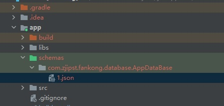

# 1. Room的Schema导出错误

## 1.1. 报错信息

在使用 Android Room数据库的时候，出现以下错误：

```
Schema export directory is not provided to the annotation processor so we cannot export the schema. You can either provide `room.schemaLocation` annotation processor argument OR set exportSchema to false.
```

## 1.2. 错误原因

在编译时，Room 会将数据库的 schema 信息导出为 JSON 文件，也就是说默认 `exportSchema = true` 。要导出 schema，还需要在 `build.gradle` 文件中设置 `room.schemaLocation`——json存放的位置。

我们没有通过 `exportSchema = false` 设置不导出 schema，所以就会导出 schema 。但我们有没有在 gradle 文件中设置导出路径，所以构建时就会报错。

## 1.3. 解决方案

解决方案有两种

### 1.3.1. 方案1：修改注解

给 RoomDatabase 设置 exportSchema 注解为 false。默认是 true

```kotlin
@Database(entities = [TableItem::class], version = 1,exportSchema = false)
abstract class AppDataBase : RoomDatabase() {

abstract fun tableItemDao(): TableItemDao
```

### 1.3.2. 方案2：修改 gradle

在 app 的 build.gradle 中添加导出信息（module 层级的 gradle 文件中添加）。

java 环境和 kotlin 环境的配置语法不同。

```groovy
android {
    defaultConfig {
        //... 其他内容省略
        // java 环境的配置方式：指定 room.schemaLocation 生成的文件路径
        javaCompileOptions {
            annotationProcessorOptions {
                arguments += ["room.schemaLocation": "$projectDir/schemas".toString()]
           }
        }

        // kotlin 环境的配置方式：指定room.schemaLocation生成的文件路径
        kapt {
            arguments {
                arg("room.schemaLocation", "$projectDir/schemas")
            }
        }
    }
}
```

## 1.4. 导出的 schema

配置完，编译完后，会在以下目录生成数据的json结构文件：



## 1.5. 参考：

* [原文：Android jetpack Room 的 Schema export Error](https://zhuanlan.zhihu.com/p/421343169)
* [官方文档：导出架构](https://developer.android.google.cn/training/data-storage/room/migrating-db-versions#export-schema)