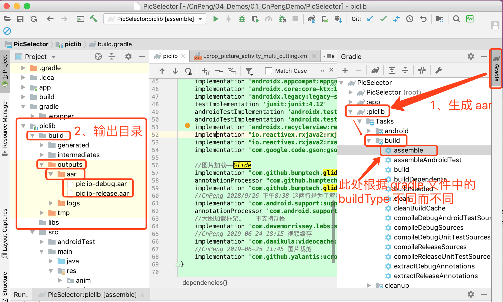

## 一、生成 aar 文件

* 新建 module library , 并编写想要封装的代码
* 然后按照下图操作



> jar 和 aar 的区别在于，aar 会打包 res 下的文件，如果要封装的代码中不牵涉 res ，则可以使用 jar 


## 二、aar 文件的坑

通过 gradle 中的 `assmble` 命令生成 `aar` 时，`build.gradle` 中通过 `implemention` 依赖的三方库并没有打包进 `aar` 中，项目引用时必须再引用一次。


## 三、项目中引用 aar

项目中引用 aar 文件时有两种方式，一种是直接引用 `aar` 文件，一种是将 aar 发布到远程之后引用。

### 1、直接引用 .aar 文件

导入步骤

* 先将 `aar` 文件放到 `libs` 目录，
* 然后在当前 `module` 中 `gradle` 文件的 `android` 节点中增加如下内容：

```xml
//这个必须要有
repositories {
    flatDir {
        dirs 'libs'
    }
}

//CnPeng 2019-06-25 19:20 图片选择库需要使用。
//这个表示 java 版本，依据个人项目情况，大部分不需要，但我的需要
compileOptions {
    sourceCompatibility 1.8
    targetCompatibility 1.8
}
```

* 然后在 `dependencies` 节点中增加对 `aar` 文件的依赖：

> 此处以自己封装的 `piclib-release.aar` 为例

```xml
// 这一句最核心
implementation(name:'piclib-release', ext:'aar')
```


* 由于生成 `aar` 文件时并不会把 `gradle` 中的 `implemention` 依赖的三方库打包，所以，必须增加 `module library` 中所需要的引用，在 piclib 中需要的 依赖如下：

> 此处需要依赖的内容以自己实际需求为准，下面只代表我封装的  `piclib` 中所需要的内容。
 
```xml
//CnPeng 2019-06-25 19:20 以下都是图片选择库需要使用，因为 aar 中没有打包 build.gradle 中使用的依赖项
implementation "io.reactivex.rxjava2:rxjava:2.2.0"
implementation "io.reactivex.rxjava2:rxandroid:2.0.1"
implementation 'com.github.yalantis:ucrop:2.2.3'
//图片加载——Glide
implementation "com.github.bumptech.glide:glide:4.9.0"
annotationProcessor "com.github.bumptech.glide:compiler:4.9.0"
implementation "com.github.bumptech.glide:okhttp3-integration:4.9.0"
//CnPeng 2018/9/26 下午8:38 这两行是为了解决 https://github.com/bumptech/glide/issues/3185 ——Glide 中的注解还没有完全兼容androidx
implementation 'com.android.support:support-annotations:28.0.0'
annotationProcessor 'com.android.support:support-annotations:28.0.0'
//大图加载框架。—— 不支持动图
implementation 'com.davemorrissey.labs:subsampling-scale-image-view:3.10.0'
//CnPeng 2019-06-24 18:15 视频缓存
implementation 'com.danikula:videocache:2.7.1'
//CnPeng 2019-06-25 11:45 图片裁剪
implementation 'com.github.yalantis:ucrop:2.2.3'
```

### 2、将 aar 发布到网络并引用

[点击跳转到 《2、发布到网络并引用》 ](2、将aar发布到网络.md)

