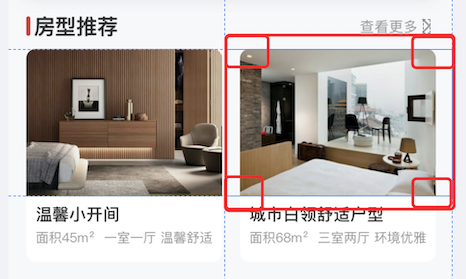

## 1. 部分圆角的实现调研

### 1.1. 需求效果

如下图，需要实现上半部分圆角，下班部分直角的效果，而且是在列表中。

### 1.2. 调研点

* 是否支持圆角
* 是否支持部分圆角
* 单一 ImageView 的情况
* ImageView 作为 ListView 或者 RecyclerView 的条目的情况
* 使用 srt 本地图的情况（或者对应 set方法）
* 加载远程 url 的情况

### 1.3. 不好使的方案

> 基于列表且是远程 url 的情况

* [NiceImageView/issues/22](https://github.com/SheHuan/NiceImageView/issues/22)——圆角图片，实测在 Android 9 之后不生效，即便使用了 issues 中的方法重置 path 也不行.
    * [关联文章：《Android 圆角、圆形 ImageView 实现》](https://www.jianshu.com/p/9016ecf1d213)
* [QMUIRadiusImageView](https://github.com/Tencent/QMUI_Android/issues?q=QMUIRadiusImageView)——v1 版本能实现圆角，但没有部分圆角的方案；v2 版本虽然有部分直角的 attr 属性，但是实测不生效。（
    * 关联：[QMUI使用简介](https://qmuiteam.com/android/get-started)

### 1.4. 待调研的方案

* Glide 的 transform 方案是否可行？
    * [Android Glide自定义圆角处理](https://www.iteye.com/blog/ch-kexin-2520198)
* youth.banner 中的 banner 圆角是怎么实现的？
* 全部圆角，然后下方视图使用负的 margin 值上移圆角 radius 值（理论上可行，但是效率不大好吧？）
* canvas.clipPath() 是否可行？
    *  [android Imageview 随心所欲定制四个圆角](https://blog.csdn.net/ml_android/article/details/83065042)——列表中也不好使，我们的 home_info_image_info.xml 有问题？

## 2. 历史整理

2021-11-24 之前摘录的文章

---

* [Android圆角图片和圆形图片实现总结](https://blog.csdn.net/xiaohanluo/article/details/52945791)

* [http://www.111cn.net/sj/android/74911.htm](http://www.111cn.net/sj/android/74911.htm)
* [http://www.111cn.net/sj/android/74912.htm](http://www.111cn.net/sj/android/74912.htm)
* [Android CircleImageView圆形ImageView](https://blog.csdn.net/zhangphil/article/details/52130212)
* [Andorid显示圆形图片的4种方式](https://segmentfault.com/a/1190000012253911)
* [Android 圆角、圆形 ImageView 实现](https://juejin.im/post/5b305f73f265da59b653b08d)
* [自定义圆形图片、可控位置圆角图片](https://blog.csdn.net/u011102153/article/details/52289393)
* [RoundedBitmapDrawable最简单方式实现圆角图片(一)](https://blog.csdn.net/kieCool/article/details/78252071)

---

* [Android自定义View【实战教程】4⃣️----BitmapShader详解及圆形、圆角、多边形实现](https://blog.csdn.net/github_33304260/article/details/70142115)
* [Android学习笔记进阶16之BitmapShader](https://blog.csdn.net/sjf0115/article/details/7267532)
* [Android BitmapShader 实战 实现圆形、圆角图片](https://blog.csdn.net/lmj623565791/article/details/41967509)
* [Android Xfermode 实战 实现圆形、圆角图片](https://blog.csdn.net/lmj623565791/article/details/42094215)