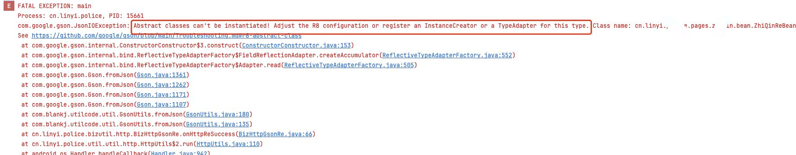
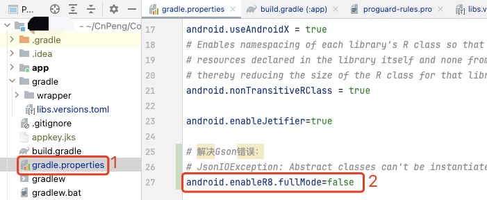

# 1. 项目开启混淆后的Gson问题解决


AndroidStudio 版本：Android Studio Jellyfish | 2023.3.1 Patch 1
AGP 版本：8.4.1

## 1.1. 问题：Abstract classes can't be instantiated

release 模式下开启了代码混淆，然后就会遇见该问题。（ 虽然将需要 Gson 转换的类都标记为不混淆可以避免该问题，但这样明显不安全啊，还是要研究正规解决办法的。）

### 1.1.1. 现象

* 错误信息：

```
com.google.gson.JsonIOException: Abstract classes can't be instantiated! Adjust the R8 configuration or register an InstanceCreator or a TypeAdapter for this type. 
```

* 报错截图：



### 1.1.2. 原因

利用 gson 解析数据模型的时候，提示这个错误，但类也不是 abstrac t的，这个问题是因为升级了 gradle 8.0+，开启了全量的 R8。


### 1.1.3. 解决

在项目根目录下的 `gradle.properties` 文件中添加如下内容：

```groovy
android.enableR8.fullMode=false
```

示意图如下：



使用这种方式解决虽然会损失构建速度和包体积，但起码是安全的。


## 1.2. 关于R8

在 Android 开发中，`android.enableR8.fullMode=false` 这条配置是在 `build.gradle` 文件中设置的，它用于控制 R8 代码混淆器的工作模式。

### 1.2.1. R8 概述

R8 是 Android Studio 和 Gradle 插件默认使用的代码混淆和优化工具，它是 ProGuard 的替代品。R8 提供了更快的构建速度和更好的代码优化能力。

### 1.2.2. fullMode 和 minifyEnabled

R8 有两种主要的工作模式：full mode 和 minify mode。这两种模式的区别在于它们执行的优化级别不同。

- **minify mode**：只执行基本的混淆操作，如重命名类和方法名等。
- **full mode**：执行更深层次的优化，如死代码消除、内联方法等。

### 1.2.3. android.enableR8.fullMode=false

当你在 `build.gradle` 文件中设置 `android.enableR8.fullMode=false` 时，你告诉 R8 不要在构建过程中启用 full mode。这意味着 R8 将只执行 minify mode 下的操作，即基本的混淆而不会执行更深层次的优化。

### 1.2.4. 影响

1. **构建速度**：由于 full mode 执行了更多的优化，所以构建时间可能会更长。设置 `android.enableR8.fullMode=false` 可以加快构建速度，尤其是在开发阶段。

2. **代码大小**：full mode 通常能够减小 APK 的大小，因为它会去除不必要的代码。如果你禁用了 full mode，APK 的大小可能会略微增加。

3. **性能**：full mode 的优化有时可以提高应用程序的运行时性能，因为它会移除未使用的代码和方法。禁用 full mode 可能会导致应用程序性能略有下降。

4. **调试**：full mode 的优化可能导致调试更加困难，因为它会对代码进行更深层次的修改。禁用 full mode 可能会使调试更容易一些。

### 1.2.5. 示例配置

在 `build.gradle` 文件中，你可以在 `buildTypes` 配置块内设置 `android.enableR8.fullMode`，如下所示：

```groovy
android {
    ...
    buildTypes {
        release {
            ...
            // 设置 R8 工作模式
            android.enableR8.fullMode = false
            // 启用或禁用混淆
            minifyEnabled true
            proguardFiles getDefaultProguardFile('proguard-android-optimize.txt'), 'proguard-rules.pro'
        }
    }
}
```

### 1.2.6. 总结

设置 `android.enableR8.fullMode=false` 主要是为了加快构建速度，尤其是在开发阶段。如果你希望在发布版本中获得更小的 APK 和潜在的性能提升，你可能需要启用 full mode。然而，在开发过程中禁用 full mode 可以加速构建过程，同时使调试更容易。

## 1.3. 关联问题

虽然添加 `android.enableR8.fullMode=false` 后解决了问题，但毕竟有性能损失。后续可以持续关注以下两个文档，以确定是否有更合适的解决办法。

* [com.google.gson.JsonIOException: Abstract classes can't be instantiated! Register an InstanceCreator or a TypeAdapter for this type. #2379](https://github.com/google/gson/issues/2379)

* [Stackoverflow：Proguard Missing classes detected while running R8 after adding package names in proguard-rules.pro](https://stackoverflow.com/questions/70037537/proguard-missing-classes-detected-while-running-r8-after-adding-package-names-in#)

