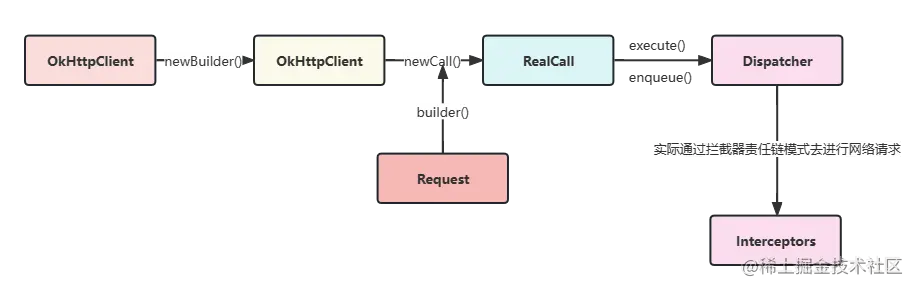
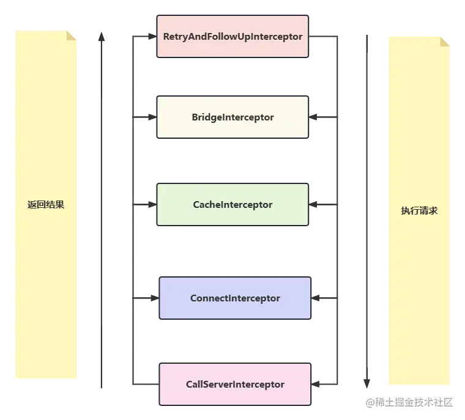
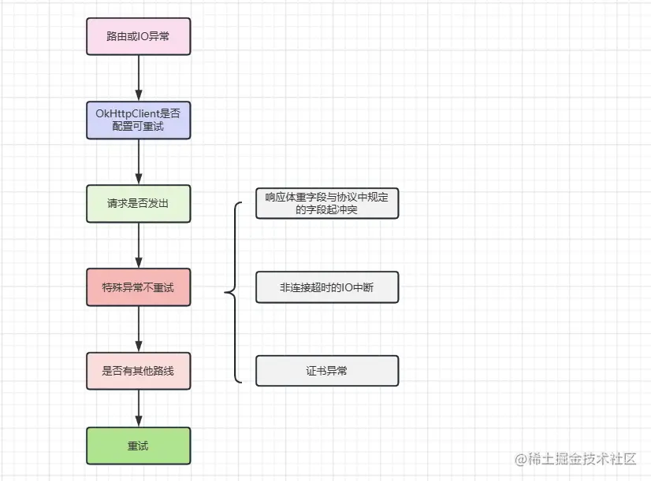
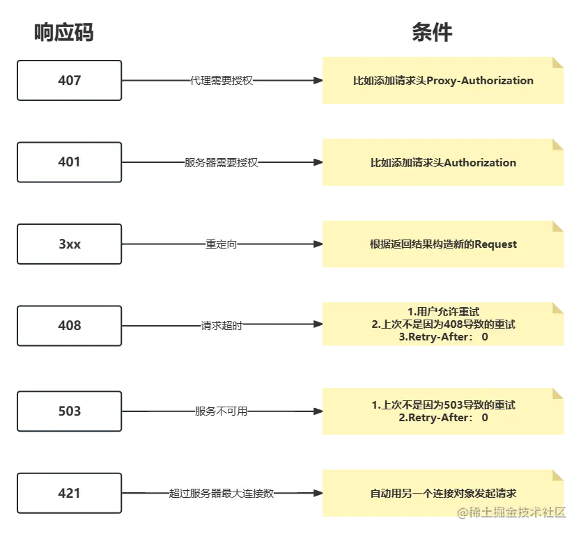
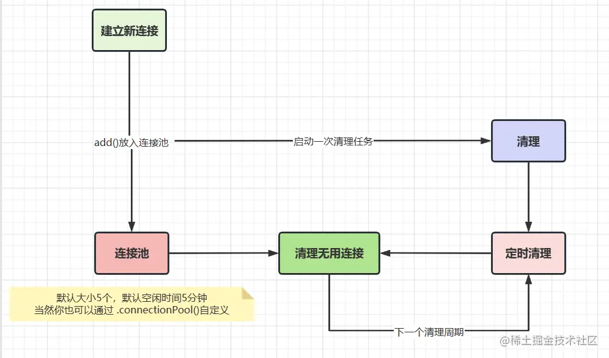
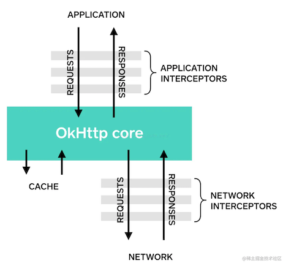

# 1. 001-OkHttp4网络请求库全面解析

[原文：官方推荐使用的OkHttp4网络请求库全面解析！](https://juejin.cn/post/7212536164057776184?utm_source=gold_browser_extension#heading-1)

> CnPeng：要点总结
> 
> * 一个call对象只能执行一次execute方法 
> 

## 1.1. 前言

现在谈起网络请求，大家肯定下意识想到的就是 okhttp 或者 retrofit 这样的三方请求库。诚然，现在有越来越多的三方库帮助着我们快速开发，但是对于现在的程序员来说，我们不仅要学会如何去用，更重要的是要清楚里面的原理，了解里面的思想，最后转化到我们自己的实际代码中去。
⚡ okhttp 使用起来还是比较方便，优点也有很多：支持GZIP压缩，连接池复用底层TCP，请求自动重试重定向...
现在 Google官方 也将源码当中的 HttpURLConnection 底层实现改成 okhttp 了，同时 retrofit 的底层也是 okhttp，足以说明其在日常开发中的重要性。现在我们正式进入今天的正题。


>OkHttp版本：4.0.1 ----> 注意此版本起是Kotlin版本哦

## 1.2. okhttp的基本使用流程

### 1.2.1. 创建 client

```java
// 1.创建client
OkHttpClient client = new OkHttpClient().newBuilder()
        .cookieJar(CookieJar.NO_COOKIES)
        .callTimeout(10000, TimeUnit.MILLISECONDS)
        .build();
```

### 1.2.2. 创建request

```java
// 2.创建request
Request request = new Request.Builder()
        .url("http://10.34.12.156:68080/admin-api")
        .addHeader("Content-Type", "application/json")
        .get();
        .build();
```

### 1.2.3. 构建call对象

```java
// 3.构建call对象
Call call = client.newCall(request);
```

### 1.2.4. 执行请求

```java
// 4.1调用call对象的同步请求方法
Response response = call.execute();// response对象中保存的有返回的响应参数

// 4.2调用call对象的异步请求方法
call.enqueue(new Callback() {
    @Override
    public void onFailure(@NonNull Call call, @NonNull IOException e) {
        Log.d(TAG, "onFailure: ");// 失败回调
    }

    @Override
    public void onResponse(@NonNull Call call, @NonNull Response response) {
        Log.d(TAG, "onResponse: ");// 成功回调
    }
});
```


okhttp 的好处就在于，我们完成一次网络请求最少只需要接触 `OkHttpClient` `，Request` ， `Call` 这三个对象，显然是很轻松的。

此外还需强调一点，`OkHttpClient` 和 `Request` 都是通过建造者模式构建的，这样的好处就在于用户可以根据自己的需求轻松简洁的配置一些可选参数，而不必通过传统方式将不需要的参数写成 null 。

## 1.3. 同步请求和异步请求的流程

### 1.3.1. 同步请求的执行流程

#### 1.3.1.1. OkhttpClient.newCall()

我们将 OkhttpClient 中的 `newCall()` 作为入口，开启整个同步请求的过程。

```kotlin
// OkHttpClient.kt
// 这里是构建一个 RealCall 对象
override fun newCall(request: Request): Call = RealCall(this, request, forWebSocket = false)
```

`RealCall` 实现了 `Call` 接口，我们先来看看 `Call` 接口长什么样。

```kotlin
// Call.kt
interface Call : Cloneable {

  // 同步请求方法
  @Throws(IOException::class)
  fun execute(): Response

  // 异步请求方法
  fun enqueue(responseCallback: Callback)

  // OkHttpClient实现了Factory接口
  // 所以才有newCall方法
  fun interface Factory {
    fun newCall(request: Request): Call
  }
}
```

#### 1.3.1.2. ReadCall.execute()

现在我们通过 `newCall()` 得到了一个 `RealCall` 对象，然后就能通过 `RealCall` 当中的 `execute()` 和 `enqueue()` 进行网络请求。

```kotlin
// RealCall.kt
override fun execute(): Response {

  // 一个call对象只能执行一次execute方法 
  // 这里用CAS思想进行比较，可以提高效率
  check(executed.compareAndSet(false, true)) { "Already Executed" }

  timeout.enter()
  // 这里主要是个监听器，表示开始进行网络请求了
  callStart()
  // 重点关注这块
  try {
    // 通过分发器进行任务分发
    // 其实这里还体现不出分发器的效果，仅仅是将当前请求加入到一个同步队列当中
    client.dispatcher.executed(this)
    // 通过 getResponseWithInterceptorChain() 获得相应结果
    return getResponseWithInterceptorChain()
  } finally {
    // 完成一些收尾工作，在同步请求中，几乎没什么用
    client.dispatcher.finished(this)
  }
}
```

#### 1.3.1.3. Dispatcher.executed()

现在来看看同步请求中分发器做了什么工作呢？

```kotlin
// Dispatcher.kt

// 正在执行的同步请求队列
private val runningSyncCalls = ArrayDeque<RealCall>()

// 简单的将当前请求加入到同步请求队列中
@Synchronized internal fun executed(call: RealCall) {
  runningSyncCalls.add(call)
}

// finish方法 --> 前面说的收尾工作方法
// 但是在同步请求中用处不大
internal fun finished(call: RealCall) {
  finished(runningSyncCalls, call)
}

private fun <T> finished(calls: Deque<T>, call: T) {
  // 顾名思义，分发器空闲时得回调
  val idleCallback: Runnable?
  synchronized(this) {
    // 对于完成请求的 call ，在这里移除掉
    if (!calls.remove(call)) throw AssertionError("Call wasn't in-flight!")
    idleCallback = this.idleCallback
  }

  // 这里是进行收尾工作的
  // 主要体现在异步请求中，因此这个方法先放一放
  val isRunning = promoteAndExecute()

  // 进行空闲回调方法
  if (!isRunning && idleCallback != null) {
    idleCallback.run()
  }
}
```


可以看到，在整个同步请求的过程中，分发器仅仅是将当前的请求加入到一个同步请求队列中，请求完成后再将其移除。

因为在同步请求中 `finished()` 方法只有一个回调作用，因此我们将它放一放，重点看一看异步请求中的 `finished()`。

### 1.3.2. 异步请求的执行流程

#### 1.3.2.1. RealCall.enqueue()

异步请求就比同步请求稍微复杂了一点，我们仍然是从 `RealCall` 中看起。

```kotlin
// RealCall.kt

override fun enqueue(responseCallback: Callback) {
  // 一个call对象只能执行一次execute方法
  // 这里用CAS思想进行比较，可以提高效率
  check(executed.compareAndSet(false, true)) { "Already Executed" }

  // 这里面依旧加上了监听
  callStart()

  // 构建一个 AsyncCall对象，再交给dispatcher进行分发流程
  client.dispatcher.enqueue(AsyncCall(responseCallback))
}
```

#### 1.3.2.2. RealCall.AsyncCall

`AsyncCall` 是 `RealCall` 的内部类， 它实现了 `Runnable` 接口，主要是为了能在线程池中去执行它的 `run()` 方法。

```kotlin
// RealCall.kt

internal inner class AsyncCall(
  private val responseCallback: Callback
) : Runnable {
  @Volatile var callsPerHost = AtomicInteger(0)
    private set

  fun reuseCallsPerHostFrom(other: AsyncCall) {
    // callPerHost代表了连接同一个host的连接数
    // 此连接数必须小于5
    this.callsPerHost = other.callsPerHost
  }

  val host: String
    get() = originalRequest.url.host

  val request: Request
      get() = originalRequest

  val call: RealCall
      get() = this@RealCall

  // 将asyncCall添加到线程池中去执行的方法
  fun executeOn(executorService: ExecutorService) {
    client.dispatcher.assertThreadDoesntHoldLock()

    var success = false
    try {
      // 线程池去执行当前AsyncCall对象的run方法
      executorService.execute(this)
      success = true
    } catch (e: RejectedExecutionException) {
      val ioException = InterruptedIOException("executor rejected")
      ioException.initCause(e)
      noMoreExchanges(ioException)
      responseCallback.onFailure(this@RealCall, ioException)
    } finally {
      if (!success) {
        // 收尾工作
        // 其实内部调用的是 promoteAndExecute()
        client.dispatcher.finished(this)
      }
    }
  }

  override fun run() {
    threadName("OkHttp ${redactedUrl()}") {
      var signalledCallback = false
      timeout.enter()
      try {
        // getResponseWithInterceptorChain() 获得请求的响应结果
        val response = getResponseWithInterceptorChain()
        signalledCallback = true
        // 请求成功的回调
        responseCallback.onResponse(this@RealCall, response)
      } catch (e: IOException) {
        if (signalledCallback) {
          Platform.get().log("Callback failure for ${toLoggableString()}", Platform.INFO, e)
        } else {
          responseCallback.onFailure(this@RealCall, e)
        }
      } catch (t: Throwable) {
        cancel()
        if (!signalledCallback) {
          val canceledException = IOException("canceled due to $t")
          canceledException.addSuppressed(t)
          // 请求失败的回调
          responseCallback.onFailure(this@RealCall, canceledException)
        }
        throw t
      } finally {
        // 进行收尾工作
        // 相比同步请求的finished方法，这儿更重要
        client.dispatcher.finished(this)
      }
    }
  }
}
```

#### 1.3.2.3. Dispatcher.enqueue()

现在我们回到 `Dispatcher` 中去。

```kotlin
// Dispatcher.kt

// 准备执行的异步请求队列
private val readyAsyncCalls = ArrayDeque<AsyncCall>()

// 正在执行的异步请求队列
private val runningAsyncCalls = ArrayDeque<AsyncCall>()

internal fun enqueue(call: AsyncCall) {
  synchronized(this) {
    // 将当前asyncCall加到准备执行的异步请求队列中
    readyAsyncCalls.add(call)

    if (!call.call.forWebSocket) {
      // 这里是得到连接同一个 host 的请求数
      val existingCall = findExistingCallWithHost(call.host)
      if (existingCall != null) call.reuseCallsPerHostFrom(existingCall)
    }
  }
  // dispatcher进行分发call任务的方法
  promoteAndExecute()
}

// 关键方法，dispatcher进行任务分发的方法
// 进行收尾工作时，也是调用的它
private fun promoteAndExecute(): Boolean {
  this.assertThreadDoesntHoldLock()
  // 需要开始执行的任务集合
  val executableCalls = mutableListOf<AsyncCall>()
  val isRunning: Boolean
  synchronized(this) {
    val i = readyAsyncCalls.iterator()
    // 迭代等待执行异步请求
    while (i.hasNext()) {
      val asyncCall = i.next()
      // 正在执行异步请求的总任务数不能大于64个
      // 否则直接退出这个循环，不再将请求加到异步请求队列中
      if (runningAsyncCalls.size >= this.maxRequests) break 
      // 同一个host的请求数不能大于5
      // 否则直接跳过此call对象的添加，去遍历下一个asyncCall对象
      if (asyncCall.callsPerHost.get() >= this.maxRequestsPerHost) continue

      i.remove()
      // 如果拿到了符合条件的asyncCall对象，就将其callPerHost值加1
      // callPerHost代表了连接同一个host的数量
      asyncCall.callsPerHost.incrementAndGet()
      // 加到需要开始执行的任务集合中
      executableCalls.add(asyncCall)
      // 将当前call加到正在执行的异步队列当中
      runningAsyncCalls.add(asyncCall)
    }
    isRunning = runningCallsCount() > 0
  }

  for (i in 0 until executableCalls.size) {
    // 遍历每一个集合中的asyncCall对象
    // 将其添加到线程池中，执行它的run方法
    val asyncCall = executableCalls[i]
    asyncCall.executeOn(executorService)
  }

  return isRunning
}
```

现在我们通过 `Dispatcher` 将 `AsyncCall` 对象通过挑选，加到了线程池中。挑选的限制有两个：

* 当前执行的总请求数要小于64个。
* 对于连接的同一个 host 请求，要保证数量小于5。

#### 1.3.2.4. AsyncCall.executeOn()

现在，我们再回头看看将 `AsyncCall` 对象加到线程池后的一些细节吧！

```kotlin
// Dispatcher.kt

  // 将asyncCall添加到线程池中去执行的方法
  fun executeOn(executorService: ExecutorService) {
    client.dispatcher.assertThreadDoesntHoldLock()

    var success = false
    try {
      // 这里是之前自定义了创建了一个ExecutorService
      executorService.execute(this)
      success = true
    } catch (e: RejectedExecutionException) {
      val ioException = InterruptedIOException("executor rejected")
      ioException.initCause(e)
      noMoreExchanges(ioException)
      responseCallback.onFailure(this@RealCall, ioException)
    } finally {
      if (!success) {
        // 这里也是会执行收尾工作
        client.dispatcher.finished(this)
      }
    }
  }

@get:JvmName("executorService") val executorService: ExecutorService
  get() {
    if (executorServiceOrNull == null) {
      // !!这里的corePoolSize是 0
      // !!阻塞队列是 SynchronousQueue
      executorServiceOrNull = ThreadPoolExecutor(0, Int.MAX_VALUE, 60, TimeUnit.SECONDS,
          SynchronousQueue(), threadFactory("$okHttpName Dispatcher", false))
    }
    return executorServiceOrNull!!
  }
```


我们先来看 `executeOn()` 方法，它的主要工作就是执行添加到线程池的 `AsyncCall` 对象的 `run()` 方法，去进行网络请求。其次我们目光移动到 `finally` 语句块，会发现每次执行完 `run()` 方法后，即完成网络请求后，都会去执行这个 `finished()` 方法。前面讲到过，内部其实是再次调用了 `promoteAndExecute()` 方法。那这是为什么呢？

还记得到我们从准备执行的异步队列中挑选一些 `AsyncCall` 对象拿到线程池中执行吗？如果记得，那你是否还记得我们是有挑选条件的，正因如此，可能在准备执行的异步请求队列中会有一些 `AsyncCall` 对象不满足条件仍然留在队列里！那我们难道最后就不执行这些网络请求了吗？当然不是！原来每完成一次网络请求就会再次触发 `Dispatcher` 去分发 `AsyncCall` 对象！原来如此。

然后我们再来看看这里用到的线程池是一个什么样的线程池。在上面我贴出来的代码中可以看到，这个线程池的 `corePoolSize` 是 0， `BlockingQueue` 是 `SynchronousQueue` ，这样构建出来的线程池有什么特殊之处吗？熟悉线程池的同学都应该知道，当任务数超过了 `corePoolSize` 就会将其加到阻塞队列当中。也就是说这些任务不会立马执行，而我们的网络请求可不想被阻塞着，因此这里的 `corePoolSize` 就设置成了 0。 `BlockingQueue` 设置成 `SynchronousQueue` 也是类似道理， `SynchronousQueue` 是不储存元素的，只要提交的任务数小于最大线程数就会立刻新起线程去执行任务。

### 1.3.3. okhttp网络请求执行过程总结

总结一下整个 okhttp 网络请求的整个过程。

首先通过我们通过 **构造者** 的方式构建好了 `OkHttpClient` 和 `Request` 对象，然后调用 `OkHttpClient` 对象的 `newCall()` 方法得到一个 `RealCall` 对象，最后再调用其 `execute()` 或者 `enqueue()` 方法进行同步或者异步请求。



然后如果是同步请求， `Dispatacher` 分发器去只是简单的将其加入到正在执行的同步请求队列中做一个标记，如果是异步请求就会根据 两个条件 去筛选合适的请求，并将其发送给一个特定的线程池中去进行网络请求，最后通过 `getResponseWithInterceptorChain()` 得到最终结果。

## 1.4. 请求任务之五大拦截器各司其职

okhttp 的又一大特点是整个请求流程是由五大拦截器一层层分发下去，最后得到结果再一层层返回上来。就像这样：




okhttp 内置了五大拦截器，这五大拦截器各司其职，通过 **责任链模式** 将请求逐层分发下去，每层完成自己这层该做的事，最后拿到相应结果逐层往上返回结果：

* `RetryAndFollowUpInterceptor` ：请求失败自动重试，如果 `DNS` 设置了多个ip地址会自动重试其余ip地址。
* `BridgeInterceptor` ：会补全我们请求中的请求头，例如 Host ， Cookie ， Accept-Encoding 等。
* `CacheInterceptor` ：会选择性的将响应结果进行保存，以便下次直接读取，不再需要再向服务器索要数据。
* `ConnectInterceptor` ：建立连接并得到对应的 socket ；管理连接池，从中存取连接，以便达到连接复用的目的。
* `CallServerInterceptor` ：与服务器建立连接，具体进行网络请求，并将结果逐层返回的地方。

>注意：这五个是系统内置的拦截器，我们也可以通过 `addInterceptor()` 加入我们自己写的拦截器，后面会提到。


现在我们从开启拦截器的入口函数 `getResponseWithInterceptorChain()` 看起，

```kotlin
/ RealCall.kt

// 五大拦截器的起始入口
@Throws(IOException::class)
internal fun getResponseWithInterceptorChain(): Response {
  // 用一个集合保存所有的拦截器
  val interceptors = mutableListOf<Interceptor>()

  // 这个interceptor就是我们自己可以加的第一个拦截器
  // 因为位于所有拦截器的第一个，与我们的应用直接相连
  // 因此这个拦截器又被称为 Application Interceptor
  interceptors += client.interceptors
  
  // 重试重定向拦截器
  interceptors += RetryAndFollowUpInterceptor(client)
  // 桥接拦截器
  interceptors += BridgeInterceptor(client.cookieJar)
  // 缓存拦截器
  interceptors += CacheInterceptor(client.cache)
  // 连接拦截器
  interceptors += ConnectInterceptor
  if (!forWebSocket) {
    // 这个interceptor也是我们自己可以加的一个拦截器
    // 因为位于真正请求返回结果的拦截器前面，可以拿到服务器返回的最原始的结果
    // 因此这个拦截器又被称为 Network Interceptor
    interceptors += client.networkInterceptors
  }
  interceptors += CallServerInterceptor(forWebSocket)

  // 构建 RealInterceptorChain 对象，我们正是通过此对象将请求逐层往下传递的
  val chain = RealInterceptorChain(
      call = this,
      interceptors = interceptors,
      index = 0,
      exchange = null,
      request = originalRequest,
      connectTimeoutMillis = client.connectTimeoutMillis,
      readTimeoutMillis = client.readTimeoutMillis,
      writeTimeoutMillis = client.writeTimeoutMillis
  )

  var calledNoMoreExchanges = false
  try {
    // 调用RealInterceptorChain的proceed()方法，将请求向下一个连接器传递
    val response = chain.proceed(originalRequest)
    if (isCanceled()) {
      response.closeQuietly()
      throw IOException("Canceled")
    }
    // 放回响应结果
    return response
  } catch (e: IOException) {
    calledNoMoreExchanges = true
    throw noMoreExchanges(e) as Throwable
  } finally {
    if (!calledNoMoreExchanges) {
      noMoreExchanges(null)
    }
  }
}
```

从这个方法中我们大概可以总结出，**它将所有的拦截器包括用户自定义的拦截器全部通过一个集合保存了下来**，然后构建出了 `RealInterceptorChain` 对象，并调用其 `proceed()` 方法开始了拦截器逐层分发工作。

那么它是怎么做到逐层分发的呢？其实很简单，每一个拦截器中都会通过 `proceed()` 方法再构建一个 `RealInterceptorChain` 对象，然后调用 `intercpt` 去执行下个拦截器中的任务，如此循环，最终走到最后一个拦截器后退出。

```kotlin
// RealInterceptorChain.kt -----> 实现了 Chain 接口

override fun proceed(request: Request): Response {
  // 检查是否走完了所有的拦截器，是则退出
  check(index < interceptors.size

  ...
  // 这个方法就是再次构建了 RealInterceptorChain 对象 ==> next
  // 去执行下个拦截器中的任务
  val next = copy(index = index + 1, request = request)// 这个方法内部就一行代码 new RealInterceptorChain()
  val interceptor = interceptors[index]

  @Suppress("USELESS_ELVIS")
  // 通过调用intercept(next)去执行下一个拦截器中的任务
  val response = interceptor.intercept(next) ?: throw NullPointerException(
      "interceptor $interceptor returned null")
  ...
  // 将结果放回到上一个拦截器中
  return response
}
```

以上我们搞清楚了拦截器是如何一步一步往下传递任务，并逐层往上返回结果的，现在我们来具体看看每个拦截器都做了什么事情。

### 1.4.1. RetryAndFollowUpInterceptor拦截器

```kotlin
// RetryAndFollowUpInterceptor.kt
// 所有拦截求都实现了 Interceptor 接口

override fun intercept(chain: Interceptor.Chain): Response {
  val realChain = chain as RealInterceptorChain
  var request = chain.request
  val call = realChain.call
  var followUpCount = 0
  var priorResponse: Response? = null
  var newExchangeFinder = true
  var recoveredFailures = listOf<IOException>()
  // 这是个死循环，意思就是如果请求失败就需要一直重试，直到主动退出循环(followUpCount>20)
  while (true) {
    // ExchangeFinder: 获取连接 ---> ConnectInterceptor中使用
    call.enterNetworkInterceptorExchange(request, newExchangeFinder)
    // 响应结果
    var response: Response
    var closeActiveExchange = true
    try {
      if (call.isCanceled()) {
        throw IOException("Canceled")
      }

      try {
        // 调用下一个拦截器，即 BridgeInterceptor
        // 整个请求可能会失败，需要捕获然后重试重定向，因此有一个try catch
        response = realChain.proceed(request)
        newExchangeFinder = true
      } catch (e: RouteException) { //1.进行重试
        // 1.1 路线异常，检查是否需要重试
        if (!recover(e.lastConnectException, call, request, requestSendStarted = false)) {
          throw e.firstConnectException.withSuppressed(recoveredFailures)
        } else {
          recoveredFailures += e.firstConnectException
        }
        newExchangeFinder = false
        // 失败继续重试
        continue
      } catch (e: IOException) {
        // 1.2 IO异常 HTTP2才会有ConnectionShutdownException 代表连接中断
        //如果是因为IO异常，那么requestSendStarted=true （若是HTTP2的连接中断异常仍然为false）
        if (!recover(e, call, request, requestSendStarted = e !is ConnectionShutdownException)) {
          throw e.withSuppressed(recoveredFailures)
        } else {
          recoveredFailures += e
        }
        newExchangeFinder = false
        // 失败继续重试
        continue
      }

      // priorResponse：上一次请求的响应
      if (priorResponse != null) {
        response = response.newBuilder()
            .priorResponse(priorResponse.newBuilder()
                .body(null)
                .build())
            .build()
      }

      val exchange = call.interceptorScopedExchange
      // 2.根据返回的response进行重定向，构建新的Request对象
      val followUp = followUpRequest(response, exchange)

      // 2.1 followUp为空，代表没有重定向，直接返回结果response
      if (followUp == null) {
        if (exchange != null && exchange.isDuplex) {
          call.timeoutEarlyExit()
        }
        closeActiveExchange = false
        return response
      }
      // 2.2 followUp不为空，但是body中设置了只能请求一次(默认)，返回重定向后的结果response
      val followUpBody = followUp.body
      if (followUpBody != null && followUpBody.isOneShot()) {
        closeActiveExchange = false
        return response
      }

      // 重试次数大于20次，抛出异常
      if (++followUpCount > MAX_FOLLOW_UPS) {
        throw ProtocolException("Too many follow-up requests: $followUpCount")
      }

      // 将之前重定向后的Request对象赋值给request进行重新请求
      request = followUp
      priorResponse = response
    } finally {
      call.exitNetworkInterceptorExchange(closeActiveExchange)
    }
  }
}
```

简单来说， `RetryAndFollowUpInterceptor` 拦截器帮我们干了两件事。第一是重试，第二是重定向。

我们先来看看什么情况下它会进行重试。

```kotlin
// RetryAndFollowUpInterceptor.kt

// 这个方法就是来判断当前请求是否需要重试的
private fun recover(
  e: IOException,
  call: RealCall,
  userRequest: Request,
  requestSendStarted: Boolean
): Boolean {
  // 构建OkHttpClient时配置不重试，则返回false
  if (!client.retryOnConnectionFailure) return false


  // 返回false
  // 1、如果是IO异常（非http2中断异常）表示请求可能发出
  // 2、如果请求体只能被使用一次（默认为false）
  if (requestSendStarted && requestIsOneShot(e, userRequest)) return false

  // 返回false
  // 协议异常、IO中断异常（除Socket读写超时之外），ssl认证异常
  if (!isRecoverable(e, requestSendStarted)) return false

  // 无更多的路线，返回false
  if (!call.retryAfterFailure()) return false

  // 以上情况都不是，则返回true 表示可以重试
  return true
}
```

这里画个图做个总结：



再来看看如何判断是否需要重定向的。

```kotlin
@Throws(IOException::class)
private fun followUpRequest(userResponse: Response, exchange: Exchange?): Request? {
  val route = exchange?.connection?.route()
  val responseCode = userResponse.code

  val method = userResponse.request.method
  when (responseCode) {
    // 407 代理需要授权，通过proxyAuthenticator获得request，向其中添加请求头 Proxy-Authorization
    // 然后构建一个新的request对象返回出去，准备再次请求
    HTTP_PROXY_AUTH -> {
      val selectedProxy = route!!.proxy
      if (selectedProxy.type() != Proxy.Type.HTTP) {
        throw ProtocolException("Received HTTP_PROXY_AUTH (407) code while not using proxy")
      }
      return client.proxyAuthenticator.authenticate(route, userResponse)
    }
    // 401 服务器请求需授权，通过authenticator获得到了Request，添加Authorization请求头
    // 然后构建一个新的request对象返回出去，准备再次请求
    HTTP_UNAUTHORIZED -> return client.authenticator.authenticate(route, userResponse)

    // 返回的响应码是3xx，这就准备进行重定向，构建新的Request对象
    HTTP_PERM_REDIRECT, HTTP_TEMP_REDIRECT, HTTP_MULT_CHOICE, HTTP_MOVED_PERM, HTTP_MOVED_TEMP, HTTP_SEE_OTHER -> {
      return buildRedirectRequest(userResponse, method)
    }

    // 408 请求超时
    HTTP_CLIENT_TIMEOUT -> {
      // 用户设置是否可以进行重试（默认允许）
      if (!client.retryOnConnectionFailure) {
        return null
      }

      val requestBody = userResponse.request.body
      if (requestBody != null && requestBody.isOneShot()) {
        return null
      }
      val priorResponse = userResponse.priorResponse
      // 如果上次也是因为408导致重试，这次请求又返回的408，则不会再去重试了，直接返回null
      if (priorResponse != null && priorResponse.code == HTTP_CLIENT_TIMEOUT) {
        return null
      }

      // 服务器返回的 Retry-After:0 或者未响应Retry-After就不会再次去请求
      if (retryAfter(userResponse, 0) > 0) {
        return null
      }

      // 返回当前的request对象，准备再次请求
      return userResponse.request
    }

    // 503 服务不可用
    HTTP_UNAVAILABLE -> {
      val priorResponse = userResponse.priorResponse
      // 和408相似，如果两次都是503导致请求重试，那么这次就不会再重试了，直接返回null
      if (priorResponse != null && priorResponse.code == HTTP_UNAVAILABLE) {
        return null
      }

      // 服务端返回的有Retry-After: 0，则立即重试
      if (retryAfter(userResponse, Integer.MAX_VALUE) == 0) {
        return userResponse.request
      }
      return null
    }

    // 421 当前客户端的IP地址连接到服务器的数量超过了服务器允许的范围
    HTTP_MISDIRECTED_REQUEST -> {
      val requestBody = userResponse.request.body

      if (requestBody != null && requestBody.isOneShot()) {
        return null
      }

      if (exchange == null || !exchange.isCoalescedConnection) {
        return null
      }

      // 使用另一个连接对象发起请求
      exchange.connection.noCoalescedConnections()
      return userResponse.request
    }

    else -> return null
  }
}
```

老规矩，依旧给大家画张图，便于理解。



### 1.4.2. .BridgeInterceptor拦截器

接下来，来到第二个拦截器 `BridgeInterceptor` 。这个拦截器前面说过，主要就是用来补全请求头的，除此之外就是如果响应头中有 `Content-Encoding: gzip` ，则会用 `GzipSource` 进行解析。

```kotlin
// BridgeInterceptor.kt

class BridgeInterceptor(private val cookieJar: CookieJar) : Interceptor {

  @Throws(IOException::class)
  override fun intercept(chain: Interceptor.Chain): Response {
    val userRequest = chain.request()
    val requestBuilder = userRequest.newBuilder()

    // 这里没有什么多说的，就是补全请求头
    val body = userRequest.body
    if (body != null) {
      val contentType = body.contentType()
      if (contentType != null) {
        requestBuilder.header("Content-Type", contentType.toString())
      }

      val contentLength = body.contentLength()
      if (contentLength != -1L) {
        requestBuilder.header("Content-Length", contentLength.toString())
        requestBuilder.removeHeader("Transfer-Encoding")
      } else {
        requestBuilder.header("Transfer-Encoding", "chunked")
        requestBuilder.removeHeader("Content-Length")
      }
    }

    if (userRequest.header("Host") == null) {
      requestBuilder.header("Host", userRequest.url.toHostHeader())
    }

    if (userRequest.header("Connection") == null) {
      requestBuilder.header("Connection", "Keep-Alive")
    }

    var transparentGzip = false
    if (userRequest.header("Accept-Encoding") == null && userRequest.header("Range") == null) {
      transparentGzip = true
      requestBuilder.header("Accept-Encoding", "gzip")
    }

    val cookies = cookieJar.loadForRequest(userRequest.url)
    if (cookies.isNotEmpty()) {
      requestBuilder.header("Cookie", cookieHeader(cookies))
    }

    if (userRequest.header("User-Agent") == null) {
      requestBuilder.header("User-Agent", userAgent)
    }

    // 去调用下一个拦截器，并得到响应结果
    val networkResponse = chain.proceed(requestBuilder.build())

    cookieJar.receiveHeaders(userRequest.url, networkResponse.headers)

    val responseBuilder = networkResponse.newBuilder()
        .request(userRequest)

    // 根据响应头中的 Content-Encoding，判断是否需要gzip解析
    if (transparentGzip &&
        "gzip".equals(networkResponse.header("Content-Encoding"), ignoreCase = true) &&
        networkResponse.promisesBody()) {
      val responseBody = networkResponse.body
      if (responseBody != null) {
        val gzipSource = GzipSource(responseBody.source())
        val strippedHeaders = networkResponse.headers.newBuilder()
            .removeAll("Content-Encoding")
            .removeAll("Content-Length")
            .build()
        responseBuilder.headers(strippedHeaders)
        val contentType = networkResponse.header("Content-Type")
        // 进行gzip解析
        responseBuilder.body(RealResponseBody(contentType, -1L, gzipSource.buffer()))
      }
    }

    return responseBuilder.build()
  }
```

桥接拦截器其实工作内容也很简单，在请求之前，向我们的请求头中添加必要的参数，然后拿到请求的响应后，根据响应头中的参数去判断是否需要 `gzip` 解析，如果需要则用 `GzipSource` 去解析就好了。

### 1.4.3. CacheInterceptor拦截器

在讲 `CacheInterceptor` 拦截器之前，我们先来了解一下  HTTP 的缓存规则。 我们按照其行为将其分为两大类：`强缓存`和`协商缓存`。

* **强缓存**：浏览器并不会将请求发送给服务器。强缓存是利用 `http` 的返回头中的 `Expires` 或者 `Cache-Control` 两个字段来控制的，用来表示资源的缓存时间。
* **协商缓存**：浏览器会将请求发送至服务器。服务器根据 `http` 头信息中的 `Last-Modify/If-Modify-Since` 或 `Etag/If-None-Match` 来判断是否命中协商缓存。如果命中，则 `http` 返回码为 304 ，客户端从本地缓存中加载资源。

搞清楚 Http 的缓存策略 后，我们来看看 `CacheInterceptor` 拦截器做了什么工作吧。

```kotlin

// CacheInterceptor.kt

@Throws(IOException::class)
override fun intercept(chain: Interceptor.Chain): Response {
  val call = chain.call()
  val cacheCandidate = cache?.get(chain.request())

  val now = System.currentTimeMillis()

  val strategy = CacheStrategy.Factory(now, chain.request(), cacheCandidate).compute()
  // 代表需要发起请求
  val networkRequest = strategy.networkRequest
  // 代表直接使用本地缓存
  val cacheResponse = strategy.cacheResponse

  ...

  // networkRequest 和 cacheResponse 都是null
  // 说明服务器要求使用缓存，但是本地没有缓存，直接失败
  if (networkRequest == null && cacheResponse == null) {
    return Response.Builder()
        .request(chain.request())
        .protocol(Protocol.HTTP_1_1)
        .code(HTTP_GATEWAY_TIMEOUT)
        .message("Unsatisfiable Request (only-if-cached)")
        .body(EMPTY_RESPONSE)// 构建一个空的response返回过去
        .sentRequestAtMillis(-1L)
        .receivedResponseAtMillis(System.currentTimeMillis())
        .build()
  }

  // networkRequest为null cacheResponse不为null
  // 说明使用强缓存，成功
  if (networkRequest == null) {
    return cacheResponse!!.newBuilder()
        .cacheResponse(stripBody(cacheResponse))
        .build().also {
          listener.cacheHit(call, it)
        }
  }

  ...

  var networkResponse: Response? = null
  try {
    // 走到这里说明需要请求一次，判断是协商缓存还是重新去服务器上获取资源
    // 因此 调用下一个拦截器去继续请求
    networkResponse = chain.proceed(networkRequest)
  } finally {
    if (networkResponse == null && cacheCandidate != null) {
      cacheCandidate.body?.closeQuietly()
    }
  }

  // 协商缓存
  // 如果我们本地有缓存，并且服务器放回给我们304响应码，直接使用本地的缓存
  if (cacheResponse != null) {
    if (networkResponse?.code == HTTP_NOT_MODIFIED) {
      val response = cacheResponse.newBuilder()
          .headers(combine(cacheResponse.headers, networkResponse.headers))
          .sentRequestAtMillis(networkResponse.sentRequestAtMillis)
          .receivedResponseAtMillis(networkResponse.receivedResponseAtMillis)
          .cacheResponse(stripBody(cacheResponse))
          .networkResponse(stripBody(networkResponse))
          .build()

      networkResponse.body!!.close()
      return response
      ...
    } else {
      cacheResponse.body?.closeQuietly()
    }
  }

  // 走到这，说明响应码是200 表示我们需要用这次新请求的资源
  val response = networkResponse!!.newBuilder()
      .cacheResponse(stripBody(cacheResponse))
      .networkResponse(stripBody(networkResponse))
      .build()

  if (cache != null) {
    if (response.promisesBody() && CacheStrategy.isCacheable(response, networkRequest)) {
      // 将本次最新得到的响应存到cache中去
      val cacheRequest = cache.put(response)
      return cacheWritingResponse(cacheRequest, response).also {
      }
    }

    ...
  }

  // 将这次新请求的资源返回给上一层拦截器
  return response
}
```

总结一下缓存拦截器处理缓存的流程：首先得到 `RealInterceptorChain` 对象，然后通过它再得到两个很重要的对象： `networkRequest` 和 `cacheResponse` 。 `networkRequest` 代表去发起一个网络请求， `cacheResponse` 代表使用本地缓存。通过这两个对象是否为 `null` 来判断此次请求是使用直接缓存，还是去请求新的资源，还是去使用协商缓存。最后就是会更新缓存，把每次新请求的资源都重新保存至 `cache` 中。

### 1.4.4. ConnectInterceptor拦截器

连接拦截器主要就是**做建立连接和连接复用**的工作，它会从连接池中取出符合条件的连接，以免重复创建，从而提升请求效率。

```kotlin
object ConnectInterceptor : Interceptor {
  @Throws(IOException::class)
  override fun intercept(chain: Interceptor.Chain): Response {
    val realChain = chain as RealInterceptorChain
    // 获取连接 Exchange：数据交换（封装了连接）
    val exchange = realChain.call.initExchange(chain)
    val connectedChain = realChain.copy(exchange = exchange)
    // 继续调用下一个拦截器去请求数据
    return connectedChain.proceed(realChain.request)
  }
}
```


可以看到，这个连接拦截器中的代码比较少，主要的逻辑都在 `initExchange()` 方法当中，这个方法的作用就是拿到一个连接对象建立连接。

```kotlin
// RealCall.kt

internal fun initExchange(chain: RealInterceptorChain): Exchange {
  synchronized(this) {
    check(expectMoreExchanges) { "released" }
    check(!responseBodyOpen)
    check(!requestBodyOpen)
  }

  val exchangeFinder = this.exchangeFinder!!
  // ExchangeCodec: 编解码器 
  // find()：查找连接Realconnection
  // 内部调用 findHealthy 去找到可用连接
  val codec = exchangeFinder.find(client, chain)
  // Exchange：数据交换器 包含了exchangecodec与Realconnection
  val result = Exchange(this, eventListener, exchangeFinder, codec)
  this.interceptorScopedExchange = result
  this.exchange = result
  synchronized(this) {
    this.requestBodyOpen = true
    this.responseBodyOpen = true
  }

  if (canceled) throw IOException("Canceled")
  // 就是拿到了ExChange对象返回出去
  return result
}
```

那么 `find()` 是如何找到连接的呢？我们直接点到 `findConnection()` 里面去。

```kotlin
// ExchangeFinder.kt


private fun findConnection(
  connectTimeout: Int,
  readTimeout: Int,
  writeTimeout: Int,
  pingIntervalMillis: Int,
  connectionRetryEnabled: Boolean
): RealConnection {
  // 当前请求被取消，抛异常
  if (call.isCanceled()) throw IOException("Canceled")

  ...


   // 关闭连接
   toClose?.closeQuietly()
   eventListener.connectionReleased(call, callConnection)
  }


  // 1.从连接池当中去寻找连接，达到复用的目的
  if (connectionPool.callAcquirePooledConnection(address, call, null, false)) {
    val result = call.connection!!
    eventListener.connectionAcquired(call, result)
    return result
  }

  ...

  // 建立新的连接
  val newConnection = RealConnection(connectionPool, route)
  call.connectionToCancel = newConnection
  try {
    // 2.走到这里说明没有找到合适的连接，因此现在去创建一个新的连接
    newConnection.connect(
        connectTimeout,
        readTimeout,
        writeTimeout,
        pingIntervalMillis,
        connectionRetryEnabled,
        call,
        eventListener
    )
  } finally {
    call.connectionToCancel = null
  }

  // 对新建立的连接进行保存，以便下次复用
  synchronized(newConnection) {
    connectionPool.put(newConnection)
    call.acquireConnectionNoEvents(newConnection)
  }

  ...
  return newConnection
}
```

看到这里，我们发现其实建立连接有两种办法，一种是从 **连接池当中复用旧的连接**，另一种就是去 **建立一个新的连接** 。

* 连接池默认的空闲连接数是5个，空闲的连接时间也是5分钟，如果空闲连接数超出了5个，那么就清理掉最近最久未使用的连接数，直到连接池中的连接数小于等于5个。现在我们来看看连接池是个什么样子的吧。

```kotlin
// RealConnectionPool.kt

class RealConnectionPool(
  taskRunner: TaskRunner,
  private val maxIdleConnections: Int,
  keepAliveDuration: Long,
  timeUnit: TimeUnit
) {
  //
  private val keepAliveDurationNs: Long = timeUnit.toNanos(keepAliveDuration)

  private val cleanupQueue: TaskQueue = taskRunner.newQueue()
  // 这是个任务相当于定时任务  自动cleanup去清理多余或者超时的连接
  private val cleanupTask = object : Task("$okHttpName ConnectionPool") {
    override fun runOnce() = cleanup(System.nanoTime())
  }

 // 从连接池中取到合适的连接的方法
 fun callAcquirePooledConnection(
   address: Address,
   call: RealCall,
   routes: List<Route>?,
   requireMultiplexed: Boolean
 ): Boolean {
   for (connection in connections) {
     synchronized(connection) {
       if (requireMultiplexed && !connection.isMultiplexed) return@synchronized
       // 这里会比较连接当中的每一个参数，必须与当前请求的参数全部相同才能获取到
       // 比如：host, ip, 协议类型，证书...
       if (!connection.isEligible(address, routes)) return@synchronized
       call.acquireConnectionNoEvents(connection)
       return true
     }
   }
   return false
 }

  // 空闲连接的数量
  fun idleConnectionCount(): Int {
    return connections.count {
      synchronized(it) { it.calls.isEmpty() }
    }
  }

  // 总的连接数
  fun connectionCount(): Int {
    return connections.size
  }

 // 往连接池中存连接的方法
 fun put(connection: RealConnection) {
   connection.assertThreadHoldsLock()
   connections.add(connection)
   // 放入连接池时，也会启动一次清理任务
   cleanupQueue.schedule(cleanupTask)
 }


 // 定期做清理工作的方法
 fun `cleanup`(now: Long): Long {
   // 在使用的连接数量
   var inUseConnectionCount = 0
   // 空闲的连接数量
   var idleConnectionCount = 0
   // 最长闲置的连接
   var longestIdleConnection: RealConnection? = null
   // 最大闲置时间
   var longestIdleDurationNs = Long.MIN_VALUE

   // 遍历每个连接，判断是否达到清理条件
   for (connection in connections) {
     synchronized(connection) {
       // 记录正在使用与已经闲置的连接数
       if (pruneAndGetAllocationCount(connection, now) > 0) {
         inUseConnectionCount++
       } else {
         idleConnectionCount++
         // 记录最长闲置时间的连接longestIdleConnection
         val idleDurationNs = now - connection.idleAtNs
         if (idleDurationNs > longestIdleDurationNs) {
           longestIdleDurationNs = idleDurationNs
           longestIdleConnection = connection
         } else {
           Unit
         }
       }
     }
   }

   when {
     // 最长闲置时间的连接超过了允许闲置时间 或者 闲置数量超过允许数量，清理此连接
     longestIdleDurationNs >= this.keepAliveDurationNs
         || idleConnectionCount > this.maxIdleConnections -> {
       val connection = longestIdleConnection!!
       synchronized(connection) {
         if (connection.calls.isNotEmpty()) return 0L // No longer idle.
         if (connection.idleAtNs + longestIdleDurationNs != now) return 0L // No longer oldest.
         connection.noNewExchanges = true
         connections.remove(longestIdleConnection)
       }

       connection.socket().closeQuietly()
       if (connections.isEmpty()) cleanupQueue.cancelAll()
       return 0L
     }
     // 存在闲置连接，下次执行清理任务在 允许闲置时间-已经闲置时候 后
     idleConnectionCount > 0 -> {
       return keepAliveDurationNs - longestIdleDurationNs
     }
     // 存在使用中的连接，下次清理在 允许闲置时间后
     inUseConnectionCount > 0 -> {
       // 所有点连接都在用，至少需要等待 一个允许闲置时间 后再清理
       return keepAliveDurationNs
     }

     else -> {
       // 没有任何连接返回 -1
       return -1
     }
   }
 }

}
```


* 连接池的部分总的来说就是当要复用连接的时候，调用 `isEligible()` 方法，去遍历比较当前连接的 Host ,  url ，  ip  等是否完全一样，满足条件就取出这个连接。另外对连接进行缓存时，如果当前的连接数超过了5个，那么会将最近最久未使用的连接进行清除。`cleanup() `方法会每过一个清理周期自动做一次清理工作。

我们现在来看如果没有从连接池中拿到合适的连接，是此时怎样创建新的连接的。

不过在此之前还是先来看看有关 `Http代理` 的相关知识。

`Http代理` 分为**普通代理**和**隧道代理**。

* 普通代理就起到一个中间人的作用，它会在收到客户端请求报文时，正确处理请求和连接状态，然后向服务器发送行的请求。收到服务器的结果后，再将响应结果包装成一个响应体返回给客户端。
* 而隧道代理是将请求无脑转发给服务端，隧道代理需要发起 `CONNECT` 请求，发送到代理服务器，代表建立好了隧道，然后将 `CONNECT` 请求后的所有数据，全部转发给最终的服务端。

```kotlin
// RealConnection.kt

// 建立拦截的方法
fun connect(
  connectTimeout: Int,
  readTimeout: Int,
  writeTimeout: Int,
  pingIntervalMillis: Int,
  connectionRetryEnabled: Boolean,
  call: Call,
  eventListener: EventListener
) {
  ...

  while (true) {
   ...
      if (route.requiresTunnel()) {
        // 隧道代理，会做两件事
        // 1.connectSocket 连接socket
        // 2.发送CONNECT请求头 建立隧道代理
        connectTunnel(connectTimeout, readTimeout, writeTimeout, call, eventListener)
        if (rawSocket == null) {
          // We were unable to connect the tunnel but properly closed down our resources.
          break
        }
      } else {
        // 普通代理 连接socket
        connectSocket(connectTimeout, readTimeout, call, eventListener)
      }
      establishProtocol(connectionSpecSelector, pingIntervalMillis, call, eventListener)
      eventListener.connectEnd(call, route.socketAddress, route.proxy, protocol)
      break
    ...
  }
```

`connectTunnel()` 内部也是会调用 `connectSocket()`，只不过因为隧道代理会先发一个 `CONNECT` 请求头，因此比 `connectSocket()` 方法内部多了一个 `CONNECT` 请求头的发送。

对连接池的流程做个简单总结：



### 1.4.5. CallServerInterceptor拦截器

```kotlin
// CallServerInterceptor.kt

@Throws(IOException::class)
override fun intercept(chain: Interceptor.Chain): Response {
  val realChain = chain as RealInterceptorChain
  val exchange = realChain.exchange!!
  val request = realChain.request
  val requestBody = request.body
  val sentRequestMillis = System.currentTimeMillis()
  // 将请求头写入缓存中
  exchange.writeRequestHeaders(request)

  var invokeStartEvent = true
  var responseBuilder: Response.Builder? = null
  if (HttpMethod.permitsRequestBody(request.method) && requestBody != null) {
    // 大容量请求体会带有 Expect: 100-continue 字段，服务器识别同意后，才能继续发送请求给服务端
    if ("100-continue".equals(request.header("Expect"), ignoreCase = true)) {
      // 与服务器进行请求
      exchange.flushRequest()
      responseBuilder = exchange.readResponseHeaders(expectContinue = true)
      exchange.responseHeadersStart()
      invokeStartEvent = false
    }
    if (responseBuilder == null) {
      if (requestBody.isDuplex()) {
        // Prepare a duplex body so that the application can send a request body later.
        exchange.flushRequest()
        val bufferedRequestBody = exchange.createRequestBody(request, true).buffer()
        requestBody.writeTo(bufferedRequestBody)
      } else {
        // 大部分情况都是走这里，通过IO流把响应结果写入response中
        val bufferedRequestBody = exchange.createRequestBody(request, false).buffer()
        requestBody.writeTo(bufferedRequestBody)
        bufferedRequestBody.close()
      }
    } else {
      exchange.noRequestBody()
      if (!exchange.connection.isMultiplexed) {
        // 没有响应 Expect:100 continue则阻止此连接得到复用，并且会关闭相关的socket
        exchange.noNewExchangesOnConnection()
      }
    }
  } else {
    exchange.noRequestBody()
  }
  ...
  var response = responseBuilder
      .request(request)
      .handshake(exchange.connection.handshake())
      .sentRequestAtMillis(sentRequestMillis)
      .receivedResponseAtMillis(System.currentTimeMillis())
      .build()
  var code = response.code
  if (code == 100) {
    // 返回100 表示接收大请求体请求 继续发送请求体
    // 得到response后返回结果
    responseBuilder = exchange.readResponseHeaders(expectContinue = false)!!
    // 构建响应体
    response = responseBuilder
        .request(request)
        .handshake(exchange.connection.handshake())
        .sentRequestAtMillis(sentRequestMillis)
        .receivedResponseAtMillis(System.currentTimeMillis())
        .build()
    code = response.code
  }

  response = if (forWebSocket && code == 101) {
    // 如果状态码是101并且是webSocket就返回空的response
    response.newBuilder()
        .body(EMPTY_RESPONSE)
        .build()
  } else {
    response.newBuilder()
        .body(exchange.openResponseBody(response))
        .build()
  }

  return response
}
```

在 okhttp 中，面对比较大的请求体时，会先去询问服务器是否接收此请求体，如果服务器接收并返回响应码 200，则 okhttp 继续发送请求体，否则就直接返回给客户端。如果服务器忽略此请求，则不会响应，最后客户端会超时抛出异常。

拦截器部分完毕~。

整个 okhttp 功能的实现就在这五个默认的拦截器中，所以先理解拦截器模式的工作机制是先决条件。这五个拦截器分别为: 重试拦截器、桥接拦截器、缓存拦截器、连接拦截器、请求服务拦截器。每一个拦截器负责的工作不一样，就好像工厂流水线，最终经过这五道工序，就完成了最终的产品。
但是与流水线不同的是，okhttp 中的拦截器每次发起请求都会在交给下一个拦截器之前干一些事情，在获得了结果之后又干一些事情。整个过程在请求向是顺序的，而响应则是逆序。

## 1.5. 补充：如何自定义拦截器

那么用户如何自定义拦截器呢？其实大家了解了系统内置的五大拦截器后，只需要照猫画虎就可以自己写一个拦截器了。我们按照系统中的样子：

* 通过此次责任链分发下来的网络请求，拿到 `Request` 对象后根据需求做一些自己的事情。
* 然后将网络请求分发到下一个责任链上，并保存相应结果。
* 拿到返回结果后，再根据自己的业务需求，对 response 进行加工。
* 将 response 返回给上一个拦截器。

趁机放一张官方的图片，给大家一个更清晰的感受⚡：



现在举个栗子：

```kotlin
// 自定义一个拦截器
class MyInterceptor : Interceptor {
    private val TAG = "MyInterceptor"
    override fun intercept(chain: Interceptor.Chain): Response {
        // 打印本次请求到达本层拦截器的时间
        Log.v(TAG, "my interceptor was called...")
        // 获得此次请求的request，拿到以后可以根据需求进行自定义
        val request = chain.request()
        // TODO 1.do what you want...
        val prevCallTime = System.nanoTime()
        // 将任务交给下一个拦截器
        val response = chain.proceed(request)
        // TODO 2.do what you want...
        val laterCallTime = System.nanoTime()
        // 打印本次响应结果返回到本层拦截器的时间
        Log.v(TAG, "consume time: ${laterCallTime - prevCallTime}")
        // 返回此次请求的结果
        return response
    }
}
```


然后在构建 `OkHttpClient` 的时候将拦截器添加进去。


```kotlin
val client = OkHttpClient().newBuilder().apply {
    // 重试是否允许
    retryOnConnectionFailure(true)
    // 重定向是否允许
    followRedirects(true)
    // Application拦截器
    addInterceptor(MyInterceptor())
    // Network拦截器
    addNetworkInterceptor(MyInterceptor())
}.build()
```

其实 `Application` 拦截器 和 `Network` 拦截器 在本质上都是一样的，造成他们名字与用途有区别的原因主要还是 **发起网络请求** 和 **得到响应结果** 二者之间有一个时机问题罢了。
