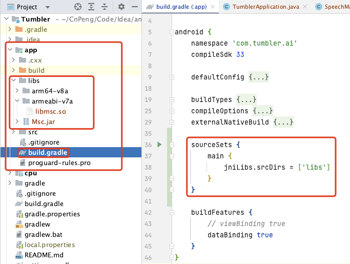

# 1. 语音识别和合成

## 1.1. 运行DEMO

先建一个新项目，然后将 demo 作为 module 进行导入。

## 1.2. 踩坑实录


### 1.2.1. 创建对象失败

集成到项目后，运行语音识别时报错：`创建对象失败，请确认 libmsc.so 放置正确，且有调用 createUtility 进行初始化-2`。

```java
// 创建单例失败，与 21001 错误为同样原因，参考 http://bbs.xfyun.cn/forum.php?mod=viewthread&tid=9688
this.showTip("创建对象失败，请确认 libmsc.so 放置正确，且有调用 createUtility 进行初始化-2");
```

按照上述代码中的提示，查阅 [http://bbs.xfyun.cn/forum.php?mod=viewthread&tid=9688](http://bbs.xfyun.cn/forum.php?mod=viewthread&tid=9688) 处理即可。

在处理时，先作如下确认：

* 确认是否触发了 `SpeechUtility.createUtility()` 初始化方法，
* 确认该方法接收的 `appID` 参数是否正确
* 确认 module 的 build.gradle 文件中是否指定了 jniLibs 目录，该目录用于存放 `libmsc.so` 文件。如下图：



```groovy
    sourceSets {
        main {
            jniLibs.srcDirs = ['libs']
        }
    }
```


