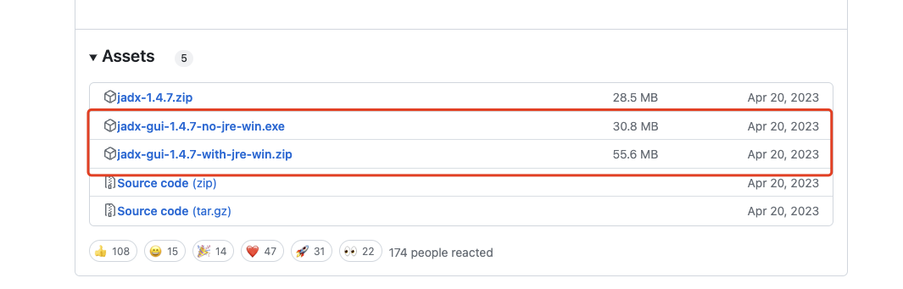
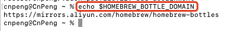
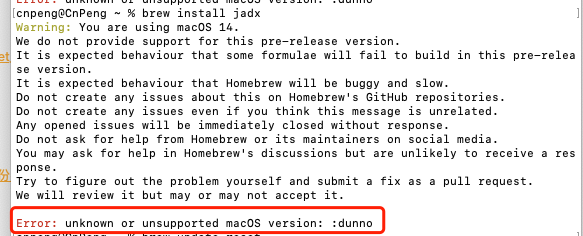
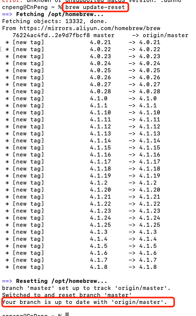

# 1. jadx安装

[jadx下载地址](https://github.com/skylot/jadx/releases)



Windows 电脑直接从页面下载并安装即可，此处不做赘述。

本文重点介绍 MacOS 中安装和运行的过程。

## 1.1. 安装 homebrew

[HomeBrew](https://brew.sh/zh-cn/) 是 MacOS/Linux 用于安装应用的一种包安装管理器。

我们既可以使用 [官网页面](https://brew.sh/zh-cn/) 中的命令进行安装，也可以通过 [HomeBrew 构建页面](https://github.com/Homebrew/brew/releases/tag/4.2.15) 下载 pkg 安装包进行安装。

安装过程省略。

## 1.2. 安装 jadx

在确保 HomeBrew 安装完成后，接下来我们就开始安装 jadx 了。

### 1.2.1. JAVA_HOME is set to an invalid directory: @@HOMEBREW_JAVA@@

大部分资料都告诉我们通过 `brew install jadx` 或 `homebrew install jadx` ，但直接按照这两个命令安装完成之后，通过 `jadx-gui` 运行图形界面时，极大概率会出现如下错误：

```bash
ERROR: JAVA_HOME is set to an invalid directory: @@HOMEBREW_JAVA@@
Please set the JAVA_HOME variable in your environment to match the
location of your Java installation.
```

这是因为国内的用户使用 `homebrew` 时一般都是配置了国内的镜像源来提速的，而问题就出在国内的镜像源上了，从国内镜像 （[清华](https://link.juejin.cn/?target=https%3A%2F%2Fmirrors.tuna.tsinghua.edu.cn%2Fhelp%2Fhomebrew-bottles%2F) 、[阿里云](https://mirrors.aliyun.com/)）安装依赖于 Java 的某些配置目前无法正常工作，正常来说 `@@HOMEBREW_JAVA@@` 是会被替换掉的，但是因为使用了国内的镜像源导致没有正常的被替换。而 `brew` 需要清单才能正确替换 `@@HOMEBREW_JAVA@@` ，但 `brew` 只知道如何从 `ghcr.io` 获取清单。
查看 `HOMEBREW_BOTTLE_DOMAIN` 如下：



想要正确安装并正常运行，在终端中执行如下命令即可：

```bash
HOMEBREW_BOTTLE_DOMAIN= brew reinstall jadx
```

### 1.2.2. unknown or unsupported macOS version: :dunno

安装过程中可能还会出现 `unknown or unsupported macOS version: :dunno` 的错误提示：



这是由于本机的 `brew` 版本较低导致的，通过 `brew update-reset` 命令更新到新版即可：




### 1.2.3. Disable this behaviour by setting HOMEBREW_NO_INSTALL_CLEANUP

安装过程中可能还会出现 `Disable this behaviour by setting HOMEBREW_NO_INSTALL_CLEANUP`，具体如下：

```bash
brew install jadx
Disable this behaviour by setting HOMEBREW_NO_INSTALL_CLEANUP.
Hide these hints with HOMEBREW_NO_ENV_HINTS (see `man brew`).
```

此时，在终端执行如下命令即可：

```bash
export HOMEBREW_NO_INSTALL_CLEANUP=TRUE
```

执行该命令后，重新安装即可。


### 1.2.4. 运行jadx

通过如下命令运行 jadx 图形界面：

```bash
jadx-gui
```

## 1.3. 参考


* 掘金-[找不到正确的java_home路径报错解决：@@HOMEBREW_JAVA@@](https://juejin.cn/post/7253980320357449785)
* GitHub-[brew bottle command replaces JAVA_HOME path with @@HOMEBREW_JAVA@@ #2530](https://github.com/orgs/Homebrew/discussions/2530)
* CSDN-[Mac安装jadx反编译工具并修改默认运行内存](https://blog.csdn.net/m0_59683157/article/details/123151717)