# 1. 0012-360加固后的APK手动签名

使用 360 加固对 apk 进行加固之后，是没有签名的，而 360 加固的自动签名是收费的，所以我们需要对加固后的 apk 文件进行手动签名。

> 以下内容基于 MacOS Sonoma 14.6.1 和 AndroidStudio 2024.2.1 Patch 2 整理。


## 1.1. 手动签名

### 1.1.1. 查看 Android SDK 目录

使用 AndroidStudio 打开任意 Android 项目，然后按照下图查看 SDK 位置：

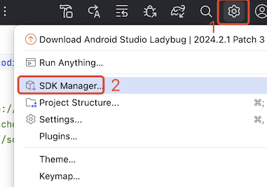

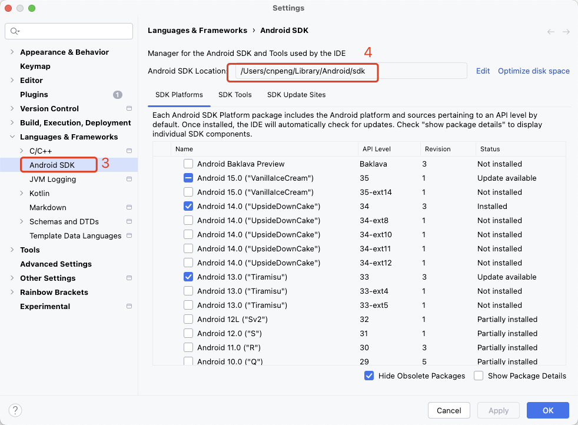

复制上面 4 处的地址，并在终端中通过 open 命令打开该目录 ：

```bash
open /Users/cnpeng/Library/Android/sdk
```

进入 `build-tools` 目录，选择一个任意一个版本，确认 `zipalign` 和 `apksigner` 存在：

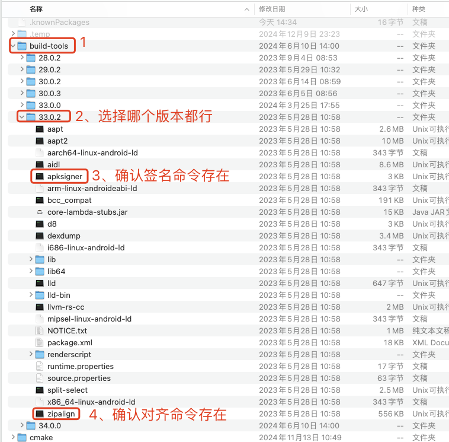


然后在 `apksigner` 的同级目录下新建一个 `apks` 目录（名称可以自定义），用于存储我们将要操作的 apk 和 密钥信息，假设我们要操作的文件为 `source.apk`:

### 1.1.2. 确认是否已经加固

使用 AndroidStudio 直接打开 apk 文件，如果看到下图中的样子，则表示该 apk 已经加固了。

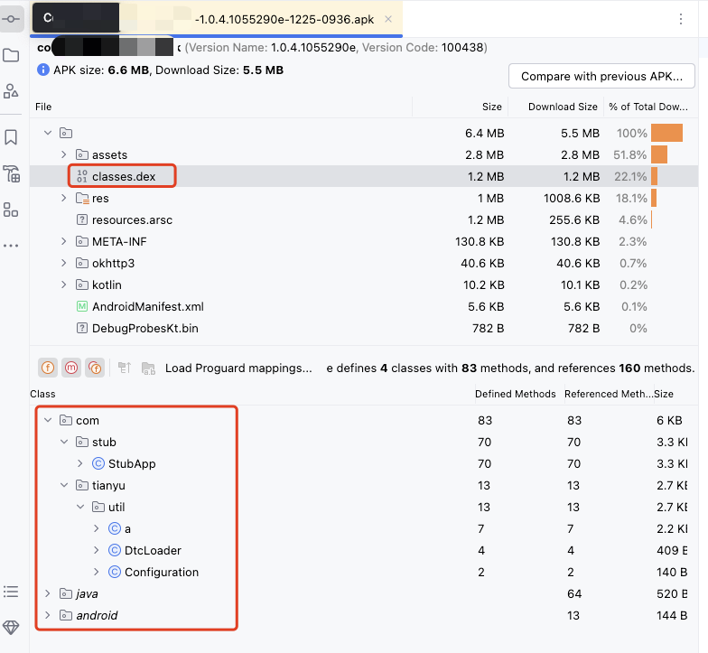

### 1.1.3. zipalign对齐

>字节对齐的好处是帮助操作系统更高效率的根据请求索引资源，降低内存消耗。
>
> 虽然 Android Studio 打包的 apk 是默认经过字节对齐的，但是由于经历过应用加固步骤，不能保证该应用中的数据还处于对齐状态，所以二次签名前，最好先进行字节对齐操作（一般为4字节对齐）。
> 
>Android SDK 自带字节对齐工具 zipalign。


#### 1.1.3.1. 查看是否已经对齐

> 注意，下面示例中的 `source.apk` 是 360 加固之后的 apk 文件，为了方便操作，我们将其放在 apks 目录下， 并改名为 `source.apk`。加固后的文件无法在手机上正常安装，安装时大小会变成 1kb 导致安装失败。

在终端中切换到对应版本的目录（假设目录为：`/Users/cnpeng/Library/Android/sdk/build-tools/33.0.1`）下，然后执行如下命令查看 apk 文件是否已经对齐 ：

```bash
./zipalign -c -v 4 ./apks/source.apk 
```

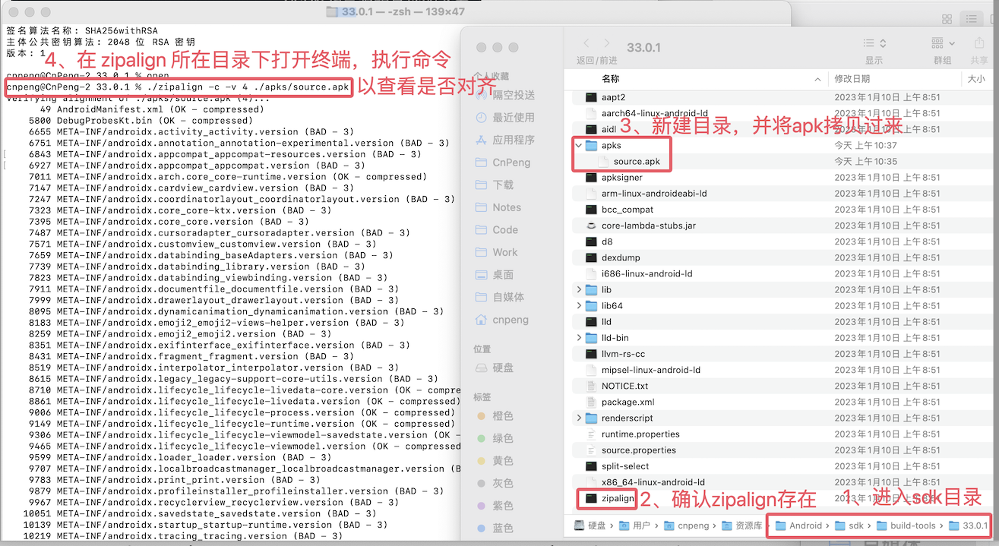

如果出现下图样式，则表示未对齐：

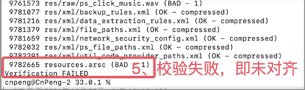

#### 1.1.3.2. 对齐

在终端中执行如下命令：

```bash
 ./zipalign -f -v 4 ./apks/source.apk ./apks/aligned.apk
```

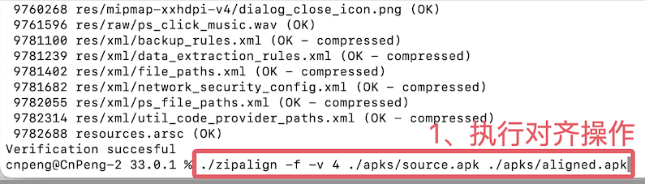

对齐成功如下图：

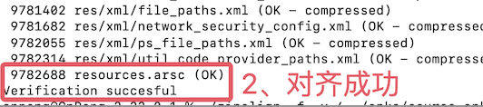

对齐成功后，会在 apks 目录下得到对齐后的文件：

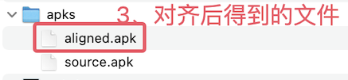

### 1.1.4. 签名

#### 1.1.4.1. 签名

签名前，为了方便操作，先将密钥文件拷贝到 apks 目录下：

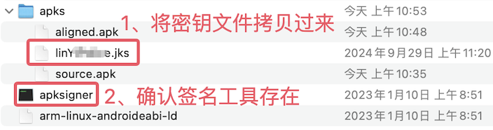

然后在终端中按如下命令格式执行签名命令：

```bash
./apksigner sign --ks ./apks/密钥文件名.jks --ks-key-alias 密钥文件别名 --out ./apks/输出文件名.apk ./apks/待签名文件名.apk
```

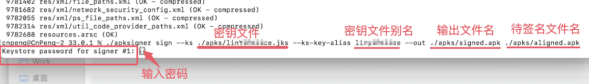

如上图，输入命令后回车，会提示我们输入密钥文件密码，输入密码后回车，如果执行成功，会在 apks 目录下生成我们期望的签名后的 apk 文件：

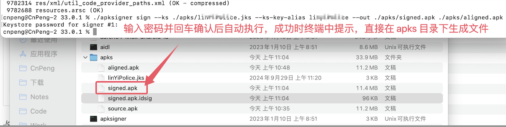

至此，签名完成。

#### 1.1.4.2. 确认签名是否成功

通过上一步我们已经完成了签名，可以通过如下命令对签名情况做进一步确认：

```bash
 keytool -printcert -jarfile 签名后的apk文件名.apk 
```

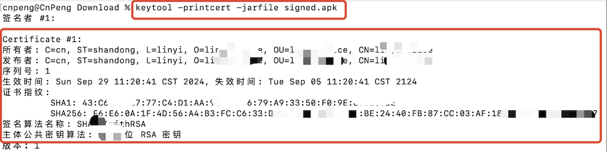

如果上述信息和我们 keyStore 文件中信息一致，则表示签名成功。

此外，我们也可以先将未加固的 apk 安装到设备上，然后再将加固并且签名后的 apk 进行覆盖安装，如果安装成功，也可以认为加固和签名成功了。


##### 1.1.4.2.1. 补充：查看keystore信息

可以通过如下命令查看密钥文件信息：

```bash
keytool -list -v -keystore 密钥文件名称.密钥文件后缀
```

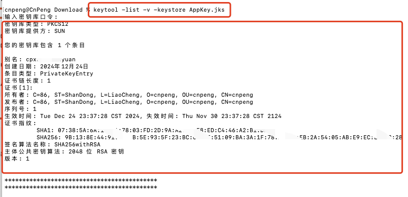


## 1.2. 参考

* [CSDN:《360加固APP后启动崩溃—注意加固前后签名是否一致》](https://blog.csdn.net/SCHOLAR_II/article/details/134146657)
* [CSDN：《Android apk应用加固、字节对齐、二次签名全流程》](https://blog.csdn.net/Android_xiong_st/article/details/130853689)