# 1. 002-Day2

## 1.1. 四大组件

[官网：应用基础知识](https://developer.android.google.cn/guide/components/fundamentals?hl=zh-cn#Components)

Android 的四大组件是构成Android应用程序的基础，它们分别是：


* **Activity**（活动）：
   - Activity是应用程序的视觉呈现单元，代表一个具有用户界面的屏幕。它是用户与应用交互的主要方式。每个Activity都提供一个窗口，用于展示用户界面并接收用户输入。Activity之间通过Intent进行通信，可以启动新的Activity或传递数据。

* **Service**（服务）：
   - Service是一种在后台长时间运行且没有用户界面的应用组件。它用于执行长时间运行的操作，如下载、播放音乐、同步数据等，即使当应用被最小化或用户切换到其他应用时，服务仍可继续运行。

* **BroadcastReceiver**（广播接收器）：
   - BroadcastReceiver用于接收并响应系统或应用间的广播消息。这些消息可以是系统事件（如电池低、网络状态改变）或其他应用发出的自定义事件。接收到广播后，BroadcastReceiver会执行简短的操作，如启动Activity或Service，或更新通知等。

* **ContentProvider**（内容提供者）：
   - ContentProvider用于在不同应用间共享数据。它提供了一种标准的接口，使得一个应用可以访问另一个应用的数据，如访问联系人、图片库等。这为应用间的数据共享提供了一种安全且统一的方式，保证了数据的隐私性和安全性。

这四大组件是 Android 应用开发的核心，它们的设计旨在支持组件的重用、低耦合以及灵活的系统集成，共同构成了 Android 应用的基本架构。开发者需要在应用的`AndroidManifest.xml` 文件中声明使用的所有四大组件，以便系统能够识别和管理它们。

### 1.1.1. Activity

[官方文档：Activity](https://developer.android.google.cn/guide/components/activities/intro-activities?hl=zh-cn)

#### 1.1.1.1. 新建Activity

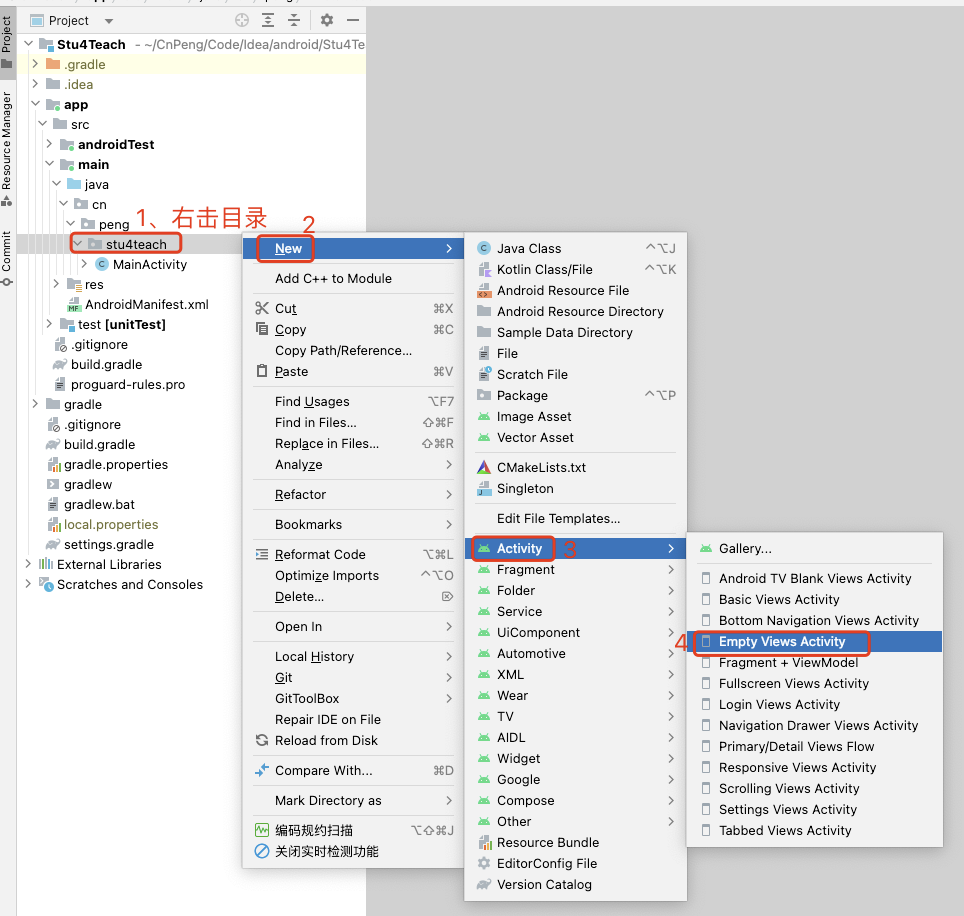


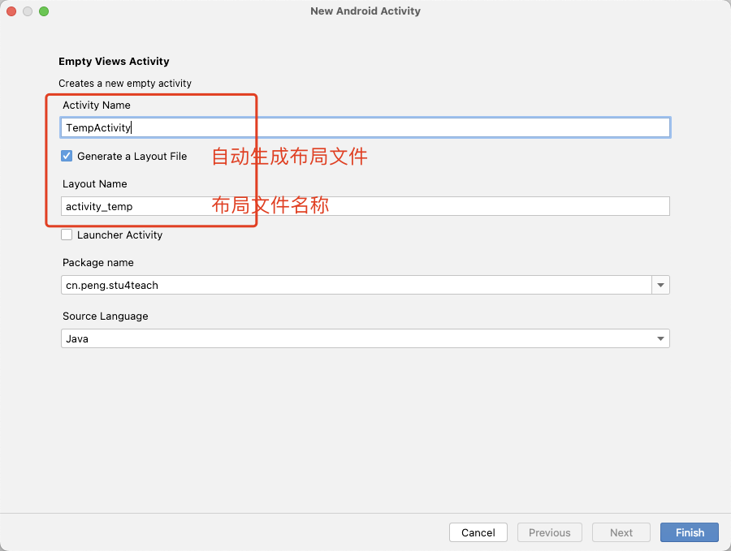

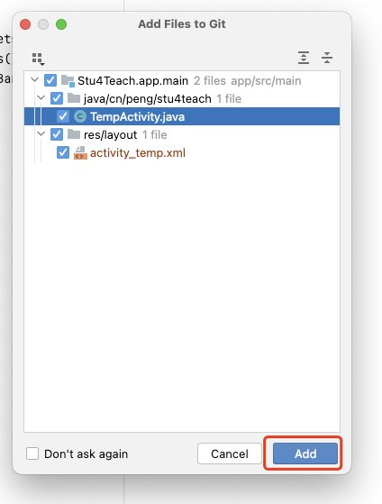


#### 1.1.1.2. 在清单文件中配置

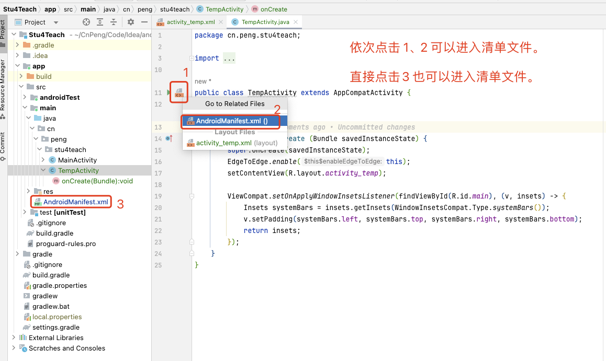

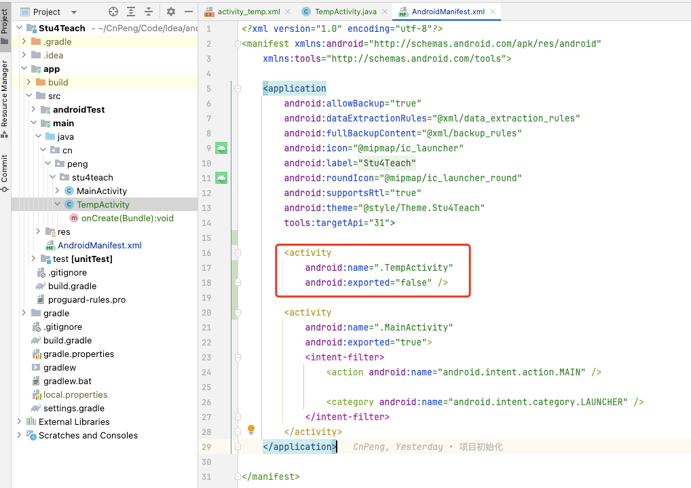

`android:exported `属性是在 Android 12（API 级别 31）及更高版本中引入的新属性。它决定了**其他应用是否能够启动这个 Activity**。

当 `android:exported` 设置为 `false` 时，意味着这个 Activity 只能被应用内部的其他组件（如其他 Activity、Service、BroadcastReceiver 等）启动，而不能[被其他应用或系统的隐式 Intent 启动](https://developer.android.google.cn/training/basics/intents/filters?hl=zh-cn)。

这有助于增强应用的安全性，因为它限制了哪些组件可以启动特定的 Activity。


#### 1.1.1.3. 打开Activity

>startActivity

##### 1.1.1.3.1. startActivity

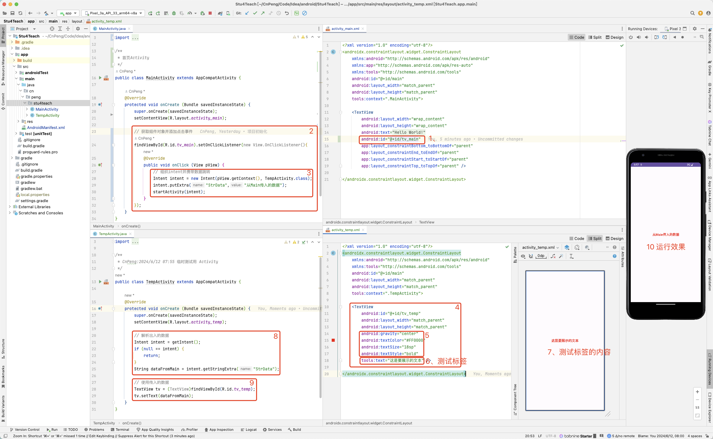

##### 1.1.1.3.2. startActivityForResult（旧）

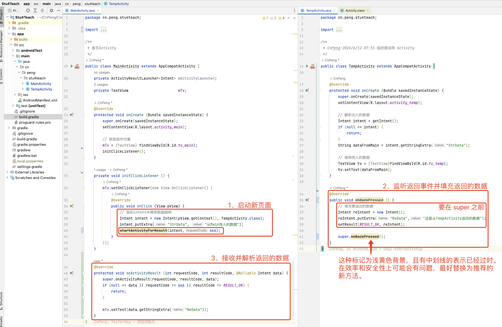

##### 1.1.1.3.3. ActivityResultLauncher（新）

[获取 activity 的结果](https://developer.android.google.cn/training/basics/intents/result?hl=zh-cn)

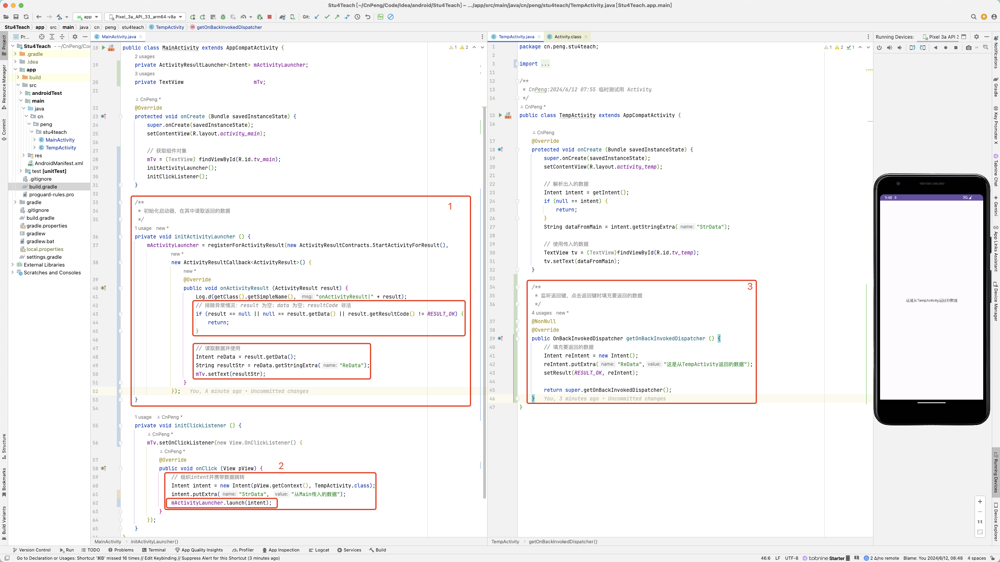


完整源码：

* MainActivity.java

```java
package cn.peng.stu4teach;

import android.content.Intent;
import android.os.Bundle;
import android.util.Log;
import android.view.View;
import android.widget.TextView;

import androidx.activity.result.ActivityResult;
import androidx.activity.result.ActivityResultCallback;
import androidx.activity.result.ActivityResultLauncher;
import androidx.activity.result.contract.ActivityResultContracts;
import androidx.appcompat.app.AppCompatActivity;

/**
 * 首页Activity
 */
public class MainActivity extends AppCompatActivity {
    private ActivityResultLauncher<Intent> mActivityLauncher;
    private TextView                       mTv;

    @Override
    protected void onCreate (Bundle savedInstanceState) {
        super.onCreate(savedInstanceState);
        setContentView(R.layout.activity_main);

        // 获取组件对象
        mTv = (TextView) findViewById(R.id.tv_main);
        initActivityLauncher();
        initClickListener();
    }

    /**
     * 初始化启动器，在其中读取返回的数据
     */
    private void initActivityLauncher () {
        mActivityLauncher = registerForActivityResult(new ActivityResultContracts.StartActivityForResult(),
                new ActivityResultCallback<ActivityResult>() {
                    @Override
                    public void onActivityResult (ActivityResult result) {
                        Log.d(getClass().getSimpleName(), "onActivityResult|" + result);
                        // 排除异常情况：result 为空；data 为空；resultCode 非法
                        if (result == null || null == result.getData() || result.getResultCode() != RESULT_OK) {
                            return;
                        }

                        // 读取数据并使用
                        Intent reData = result.getData();
                        String resultStr = reData.getStringExtra("ReData");
                        mTv.setText(resultStr);
                    }
                });
    }

    private void initClickListener () {
        mTv.setOnClickListener(new View.OnClickListener() {
            @Override
            public void onClick (View pView) {
                // 组织intent并携带数据跳转
                Intent intent = new Intent(pView.getContext(), TempActivity.class);
                intent.putExtra("StrData", "从Main传入的数据");
                mActivityLauncher.launch(intent);
            }
        });
    }
}
```

* TempActivity.java

```java
package cn.peng.stu4teach;

import android.content.Intent;
import android.os.Bundle;
import android.view.View;
import android.widget.TextView;
import android.window.OnBackInvokedDispatcher;

import androidx.annotation.NonNull;
import androidx.appcompat.app.AppCompatActivity;

/**
 * CnPeng:2024/6/12 07:55 临时测试用 Activity
 */
public class TempActivity extends AppCompatActivity {

    @Override
    protected void onCreate (Bundle savedInstanceState) {
        super.onCreate(savedInstanceState);
        setContentView(R.layout.activity_temp);

        // 解析出入的数据
        Intent intent = getIntent();
        if (null == intent) {
            return;
        }
        String dataFromMain = intent.getStringExtra("StrData");

        // 使用传入的数据
        TextView tv = (TextView)findViewById(R.id.tv_temp);
        tv.setText(dataFromMain);
    }

    /**
     * 监听返回键，点击返回键时填充要返回的数据
     */
    @NonNull
    @Override
    public OnBackInvokedDispatcher getOnBackInvokedDispatcher () {
        // 填充要返回的数据
        Intent reIntent = new Intent();
        reIntent.putExtra("ReData","这是从TempActivity返回的数据");
        setResult(RESULT_OK, reIntent);

        return super.getOnBackInvokedDispatcher();
    }
}
```


#### 1.1.1.4. intent 和 intent filter

[intent 和 intent 过滤器](https://developer.android.google.cn/guide/components/intents-filters?hl=zh-cn)

##### 1.1.1.4.1. 基础介绍

Intent 可以为“显式”，以便启动特定 Activity 实例；也可为“隐式”，以便启动任何可以处理预期操作（例如“拍摄照片”）的组件。

"显式" Intent 会指定要启动的 Activity 名称；“隐式”Intent 仅指定 Action。


##### 1.1.1.4.2. 常用intent

* [打开摄像头](https://developer.android.google.cn/guide/components/intents-common?hl=zh-cn#Camera)
* [拨打电话](https://developer.android.google.cn/guide/components/intents-common?hl=zh-cn#DialPhone)
* [打开设置页面](https://developer.android.google.cn/guide/components/intents-common?hl=zh-cn#Settings)

##### 1.1.1.4.3. 注意事项

**在使用隐式 Intent 启动 Activity 时**，尽管许多 intent 都可以由设备上安装的其他应用（例如“电话”“电子邮件”或“日历”应用）成功处理，但您的应用应该**做好准备，以便妥善应对没有 activity 可处理您应用的 intent 的情况。**每次调用 intent 时，都做好捕获 `ActivityNotFoundException` 的准备，如果没有其他 activity 可处理您应用的 intent，就会出现此异常：

```java
try {
    startActivity(intent);
} catch (ActivityNotFoundException e) {
    // Define what your app should do if no activity can handle the intent.
}
```


#### 1.1.1.5. 生命周期

##### 1.1.1.5.1. 生命周期及其回调函数

> 面试中会有考察

* [官方文档：Activity生命周期](https://developer.android.google.cn/guide/components/activities/activity-lifecycle?hl=zh-cn)

Activity 从创建到销毁的整个过程中的节点。

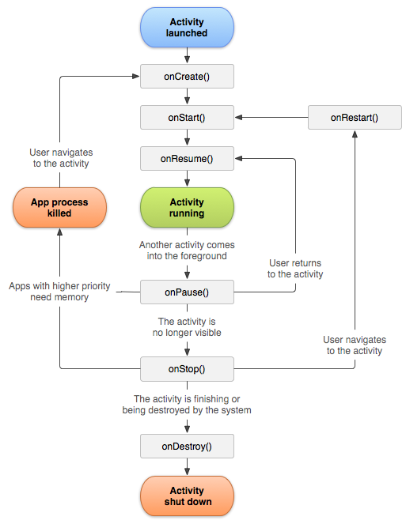


##### 1.1.1.5.2. 状态变更

> 面试中会有考察

不同场景下会触发哪些生命周期函数。具体参考 [官方文档：Activity 状态变更](https://developer.android.google.cn/guide/components/activities/state-changes?hl=zh-cn)

#### 1.1.1.6. 启动模式

> 面试中会有考察

[官方文档：使用清单文件定义启动模式](https://developer.android.google.cn/guide/components/activities/tasks-and-back-stack?hl=zh-cn#ManifestForTasks)

### 1.1.2. Service（服务）

* [官方文档：服务概览](https://developer.android.google.cn/develop/background-work/services?hl=zh-cn)
* [JobScheduler](https://developer.android.google.cn/reference/android/app/job/JobScheduler)

`Service` 是一种在后台长时间运行且没有用户界面的应用组件。它用于执行长时间运行的操作，如下载、播放音乐、同步数据等，即使当应用被最小化或用户切换到其他应用时，服务仍可继续运行。


#### 1.1.2.1. 服务的启动

启动服务有两种方式：[startService](https://developer.android.google.cn/develop/background-work/services?hl=zh-cn#CreatingAService)、[bindService](https://developer.android.google.cn/develop/background-work/services?hl=zh-cn#CreatingBoundService).

需要注意：不论是哪种启动方式，该无误都需要在 `AndroidMainfest.xml` 中注册。——四大组件都需要进行注册。

注册示例：

```xml
<manifest ... >
  ...
  <application ... >
      <service android:name=".ExampleService" />
      ...
  </application>
</manifest>
```


#### 1.1.2.2. 服务的生命周期

不同启动方式，其生命周期函数也不一样。

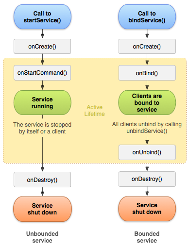


### 1.1.3. BroadcastReceiver（广播接收器）

* [官方文档：广播接收器](https://developer.android.google.cn/guide/components/fundamentals?hl=zh-cn#Components)
* [官方文档：BroadcastReceiver](https://developer.android.google.cn/reference/android/content/BroadcastReceiver)

`BroadcastReceiver` 用于接收并响应系统或应用间的广播消息。这些消息可以是系统事件（如电池低、网络状态改变）或其他应用发出的自定义事件。接收到广播后，BroadcastReceiver 会执行简短的操作，如启动 Activity 或 Service ，或更新通知等。

也可以用于应用内跨页面的数据传递。

#### 1.1.3.1. 发送全局广播

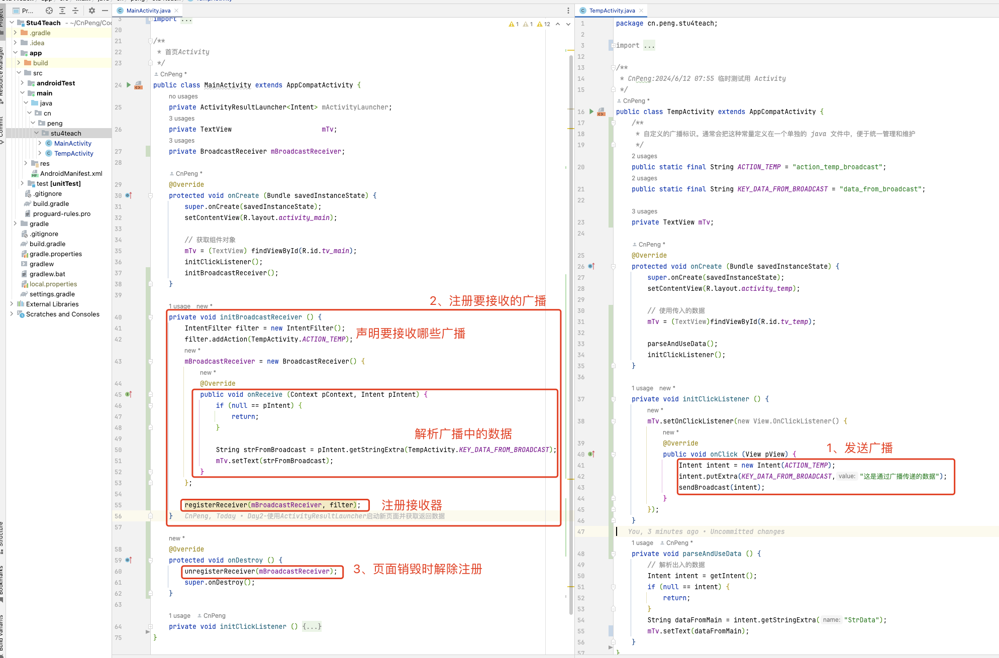

#### 1.1.3.2. 发送本地广播

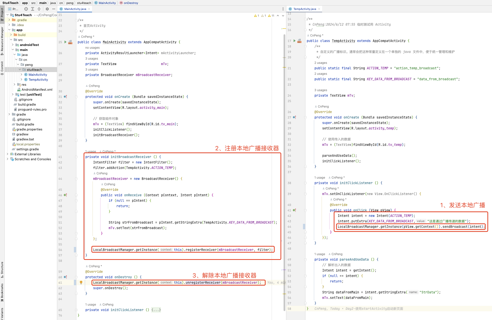


* MainActivity.java

```java
package cn.peng.stu4teach;

import android.content.BroadcastReceiver;
import android.content.Context;
import android.content.Intent;
import android.content.IntentFilter;
import android.os.Bundle;
import android.os.PersistableBundle;
import android.service.restrictions.RestrictionsReceiver;
import android.util.Log;
import android.view.View;
import android.widget.TextView;

import androidx.activity.result.ActivityResult;
import androidx.activity.result.ActivityResultCallback;
import androidx.activity.result.ActivityResultLauncher;
import androidx.activity.result.contract.ActivityResultContracts;
import androidx.annotation.Nullable;
import androidx.appcompat.app.AppCompatActivity;
import androidx.localbroadcastmanager.content.LocalBroadcastManager;

/**
 * 首页Activity
 */
public class MainActivity extends AppCompatActivity {
    private ActivityResultLauncher<Intent> mActivityLauncher;
    private TextView                       mTv;
    private BroadcastReceiver mBroadcastReceiver;

    @Override
    protected void onCreate (Bundle savedInstanceState) {
        super.onCreate(savedInstanceState);
        setContentView(R.layout.activity_main);

        // 获取组件对象
        mTv = (TextView) findViewById(R.id.tv_main);
        initClickListener();
        initBroadcastReceiver();
    }

    private void initBroadcastReceiver () {
        IntentFilter filter = new IntentFilter();
        filter.addAction(TempActivity.ACTION_TEMP);
        mBroadcastReceiver = new BroadcastReceiver() {
            @Override
            public void onReceive (Context pContext, Intent pIntent) {
                if (null == pIntent) {
                    return;
                }

                String strFromBroadcast = pIntent.getStringExtra(TempActivity.KEY_DATA_FROM_BROADCAST);
                mTv.setText(strFromBroadcast);
            }
        };

        LocalBroadcastManager.getInstance(this).registerReceiver(mBroadcastReceiver, filter);
    }

    @Override
    protected void onDestroy () {
        LocalBroadcastManager.getInstance(this).unregisterReceiver(mBroadcastReceiver);
        super.onDestroy();
    }

    private void initClickListener () {
        mTv.setOnClickListener(new View.OnClickListener() {
            @Override
            public void onClick (View pView) {
                // 组织intent并携带数据跳转
                Intent intent = new Intent(pView.getContext(), TempActivity.class);
                intent.putExtra("StrData", "从Main传入的数据");
                startActivityForResult(intent,666);
            }
        });
    }
}
```

* TempActivity.java

```java
package cn.peng.stu4teach;

import android.app.Activity;
import android.content.Intent;
import android.os.Bundle;
import android.view.View;
import android.widget.TextView;
import android.window.OnBackInvokedDispatcher;

import androidx.annotation.NonNull;
import androidx.appcompat.app.AppCompatActivity;
import androidx.localbroadcastmanager.content.LocalBroadcastManager;

/**
 * CnPeng:2024/6/12 07:55 临时测试用 Activity
 */
public class TempActivity extends AppCompatActivity {
    /**
     * 自定义的广播标识。通常会把这种常量定义在一个单独的 java 文件中，便于统一管理和维护
     */
    public static final String ACTION_TEMP = "action_temp_broadcast";
    public static final String KEY_DATA_FROM_BROADCAST = "data_from_broadcast";

    private TextView mTv;

    @Override
    protected void onCreate (Bundle savedInstanceState) {
        super.onCreate(savedInstanceState);
        setContentView(R.layout.activity_temp);

        // 使用传入的数据
        mTv = (TextView)findViewById(R.id.tv_temp);

        parseAndUseData();
        initClickListener();
    }

    private void initClickListener () {
        mTv.setOnClickListener(new View.OnClickListener() {
            @Override
            public void onClick (View pView) {
                Intent intent = new Intent(ACTION_TEMP);
                intent.putExtra(KEY_DATA_FROM_BROADCAST,"这是通过广播传递的数据");
                LocalBroadcastManager.getInstance(pView.getContext()).sendBroadcast(intent);
            }
        });
    }

    private void parseAndUseData () {
        // 解析出入的数据
        Intent intent = getIntent();
        if (null == intent) {
            return;
        }
        String dataFromMain = intent.getStringExtra("StrData");
        mTv.setText(dataFromMain);
    }
}
```

#### 1.1.3.3. 自定义广播接收器类

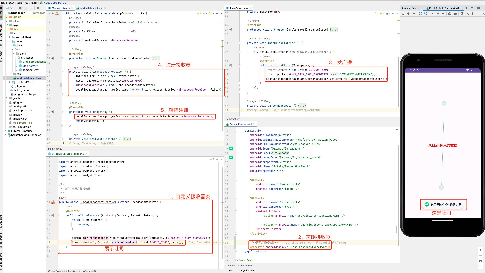

#### 1.1.3.4. 全局广播和本地广播对比（了解）

`LocalBroadcastManager.getInstance(pView.getContext()).sendBroadcast(intent);` 和 `context.sendBroadcast(intent);` 都是用来发送广播，但它们之间有重要的区别：

* **作用范围不同**:

   - `LocalBroadcastManager.getInstance(pView.getContext()).sendBroadcast(intent);`
     这个方法是通过 `LocalBroadcastManager` 发送广播，它仅限于应用程序内部。这意味着广播不会离开你的应用，只能被同一个应用内的其他组件接收。这对于敏感信息的传递更为安全，同时由于广播只在本地传播，因此效率更高。

   - `context.sendBroadcast(intent);`
     使用这个方法发送的是全局广播，它可以被设备上任何对这个广播感兴趣的注册了相应 `BroadcastReceiver` 的应用接收。这意味着广播不仅限于你的应用内，还可以跨应用边界，适用于需要多个应用间通信的场景。

* **性能和安全性**:

   - `LocalBroadcastManager` 由于其广播局限在应用内，因此更安全，减少了潜在的安全风险，同时因为不必经过系统广播机制处理，效率更高。

   - 全局广播涉及到系统级的处理，会有更多的开销，且可能涉及外部应用，存在一定的安全风险，特别是当你广播包含敏感信息时。

总结来说，如果你的应用内组件需要相互通信，并且不希望这些消息暴露给其他应用，`LocalBroadcastManager` 是更好的选择。而当你需要与其他应用共享信息或需要一个系统级的事件通知时，则应使用全局广播。

### 1.1.4. ContentProvider（内容提供者）

* [官方文档：应用基础知识-content provider](https://developer.android.google.cn/guide/components/fundamentals?hl=zh-cn#Components)
* [官方文档：Content provider 介绍](https://developer.android.google.cn/guide/topics/providers/content-providers?hl=zh-cn)

`ContentProvider` 用于在不同应用间共享数据。它提供了一种标准的接口，使得一个应用可以访问另一个应用的数据，如访问联系人、图片库等。这为应用间的数据共享提供了一种安全且统一的方式，保证了数据的隐私性和安全性。

> 因实际项目中使用频率不高，故此处不做过多讲解，具体内容可查看官方文档。


## 1.2. 常用布局容器

在 Android 界面开发中，我们看到的一个按钮、一个输入框等被称为视图组件，布局容器则用于摆放这些视图组件。

View 类是所有布局容器和视图组件的父类。View 拥有的 id、width、height、background 等属性会被所有子类继承，也就是说，在 xml 布局文件中，所有布局容器和视图组件都拥有 `android:layout_widht`、`android:layout_height`、`android:background` 等属性。

### 1.2.1. LinearLayout

[LinearLayout](https://developer.android.google.cn/reference/kotlin/android/widget/LinearLayout?hl=en)

#### 1.2.1.1. 示例1

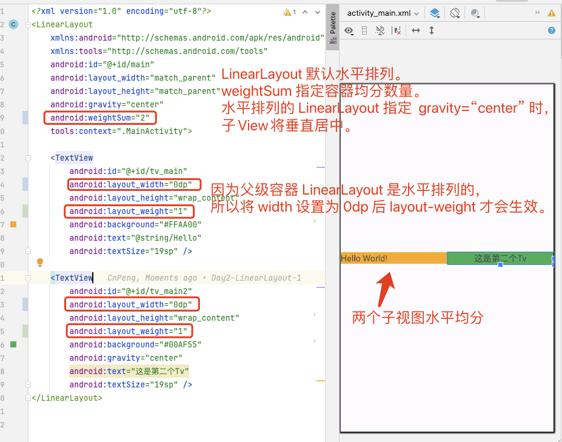

```xml
<?xml version="1.0" encoding="utf-8"?>
<LinearLayout
    xmlns:android="http://schemas.android.com/apk/res/android"
    xmlns:tools="http://schemas.android.com/tools"
    android:id="@+id/main"
    android:layout_width="match_parent"
    android:layout_height="match_parent"
    android:gravity="center"
    android:weightSum="2"
    tools:context=".MainActivity">

    <TextView
        android:id="@+id/tv_main"
        android:layout_width="0dp"
        android:layout_height="wrap_content"
        android:layout_weight="1"
        android:background="#FFAA00"
        android:text="@string/Hello"
        android:textSize="19sp" />

    <TextView
        android:id="@+id/tv_main2"
        android:layout_width="0dp"
        android:layout_height="wrap_content"
        android:layout_weight="1"
        android:background="#00AF55"
        android:gravity="center"
        android:text="这是第二个Tv"
        android:textSize="19sp" />
</LinearLayout>
```


#### 1.2.1.2. 示例2

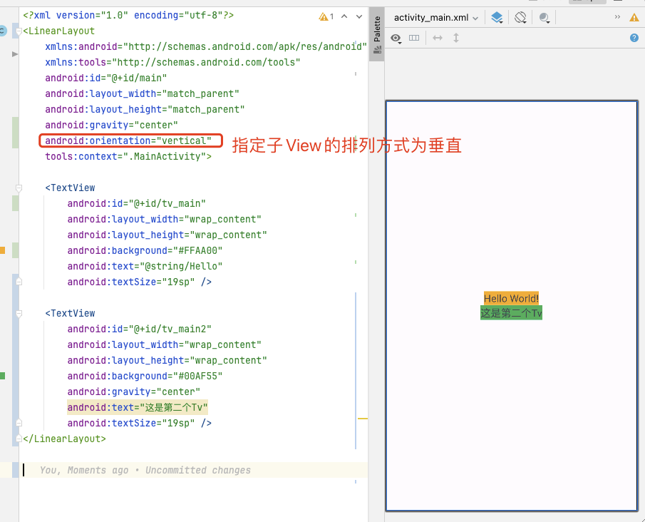

```xml
<?xml version="1.0" encoding="utf-8"?>
<LinearLayout
    xmlns:android="http://schemas.android.com/apk/res/android"
    xmlns:tools="http://schemas.android.com/tools"
    android:id="@+id/main"
    android:layout_width="match_parent"
    android:layout_height="match_parent"
    android:gravity="center"
    android:orientation="vertical"
    tools:context=".MainActivity">

    <TextView
        android:id="@+id/tv_main"
        android:layout_width="wrap_content"
        android:layout_height="wrap_content"
        android:background="#FFAA00"
        android:text="@string/Hello"
        android:textSize="19sp" />

    <TextView
        android:id="@+id/tv_main2"
        android:layout_width="wrap_content"
        android:layout_height="wrap_content"
        android:background="#00AF55"
        android:gravity="center"
        android:text="这是第二个Tv"
        android:textSize="19sp" />
</LinearLayout>

```

### 1.2.2. RelativeLayout 

* [官方文档：RelativeLayout](https://developer.android.google.cn/reference/kotlin/android/widget/RelativeLayout)
* [官方文档：相对布局](https://developer.android.google.cn/develop/ui/views/layout/relative?hl=zh-cn)

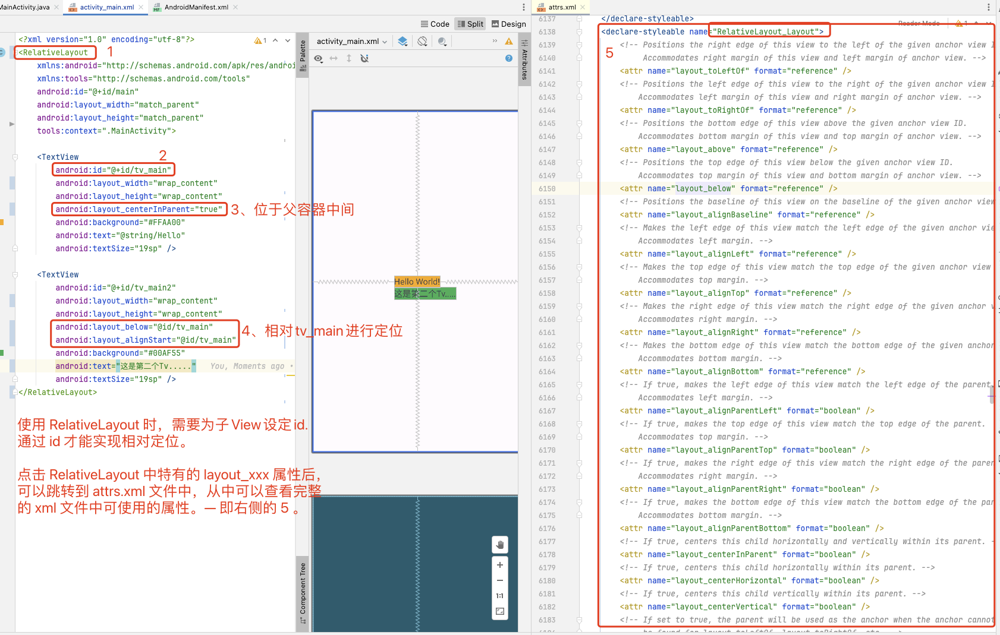

```xml
<?xml version="1.0" encoding="utf-8"?>
<RelativeLayout
    xmlns:android="http://schemas.android.com/apk/res/android"
    xmlns:tools="http://schemas.android.com/tools"
    android:id="@+id/main"
    android:layout_width="match_parent"
    android:layout_height="match_parent"
    tools:context=".MainActivity">

    <TextView
        android:id="@+id/tv_main"
        android:layout_width="wrap_content"
        android:layout_height="wrap_content"
        android:layout_centerInParent="true"
        android:background="#FFAA00"
        android:text="@string/Hello"
        android:textSize="19sp" />

    <TextView
        android:id="@+id/tv_main2"
        android:layout_width="wrap_content"
        android:layout_height="wrap_content"
        android:layout_below="@id/tv_main"
        android:layout_alignStart="@id/tv_main"
        android:background="#00AF55"
        android:text="这是第二个Tv....."
        android:textSize="19sp" />
</RelativeLayout>
```


### 1.2.3. FrameLayout

[官方文档：FrameLayout](https://developer.android.google.cn/reference/kotlin/android/widget/FrameLayout)

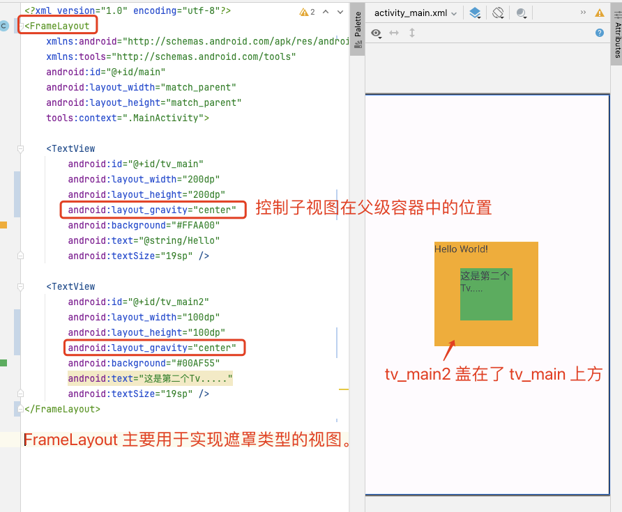

```xml
<?xml version="1.0" encoding="utf-8"?>
<FrameLayout
    xmlns:android="http://schemas.android.com/apk/res/android"
    xmlns:tools="http://schemas.android.com/tools"
    android:id="@+id/main"
    android:layout_width="match_parent"
    android:layout_height="match_parent"
    tools:context=".MainActivity">

    <TextView
        android:id="@+id/tv_main"
        android:layout_width="200dp"
        android:layout_height="200dp"
        android:layout_gravity="center"
        android:background="#FFAA00"
        android:text="@string/Hello"
        android:textSize="19sp" />

    <TextView
        android:id="@+id/tv_main2"
        android:layout_width="100dp"
        android:layout_height="100dp"
        android:layout_gravity="center"
        android:background="#00AF55"
        android:text="这是第二个Tv....."
        android:textSize="19sp" />
</FrameLayout>
```


### 1.2.4. ConstraintLayout(重点、难点)

[官方文档:使用 ConstraintLayout 构建响应式界面](https://developer.android.google.cn/develop/ui/views/layout/constraint-layout?hl=zh-cn)
[官方文档-Reference：ConstraintLayout](https://developer.android.google.cn/reference/androidx/constraintlayout/widget/ConstraintLayout)

其实，前面几种布局容器现在基本不再使用了，更多的是使用 ConstraintLayout . ConstraintLayout 可以实现更为复杂的布局方式，同时还能提高布局效率。

#### 1.2.4.1. 相对位置

通过如下属性可以控制子View相对于父级或者其他ziView的相对位置。

* layout_constraintLeft_toLeftOf
* layout_constraintLeft_toRightOf
* layout_constraintRight_toLeftOf
* layout_constraintRight_toRightOf
* layout_constraintTop_toTopOf
* layout_constraintTop_toBottomOf
* layout_constraintBottom_toTopOf
* layout_constraintBottom_toBottomOf
* layout_constraintBaseline_toBaselineOf
* layout_constraintStart_toEndOf
* layout_constraintStart_toStartOf
* layout_constraintEnd_toStartOf
* layout_constraintEnd_toEndOf

`Baseline` 即视图绘制基线，类似于四线三格中的第三条线。

关于 `Start` 和 `End`, 早期只有 `Left` 和 `Right`, 但由于个别国家和地区的视图摆放方式并非从左向左，而是从右向左。为了同时兼容从左向右、从右向左两种布局模式、简化布局代码，所以有了 `Start` 和 `End` ，并推荐我们优先使用。

#### 1.2.4.2. 外边距

* android:layout_marginStart
* android:layout_marginEnd
* android:layout_marginLeft
* android:layout_marginTop
* android:layout_marginRight
* android:layout_marginBottom
* layout_marginBaseline

注意：取值必须大于等于0.

#### 1.2.4.3. goneMargin

基准视图的可见属性为 `View.GONE` 时，当前视图的外边距。

* layout_goneMarginStart
* layout_goneMarginEnd
* layout_goneMarginLeft
* layout_goneMarginTop
* layout_goneMarginRight
* layout_goneMarginBottom
* layout_goneMarginBaseline


未设置 `goneMargin` 时效果如下：

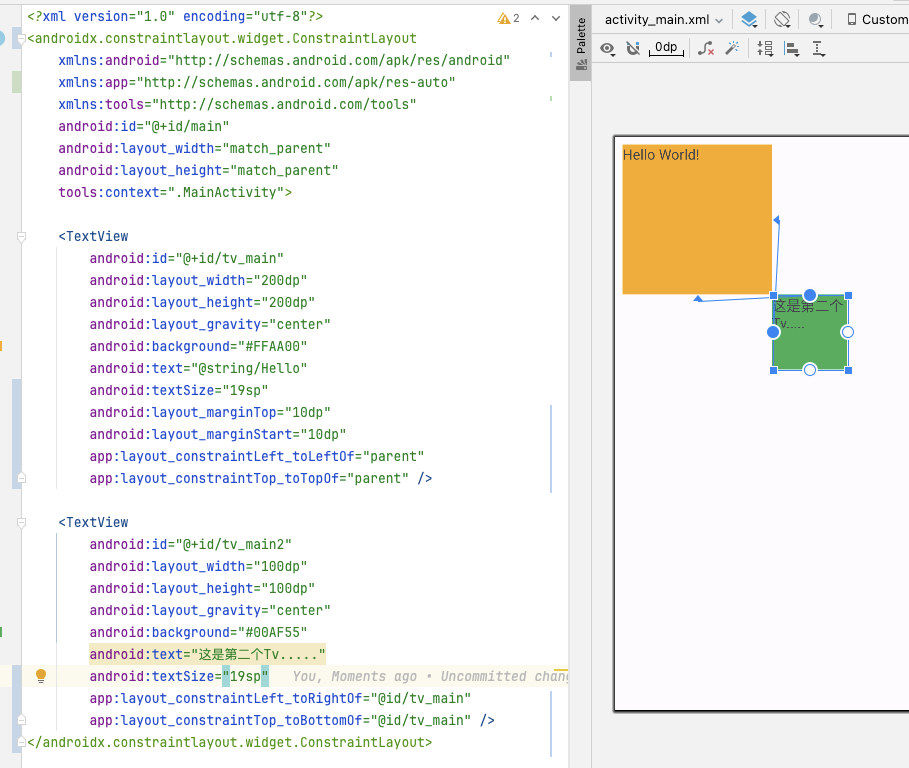


设置 `goneMargin` 后的效果：

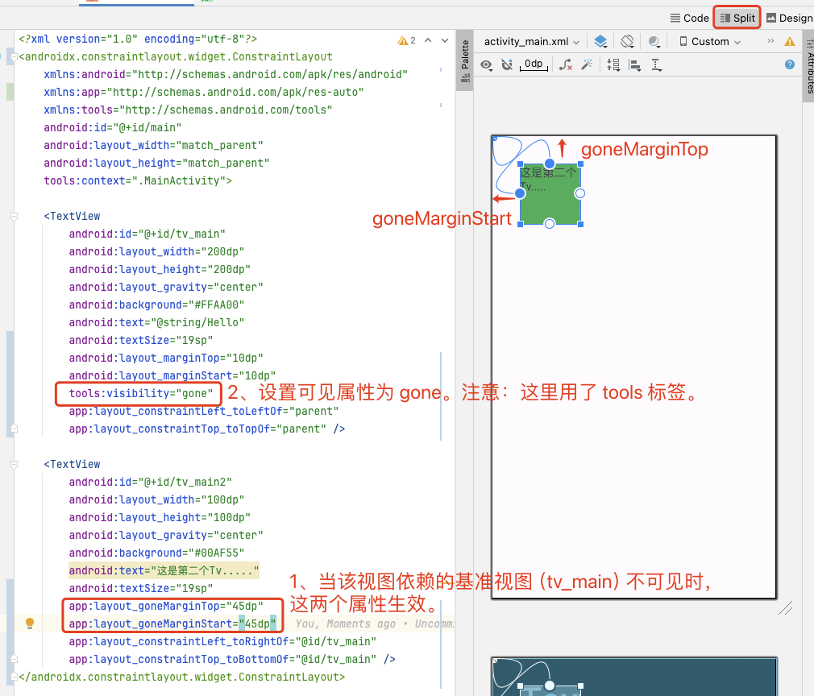

```xml
<?xml version="1.0" encoding="utf-8"?>
<androidx.constraintlayout.widget.ConstraintLayout
    xmlns:android="http://schemas.android.com/apk/res/android"
    xmlns:app="http://schemas.android.com/apk/res-auto"
    xmlns:tools="http://schemas.android.com/tools"
    android:id="@+id/main"
    android:layout_width="match_parent"
    android:layout_height="match_parent"
    tools:context=".MainActivity">

    <TextView
        android:id="@+id/tv_main"
        android:layout_width="200dp"
        android:layout_height="200dp"
        android:layout_gravity="center"
        android:background="#FFAA00"
        android:text="@string/Hello"
        android:textSize="19sp"
        android:layout_marginTop="10dp"
        android:layout_marginStart="10dp"
        tools:visibility="gone"
        app:layout_constraintLeft_toLeftOf="parent"
        app:layout_constraintTop_toTopOf="parent" />

    <TextView
        android:id="@+id/tv_main2"
        android:layout_width="100dp"
        android:layout_height="100dp"
        android:layout_gravity="center"
        android:background="#00AF55"
        android:text="这是第二个Tv....."
        android:textSize="19sp"
        app:layout_goneMarginTop="45dp"
        app:layout_goneMarginStart="45dp"
        app:layout_constraintLeft_toRightOf="@id/tv_main"
        app:layout_constraintTop_toBottomOf="@id/tv_main" />
</androidx.constraintlayout.widget.ConstraintLayout>
```

#### 1.2.4.4. Bias(偏差)

用于控制视图中心点相对于屏幕左边缘或上边缘的偏差。取值为 0 到 1 之间的值。

* layout_constraintHorizontal_bias ： 水平位置的偏差
* layout_constraintVertical_bias ： 垂直位置的偏差


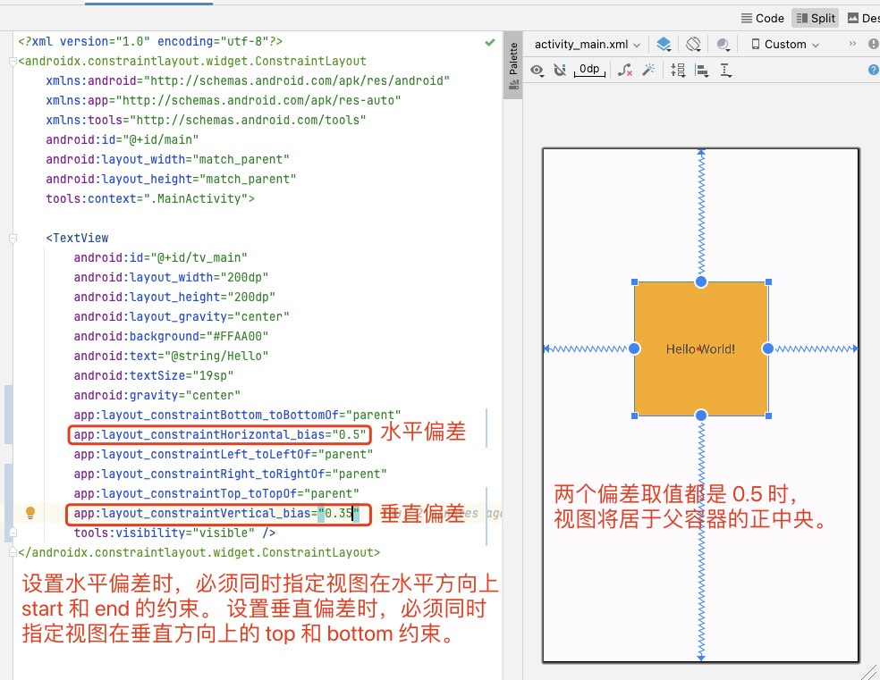


```xml
<?xml version="1.0" encoding="utf-8"?>
<androidx.constraintlayout.widget.ConstraintLayout
    xmlns:android="http://schemas.android.com/apk/res/android"
    xmlns:app="http://schemas.android.com/apk/res-auto"
    xmlns:tools="http://schemas.android.com/tools"
    android:id="@+id/main"
    android:layout_width="match_parent"
    android:layout_height="match_parent"
    tools:context=".MainActivity">

    <TextView
        android:id="@+id/tv_main"
        android:layout_width="200dp"
        android:layout_height="200dp"
        android:layout_gravity="center"
        android:background="#FFAA00"
        android:text="@string/Hello"
        android:textSize="19sp"
        android:gravity="center"
        app:layout_constraintBottom_toBottomOf="parent"
        app:layout_constraintHorizontal_bias="0.5"
        app:layout_constraintLeft_toLeftOf="parent"
        app:layout_constraintRight_toRightOf="parent"
        app:layout_constraintTop_toTopOf="parent"
        app:layout_constraintVertical_bias="0.35"
        tools:visibility="visible" />
</androidx.constraintlayout.widget.ConstraintLayout>
```

#### 1.2.4.5. Circular(环形约束)

* layout_constraintCircle : 取值为基准视图的ID
* layout_constraintCircleRadius : 两个视图中心点的间距
* layout_constraintCircleAngle : 环形角度（取值0-360）

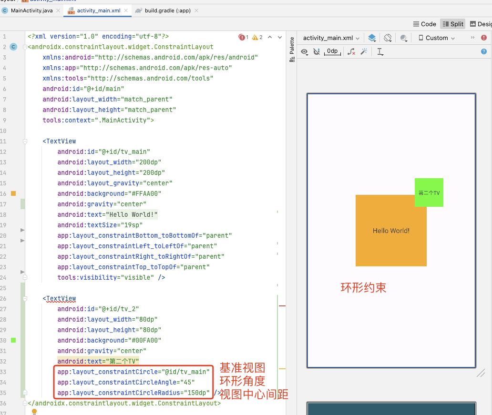

```xml
<?xml version="1.0" encoding="utf-8"?>
<androidx.constraintlayout.widget.ConstraintLayout
    xmlns:android="http://schemas.android.com/apk/res/android"
    xmlns:app="http://schemas.android.com/apk/res-auto"
    xmlns:tools="http://schemas.android.com/tools"
    android:id="@+id/main"
    android:layout_width="match_parent"
    android:layout_height="match_parent"
    tools:context=".MainActivity">

    <TextView
        android:id="@+id/tv_main"
        android:layout_width="200dp"
        android:layout_height="200dp"
        android:layout_gravity="center"
        android:background="#FFAA00"
        android:gravity="center"
        android:text="@string/Hello"
        android:textSize="19sp"
        app:layout_constraintBottom_toBottomOf="parent"
        app:layout_constraintLeft_toLeftOf="parent"
        app:layout_constraintRight_toRightOf="parent"
        app:layout_constraintTop_toTopOf="parent"
        tools:visibility="visible" />

    <TextView
        android:id="@+id/tv_2"
        android:layout_width="80dp"
        android:layout_height="80dp"
        android:background="#00FA00"
        android:gravity="center"
        android:text="第二个TV"
        app:layout_constraintCircle="@id/tv_main"
        app:layout_constraintCircleAngle="45"
        app:layout_constraintCircleRadius="150dp" />
</androidx.constraintlayout.widget.ConstraintLayout>
```

#### 1.2.4.6. Chains(链式约束)

多个子视图、父级容器（ConstraintLayout）之间的约束条件形成了闭合的约束链条，这种就被称为 `链式约束`。

通过 `layout_constraintVertical_chainStyle` 可以指定链式约束的样式，用于控制如何展示多个视图组件之间的空白区域。其取值包括：`spread`（默认值）、`packed`、`spread_inside`。各取值的含义可参考下面的示例进行理解。


* spread(默认值)

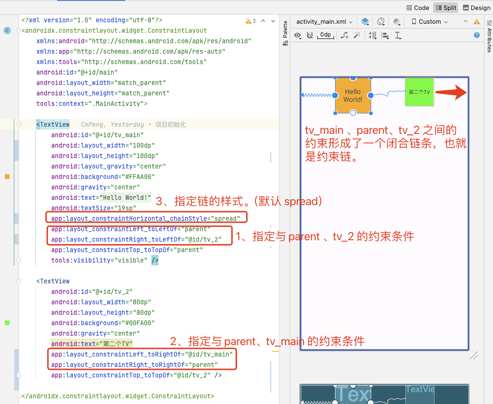

* spread_inside

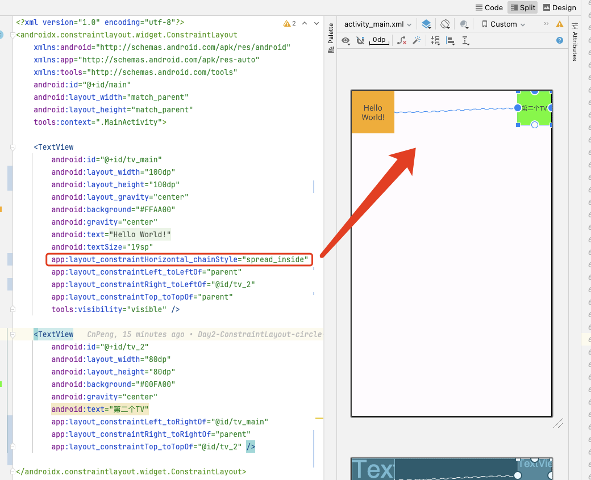

* packed

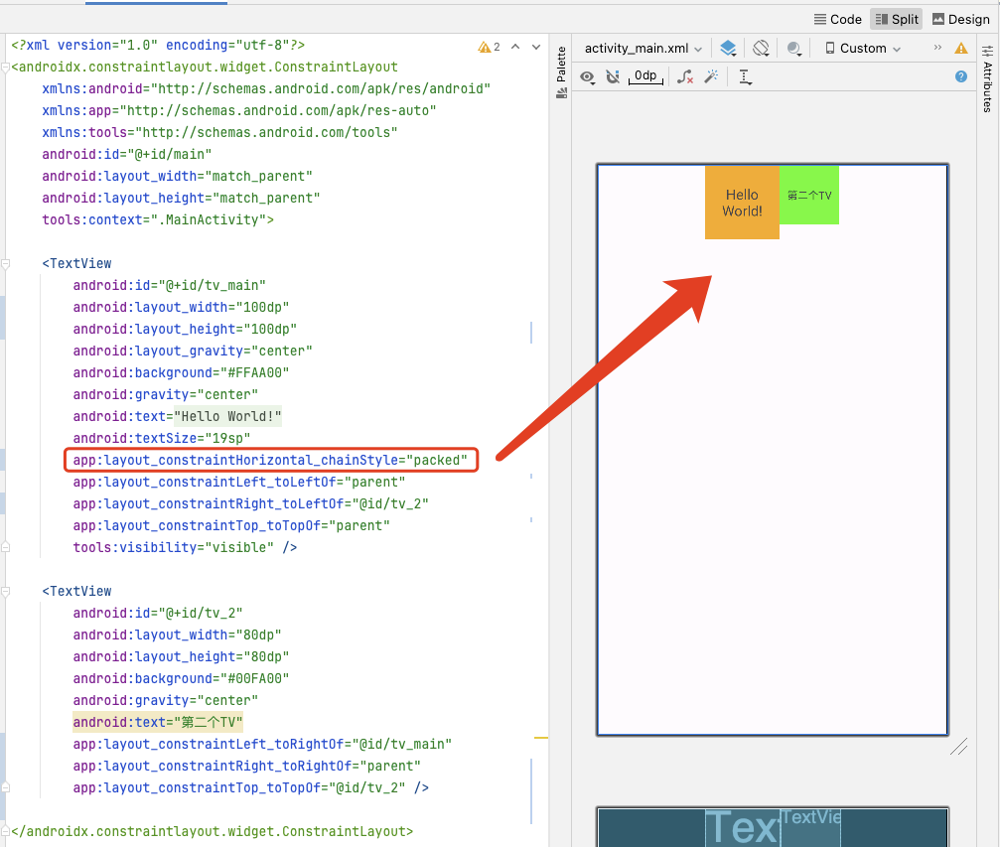

```xml
<?xml version="1.0" encoding="utf-8"?>
<androidx.constraintlayout.widget.ConstraintLayout
    xmlns:android="http://schemas.android.com/apk/res/android"
    xmlns:app="http://schemas.android.com/apk/res-auto"
    xmlns:tools="http://schemas.android.com/tools"
    android:id="@+id/main"
    android:layout_width="match_parent"
    android:layout_height="match_parent"
    tools:context=".MainActivity">

    <TextView
        android:id="@+id/tv_main"
        android:layout_width="100dp"
        android:layout_height="100dp"
        android:layout_gravity="center"
        android:background="#FFAA00"
        android:gravity="center"
        android:text="@string/Hello"
        android:textSize="19sp"
        app:layout_constraintHorizontal_chainStyle="packed"
        app:layout_constraintLeft_toLeftOf="parent"
        app:layout_constraintRight_toLeftOf="@id/tv_2"
        app:layout_constraintTop_toTopOf="parent"
        tools:visibility="visible" />

    <TextView
        android:id="@+id/tv_2"
        android:layout_width="80dp"
        android:layout_height="80dp"
        android:background="#00FA00"
        android:gravity="center"
        android:text="第二个TV"
        app:layout_constraintLeft_toRightOf="@id/tv_main"
        app:layout_constraintRight_toRightOf="parent"
        app:layout_constraintTop_toTopOf="@id/tv_2" />

</androidx.constraintlayout.widget.ConstraintLayout>
```

上述代码中， `tv_main` 的同时指定了左侧约束（相对于parent）、右侧约束（相对于 `tv_2`），`tv_2` 同时指定了左侧约束 （相对于`tv_main`）、右侧约束（相对于 parent），这样就形成了一个闭合的约束链条。ConstraintLayout 会自动识别为链式约束，如未显式声明 `layout_constraintHorizontal_chainStyle`，将默认使用 `spread` 样式。


#### 1.2.4.7. Ratio(比率约束)

多用于限定同一个视图组件的宽高比率。

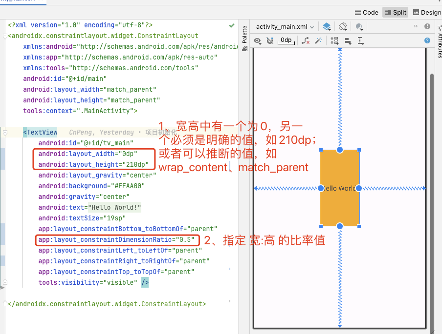

上图中，宽度默认为 0dp，高度默认值为 210dp, 宽度的最终值基于 ratio 的值确定。

`宽度:高度 = 0.5`，所以我们能够看到最终的渲染图中，宽度是高度的一半。

`layout_constraintDimensionRatio` 的取值可以有以下几种形式：

* `a:b`, a 代表宽度，b 代表高度。如：`1:2`
* `0.5`, 即 `宽:高` 的比率值。（示例代码中使用的这种）
* `w,a:b`, `w` 是 `width` 宽度的缩写，表示后面的 `a:b` 中，`:` 前的 a 为宽，后面的 b 为高。
* `h,a:b`, `w` 是 `height` 高度的缩写，表示后面的 `a:b` 中，`:` 前的 a 为高，后面的 b 为宽。

```xml
<?xml version="1.0" encoding="utf-8"?>
<androidx.constraintlayout.widget.ConstraintLayout
    xmlns:android="http://schemas.android.com/apk/res/android"
    xmlns:app="http://schemas.android.com/apk/res-auto"
    xmlns:tools="http://schemas.android.com/tools"
    android:id="@+id/main"
    android:layout_width="match_parent"
    android:layout_height="match_parent"
    tools:context=".MainActivity">

    <TextView
        android:id="@+id/tv_main"
        android:layout_width="0dp"
        android:layout_height="210dp"
        android:layout_gravity="center"
        android:background="#FFAA00"
        android:gravity="center"
        android:text="@string/Hello"
        android:textSize="19sp"
        app:layout_constraintBottom_toBottomOf="parent"
        app:layout_constraintDimensionRatio="w,1:2"
        app:layout_constraintLeft_toLeftOf="parent"
        app:layout_constraintRight_toRightOf="parent"
        app:layout_constraintTop_toTopOf="parent"
        tools:visibility="visible" />

</androidx.constraintlayout.widget.ConstraintLayout>
```

#### 1.2.4.8. Percent(百分比约束)

多用于限定视图组件的宽高相对于父级容器的宽高比。

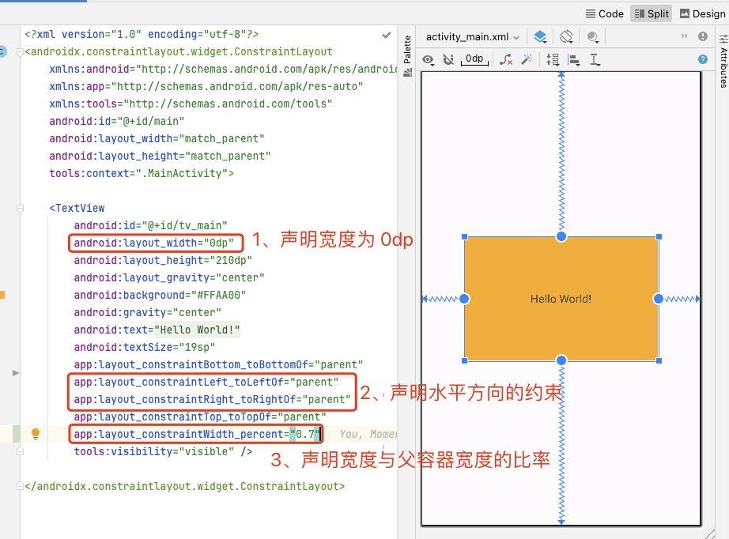

```xml
<?xml version="1.0" encoding="utf-8"?>
<androidx.constraintlayout.widget.ConstraintLayout
    xmlns:android="http://schemas.android.com/apk/res/android"
    xmlns:app="http://schemas.android.com/apk/res-auto"
    xmlns:tools="http://schemas.android.com/tools"
    android:id="@+id/main"
    android:layout_width="match_parent"
    android:layout_height="match_parent"
    tools:context=".MainActivity">

    <TextView
        android:id="@+id/tv_main"
        android:layout_width="0dp"
        android:layout_height="210dp"
        android:layout_gravity="center"
        android:background="#FFAA00"
        android:gravity="center"
        android:text="@string/Hello"
        android:textSize="19sp"
        app:layout_constraintBottom_toBottomOf="parent"
        app:layout_constraintLeft_toLeftOf="parent"
        app:layout_constraintRight_toRightOf="parent"
        app:layout_constraintTop_toTopOf="parent"
        app:layout_constraintWidth_percent="0.7"
        tools:visibility="visible" />

</androidx.constraintlayout.widget.ConstraintLayout>
```

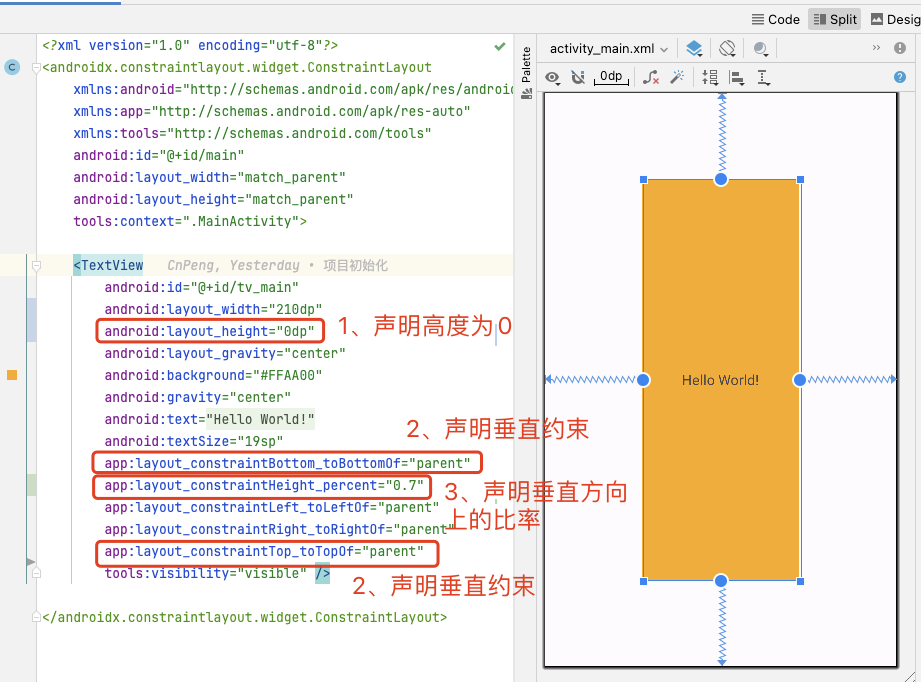

## 1.3. 常用组件及其事件监听

### 1.3.1. TextView

[官方文档：TextView](https://developer.android.google.cn/reference/android/widget/TextView)
[官方文档：TextView完整属性](https://developer.android.google.cn/reference/android/R.styleable#TextView)

用于呈现文本内容。

#### 1.3.1.1. 常用属性

属性 | 含义
---|---
android:textSize	| 文本大小，单位 sp.
android:textStyle	| 文本样式。加粗-bold、倾斜-italic、正常-normal
android:textColor	| 文本颜色
android:ellipsize	| 文本过长时从哪里添加省略号。中间-middle、end-末尾
android:maxLines | 最大显示几行，通常与 ellipsize 配合使用。
android:gravity	| 当视图大而文本少时，文本显示的位置。常用：center-居中。
android:drawableLeft | 在文本左侧展示图片资源。同理还有 Right、Top、Bottom、Start、End。

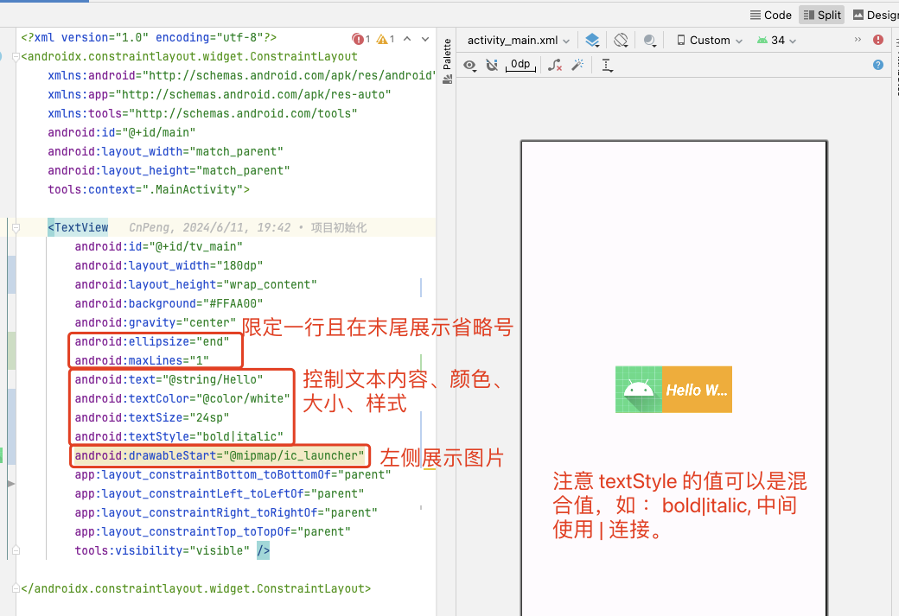

```xml
<?xml version="1.0" encoding="utf-8"?>
<androidx.constraintlayout.widget.ConstraintLayout
    xmlns:android="http://schemas.android.com/apk/res/android"
    xmlns:app="http://schemas.android.com/apk/res-auto"
    xmlns:tools="http://schemas.android.com/tools"
    android:id="@+id/main"
    android:layout_width="match_parent"
    android:layout_height="match_parent"
    tools:context=".MainActivity">

    <TextView
        android:id="@+id/tv_main"
        android:layout_width="180dp"
        android:layout_height="wrap_content"
        android:layout_gravity="center"
        android:background="#FFAA00"
        android:ellipsize="end"
        android:gravity="center"
        android:maxLines="1"
        android:text="@string/Hello"
        android:textColor="@color/white"
        android:textSize="24sp"
        android:textStyle="bold|italic"
        app:drawableLeftCompat="@mipmap/ic_launcher"
        app:layout_constraintBottom_toBottomOf="parent"
        app:layout_constraintLeft_toLeftOf="parent"
        app:layout_constraintRight_toRightOf="parent"
        app:layout_constraintTop_toTopOf="parent"
        tools:visibility="visible" />

</androidx.constraintlayout.widget.ConstraintLayout>
```

#### 1.3.1.2. 使用 span 设置文本样式

 [官方文档：使用 span 设置文本样式](https://developer.android.google.cn/develop/ui/views/text-and-emoji/spans?hl=zh-cn)

Span 是功能强大的标记对象，可用于在字符或段落级别设置文本样式。通过将 Span 附加到文本对象，您可以通过多种方式更改文本，包括添加颜色、使文本可点击、缩放文本大小以及以自定义方式绘制文本。Span 还可以更改 TextPaint 属性、在 Canvas 上绘制以及更改文本布局

##### 1.3.1.2.1. clickSpan

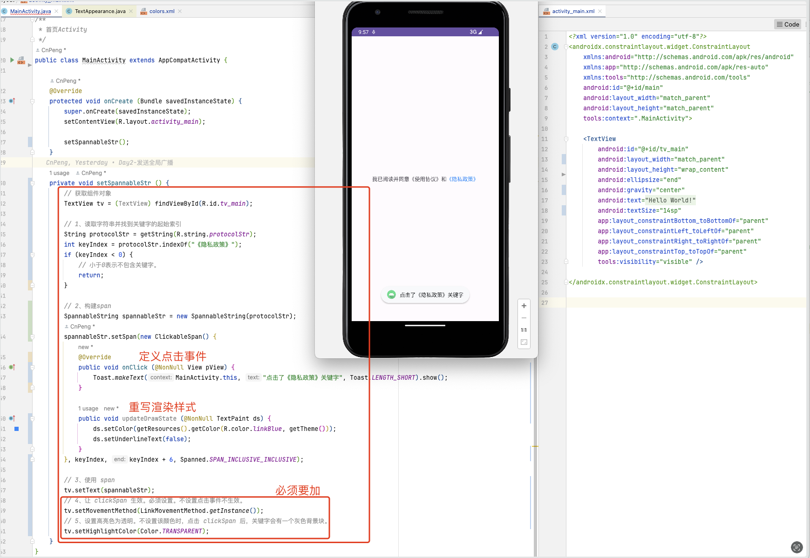

```java
package cn.peng.stu4teach;

import android.graphics.Color;
import android.os.Bundle;
import android.text.SpannableString;
import android.text.Spanned;
import android.text.TextPaint;
import android.text.method.LinkMovementMethod;
import android.text.style.ClickableSpan;
import android.view.View;
import android.widget.TextView;
import android.widget.Toast;

import androidx.annotation.NonNull;
import androidx.appcompat.app.AppCompatActivity;

/**
 * 首页Activity
 */
public class MainActivity extends AppCompatActivity {

    @Override
    protected void onCreate (Bundle savedInstanceState) {
        super.onCreate(savedInstanceState);
        setContentView(R.layout.activity_main);

        setSpannableStr();
    }

    private void setSpannableStr () {
        // 获取组件对象
        TextView tv = (TextView) findViewById(R.id.tv_main);

        // 1、读取字符串并找到关键字的起始索引
        String protocolStr = getString(R.string.protocolStr);
        int keyIndex = protocolStr.indexOf("《隐私政策》");
        if (keyIndex < 0) {
            // 小于0表示不包含关键字。
            return;
        }

        // 2、构建span
        SpannableString spannableStr = new SpannableString(protocolStr);
        spannableStr.setSpan(new ClickableSpan() {
            @Override
            public void onClick (@NonNull View pView) {
                Toast.makeText(MainActivity.this, "点击了《隐私政策》关键字", Toast.LENGTH_SHORT).show();
            }

            public void updateDrawState (@NonNull TextPaint ds) {
                ds.setColor(getResources().getColor(R.color.linkBlue, getTheme()));
                ds.setUnderlineText(false);
            }
        }, keyIndex, keyIndex + 6, Spanned.SPAN_INCLUSIVE_INCLUSIVE);

        // 3、使用 span
        tv.setText(spannableStr);
        // 4、让 clickSpan 生效。必须设置。不设置点击事件不生效。
        tv.setMovementMethod(LinkMovementMethod.getInstance());
        // 5、设置高亮色为透明。不设置该颜色时，点击 clickSpan 后，关键字会有一个灰色背景块。
        tv.setHighlightColor(Color.TRANSPARENT);
    }
}
```

```xml
<?xml version="1.0" encoding="utf-8"?>
<androidx.constraintlayout.widget.ConstraintLayout
    xmlns:android="http://schemas.android.com/apk/res/android"
    xmlns:app="http://schemas.android.com/apk/res-auto"
    xmlns:tools="http://schemas.android.com/tools"
    android:id="@+id/main"
    android:layout_width="match_parent"
    android:layout_height="match_parent"
    tools:context=".MainActivity">

    <TextView
        android:id="@+id/tv_main"
        android:layout_width="match_parent"
        android:layout_height="wrap_content"
        android:ellipsize="end"
        android:gravity="center"
        android:text="@string/Hello"
        android:textSize="14sp"
        app:layout_constraintBottom_toBottomOf="parent"
        app:layout_constraintLeft_toLeftOf="parent"
        app:layout_constraintRight_toRightOf="parent"
        app:layout_constraintTop_toTopOf="parent"
        tools:visibility="visible" />

</androidx.constraintlayout.widget.ConstraintLayout>
```

```xml
<resources>
    <string name="app_name">Stu4Teach</string>
    <string name="Hello">Hello World!</string>
    <string name="protocolStr">我已阅读并同意《使用协议》和《隐私政策》</string>
</resources>
```

```xml
<?xml version="1.0" encoding="utf-8"?>
<resources>
    <color name="black">#FF000000</color>
    <color name="white">#FFFFFFFF</color>
    <color name="linkBlue">#0388FD</color>
</resources>
```


##### 1.3.1.2.2. 注意事项-setMovementMethod()

> 了解即可

在 Android 中，当你想要使 TextView 中的某些文本具有点击效果时，通常会使用`ClickSpan`或其子类（如自定义的`ClickableSpan`）。但是，仅设置这些Span并不足以使TextView识别并处理点击事件。这就涉及到`setMovementMethod()`方法的使用。

`setMovementMethod(LinkMovementMethod.getInstance())`的作用是为TextView指定一个MovementMethod，这个MovementMethod负责处理文本视图中的触摸事件。默认情况下，TextView使用的是`ScrollingMovementMethod`，它主要用于处理文本滚动。而`LinkMovementMethod`是专门设计来处理链接点击的，它能识别到`ClickableSpan`并触发相关的点击事件。

当TextView中有`ClickableSpan`时，如果不调用`setMovementMethod(LinkMovementMethod.getInstance())`，点击事件将不会被触发，因为TextView不知道该如何处理这些Span中的点击逻辑。通过设置为`LinkMovementMethod`，TextView就能识别并委托给`ClickableSpan`处理点击动作，从而实现点击文本时的交互效果，比如启动新活动、弹出对话框等。

因此，为了使带有`ClickableSpan`的TextView能够响应点击，调用`setMovementMethod(LinkMovementMethod.getInstance())`是必要的步骤。

##### 1.3.1.2.3. 注意事项-清除高亮背景

> 了解即可

在Android中，当你使用`ClickableSpan`并点击其中的文本时，默认情况下，被点击的文本周围会出现一个短暂的高亮背景色块，这个通常是系统默认的点击反馈效果。如果你想移除这个灰色背景块，可以通过设置TextView的`setHighlightColor`方法为透明色来实现。

下面是示例代码：

```java
TextView textView = findViewById(R.id.tv_main);
// 设置你的ClickableSpan以及其他属性
// ...

// 移除点击高亮背景
textView.setHighlightColor(Color.TRANSPARENT);
```

这段代码会使得在`TextView`中点击`ClickableSpan`时，不再出现灰色背景块。`Color.TRANSPARENT`是一个透明色值，这样就清除了点击时的高亮效果。

##### 1.3.1.2.4. 更多可用的span

> 了解即可

[官方文档：更多可用的span](https://developer.android.google.cn/reference/android/text/style/package-summary)


#### 1.3.1.3. 其他

> 了解即可。实际开发中有用，但频率不高。

* [自动调整 TextView 的大小](https://developer.android.google.cn/develop/ui/views/text-and-emoji/autosizing-textview?hl=zh-cn)
* [添加对表情符号的支持](https://developer.android.google.cn/develop/ui/views/text-and-emoji/emoji2?hl=zh-cn)
* [实现文本放大镜](https://developer.android.google.cn/develop/ui/views/text-and-emoji/magnifier?hl=zh-cn)


### 1.3.2. EditText

[官方文档：EditText](https://developer.android.google.cn/reference/android/widget/EditText)

用于输入文本内容，是 TextView 的子类。


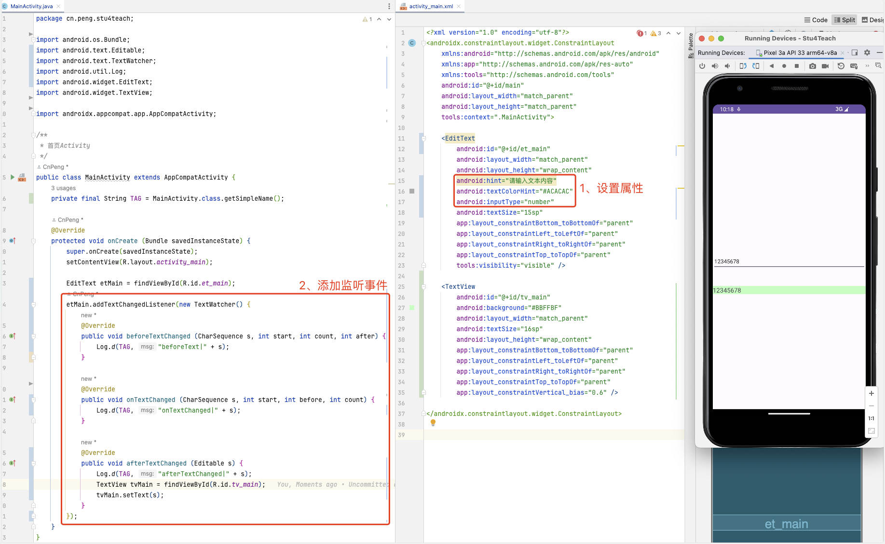


```java
package cn.peng.stu4teach;

import android.os.Bundle;
import android.text.Editable;
import android.text.TextWatcher;
import android.util.Log;
import android.widget.EditText;
import android.widget.TextView;

import androidx.appcompat.app.AppCompatActivity;

/**
 * 首页Activity
 */
public class MainActivity extends AppCompatActivity {
    private final String TAG = MainActivity.class.getSimpleName();

    @Override
    protected void onCreate (Bundle savedInstanceState) {
        super.onCreate(savedInstanceState);
        setContentView(R.layout.activity_main);

        EditText etMain = findViewById(R.id.et_main);
        etMain.addTextChangedListener(new TextWatcher() {
            @Override
            public void beforeTextChanged (CharSequence s, int start, int count, int after) {
                Log.d(TAG, "beforeText|" + s);
            }

            @Override
            public void onTextChanged (CharSequence s, int start, int before, int count) {
                Log.d(TAG, "onTextChanged|" + s);
            }

            @Override
            public void afterTextChanged (Editable s) {
                Log.d(TAG, "afterTextChanged|" + s);
                TextView tvMain = findViewById(R.id.tv_main);
                tvMain.setText(s);
            }
        });
    }
}
```


```xml
<?xml version="1.0" encoding="utf-8"?>
<androidx.constraintlayout.widget.ConstraintLayout
    xmlns:android="http://schemas.android.com/apk/res/android"
    xmlns:app="http://schemas.android.com/apk/res-auto"
    xmlns:tools="http://schemas.android.com/tools"
    android:id="@+id/main"
    android:layout_width="match_parent"
    android:layout_height="match_parent"
    tools:context=".MainActivity">

    <EditText
        android:id="@+id/et_main"
        android:layout_width="match_parent"
        android:layout_height="wrap_content"
        android:hint="请输入文本内容"
        android:textColorHint="#ACACAC"
        android:inputType="number"
        android:textSize="15sp"
        app:layout_constraintBottom_toBottomOf="parent"
        app:layout_constraintLeft_toLeftOf="parent"
        app:layout_constraintRight_toRightOf="parent"
        app:layout_constraintTop_toTopOf="parent"
        tools:visibility="visible" />

    <TextView
        android:id="@+id/tv_main"
        android:background="#BBFFBF"
        android:layout_width="match_parent"
        android:textSize="16sp"
        android:layout_height="wrap_content"
        app:layout_constraintBottom_toBottomOf="parent"
        app:layout_constraintLeft_toLeftOf="parent"
        app:layout_constraintRight_toRightOf="parent"
        app:layout_constraintTop_toTopOf="parent"
        app:layout_constraintVertical_bias="0.6" />

</androidx.constraintlayout.widget.ConstraintLayout>
```

### 1.3.3. Button

* [官方文档：按钮](https://developer.android.google.cn/develop/ui/views/components/button?hl=zh-cn)
* [官方文档：按钮](https://developer.android.google.cn/reference/android/widget/Button)

按钮，主要用于与用户的交互。

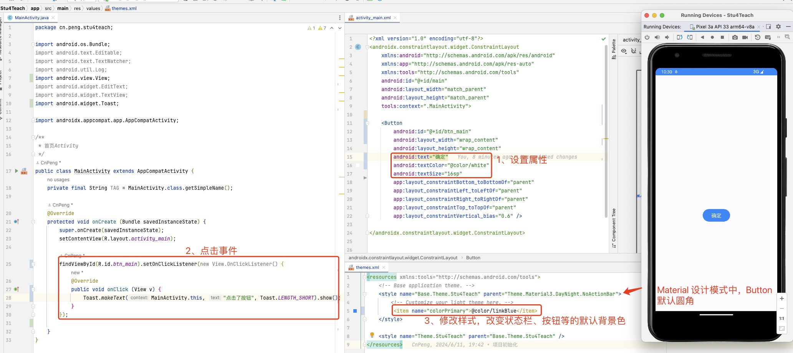

### 1.3.4. 复选框

复选框可让用户从选项集中选择一个或多个选项。

[官方文档-复选框](https://developer.android.google.cn/develop/ui/views/components/checkbox?hl=zh-cn)

[官方文档：CheckBox](https://developer.android.google.cn/reference/android/widget/CheckBox#inherited-xml-attributes)

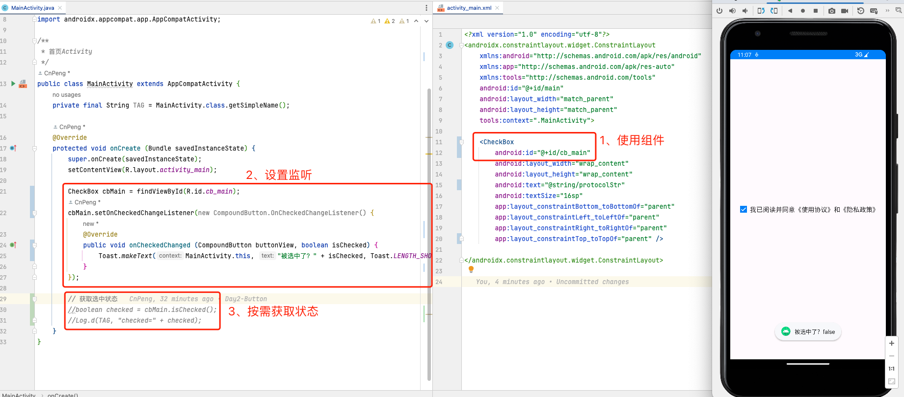

```java
package cn.peng.stu4teach;

import android.os.Bundle;
import android.widget.CheckBox;
import android.widget.CompoundButton;
import android.widget.Toast;

import androidx.appcompat.app.AppCompatActivity;

/**
 * 首页Activity
 */
public class MainActivity extends AppCompatActivity {
    private final String TAG = MainActivity.class.getSimpleName();

    @Override
    protected void onCreate (Bundle savedInstanceState) {
        super.onCreate(savedInstanceState);
        setContentView(R.layout.activity_main);

        CheckBox cbMain = findViewById(R.id.cb_main);
        cbMain.setOnCheckedChangeListener(new CompoundButton.OnCheckedChangeListener() {
            @Override
            public void onCheckedChanged (CompoundButton buttonView, boolean isChecked) {
                Toast.makeText(MainActivity.this, "被选中了？" + isChecked, Toast.LENGTH_SHORT).show();
            }
        });

        // 获取选中状态
        //boolean checked = cbMain.isChecked();
        //Log.d(TAG, "checked=" + checked);
    }
}
```

```xml
<?xml version="1.0" encoding="utf-8"?>
<androidx.constraintlayout.widget.ConstraintLayout
    xmlns:android="http://schemas.android.com/apk/res/android"
    xmlns:app="http://schemas.android.com/apk/res-auto"
    xmlns:tools="http://schemas.android.com/tools"
    android:id="@+id/main"
    android:layout_width="match_parent"
    android:layout_height="match_parent"
    tools:context=".MainActivity">

    <CheckBox
        android:id="@+id/cb_main"
        android:layout_width="wrap_content"
        android:layout_height="wrap_content"
        android:text="@string/protocolStr"
        android:textSize="16sp"
        app:layout_constraintBottom_toBottomOf="parent"
        app:layout_constraintLeft_toLeftOf="parent"
        app:layout_constraintRight_toRightOf="parent"
        app:layout_constraintTop_toTopOf="parent" />

</androidx.constraintlayout.widget.ConstraintLayout>
```

## 1.4. DataBinding（重点、难点）

[官网：数据绑定库](https://developer.android.google.cn/topic/libraries/data-binding?hl=zh-cn)


### 1.4.1. 简介

DataBinding 即数据绑定，能够让我们更便捷的将数据和视图进行绑定，简化数据呈现逻辑。

使用 DataBinding 后可以抛弃传统的 `findViewByID()`，不用过多的关注视图对象的类型，简化了数据呈现逻辑。DataBinding 比 ViewBinding 具有更强大的功能。


### 1.4.2. DataBinding 基础使用

#### 1.4.2.1. 启用 DataBinding

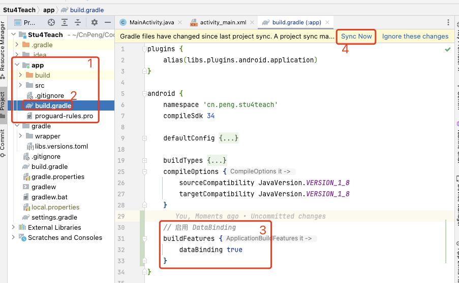

#### 1.4.2.2. 基础使用

##### 1.4.2.2.1. 布局文件转换

* 转换已有布局为 DataBinding 布局

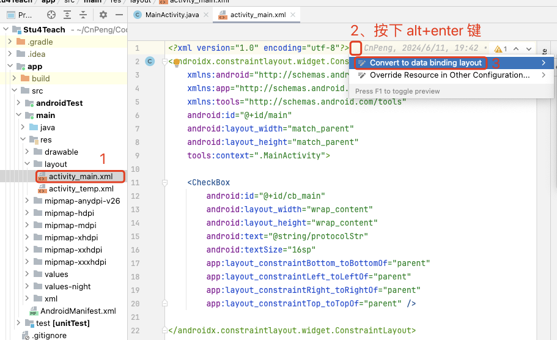

* 转换后

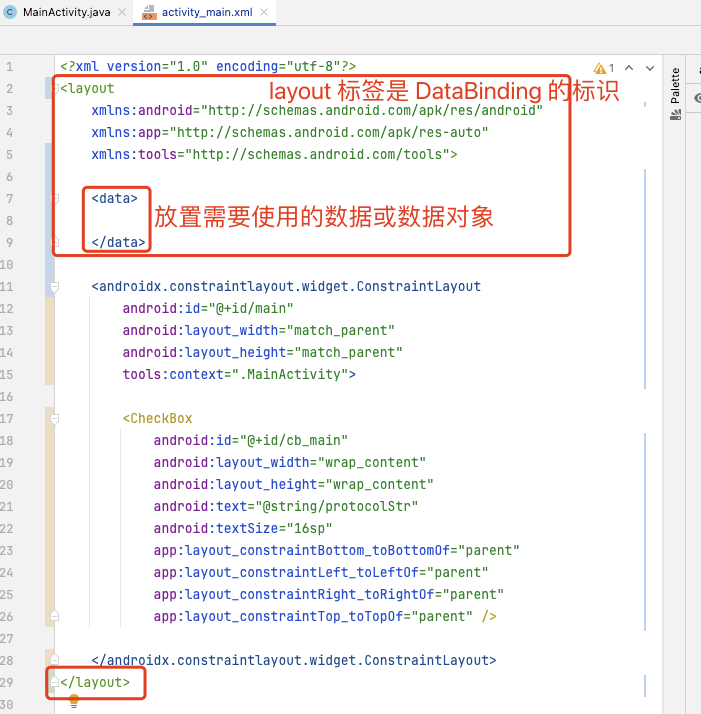

如果是新建页面，也是安装如上样子组织 xml 布局结构。

* 根节点使用 `layout`
* `data` 节点放置需要使用的数据或对象
* 布局容器作为 `layout` 的子节点

##### 1.4.2.2.2. Activity 文件转换

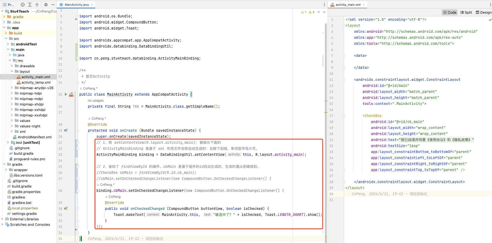

```java
package cn.peng.stu4teach;

import android.os.Bundle;
import android.widget.CompoundButton;
import android.widget.Toast;

import androidx.appcompat.app.AppCompatActivity;
import androidx.databinding.DataBindingUtil;

import cn.peng.stu4teach.databinding.ActivityMainBinding;

/**
 * 首页Activity
 */
public class MainActivity extends AppCompatActivity {
    private final String TAG = MainActivity.class.getSimpleName();

    @Override
    protected void onCreate (Bundle savedInstanceState) {
        super.onCreate(savedInstanceState);
        // 1、将 setContentView(R.layout.activity_main); 替换为下面的
        // ActivityMainBinding 是基于 xml 布局文件名称自动生成的：去除下划线，单词首字母大写。
        ActivityMainBinding binding = DataBindingUtil.setContentView(this, R.layout.activity_main);

        // 2、省却了 findViewById 的操作。cbMain 是基于组件的id自动生成的，生成时遵从驼峰规则。
        //CheckBox cbMain = findViewById(R.id.cb_main);
        //cbMain.setOnCheckedChangeListener(new CompoundButton.OnCheckedChangeListener() {
        binding.cbMain.setOnCheckedChangeListener(new CompoundButton.OnCheckedChangeListener() {
            @Override
            public void onCheckedChanged (CompoundButton buttonView, boolean isChecked) {
                Toast.makeText(MainActivity.this, "被选中了？" + isChecked, Toast.LENGTH_SHORT).show();
            }
        });
    }
}
```

```xml
<?xml version="1.0" encoding="utf-8"?>
<layout
    xmlns:android="http://schemas.android.com/apk/res/android"
    xmlns:app="http://schemas.android.com/apk/res-auto"
    xmlns:tools="http://schemas.android.com/tools">

    <data>

    </data>

    <androidx.constraintlayout.widget.ConstraintLayout
        android:id="@+id/main"
        android:layout_width="match_parent"
        android:layout_height="match_parent"
        tools:context=".MainActivity">

        <CheckBox
            android:id="@+id/cb_main"
            android:layout_width="wrap_content"
            android:layout_height="wrap_content"
            android:text="@string/protocolStr"
            android:textSize="16sp"
            app:layout_constraintBottom_toBottomOf="parent"
            app:layout_constraintLeft_toLeftOf="parent"
            app:layout_constraintRight_toRightOf="parent"
            app:layout_constraintTop_toTopOf="parent" />

    </androidx.constraintlayout.widget.ConstraintLayout>
</layout>
```

##### 1.4.2.2.3. 绑定事件-方式1

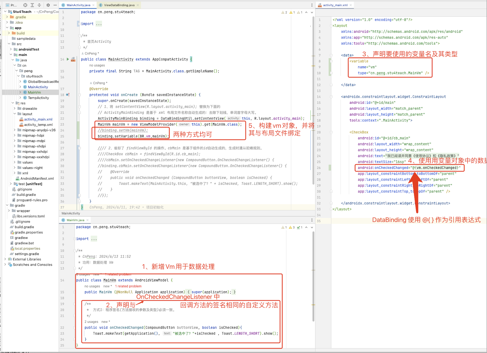

```java
package cn.peng.stu4teach;

import android.os.Bundle;

import androidx.appcompat.app.AppCompatActivity;
import androidx.databinding.DataBindingUtil;
import androidx.lifecycle.ViewModelProvider;

import cn.peng.stu4teach.databinding.ActivityMainBinding;

/**
 * 首页Activity
 */
public class MainActivity extends AppCompatActivity {
    private final String TAG = MainActivity.class.getSimpleName();

    @Override
    protected void onCreate (Bundle savedInstanceState) {
        super.onCreate(savedInstanceState);
        // 1、将 setContentView(R.layout.activity_main); 替换为下面的
        // ActivityMainBinding 是基于 xml 布局文件名称自动生成的：去除下划线，单词首字母大写。
        ActivityMainBinding binding = DataBindingUtil.setContentView(this, R.layout.activity_main);
        MainVm mainVm = new ViewModelProvider(this).get(MainVm.class);
        //binding.setVm(mainVm);
        binding.setVariable(BR.vm,mainVm);

        //// 2、省却了 findViewById 的操作。cbMain 是基于组件的id自动生成的，生成时遵从驼峰规则。
        ////CheckBox cbMain = findViewById(R.id.cb_main);
        ////cbMain.setOnCheckedChangeListener(new CompoundButton.OnCheckedChangeListener() {
        //binding.cbMain.setOnCheckedChangeListener(new CompoundButton.OnCheckedChangeListener() {
        //    @Override
        //    public void onCheckedChanged (CompoundButton buttonView, boolean isChecked) {
        //        Toast.makeText(MainActivity.this, "被选中了？" + isChecked, Toast.LENGTH_SHORT).show();
        //    }
        //});
    }
}
```


```java
package cn.peng.stu4teach;

import android.app.Application;
import android.widget.CompoundButton;
import android.widget.Toast;

import androidx.annotation.NonNull;
import androidx.lifecycle.AndroidViewModel;

/**
 * CnPeng: 2024/6/13 11:52
 * 功用：数据处理 Vm
 */
public class MainVm extends AndroidViewModel {
    public MainVm (@NonNull Application application) {
        super(application);
    }

    /**
     *  方式1：程序签名(方法接收的参数及类型)必须一致。
     */
    public void onCheckedChanged(CompoundButton buttonView, boolean isChecked){
        Toast.makeText(getApplication(), "被选中了？"+isChecked , Toast.LENGTH_SHORT).show();
    }
}
```

```java
<?xml version="1.0" encoding="utf-8"?>
<layout
    xmlns:android="http://schemas.android.com/apk/res/android"
    xmlns:app="http://schemas.android.com/apk/res-auto"
    xmlns:tools="http://schemas.android.com/tools">

    <data>
        <variable
            name="vm"
            type="cn.peng.stu4teach.MainVm" />

    </data>

    <androidx.constraintlayout.widget.ConstraintLayout
        android:id="@+id/main"
        android:layout_width="match_parent"
        android:layout_height="match_parent"
        tools:context=".MainActivity">

        <CheckBox
            android:id="@+id/cb_main"
            android:layout_width="wrap_content"
            android:layout_height="wrap_content"
            android:text="@string/protocolStr"
            android:textSize="16sp"
            android:onCheckedChanged="@{vm.onCheckedChanged}"
            app:layout_constraintBottom_toBottomOf="parent"
            app:layout_constraintLeft_toLeftOf="parent"
            app:layout_constraintRight_toRightOf="parent"
            app:layout_constraintTop_toTopOf="parent" />

    </androidx.constraintlayout.widget.ConstraintLayout>
</layout>
```

##### 1.4.2.2.4. 绑定事件-方式2

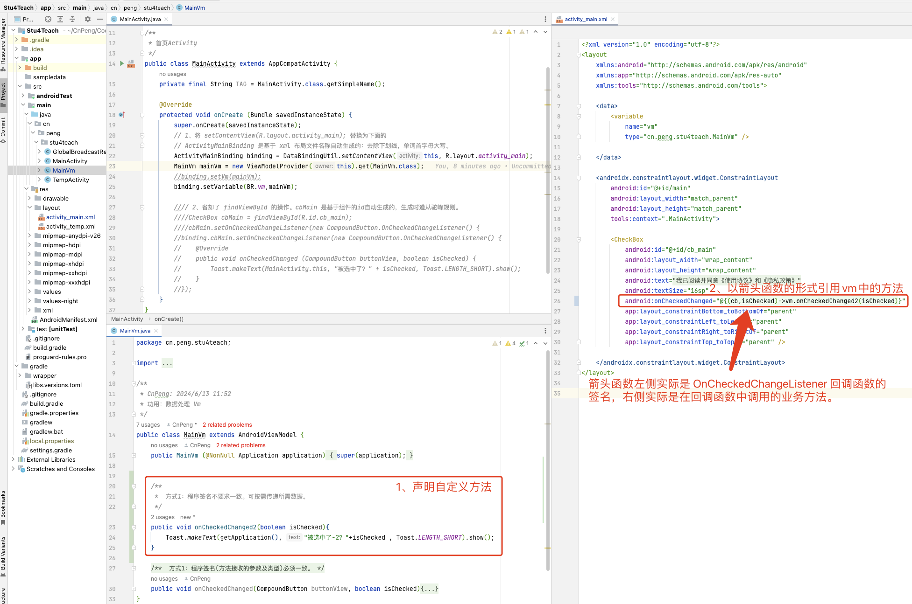

```java
package cn.peng.stu4teach;

import android.app.Application;
import android.widget.CompoundButton;
import android.widget.Toast;

import androidx.annotation.NonNull;
import androidx.lifecycle.AndroidViewModel;

/**
 * CnPeng: 2024/6/13 11:52
 * 功用：数据处理 Vm
 */
public class MainVm extends AndroidViewModel {
    public MainVm (@NonNull Application application) {
        super(application);
    }


    /**
     *  方式1：程序签名不要求一致。可按需传递所需数据。
     */
    public void onCheckedChanged2(boolean isChecked){
        Toast.makeText(getApplication(), "被选中了-2？"+isChecked , Toast.LENGTH_SHORT).show();
    }

    /**
     *  方式1：程序签名(方法接收的参数及类型)必须一致。
     */
    public void onCheckedChanged(CompoundButton buttonView, boolean isChecked){
        Toast.makeText(getApplication(), "被选中了？"+isChecked , Toast.LENGTH_SHORT).show();
    }
}
```


```xml
<?xml version="1.0" encoding="utf-8"?>
<layout
    xmlns:android="http://schemas.android.com/apk/res/android"
    xmlns:app="http://schemas.android.com/apk/res-auto"
    xmlns:tools="http://schemas.android.com/tools">

    <data>
        <variable
            name="vm"
            type="cn.peng.stu4teach.MainVm" />

    </data>

    <androidx.constraintlayout.widget.ConstraintLayout
        android:id="@+id/main"
        android:layout_width="match_parent"
        android:layout_height="match_parent"
        tools:context=".MainActivity">

        <CheckBox
            android:id="@+id/cb_main"
            android:layout_width="wrap_content"
            android:layout_height="wrap_content"
            android:text="@string/protocolStr"
            android:textSize="16sp"
            android:onCheckedChanged="@{(cb,isChecked)->vm.onCheckedChanged2(isChecked)}"
            app:layout_constraintBottom_toBottomOf="parent"
            app:layout_constraintLeft_toLeftOf="parent"
            app:layout_constraintRight_toRightOf="parent"
            app:layout_constraintTop_toTopOf="parent" />

    </androidx.constraintlayout.widget.ConstraintLayout>
</layout>
```

##### 1.4.2.2.5. 绑定数据

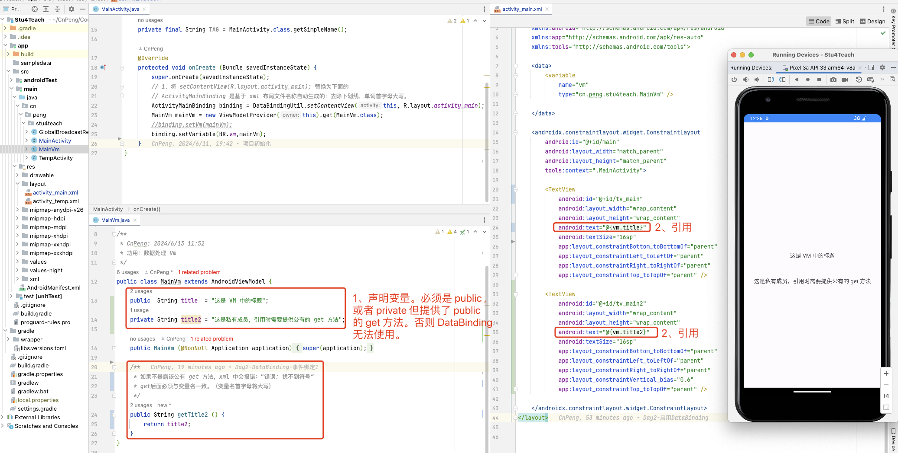

```java
package cn.peng.stu4teach;

import android.app.Application;

import androidx.annotation.NonNull;
import androidx.lifecycle.AndroidViewModel;

/**
 * CnPeng: 2024/6/13 11:52
 * 功用：数据处理 Vm
 */
public class MainVm extends AndroidViewModel {
    public  String title  = "这是 VM 中的标题";
    private String title2 = "这是私有成员，引用时需要提供公有的 get 方法";

    public MainVm (@NonNull Application application) {
        super(application);
    }

    /**
     * 如果不暴露该公有 get 方法，xml 中会报错：”错误: 找不到符号“
     * get后面必须与变量名一致。（变量名首字母将大写）
     */
    public String getTitle2 () {
        return title2;
    }
}
```

```xml
<?xml version="1.0" encoding="utf-8"?>
<layout
    xmlns:android="http://schemas.android.com/apk/res/android"
    xmlns:app="http://schemas.android.com/apk/res-auto"
    xmlns:tools="http://schemas.android.com/tools">

    <data>
        <variable
            name="vm"
            type="cn.peng.stu4teach.MainVm" />

    </data>

    <androidx.constraintlayout.widget.ConstraintLayout
        android:id="@+id/main"
        android:layout_width="match_parent"
        android:layout_height="match_parent"
        tools:context=".MainActivity">

        <TextView
            android:id="@+id/tv_main"
            android:layout_width="wrap_content"
            android:layout_height="wrap_content"
            android:text="@{vm.title}"
            android:textSize="16sp"
            app:layout_constraintBottom_toBottomOf="parent"
            app:layout_constraintLeft_toLeftOf="parent"
            app:layout_constraintRight_toRightOf="parent"
            app:layout_constraintTop_toTopOf="parent" />

        <TextView
            android:id="@+id/tv_main2"
            android:layout_width="wrap_content"
            android:layout_height="wrap_content"
            android:text="@{vm.title2}"
            android:textSize="16sp"
            app:layout_constraintBottom_toBottomOf="parent"
            app:layout_constraintLeft_toLeftOf="parent"
            app:layout_constraintRight_toRightOf="parent"
            app:layout_constraintVertical_bias="0.6"
            app:layout_constraintTop_toTopOf="parent" />

    </androidx.constraintlayout.widget.ConstraintLayout>
</layout>
```

##### 1.4.2.2.6. 数据的双向绑定

[官方文档：双向数据绑定](https://developer.android.google.cn/topic/libraries/data-binding/two-way?hl=zh-cn)

视图呈现 ViewModel 中的数据；通过视图修改数据时，会及时更新到 ViewModel 中。

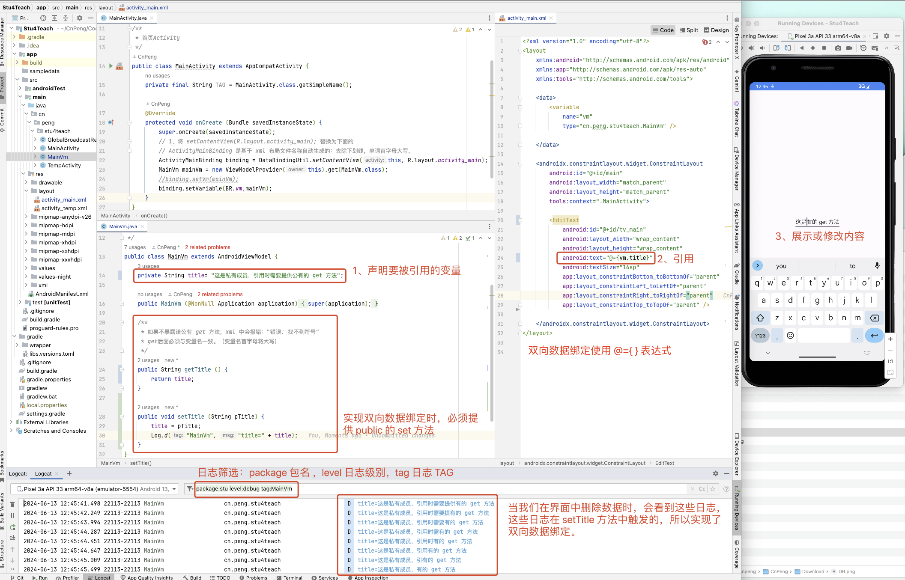


```java
package cn.peng.stu4teach;

import android.app.Application;
import android.util.Log;

import androidx.annotation.NonNull;
import androidx.lifecycle.AndroidViewModel;

/**
 * CnPeng: 2024/6/13 11:52
 * 功用：数据处理 Vm
 */
public class MainVm extends AndroidViewModel {
    private String title= "这是私有成员，引用时需要提供公有的 get 方法";

    public MainVm (@NonNull Application application) {
        super(application);
    }

    /**
     * 如果不暴露该公有 get 方法，xml 中会报错：”错误: 找不到符号“
     * get后面必须与变量名一致。（变量名首字母将大写）
     */
    public String getTitle () {
        return title;
    }

    public void setTitle (String pTitle) {
        title = pTitle;
        Log.d("MainVm", "title=" + title);
    }
}
```

```xml
<?xml version="1.0" encoding="utf-8"?>
<layout
    xmlns:android="http://schemas.android.com/apk/res/android"
    xmlns:app="http://schemas.android.com/apk/res-auto"
    xmlns:tools="http://schemas.android.com/tools">

    <data>
        <variable
            name="vm"
            type="cn.peng.stu4teach.MainVm" />

    </data>

    <androidx.constraintlayout.widget.ConstraintLayout
        android:id="@+id/main"
        android:layout_width="match_parent"
        android:layout_height="match_parent"
        tools:context=".MainActivity">

        <EditText
            android:id="@+id/tv_main"
            android:layout_width="wrap_content"
            android:layout_height="wrap_content"
            android:text="@={vm.title}"
            android:textSize="16sp"
            app:layout_constraintBottom_toBottomOf="parent"
            app:layout_constraintLeft_toLeftOf="parent"
            app:layout_constraintRight_toRightOf="parent"
            app:layout_constraintTop_toTopOf="parent" />

    </androidx.constraintlayout.widget.ConstraintLayout>
</layout>
```

## 1.5. 补充

### 1.5.1. 无法查看源码的问题

如果我们按住 Ctrl 键，然后单击某个方法进入源码界面后，界面中没有对应的注释信息；
如果我们重写某个方法时，方法的参数都是 P1、P2、S1、S2 这种形式；

那么， 就说明咱们没有下载对应 SDK 版本的源码；或者有源码， 但编译版本不匹配。

解决方式如下：

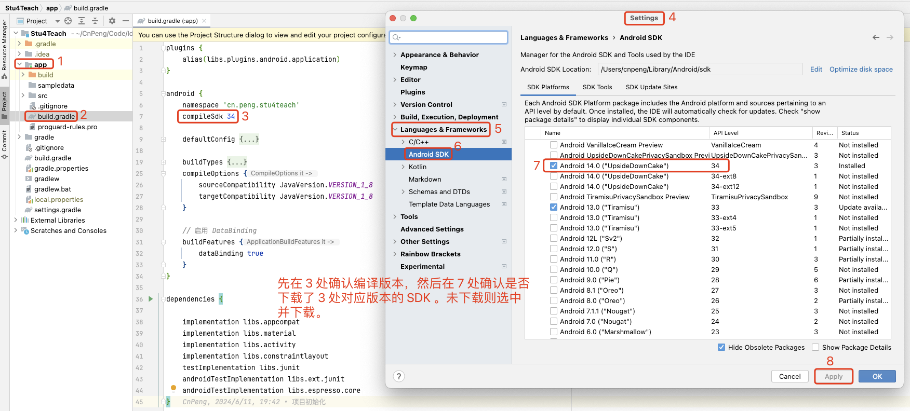


