# 1. 003-Day3

## 1.1. 项目基类封装装

先清除 Day2 中生成的后续用不到的资源/文件信息。然后按下图创建并调整包（文件夹）结构：

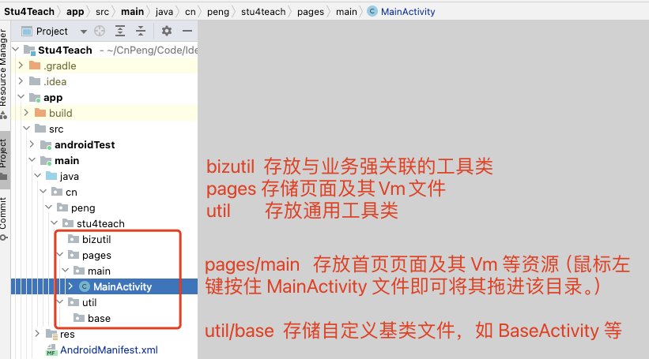

### 1.1.1. BaseActivity 

封装基类 Activity ，简化各子类 Activityt 中的操作。

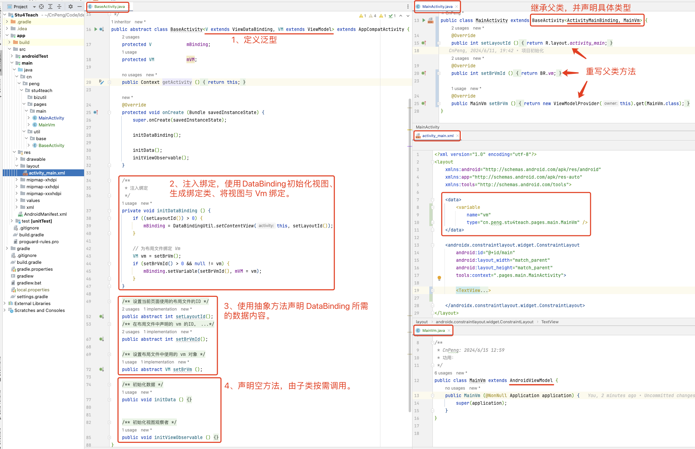

* BaseActivity.java

```java
package cn.peng.stu4teach.util.base;

import android.content.Context;
import android.os.Bundle;

import androidx.appcompat.app.AppCompatActivity;
import androidx.databinding.DataBindingUtil;
import androidx.databinding.ViewDataBinding;
import androidx.lifecycle.ViewModel;


/**
 * 基类 Activity
 * 内部封装了 DataBinding 的绑定操作
 */
public abstract class BaseActivity<V extends ViewDataBinding, VM extends ViewModel> extends AppCompatActivity {
    protected V             mBinding;
    protected VM            mVM;

    public Context getContext () {
        return this;
    }

    @Override
    protected void onCreate (Bundle savedInstanceState) {
        super.onCreate(savedInstanceState);

        initDataBinding();

        initData();
        initViewObservable();
    }

    /**
     * 注入绑定
     */
    private void initDataBinding () {
        if ((setLayoutId()) > 0) {
            mBinding = DataBindingUtil.setContentView(this, setLayoutId());
        }

        // 为布局文件绑定 Vm
        VM vm = setBrVm();
        if (setBrVmId() > 0 && null != vm) {
            mBinding.setVariable(setBrVmId(), mVM = vm);
        }
    }

    /**
     * 设置当前页面使用的布局文件的ID
     */
    public abstract int setLayoutId();
    /**
     * 在布局文件中声明的 vm 的ID。
     * 假设布局文件中有如下设置：
     * <p>
     * <data>
     * <variable
     * name="vm"
     * type="cn.peng.main.MainVm" />
     * </data>
     * <p>
     * 那么，DataBinding 会使用 name 的值为 name 生成一个 ID , 上面代码生成的 ID 为 BR.vm。
     * <p>
     * 我们这里需要的就是这个ID
     */
    public abstract int setBrVmId();

    /**
     * 设置布局文件中使用的 vm 对象
     */
    public abstract VM setBrVm ();

    /**
     * 初始化数据
     */
    public void initData () {
        // 由子类实现
    }


    /**
     * 初始化视图观察者
     */
    public void initViewObservable () {
        // 由子类实现
    }
}
```

* MainActivity.java

```java
package cn.peng.stu4teach.pages.main;

import androidx.databinding.library.baseAdapters.BR;
import androidx.lifecycle.ViewModelProvider;

import cn.peng.stu4teach.R;
import cn.peng.stu4teach.databinding.ActivityMainBinding;
import cn.peng.stu4teach.util.base.BaseActivity;

/**
 * 首页Activity
 */
public class MainActivity extends BaseActivity<ActivityMainBinding, MainVm> {
    @Override
    public int setLayoutId () {
        return R.layout.activity_main;
    }

    @Override
    public int setBrVmId () {
        return BR.vm;
    }

    @Override
    public MainVm setBrVm () {
        return new ViewModelProvider(this).get(MainVm.class);
    }
}
```

* MainVm.java

```java
package cn.peng.stu4teach.pages.main;

import android.app.Application;

import androidx.annotation.NonNull;
import androidx.lifecycle.AndroidViewModel;

/**
 * CnPeng: 2024/6/15 12:59
 * 功用：
 */
public class MainVm extends AndroidViewModel {
    public MainVm (@NonNull Application application) {
        super(application);
    }
}
```


* activity_main.xml

```xml
<?xml version="1.0" encoding="utf-8"?>
<layout
    xmlns:android="http://schemas.android.com/apk/res/android"
    xmlns:app="http://schemas.android.com/apk/res-auto"
    xmlns:tools="http://schemas.android.com/tools">

    <data>
        <variable
            name="vm"
            type="cn.peng.stu4teach.pages.main.MainVm" />
    </data>

    <androidx.constraintlayout.widget.ConstraintLayout
        android:id="@+id/main"
        android:layout_width="match_parent"
        android:layout_height="match_parent"
        tools:context=".pages.main.MainActivity">

    </androidx.constraintlayout.widget.ConstraintLayout>
</layout>
```

### 1.1.2. BaseFragment 

[官方文档：Fragment-Guide](https://developer.android.google.cn/guide/fragments?hl=zh-cn)

Fragment 即片段，是一组视图组成的视图模块。需要借助 Activity 对外呈现。

Fragment 的声明周期如下图：

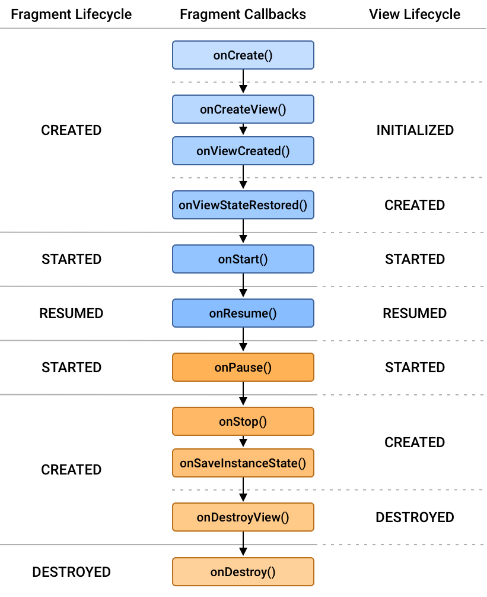


将 Fragment 的通用逻辑包装到 Fragment 基类中，简化初始化创建 Fragment 的操作逻辑。

```java
package cn.peng.stu4teach.util.base;

import android.content.Context;
import android.os.Bundle;
import android.view.LayoutInflater;
import android.view.View;
import android.view.ViewGroup;

import androidx.annotation.NonNull;
import androidx.annotation.Nullable;
import androidx.databinding.DataBindingUtil;
import androidx.databinding.ViewDataBinding;
import androidx.fragment.app.Fragment;
import androidx.lifecycle.ViewModel;


/**
 * Fragment 基类
 */
public abstract class BaseFragment<V extends ViewDataBinding, VM extends ViewModel> extends Fragment {
    protected V            mBinding;
    protected VM           mVm;
    protected Context      mContext;
    protected BaseActivity mActivity;
    private   View         mContentView;

    @Override
    public void onCreate (Bundle savedInstanceState) {
        super.onCreate(savedInstanceState);
        mActivity = (BaseActivity) getActivity();
        mContext = getContext();
    }

    @Nullable
    @Override
    public View onCreateView (@NonNull LayoutInflater inflater, @Nullable ViewGroup container, @Nullable Bundle savedInstanceState) {
        if (null == mContentView) {
            // 使用 DataBinding 初始化视图
            mBinding = DataBindingUtil.inflate(inflater, seLayoutId(), container, false);
            mBinding.setVariable(setBrVmId(), mVm = setBrVm());

            // 获取 contentView 
            mContentView = mBinding.getRoot();

            initData();
            initViewObservable();
        }
        return mContentView;
    }

    @Override
    public void onDestroyView () {
        super.onDestroyView();
        ViewGroup vg = ((ViewGroup) mContentView.getParent());
        if (vg != null) {
            vg.removeView(mContentView);
        }
    }

    /**
     * 设置当前页面使用的布局文件的ID
     *
     * @return 布局layout的id
     */
    public abstract int seLayoutId ();

    /**
     * 在布局文件中声明的 vm 的ID。
     * 假设布局文件中有如下设置：
     * <p>
     * <data>
     *      <variable
     *          name="vm"
     *          type="cn.peng.main.MainVm" />
     * </data>
     * <p>
     * 那么，DataBinding 会使用 name 的值为 name 生成一个 ID , 上面代码生成的 ID 为 BR.vm。
     * <p>
     * 我们这里需要的就是这个ID
     *
     * @return BR的id
     */
    public abstract int setBrVmId ();

    /**
     * 设置布局文件中使用的 vm 对象
     *
     * @return ViewModel 对象
     */
    public abstract VM setBrVm ();

    /**
     * 初始化数据
     */
    public void initData () {

    }

    /**
     * 初始化视图观察者
     */
    public void initViewObservable () {

    }
}
```


## 1.2. 首页可切换页签开发

### 1.2.1. BottomNavigationView

底部导航视图，效果如下：

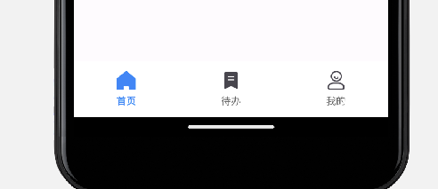

常用属性如下：

属性 | 含义
---|---
menu | 要展示的条目（子菜单）
itemTextColor | 条目中文本颜色
itemIconTint | 条目图标着色规则
itemBackground | 条目背景色
itemActiveIndicatorStyle | 条目被激活（选中）时的指示样式

* activity_main.xml

```xml
<?xml version="1.0" encoding="utf-8"?>
<layout
    xmlns:android="http://schemas.android.com/apk/res/android"
    xmlns:app="http://schemas.android.com/apk/res-auto"
    xmlns:tools="http://schemas.android.com/tools">

    <data>

        <variable
            name="vm"
            type="cn.peng.stu4teach.pages.main.MainVm" />
    </data>

    <androidx.constraintlayout.widget.ConstraintLayout
        android:id="@+id/main"
        android:layout_width="match_parent"
        android:layout_height="match_parent"
        tools:context=".pages.main.MainActivity">

        <!-- itemBackground 设置后，不显示默认的水波纹效果 -->
        <!-- itemActiveIndicatorStyle 去除默认的稀奇古怪的选中背景色-->
        <!-- itemIconTint 基于选中状态为图标着色。如果 menu 中的图标不是 selector ，可以用其着色；否则，设置为null -->
        <!-- itemTextColor 基于选中状态切换文本颜色 -->
        <com.google.android.material.bottomnavigation.BottomNavigationView
            android:id="@+id/btmNav"
            android:layout_width="0dp"
            android:layout_height="70dp"
            android:background="@color/white"
            app:itemActiveIndicatorStyle="@null"
            app:itemBackground="@color/transparent"
            app:itemIconTint="@null"
            app:itemTextColor="@color/selector_main_tab_text_color"
            app:layout_constraintBottom_toBottomOf="parent"
            app:layout_constraintLeft_toLeftOf="parent"
            app:layout_constraintRight_toRightOf="parent"
            app:menu="@menu/menu_main_btm_nav" />

    </androidx.constraintlayout.widget.ConstraintLayout>
</layout>
```


### 1.2.2. selector drawable

带有状态的特殊的 drawable 资源，通常是一组图标的组合。状态包括：checked、selected 等。

在创建 selector drawable 资源之前，需要先导入需要的图标资源，然后创建 xml 文件，在该文件中指定不同的状态使用不同的图标。

#### 1.2.2.1. 导入 selector drawable 需要的资源

* 先按如下目录结构组织好需要的图片资源（也可以使用 `drawable-xhdpi` 这种目录）：

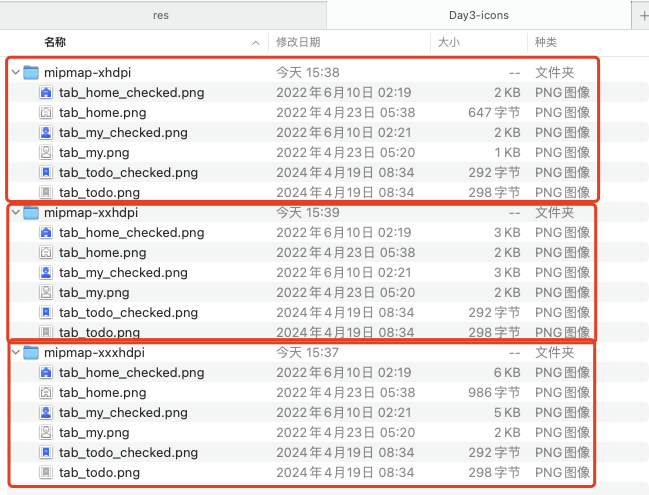

* 选择导入图片资源：

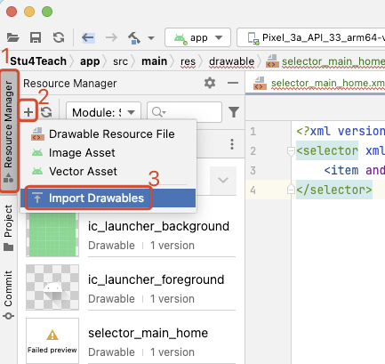


* 选择图标资源所在目录：

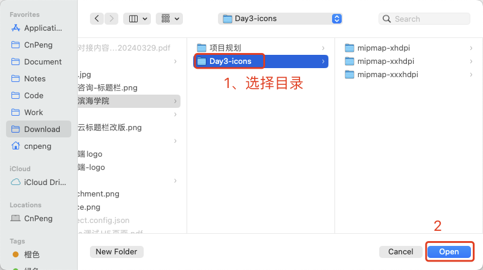

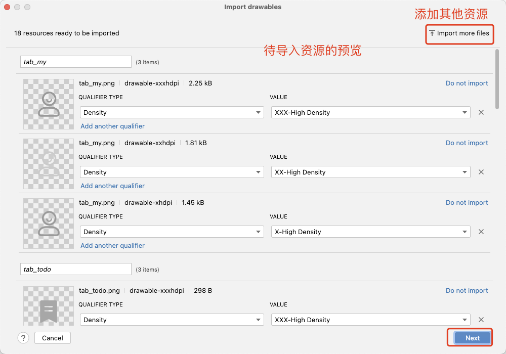

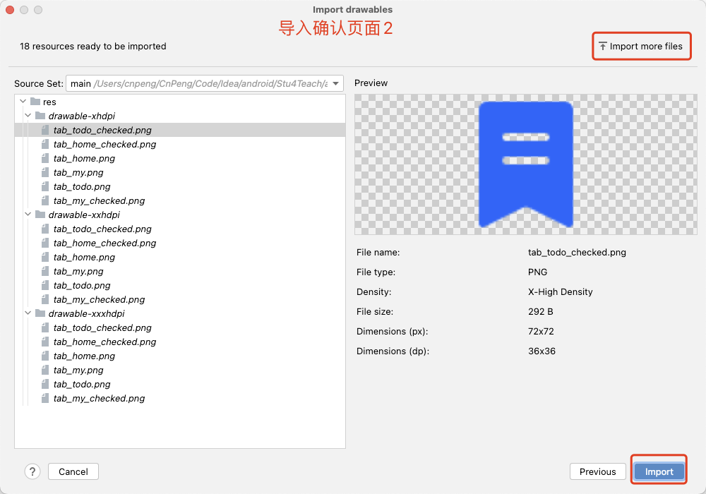

如上图，导入之后，资源会放在 `drawable-xhdpi`、 `drawable-xxhdpi`、 `drawable-xxxhdpi` 中。

#### 1.2.2.2. 创建 selector drawable 

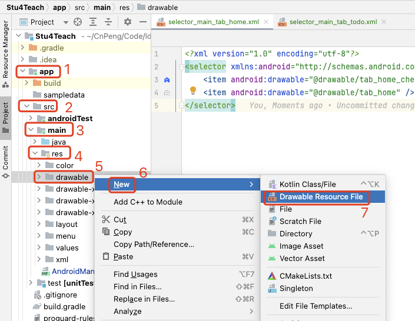

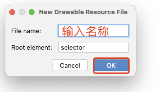

然后编辑内容即可：

* selector_main_tab_home.xml

```xml
<?xml version="1.0" encoding="utf-8"?>
<selector xmlns:android="http://schemas.android.com/apk/res/android">
    <item android:drawable="@drawable/tab_home_checked" android:state_checked="true" />
    <item android:drawable="@drawable/tab_home" />
</selector>
```

* selector_main_tab_todo.xml

```xml
<?xml version="1.0" encoding="utf-8"?>
<selector xmlns:android="http://schemas.android.com/apk/res/android">
    <item android:drawable="@drawable/tab_todo_checked" android:state_checked="true"/>
    <item android:drawable="@drawable/tab_todo"/>
</selector>
```


* selector_main_tab_my.xml

```xml
<?xml version="1.0" encoding="utf-8"?>
<selector xmlns:android="http://schemas.android.com/apk/res/android">
    <item android:drawable="@drawable/tab_my_checked" android:state_checked="true"/>
    <item android:drawable="@drawable/tab_my"/>
</selector>
```

### 1.2.3. selector color

同 selector drawable 类似，selector color 也是一种带有状态的特殊颜色。存储在 `res/color` 目录下。

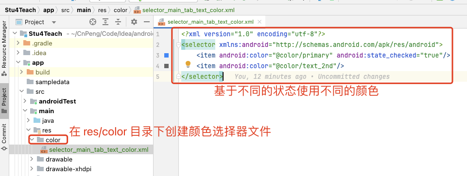


```xml
<?xml version="1.0" encoding="utf-8"?>
<selector xmlns:android="http://schemas.android.com/apk/res/android">
    <item android:color="@color/primary" android:state_checked="true"/>
    <item android:color="@color/text_2nd"/>
</selector>
```

### 1.2.4. menu

#### 1.2.4.1. menu的使用

menu 即菜单。BottomNavigationView 需要使用 menu 来呈现条目。（其他组件中也有使用）

menu 文件存储在 `res/menu` 目录下，如下：

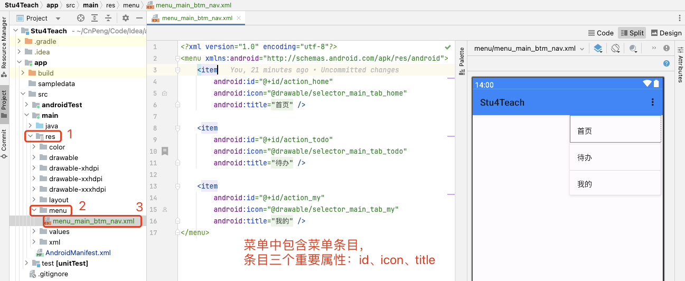


```xml
<?xml version="1.0" encoding="utf-8"?>
<menu xmlns:android="http://schemas.android.com/apk/res/android">
    <item
        android:id="@+id/action_home"
        android:icon="@drawable/selector_main_tab_home"
        android:title="@string/home" />

    <item
        android:id="@+id/action_todo"
        android:icon="@drawable/selector_main_tab_todo"
        android:title="@string/todo" />

    <item
        android:id="@+id/action_my"
        android:icon="@drawable/selector_main_tab_my"
        android:title="@string/my" />
</menu>
```

#### 1.2.4.2. 注意

在 BottomNavigationView 中使用上述 menu 时，

* 如果 menu 的 item 使用的是 selector drawable , 那么 `itemIconTint` 必须设置为  `null` 或者 selector color , 如果不指定，则图标颜色会显示异常。
* 如果 menu 的 item 使用的是普通的 drawable , 那么 `itemIconTint` 必须设置为 selector color , 在其中指定图标选中、未选中时的着色。

### 1.2.5. 监听BottomNavigationView选中事件

BottomNavigationView 提供了 `setOnItemSelectedListener` 和 `setOnNavigationItemSelectedListener`（已过时，不推荐使用）用于监听条目的选中事件，但后者已经被标记为过时了，不再推荐使用。


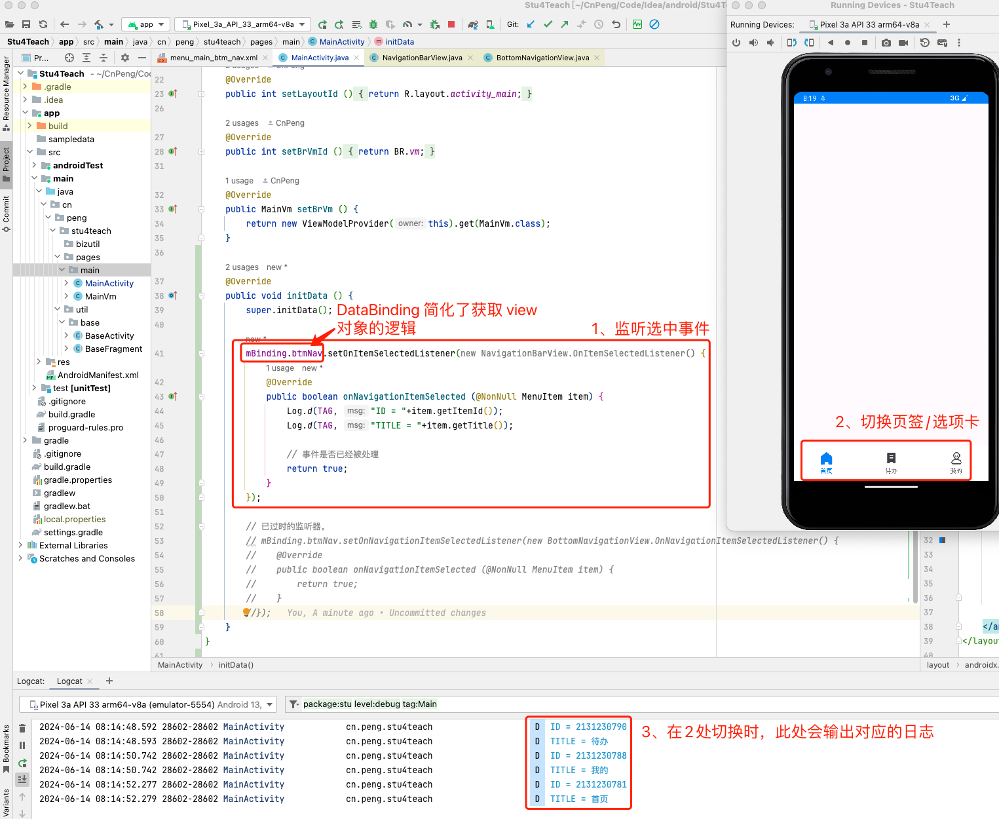


```java

mBinding.btmNav.setOnItemSelectedListener(new NavigationBarView.OnItemSelectedListener() {
    @Override
    public boolean onNavigationItemSelected (@NonNull MenuItem item) {
        Log.d(TAG, "ID = "+item.getItemId());
        Log.d(TAG, "TITLE = "+item.getTitle());

        // 事件是否已经被处理
        return true;
    }
});

// 已过时的监听器。
// mBinding.btmNav.setOnNavigationItemSelectedListener(new BottomNavigationView.OnNavigationItemSelectedListener() {
//    @Override
//    public boolean onNavigationItemSelected (@NonNull MenuItem item) {
//        return true;
//    }
//});
```


### 1.2.6. 切换 Fragment

基于 BottomNavigationView 的监听事件判断那个 item 被选中了，然后决定展示哪个 Fragment .

#### 1.2.6.1. 新建 Fragment

先在 `pages` 中新建三个子目录 `home`、`todo`、`my`，然后分别在其中创建对应的 Fragment 和 vm。

* 创建 Fragment :

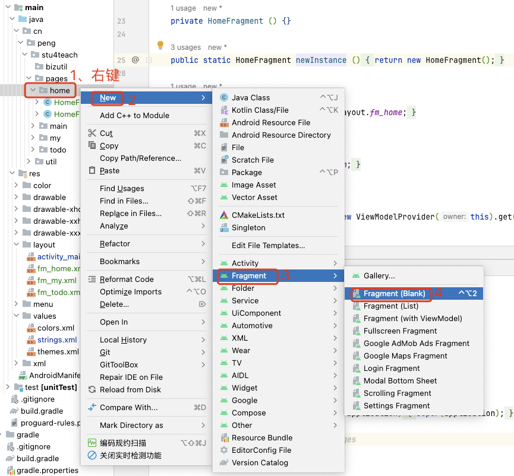

* 创建后编辑内容：

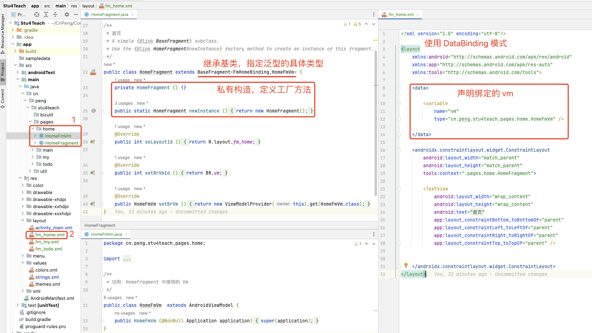


* HomeFragment.java

```java
package cn.peng.stu4teach.pages.home;

import android.os.Bundle;

import androidx.databinding.library.baseAdapters.BR;
import androidx.fragment.app.Fragment;
import androidx.lifecycle.ViewModelProvider;

import android.view.LayoutInflater;
import android.view.View;
import android.view.ViewGroup;

import cn.peng.stu4teach.R;
import cn.peng.stu4teach.databinding.FmHomeBinding;
import cn.peng.stu4teach.util.base.BaseFragment;

/**
 * 首页
 * A simple {@link BaseFragment} subclass.
 * Use the {@link HomeFragment#newInstance} factory method to create an instance of this fragment.
 */
public class HomeFragment extends BaseFragment<FmHomeBinding,HomeFmVm> {
    private HomeFragment () {}

    public static HomeFragment newInstance () {
        return new HomeFragment();
    }

    @Override
    public int seLayoutId () {
        return R.layout.fm_home;
    }

    @Override
    public int setBrVmId () {
        return BR.vm;
    }

    @Override
    public HomeFmVm setBrVm () {
        return new ViewModelProvider(this).get(HomeFmVm.class);
    }
}
```


* HomeFmVm.java

```java
package cn.peng.stu4teach.pages.home;

import android.app.Application;

import androidx.annotation.NonNull;
import androidx.lifecycle.AndroidViewModel;

/**
 * 功用：HomeFragment 中使用的 Vm
 */
public class HomeFmVm  extends AndroidViewModel {
    public HomeFmVm (@NonNull Application application) {
        super(application);
    }
}

```

* fm_home.xml

```xml
<?xml version="1.0" encoding="utf-8"?>

<layout
    xmlns:android="http://schemas.android.com/apk/res/android"
    xmlns:app="http://schemas.android.com/apk/res-auto"
    xmlns:tools="http://schemas.android.com/tools">

    <data>

        <variable
            name="vm"
            type="cn.peng.stu4teach.pages.home.HomeFmVm" />

    </data>

    <androidx.constraintlayout.widget.ConstraintLayout
        android:layout_width="match_parent"
        android:layout_height="match_parent"
        tools:context=".pages.home.HomeFragment">

        <TextView
            android:layout_width="wrap_content"
            android:layout_height="wrap_content"
            android:text="@string/home"
            app:layout_constraintBottom_toBottomOf="parent"
            app:layout_constraintLeft_toLeftOf="parent"
            app:layout_constraintRight_toRightOf="parent"
            app:layout_constraintTop_toTopOf="parent" />


    </androidx.constraintlayout.widget.ConstraintLayout>
</layout>
```

同理，再创建另外两个 Fragment .

#### 1.2.6.2. 切换 Fragment 

先定义用于展示 Fragment 的容器组件，然后将 BottomNavigationView 的条目选中监听抽取到 vm 中，并在监听事件中判断被选中的条目，进而决定展示哪个 Fragment .


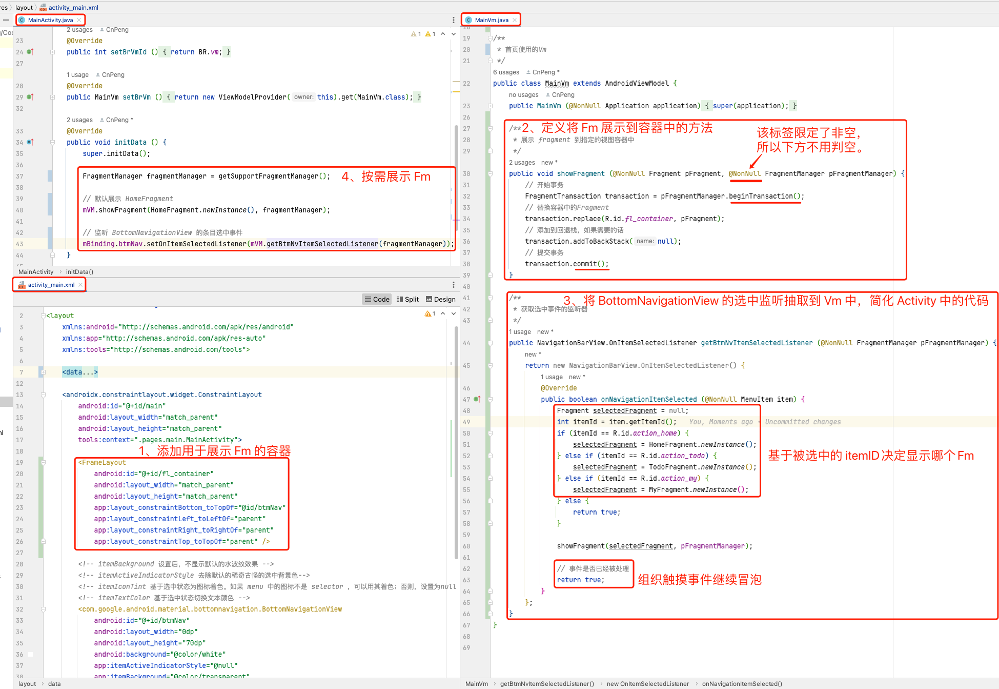


* MainActivity.java

```java
package cn.peng.stu4teach.pages.main;

import androidx.databinding.library.baseAdapters.BR;
import androidx.fragment.app.FragmentManager;
import androidx.lifecycle.ViewModelProvider;

import cn.peng.stu4teach.R;
import cn.peng.stu4teach.databinding.ActivityMainBinding;
import cn.peng.stu4teach.pages.home.HomeFragment;
import cn.peng.stu4teach.util.base.BaseActivity;

/**
 * 首页Activity
 */
public class MainActivity extends BaseActivity<ActivityMainBinding, MainVm> {
    private final String          TAG = MainActivity.class.getSimpleName();

    @Override
    public int setLayoutId () {
        return R.layout.activity_main;
    }

    @Override
    public int setBrVmId () {
        return BR.vm;
    }

    @Override
    public MainVm setBrVm () {
        return new ViewModelProvider(this).get(MainVm.class);
    }

    @Override
    public void initData () {
        super.initData();

        FragmentManager fragmentManager = getSupportFragmentManager();

        // 默认展示 HomeFragment
        mVM.showFragment(HomeFragment.newInstance(), fragmentManager);

        // 监听 BottomNavigationView 的条目选中事件
        mBinding.btmNav.setOnItemSelectedListener(mVM.getBtmNvItemSelectedListener(fragmentManager));
    }
}
```

* MainVm.java

```java
package cn.peng.stu4teach.pages.main;

import android.app.Application;
import android.view.MenuItem;

import androidx.annotation.NonNull;
import androidx.fragment.app.Fragment;
import androidx.fragment.app.FragmentManager;
import androidx.fragment.app.FragmentTransaction;
import androidx.lifecycle.AndroidViewModel;

import com.google.android.material.navigation.NavigationBarView;

import cn.peng.stu4teach.R;
import cn.peng.stu4teach.pages.home.HomeFragment;
import cn.peng.stu4teach.pages.my.MyFragment;
import cn.peng.stu4teach.pages.todo.TodoFragment;

/**
 * 首页使用的Vm
 */
public class MainVm extends AndroidViewModel {
    public MainVm (@NonNull Application application) {
        super(application);
    }

    /**
     * 展示 fragment 到指定的视图容器中
     */
    public void showFragment (@NonNull Fragment pFragment, @NonNull FragmentManager pFragmentManager) {
        // 开始事务
        FragmentTransaction transaction = pFragmentManager.beginTransaction();
        // 替换容器中的Fragment
        transaction.replace(R.id.fl_container, pFragment);
        // 添加到回退栈，如果需要的话
        transaction.addToBackStack(null);
        // 提交事务
        transaction.commit();
    }

    /**
     * 获取选中事件的监听器
     */
    public NavigationBarView.OnItemSelectedListener getBtmNvItemSelectedListener (@NonNull FragmentManager pFragmentManager) {
        return new NavigationBarView.OnItemSelectedListener() {
            @Override
            public boolean onNavigationItemSelected (@NonNull MenuItem item) {
                Fragment selectedFragment = null;
                int itemId = item.getItemId();
                if (itemId == R.id.action_home) {
                    selectedFragment = HomeFragment.newInstance();
                } else if (itemId == R.id.action_todo) {
                    selectedFragment = TodoFragment.newInstance();
                } else if (itemId == R.id.action_my) {
                    selectedFragment = MyFragment.newInstance();
                } else {
                    return true;
                }

                showFragment(selectedFragment, pFragmentManager);

                // 事件是否已经被处理
                return true;
            }
        };
    }
}
```

* activity.xml

```xml
<?xml version="1.0" encoding="utf-8"?>
<layout
    xmlns:android="http://schemas.android.com/apk/res/android"
    xmlns:app="http://schemas.android.com/apk/res-auto"
    xmlns:tools="http://schemas.android.com/tools">

    <data>
        <variable
            name="vm"
            type="cn.peng.stu4teach.pages.main.MainVm" />
    </data>

    <androidx.constraintlayout.widget.ConstraintLayout
        android:id="@+id/main"
        android:layout_width="match_parent"
        android:layout_height="match_parent"
        tools:context=".pages.main.MainActivity">

        <FrameLayout
            android:id="@+id/fl_container"
            android:layout_width="match_parent"
            android:layout_height="match_parent"
            app:layout_constraintBottom_toTopOf="@id/btmNav"
            app:layout_constraintLeft_toLeftOf="parent"
            app:layout_constraintRight_toRightOf="parent"
            app:layout_constraintTop_toTopOf="parent" />

        <!-- itemBackground 设置后，不显示默认的水波纹效果 -->
        <!-- itemActiveIndicatorStyle 去除默认的稀奇古怪的选中背景色-->
        <!-- itemIconTint 基于选中状态为图标着色。如果 menu 中的图标不是 selector ，可以用其着色；否则，设置为null -->
        <!-- itemTextColor 基于选中状态切换文本颜色 -->
        <com.google.android.material.bottomnavigation.BottomNavigationView
            android:id="@+id/btmNav"
            android:layout_width="0dp"
            android:layout_height="70dp"
            android:background="@color/white"
            app:itemActiveIndicatorStyle="@null"
            app:itemBackground="@color/transparent"
            app:itemIconTint="@null"
            app:itemTextColor="@color/selector_main_tab_text_color"
            app:layout_constraintBottom_toBottomOf="parent"
            app:layout_constraintLeft_toLeftOf="parent"
            app:layout_constraintRight_toRightOf="parent"
            app:menu="@menu/menu_main_btm_nav" />

    </androidx.constraintlayout.widget.ConstraintLayout>
</layout>
```

### 1.2.7. 补充：展示角标（小红点）

配合 `BadgeDrawable` 可以实现小红点角标。效果如下：

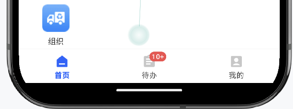

* 示例1：直接设置数字

```java
// 设置角标
Menu menu = mBinding.btmNav.getMenu();
MenuItem menuItem = menu.findItem(R.id.action_todo);
BadgeDrawable badge = mBinding.btmNav.getOrCreateBadge(menuItem.getItemId());

badge.setVisible(true);
// 设置数字，如果不需要数字可以直接设置badge-number为0或者不调用此方法
badge.setNumber(9);
// 更改badge颜色
badge.setBackgroundColor(getResources().getColor(R.color.red, null));
```

* 示例2：设置文本

```java
/**
 * 设置角标
 */
public void setRedBadge (BottomNavigationView pBtmNavView, Integer count) {
    CpLog.d("设置角标：" + count);
    // 设置角标
    Menu menu = pBtmNavView.getMenu();
    MenuItem menuItem = menu.findItem(R.id.action_todo);
    BadgeDrawable badge = pBtmNavView.getOrCreateBadge(menuItem.getItemId());
    // 设置是否显示
    badge.setVisible(count > 0);
    if (count == 0) {
        return;
    }
    // 设置数字
    String badgeText = count > 10 ? "10+" : count.toString();
    badge.setText(badgeText);
    // 更改badge颜色
    badge.setBackgroundColor(pBtmNavView.getContext().getResources().getColor(R.color.red, null));
}
```

## 1.3. 使用三方库实现图片加载

### 1.3.1. ImageView

[官方文档：ImageView](https://developer.android.google.cn/reference/android/widget/ImageView?hl=en)
[官方文档：显示图形](https://developer.android.google.cn/develop/ui/views/graphics/drawables?hl=zh-cn)

专用于呈现本地图片资源的组件。

基本使用形式如下：

```xml
<LinearLayout
     xmlns:android="http://schemas.android.com/apk/res/android"
     android:layout_width="match_parent"
     android:layout_height="match_parent">
     <ImageView
         android:layout_width="wrap_content"
         android:layout_height="wrap_content"
         android:src="@drawable/my_image"
         android:contentDescription="@string/my_image_description"
         />
 </LinearLayout>
```

重要属性：

* src : 要展示的图片资源id
* scaleType : 当图片尺寸与ImageView尺寸不匹配时，如何进行缩放调整。取值参考：[scaleType](https://developer.android.google.cn/reference/android/widget/ImageView#attr_android:scaleType)

### 1.3.2. Glide

常用的网络图片加载库包括：Glide、Picasso、Fresco等，此处以 Glide 为例。

可以从 [Github:Glide](https://github.com/bumptech/glide) 或 [Gitee:Glide](https://gitee.com/CnPeng_1/glide) 查看集成方式及其 API 信息。

#### 1.3.2.1. 引入

通常情况下，我们直接在当前 module 的 `build.gradle` 文件中引入即可，如下：

```gradle
android {
  //... 其他内容省略
}

dependencies {
  implementation 'com.github.bumptech.glide:glide:4.16.0'
}
```

但在新版的 AS （当前版本为：`Android Studio Jellyfish | 2023.3.1 Patch 1`）中做了一步抽取，将库信息抽取到了 `gradle/libs.versions.toml ` 中进行统一维护。所以导入方式就发生了变更，如下：

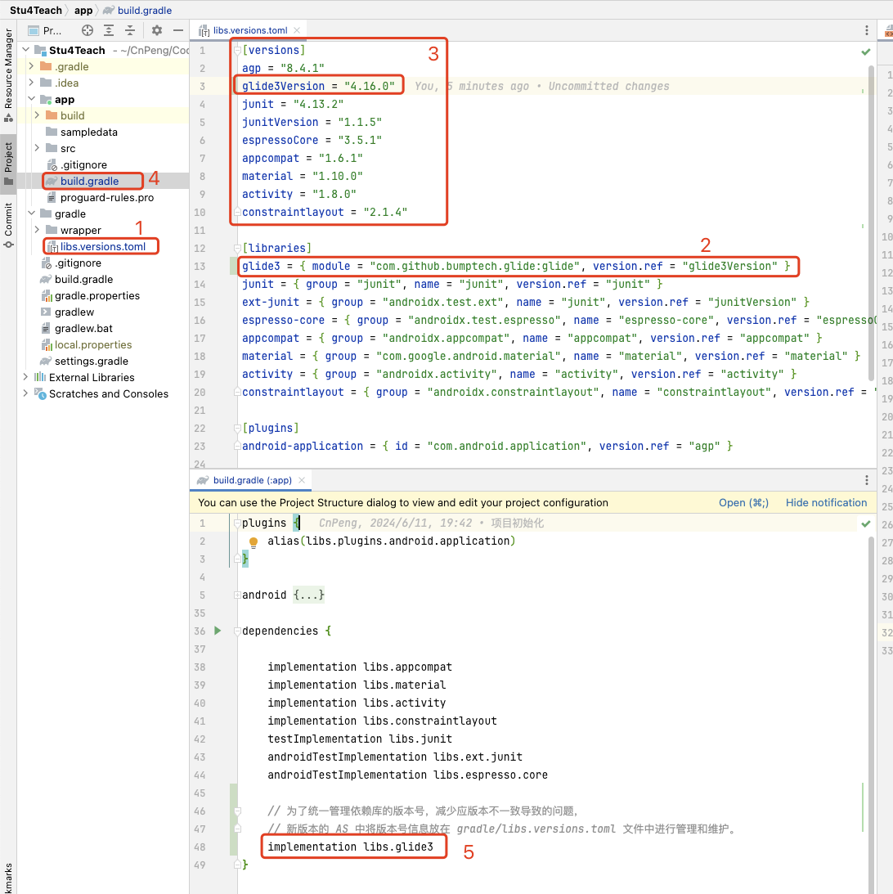

我们也可以先按照旧版的导入方式导入，然后根据提示动态完成 toml 中的配置，如下图：

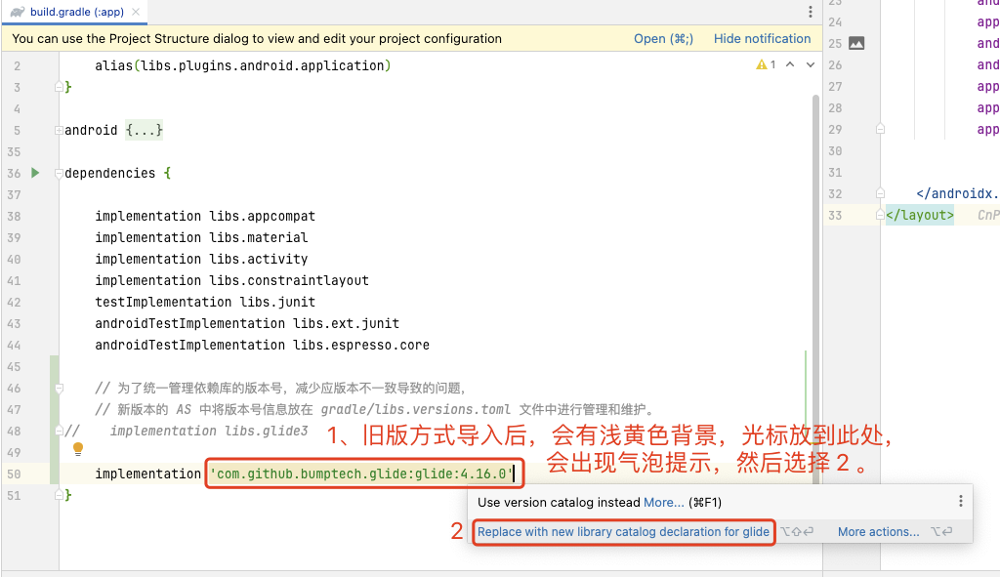

#### 1.3.2.2. 基本使用

##### 1.3.2.2.1. 加载本地和网络图片

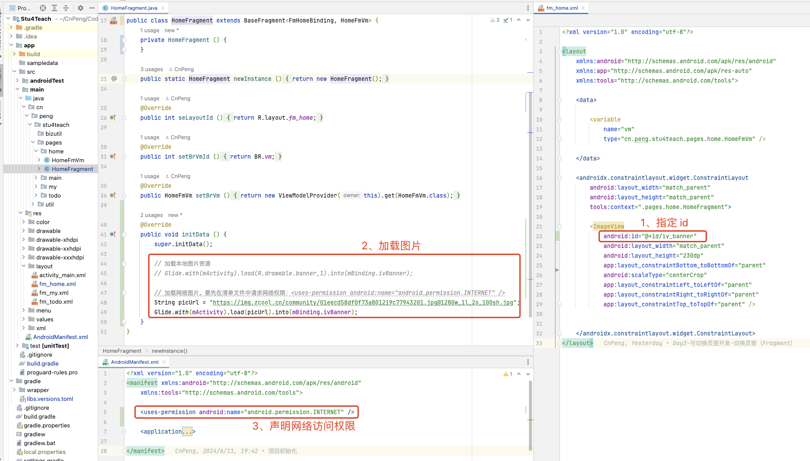

核心代码内容：

```java
    public void initData () {
        super.initData();

        // 加载本地图片资源
        // Glide.with(mActivity).load(R.drawable.banner_1).into(mBinding.ivBanner);

        // 加载网络图片。要先在清单文件中请求网络权限：<uses-permission android:name="android.permission.INTERNET" />
        String picUrl = "https://img.zcool.cn/community/01eecd58df0f73a801219c77943201.jpg@1280w_1l_2o_100sh.jpg";
        Glide.with(mActivity).load(picUrl).into(mBinding.ivBanner);
    }
```

```xml
<uses-permission android:name="android.permission.INTERNET" />
```

##### 1.3.2.2.2. 其他常用方法

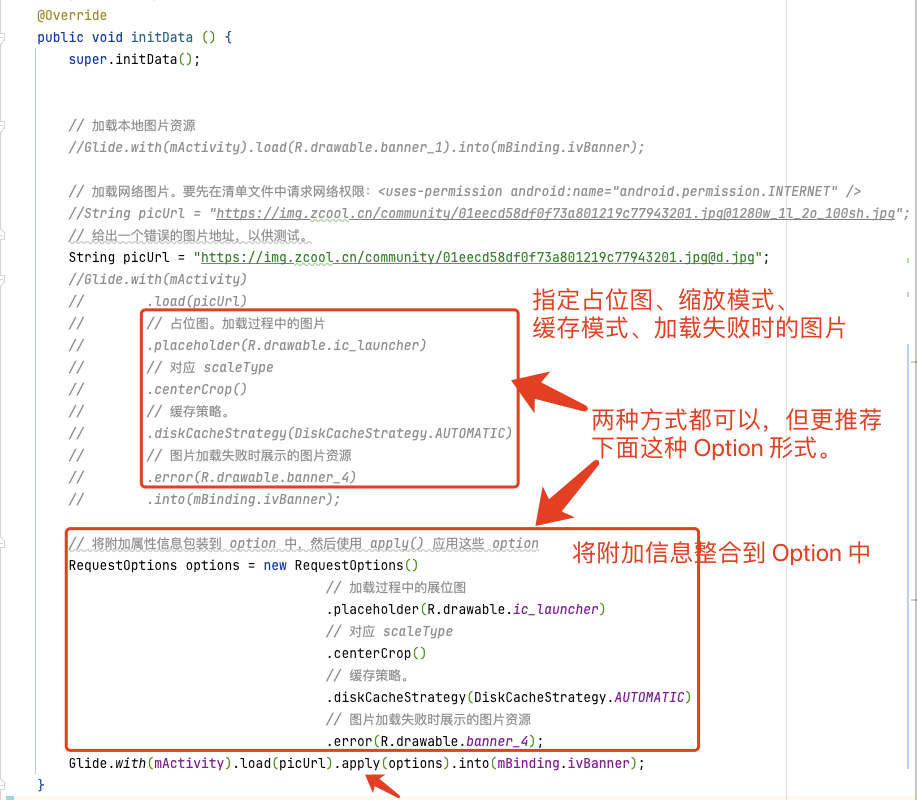

核心代码：

```java
// 加载网络图片。要先在清单文件中请求网络权限：<uses-permission android:name="android.permission.INTERNET" />
//String picUrl = "https://img.zcool.cn/community/01eecd58df0f73a801219c77943201.jpg@1280w_1l_2o_100sh.jpg";
// 给出一个错误的图片地址，以供测试。
String picUrl = "https://img.zcool.cn/community/01eecd58df0f73a801219c77943201.jpg@d.jpg";
//Glide.with(mActivity)
//        .load(picUrl)
//        // 占位图。加载过程中的图片
//        .placeholder(R.drawable.ic_launcher)
//        // 对应 scaleType
//        .centerCrop()
//        // 缓存策略。
//        .diskCacheStrategy(DiskCacheStrategy.AUTOMATIC)
//        // 图片加载失败时展示的图片资源
//        .error(R.drawable.banner_4)
//        .into(mBinding.ivBanner);


// 将附加属性信息包装到 option 中，然后使用 apply() 应用这些 option
RequestOptions options = new RequestOptions()
                                 // 加载过程中的展位图
                                 .placeholder(R.drawable.ic_launcher)
                                 // 对应 scaleType
                                 .centerCrop()
                                 // 缓存策略。
                                 .diskCacheStrategy(DiskCacheStrategy.AUTOMATIC)
                                 // 图片加载失败时展示的图片资源
                                 .error(R.drawable.banner_4);
Glide.with(mActivity).load(picUrl).apply(options).into(mBinding.ivBanner);
```

##### 1.3.2.2.3. 解决无法加载 http 协议图片的问题

从 Api 24 （Android 7.0）开始，Android App 访问 Http 资源会受限。

* 问题现象：

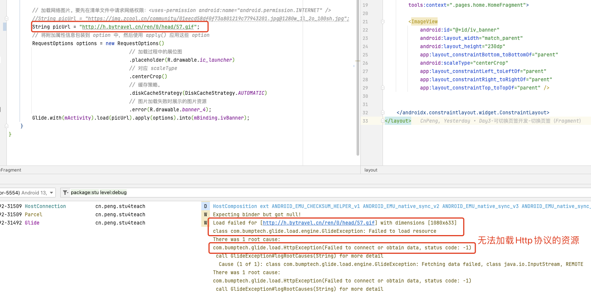

* 解决办法（启用网络安全配置白名单）：

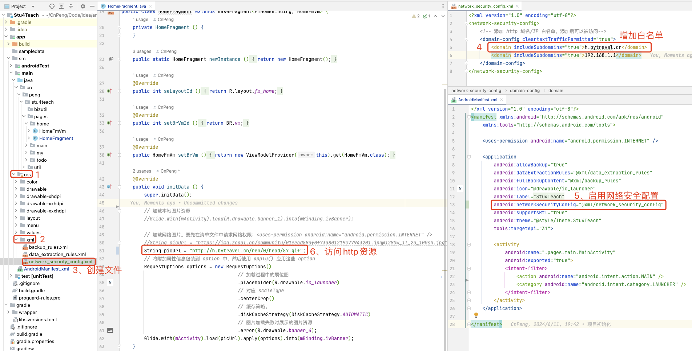

> 该配置不仅适用于图片资源。在 App 开发阶段，如果后端提供的接口访问地址是 Http 协议的，也是通过该方法添加白名单来解决无法访问的问题。

#### 1.3.2.3. 配合DataBinding

DataBinding 支持自定义 BindingAdapter , 通过自定义 BindingAdapter 可以实现一些 "自定义属性" , 从而进一步简化代码逻辑。

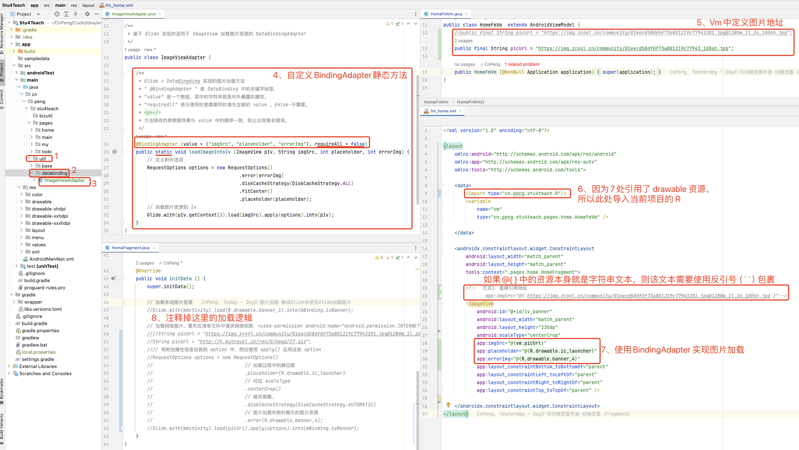

核心代码：

* ImageViewAdapter.java

```java
package cn.peng.stu4teach.util.databinding;

import android.widget.ImageView;

import androidx.databinding.BindingAdapter;

import com.bumptech.glide.Glide;
import com.bumptech.glide.load.engine.DiskCacheStrategy;
import com.bumptech.glide.request.RequestOptions;

/**
 * 基于 Glide 实现的适用于 ImageView 加载图片资源的 DataBindingAdapter
 */
public class ImageViewAdapter {

    /**
     * Glide + DataBingding 实现的图片加载方法
     * " @BindingAdapter " 是 DataBinding 中的关键字标签，
     * ”value“ 是一个数组，其中的字符串就是对外暴露的属性。
     * ”requireAll“ 表示使用时是需要同时填充全部的 value 。false-不需要。
     * <p></>
     * 方法接收的参数顺序要与 value 中的顺序一致，防止出现莫名错误。
     */
    @BindingAdapter (value = {"imgSrc", "placeholder", "errorImg"}, requireAll = false)
    public static void loadImageIntoIv (ImageView pIv, String imgSrc, int placeholder, int errorImg) {
        // 定义附件选项
        RequestOptions options = new RequestOptions()
                                         .error(errorImg)
                                         .diskCacheStrategy(DiskCacheStrategy.ALL)
                                         .fitCenter()
                                         .placeholder(placeholder);
        // 加载图片资源到 iv
        Glide.with(pIv.getContext()).load(imgSrc).apply(options).into(pIv);
    }
}

```

* fm_home.xml

```xml
<?xml version="1.0" encoding="utf-8"?>

<layout
    xmlns:android="http://schemas.android.com/apk/res/android"
    xmlns:app="http://schemas.android.com/apk/res-auto"
    xmlns:tools="http://schemas.android.com/tools">

    <data>
        <import type="cn.peng.stu4teach.R"/>
        <variable
            name="vm"
            type="cn.peng.stu4teach.pages.home.HomeFmVm" />

    </data>

    <androidx.constraintlayout.widget.ConstraintLayout
        android:layout_width="match_parent"
        android:layout_height="match_parent"
        tools:context=".pages.home.HomeFragment">

        <!--  方式1：直接引用地址
               app:imgSrc="@{`https://img.zcool.cn/community/01eecd58df0f73a801219c77943201.jpg@1280w_1l_2o_100sh.jpg`}"-->
        <ImageView
            android:id="@+id/iv_banner"
            android:layout_width="match_parent"
            android:layout_height="230dp"
            android:scaleType="centerCrop"
            app:imgSrc="@{vm.picUrl}"
            app:placeholder="@{R.drawable.ic_launcher}"
            app:errorImg="@{R.drawable.banner_4}"
            app:layout_constraintBottom_toBottomOf="parent"
            app:layout_constraintLeft_toLeftOf="parent"
            app:layout_constraintRight_toRightOf="parent"
            app:layout_constraintTop_toTopOf="parent" />

    </androidx.constraintlayout.widget.ConstraintLayout>
</layout>
```


## 1.4. 首页顶部轮播图开发

使用 `io.github.youth5201314:banner` 实现顶部轮播图。

可以从  [github](https://github.com/youth5201314/banner)、[gitee](https://gitee.com/CnPeng_1/banner) 中查看其集成方式以及完整 API 信息。


### 1.4.1. 基本使用

先在 module 的 `build.gradle` 文件中引入对 banner 的依赖： `implementation 'io.github.youth5201314:banner:2.2.3'` ，然后按照提示自动提取版本信息到 `libs.version.toml` 中。

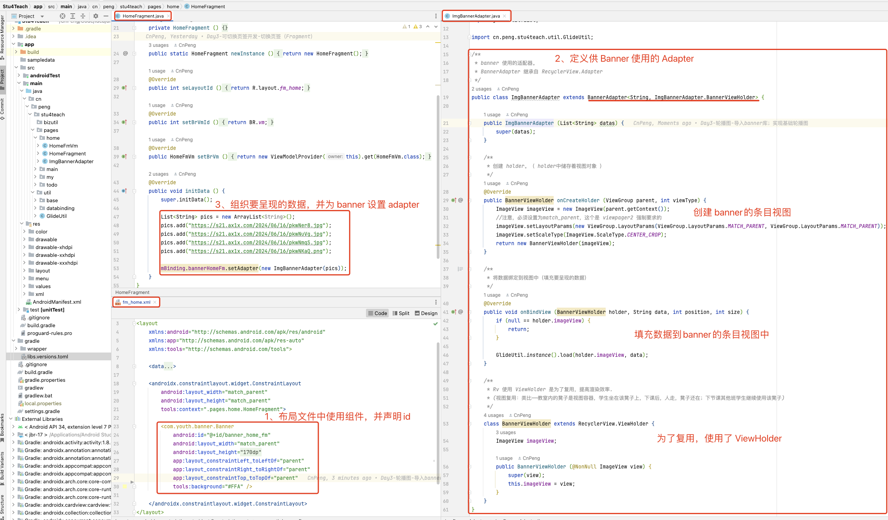

核心代码：

* HomeFm.java

```java
package cn.peng.stu4teach.pages.home;

import androidx.databinding.library.baseAdapters.BR;
import androidx.lifecycle.ViewModelProvider;

import com.youth.banner.indicator.RectangleIndicator;

import java.util.ArrayList;
import java.util.List;

import cn.peng.stu4teach.R;
import cn.peng.stu4teach.databinding.FmHomeBinding;
import cn.peng.stu4teach.util.base.BaseFragment;

/**
 * 首页
 * A simple {@link BaseFragment} subclass.
 * Use the {@link HomeFragment#newInstance} factory method to create an instance of this fragment.
 */
public class HomeFragment extends BaseFragment<FmHomeBinding, HomeFmVm> {
    private HomeFragment () {
    }

    public static HomeFragment newInstance () {
        return new HomeFragment();
    }

    @Override
    public int seLayoutId () {
        return R.layout.fm_home;
    }

    @Override
    public int setBrVmId () {
        return BR.vm;
    }

    @Override
    public HomeFmVm setBrVm () {
        return new ViewModelProvider(this).get(HomeFmVm.class);
    }

    @Override
    public void initData () {
        super.initData();

        List<String> pics = new ArrayList<String>();
        pics.add("https://s21.ax1x.com/2024/06/16/pkwNer8.jpg");
        pics.add("https://s21.ax1x.com/2024/06/16/pkwNuVg.jpg");
        pics.add("https://s21.ax1x.com/2024/06/16/pkwNmqS.jpg");
        pics.add("https://s21.ax1x.com/2024/06/16/pkwNKaQ.png");

        mBinding.bannerHomeFm.setAdapter(new ImgBannerAdapter(pics));
    }
}
```

* ImgBannerAdapter.java

```java
package cn.peng.stu4teach.pages.home;

import android.view.ViewGroup;
import android.widget.ImageView;

import androidx.annotation.NonNull;
import androidx.recyclerview.widget.RecyclerView;

import com.youth.banner.adapter.BannerAdapter;

import java.util.List;

import cn.peng.stu4teach.util.GlideUtil;

/**
 * banner 使用的适配器。
 * BannerAdapter 继承自 RecyclerView.Adapter
 */
public class ImgBannerAdapter extends BannerAdapter<String, ImgBannerAdapter.BannerViewHolder> {

    public ImgBannerAdapter (List<String> datas) {
        super(datas);
    }

    /**
     * 创建 holder。（ holder中储存着视图对象 ）
     */
    @Override
    public BannerViewHolder onCreateHolder (ViewGroup parent, int viewType) {
        ImageView imageView = new ImageView(parent.getContext());
        //注意，必须设置为match_parent，这个是 viewpager2 强制要求的
        imageView.setLayoutParams(new ViewGroup.LayoutParams(ViewGroup.LayoutParams.MATCH_PARENT, ViewGroup.LayoutParams.MATCH_PARENT));
        imageView.setScaleType(ImageView.ScaleType.CENTER_CROP);
        return new BannerViewHolder(imageView);
    }

    /**
     * 将数据绑定到视图中（填充要呈现的数据）
     */
    @Override
    public void onBindView (BannerViewHolder holder, String data, int position, int size) {
        if (null == holder.imageView) {
            return;
        }

        GlideUtil.instance().load(holder.imageView, data);
    }

    /**
     * Rv 使用 ViewHolder 是为了复用，提高渲染效率.
     * (视图复用：类比——教室内的凳子是视图容器，学生坐在该凳子上，下课后，人走，凳子还在；下节课其他班学生继续使用该凳子)
     */
    class BannerViewHolder extends RecyclerView.ViewHolder {
        ImageView imageView;

        public BannerViewHolder (@NonNull ImageView view) {
            super(view);
            this.imageView = view;
        }
    }
}

```

* fm_home.xml

```xml
<?xml version="1.0" encoding="utf-8"?>

<layout
    xmlns:android="http://schemas.android.com/apk/res/android"
    xmlns:app="http://schemas.android.com/apk/res-auto"
    xmlns:tools="http://schemas.android.com/tools">

    <data>

        <import type="cn.peng.stu4teach.R" />

        <variable
            name="vm"
            type="cn.peng.stu4teach.pages.home.HomeFmVm" />

    </data>

    <androidx.constraintlayout.widget.ConstraintLayout
        android:layout_width="match_parent"
        android:layout_height="match_parent"
        tools:context=".pages.home.HomeFragment">

        <com.youth.banner.Banner
            android:id="@+id/banner_home_fm"
            android:layout_width="match_parent"
            android:layout_height="@dimen/dp170"
            app:layout_constraintLeft_toLeftOf="parent"
            app:layout_constraintRight_toRightOf="parent"
            app:layout_constraintTop_toTopOf="parent"
            tools:background="#FFA" />

    </androidx.constraintlayout.widget.ConstraintLayout>
</layout>
```


### 1.4.2. 展示indicator

为了便于进行 dp 与  px 的转换，此处先通过 `implementation 'com.blankj:utilcodex:1.31.1'` 引入了 `utilcodex` 工具类（[github](https://github.com/Blankj/AndroidUtilCode)、[gitee](https://gitee.com/CnPeng_1/AndroidUtilCode)），其中包含了 Android 日常开发中常用的一些工具类。


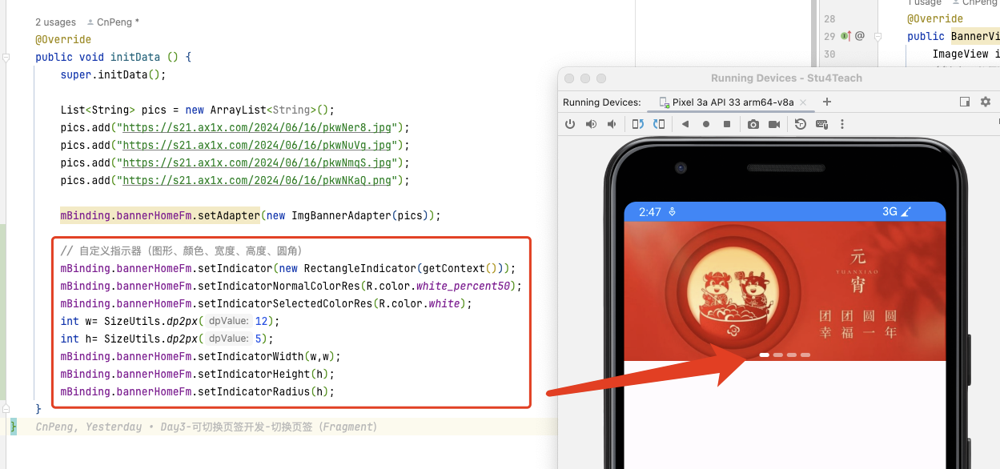

```java
 // 自定义指示器（图形、颜色、宽度、高度、圆角）
 mBinding.bannerHomeFm.setIndicator(new RectangleIndicator(getContext()));
 mBinding.bannerHomeFm.setIndicatorNormalColorRes(R.color.white_percent50);
 mBinding.bannerHomeFm.setIndicatorSelectedColorRes(R.color.white);
 int w= SizeUtils.dp2px(12);
 int h= SizeUtils.dp2px(5);
 mBinding.bannerHomeFm.setIndicatorWidth(w,w);
 mBinding.bannerHomeFm.setIndicatorHeight(h);
 mBinding.bannerHomeFm.setIndicatorRadius(h);
```


## 1.5. 实现Android权限请求（含普通权限、敏感权限）

* [官方文档：Android 中的权限](https://developer.android.google.cn/guide/topics/permissions/overview?hl=zh-cn)

### 1.5.1. 权限分类

Android 中在进行某些操作时需要先检测是否已经获得允许。

#### 1.5.1.1. 权限分类

有些权限仅需要在清单文件中声明即可，不需要用户同意，这种被称为 `普通权限`。如前面示例中用到的网络访问权限，只需要在清单文件中声明即可 `  <uses-permission android:name="android.permission.INTERNET" />`。

有些权限牵涉到用户隐私等敏感内容，必须在用户确认允许访问以后才可以使用，这种被称为 `敏感权限`。如拍照权限、访问相册权限、访问本地文件、存储本地文件等。

#### 1.5.1.2. 权限列表及其级别

[点击查看全部权限及其敏感级别](https://developer.android.google.cn/reference/android/Manifest.permission#summary)。

在使用权限时，我们只需要关注 `Protection level` 的值为 `normal` 和 `dangerous` 的即可。`normal` 表示声明即可使用的权限；`dangerous` 表示需要在运行时动态请求的权限。

> 没有标注级别或级别为其他值的权限通常是给底层开发使用的。

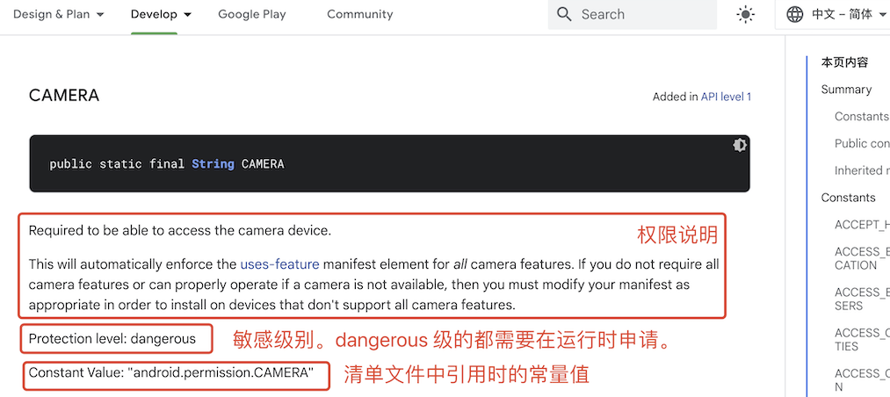

### 1.5.2. 普通权限申请

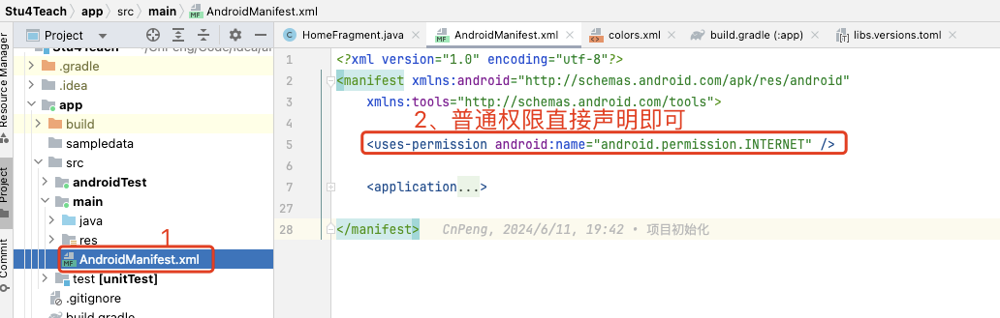

### 1.5.3. 敏感权限申请

敏感权限除了需要在**清单文件中声明之外**，还需要根据 App 运行情况在用户触发操作时使用弹窗向用户请求获取权限。——这就是[运行时权限请求](https://developer.android.google.cn/training/permissions/requesting?hl=zh-cn)。

在请求运行时权限请求时，我们可以参考  自行实现，也可以直接使用三方库 permissionx （[Github](https://github.com/guolindev/PermissionX)、[Gitee](https://gitee.com/CnPeng_1/PermissionX)）来实现。

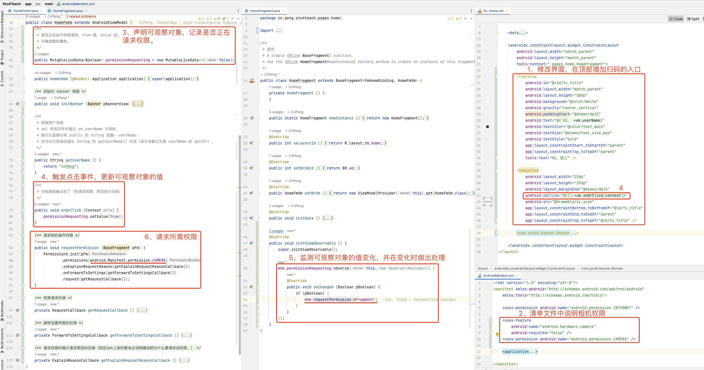

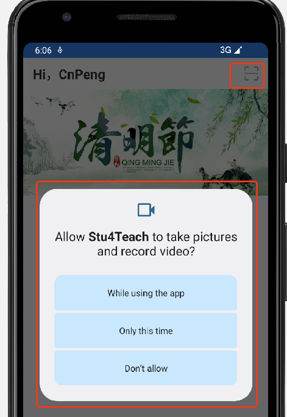

* HomeFragment.java 中核心代码

```java
  @Override
    public void initViewObservable () {
        super.initViewObservable();

        mVm.permissionRequesting.observe(this, new Observer<Boolean>() {
            @Override
            public void onChanged (Boolean pBoolean) {
                if (pBoolean) {
                    mVm.requestPermission(mFragment);
                }
            }
        });
    }
```

* HomeFmVm.java

```java
package cn.peng.stu4teach.pages.home;

import android.app.Application;
import android.content.Context;

import androidx.annotation.NonNull;
import androidx.lifecycle.AndroidViewModel;
import androidx.lifecycle.MutableLiveData;

import com.blankj.utilcode.util.SizeUtils;
import com.blankj.utilcode.util.ToastUtils;
import com.permissionx.guolindev.PermissionX;
import com.permissionx.guolindev.callback.ExplainReasonCallback;
import com.permissionx.guolindev.callback.ForwardToSettingsCallback;
import com.permissionx.guolindev.callback.RequestCallback;
import com.permissionx.guolindev.request.ExplainScope;
import com.permissionx.guolindev.request.ForwardScope;
import com.youth.banner.Banner;
import com.youth.banner.indicator.RectangleIndicator;

import java.util.ArrayList;
import java.util.List;

import cn.peng.stu4teach.R;
import cn.peng.stu4teach.util.base.BaseFragment;

/**
 * 功用：HomeFragment 中使用的 Vm
 */
public class HomeFmVm extends AndroidViewModel {
    /**
     * 是否正在执行权限请求。true-是，false-否。
     * 可被观察的属性。
     */
    public MutableLiveData<Boolean> permissionRequesting = new MutableLiveData<>(false);

    public HomeFmVm (@NonNull Application application) {
        super(application);
    }

    /**
     * 初始化 banner 视图
     */
    public void initBanner (Banner pBannerView) {
        // 组织要展示的数据
        List<String> pics = new ArrayList<String>();
        pics.add("https://s21.ax1x.com/2024/06/16/pkwNer8.jpg");
        pics.add("https://s21.ax1x.com/2024/06/16/pkwNuVg.jpg");
        pics.add("https://s21.ax1x.com/2024/06/16/pkwNmqS.jpg");
        pics.add("https://s21.ax1x.com/2024/06/16/pkwNKaQ.png");

        // 设置适配器
        pBannerView.setAdapter(new ImgBannerAdapter(pics));

        // 自定义指示器（图形、颜色、宽度、高度、圆角）
        pBannerView.setIndicator(new RectangleIndicator(getApplication()));
        pBannerView.setIndicatorNormalColorRes(R.color.white_percent50);
        pBannerView.setIndicatorSelectedColorRes(R.color.white);
        int w = SizeUtils.dp2px(12);
        int h = SizeUtils.dp2px(5);
        pBannerView.setIndicatorWidth(w, w);
        pBannerView.setIndicatorHeight(h);
        pBannerView.setIndicatorRadius(h);
    }

    /**
     * 获取用户名称
     * xml 布局文件中通过 vm.userName 引用时，
     * 既可以直接引用 public 的 string 变量- userName；
     * 也可以引用返回值为 String 的 getUserName() 方法（该方法被认为是 userName 的 getter）。
     */
    public String getUserName () {
        return "CnPeng";
    }

    /**
     * 扫码图标被点击了（先请求权限，然后执行扫码）
     */
    public void onQrClick (Context pCtx) {
        permissionRequesting.setValue(true);
    }

    /**
     * 请求相机操作权限
     */
    public void requestPermission (BaseFragment pFm) {
        PermissionX.init(pFm)
                .permissions(android.Manifest.permission.CAMERA)
                .onExplainRequestReason(getExplainRequestReasonCallback())
                .onForwardToSettings(getForwardToSettingsCallback())
                .request(getRequestCallback());
    }

    /**
     * 权限请求回调
     */
    private RequestCallback getRequestCallback () {
        return new RequestCallback() {
            @Override
            public void onResult (boolean allGranted, @NonNull List<String> grantedList, @NonNull List<String> deniedList) {
                if (allGranted) {
                    ToastUtils.showShort("全部权限被允许了");
                } else {

                    String deniedPermissions = String.join(", ", deniedList);
                    ToastUtils.showShort("如下权限被拒绝了：%s", deniedPermissions);
                }
            }
        };
    }

    /**
     * 跳转设置界面的回调
     */
    private ForwardToSettingsCallback getForwardToSettingsCallback () {
        return new ForwardToSettingsCallback() {
            @Override
            public void onForwardToSettings (@NonNull ForwardScope scope, @NonNull List<String> deniedList) {
                scope.showForwardToSettingsDialog(deniedList, "请在设置中允许相机访问权限", "OK", "Cancel");
            }
        };
    }

    /**
     * 请求权限时展示请求原因的回调（现在Apk上架时要求必须明确说明为什么要请求该权限。）
     */
    private ExplainReasonCallback getExplainRequestReasonCallback () {
        return new ExplainReasonCallback() {
            @Override
            public void onExplainReason (@NonNull ExplainScope scope, @NonNull List<String> deniedList) {
                scope.showRequestReasonDialog(deniedList, "扫码功能需要相机权限，否则无法运行。请允许", "OK", "Cancel");
            }
        };
    }
}
```

* fm_home.xml

```java
<?xml version="1.0" encoding="utf-8"?>

<layout
    xmlns:android="http://schemas.android.com/apk/res/android"
    xmlns:app="http://schemas.android.com/apk/res-auto"
    xmlns:tools="http://schemas.android.com/tools">

    <data>

        <import type="cn.peng.stu4teach.R" />

        <variable
            name="vm"
            type="cn.peng.stu4teach.pages.home.HomeFmVm" />

    </data>

    <androidx.constraintlayout.widget.ConstraintLayout
        android:layout_width="match_parent"
        android:layout_height="match_parent"
        tools:context=".pages.home.HomeFragment">

        <TextView
            android:id="@+id/tv_title"
            android:layout_width="match_parent"
            android:layout_height="50dp"
            android:background="@color/white"
            android:gravity="center_vertical"
            android:paddingStart="@dimen/dp15"
            android:text="@{`Hi，`+vm.userName}"
            android:textColor="@color/text_main"
            android:textSize="@dimen/text_size_max"
            android:textStyle="bold"
            app:layout_constraintStart_toStartOf="parent"
            app:layout_constraintTop_toTopOf="parent"
            tools:text="Hi，张三" />

        <ImageView
            android:layout_width="25dp"
            android:layout_height="25dp"
            android:layout_marginEnd="@dimen/dp15"
            android:onClick="@{()->vm.onQrClick(context)}"
            android:src="@drawable/ic_scan"
            app:layout_constraintBottom_toBottomOf="@id/tv_title"
            app:layout_constraintEnd_toEndOf="parent"
            app:layout_constraintTop_toTopOf="@id/tv_title" />

        <com.youth.banner.Banner
            android:id="@+id/banner_home_fm"
            android:layout_width="match_parent"
            android:layout_height="@dimen/bannerH"
            app:layout_constraintLeft_toLeftOf="parent"
            app:layout_constraintRight_toRightOf="parent"
            app:layout_constraintTop_toBottomOf="@id/tv_title"
            tools:background="#FFA" />

    </androidx.constraintlayout.widget.ConstraintLayout>
</layout>
```

* AndroidManifest.xml 中申请的权限：

```java
<uses-feature
    android:name="android.hardware.camera"
    android:required="false" />
<uses-permission android:name="android.permission.CAMERA" />
```

### 1.5.4. 补充：修改状态栏

修改状态栏的背景色及文本颜色。

当前的状态栏颜色为蓝色，是我们在 `themes.xml` 中通过 `colorPrimary` 指定的，在不改变 `colorPrimary` 的前提下，我们期望变更状态栏背景色及其中的文本颜色。

变更前：

， 

变更后：


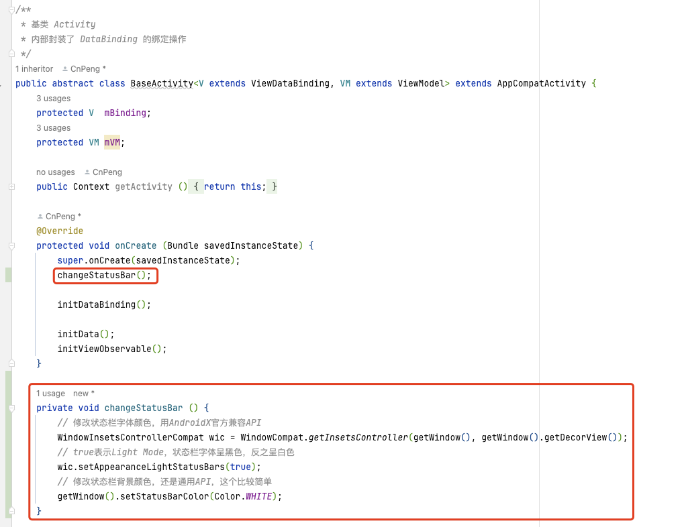

代码如下：


```java
 private void changeStatusBar () {
        // 修改状态栏字体颜色，用AndroidX官方兼容API
        WindowInsetsControllerCompat wic = WindowCompat.getInsetsController(getWindow(), getWindow().getDecorView());
        // true表示Light Mode，状态栏字体呈黑色，反之呈白色
        wic.setAppearanceLightStatusBars(true);
        // 修改状态栏背景颜色，还是通用API，这个比较简单
        getWindow().setStatusBarColor(Color.WHITE);
    }
```


## 1.6. 实现二维码扫描功能

在实现扫码功能时，大部分都是基于 [zxing](https://github.com/zxing/zxing) 实现的。Github 中 [基于 Zxing 二次封装的开源扫码库](https://github.com/search?q=Zxing&type=repositories&s=stars&o=desc) 有很多，我们在这里选用的是 [jenly1314/ZXingLite](https://github.com/jenly1314/ZXingLite)。

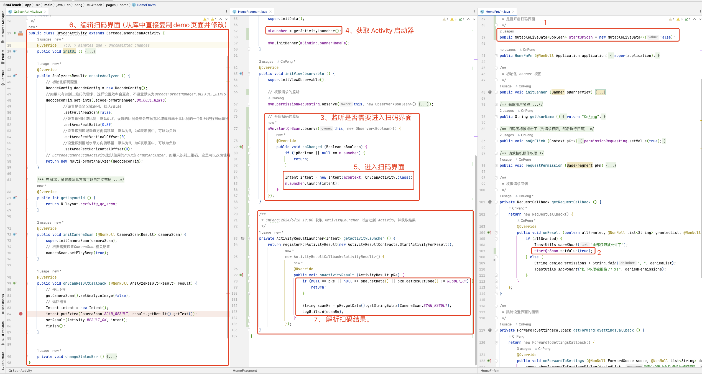

* QrSacnActivity.java

```java
package cn.peng.stu4teach.pages.qrscan;

import android.app.Activity;
import android.content.Intent;
import android.graphics.Color;
import android.view.View;

import androidx.annotation.NonNull;
import androidx.core.view.WindowCompat;
import androidx.core.view.WindowInsetsControllerCompat;

import com.google.zxing.Result;
import com.king.camera.scan.AnalyzeResult;
import com.king.camera.scan.CameraScan;
import com.king.camera.scan.analyze.Analyzer;
import com.king.zxing.BarcodeCameraScanActivity;
import com.king.zxing.DecodeConfig;
import com.king.zxing.DecodeFormatManager;
import com.king.zxing.analyze.MultiFormatAnalyzer;

import cn.peng.stu4teach.R;


/**
 * 扫码界面。
 */
public class QrScanActivity extends BarcodeCameraScanActivity {
    @Override
    public void initUI () {
        super.initUI();

        changeStatusBar();

        // 点击返回按钮之后，关闭界面。
        findViewById(R.id.iv_back).setOnClickListener(new View.OnClickListener() {
            @Override
            public void onClick (View v) {
                finish();
            }
        });
    }

    @Override
    public Analyzer<Result> createAnalyzer () {
        // 初始化解码配置
        DecodeConfig decodeConfig = new DecodeConfig();
        //如果只有识别二维码的需求，这样设置效率会更高，不设置默认为DecodeFormatManager.DEFAULT_HINTS
        decodeConfig.setHints(DecodeFormatManager.QR_CODE_HINTS)
                //设置是否全区域识别，默认false
                .setFullAreaScan(false)
                //设置识别区域比例，默认0.8，设置的比例最终会在预览区域裁剪基于此比例的一个矩形进行扫码识别
                .setAreaRectRatio(0.8f)
                //设置识别区域垂直方向偏移量，默认为0，为0表示居中，可以为负数
                .setAreaRectVerticalOffset(0)
                //设置识别区域水平方向偏移量，默认为0，为0表示居中，可以为负数
                .setAreaRectHorizontalOffset(0);
        // BarcodeCameraScanActivity默认使用的MultiFormatAnalyzer，如果只识别二维码，这里可以改为使用QRCodeAnalyzer
        return new MultiFormatAnalyzer(decodeConfig);
    }

    /**
     * 布局ID；通过覆写此方法可以自定义布局
     *
     * @return 布局ID
     */
    @Override
    public int getLayoutId () {
        return R.layout.activity_qr_scan;
    }

    @Override
    public void initCameraScan (@NonNull CameraScan<Result> cameraScan) {
        super.initCameraScan(cameraScan);
        // 根据需要设置CameraScan相关配置
        cameraScan.setPlayBeep(true);
    }

    @Override
    public void onScanResultCallback (@NonNull AnalyzeResult<Result> result) {
        // 停止分析
        getCameraScan().setAnalyzeImage(false);
        // 返回结果
        Intent intent = new Intent();
        intent.putExtra(CameraScan.SCAN_RESULT, result.getResult().getText());
        setResult(Activity.RESULT_OK, intent);
        finish();
    }


    private void changeStatusBar () {
        // 修改状态栏字体颜色，用AndroidX官方兼容API
        WindowInsetsControllerCompat wic = WindowCompat.getInsetsController(getWindow(), getWindow().getDecorView());
        // true表示Light Mode，状态栏字体呈黑色，反之呈白色
        wic.setAppearanceLightStatusBars(true);
        // 修改状态栏背景颜色，还是通用API，这个比较简单
        getWindow().setStatusBarColor(Color.WHITE);
    }
}
```

* HomeFragment.java 部分：

```java

    /**
     * CnPeng:2024/6/16 19:00 获取 ActivityLauncher 以启动新 Activity 并获取结果
     */
    private ActivityResultLauncher<Intent> getActivityLauncher () {
        return registerForActivityResult(new ActivityResultContracts.StartActivityForResult(),
                new ActivityResultCallback<ActivityResult>() {
                    @Override
                    public void onActivityResult (ActivityResult pRe) {
                        if (null == pRe || null == pRe.getData() || pRe.getResultCode() != RESULT_OK) {
                            return;
                        }

                        String scanRe = pRe.getData().getStringExtra(CameraScan.SCAN_RESULT);
                        LogUtils.d(scanRe);
                    }
                });
    }
```

* activity_qr_sacn.xml

```java
<?xml version="1.0" encoding="UTF-8"?>
<androidx.constraintlayout.widget.ConstraintLayout
    xmlns:android="http://schemas.android.com/apk/res/android"
    xmlns:app="http://schemas.android.com/apk/res-auto"
    android:layout_width="match_parent"
    android:layout_height="match_parent">

    <androidx.camera.view.PreviewView
        android:id="@+id/previewView"
        android:layout_width="match_parent"
        android:layout_height="match_parent" />

    <com.king.view.viewfinderview.ViewfinderView
        android:id="@+id/viewfinderView"
        android:layout_width="match_parent"
        android:layout_height="match_parent"
        app:vvFrameColor="@color/primary"
        app:vvFrameCornerColor="@color/primary"
        app:vvLabelText="@string/tips_scan_qr_code"
        app:vvLabelTextLocation="bottom"
        app:vvLaserColor="@color/primary"
        app:vvLaserStyle="grid" />

    <ImageView
        android:id="@+id/ivFlashlight"
        android:layout_width="wrap_content"
        android:layout_height="wrap_content"
        android:layout_gravity="center"
        android:contentDescription="@null"
        android:src="@drawable/camera_scan_flashlight_selector"
        app:layout_constraintBottom_toBottomOf="parent"
        app:layout_constraintLeft_toLeftOf="parent"
        app:layout_constraintRight_toRightOf="parent"
        app:layout_constraintTop_toTopOf="parent"
        app:layout_constraintVertical_bias="0.6" />

    <ImageView
        android:id="@+id/iv_back"
        android:layout_width="44dp"
        android:layout_height="44dp"
        android:contentDescription="@null"
        android:paddingStart="@dimen/dp15"
        android:paddingEnd="@dimen/dp15"
        android:src="@drawable/ic_arrow_white_left"
        app:layout_constraintStart_toStartOf="parent"
        app:layout_constraintTop_toTopOf="parent" />
</androidx.constraintlayout.widget.ConstraintLayout>
```


