# 1. 004-Day4


## 1.1. 常用功能及编辑

### 1.1.1. 常用功能呈现

此处使用 RecyclerView 实现，RecyclerView 是可复用的列表视图，需要搭配 RecyclerView.Adapter 一起使用。通过指定 LayoutManager 可以方便的实现普通列表视图以及网格视图。

#### 1.1.1.1. 核心源码截图解析

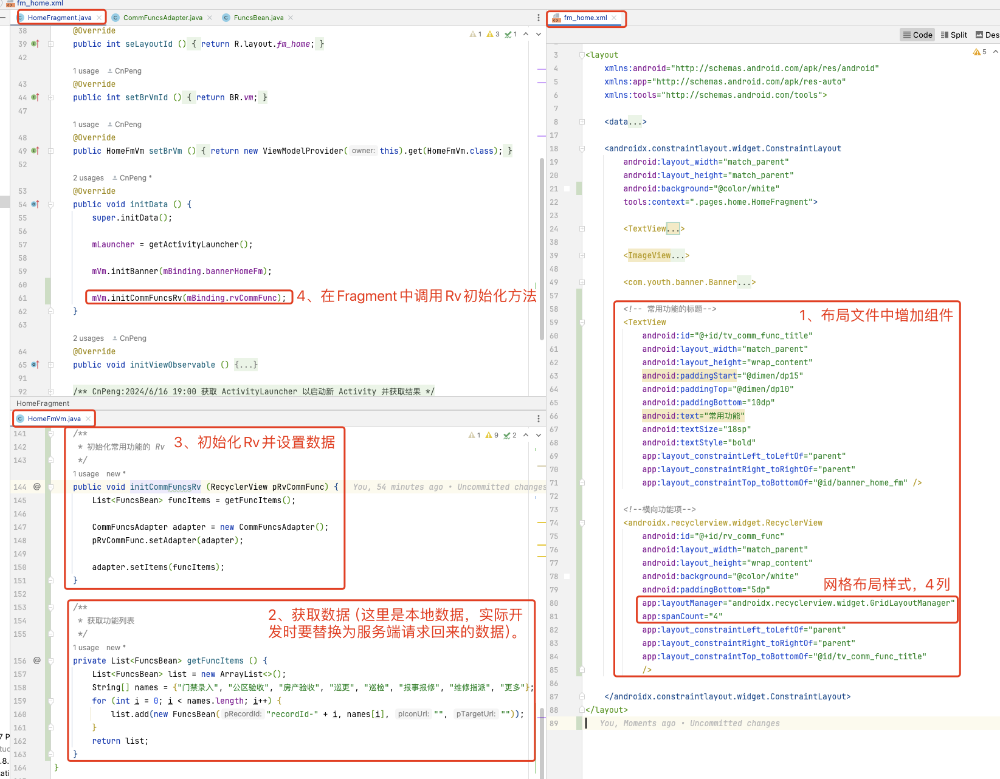

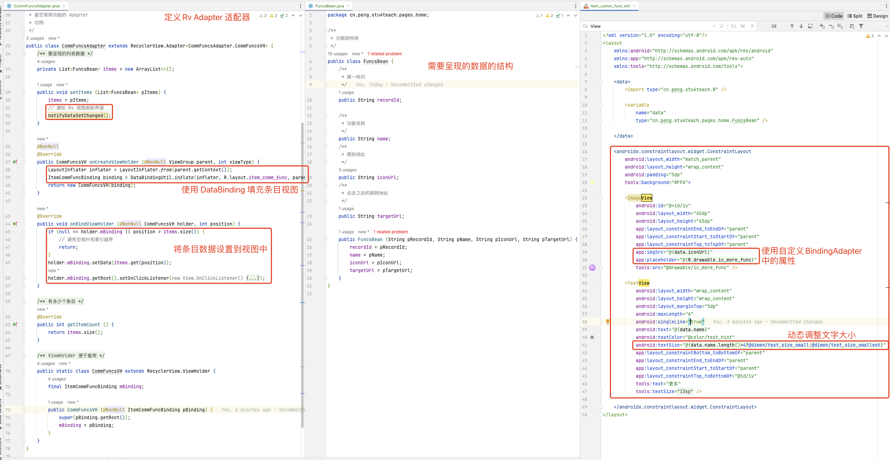

#### 1.1.1.2. 核心源码

##### 1.1.1.2.1. CommFuncsAdapter.java

```java
package cn.peng.stu4teach.pages.home;

import android.view.LayoutInflater;
import android.view.View;
import android.view.ViewGroup;

import androidx.annotation.NonNull;
import androidx.databinding.DataBindingUtil;
import androidx.recyclerview.widget.RecyclerView;

import com.blankj.utilcode.util.ToastUtils;

import java.util.ArrayList;
import java.util.List;

import cn.peng.stu4teach.R;
import cn.peng.stu4teach.databinding.ItemCommFuncBinding;

/**
 * 首页常用功能的 Adapter
 * 功用：
 */
public class CommFuncsAdapter extends RecyclerView.Adapter<CommFuncsAdapter.CommFuncsVH> {
    /**
     * 要呈现的列表数据
     */
    private List<FuncsBean> items = new ArrayList<>();

    public void setItems (List<FuncsBean> pItems) {
        items = pItems;
        // 通知 Rv 视图刷新界面
        notifyDataSetChanged();
    }

    @NonNull
    @Override
    public CommFuncsVH onCreateViewHolder (@NonNull ViewGroup parent, int viewType) {
        LayoutInflater inflater = LayoutInflater.from(parent.getContext());
        ItemCommFuncBinding binding = DataBindingUtil.inflate(inflater, R.layout.item_comm_func, parent, false);
        return new CommFuncsVH(binding);
    }

    @Override
    public void onBindViewHolder (@NonNull CommFuncsVH holder, int position) {
        if (null == holder.mBinding || position > items.size()) {
            // 避免空指针和索引越界
            return;
        }
        holder.mBinding.setData(items.get(position));
        holder.mBinding.getRoot().setOnClickListener(new View.OnClickListener() {
            @Override
            public void onClick (View v) {
                // TODO: CnPeng 2024/6/17 07:26 条目被点击了。进入对应的 WebView 界面中
                ToastUtils.showShort("条目被点击了，进入对应的 Web 页面中");
            }
        });
    }

    /**
     * 有多少个条目
     */
    @Override
    public int getItemCount () {
        return items.size();
    }

    /**
     * ViewHolder 便于复用
     */
    public static class CommFuncsVH extends RecyclerView.ViewHolder {
        final ItemCommFuncBinding mBinding;

        public CommFuncsVH (@NonNull ItemCommFuncBinding pBinding) {
            super(pBinding.getRoot());
            mBinding = pBinding;
        }
    }
}
```

##### 1.1.1.2.2. FuncsBean.java

```java
package cn.peng.stu4teach.pages.home;

/**
 * 功能结构体
 */
public class FuncsBean {
    /**
     * 唯一标识
     */
    public String recordId;

    /**
     * 功能名称
     */
    public String name;
    /**
     * 图标地址
     */
    public String iconUrl;
    /**
     * 点击之后的跳转地址
     */
    public String targetUrl;

    public FuncsBean (String pRecordId, String pName, String pIconUrl, String pTargetUrl) {
        recordId = pRecordId;
        name = pName;
        iconUrl = pIconUrl;
        targetUrl = pTargetUrl;
    }
}
```

##### 1.1.1.2.3. item_comm_func.xml

```xml
<?xml version="1.0" encoding="utf-8"?>
<layout
    xmlns:android="http://schemas.android.com/apk/res/android"
    xmlns:app="http://schemas.android.com/apk/res-auto"
    xmlns:tools="http://schemas.android.com/tools">

    <data>
        <import type="cn.peng.stu4teach.R" />

        <variable
            name="data"
            type="cn.peng.stu4teach.pages.home.FuncsBean" />

    </data>

    <androidx.constraintlayout.widget.ConstraintLayout
        android:layout_width="match_parent"
        android:layout_height="wrap_content"
        android:padding="5dp"
        tools:background="#FFA">

        <ImageView
            android:id="@+id/iv"
            android:layout_width="45dp"
            android:layout_height="45dp"
            app:layout_constraintEnd_toEndOf="parent"
            app:layout_constraintStart_toStartOf="parent"
            app:layout_constraintTop_toTopOf="parent"
            app:imgSrc="@{data.iconUrl}"
            app:placeholder="@{R.drawable.ic_more_func}"
            tools:src="@drawable/ic_more_func" />

        <TextView
            android:layout_width="wrap_content"
            android:layout_height="wrap_content"
            android:layout_marginTop="5dp"
            android:maxLength="6"
            android:singleLine="true"
            android:text="@{data.name}"
            android:textColor="@color/text_hint"
            android:textSize="@{data.name.length()>4?@dimen/text_size_small:@dimen/text_size_smallest}"
            app:layout_constraintBottom_toBottomOf="parent"
            app:layout_constraintEnd_toEndOf="parent"
            app:layout_constraintStart_toStartOf="parent"
            app:layout_constraintTop_toBottomOf="@id/iv"
            tools:text="更多"
            tools:textSize="@dimen/text_size_small" />

    </androidx.constraintlayout.widget.ConstraintLayout>
</layout>
```

##### 1.1.1.2.4. fm_home.xml

```xml
<?xml version="1.0" encoding="utf-8"?>

<layout
    xmlns:android="http://schemas.android.com/apk/res/android"
    xmlns:app="http://schemas.android.com/apk/res-auto"
    xmlns:tools="http://schemas.android.com/tools">

    <data>

        <import type="cn.peng.stu4teach.R" />

        <variable
            name="vm"
            type="cn.peng.stu4teach.pages.home.HomeFmVm" />

    </data>

    <androidx.constraintlayout.widget.ConstraintLayout
        android:layout_width="match_parent"
        android:layout_height="match_parent"
        android:background="@color/white"
        tools:context=".pages.home.HomeFragment">

        <TextView
            android:id="@+id/tv_title"
            android:layout_width="match_parent"
            android:layout_height="50dp"
            android:background="@color/white"
            android:gravity="center_vertical"
            android:paddingStart="@dimen/dp15"
            android:text="@{`Hi，`+vm.userName}"
            android:textColor="@color/text_main"
            android:textSize="@dimen/text_size_max"
            android:textStyle="bold"
            app:layout_constraintStart_toStartOf="parent"
            app:layout_constraintTop_toTopOf="parent"
            tools:text="Hi，张三" />

        <ImageView
            android:layout_width="25dp"
            android:layout_height="25dp"
            android:layout_marginEnd="@dimen/dp15"
            android:onClick="@{()->vm.onQrClick(context)}"
            android:src="@drawable/ic_scan"
            app:layout_constraintBottom_toBottomOf="@id/tv_title"
            app:layout_constraintEnd_toEndOf="parent"
            app:layout_constraintTop_toTopOf="@id/tv_title" />

        <com.youth.banner.Banner
            android:id="@+id/banner_home_fm"
            android:layout_width="match_parent"
            android:layout_height="@dimen/bannerH"
            app:layout_constraintLeft_toLeftOf="parent"
            app:layout_constraintRight_toRightOf="parent"
            app:layout_constraintTop_toBottomOf="@id/tv_title"
            tools:background="#FFA" />

        <!-- 常用功能的标题-->
        <TextView
            android:id="@+id/tv_comm_func_title"
            android:layout_width="match_parent"
            android:layout_height="wrap_content"
            android:paddingStart="@dimen/dp15"
            android:paddingTop="@dimen/dp10"
            android:paddingBottom="10dp"
            android:text="常用功能"
            android:textSize="18sp"
            android:textStyle="bold"
            app:layout_constraintLeft_toLeftOf="parent"
            app:layout_constraintRight_toRightOf="parent"
            app:layout_constraintTop_toBottomOf="@id/banner_home_fm" />

        <!--横向功能项-->
        <androidx.recyclerview.widget.RecyclerView
            android:id="@+id/rv_comm_func"
            android:layout_width="match_parent"
            android:layout_height="wrap_content"
            android:background="@color/white"
            android:paddingBottom="5dp"
            app:layoutManager="androidx.recyclerview.widget.GridLayoutManager"
            app:spanCount="4"
            app:layout_constraintLeft_toLeftOf="parent"
            app:layout_constraintRight_toRightOf="parent"
            app:layout_constraintTop_toBottomOf="@id/tv_comm_func_title"
            />

    </androidx.constraintlayout.widget.ConstraintLayout>
</layout>
```

### 1.1.2. 保存数据到本地


#### 1.1.2.1. 数据存储简介

按照 [官方文档：数据和文件存储概览](https://developer.android.google.cn/training/data-storage?hl=zh-cn) 中的说明，Android 数据存储有如下几种类别：

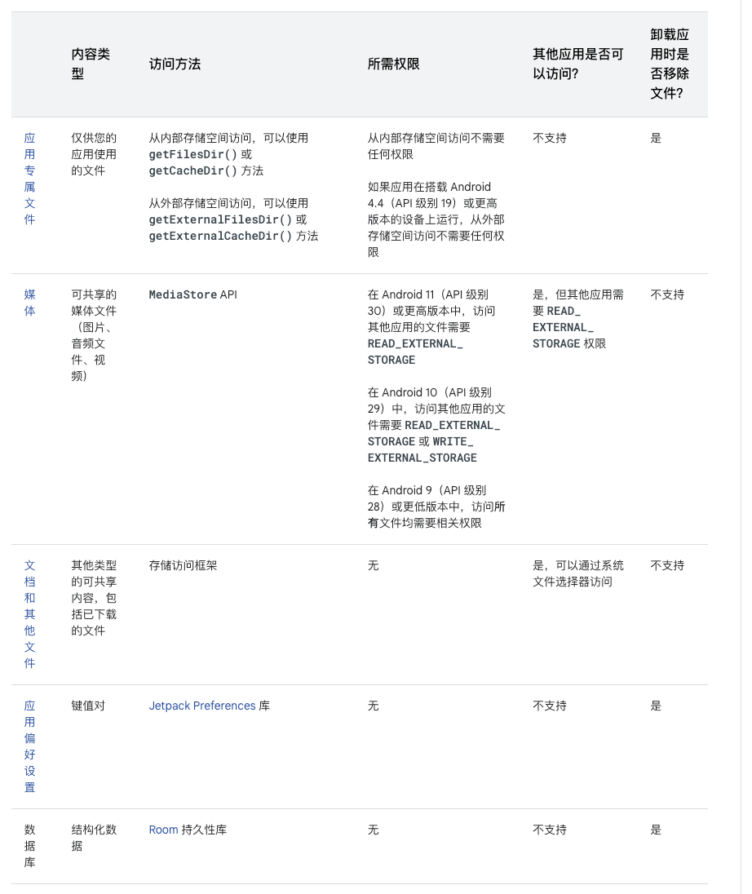


* `应用专属文件`：即沙盒目录，应用内升级时下载的 apk 文件通常会放在此处。另外，google 应用商店上架时会检查沙盒的使用情况，严格限制公有 SD 目录存储。
* `应用偏好设置`：使用 SharedPreferences 进行存储，通常用户存储简单的键值对数据。
* `数据库`：存储数据量大、且较复杂的数据。底层使用的是 Sqllite 数据库。早些年直接使用 sql 语句操作 Sqllite , 现在官方做了一层包装——Room, 通过该组件操作数据。

#### 1.1.2.2. 使用Sp存储键值对

`SharedPreferences` 用于存储简单的键值对数据，键和值通常都是基本类型数据。[点击查看基本使用方式。](https://developer.android.google.cn/training/data-storage/shared-preferences?hl=zh-cn)

如果想存储对象或者List/数组类型的数据，可以先使用 Gson 将其转换成字符串，然后存储。使用时先取出 Gson 字符串，然后再转换为原始类型即可。

前面课程中我们已经导入了 utilCode 工具包，其中包含了 Sp 工具类，因此，我们直接使用即可。

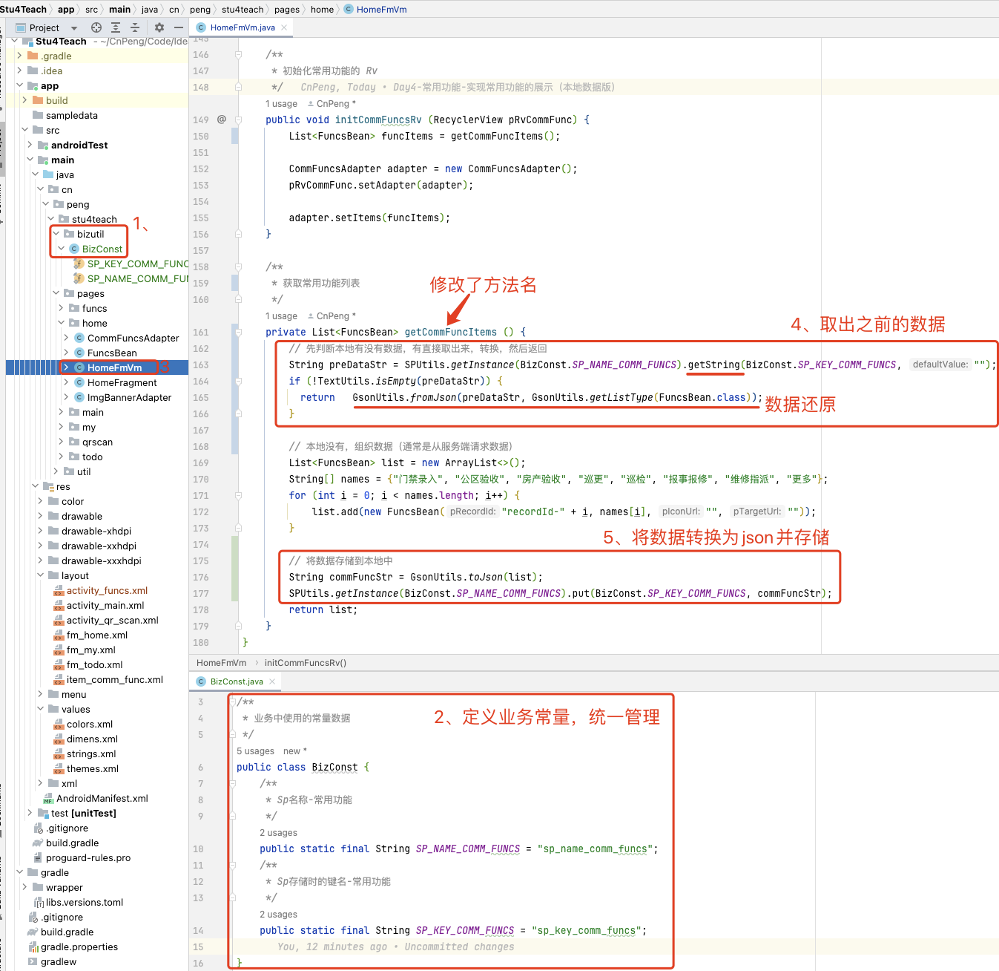


* HomeFmVm.java 核心代码

```java

    /**
     * 获取常用功能列表
     */
    private List<FuncsBean> getCommFuncItems () {
        // 先判断本地有没有数据，有直接取出来，转换，然后返回
        String preDataStr = SPUtils.getInstance(BizConst.SP_NAME_COMM_FUNCS).getString(BizConst.SP_KEY_COMM_FUNCS, "");
        if (!TextUtils.isEmpty(preDataStr)) {
          return   GsonUtils.fromJson(preDataStr, GsonUtils.getListType(FuncsBean.class));
        }

        // 本地没有，组织数据（通常是从服务端请求数据）
        List<FuncsBean> list = new ArrayList<>();
        String[] names = {"门禁录入", "公区验收", "房产验收", "巡更", "巡检", "报事报修", "维修指派", "更多"};
        for (int i = 0; i < names.length; i++) {
            list.add(new FuncsBean("recordId-" + i, names[i], "", ""));
        }

        // 将数据存储到本地中
        String commFuncStr = GsonUtils.toJson(list);
        SPUtils.getInstance(BizConst.SP_NAME_COMM_FUNCS).put(BizConst.SP_KEY_COMM_FUNCS, commFuncStr);
        return list;
    }
```

* BizConst.java

```java
package cn.peng.stu4teach.bizutil;

/**
 * 业务中使用的常量数据
 */
public class BizConst {
    /**
     * Sp名称-常用功能
     */
    public static final String SP_NAME_COMM_FUNCS = "sp_name_comm_funcs";
    /**
     * Sp存储时的键名-常用功能
     */
    public static final String SP_KEY_COMM_FUNCS = "sp_key_comm_funcs";

}

```


### 1.1.3. 全部功能分组呈现

#### 1.1.3.1. 效果呈现

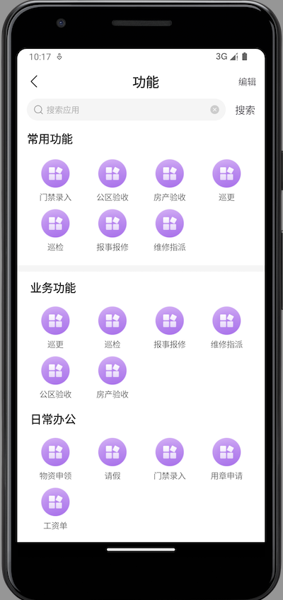

#### 1.1.3.2. 核心代码截图解析

##### 1.1.3.2.1. 布局文件：

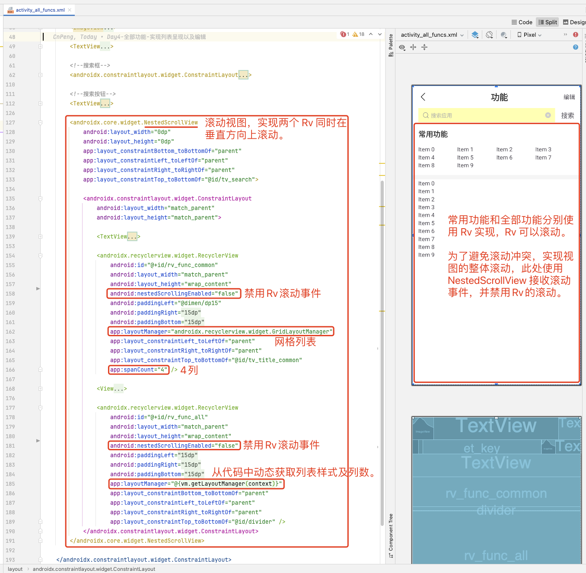

##### 1.1.3.2.2. FunsBean调整

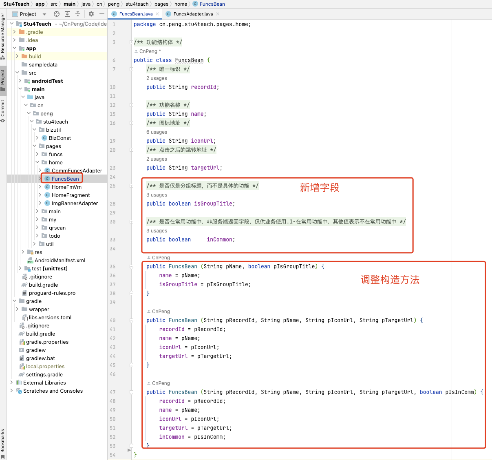

##### 1.1.3.2.3. 适配器及代码逻辑

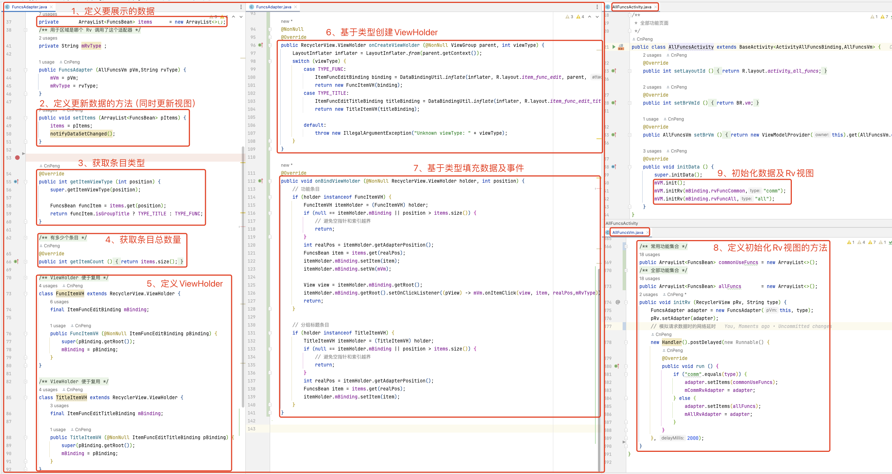


#### 1.1.3.3. 核心源码

##### 1.1.3.3.1. activity_all_funcs.xml

```xml
<?xml version="1.0" encoding="utf-8"?>

<layout
    xmlns:android="http://schemas.android.com/apk/res/android"
    xmlns:app="http://schemas.android.com/apk/res-auto"
    xmlns:tools="http://schemas.android.com/tools">

    <data>

        <variable
            name="vm"
            type="cn.peng.stu4teach.pages.funcs.AllFuncsVm" />
    </data>

    <androidx.constraintlayout.widget.ConstraintLayout
        android:layout_width="match_parent"
        android:background="@color/white"
        android:layout_height="match_parent"
        tools:context=".pages.funcs.AllFuncsActivity">

        <TextView
            android:id="@+id/tv_title"
            android:layout_width="match_parent"
            android:layout_height="@dimen/dp55"
            android:gravity="center"
            android:paddingStart="@dimen/dp15"
            android:text="功能"
            android:textColor="#333333"
            android:textSize="@dimen/text_size_max"
            android:textStyle="bold"
            app:layout_constraintLeft_toLeftOf="parent"
            app:layout_constraintRight_toRightOf="parent"
            app:layout_constraintTop_toTopOf="parent" />

        <ImageView
            android:id="@+id/iv_back"
            android:layout_width="wrap_content"
            android:layout_height="0dp"
            android:paddingLeft="@dimen/dp15"
            android:onClick="@{()->vm.onBackClick(context)}"
            android:paddingRight="@dimen/dp15"
            android:scaleType="center"
            android:src="@drawable/ic_arrow_black_left"
            app:layout_constraintBottom_toBottomOf="@id/tv_title"
            app:layout_constraintLeft_toLeftOf="parent"
            app:layout_constraintTop_toTopOf="parent"
            tools:visibility="visible" />

        <TextView
            android:id="@+id/tv_edit"
            android:layout_width="@dimen/dp55"
            android:layout_height="@dimen/dp55"
            android:gravity="center"
            android:onClick="@{()->vm.onEditBtnClick()}"
            android:text="@{vm.onEditing?`完成`:`编辑`}"
            app:layout_constraintBottom_toBottomOf="@id/tv_title"
            app:layout_constraintRight_toRightOf="parent"
            app:layout_constraintTop_toTopOf="@id/tv_title"
            tools:text="编辑" />

        <!--搜索框-->
        <androidx.constraintlayout.widget.ConstraintLayout
            android:id="@+id/cl_search"
            android:layout_width="0dp"
            android:layout_height="35dp"
            android:layout_marginLeft="@dimen/dp15"
            android:background="@drawable/shape_rect_with_50r"
            android:orientation="horizontal"
            app:layout_constraintLeft_toLeftOf="parent"
            app:layout_constraintRight_toLeftOf="@id/tv_search"
            app:layout_constraintTop_toBottomOf="@id/tv_title"
            tools:background="#FFA">

            <EditText
                android:id="@+id/et_key"
                android:layout_width="0dp"
                android:layout_height="match_parent"
                android:layout_marginLeft="@dimen/dp10"
                android:layout_weight="1"
                android:background="@null"
                android:drawableStart="@drawable/ic_search_gray"
                android:drawablePadding="5dp"
                android:gravity="center_vertical"
                android:hint="搜索应用"
                android:imeOptions="actionSearch"
                android:singleLine="true"
                android:text="@={vm.searchKey}"
                android:enabled="@{!vm.onEditing}"
                android:textColor="#333333"
                android:textColorHint="#adadad"
                android:textSize="@dimen/text_size_small"
                app:layout_constraintBottom_toBottomOf="parent"
                app:layout_constraintLeft_toLeftOf="parent"
                app:layout_constraintRight_toLeftOf="@id/iv_del"
                app:layout_constraintTop_toTopOf="parent" />

            <ImageView
                android:id="@+id/iv_del"
                android:layout_width="0dp"
                android:layout_height="match_parent"
                android:onClick="@{()->vm.onClearSearchKey(etKey.text)}"
                android:scaleType="centerInside"
                android:src="@drawable/ic_del_gray"
                app:layout_constraintBottom_toBottomOf="parent"
                app:layout_constraintDimensionRatio="1:1"
                app:layout_constraintLeft_toRightOf="@id/et_key"
                app:layout_constraintRight_toRightOf="parent"
                app:layout_constraintTop_toTopOf="parent" />
        </androidx.constraintlayout.widget.ConstraintLayout>

        <!--搜索按钮-->
        <TextView
            android:id="@+id/tv_search"
            android:layout_width="wrap_content"
            android:layout_height="0dp"
            android:gravity="center"
            android:onClick="@{()->vm.onSearch(etKey.text)}"
            android:paddingLeft="@dimen/dp15"
            android:paddingRight="@dimen/dp15"
            android:text="搜索"
            android:textSize="@dimen/text_size_title"
            app:layout_constraintBottom_toBottomOf="@id/cl_search"
            app:layout_constraintLeft_toRightOf="@id/cl_search"
            app:layout_constraintRight_toRightOf="parent"
            app:layout_constraintTop_toTopOf="@id/cl_search" />

        <androidx.core.widget.NestedScrollView
            android:layout_width="0dp"
            android:layout_height="0dp"
            app:layout_constraintBottom_toBottomOf="parent"
            app:layout_constraintLeft_toLeftOf="parent"
            app:layout_constraintRight_toRightOf="parent"
            app:layout_constraintTop_toBottomOf="@id/tv_search">

            <androidx.constraintlayout.widget.ConstraintLayout
                android:layout_width="match_parent"
                android:layout_height="match_parent">

                <TextView
                    android:id="@+id/tv_title_common"
                    android:layout_width="match_parent"
                    android:layout_height="wrap_content"
                    android:paddingLeft="@dimen/dp15"
                    android:paddingTop="@dimen/dp15"
                    android:paddingBottom="@dimen/dp15"
                    android:text="常用功能"
                    android:textColor="#333"
                    android:textSize="18dp"
                    android:textStyle="bold"
                    app:layout_constraintLeft_toLeftOf="parent"
                    app:layout_constraintRight_toRightOf="parent"
                    app:layout_constraintTop_toTopOf="parent" />

                <androidx.recyclerview.widget.RecyclerView
                    android:id="@+id/rv_func_common"
                    android:layout_width="match_parent"
                    android:layout_height="wrap_content"
                    android:nestedScrollingEnabled="false"
                    android:paddingLeft="@dimen/dp15"
                    android:paddingRight="@dimen/dp15"
                    android:paddingBottom="@dimen/dp15"
                    app:layoutManager="androidx.recyclerview.widget.GridLayoutManager"
                    app:layout_constraintLeft_toLeftOf="parent"
                    app:layout_constraintRight_toRightOf="parent"
                    app:layout_constraintTop_toBottomOf="@id/tv_title_common"
                    app:spanCount="4" />

                <View
                    android:id="@+id/divider"
                    android:layout_width="match_parent"
                    android:layout_height="@dimen/dp10"
                    android:background="@color/background"
                    app:layout_constraintLeft_toLeftOf="parent"
                    app:layout_constraintRight_toRightOf="parent"
                    app:layout_constraintTop_toBottomOf="@id/rv_func_common" />

                <androidx.recyclerview.widget.RecyclerView
                    android:id="@+id/rv_func_all"
                    android:layout_width="match_parent"
                    android:layout_height="wrap_content"
                    android:nestedScrollingEnabled="false"
                    android:paddingLeft="@dimen/dp15"
                    android:paddingRight="@dimen/dp15"
                    android:paddingBottom="@dimen/dp15"
                    app:layoutManager="@{vm.getLayoutManager(context)}"
                    app:layout_constraintBottom_toBottomOf="parent"
                    app:layout_constraintLeft_toLeftOf="parent"
                    app:layout_constraintRight_toRightOf="parent"
                    app:layout_constraintTop_toBottomOf="@id/divider" />
            </androidx.constraintlayout.widget.ConstraintLayout>
        </androidx.core.widget.NestedScrollView>

    </androidx.constraintlayout.widget.ConstraintLayout>
</layout>
```

##### 1.1.3.3.2. FuncsAdapter.java

```java
package cn.peng.stu4teach.pages.funcs;

import android.view.LayoutInflater;
import android.view.View;
import android.view.ViewGroup;

import androidx.annotation.NonNull;
import androidx.databinding.DataBindingUtil;
import androidx.databinding.ObservableArrayList;
import androidx.recyclerview.widget.RecyclerView;

import cn.peng.stu4teach.R;
import cn.peng.stu4teach.databinding.ItemFuncEditBinding;
import cn.peng.stu4teach.databinding.ItemFuncEditTitleBinding;
import cn.peng.stu4teach.pages.home.FuncsBean;

/**
 * “全部功能” 中的 Adapter
 */
public class FuncsAdapter extends RecyclerView.Adapter<RecyclerView.ViewHolder> {
    /**
     * 条目类型-功能
     */
    private final int                            TYPE_FUNC  = 0x00000001;
    /**
     * 条目类型-分组标题
     */
    private final int                            TYPE_TITLE = 0x00000002;
    /**
     * 要呈现的列表数据
     */
    private       ArrayList<FuncsBean> items      = new ArrayList<>();
    /**
     * 外部的 ViewModel
     */
    private final AllFuncsVm                     mVm;
    /**
     * 用于区域是哪个 Rv 调用了这个适配器
     */
    private String mRvType ;


    public FuncsAdapter (AllFuncsVm pVm,String rvType) {
        mVm = pVm;
        mRvType = rvType;
    }

    public void setItems (ArrayList<FuncsBean> pItems) {
        items = pItems;
        notifyDataSetChanged();
    }

    @NonNull
    @Override
    public RecyclerView.ViewHolder onCreateViewHolder (@NonNull ViewGroup parent, int viewType) {
        LayoutInflater inflater = LayoutInflater.from(parent.getContext());
        switch (viewType) {
            case TYPE_FUNC:
                ItemFuncEditBinding binding = DataBindingUtil.inflate(inflater, R.layout.item_func_edit, parent, false);
                return new FuncItemVH(binding);
            case TYPE_TITLE:
                ItemFuncEditTitleBinding titleBinding = DataBindingUtil.inflate(inflater, R.layout.item_func_edit_title, parent, false);
                return new TitleItemVH(titleBinding);

            default:
                throw new IllegalArgumentException("Unknown viewType: " + viewType);
        }
    }

    @Override
    public void onBindViewHolder (@NonNull RecyclerView.ViewHolder holder, int position) {
        // 功能条目
        if (holder instanceof FuncItemVH) {
            FuncItemVH itemHolder = (FuncItemVH) holder;
            if (null == itemHolder.mBinding || position > items.size()) {
                // 避免空指针和索引越界
                return;
            }
            int realPos = itemHolder.getAdapterPosition();
            FuncsBean item = items.get(realPos);
            itemHolder.mBinding.setItem(item);
            itemHolder.mBinding.setVm(mVm);

            View view = itemHolder.mBinding.getRoot();
            itemHolder.mBinding.getRoot().setOnClickListener((pView) -> mVm.onItemClick(view, item, realPos,mRvType));
            return;
        }

        // 分组标题条目
        if (holder instanceof TitleItemVH) {
            TitleItemVH itemHolder = (TitleItemVH) holder;
            if (null == itemHolder.mBinding || position > items.size()) {
                // 避免空指针和索引越界
                return;
            }
            int realPos = itemHolder.getAdapterPosition();
            FuncsBean item = items.get(realPos);
            itemHolder.mBinding.setItem(item);
        }
    }

    @Override
    public int getItemViewType (int position) {
        super.getItemViewType(position);

        FuncsBean funcItem = items.get(position);
        return funcItem.isGroupTitle ? TYPE_TITLE : TYPE_FUNC;
    }

    /**
     * 有多少个条目
     */
    @Override
    public int getItemCount () {
        return items.size();
    }

    /**
     * ViewHolder 便于复用
     */
    class FuncItemVH extends RecyclerView.ViewHolder {
        final ItemFuncEditBinding mBinding;

        public FuncItemVH (@NonNull ItemFuncEditBinding pBinding) {
            super(pBinding.getRoot());
            mBinding = pBinding;
        }
    }

    /**
     * ViewHolder 便于复用
     */
    class TitleItemVH extends RecyclerView.ViewHolder {
        final ItemFuncEditTitleBinding mBinding;

        public TitleItemVH (@NonNull ItemFuncEditTitleBinding pBinding) {
            super(pBinding.getRoot());
            mBinding = pBinding;
        }
    }
}
```

##### 1.1.3.3.3. AllFuncsVm.java

```java
package cn.peng.stu4teach.pages.funcs;

import android.app.Activity;
import android.app.Application;
import android.content.Context;
import android.content.Intent;
import android.text.TextUtils;
import android.view.View;

import androidx.annotation.NonNull;
import androidx.databinding.ObservableArrayList;
import androidx.databinding.ObservableField;
import androidx.lifecycle.AndroidViewModel;
import androidx.localbroadcastmanager.content.LocalBroadcastManager;
import androidx.recyclerview.widget.GridLayoutManager;
import androidx.recyclerview.widget.RecyclerView;

import com.blankj.utilcode.util.GsonUtils;
import com.blankj.utilcode.util.LogUtils;
import com.blankj.utilcode.util.SPUtils;
import com.blankj.utilcode.util.ToastUtils;

import java.util.ArrayList;
import java.util.List;

import cn.peng.stu4teach.bizutil.BizConst;
import cn.peng.stu4teach.pages.home.FuncsBean;

/**
 * 功用："全部功能" 页面中使用的Vm
 */
public class AllFuncsVm extends AndroidViewModel {


    /**
     * 常用功能集合
     */
    public ArrayList<FuncsBean> commonUseFuncs = new ArrayList<>();
    /**
     * 全部功能集合
     */
    public ArrayList<FuncsBean> allFuncs       = new ArrayList<>();

    /**
     * 常用功能使用的适配器
     */
    private FuncsAdapter             mCommRvAdapter;
    /**
     * 全部功能使用的适配器
     */
    private FuncsAdapter             mAllRvAdapter;

    public AllFuncsVm (@NonNull Application application) {
        super(application);
    }


    /**
     * 执行初始化操作
     */
    public void init () {
        getCommonFuncs();
        getAllFuncs();
    }

    /**
     * 获取常用功能
     */
    private void getCommonFuncs () {
        String preDataStr = SPUtils.getInstance(BizConst.SP_NAME_COMM_FUNCS).getString(BizConst.SP_KEY_COMM_FUNCS, "");
        List<FuncsBean> preCommFuncs = GsonUtils.fromJson(preDataStr, GsonUtils.getListType(FuncsBean.class));

        if (!preCommFuncs.isEmpty()) {
            commonUseFuncs.addAll(preCommFuncs);
        }
    }

    /**
     * 从服务端获取全部的功能
     */
    private void getAllFuncs () {

        String[] names1 = {"巡更", "巡检", "报事报修", "维修指派", "公区验收", "房产验收"};
        String[] names2 = {"物资申领", "请假", "门禁录入", "用章申请", "工资单"};
        String[] names3 = {"规章制度", "奖惩办法", "操作准则", "公司发文"};
        // 二维数组
        String[][] nameArrArr = {names1, names2, names3};

        List<FuncsBean> list = new ArrayList<FuncsBean>();
        for (int i = 0; i < nameArrArr.length; i++) {
            switch (i) {
                case 0:
                    list.add(new FuncsBean("业务功能", true));
                    break;
                case 1:
                    list.add(new FuncsBean("日常办公", true));
                    break;
                default:
                    list.add(new FuncsBean("公司制度", true));
                    break;
            }

            String[] names = nameArrArr[i];
            for (int j = 0; j < names.length; j++) {
                list.add(new FuncsBean("recordId-" + j, names[j], "", ""));
            }
        }

        allFuncs.addAll(list);
    }

    /**
     * 动态获取 LayoutManager 调整每行所展示的列数。
     */
    public GridLayoutManager getLayoutManager (Context pCtx) {
        int spanCount = 4;
        GridLayoutManager layoutManager = new GridLayoutManager(pCtx, spanCount);
        layoutManager.setSpanSizeLookup(new GridLayoutManager.SpanSizeLookup() {
            @Override
            public int getSpanSize (int position) {
                FuncsBean funcBean = allFuncs.get(position);
                return funcBean.isGroupTitle ? spanCount : 1;
            }
        });
        return layoutManager;
    }

    /**
     * 返回按钮被点击了
     */
    public void onBackClick (Context pCtx) {
        if (null == pCtx) {
            return;
        }

        Activity act = (Activity) pCtx;
        act.finish();
    }

    public void initRv (RecyclerView pRv, String type) {
        FuncsAdapter adapter = new FuncsAdapter(this);
        pRv.setAdapter(adapter);

        // 模拟网络请求的延时
        new Handler().postDelayed(new Runnable() {
            @Override
            public void run () {
                if ("comm".equals(type)) {
                    adapter.setItems(commonUseFuncs);
                    mCommRvAdapter = adapter;
                } else {
                    adapter.setItems(allFuncs);
                    mAllRvAdapter = adapter;
                }
            }
        }, 2000);

    }
}
```

##### 1.1.3.3.4. AllFuncsActivity.java


```java
package cn.peng.stu4teach.pages.funcs;

import android.os.Bundle;

import androidx.activity.EdgeToEdge;
import androidx.appcompat.app.AppCompatActivity;
import androidx.core.graphics.Insets;
import androidx.core.view.ViewCompat;
import androidx.core.view.WindowInsetsCompat;
import androidx.databinding.library.baseAdapters.BR;
import androidx.lifecycle.Observer;
import androidx.lifecycle.ViewModelProvider;

import cn.peng.stu4teach.R;
import cn.peng.stu4teach.databinding.ActivityAllFuncsBinding;
import cn.peng.stu4teach.util.base.BaseActivity;

/**
 * 全部功能页面
 */
public class AllFuncsActivity extends BaseActivity<ActivityAllFuncsBinding,AllFuncsVm> {
    @Override
    public int setLayoutId () {
        return R.layout.activity_all_funcs;
    }

    @Override
    public int setBrVmId () {
        return BR.vm;
    }

    @Override
    public AllFuncsVm setBrVm () {
        return new ViewModelProvider(this).get(AllFuncsVm.class);
    }

    @Override
    public void initData () {
        super.initData();
        mVM.init();
        mVM.initRv(mBinding.rvFuncCommon,"comm");
        mVM.initRv(mBinding.rvFuncAll,"all");
    }
}
```

##### 1.1.3.3.5. FuncsBean.java

```java
package cn.peng.stu4teach.pages.home;

/**
 * 功能结构体
 */
public class FuncsBean {
    /**
     * 唯一标识
     */
    public String recordId;

    /**
     * 功能名称
     */
    public String name;
    /**
     * 图标地址
     */
    public String iconUrl;
    /**
     * 点击之后的跳转地址
     */
    public String targetUrl;

    /**
     * 是否仅是分组标题，而不是具体的功能
     */
    public boolean isGroupTitle;

    /**
     * 是否在常用功能中，非服务端返回字段，仅供业务使用.1-在常用功能中，其他值表示不在常用功能中
     */
    public boolean     inCommon;

    public FuncsBean (String pName, boolean pIsGroupTitle) {
        name = pName;
        isGroupTitle = pIsGroupTitle;
    }

    public FuncsBean (String pRecordId, String pName, String pIconUrl, String pTargetUrl) {
        recordId = pRecordId;
        name = pName;
        iconUrl = pIconUrl;
        targetUrl = pTargetUrl;
    }

    public FuncsBean (String pRecordId, String pName, String pIconUrl, String pTargetUrl, boolean pIsInComm) {
        recordId = pRecordId;
        name = pName;
        iconUrl = pIconUrl;
        targetUrl = pTargetUrl;
        inCommon = pIsInComm;
    }
}
```

### 1.1.4. 常用功能编辑

#### 1.1.4.1. 效果呈现

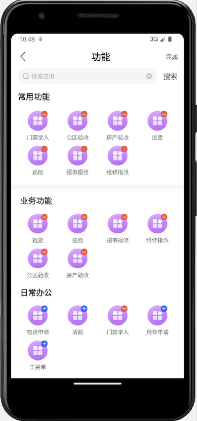


#### 1.1.4.2. 核心源码截图解析

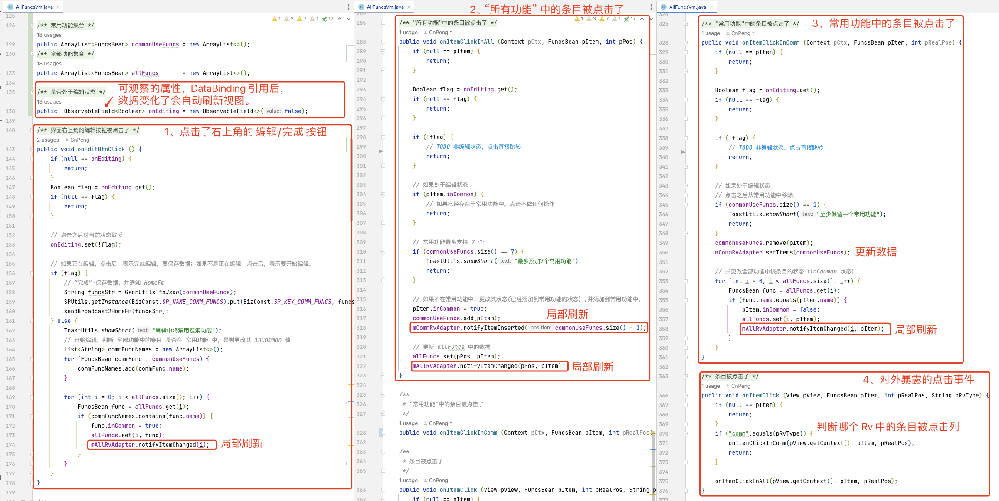


#### 1.1.4.3. 核心源码

##### 1.1.4.3.1. AllFuncsVm.java

```java
package cn.peng.stu4teach.pages.funcs;

import android.app.Activity;
import android.app.Application;
import android.content.Context;
import android.content.Intent;
import android.os.Handler;
import android.text.TextUtils;
import android.view.View;

import androidx.annotation.NonNull;
import androidx.databinding.ObservableField;
import androidx.lifecycle.AndroidViewModel;
import androidx.localbroadcastmanager.content.LocalBroadcastManager;
import androidx.recyclerview.widget.GridLayoutManager;
import androidx.recyclerview.widget.RecyclerView;

import com.blankj.utilcode.util.GsonUtils;
import com.blankj.utilcode.util.LogUtils;
import com.blankj.utilcode.util.SPUtils;
import com.blankj.utilcode.util.ToastUtils;

import java.util.ArrayList;
import java.util.List;

import cn.peng.stu4teach.bizutil.BizConst;
import cn.peng.stu4teach.pages.home.FuncsBean;

/**
 * 功用："全部功能" 页面中使用的Vm
 */
public class AllFuncsVm extends AndroidViewModel {
    /**
     * 常用功能集合
     */
    public ArrayList<FuncsBean> commonUseFuncs = new ArrayList<>();
    /**
     * 全部功能集合
     */
    public ArrayList<FuncsBean> allFuncs       = new ArrayList<>();

    /**
     * 是否处于编辑状态
     */
    public  ObservableField<Boolean> onEditing = new ObservableField<>(false);

    /**
     * 常用功能使用的适配器
     */
    private FuncsAdapter             mCommRvAdapter;
    /**
     * 全部功能使用的适配器
     */
    private FuncsAdapter             mAllRvAdapter;

    public AllFuncsVm (@NonNull Application application) {
        super(application);
    }

    /**
     * 执行初始化操作
     */
    public void init () {
        getCommonFuncs();
        getAllFuncs();
    }

    /**
     * 获取常用功能
     */
    private void getCommonFuncs () {
        String preDataStr = SPUtils.getInstance(BizConst.SP_NAME_COMM_FUNCS).getString(BizConst.SP_KEY_COMM_FUNCS, "");
        List<FuncsBean> preCommFuncs = GsonUtils.fromJson(preDataStr, GsonUtils.getListType(FuncsBean.class));

        if (!preCommFuncs.isEmpty()) {
            commonUseFuncs.addAll(preCommFuncs);
        }
    }

    /**
     * 从服务端获取全部的功能
     */
    private void getAllFuncs () {
        String[] names1 = {"巡更", "巡检", "报事报修", "维修指派", "公区验收", "房产验收"};
        String[] names2 = {"物资申领", "请假", "门禁录入", "用章申请", "工资单"};
        String[] names3 = {"规章制度", "奖惩办法", "操作准则", "公司发文"};
        // 二维数组
        String[][] nameArrArr = {names1, names2, names3};

        List<FuncsBean> list = new ArrayList<FuncsBean>();
        for (int i = 0; i < nameArrArr.length; i++) {
            switch (i) {
                case 0:
                    list.add(new FuncsBean("业务功能", true));
                    break;
                case 1:
                    list.add(new FuncsBean("日常办公", true));
                    break;
                default:
                    list.add(new FuncsBean("公司制度", true));
                    break;
            }

            String[] names = nameArrArr[i];
            for (int j = 0; j < names.length; j++) {
                list.add(new FuncsBean("recordId-" + j, names[j], "", ""));
            }
        }

        allFuncs.addAll(list);
    }

    /**
     * 界面右上角的编辑按钮被点击了
     */
    public void onEditBtnClick () {
        if (null == onEditing) {
            return;
        }
        Boolean flag = onEditing.get();
        if (null == flag) {
            return;
        }

        // 点击之后对当前状态取反
        onEditing.set(!flag);

        // 如果正在编辑，点击后，表示完成编辑，要保存数据；如果不是正在编辑，点击后，表示要开始编辑。
        if (flag) {
            // “完成”-保存数据，并通知 HomeFm
            String funcsStr = GsonUtils.toJson(commonUseFuncs);
            SPUtils.getInstance(BizConst.SP_NAME_COMM_FUNCS).put(BizConst.SP_KEY_COMM_FUNCS, funcsStr);
            sendBroadcast2HomeFm(funcsStr);
        } else {
            ToastUtils.showShort("编辑中将禁用搜索功能");
            // 开始编辑，判断 全部功能中的条目 是否在 常用功能 中，是则更改其 inCommon 值
            List<String> commFuncNames = new ArrayList<>();
            for (FuncsBean commFunc : commonUseFuncs) {
                commFuncNames.add(commFunc.name);
            }

            for (int i = 0; i < allFuncs.size(); i++) {
                FuncsBean func = allFuncs.get(i);
                if (commFuncNames.contains(func.name)) {
                    func.inCommon = true;
                    allFuncs.set(i, func);
                    mAllRvAdapter.notifyItemChanged(i);
                }
            }
        }
    }

    /**
     * 动态获取 LayoutManager 调整每行所展示的列数。
     */
    public GridLayoutManager getLayoutManager (Context pCtx) {
        int spanCount = 4;
        GridLayoutManager layoutManager = new GridLayoutManager(pCtx, spanCount);
        layoutManager.setSpanSizeLookup(new GridLayoutManager.SpanSizeLookup() {
            @Override
            public int getSpanSize (int position) {
                FuncsBean funcBean = allFuncs.get(position);
                return funcBean.isGroupTitle ? spanCount : 1;
            }
        });
        return layoutManager;
    }

    /**
     * 返回按钮被点击了
     */
    public void onBackClick (Context pCtx) {
        if (null == pCtx) {
            return;
        }

        Activity act = (Activity) pCtx;
        act.finish();
    }

    /**
     * 发送本地广播，通知 HomeFm 刷新常用功能列表
     */
    private void sendBroadcast2HomeFm (String funcsStr) {
        Intent intent = new Intent();
        intent.setAction(BizConst.BROADCAST_KEY_COMM_FUNC_CHANGED);
        intent.putExtra(BizConst.SP_KEY_COMM_FUNCS, funcsStr);
        LocalBroadcastManager.getInstance(getApplication()).sendBroadcast(intent);
    }

    /**
     * "所有功能"中的条目被点击了
     */
    public void onItemClickInAll (Context pCtx, FuncsBean pItem, int pPos) {
        if (null == pItem) {
            return;
        }

        Boolean flag = onEditing.get();
        if (null == flag) {
            return;
        }

        if (!flag) {
            // TODO 非编辑状态，点击直接跳转

            return;
        }

        // 如果处于编辑状态
        if (pItem.inCommon) {
            // 如果已经存在于常用功能中，点击不做任何操作
            return;
        }

        // 常用功能最多支持 7 个
        if (commonUseFuncs.size() == 7) {
            ToastUtils.showShort("最多添加7个常用功能");
            return;
        }

        // 如果不在常用功能中，更改其状态(已经添加到常用功能的状态）,并添加到常用功能中，
        pItem.inCommon = true;
        commonUseFuncs.add(pItem);
        mCommRvAdapter.notifyItemInserted(commonUseFuncs.size() - 1);

        // 更新 allFuncs 中的数据
        allFuncs.set(pPos, pItem);
        mAllRvAdapter.notifyItemChanged(pPos, pItem);
    }

    /**
     * "常用功能"中的条目被点击了
     */
    public void onItemClickInComm (Context pCtx, FuncsBean pItem, int pRealPos) {
        if (null == pItem) {
            return;
        }

        Boolean flag = onEditing.get();
        if (null == flag) {
            return;
        }

        if (!flag) {
            // TODO 非编辑状态，点击直接跳转

            return;
        }

        // 如果处于编辑状态
        // 点击之后从常用功能中移除，
        if (commonUseFuncs.size() == 1) {
            ToastUtils.showShort("至少保留一个常用功能");
            return;
        }
        commonUseFuncs.remove(pItem);
        mCommRvAdapter.setItems(commonUseFuncs);

        // 并更改全部功能中该条目的状态（inCommon 状态）
        for (int i = 0; i < allFuncs.size(); i++) {
            FuncsBean func = allFuncs.get(i);
            if (func.name.equals(pItem.name)) {
                pItem.inCommon = false;
                allFuncs.set(i, pItem);
                mAllRvAdapter.notifyItemChanged(i, pItem);
            }
        }
    }

    /**
     * 条目被点击了
     */
    public void onItemClick (View pView, FuncsBean pItem, int pRealPos, String pRvType) {
        if (null == pItem) {
            return;
        }
        if ("comm".equals(pRvType)) {
            onItemClickInComm(pView.getContext(), pItem, pRealPos);
            return;
        }

        onItemClickInAll(pView.getContext(), pItem, pRealPos);
    }

    public void initRv (RecyclerView pRv, String type) {
        FuncsAdapter adapter = new FuncsAdapter(this, type);
        pRv.setAdapter(adapter);

        new Handler().postDelayed(new Runnable() {
            @Override
            public void run () {
                if ("comm".equals(type)) {
                    adapter.setItems(commonUseFuncs);
                    mCommRvAdapter = adapter;
                } else {
                    adapter.setItems(allFuncs);
                    mAllRvAdapter = adapter;
                }
            }
        }, 2000);

    }
}
```

### 1.1.5. 功能搜索

#### 1.1.5.1. 效果呈现

在搜索框中输入文本，然后点击末尾的`搜索`。

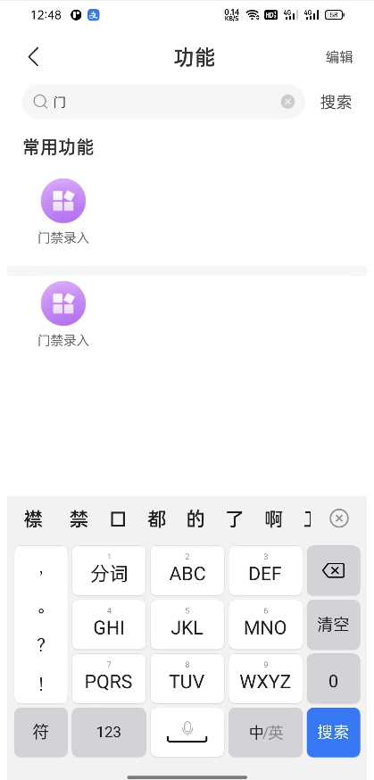

#### 1.1.5.2. 核心源码截图解析


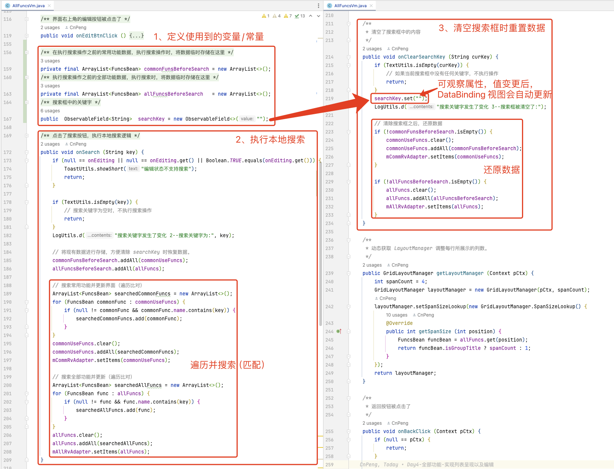


#### 1.1.5.3. 核心源码

* 核心源码：


```java
 /**
     * 在执行搜索操作之前的常用功能数据，执行搜索操作时，将数据临时存储在这里
     */
    private final ArrayList<FuncsBean> commonFunsBeforeSearch = new ArrayList<>();
    /**
     * 执行搜索操作之前的全部功能数据，执行搜索时，将数据临时存储在这里
     */
    private final ArrayList<FuncsBean> allFuncsBeforeSearch   = new ArrayList<>();
    /**
     * 搜索框中的关键字
     */
    public  ObservableField<String>  searchKey = new ObservableField<>("");

    /**
     * 点击了搜索按钮，执行本地搜索逻辑
     */
    public void onSearch (String key) {
        if (null == onEditing || null == onEditing.get() || Boolean.TRUE.equals(onEditing.get())) {
            ToastUtils.showShort("编辑状态不支持搜索");
            return;
        }

        if (TextUtils.isEmpty(key)) {
            // 搜索关键字为空时，不执行搜索操作
            return;
        }
        LogUtils.d("搜索关键字发生了变化 2--搜索关键字为:", key);

        // 将现有数据进行存储，方便清除 searchKey 时恢复数据。
        commonFunsBeforeSearch.addAll(commonUseFuncs);
        allFuncsBeforeSearch.addAll(allFuncs);

        // 搜索常用功能并更新界面（遍历比对）
        ArrayList<FuncsBean> searchedCommonFuncs = new ArrayList<>();
        for (FuncsBean commonFunc : commonUseFuncs) {
            if (null != commonFunc && commonFunc.name.contains(key)) {
                searchedCommonFuncs.add(commonFunc);
            }
        }
        commonUseFuncs.clear();
        commonUseFuncs.addAll(searchedCommonFuncs);
        mCommRvAdapter.setItems(commonUseFuncs);

        // 搜索全部功能并更新（遍历比对）
        ArrayList<FuncsBean> searchedAllFuncs = new ArrayList<>();
        for (FuncsBean func : allFuncs) {
            if (null != func && func.name.contains(key)) {
                searchedAllFuncs.add(func);
            }
        }
        allFuncs.clear();
        allFuncs.addAll(searchedAllFuncs);
        mAllRvAdapter.setItems(allFuncs);
    }

    /**
     * 清空了搜索框中的内容
     */
    public void onClearSearchKey (String curKey) {
        if (TextUtils.isEmpty(curKey)) {
            // 如果当前搜索框中没有任何关键字，不执行操作
            return;
        }
        searchKey.set("");
        LogUtils.d("搜索关键字发生了变化 3--搜索框被清空了:");

        // 清除搜索框之后，还原数据
        if (!commonFunsBeforeSearch.isEmpty()) {
            commonUseFuncs.clear();
            commonUseFuncs.addAll(commonFunsBeforeSearch);
            mCommRvAdapter.setItems(commonUseFuncs);
        }

        if (!allFuncsBeforeSearch.isEmpty()) {
            allFuncs.clear();
            allFuncs.addAll(allFuncsBeforeSearch);
            mAllRvAdapter.setItems(allFuncs);
        }
    }
```

* 完整源码

```java
package cn.peng.stu4teach.pages.funcs;

import android.app.Activity;
import android.app.Application;
import android.content.Context;
import android.content.Intent;
import android.os.Handler;
import android.text.TextUtils;
import android.view.View;

import androidx.annotation.NonNull;
import androidx.databinding.ObservableField;
import androidx.lifecycle.AndroidViewModel;
import androidx.localbroadcastmanager.content.LocalBroadcastManager;
import androidx.recyclerview.widget.GridLayoutManager;
import androidx.recyclerview.widget.RecyclerView;

import com.blankj.utilcode.util.GsonUtils;
import com.blankj.utilcode.util.LogUtils;
import com.blankj.utilcode.util.SPUtils;
import com.blankj.utilcode.util.ToastUtils;

import java.util.ArrayList;
import java.util.List;

import cn.peng.stu4teach.bizutil.BizConst;
import cn.peng.stu4teach.pages.home.FuncsBean;

/**
 * 功用："全部功能" 页面中使用的Vm
 */
public class AllFuncsVm extends AndroidViewModel {
    /**
     * 在执行搜索操作之前的常用功能数据，执行搜索操作时，将数据临时存储在这里
     */
    private final ArrayList<FuncsBean> commonFunsBeforeSearch = new ArrayList<>();
    /**
     * 执行搜索操作之前的全部功能数据，执行搜索时，将数据临时存储在这里
     */
    private final ArrayList<FuncsBean> allFuncsBeforeSearch   = new ArrayList<>();

    /**
     * 常用功能集合
     */
    public ArrayList<FuncsBean> commonUseFuncs = new ArrayList<>();
    /**
     * 全部功能集合
     */
    public ArrayList<FuncsBean> allFuncs       = new ArrayList<>();

    /**
     * 是否处于编辑状态
     */
    public  ObservableField<Boolean> onEditing = new ObservableField<>(false);
    /**
     * 搜索框中的关键字
     */
    public  ObservableField<String>  searchKey = new ObservableField<>("");
    /**
     * 常用功能使用的适配器
     */
    private FuncsAdapter             mCommRvAdapter;
    /**
     * 全部功能使用的适配器
     */
    private FuncsAdapter             mAllRvAdapter;

    public AllFuncsVm (@NonNull Application application) {
        super(application);
    }


    /**
     * 执行初始化操作
     */
    public void init () {
        getCommonFuncs();
        getAllFuncs();
    }

    /**
     * 获取常用功能
     */
    private void getCommonFuncs () {
        String preDataStr = SPUtils.getInstance(BizConst.SP_NAME_COMM_FUNCS).getString(BizConst.SP_KEY_COMM_FUNCS, "");
        List<FuncsBean> preCommFuncs = GsonUtils.fromJson(preDataStr, GsonUtils.getListType(FuncsBean.class));

        if (!preCommFuncs.isEmpty()) {
            commonUseFuncs.addAll(preCommFuncs);
        }
    }

    /**
     * 从服务端获取全部的功能
     */
    private void getAllFuncs () {
        String[] names1 = {"巡更", "巡检", "报事报修", "维修指派", "公区验收", "房产验收"};
        String[] names2 = {"物资申领", "请假", "门禁录入", "用章申请", "工资单"};
        String[] names3 = {"规章制度", "奖惩办法", "操作准则", "公司发文"};
        // 二维数组
        String[][] nameArrArr = {names1, names2, names3};

        List<FuncsBean> list = new ArrayList<FuncsBean>();
        for (int i = 0; i < nameArrArr.length; i++) {
            switch (i) {
                case 0:
                    list.add(new FuncsBean("业务功能", true));
                    break;
                case 1:
                    list.add(new FuncsBean("日常办公", true));
                    break;
                default:
                    list.add(new FuncsBean("公司制度", true));
                    break;
            }

            String[] names = nameArrArr[i];
            for (int j = 0; j < names.length; j++) {
                list.add(new FuncsBean("recordId-" + j, names[j], "", ""));
            }
        }

        allFuncs.addAll(list);
    }

    /**
     * 界面右上角的编辑按钮被点击了
     */
    public void onEditBtnClick () {
        if (null == onEditing) {
            return;
        }
        Boolean flag = onEditing.get();
        if (null == flag) {
            return;
        }

        // 点击之后对当前状态取反
        onEditing.set(!flag);

        // 如果正在编辑，点击后，表示完成编辑，要保存数据；如果不是正在编辑，点击后，表示要开始编辑。
        if (flag) {
            // “完成”-保存数据，并通知 HomeFm
            String funcsStr = GsonUtils.toJson(commonUseFuncs);
            SPUtils.getInstance(BizConst.SP_NAME_COMM_FUNCS).put(BizConst.SP_KEY_COMM_FUNCS, funcsStr);
            sendBroadcast2HomeFm(funcsStr);
        } else {
            ToastUtils.showShort("编辑中将禁用搜索功能");
            // 开始编辑，判断 全部功能中的条目 是否在 常用功能 中，是则更改其 inCommon 值
            List<String> commFuncNames = new ArrayList<>();
            for (FuncsBean commFunc : commonUseFuncs) {
                commFuncNames.add(commFunc.name);
            }

            for (int i = 0; i < allFuncs.size(); i++) {
                FuncsBean func = allFuncs.get(i);
                if (commFuncNames.contains(func.name)) {
                    func.inCommon = true;
                    allFuncs.set(i, func);
                    mAllRvAdapter.notifyItemChanged(i);
                }
            }
        }
    }

    /**
     * 点击了搜索按钮，执行本地搜索逻辑
     */
    public void onSearch (String key) {
        if (null == onEditing || null == onEditing.get() || Boolean.TRUE.equals(onEditing.get())) {
            ToastUtils.showShort("编辑状态不支持搜索");
            return;
        }

        if (TextUtils.isEmpty(key)) {
            // 搜索关键字为空时，不执行搜索操作
            return;
        }
        LogUtils.d("搜索关键字发生了变化 2--搜索关键字为:", key);

        // 将现有数据进行存储，方便清除 searchKey 时恢复数据。
        commonFunsBeforeSearch.addAll(commonUseFuncs);
        allFuncsBeforeSearch.addAll(allFuncs);

        // 搜索常用功能并更新界面（遍历比对）
        ArrayList<FuncsBean> searchedCommonFuncs = new ArrayList<>();
        for (FuncsBean commonFunc : commonUseFuncs) {
            if (null != commonFunc && commonFunc.name.contains(key)) {
                searchedCommonFuncs.add(commonFunc);
            }
        }
        commonUseFuncs.clear();
        commonUseFuncs.addAll(searchedCommonFuncs);
        mCommRvAdapter.setItems(commonUseFuncs);

        // 搜索全部功能并更新（遍历比对）
        ArrayList<FuncsBean> searchedAllFuncs = new ArrayList<>();
        for (FuncsBean func : allFuncs) {
            if (null != func && func.name.contains(key)) {
                searchedAllFuncs.add(func);
            }
        }
        allFuncs.clear();
        allFuncs.addAll(searchedAllFuncs);
        mAllRvAdapter.setItems(allFuncs);
    }

    /**
     * 清空了搜索框中的内容
     */
    public void onClearSearchKey (String curKey) {
        if (TextUtils.isEmpty(curKey)) {
            // 如果当前搜索框中没有任何关键字，不执行操作
            return;
        }
        searchKey.set("");
        LogUtils.d("搜索关键字发生了变化 3--搜索框被清空了:");

        // 清除搜索框之后，还原数据
        if (!commonFunsBeforeSearch.isEmpty()) {
            commonUseFuncs.clear();
            commonUseFuncs.addAll(commonFunsBeforeSearch);
            mCommRvAdapter.setItems(commonUseFuncs);
        }

        if (!allFuncsBeforeSearch.isEmpty()) {
            allFuncs.clear();
            allFuncs.addAll(allFuncsBeforeSearch);
            mAllRvAdapter.setItems(allFuncs);
        }
    }

    /**
     * 动态获取 LayoutManager 调整每行所展示的列数。
     */
    public GridLayoutManager getLayoutManager (Context pCtx) {
        int spanCount = 4;
        GridLayoutManager layoutManager = new GridLayoutManager(pCtx, spanCount);
        layoutManager.setSpanSizeLookup(new GridLayoutManager.SpanSizeLookup() {
            @Override
            public int getSpanSize (int position) {
                FuncsBean funcBean = allFuncs.get(position);
                return funcBean.isGroupTitle ? spanCount : 1;
            }
        });
        return layoutManager;
    }

    /**
     * 返回按钮被点击了
     */
    public void onBackClick (Context pCtx) {
        if (null == pCtx) {
            return;
        }

        Activity act = (Activity) pCtx;
        act.finish();
    }

    /**
     * 发送本地广播，通知 HomeFm 刷新常用功能列表
     */
    private void sendBroadcast2HomeFm (String funcsStr) {
        Intent intent = new Intent();
        intent.setAction(BizConst.BROADCAST_KEY_COMM_FUNC_CHANGED);
        intent.putExtra(BizConst.SP_KEY_COMM_FUNCS, funcsStr);
        LocalBroadcastManager.getInstance(getApplication()).sendBroadcast(intent);
    }

    /**
     * "所有功能"中的条目被点击了
     */
    public void onItemClickInAll (Context pCtx, FuncsBean pItem, int pPos) {
        if (null == pItem) {
            return;
        }

        Boolean flag = onEditing.get();
        if (null == flag) {
            return;
        }

        if (!flag) {
            // TODO 非编辑状态，点击直接跳转

            return;
        }

        // 如果处于编辑状态
        if (pItem.inCommon) {
            // 如果已经存在于常用功能中，点击不做任何操作
            return;
        }

        // 常用功能最多支持 7 个
        if (commonUseFuncs.size() == 7) {
            ToastUtils.showShort("最多添加7个常用功能");
            return;
        }

        // 如果不在常用功能中，更改其状态(已经添加到常用功能的状态）,并添加到常用功能中，
        pItem.inCommon = true;
        commonUseFuncs.add(pItem);
        mCommRvAdapter.notifyItemInserted(commonUseFuncs.size() - 1);

        // 更新 allFuncs 中的数据
        allFuncs.set(pPos, pItem);
        mAllRvAdapter.notifyItemChanged(pPos, pItem);
    }

    /**
     * "常用功能"中的条目被点击了
     */
    public void onItemClickInComm (Context pCtx, FuncsBean pItem, int pRealPos) {
        if (null == pItem) {
            return;
        }

        Boolean flag = onEditing.get();
        if (null == flag) {
            return;
        }

        if (!flag) {
            // TODO 非编辑状态，点击直接跳转

            return;
        }

        // 如果处于编辑状态
        // 点击之后从常用功能中移除，
        if (commonUseFuncs.size() == 1) {
            ToastUtils.showShort("至少保留一个常用功能");
            return;
        }
        commonUseFuncs.remove(pItem);
        mCommRvAdapter.setItems(commonUseFuncs);

        // 并更改全部功能中该条目的状态（inCommon 状态）
        for (int i = 0; i < allFuncs.size(); i++) {
            FuncsBean func = allFuncs.get(i);
            if (func.name.equals(pItem.name)) {
                pItem.inCommon = false;
                allFuncs.set(i, pItem);
                mAllRvAdapter.notifyItemChanged(i, pItem);
            }
        }
    }

    /**
     * 条目被点击了
     */
    public void onItemClick (View pView, FuncsBean pItem, int pRealPos, String pRvType) {
        if (null == pItem) {
            return;
        }
        if ("comm".equals(pRvType)) {
            onItemClickInComm(pView.getContext(), pItem, pRealPos);
            return;
        }

        onItemClickInAll(pView.getContext(), pItem, pRealPos);
    }

    public void initRv (RecyclerView pRv, String type) {
        FuncsAdapter adapter = new FuncsAdapter(this, type);
        pRv.setAdapter(adapter);

        new Handler().postDelayed(new Runnable() {
            @Override
            public void run () {
                if ("comm".equals(type)) {
                    adapter.setItems(commonUseFuncs);
                    mCommRvAdapter = adapter;
                } else {
                    adapter.setItems(allFuncs);
                    mAllRvAdapter = adapter;
                }
            }
        }, 2000);

    }
}
```

### 1.1.6. HomeFm监听广播并刷新列表

#### 1.1.6.1. 源码截图解析

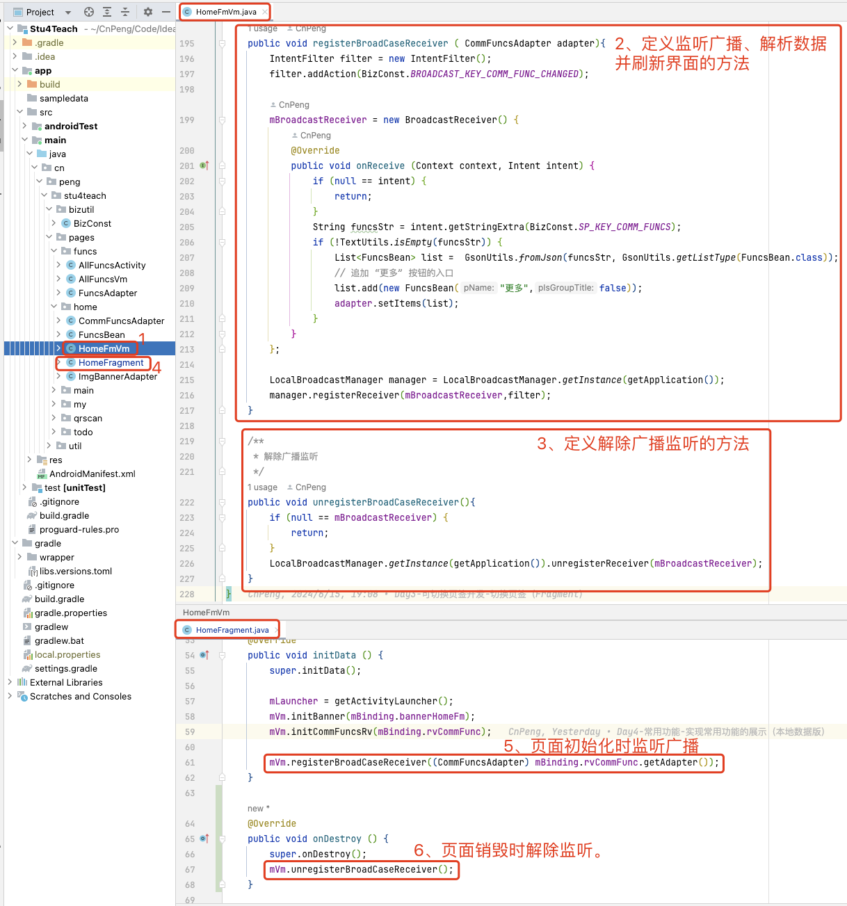

#### 1.1.6.2. 核心源码

* HomeFmVm.java 核心代码：

```java
/**
 * 监听本地广播
 */
public void registerBroadCaseReceiver ( CommFuncsAdapter adapter){
    IntentFilter filter = new IntentFilter();
    filter.addAction(BizConst.BROADCAST_KEY_COMM_FUNC_CHANGED);
    mBroadcastReceiver = new BroadcastReceiver() {
        @Override
        public void onReceive (Context context, Intent intent) {
            if (null == intent) {
                return;
            }
            String funcsStr = intent.getStringExtra(BizConst.SP_KEY_COMM_FUNCS);
            if (!TextUtils.isEmpty(funcsStr)) {
                List<FuncsBean> list =  GsonUtils.fromJson(funcsStr, GsonUtils.getListType(FuncsBean.class));
                // 追加 “更多” 按钮的入口
                list.add(new FuncsBean("更多",false));
                adapter.setItems(list);
            }
        }
    };
    LocalBroadcastManager manager = LocalBroadcastManager.getInstance(getApplication());
    manager.registerReceiver(mBroadcastReceiver,filter);
}

/**
 * 解除广播监听
 */
public void unregisterBroadCaseReceiver(){
    if (null == mBroadcastReceiver) {
        return;
    }
    LocalBroadcastManager.getInstance(getApplication()).unregisterReceiver(mBroadcastReceiver);
}
```


### 1.1.7. 补充知识

#### 1.1.7.1. 更多Rv知识

* 官方文档：[Reference:RecyclerView](https://developer.android.google.cn/reference/androidx/recyclerview/widget/RecyclerView?hl=en)

* 官方文档：[Libraries:RecyclerView](https://developer.android.google.cn/jetpack/androidx/releases/recyclerview?hl=en)

* 官方文档：[使用 RecyclerView 创建动态列表](https://developer.android.google.cn/develop/ui/views/layout/recyclerview?hl=zh-cn#java)

* 官方示例：[RecyclerView示例](https://github.com/android/views-widgets-samples/tree/main/RecyclerView/)

* 官方教程：[Android Kotlin 基础知识：RecyclerView 基础知识](https://developer.android.google.cn/codelabs/kotlin-android-training-recyclerview-fundamentals?continue=https%3A%2F%2Fdeveloper.android.google.cn%2Fcourses%2Fpathways%2Fandroid-development-with-kotlin-10%3Fhl%3Den%23codelab-https%3A%2F%2Fdeveloper.android.com%2Fcodelabs%2Fkotlin-android-training-recyclerview-fundamentals&hl=en#0)

#### 1.1.7.2. 相关三方库

* [BaseRecyclerViewAdapterHelper（简称BRVAH）](https://github.com/CymChad/BaseRecyclerViewAdapterHelper)：RvAdapter 帮助类库，简化 Adapter , 快速创建视图。[Gitee备用地址](https://gitee.com/CnPeng_1/BaseRecyclerViewAdapterHelper)

* [SmartRefreshLayout](https://github.com/scwang90/SmartRefreshLayout)：Rv 列表刷新和加载更多的工具库，简化了下拉刷新、上拉加载的实现逻辑，支持多种样式的刷新/加载提示图。[Gitee备用地址](https://gitee.com/CnPeng_1/SmartRefreshLayout)

## 1.2. 首页栏目列表开发

### 1.2.1. 列表数据呈现

#### 1.2.1.1. 展示效果

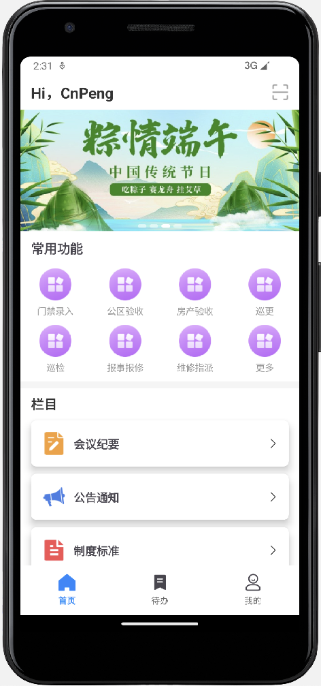


#### 1.2.1.2. 核心源码截图分析

* Fm、Vm、Adapter、Fm布局文件：

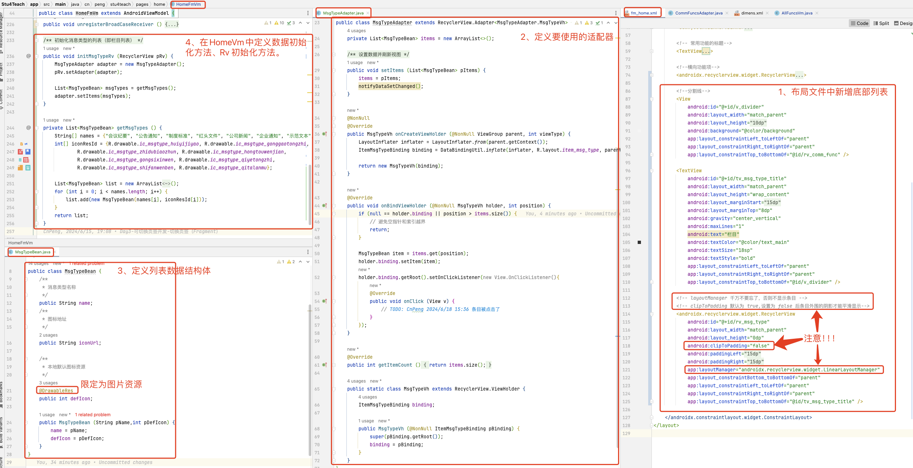

* 条目布局：

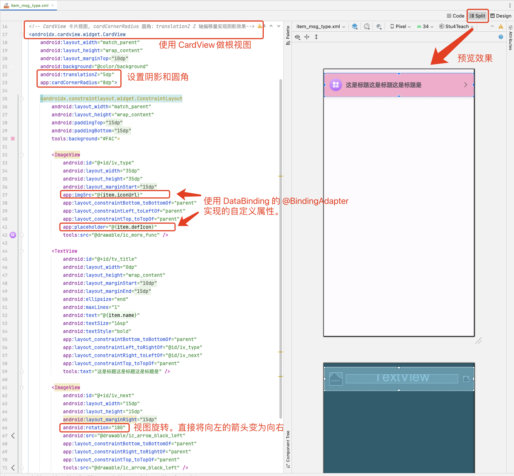

#### 1.2.1.3. 核心源码


##### 1.2.1.3.1. fm_home.xml

```xml
<?xml version="1.0" encoding="utf-8"?>

<layout
    xmlns:android="http://schemas.android.com/apk/res/android"
    xmlns:app="http://schemas.android.com/apk/res-auto"
    xmlns:tools="http://schemas.android.com/tools">

    <data>

        <import type="cn.peng.stu4teach.R" />

        <variable
            name="vm"
            type="cn.peng.stu4teach.pages.home.HomeFmVm" />

    </data>

    <androidx.constraintlayout.widget.ConstraintLayout
        android:layout_width="match_parent"
        android:layout_height="match_parent"
        android:background="@color/white"
        tools:context=".pages.home.HomeFragment">

        <TextView
            android:id="@+id/tv_title"
            android:layout_width="match_parent"
            android:layout_height="50dp"
            android:background="@color/white"
            android:gravity="center_vertical"
            android:paddingStart="@dimen/dp15"
            android:text="@{`Hi，`+vm.userName}"
            android:textColor="@color/text_main"
            android:textSize="@dimen/text_size_max"
            android:textStyle="bold"
            app:layout_constraintStart_toStartOf="parent"
            app:layout_constraintTop_toTopOf="parent"
            tools:text="Hi，张三" />

        <ImageView
            android:layout_width="25dp"
            android:layout_height="25dp"
            android:layout_marginEnd="@dimen/dp15"
            android:onClick="@{()->vm.onQrClick(context)}"
            android:src="@drawable/ic_scan"
            app:layout_constraintBottom_toBottomOf="@id/tv_title"
            app:layout_constraintEnd_toEndOf="parent"
            app:layout_constraintTop_toTopOf="@id/tv_title" />

        <com.youth.banner.Banner
            android:id="@+id/banner_home_fm"
            android:layout_width="match_parent"
            android:layout_height="@dimen/bannerH"
            app:layout_constraintLeft_toLeftOf="parent"
            app:layout_constraintRight_toRightOf="parent"
            app:layout_constraintTop_toBottomOf="@id/tv_title"
            tools:background="#FFA" />

        <!-- 常用功能的标题-->
        <TextView
            android:id="@+id/tv_comm_func_title"
            android:layout_width="match_parent"
            android:layout_height="wrap_content"
            android:paddingStart="@dimen/dp15"
            android:paddingTop="@dimen/dp10"
            android:paddingBottom="10dp"
            android:text="常用功能"
            android:textSize="18sp"
            android:textStyle="bold"
            app:layout_constraintLeft_toLeftOf="parent"
            app:layout_constraintRight_toRightOf="parent"
            app:layout_constraintTop_toBottomOf="@id/banner_home_fm" />

        <!--横向功能项-->
        <androidx.recyclerview.widget.RecyclerView
            android:id="@+id/rv_comm_func"
            android:layout_width="match_parent"
            android:layout_height="wrap_content"
            android:background="@color/white"
            android:paddingBottom="5dp"
            app:layoutManager="androidx.recyclerview.widget.GridLayoutManager"
            app:layout_constraintLeft_toLeftOf="parent"
            app:layout_constraintRight_toRightOf="parent"
            app:layout_constraintTop_toBottomOf="@id/tv_comm_func_title"
            app:spanCount="4" />

        <!--分割线-->
        <View
            android:id="@+id/v_divider"
            android:layout_width="match_parent"
            android:layout_height="@dimen/dp10"
            android:background="@color/background"
            app:layout_constraintLeft_toLeftOf="parent"
            app:layout_constraintRight_toRightOf="parent"
            app:layout_constraintTop_toBottomOf="@id/rv_comm_func" />

        <TextView
            android:id="@+id/tv_msg_type_title"
            android:layout_width="match_parent"
            android:layout_height="wrap_content"
            android:layout_marginStart="@dimen/dp15"
            android:layout_marginTop="8dp"
            android:gravity="center_vertical"
            android:maxLines="1"
            android:text="栏目"
            android:textColor="@color/text_main"
            android:textSize="18sp"
            android:textStyle="bold"
            app:layout_constraintLeft_toLeftOf="parent"
            app:layout_constraintRight_toRightOf="parent"
            app:layout_constraintTop_toBottomOf="@id/v_divider" />

        <!-- layoutManager 千万不要忘了，否则不显示条目 -->
        <!-- clipToPadding 默认为 true,设置为 false 后条目外围的阴影才能平滑显示-->
        <androidx.recyclerview.widget.RecyclerView
            android:id="@+id/rv_msg_type"
            android:layout_width="match_parent"
            android:layout_height="0dp"
            android:clipToPadding="false"
            android:paddingLeft="@dimen/dp15"
            android:paddingRight="@dimen/dp15"
            app:layoutManager="androidx.recyclerview.widget.LinearLayoutManager"
            app:layout_constraintBottom_toBottomOf="parent"
            app:layout_constraintLeft_toLeftOf="parent"
            app:layout_constraintRight_toRightOf="parent"
            app:layout_constraintTop_toBottomOf="@id/tv_msg_type_title" />

    </androidx.constraintlayout.widget.ConstraintLayout>
</layout>

```


##### 1.2.1.3.2. MsgTypeAdaoter.java

```java
package cn.peng.stu4teach.pages.home.adapter;

import android.content.Context;
import android.view.LayoutInflater;
import android.view.View;
import android.view.ViewGroup;

import androidx.annotation.NonNull;
import androidx.databinding.DataBindingUtil;
import androidx.recyclerview.widget.RecyclerView;


import java.util.ArrayList;
import java.util.List;

import cn.peng.stu4teach.R;
import cn.peng.stu4teach.databinding.ItemMsgTypeBinding;
import cn.peng.stu4teach.pages.home.bean.MsgTypeBean;

/**
 * 功用：消息类型 列表使用的适配器
 */
public class MsgTypeAdapter extends RecyclerView.Adapter<MsgTypeAdapter.MsgTypeVh> {
    private List<MsgTypeBean> items = new ArrayList<>();

    /**
     * 设置数据并刷新视图
     */
    public void setItems (List<MsgTypeBean> pItems) {
        items = pItems;
        notifyDataSetChanged();
    }

    @NonNull
    @Override
    public MsgTypeVh onCreateViewHolder (@NonNull ViewGroup parent, int viewType) {
        LayoutInflater inflater = LayoutInflater.from(parent.getContext());
        ItemMsgTypeBinding binding = DataBindingUtil.inflate(inflater, R.layout.item_msg_type, parent, false);

        return new MsgTypeVh(binding);
    }

    @Override
    public void onBindViewHolder (@NonNull MsgTypeVh holder, int position) {
        if (null == holder.binding || position > items.size()) {
            // 避免空指针和索引越界
            return;
        }

        MsgTypeBean item = items.get(position);
        holder.binding.setItem(item);
        holder.binding.getRoot().setOnClickListener(new View.OnClickListener(){
            @Override
            public void onClick (View v) {
                // TODO: CnPeng 2024/6/18 15:36 条目被点击了
            }
        });
    }

    @Override
    public int getItemCount () {
        return items.size();
    }

    public static class MsgTypeVh extends RecyclerView.ViewHolder {
        ItemMsgTypeBinding binding;

        public MsgTypeVh (@NonNull ItemMsgTypeBinding pBinding) {
            super(pBinding.getRoot());
            binding = pBinding;
        }
    }
}
```

##### 1.2.1.3.3. MsgTypeBean.java

```java
package cn.peng.stu4teach.pages.home.bean;

import androidx.annotation.DrawableRes;

/**
 * 消息类型bean
 */
public class MsgTypeBean {
    /**
     * 消息类型名称
     */
    public String name;
    /**
     * 图标地址
     */
    public String iconUrl;

    /**
     * 本地默认图标资源
     */
    @DrawableRes
    public int defIcon;

    public MsgTypeBean (String pName,int pDefIcon) {
        name = pName;
        defIcon = pDefIcon;
    }
}
```

##### 1.2.1.3.4. HomeFmVm.java（部分）

```java
  /**
     * 初始化消息类型的列表（即栏目列表）
     */
    public void initMsgTypeRv (RecyclerView pRv) {
        MsgTypeAdapter adapter = new MsgTypeAdapter();
        pRv.setAdapter(adapter);

        List<MsgTypeBean> msgTypes = getMsgTypes();
        adapter.setItems(msgTypes);
    }

    private List<MsgTypeBean> getMsgTypes () {
        String[] names = {"会议纪要", "公告通知", "制度标准", "红头文件", "公司新闻", "企业通知", "示范文本", "其他"};
        int[] iconResId = {R.drawable.ic_msgtype_huiyijiyao, R.drawable.ic_msgtype_gonggaotongzhi,
                R.drawable.ic_msgtype_zhidubiaozhun, R.drawable.ic_msgtype_hongtouwenjian,
                R.drawable.ic_msgtype_gongsixinwen, R.drawable.ic_msgtype_qiyetongzhi,
                R.drawable.ic_msgtype_shifanwenben, R.drawable.ic_msgtype_qitalanmu};

        List<MsgTypeBean> list = new ArrayList<MsgTypeBean>();
        for (int i = 0; i < names.length; i++) {
            list.add(new MsgTypeBean(names[i], iconResId[i]));
        }
        return list;
    }
```

##### 1.2.1.3.5. item_msg_type.xml

```java
<?xml version="1.0" encoding="utf-8"?>
<layout
    xmlns:android="http://schemas.android.com/apk/res/android"
    xmlns:app="http://schemas.android.com/apk/res-auto"
    xmlns:tools="http://schemas.android.com/tools">

    <data>

        <import type="cn.peng.stu4teach.R" />

        <variable
            name="item"
            type="cn.peng.stu4teach.pages.home.bean.MsgTypeBean" />
    </data>

    <!-- CardView 卡片视图, cardCornerRadius 圆角；translationZ Z 轴偏移量实现阴影效果-->
    <androidx.cardview.widget.CardView
        android:layout_width="match_parent"
        android:layout_height="wrap_content"
        android:layout_marginTop="@dimen/dp10"
        android:background="@color/background"
        android:translationZ="5dp"
        app:cardCornerRadius="8dp">

        <androidx.constraintlayout.widget.ConstraintLayout
            android:layout_width="match_parent"
            android:layout_height="wrap_content"
            android:paddingTop="@dimen/dp15"
            android:paddingBottom="@dimen/dp15"
            tools:background="#FAC">

            <ImageView
                android:id="@+id/iv_type"
                android:layout_width="35dp"
                android:layout_height="35dp"
                android:layout_marginStart="@dimen/dp15"
                app:imgSrc="@{item.iconUrl}"
                app:layout_constraintBottom_toBottomOf="parent"
                app:layout_constraintLeft_toLeftOf="parent"
                app:layout_constraintTop_toTopOf="parent"
                app:placeholder="@{item.defIcon}"
                tools:src="@drawable/ic_more_func" />

            <TextView
                android:id="@+id/tv_title"
                android:layout_width="0dp"
                android:layout_height="wrap_content"
                android:layout_marginStart="@dimen/dp10"
                android:layout_marginEnd="@dimen/dp15"
                android:ellipsize="end"
                android:maxLines="1"
                android:text="@{item.name}"
                android:textSize="16sp"
                android:textStyle="bold"
                app:layout_constraintBottom_toBottomOf="parent"
                app:layout_constraintLeft_toRightOf="@id/iv_type"
                app:layout_constraintRight_toLeftOf="@id/iv_next"
                app:layout_constraintTop_toTopOf="parent"
                tools:text="这是标题这是标题这是标题是" />

            <ImageView
                android:id="@+id/iv_next"
                android:layout_width="15dp"
                android:layout_height="15dp"
                android:layout_marginRight="@dimen/dp15"
                android:rotation="180"
                android:src="@drawable/ic_arrow_black_left"
                app:layout_constraintBottom_toBottomOf="parent"
                app:layout_constraintRight_toRightOf="parent"
                app:layout_constraintTop_toTopOf="parent"
                tools:src="@drawable/ic_arrow_black_left" />

        </androidx.constraintlayout.widget.ConstraintLayout>
    </androidx.cardview.widget.CardView>
</layout>
```


### 1.2.2. 实现界面整体滚动

在上一节实心完成后，只有滚动的栏目会在狭小的范围内滚动，但我们希望实现整个列表同步滚动。

这就需要使用到 [NestedScrollView](https://developer.android.google.cn/reference/androidx/core/widget/NestedScrollView?hl=en) 了。

#### 1.2.2.1. 核心代码截图解析

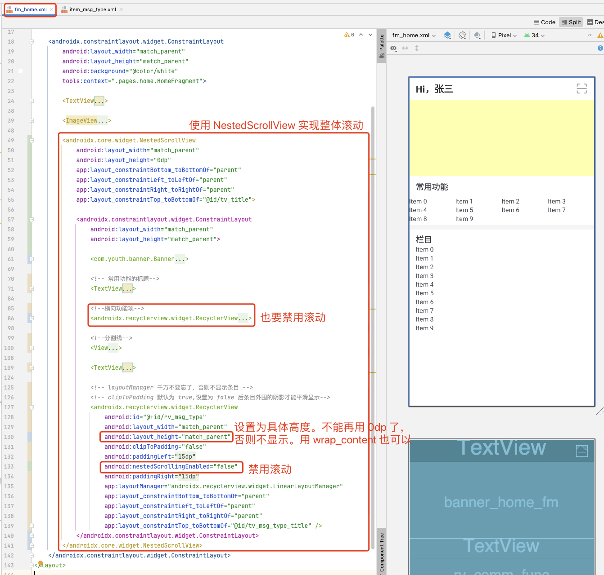

#### 1.2.2.2. 核心代码

* fm_home.xml

```xml
<?xml version="1.0" encoding="utf-8"?>

<layout
    xmlns:android="http://schemas.android.com/apk/res/android"
    xmlns:app="http://schemas.android.com/apk/res-auto"
    xmlns:tools="http://schemas.android.com/tools">

    <data>

        <import type="cn.peng.stu4teach.R" />

        <variable
            name="vm"
            type="cn.peng.stu4teach.pages.home.HomeFmVm" />

    </data>

    <androidx.constraintlayout.widget.ConstraintLayout
        android:layout_width="match_parent"
        android:layout_height="match_parent"
        android:background="@color/white"
        tools:context=".pages.home.HomeFragment">

        <TextView
            android:id="@+id/tv_title"
            android:layout_width="match_parent"
            android:layout_height="50dp"
            android:background="@color/white"
            android:gravity="center_vertical"
            android:paddingStart="@dimen/dp15"
            android:text="@{`Hi，`+vm.userName}"
            android:textColor="@color/text_main"
            android:textSize="@dimen/text_size_max"
            android:textStyle="bold"
            app:layout_constraintStart_toStartOf="parent"
            app:layout_constraintTop_toTopOf="parent"
            tools:text="Hi，张三" />

        <ImageView
            android:layout_width="25dp"
            android:layout_height="25dp"
            android:layout_marginEnd="@dimen/dp15"
            android:onClick="@{()->vm.onQrClick(context)}"
            android:src="@drawable/ic_scan"
            app:layout_constraintBottom_toBottomOf="@id/tv_title"
            app:layout_constraintEnd_toEndOf="parent"
            app:layout_constraintTop_toTopOf="@id/tv_title" />

        <androidx.core.widget.NestedScrollView
            android:layout_width="match_parent"
            android:layout_height="0dp"
            app:layout_constraintBottom_toBottomOf="parent"
            app:layout_constraintLeft_toLeftOf="parent"
            app:layout_constraintRight_toRightOf="parent"
            app:layout_constraintTop_toBottomOf="@id/tv_title">

            <androidx.constraintlayout.widget.ConstraintLayout
                android:layout_width="match_parent"
                android:layout_height="match_parent">

                <com.youth.banner.Banner
                    android:id="@+id/banner_home_fm"
                    android:layout_width="match_parent"
                    android:layout_height="@dimen/bannerH"
                    app:layout_constraintLeft_toLeftOf="parent"
                    app:layout_constraintRight_toRightOf="parent"
                    app:layout_constraintTop_toTopOf="parent"
                    tools:background="#FFA" />

                <!-- 常用功能的标题-->
                <TextView
                    android:id="@+id/tv_comm_func_title"
                    android:layout_width="match_parent"
                    android:layout_height="wrap_content"
                    android:paddingStart="@dimen/dp15"
                    android:paddingTop="@dimen/dp10"
                    android:paddingBottom="10dp"
                    android:text="常用功能"
                    android:textSize="18sp"
                    android:textStyle="bold"
                    app:layout_constraintLeft_toLeftOf="parent"
                    app:layout_constraintRight_toRightOf="parent"
                    app:layout_constraintTop_toBottomOf="@id/banner_home_fm" />

                <!--横向功能项-->
                <androidx.recyclerview.widget.RecyclerView
                    android:id="@+id/rv_comm_func"
                    android:layout_width="match_parent"
                    android:layout_height="wrap_content"
                    android:background="@color/white"
                    android:paddingBottom="5dp"
                    android:nestedScrollingEnabled="false"
                    app:layoutManager="androidx.recyclerview.widget.GridLayoutManager"
                    app:layout_constraintLeft_toLeftOf="parent"
                    app:layout_constraintRight_toRightOf="parent"
                    app:layout_constraintTop_toBottomOf="@id/tv_comm_func_title"
                    app:spanCount="4" />

                <!--分割线-->
                <View
                    android:id="@+id/v_divider"
                    android:layout_width="match_parent"
                    android:layout_height="@dimen/dp10"
                    android:background="@color/background"
                    app:layout_constraintLeft_toLeftOf="parent"
                    app:layout_constraintRight_toRightOf="parent"
                    app:layout_constraintTop_toBottomOf="@id/rv_comm_func" />

                <TextView
                    android:id="@+id/tv_msg_type_title"
                    android:layout_width="match_parent"
                    android:layout_height="wrap_content"
                    android:layout_marginStart="@dimen/dp15"
                    android:layout_marginTop="8dp"
                    android:gravity="center_vertical"
                    android:maxLines="1"
                    android:text="栏目"
                    android:textColor="@color/text_main"
                    android:textSize="18sp"
                    android:textStyle="bold"
                    app:layout_constraintLeft_toLeftOf="parent"
                    app:layout_constraintRight_toRightOf="parent"
                    app:layout_constraintTop_toBottomOf="@id/v_divider" />

                <!-- layoutManager 千万不要忘了，否则不显示条目 -->
                <!-- clipToPadding 默认为 true,设置为 false 后条目外围的阴影才能平滑显示-->
                <androidx.recyclerview.widget.RecyclerView
                    android:id="@+id/rv_msg_type"
                    android:layout_width="match_parent"
                    android:layout_height="match_parent"
                    android:clipToPadding="false"
                    android:paddingLeft="@dimen/dp15"
                    android:nestedScrollingEnabled="false"
                    android:paddingRight="@dimen/dp15"
                    app:layoutManager="androidx.recyclerview.widget.LinearLayoutManager"
                    app:layout_constraintBottom_toBottomOf="parent"
                    app:layout_constraintLeft_toLeftOf="parent"
                    app:layout_constraintRight_toRightOf="parent"
                    app:layout_constraintTop_toBottomOf="@id/tv_msg_type_title" />
            </androidx.constraintlayout.widget.ConstraintLayout>
        </androidx.core.widget.NestedScrollView>
    </androidx.constraintlayout.widget.ConstraintLayout>
</layout>

```

### 1.2.3. 解决底部内容被遮挡的问题

在 HomFmVm 中我们明明添加了 8 条数据，最后一条是“其他”，但我们将页面滚动到底部之后，并没有看到它。

—— 它其实被 BottomNavigationView 遮挡了。

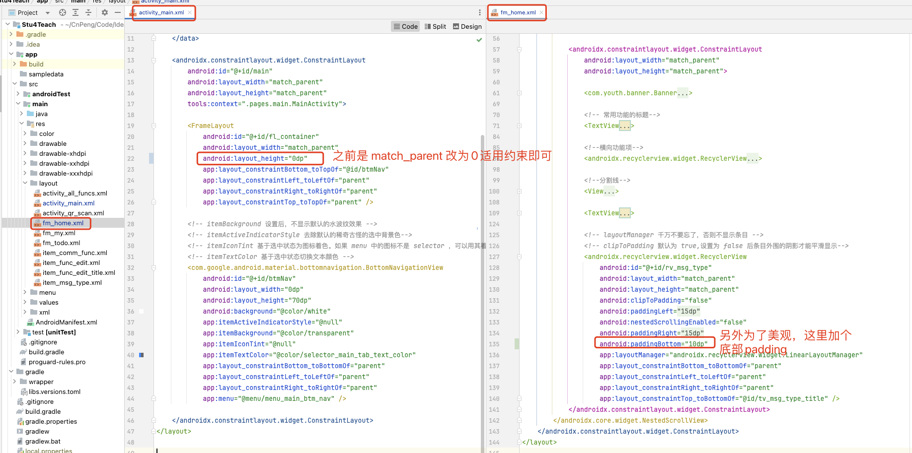


### 1.2.4. 使用WebView呈现H5内容

当前大环境下，出于降低开发成本、缩短开发周期、提升发版效率等原因的考虑，大多数 App 都会使用 H5 来呈现一部分内容。

Android 中呈现 H5 就需要使用 [WebView](https://developer.android.google.cn/reference/android/webkit/WebView?hl=en).

* 官方文档：[在WebView中开发Web应用](https://developer.android.google.cn/develop/ui/views/layout/webapps/webview?hl=zh-cn#groovy)

* [官方示例：WebView](https://github.com/android/views-widgets-samples/tree/main/WebView)


#### 1.2.4.1. 效果预览

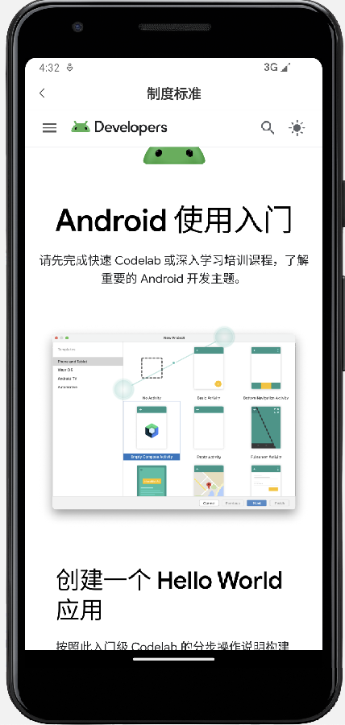


#### 1.2.4.2. 包装WebViewActivity 

定义在 `util/webview` 目录下：

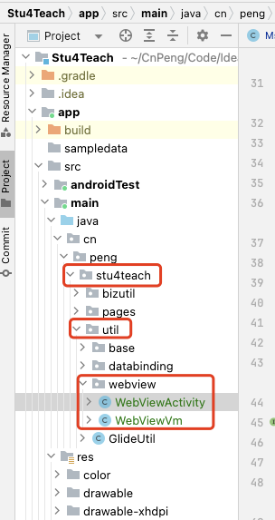

##### 1.2.4.2.1. WebViewActivity.java

注意：`WebViewVm.java` 中暂时没有定义内容， 其实 `WebViewActivity.java` 中的部分内容是可以抽取到 `WebViewVm.java`  中的。

```java
package cn.peng.stu4teach.util.webview;

import android.content.Context;
import android.content.Intent;
import android.text.TextUtils;
import android.view.View;
import android.webkit.WebResourceRequest;
import android.webkit.WebSettings;
import android.webkit.WebView;
import android.webkit.WebViewClient;

import androidx.activity.OnBackPressedCallback;
import androidx.annotation.NonNull;
import androidx.databinding.library.baseAdapters.BR;
import androidx.lifecycle.ViewModelProvider;

import cn.peng.stu4teach.R;
import cn.peng.stu4teach.databinding.ActivityWebViewBinding;
import cn.peng.stu4teach.util.base.BaseActivity;

/**
 * WebView 界面
 */
public class WebViewActivity extends BaseActivity<ActivityWebViewBinding, WebViewVm> {
    private static final String KEY_TITLE = "key_webview_title";
    private static final String KEY_URL   = "key_webview_url";

    /**
     * 要跳转的url地址
     */
    private String mUrl;
    private OnBackPressedCallback mBackPressedCallback;

    /**
     * 打开该页面
     */
    public static void start (Context pCtx, String pTitle, String pUrl) {
        Intent intent = new Intent(pCtx, WebViewActivity.class);
        intent.putExtra(KEY_TITLE, pTitle);
        intent.putExtra(KEY_URL, pUrl);
        pCtx.startActivity(intent);
    }

    @Override
    public int setLayoutId () {
        return R.layout.activity_web_view;
    }

    @Override
    public int setBrVmId () {
        return BR.vm;
    }

    @Override
    public WebViewVm setBrVm () {
        return new ViewModelProvider(this).get(WebViewVm.class);
    }

    @Override
    public void initData () {
        super.initData();

        getDataFromIntent();

        initWebView();
        // 确保清单文件中添加了 <uses-permission android:name="android.permission.INTERNET" />
        mBinding.webview.loadUrl(mUrl);

        initClickListener();
    }


    private void initWebView () {
        // 启用js支持，虽然启用后能获取更多功能支持，但同时也会有 XSS 攻击风险
        // XSS 攻击介绍：https://cloud.tencent.com/developer/article/1612474
        WebSettings webSettings = mBinding.webview.getSettings();
        webSettings.setJavaScriptEnabled(true);
        webSettings.setMixedContentMode(WebSettings.MIXED_CONTENT_ALWAYS_ALLOW);

        // 当用户点击了网页中的子页面是，判断是否需要调用系统浏览器打开子页面
        mBinding.webview.setWebViewClient(new WebViewClient() {
            @Override
            public boolean shouldOverrideUrlLoading (WebView view, WebResourceRequest request) {
                // 直接 return false; 表示所有页面都在当前 webview 中展示。
                return false;
                //if ("www.baidu.com".equals(request.getUrl().getHost())) {
                //    // 如果是我们自己的网站，不需要使用系统浏览器打开。
                //    return false;
                //}
                //
                //// 其他网站，使用系统浏览器打开
                //Intent intent = new Intent(Intent.ACTION_VIEW, request.getUrl());
                //startActivity(intent);
                //return true;
            }
        });

        mBackPressedCallback = getOnBackPressedCallback();
        // 现在使用这种方式处理 “返回” 事件。不再使用 onBackPressed() 了
        getOnBackPressedDispatcher().addCallback(mBackPressedCallback);
    }

    /**
     * 获取手机系统返回事件的回调
     */
    @NonNull
    private OnBackPressedCallback getOnBackPressedCallback () {
        return new OnBackPressedCallback(true) {
            @Override
            public void handleOnBackPressed () {
                if (mBinding.webview.canGoBack()) {
                    mBinding.webview.goBack();
                }
            }
        };
    }

    /**
     * 初始化点击事件
     */
    private void initClickListener () {
        mBinding.ivBack.setOnClickListener(new View.OnClickListener() {
            @Override
            public void onClick (View v) {
                if (mBinding.webview.canGoBack()) {
                    mBinding.webview.goBack();
                }
            }
        });
    }

    /**
     * 从 intent 中读取数据
     */
    private void getDataFromIntent () {
        Intent intent = getIntent();
        if (null == intent) {
            return;
        }
        String title = intent.getStringExtra(KEY_TITLE);
        if (!TextUtils.isEmpty(title)) {
            mBinding.setTitle(title);
        }

        mUrl = intent.getStringExtra(KEY_URL);
    }

    @Override
    protected void onDestroy () {
        super.onDestroy();
        mBackPressedCallback.remove();
    }
}
```

##### 1.2.4.2.2. activity_web_view.xml

```java
<?xml version="1.0" encoding="utf-8"?>

<layout
    xmlns:android="http://schemas.android.com/apk/res/android"
    xmlns:app="http://schemas.android.com/apk/res-auto"
    xmlns:tools="http://schemas.android.com/tools">

    <data>
        <variable
            name="title"
            type="String" />

    </data>

    <androidx.constraintlayout.widget.ConstraintLayout
        android:id="@+id/main"
        android:layout_width="match_parent"
        android:layout_height="match_parent"
        android:background="@color/white"
        tools:context=".util.webview.WebViewActivity">

        <ImageView
            android:id="@+id/iv_back"
            android:layout_width="44dp"
            android:layout_height="44dp"
            android:padding="15dp"
            android:src="@drawable/ic_arrow_black_left"
            app:layout_constraintLeft_toLeftOf="parent"
            app:layout_constraintTop_toTopOf="parent" />

        <TextView
            android:id="@+id/tv_title"
            android:layout_width="0dp"
            android:layout_height="44dp"
            android:layout_marginLeft="44dp"
            android:layout_marginRight="44dp"
            android:ellipsize="end"
            android:gravity="center"
            android:maxLines="1"
            android:text="@{title}"
            android:textColor="#333"
            android:textSize="18sp"
            android:textStyle="bold"
            app:layout_constraintLeft_toLeftOf="parent"
            app:layout_constraintRight_toRightOf="parent"
            app:layout_constraintTop_toTopOf="parent"
            tools:text="这是标题这是标题这是标题这是标题这是标题" />

        <View
            android:id="@+id/iv_divider"
            android:layout_width="match_parent"
            android:layout_height="1px"
            android:background="@color/background"
            app:layout_constraintLeft_toLeftOf="parent"
            app:layout_constraintTop_toBottomOf="@id/tv_title"
            tools:background="#F00" />

        <WebView
            android:id="@+id/webview"
            android:layout_width="match_parent"
            android:layout_height="0dp"
            app:layout_constraintBottom_toBottomOf="parent"
            app:layout_constraintLeft_toLeftOf="parent"
            app:layout_constraintRight_toRightOf="parent"
            app:layout_constraintTop_toBottomOf="@id/iv_divider" />

    </androidx.constraintlayout.widget.ConstraintLayout>
</layout>
```

##### 1.2.4.2.3. 打开WebViewActivity

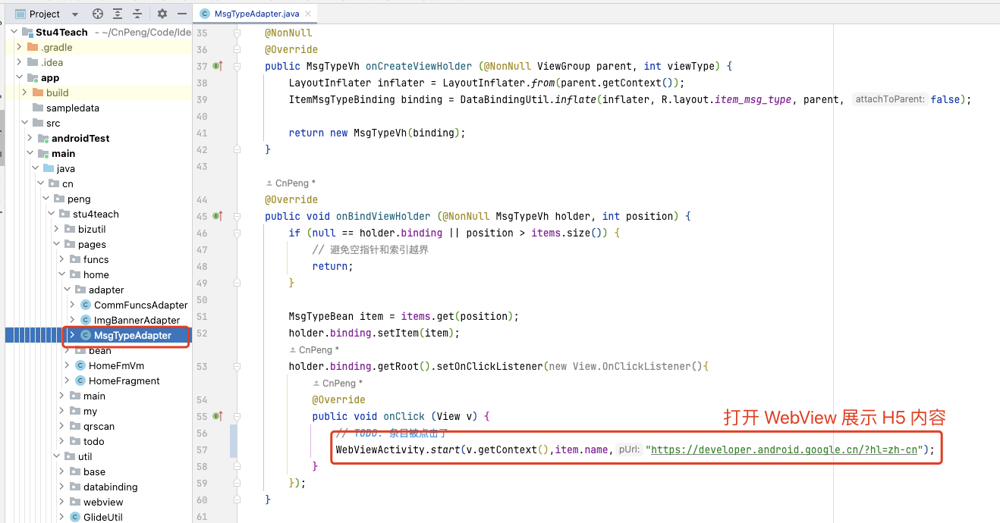

```java
 WebViewActivity.start(v.getContext(),item.name,"https://developer.android.google.cn/?hl=zh-cn");
```


#### 1.2.4.3. 补充知识

##### 1.2.4.3.1. webSettings.setMixedContentMode

```java
WebSettings webSettings = mBinding.webview.getSettings();
webSettings.setMixedContentMode(WebSettings.MIXED_CONTENT_ALWAYS_ALLOW);
```

上述代码用于设置 WebView 如何处理混合内容（mixed content）。

混合内容通常指的是一个 **HTTPS 页面加载了 HTTP 资源（如图片、脚本等）。由于HTTPS是安全的，而HTTP不是，因此混合内容可能导致安全问题**。

`WebSettings.MIXED_CONTENT_ALWAYS_ALLOW` 是 `WebSettings` 类中的一个常量，表示 WebView 应该总是允许加载混合内容，而不考虑其来源。

具体来说，当我们为WebView设置：

```java
webSettings.setMixedContentMode(WebSettings.MIXED_CONTENT_ALWAYS_ALLOW);
```

这意味着：

* 如果 WebView 正在加载一个 HTTPS 页面，并且该页面试图加载 HTTP 资源， WebView 将不会阻止这些 HTTP 资源的加载。
* 这可能导致安全风险，因为恶意 HTTP 内容可能会被注入到 HTTPS 页面中。

除了 `MIXED_CONTENT_ALWAYS_ALLOW` 之外， `WebSettings` 还提供了其他几个选项来处理混合内容：

* `MIXED_CONTENT_COMPATIBILITY_MODE` :  这是默认值。它允许 HTTPS 页面加载 HTTP 图像和视频，但阻止加载其他 HTTP 资源。
* `MIXED_CONTENT_NEVER_ALLOW`： 这会阻止 HTTPS 页面加载任何 HTTP 资源。

通常，为了安全起见，最好避免使用 `MIXED_CONTENT_ALWAYS_ALLOW`，除非你有特定的理由并且了解可能的安全风险。

## 1.3. 网络框架封装

网络请求库：[okhttp](https://square.github.io/okhttp/)


### 1.3.1. 基础实现

基于 OkHttp + Handler 实现，需要先在 module 的 `build.gradle` 中导入 `implementation("com.squareup.okhttp3:okhttp:4.12.0")`

```java
package cn.peng.stu4teach.util.http;

import android.os.Handler;
import android.os.Looper;
import android.text.TextUtils;

import androidx.annotation.NonNull;

import java.io.IOException;
import java.util.Map;

import okhttp3.Call;
import okhttp3.Callback;
import okhttp3.MultipartBody;
import okhttp3.OkHttpClient;
import okhttp3.Request;
import okhttp3.Response;

/**
 * 基于 OkHttp3 实现的 网络请求工具类
 */
public class HttpUtils {

    /**
     * OkHttpClient 单例实例
     */
    private static final OkHttpClient CLIENT = new OkHttpClient.Builder().build();

    /**
     * 发起GET请求
     *
     * @param url      请求URL
     * @param callback 结果回调
     */
    public static void sendGetRequest (String url, final NetworkCallback callback) {
        Request request = new Request.Builder()
                                  .url(url)
                                  .build();

        CLIENT.newCall(request).enqueue(new Callback() {
            @Override
            public void onFailure (@NonNull Call pCall, @NonNull IOException pE) {
                handlerPost(null,pE.getMessage(), callback);
            }

            @Override
            public void onResponse (@NonNull Call pCall, @NonNull Response pResponse) throws IOException {
                if (!pResponse.isSuccessful()) {
                    handlerPost(null,"Unexpected code " + pResponse, callback);
                    return;
                }

                final String responseBody = pResponse.body().string();
                handlerPost(responseBody,"请求成功", callback);
            }
        });
    }

    /**
     * 发起POST请求
     *
     * @param url      请求URL
     * @param params   POST参数
     * @param callback 结果回调
     */
    public static void sendPostRequest (String url, final Map<String, String> params, final NetworkCallback callback) {
        MultipartBody.Builder builder = new MultipartBody.Builder().setType(MultipartBody.FORM);
        for (Map.Entry<String, String> entry : params.entrySet()) {
            builder.addFormDataPart(entry.getKey(), entry.getValue());
        }

        Request request = new Request.Builder()
                                  .url(url)
                                  .post(builder.build())
                                  .build();

        CLIENT.newCall(request).enqueue(new Callback() {
            @Override
            public void onFailure (@NonNull Call pCall, @NonNull IOException pE) {
                handlerPost(null,pE.getMessage(), callback);
            }

            @Override
            public void onResponse (@NonNull Call pCall, @NonNull Response pResponse) throws IOException {
                if (!pResponse.isSuccessful()) {
                    handlerPost(null,"Unexpected code " + pResponse, callback);
                    return;
                }

                final String responseBody = pResponse.body().string();
                handlerPost(responseBody, "请求成功",callback);
            }
        });
    }

    /**
     * 使用Handler处理UI线程的回调
     */
    private static void handlerPost (final String result, final String msg, @NonNull final NetworkCallback callback) {
        new Handler(Looper.getMainLooper()).post(new Runnable() {
            @Override
            public void run () {
                if (TextUtils.isEmpty(result)) {
                    callback.onError(msg);
                } else {
                    callback.onSuccess(result);
                }
            }
        });
    }

    // 网络请求回调接口
    public interface NetworkCallback {
        void onSuccess (String response);

        void onError (String errorMessage);
    }
}
```

### 1.3.2. 解析数据

将响应回来的字符串数据解析为具体的结构体对象或者是数组（集合）。

引入 Gson 库：`implementation 'com.google.code.gson:gson:2.10.1'`，实现将数据解析成 `JsonObject` 的操作，然后读取 `data` 字段后再解析为最终数据：

#### 1.3.2.1. BizHttpGsonRe.java 

```java
package cn.peng.stu4teach.bizutil.http;

import android.text.TextUtils;

import androidx.annotation.NonNull;

import com.blankj.utilcode.util.GsonUtils;
import com.blankj.utilcode.util.LogUtils;
import com.google.gson.JsonElement;
import com.google.gson.JsonObject;

import cn.peng.stu4teach.util.http.HttpUtils;

/**
 * 对象型响应数据
 */
public abstract class BizHttpGsonRe<T> implements HttpUtils.IHttpRe {
    private final Class<T> cls;

    public BizHttpGsonRe (Class<T> cls) {
        this.cls = cls;
    }

    /**
     * respone 的响应示例
     * {
     *     "data": {
     *         "curPage": 2,
     *         "datas": [
     *             {
     *                 "link": "https://peng.cn/post/7344571968174669876",
     *                 "niceShareDate": "2024-06-03 09:40",
     *                 "shareUser": "CnPeng",
     *                 "title": "全局视角下的APP性能优化经验",
     *             }
     *         ],
     *         "offset": 20,
     *         "over": false,
     *         "pageCount": 773,
     *         "size": 20,
     *         "total": 15452
     *     },
     *     "errorCode": 0,
     *     "errorMsg": ""
     * }
     */
    @Override
    public void onHttpReSuccess (@NonNull String response) {
        // 先转换成标准的 JsonObject,判断业务响应成功还是失败。
        JsonObject jsonObject = GsonUtils.fromJson(response, JsonObject.class);
        //LogUtils.d("BaseHttpRe", jsonObject.toString());
        JsonElement errorCode = jsonObject.get("errorCode");
        if (errorCode.getAsInt() != 0 ) {
            onError(jsonObject.get("errorMsg").getAsString());
            return;
        }

        // 读取 data 并解析为 cls 类型的数据
        JsonElement jsonElement = jsonObject.get("data");
        String dataStr = GsonUtils.toJson(jsonElement);
        if (TextUtils.isEmpty(dataStr)){
            onError("服务端响应数据有误——data为空");
            return;
        }
        T data = GsonUtils.fromJson(dataStr,cls);
        if (null != data) {
            onSuccess(data);
        } else {
            onError("解析data为结构体出错");
        }
    }

    @Override
    public void onHttpReError (String errorMessage) {
        onError(errorMessage);
    }

    protected abstract void onSuccess (@NonNull T pReData);

    protected abstract void onError (@NonNull String pErrMsg);
}

```

#### 1.3.2.2. TodoFmVm.java 

修改后的请求代码如下：

```java
package cn.peng.stu4teach.pages.todo;

import android.app.Application;
import android.util.Log;
import android.widget.TextView;

import androidx.annotation.NonNull;
import androidx.lifecycle.AndroidViewModel;

import com.blankj.utilcode.util.LogUtils;

import cn.peng.stu4teach.bizutil.http.BizHttpGsonRe;
import cn.peng.stu4teach.pages.todo.bean.TodoDataBean;
import cn.peng.stu4teach.util.http.HttpUtils;

/**
 * 功用：TodoFragment 中使用的 Vm
 */
public class TodoFmVm extends AndroidViewModel {
    /**
     * 数据页面，从0开始计数。
     * 不要与 TodoDataBean 中 curPage 弄混了，TodoDataBean 表示实际请求的是第几页数据，从1计数。
     */
    private int mCurPage = 0;

    public TodoFmVm (@NonNull Application application) {
        super(application);
    }


    public void httpGetTest (TextView pTvTitle) {
        String url = String.format("https://www.wanandroid.com/article/list/%d/json", mCurPage);
        HttpUtils.sendGetRequest(url, new BizHttpGsonRe<TodoDataBean>(TodoDataBean.class) {
            @Override
            protected void onSuccess (@NonNull TodoDataBean pReData) {
                LogUtils.d("NetworkUtils", "GET Success: ", pReData.curPage);
                pTvTitle.setText(pReData.datas[0].title);

                //如果还有数据，页码自增。
                if (!pReData.over) {
                    mCurPage++;
                }
            }

            @Override
            protected void onError (@NonNull String pErrMsg) {
                Log.d("NetworkUtils", "GET ERROR: " + pErrMsg);
            }
        });
    }
}

```

#### 1.3.2.3. TodoDataBean

响应数据中 `data` 节点的数据：


```java
package cn.peng.stu4teach.pages.todo.bean;

/**
 * TodoReBean 的下级数据
 */
public class TodoDataBean {
    /**
     * 当前页码(从1开始计数)
     */
    public int curPage;
    /**
     * 具体条目
     */
    public TodoItem[] datas;
    /**
     * 是否全部加载完了
     */
    public boolean over;
}
```

#### 1.3.2.4. TodoItem

最终的条目数据：

```java
package cn.peng.stu4teach.pages.todo.bean;

/**
 * 待办条目数据
 */
public class TodoItem {
    public String title;
    public String link;
    public String niceShareDate;
}

```


## 1.4. 待办列表


### 1.4.1. 列表数据呈现

#### 1.4.1.1. 核心代码截图解析

* 页面、页面布局文件、Vm

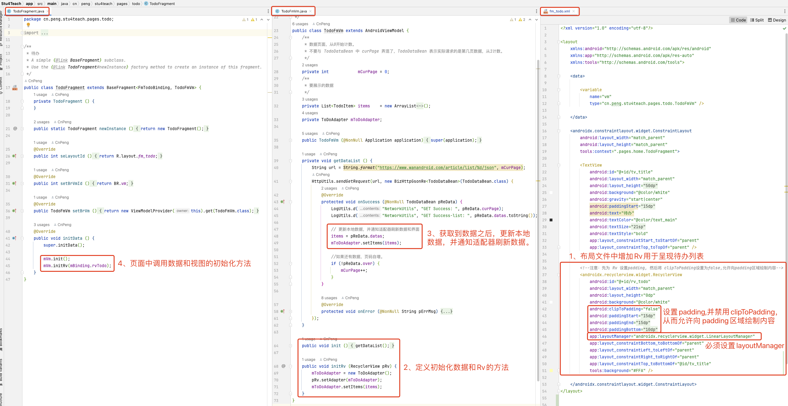

* 适配器和条目布局

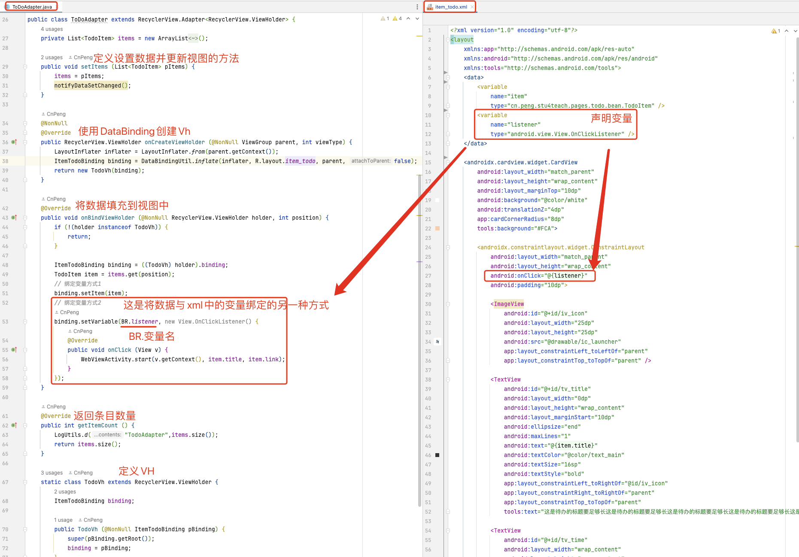

#### 1.4.1.2. 核心代码

##### 1.4.1.2.1. TodoFragment.java

```java
package cn.peng.stu4teach.pages.todo;

import android.view.View;

import androidx.databinding.library.baseAdapters.BR;
import androidx.lifecycle.ViewModelProvider;

import cn.peng.stu4teach.R;
import cn.peng.stu4teach.databinding.FmTodoBinding;
import cn.peng.stu4teach.util.base.BaseFragment;

/**
 * 待办
 * A simple {@link BaseFragment} subclass.
 * Use the {@link TodoFragment#newInstance} factory method to create an instance of this fragment.
 */
public class TodoFragment extends BaseFragment<FmTodoBinding, TodoFmVm> {
    private TodoFragment () {
    }

    public static TodoFragment newInstance () {
        return new TodoFragment();
    }

    @Override
    public int seLayoutId () {
        return R.layout.fm_todo;
    }

    @Override
    public int setBrVmId () {
        return BR.vm;
    }

    @Override
    public TodoFmVm setBrVm () {
        return new ViewModelProvider(this).get(TodoFmVm.class);
    }

    @Override
    public void initData () {
        super.initData();

        mVm.init();
        mVm.initRv(mBinding.rvTodo);
    }
}
```

##### 1.4.1.2.2. fm_todo.xml

```java
<?xml version="1.0" encoding="utf-8"?>

<layout
    xmlns:android="http://schemas.android.com/apk/res/android"
    xmlns:app="http://schemas.android.com/apk/res-auto"
    xmlns:tools="http://schemas.android.com/tools">

    <data>

        <variable
            name="vm"
            type="cn.peng.stu4teach.pages.todo.TodoFmVm" />

    </data>

    <androidx.constraintlayout.widget.ConstraintLayout
        android:layout_width="match_parent"
        android:layout_height="match_parent"
        tools:context=".pages.home.TodoFragment">

        <TextView
            android:id="@+id/tv_title"
            android:layout_width="match_parent"
            android:layout_height="@dimen/dp50"
            android:background="@color/white"
            android:gravity="start|center"
            android:paddingStart="@dimen/dp15"
            android:text="待办"
            android:textColor="@color/text_main"
            android:textSize="@dimen/text_size_max"
            android:textStyle="bold"
            app:layout_constraintStart_toStartOf="parent"
            app:layout_constraintTop_toTopOf="parent" />


        <!--注意：先为 Rv 设置padding, 然后将 clipToPadding设置为false,允许向padding区域绘制内容-->
        <androidx.recyclerview.widget.RecyclerView
            android:id="@+id/rv_todo"
            android:layout_width="match_parent"
            android:layout_height="0dp"
            android:background="@color/white"
            android:clipToPadding="false"
            android:paddingStart="@dimen/dp15"
            android:paddingEnd="@dimen/dp15"
            android:paddingBottom="@dimen/dp10"
            app:layoutManager="androidx.recyclerview.widget.LinearLayoutManager"
            app:layout_constraintBottom_toBottomOf="parent"
            app:layout_constraintLeft_toLeftOf="parent"
            app:layout_constraintRight_toRightOf="parent"
            app:layout_constraintTop_toBottomOf="@id/tv_title"
            tools:background="#FFA" />

    </androidx.constraintlayout.widget.ConstraintLayout>
</layout>
```


##### 1.4.1.2.3. TodoFmVm.java

```java
package cn.peng.stu4teach.pages.todo;

import android.app.Application;
import android.util.Log;

import androidx.annotation.NonNull;
import androidx.lifecycle.AndroidViewModel;
import androidx.recyclerview.widget.RecyclerView;

import com.blankj.utilcode.util.LogUtils;

import java.util.ArrayList;
import java.util.List;

import cn.peng.stu4teach.bizutil.http.BizHttpGsonRe;
import cn.peng.stu4teach.pages.todo.bean.TodoDataBean;
import cn.peng.stu4teach.pages.todo.bean.TodoItem;
import cn.peng.stu4teach.util.http.HttpUtils;

/**
 * 功用：TodoFragment 中使用的 Vm
 */
public class TodoFmVm extends AndroidViewModel {
    /**
     * 数据页面，从0开始计数。
     * 不要与 TodoDataBean 中 curPage 弄混了，TodoDataBean 表示实际请求的是第几页数据，从1计数。
     */
    private int            mCurPage = 0;
    /**
     * 要展示的数据
     */
    private List<TodoItem> items    = new ArrayList<TodoItem>();
    private ToDoAdapter mToDoAdapter;

    public TodoFmVm (@NonNull Application application) {
        super(application);
    }

    private void getDataList () {
        String url = String.format("https://www.wanandroid.com/article/list/%d/json", mCurPage);
        HttpUtils.sendGetRequest(url, new BizHttpGsonRe<TodoDataBean>(TodoDataBean.class) {
            @Override
            protected void onSuccess (@NonNull TodoDataBean pReData) {
                LogUtils.d("NetworkUtils", "GET Success: ", pReData.curPage);
                LogUtils.d("NetworkUtils", "GET Success-list: ", pReData.datas.toString());

                // 更新本地数据，并通知适配器刷新数据和界面
                items = pReData.datas;
                mToDoAdapter.setItems(items);

                //如果还有数据，页码自增。
                if (!pReData.over) {
                    mCurPage++;
                }
            }

            @Override
            protected void onError (@NonNull String pErrMsg) {
                Log.d("NetworkUtils", "GET ERROR: " + pErrMsg);
            }
        });
    }

    public void init () {
        getDataList();
    }

    public void initRv (RecyclerView pRv) {
        mToDoAdapter = new ToDoAdapter();
        pRv.setAdapter(mToDoAdapter);
        mToDoAdapter.setItems(items);
    }
}
```

##### 1.4.1.2.4. ToDoAdapter.java

```java
package cn.peng.stu4teach.pages.todo;

import android.util.Log;
import android.view.LayoutInflater;
import android.view.View;
import android.view.ViewGroup;

import androidx.annotation.NonNull;
import androidx.databinding.DataBindingUtil;
import androidx.recyclerview.widget.RecyclerView;

import com.blankj.utilcode.util.LogUtils;

import java.util.ArrayList;
import java.util.List;

import cn.peng.stu4teach.BR;
import cn.peng.stu4teach.R;
import cn.peng.stu4teach.databinding.ItemTodoBinding;
import cn.peng.stu4teach.pages.todo.bean.TodoItem;
import cn.peng.stu4teach.util.webview.WebViewActivity;

/**
 * 待办的适配器
 */
public class ToDoAdapter extends RecyclerView.Adapter<RecyclerView.ViewHolder> {
    private List<TodoItem> items = new ArrayList<TodoItem>();

    public void setItems (List<TodoItem> pItems) {
        items = pItems;
        notifyDataSetChanged();
    }

    @NonNull
    @Override
    public RecyclerView.ViewHolder onCreateViewHolder (@NonNull ViewGroup parent, int viewType) {
        LayoutInflater inflater = LayoutInflater.from(parent.getContext());
        ItemTodoBinding binding = DataBindingUtil.inflate(inflater, R.layout.item_todo, parent, false);
        return new TodoVh(binding);
    }

    @Override
    public void onBindViewHolder (@NonNull RecyclerView.ViewHolder holder, int position) {
        if (!(holder instanceof TodoVh)) {
            return;
        }

        ItemTodoBinding binding = ((TodoVh) holder).binding;
        TodoItem item = items.get(position);
        // 绑定变量方式1
        binding.setItem(item);
        // 绑定变量方式2
        binding.setVariable(BR.listener, new View.OnClickListener() {
            @Override
            public void onClick (View v) {
                WebViewActivity.start(v.getContext(), item.title, item.link);
            }
        });
    }

    @Override
    public int getItemCount () {
        LogUtils.d("TodoAdapter",items.size());
        return items.size();
    }

    static class TodoVh extends RecyclerView.ViewHolder {
        ItemTodoBinding binding;

        public TodoVh (@NonNull ItemTodoBinding pBinding) {
            super(pBinding.getRoot());
            binding = pBinding;
        }
    }
}
```

##### 1.4.1.2.5. item_todo.xml

```java
<?xml version="1.0" encoding="utf-8"?>
<layout
    xmlns:app="http://schemas.android.com/apk/res-auto"
    xmlns:android="http://schemas.android.com/apk/res/android"
    xmlns:tools="http://schemas.android.com/tools">

    <data>

        <variable
            name="item"
            type="cn.peng.stu4teach.pages.todo.bean.TodoItem" />

        <variable
            name="listener"
            type="android.view.View.OnClickListener" />
    </data>


    <androidx.cardview.widget.CardView
        android:layout_width="match_parent"
        android:layout_height="wrap_content"
        android:layout_marginTop="10dp"
        android:background="@color/white"
        android:translationZ="4dp"
        app:cardCornerRadius="8dp"
        tools:background="#FCA">

        <androidx.constraintlayout.widget.ConstraintLayout
            android:layout_width="match_parent"
            android:layout_height="wrap_content"
            android:onClick="@{listener}"
            android:padding="10dp">

            <ImageView
                android:id="@+id/iv_icon"
                android:layout_width="25dp"
                android:layout_height="25dp"
                android:src="@drawable/ic_launcher"
                app:layout_constraintLeft_toLeftOf="parent"
                app:layout_constraintTop_toTopOf="parent" />

            <TextView
                android:id="@+id/tv_title"
                android:layout_width="0dp"
                android:layout_height="wrap_content"
                android:layout_marginStart="10dp"
                android:ellipsize="end"
                android:maxLines="1"
                android:text="@{item.title}"
                android:textColor="@color/text_main"
                android:textSize="16sp"
                android:textStyle="bold"
                app:layout_constraintLeft_toRightOf="@id/iv_icon"
                app:layout_constraintRight_toRightOf="parent"
                app:layout_constraintTop_toTopOf="parent"
                tools:text="这是待办的标题要足够长这是待办的标题要足够长这是待办的标题要足够长这是待办的标题要足够长这是待办的标题要足够长" />

            <TextView
                android:id="@+id/tv_time"
                android:layout_width="wrap_content"
                android:layout_height="wrap_content"
                android:layout_marginTop="10dp"
                android:text="@{item.niceShareDate}"
                android:textColor="@color/text_hint"
                app:layout_constraintBottom_toBottomOf="parent"
                app:layout_constraintLeft_toLeftOf="@id/iv_icon"
                app:layout_constraintTop_toBottomOf="@id/iv_icon"
                tools:text="2024-06-20 16:24" />
        </androidx.constraintlayout.widget.ConstraintLayout>
    </androidx.cardview.widget.CardView>
</layout>
```

### 1.4.2. 刷新和加载

要想实现数据的下拉刷新（从界面顶部向下拉动以刷新数据）、上拉加载（从界面底部向上拉动以加载更多数据）有多种办法，我们这里选择集成 [SmartRefreshLayout](https://github.com/scwang90/SmartRefreshLayout) ([GitHub](https://github.com/scwang90/SmartRefreshLayout)、[Gitee](https://gitee.com/CnPeng_1/SmartRefreshLayout))快速实现。

#### 1.4.2.1. 添加依赖

按照该库的文档说明，在模块（module）的 `build.gradle` 文件中添加如下内容：

```gradle
implementation  'io.github.scwang90:refresh-layout-kernel:2.1.0'      //核心必须依赖
implementation  'io.github.scwang90:refresh-header-classics:2.1.0'    //经典刷新头
implementation  'io.github.scwang90:refresh-footer-classics:2.1.0'    //经典加载
```

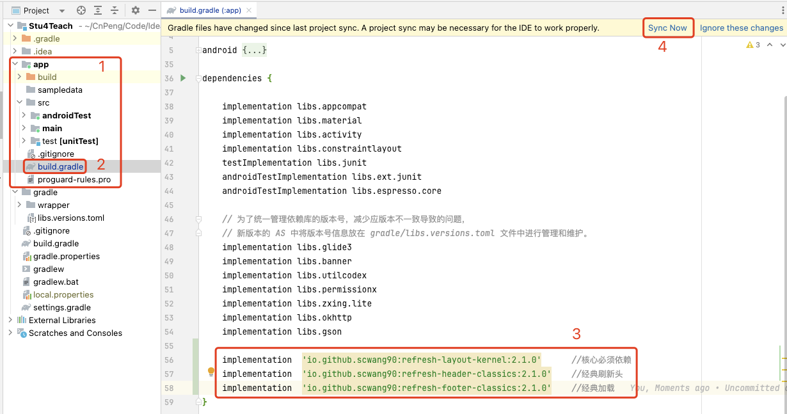

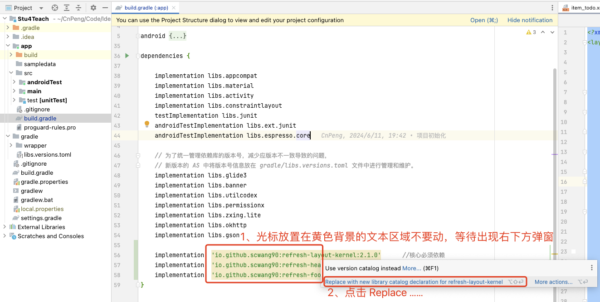

然后在 `gradle.properties` 中添加如下内容：

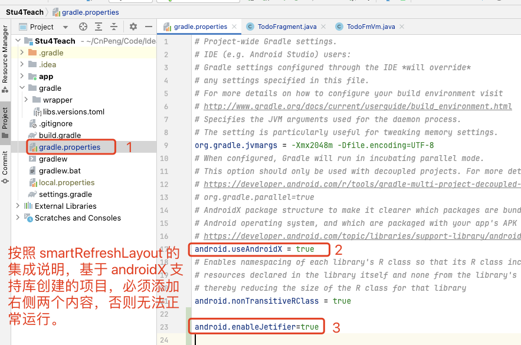


#### 1.4.2.2. 核心源码截图解析

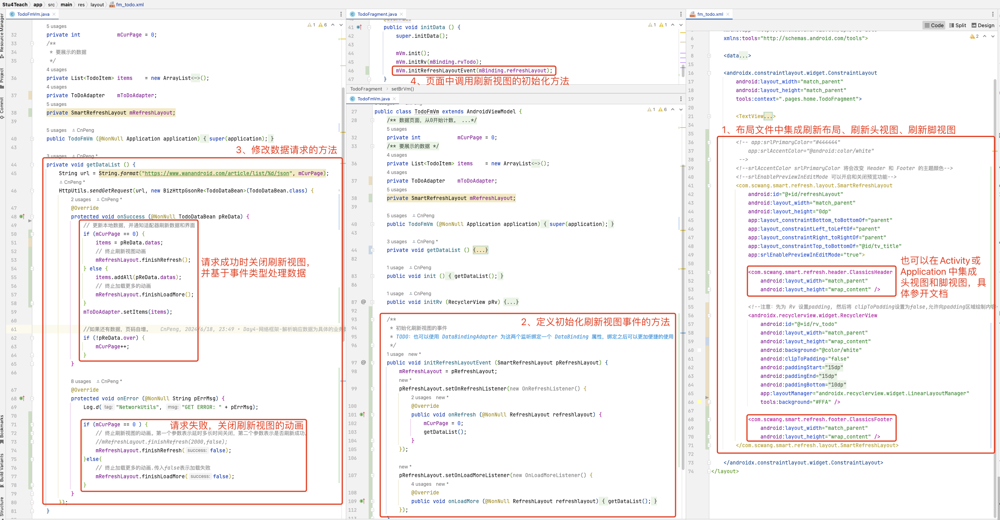


#### 1.4.2.3. 核心源码

##### 1.4.2.3.1. fm_todo.xml

```xml
<?xml version="1.0" encoding="utf-8"?>

<layout
    xmlns:android="http://schemas.android.com/apk/res/android"
    xmlns:app="http://schemas.android.com/apk/res-auto"
    xmlns:tools="http://schemas.android.com/tools">

    <data>

        <variable
            name="vm"
            type="cn.peng.stu4teach.pages.todo.TodoFmVm" />

    </data>

    <androidx.constraintlayout.widget.ConstraintLayout
        android:layout_width="match_parent"
        android:layout_height="match_parent"
        tools:context=".pages.home.TodoFragment">

        <TextView
            android:id="@+id/tv_title"
            android:layout_width="match_parent"
            android:layout_height="@dimen/dp50"
            android:background="@color/white"
            android:gravity="start|center"
            android:paddingStart="@dimen/dp15"
            android:text="待办"
            android:textColor="@color/text_main"
            android:textSize="@dimen/text_size_max"
            android:textStyle="bold"
            app:layout_constraintStart_toStartOf="parent"
            app:layout_constraintTop_toTopOf="parent" />


        <!-- app:srlPrimaryColor="#444444"
            app:srlAccentColor="@android:color/white"
         -->
        <!--srlAccentColor srlPrimaryColor 将会改变 Header 和 Footer 的主题颜色-->
        <!--srlEnablePreviewInEditMode 可以开启和关闭预览功能-->
        <com.scwang.smart.refresh.layout.SmartRefreshLayout
            android:id="@+id/refreshLayout"
            android:layout_width="match_parent"
            android:layout_height="0dp"
            app:layout_constraintBottom_toBottomOf="parent"
            app:layout_constraintLeft_toLeftOf="parent"
            app:layout_constraintRight_toRightOf="parent"
            app:layout_constraintTop_toBottomOf="@id/tv_title"
            app:srlEnablePreviewInEditMode="true">

            <com.scwang.smart.refresh.header.ClassicsHeader
                android:layout_width="match_parent"
                android:layout_height="wrap_content" />

            <!--注意：先为 Rv 设置padding, 然后将 clipToPadding设置为false,允许向padding区域绘制内容-->
            <androidx.recyclerview.widget.RecyclerView
                android:id="@+id/rv_todo"
                android:layout_width="match_parent"
                android:layout_height="wrap_content"
                android:background="@color/white"
                android:clipToPadding="false"
                android:paddingStart="@dimen/dp15"
                android:paddingEnd="@dimen/dp15"
                android:paddingBottom="@dimen/dp10"
                app:layoutManager="androidx.recyclerview.widget.LinearLayoutManager"
                tools:background="#FFA" />

            <com.scwang.smart.refresh.footer.ClassicsFooter
                android:layout_width="match_parent"
                android:layout_height="wrap_content" />
        </com.scwang.smart.refresh.layout.SmartRefreshLayout>

    </androidx.constraintlayout.widget.ConstraintLayout>
</layout>
```

##### 1.4.2.3.2. TodoFmVm.java

```java
package cn.peng.stu4teach.pages.todo;

import android.app.Application;
import android.util.Log;

import androidx.annotation.NonNull;
import androidx.lifecycle.AndroidViewModel;
import androidx.recyclerview.widget.RecyclerView;

import com.blankj.utilcode.util.LogUtils;
import com.scwang.smart.refresh.layout.SmartRefreshLayout;
import com.scwang.smart.refresh.layout.api.RefreshLayout;
import com.scwang.smart.refresh.layout.listener.OnLoadMoreListener;
import com.scwang.smart.refresh.layout.listener.OnRefreshListener;

import java.util.ArrayList;
import java.util.List;

import cn.peng.stu4teach.bizutil.http.BizHttpGsonRe;
import cn.peng.stu4teach.pages.todo.bean.TodoDataBean;
import cn.peng.stu4teach.pages.todo.bean.TodoItem;
import cn.peng.stu4teach.util.http.HttpUtils;

/**
 * 功用：TodoFragment 中使用的 Vm
 */
public class TodoFmVm extends AndroidViewModel {
    /**
     * 数据页面，从0开始计数。
     * 不要与 TodoDataBean 中 curPage 弄混了，TodoDataBean 表示实际请求的是第几页数据，从1计数。
     */
    private int            mCurPage = 0;
    /**
     * 要展示的数据
     */
    private List<TodoItem> items    = new ArrayList<TodoItem>();
    private ToDoAdapter    mToDoAdapter;
    private SmartRefreshLayout mRefreshLayout;

    public TodoFmVm (@NonNull Application application) {
        super(application);
    }

    private void getDataList () {
        String url = String.format("https://www.wanandroid.com/article/list/%d/json", mCurPage);
        HttpUtils.sendGetRequest(url, new BizHttpGsonRe<TodoDataBean>(TodoDataBean.class) {
            @Override
            protected void onSuccess (@NonNull TodoDataBean pReData) {
                // 更新本地数据，并通知适配器刷新数据和界面
                if (mCurPage == 0) {
                    items = pReData.datas;
                    // 终止刷新视图动画
                    mRefreshLayout.finishRefresh();
                } else {
                    items.addAll(pReData.datas);
                    // 终止加载更多的动画
                    mRefreshLayout.finishLoadMore();
                }
                mToDoAdapter.setItems(items);

                //如果还有数据，页码自增。
                if (!pReData.over) {
                    mCurPage++;
                }
            }

            @Override
            protected void onError (@NonNull String pErrMsg) {
                Log.d("NetworkUtils", "GET ERROR: " + pErrMsg);

                if (mCurPage == 0 ) {
                    // 终止刷新视图的动画。第一个参数表示延时多长时间关闭，第二个参数表示是否刷新成功。
                    //mRefreshLayout.finishRefresh(2000,false);
                    mRefreshLayout.finishRefresh(false);
                }else{
                    // 终止加载更多的动画.传入false表示加载失败
                    mRefreshLayout.finishLoadMore(false);
                }
            }
        });
    }

    public void init () {
        getDataList();
    }

    public void initRv (RecyclerView pRv) {
        mToDoAdapter = new ToDoAdapter();
        pRv.setAdapter(mToDoAdapter);
        mToDoAdapter.setItems(items);
    }

    /**
     * 初始化刷新视图的事件
     * TODO：也可以使用 DataBindingAdapter 为这两个监听绑定一个 DataBinding 属性，绑定之后可以更加便捷的使用
     */
    public void initRefreshLayoutEvent (SmartRefreshLayout pRefreshLayout) {
        mRefreshLayout = pRefreshLayout;
        pRefreshLayout.setOnRefreshListener(new OnRefreshListener() {
            @Override
            public void onRefresh (@NonNull RefreshLayout refreshlayout) {
                mCurPage = 0;
                getDataList();
            }
        });

        pRefreshLayout.setOnLoadMoreListener(new OnLoadMoreListener() {
            @Override
            public void onLoadMore (@NonNull RefreshLayout refreshlayout) {
                getDataList();
            }
        });
    }
}
```

### 1.4.3. WebView问题解决

#### 1.4.3.1. 解决无法退出的问题

点击待办条目进入 WebViewActivity 查看详情时发现，点击返回键无法退出页面。解决办法如下：

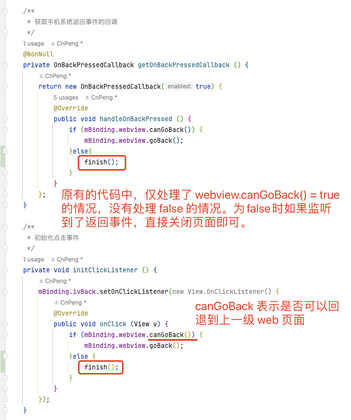

#### 1.4.3.2. 解决无法加载微信公众号文章的问题

待办列表的条目中，有很多都是公众号中的文档，但我们打开之后并不能正常显示，如下图：

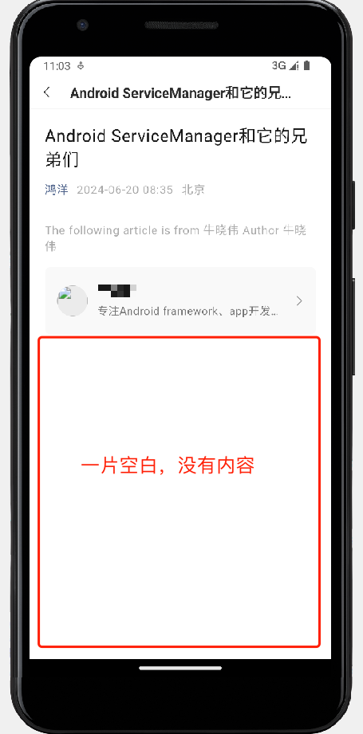

解决办法如下：

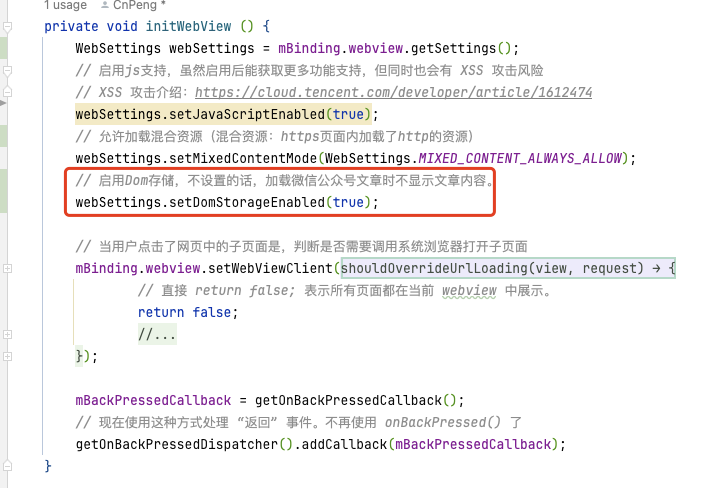


如果在加载其他网站时遇见无法正常显示内容的情况，可以考虑设置如下属性信息：

```java
    /**
     * 启用其他 WebSettings
     * <p></>
     * 如果遇见url中的内容无法加载的情况，先判断目标地址是不是 http , 如果是，先去 xml/network_security_config.xml 中添加为白名单地址。
     * 如果是 https 或 http 添加白名单后问题依旧，可以尝试启用下面的部分配置。——不建议一次全部启用，最好是挨个试一试。
     * <p></>
     * 如果还是不行，有可能就是硬件加速导致的，到 androidManifest.xml 中配置 android:hardwareAccelerated="false"
     */
    private void initOtherWebSettings(WebSettings settings){
        // 自动加载图片
        settings.setLoadsImagesAutomatically(true);
        // 启用DOM存储。启用后可解决加载微信公众号文章时不展示内容的问题。
        settings.setDomStorageEnabled(true);
        // 启用数据库存储
        settings.setDatabaseEnabled(true);
        // 允许从file URL加载的文件访问其他文件URL
        settings.setAllowFileAccess(true);
        // 解决图片不加载的问题
        settings.setBlockNetworkImage(false);
        // 允许自动播放媒体。需要在AndroidManifest.xml中申请网络访问权限,即：
        // <uses-permission android:name="android.permission.INTERNET" />
        settings.setMediaPlaybackRequiresUserGesture(false);
    }
```


## 1.5. "我的" 页面开发

效果：

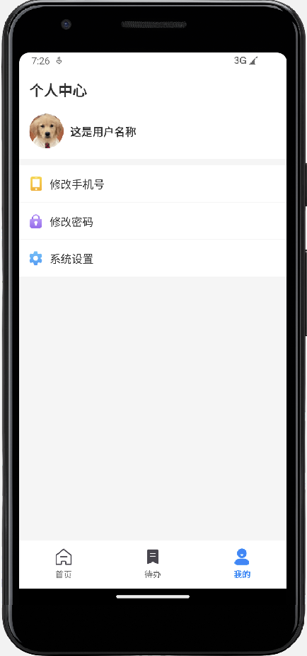

### 1.5.1. 页面基础实现

#### 1.5.1.1. 圆角/圆形图片的实现

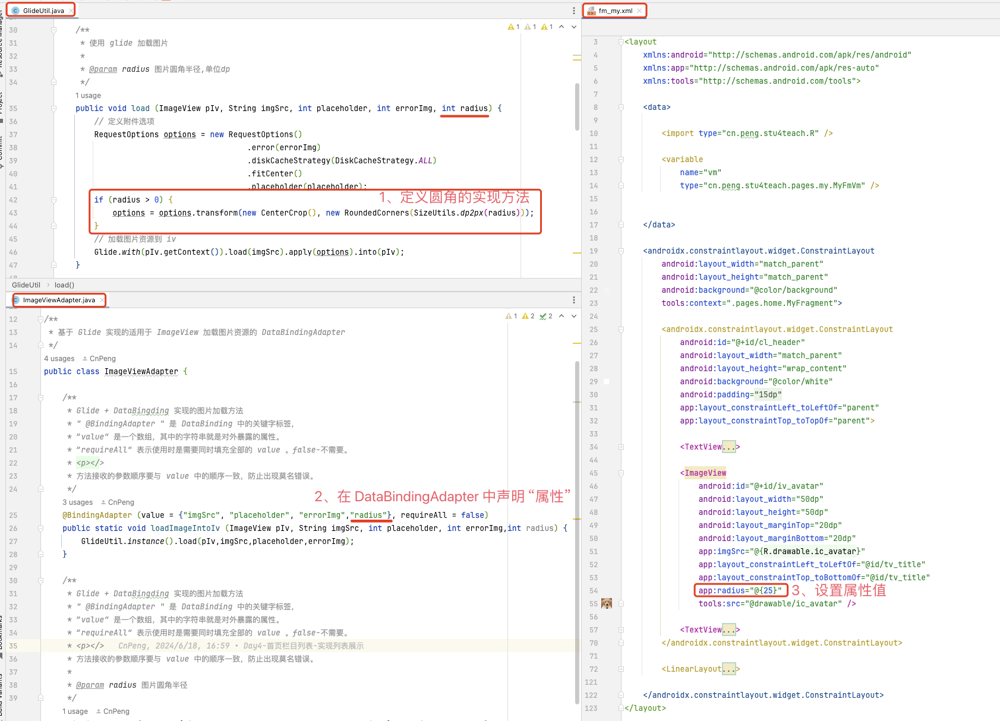

#### 1.5.1.2. 核心代码

```xml
<?xml version="1.0" encoding="utf-8"?>

<layout
    xmlns:android="http://schemas.android.com/apk/res/android"
    xmlns:app="http://schemas.android.com/apk/res-auto"
    xmlns:tools="http://schemas.android.com/tools">

    <data>

        <import type="cn.peng.stu4teach.R" />

        <variable
            name="vm"
            type="cn.peng.stu4teach.pages.my.MyFmVm" />
    </data>

    <androidx.constraintlayout.widget.ConstraintLayout
        android:layout_width="match_parent"
        android:layout_height="match_parent"
        android:background="@color/background"
        tools:context=".pages.home.MyFragment">

        <androidx.constraintlayout.widget.ConstraintLayout
            android:id="@+id/cl_header"
            android:layout_width="match_parent"
            android:layout_height="wrap_content"
            android:background="@color/white"
            android:padding="@dimen/dp15"
            app:layout_constraintLeft_toLeftOf="parent"
            app:layout_constraintTop_toTopOf="parent">

            <TextView
                android:id="@+id/tv_title"
                android:layout_width="wrap_content"
                android:layout_height="wrap_content"
                android:text="个人中心"
                android:textColor="@color/text_main"
                android:textSize="@dimen/text_size_max"
                android:textStyle="bold"
                app:layout_constraintStart_toStartOf="parent"
                app:layout_constraintTop_toTopOf="parent" />

            <ImageView
                android:id="@+id/iv_avatar"
                android:layout_width="50dp"
                android:layout_height="50dp"
                android:layout_marginTop="20dp"
                android:layout_marginBottom="20dp"
                app:imgSrc="@{R.drawable.ic_avatar}"
                app:layout_constraintLeft_toLeftOf="@id/tv_title"
                app:layout_constraintTop_toBottomOf="@id/tv_title"
                app:radius="@{25}"
                tools:src="@drawable/ic_avatar" />

            <TextView
                android:id="@+id/tv_uname"
                android:layout_width="0dp"
                android:layout_height="wrap_content"
                android:layout_marginStart="10dp"
                android:text="这是用户名称"
                android:textColor="@color/text_main"
                android:textSize="16sp"
                android:textStyle="bold"
                app:layout_constraintBottom_toBottomOf="@id/iv_avatar"
                app:layout_constraintLeft_toRightOf="@id/iv_avatar"
                app:layout_constraintRight_toRightOf="parent"
                app:layout_constraintTop_toTopOf="@id/iv_avatar" />
        </androidx.constraintlayout.widget.ConstraintLayout>

        <LinearLayout
            android:id="@+id/ll_container"
            android:layout_width="match_parent"
            android:layout_height="wrap_content"
            android:layout_marginTop="10dp"
            android:orientation="vertical"
            app:layout_constraintLeft_toLeftOf="parent"
            app:layout_constraintRight_toRightOf="parent"
            app:layout_constraintTop_toBottomOf="@id/cl_header">

            <TextView
                android:id="@+id/tv_change_phone"
                android:layout_width="match_parent"
                android:layout_height="wrap_content"
                android:background="@color/white"
                android:drawablePadding="@dimen/dp10"
                android:padding="15dp"
                android:text="修改手机号"
                android:textColor="@color/text_main"
                android:textSize="16sp"
                app:drawableStartCompat="@drawable/ic_phone" />

            <TextView
                android:id="@+id/tv_change_pwd"
                android:layout_width="match_parent"
                android:layout_height="wrap_content"
                android:layout_marginTop="1dp"
                android:background="@color/white"
                android:drawablePadding="@dimen/dp10"
                android:padding="15dp"
                android:text="修改密码"
                android:textColor="@color/text_main"
                android:textSize="16sp"
                app:drawableStartCompat="@drawable/ic_pwd" />

            <TextView
                android:id="@+id/tv_settings"
                android:layout_width="match_parent"
                android:layout_height="wrap_content"
                android:layout_marginTop="1dp"
                android:background="@color/white"
                android:drawablePadding="@dimen/dp10"
                android:padding="15dp"
                android:text="系统设置"
                android:textColor="@color/text_main"
                android:textSize="16sp"
                app:drawableStartCompat="@drawable/ic_setting" />

        </LinearLayout>

    </androidx.constraintlayout.widget.ConstraintLayout>
</layout>
```

### 1.5.2. 补充知识

#### 1.5.2.1. 拍照和选择图片

如果想通过拍照或选择图片来更改头像，可以使用  PictureSelector （ [Github](https://github.com/LuckSiege/PictureSelector/blob/version_component/README_CN.md) 、 Gitee ）实现，具体实现可参考文档。

需要注意的时，在使用时需要动态请求拍照或读取文件的权限。


