# 1. 005-Day5

## 1.1. 应用内升级逻辑开发

### 1.1.1. 核心代码截图解析

#### 1.1.1.1. 下载器

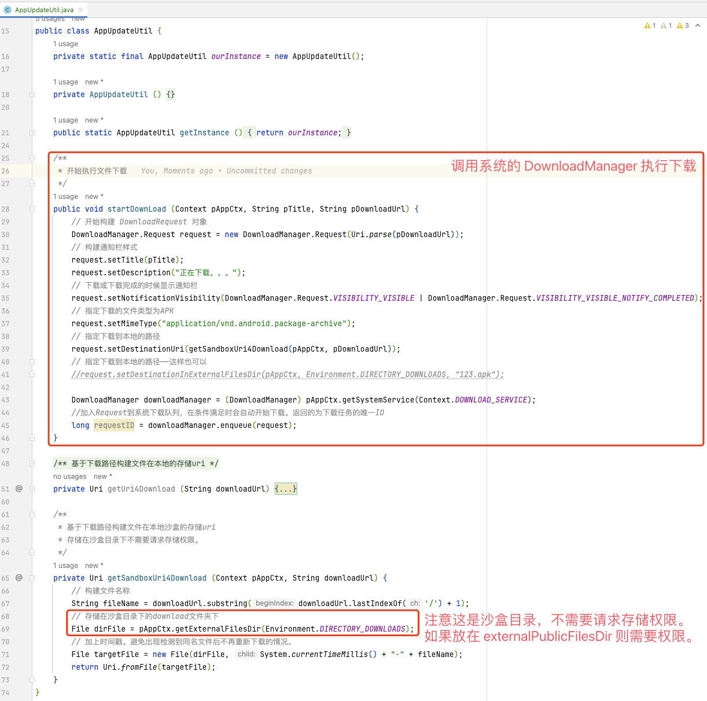

注意：在实际项目使用中，执行下载之后，最好把返回的 id （即上面代码中的 `requestID`）做本地存储，接收到下载成功的广播时，将该 id 取出来，判断与下载成功的 id 是否一致。一致再执行后续逻辑。

#### 1.1.1.2. 广播


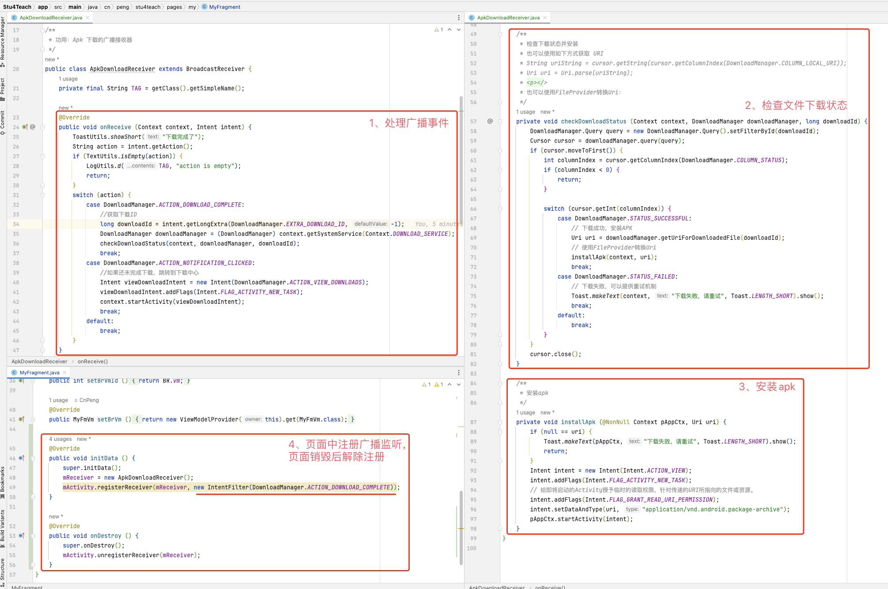


#### 1.1.1.3. 清单文件

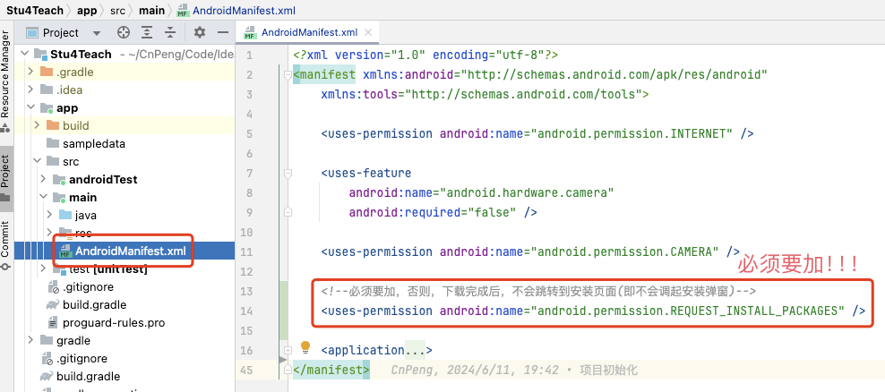

### 1.1.2. 完整代码

#### 1.1.2.1. AppUpdateUtil.java

```java
package cn.peng.stu4teach.util.update;

import android.app.DownloadManager;
import android.content.Context;
import android.net.Uri;
import android.os.Environment;

import java.io.File;

/**
 * App升级工具类。
 *
 * @author cnpeng
 */
public class AppUpdateUtil {
    private static final AppUpdateUtil ourInstance = new AppUpdateUtil();

    private AppUpdateUtil () {
    }

    public static AppUpdateUtil getInstance () {
        return ourInstance;
    }

    /**
     * 开始执行文件下载
     */
    public void startDownLoad (Context pAppCtx, String pTitle, String pDownloadUrl) {
        // 开始构建 DownloadRequest 对象
        DownloadManager.Request request = new DownloadManager.Request(Uri.parse(pDownloadUrl));
        // 构建通知栏样式
        request.setTitle(pTitle);
        request.setDescription("正在下载。。。");
        // 下载或下载完成的时候显示通知栏
        request.setNotificationVisibility(DownloadManager.Request.VISIBILITY_VISIBLE | DownloadManager.Request.VISIBILITY_VISIBLE_NOTIFY_COMPLETED);
        // 指定下载的文件类型为APK
        request.setMimeType("application/vnd.android.package-archive");
        // 指定下载到本地的路径
        request.setDestinationUri(getSandboxUri4Download(pAppCtx, pDownloadUrl));
        // 指定下载到本地的路径——这样也可以
        //request.setDestinationInExternalFilesDir(pAppCtx, Environment.DIRECTORY_DOWNLOADS, "123.apk");

        DownloadManager downloadManager = (DownloadManager) pAppCtx.getSystemService(Context.DOWNLOAD_SERVICE);
        //加入Request到系统下载队列，在条件满足时会自动开始下载。返回的为下载任务的唯一ID
        long requestID = downloadManager.enqueue(request);
    }

    /**
     * 基于下载路径构建文件在本地的存储uri
     */
    private Uri getUri4Download (String downloadUrl) {
        // 构建文件名称
        String fileName = downloadUrl.substring(downloadUrl.lastIndexOf('/') + 1);
        // 存储在公共目录下的download文件夹下
        File dirFile = Environment.getExternalStoragePublicDirectory(Environment.DIRECTORY_DOWNLOADS);
        // 加上时间戳。避免出现检测到同名文件后不再重新下载的情况。
        Uri fileUri = Uri.fromFile(new File(dirFile, System.currentTimeMillis() + "-" + fileName));
        return fileUri;
    }

    /**
     * 基于下载路径构建文件在本地沙盒的存储uri
     * 存储在沙盒目录下不需要请求存储权限。
     */
    private Uri getSandboxUri4Download (Context pAppCtx, String downloadUrl) {
        // 构建文件名称
        String fileName = downloadUrl.substring(downloadUrl.lastIndexOf('/') + 1);
        // 存储在沙盒目录下的download文件夹下
        File dirFile = pAppCtx.getExternalFilesDir(Environment.DIRECTORY_DOWNLOADS);
        // 加上时间戳。避免出现检测到同名文件后不再重新下载的情况。
        File targetFile = new File(dirFile, System.currentTimeMillis() + "-" + fileName);
        return Uri.fromFile(targetFile);
    }
}
```

#### 1.1.2.2. ApkDownloadReceiver

```java
package cn.peng.stu4teach.util.update;

import android.app.DownloadManager;
import android.content.BroadcastReceiver;
import android.content.Context;
import android.content.Intent;
import android.database.Cursor;
import android.net.Uri;
import android.text.TextUtils;
import android.widget.Toast;

import androidx.annotation.NonNull;

import com.blankj.utilcode.util.LogUtils;
import com.blankj.utilcode.util.ToastUtils;

/**
 * 功用：Apk 下载的广播接收器
 */
public class ApkDownloadReceiver extends BroadcastReceiver {
    private final String TAG = getClass().getSimpleName();

    @Override
    public void onReceive (Context context, Intent intent) {
        ToastUtils.showShort("下载完成了");
        String action = intent.getAction();
        if (TextUtils.isEmpty(action)) {
            LogUtils.d(TAG, "action is empty");
            return;
        }
        switch (action) {
            case DownloadManager.ACTION_DOWNLOAD_COMPLETE:
                //获取下载ID
                long downloadId = intent.getLongExtra(DownloadManager.EXTRA_DOWNLOAD_ID, -1);
                DownloadManager downloadManager = (DownloadManager) context.getSystemService(Context.DOWNLOAD_SERVICE);
                checkDownloadStatus(context, downloadManager, downloadId);
                break;
            case DownloadManager.ACTION_NOTIFICATION_CLICKED:
                //如果还未完成下载，跳转到下载中心
                Intent viewDownloadIntent = new Intent(DownloadManager.ACTION_VIEW_DOWNLOADS);
                viewDownloadIntent.addFlags(Intent.FLAG_ACTIVITY_NEW_TASK);
                context.startActivity(viewDownloadIntent);
                break;
            default:
                break;
        }
    }

    /**
     * 检查下载状态并安装
     * 也可以使用如下方式获取 URI
     * String uriString = cursor.getString(cursor.getColumnIndex(DownloadManager.COLUMN_LOCAL_URI));
     * Uri uri = Uri.parse(uriString);
     * <p></>
     * 也可以使用FileProvider转换Uri：
     */
    private void checkDownloadStatus (Context context, DownloadManager downloadManager, long downloadId) {
        DownloadManager.Query query = new DownloadManager.Query().setFilterById(downloadId);
        Cursor cursor = downloadManager.query(query);
        if (cursor.moveToFirst()) {
            int columnIndex = cursor.getColumnIndex(DownloadManager.COLUMN_STATUS);
            if (columnIndex < 0) {
                return;
            }

            switch (cursor.getInt(columnIndex)) {
                case DownloadManager.STATUS_SUCCESSFUL:
                    // 下载成功，安装APK
                    Uri uri = downloadManager.getUriForDownloadedFile(downloadId);
                    // 使用FileProvider转换Uri
                    installApk(context, uri);
                    break;
                case DownloadManager.STATUS_FAILED:
                    // 下载失败，可以提供重试机制
                    Toast.makeText(context, "下载失败，请重试", Toast.LENGTH_SHORT).show();
                    break;
                default:
                    break;
            }
        }
        cursor.close();
    }

    /**
     * 安装apk
     */
    private void installApk (@NonNull Context pAppCtx, Uri uri) {
        if (null == uri) {
            Toast.makeText(pAppCtx, "下载失败，请重试", Toast.LENGTH_SHORT).show();
            return;
        }
        Intent intent = new Intent(Intent.ACTION_VIEW);
        intent.addFlags(Intent.FLAG_ACTIVITY_NEW_TASK);
        // 给即将启动的Activity授予临时的读取权限，针对传递的URI所指向的文件或资源。
        intent.addFlags(Intent.FLAG_GRANT_READ_URI_PERMISSION);
        intent.setDataAndType(uri, "application/vnd.android.package-archive");
        pAppCtx.startActivity(intent);
    }
}

```


#### 1.1.2.3. MyFragment.java

```java
public class MyFragment extends BaseFragment<FmMyBinding, MyFmVm> {
    private       BroadcastReceiver mReceiver;

    private MyFragment () {
    }

    public static MyFragment newInstance () {
        return new MyFragment();
    }

    @Override
    public int seLayoutId () {
        return R.layout.fm_my;
    }

    @Override
    public int setBrVmId () {
        return BR.vm;
    }

    @Override
    public MyFmVm setBrVm () {
        return new ViewModelProvider(this).get(MyFmVm.class);
    }

    @Override
    public void initData () {
        super.initData();
        mReceiver = new ApkDownloadReceiver();
        mActivity.registerReceiver(mReceiver, new IntentFilter(DownloadManager.ACTION_DOWNLOAD_COMPLETE));
    }

    @Override
    public void onDestroy () {
        super.onDestroy();
        mActivity.unregisterReceiver(mReceiver);
    }
}
```

#### 1.1.2.4. AndroidManifest.xml

```xml
<?xml version="1.0" encoding="utf-8"?>
<manifest xmlns:android="http://schemas.android.com/apk/res/android"
    xmlns:tools="http://schemas.android.com/tools">

    <uses-permission android:name="android.permission.INTERNET" />

    <uses-feature
        android:name="android.hardware.camera"
        android:required="false" />

    <uses-permission android:name="android.permission.CAMERA" />

    <!--必须要加，否则，下载完成后，不会跳转到安装页面(即不会调起安装弹窗)-->
    <uses-permission android:name="android.permission.REQUEST_INSTALL_PACKAGES" />

    <application
        android:allowBackup="true"
        android:dataExtractionRules="@xml/data_extraction_rules"
        android:fullBackupContent="@xml/backup_rules"
        android:icon="@drawable/ic_launcher"
        android:label="@string/app_name"
        android:networkSecurityConfig="@xml/network_security_config"
        android:supportsRtl="true"
        android:theme="@style/Theme.Stu4Teach"
        tools:targetApi="31">
        <activity
            android:name=".util.webview.WebViewActivity"
            android:exported="false" />
        <activity
            android:name=".pages.funcs.AllFuncsActivity"
            android:exported="false" />
        <activity
            android:name=".pages.qrscan.QrScanActivity"
            android:exported="false" />
        <activity
            android:name=".pages.main.MainActivity"
            android:exported="true">
            <intent-filter>
                <action android:name="android.intent.action.MAIN" />

                <category android:name="android.intent.category.LAUNCHER" />
            </intent-filter>
        </activity>
    </application>
</manifest>
```

## 1.2. 密钥及项目打包

密钥是 App 最重要的信息，必须仔细认证保留。

### 1.2.1. 使用Build菜单工具打包

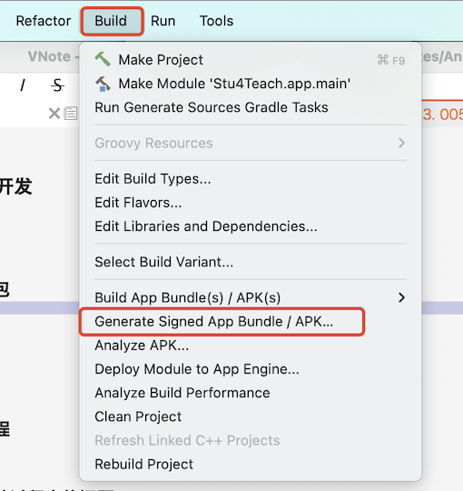

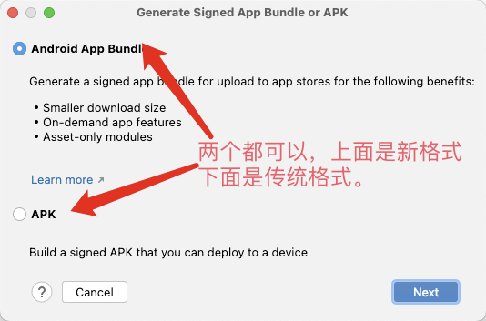

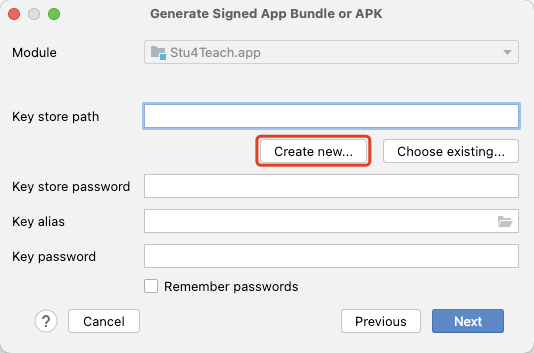

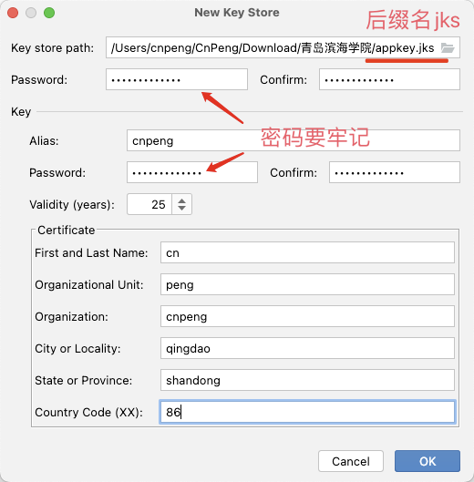


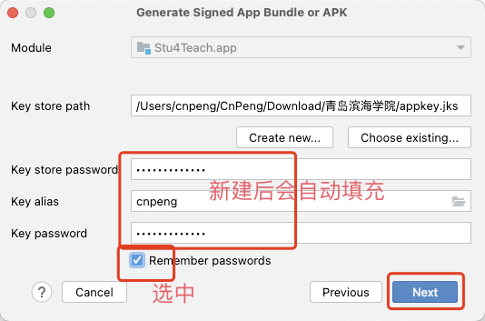

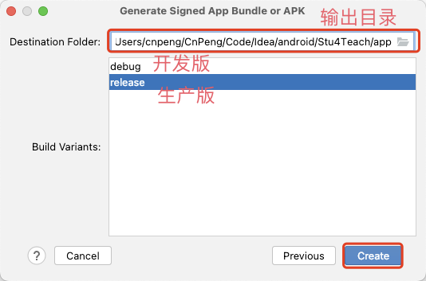

构建中：


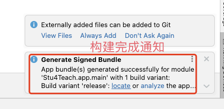

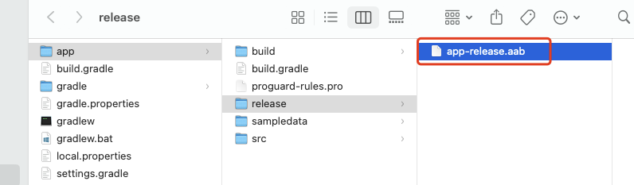

### 1.2.2. 使用BuildVariants工具栏

#### 1.2.2.1. 使用BuildVariants工具栏

使用这种方式将直接安装到设备上，安装时可以切换开发版和生产版。

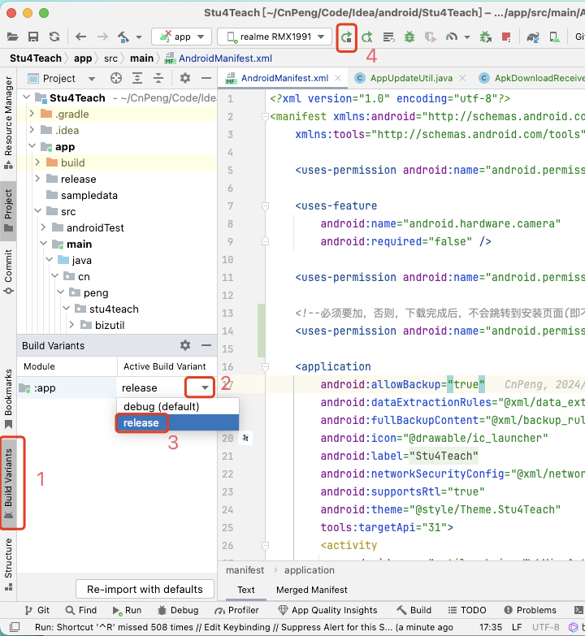


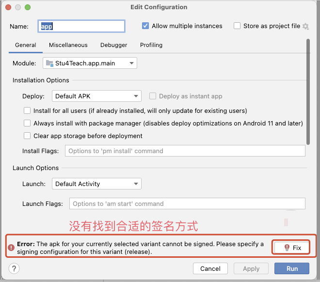

先点击上图中的 `cancel`，然后按下图编辑签名配置信息：


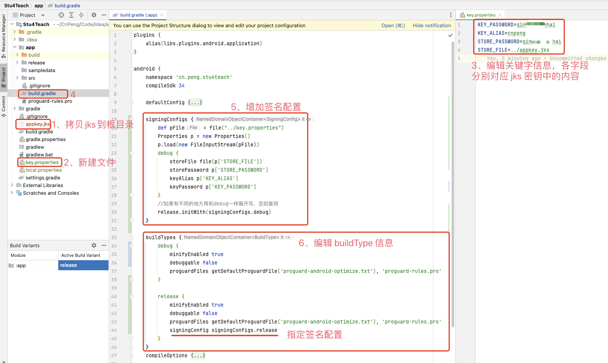

编辑完成后，保存然后点击下图中的运行图标：

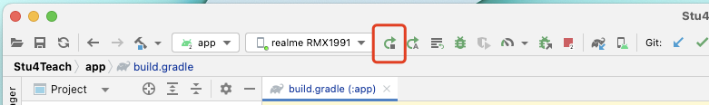

如果能正常运行则不需要执行下图，如果还是跳转出下图，则点击其中的 `Fix`:

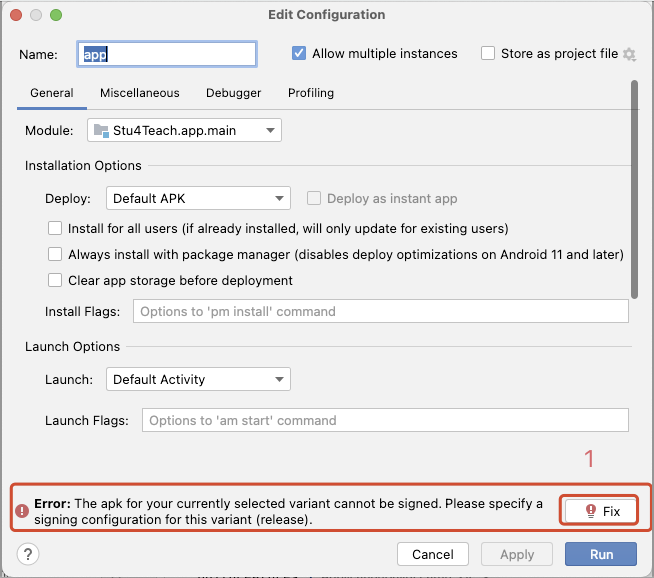

然后在弹出的页面中选择一项签名配置即可。（选择 `release`）.

#### 1.2.2.2. 注意

我们在操作时将密钥文件（jks文件）和 `key.properties` 文件放到了根目录下，但需要注意，为了防止泄密，这两个文件不要提交到代码仓库中。

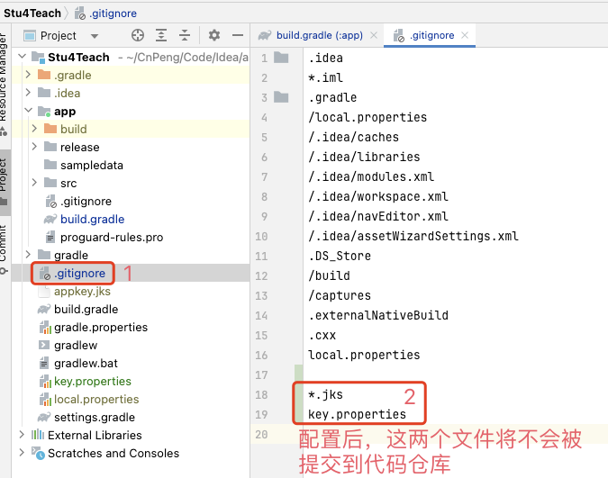

### 1.2.3. 使用gradle打包

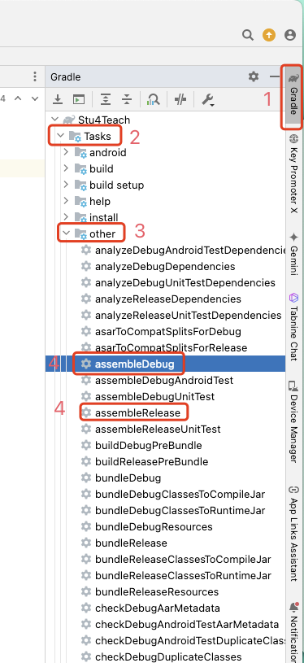

如果右侧工具面板中找不到 `gradle` ， 则可以按下图从菜单栏中查找并打开：

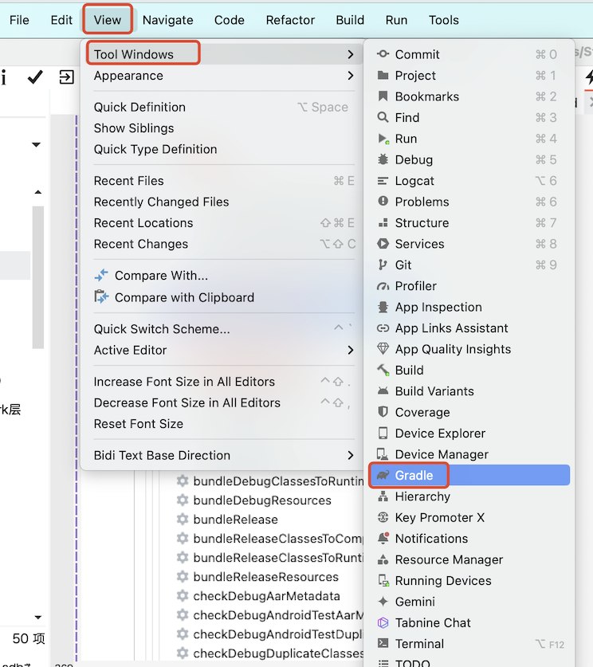


## 1.3. apk上架

### 1.3.1. 上架必须材料

* ICP备案（公网访问ip）
* 服务器域名
* 服务器域名备案
* 申请软著
* 申请App备案
* 申请各应用市场账号（华为、小米、Vivo、Oppo、荣耀）

### 1.3.2. 关于隐私合规

隐私合规现在要求越来越严格，在用户同意《隐私政策》和《使用协议》前不要做任何和隐私相关的操作，比如：获取设备id、获取网络状态等。

集成三方库时务必仔细阅读集成文档，按文档说明做好隐私合规。

上架后，如果因为隐私合规被拒，可以联系各厂商客服要求提供隐私合规检测报告，然后根据报告进行整改。

## 1.4. apk 分发的其他途径介绍

* 服务器分发：将apk上传到服务器，然后获取公网访问地址，再把地址做成二维码供用户下载。
* 蒲公英：[https://www.pgyer.com/](https://www.pgyer.com/) 上传APK，自动生成二维码和下载链接，可把这两项提供给客户下载。但是，下载页面有广告。

