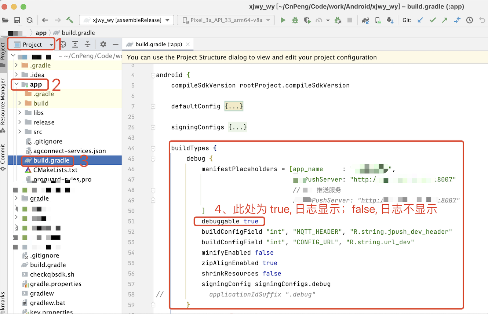
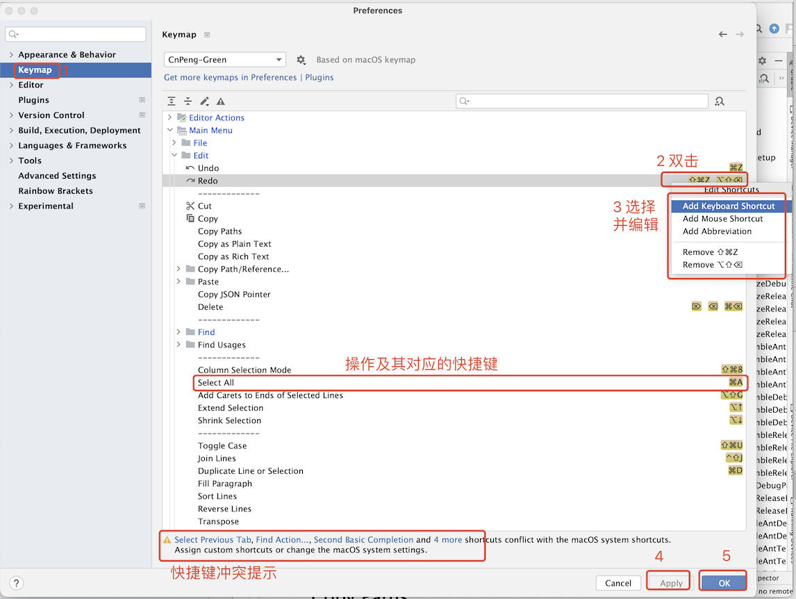
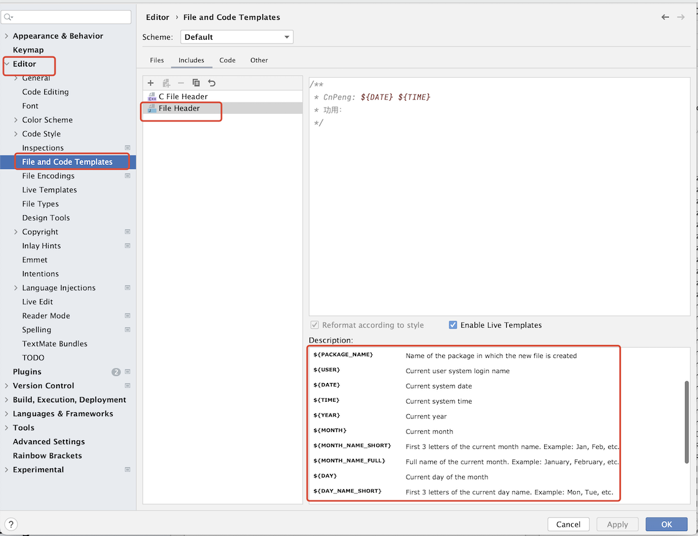
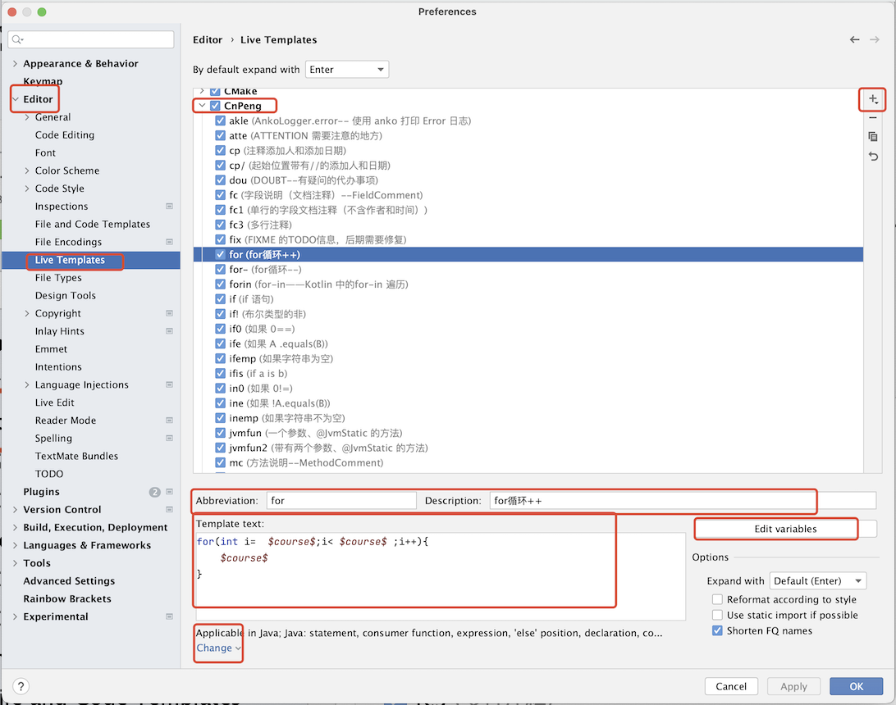
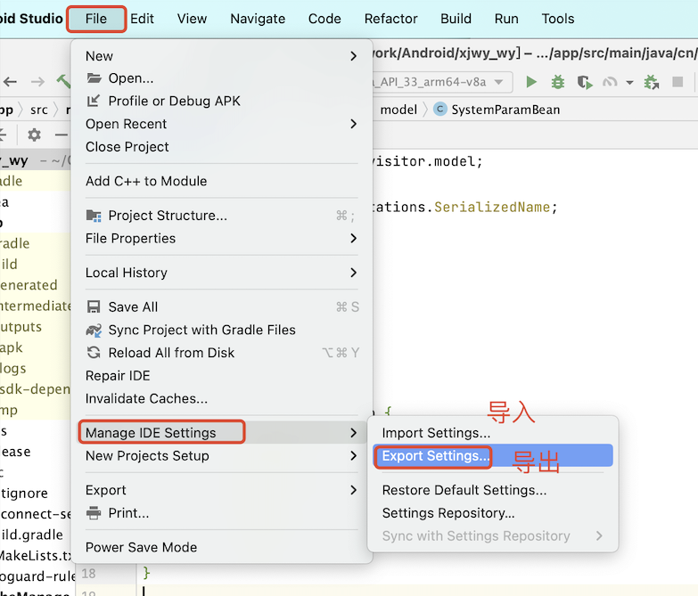

# 1. 006-补充知识


## 1.1. 日志封装

* CpLog.java

```java
public class CpLog {
    //类名
    static         String className;
    //方法名
    static         String methodName;
    //行数
    static         int    lineNumber;
    private static String TAG;

    private CpLog () {
        /* Protect from instantiations */
    }

    public static boolean isDebuggable () {
        return BuildConfig.DEBUG;
    }

    private static String createLog (Object... msgs) {
        StringBuilder buffer = new StringBuilder();
        buffer.append(methodName);
        // () 紧跟在 methodName 后面，表示前面是一个方法；|| 用来与后面的内容区分
        buffer.append("() || ");
        for (Object msg : msgs) {
            buffer.append(msg.toString());
        }
        return buffer.toString();
    }

    private static void getMethodNames (StackTraceElement[] sElements) {
        className = sElements[1].getFileName();
        methodName = sElements[1].getMethodName();
        lineNumber = sElements[1].getLineNumber();
        TAG = "(" + className + ":" + lineNumber + ")";
    }

    public static void e (Object... message) {
        if (!isDebuggable()) {
            return;
        }

        // Throwable instance must be created before any methods
        getMethodNames(new Throwable().getStackTrace());
        Log.e(TAG, createLog(message));
    }


    public static void i (Object... message) {
        if (!isDebuggable()) {
            return;
        }

        getMethodNames(new Throwable().getStackTrace());
        Log.i(TAG, createLog(message));
    }

    public static void d (Object... message) {
        if (!isDebuggable()) {
            return;
        }

        getMethodNames(new Throwable().getStackTrace());
        Log.d(TAG, createLog(message));
    }

    public static void v (Object... message) {
        if (!isDebuggable()) {
            return;
        }

        getMethodNames(new Throwable().getStackTrace());
        Log.v(TAG, createLog(message));
    }

    public static void w (Object... message) {
        if (!isDebuggable()) {
            return;
        }

        getMethodNames(new Throwable().getStackTrace());
        Log.w(TAG, createLog(message));
    }

    public static void wtf (Object... message) {
        if (!isDebuggable()) {
            return;
        }

        getMethodNames(new Throwable().getStackTrace());
        Log.wtf(TAG, createLog(message));
    }
}
```

* 模块的 `build.gradle` 文件中，`buildTypes` 中指定 `debuggable=true` :



## 1.2. AndroidStuido 相关

### 1.2.1. 快捷键




### 1.2.2. 代码模板

#### 1.2.2.1. 文件模板



#### 1.2.2.2. 代码片段模板



### 1.2.3. 导入、导出AS设置




## 1.3. adb 命令

Android Debug Bridge (ADB) 是一个命令行工具，用于与 Android 设备进行通信。以下是常用的 ADB 命令列表，这些命令对于开发者、测试人员以及需要对 Android 设备进行调试和管理的用户都非常有用：

### 1.3.1. 基础命令

#### 1.3.1.1. 查看连接设备状态

   - `adb devices`：列出所有已连接的Android设备和模拟器。

#### 1.3.1.2. 启动/重启ADB服务

   - `adb start-server`：启动ADB服务。
   - `adb kill-server`：终止ADB服务。

### 1.3.2. 应用操作

#### 1.3.2.1. 安装应用（重中之重）

   - `adb install [-r] [-d] [-t] [-s] <path_to_apk>`：安装APK文件到设备。
     - `-r`：重新安装应用，保留数据。
     - `-d`：允许版本降级。
     - `-t`：允许安装测试（unreleased）的应用。
     - `-s`：指定设备序列号进行安装。

#### 1.3.2.2. 卸载应用

  - `adb uninstall [-k] <package_name>`：从设备卸载应用。
     - `-k`：卸载应用但保留数据和缓存目录。

#### 1.3.2.3. 启动应用

   - `adb shell am start -n <package_name>/<activity_name>`：启动指定的应用或Activity。

### 1.3.3. 复制文件

   - `adb push <local_path> <remote_path>`：将电脑上的文件推送到设备。
   - `adb pull <remote_path> <local_path>`：从设备拉取文件到电脑。

### 1.3.4. 日志查看

   - `adb logcat [<option>]`：查看设备的日志输出，可以添加选项如`-s TAG`筛选特定标签的日志，或`-c`清空日志缓冲区。
   - `adb logcat -b all > log.txt`：保存所有日志缓冲区的内容到文件。

### 1.3.5. 设备相关


#### 1.3.5.1. 设置设备为TCP/IP模式

   - `adb tcpip <port>`：使设备监听指定端口上的TCP/IP连接，默认是5555。

#### 1.3.5.2. 无线连接设备

   - `adb connect <device_ip>:<port>`：通过Wi-Fi连接设备。

#### 1.3.5.3. 重启设备

- `adb reboot`：重启设备。
- `adb reboot bootloader`：进入引导加载程序模式。
- `adb reboot recovery`：进入恢复模式。

#### 1.3.5.4. 获取设备信息

- `adb shell getprop`：获取设备的系统属性信息。
- `adb shell dumpsys`：获取系统的各种状态信息。
- `adb shell`：进入设备的shell环境。

### 1.3.6. 屏幕截图与录制

- `adb shell screencap -p /sdcard/screen.png`：截屏并保存到设备存储。
- `adb pull /sdcard/screen.png .`：将截屏文件拉回到电脑。
- `adb shell screenrecord /sdcard/video.mp4`：录制设备屏幕。

这些命令覆盖了日常开发和调试中的许多基本需求，但 ADB 的功能远不止于此，更多高级命令和功能可以根据具体需求进一步探索。

### 1.3.7. 其他

[Android 调试桥 (adb)](https://developer.android.google.cn/tools/adb?hl=zh-cn#backends)

[adb常用命令总结](https://zhuanlan.zhihu.com/p/245085026)


## 1.4. Gradle 

[官方文档《Android Gradle 插件》- gradle 的使用](https://developer.android.google.cn/build?hl=zh-cn)


* [教程Jetpack Compose 教程](https://developer.android.google.cn/develop/ui/compose/tutorial?hl=zh-cn)


## 1.5. 学习网站

* [Android 官网](https://developer.android.google.cn/?hl=zh-cn)
* [鸿洋-玩安卓](https://wanandroid.com/)
* [googlesamples](https://github.com/googlesamples)
* [googlecodelabs](https://github.com/googlecodelabs)


## 1.6. 其他

### 1.6.1. 初版知识体系

#### 1.6.1.1. 常用布局和组件

* 常用布局
    * LinearLayout
    * RelativeLayout
    * FrameLayout
    * ConstraintLayout（重点）
    * TabLayout

* 其他布局容器
    * TableLayout？
    * CoordinatorLayout
    * GridLayout

* 常用组件
    * TextView
    * Button
    * RecyclerView
        * 上拉刷新
        * 下拉加载
    * ViewPager

#### 1.6.1.2. 权限请求

* 普通权限请求
* 敏感权限请求

tools

其他常用组件(button、textview、属性-样式、事件)
吐司(吐司不显示的问题，个别手机禁用通知权限后不显示吐司)

tab
viewpager
rv+刷新
升级弹窗及升级逻辑
databinding
图片加载
debug调试

常见问题


#### 1.6.1.3. 进阶

网络框架？？
升级的数据源？
数据源


#### 1.6.1.4. 上架

gradle、

打包，

app分发，

混淆
加固
软著
备案
应用市场账号
服务器分发
蒲公英分发


## 1.7. 现状和未来

### 1.7.1. 现状

* App 外壳套 H5 详细内容
* Flutter 一套代码生成多端应用
* UniApp 以前端的形式生成多端应用


### 1.7.2. 前景

软著
备案
隐私政策收紧
维护成本上升

### 1.7.3. 其他方向

鸿蒙
小程序
服务端（java、go ）
