# 1. 03-认识计算机（计算机）

计算机俗称电脑，对应的英文单词为 computer ，音标为： `/ kəmˈpjuːtər /`。

## 1.1. 发展历程

1946年，世界上第一台通用电子数字计算机“ENIAC”诞生。它体型庞大，占地170平方米，重达30吨，但它的出现标志着计算机时代的到来。

1970-80年代，台式电脑出现，普通人开始使用。

1990年代，电脑互相连接，进入互联网时代。

而今，手机、平板、智能手表等设备作为一种特殊的计算机已经无处不在。

## 1.2. 计算机的分类

### 1.2.1. 按外形

台式机、笔记本、一体机 等。

#### 1.2.1.1. 台式机

最常见的计算机，主机和显示器是分离的，占据较大的空间，且连接线比较多。

早年间的台式机主机和显示器：

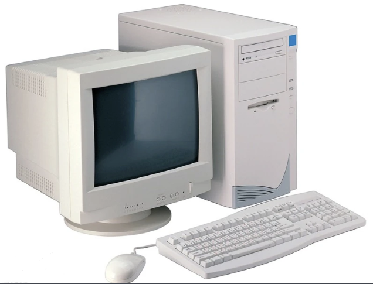

现代台式机主机和显示器：

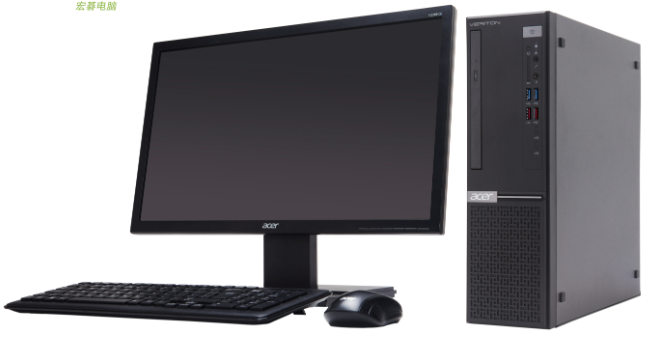

#### 1.2.1.2. 一体机

主机和显示器集成在一起，节省了空间，避免了繁杂的线束。但通常配置不算很高，多用于日常办公使用。

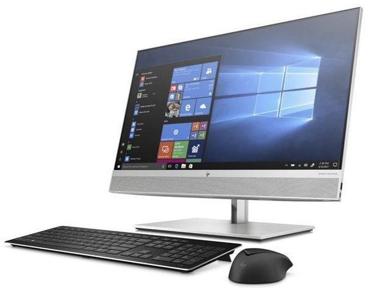

#### 1.2.1.3. 笔记本

内置电池，机身小巧，便携。

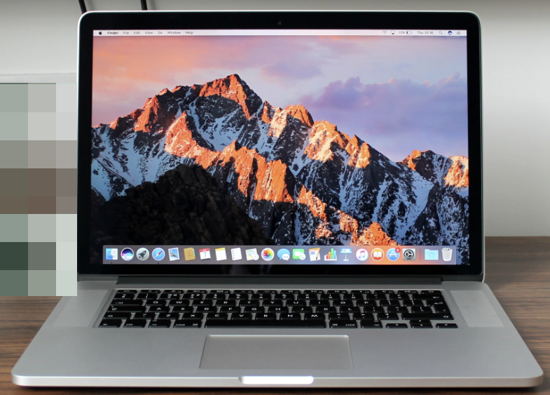

#### 1.2.1.4. 其他

手机、平板、智能手表也是一种计算机。

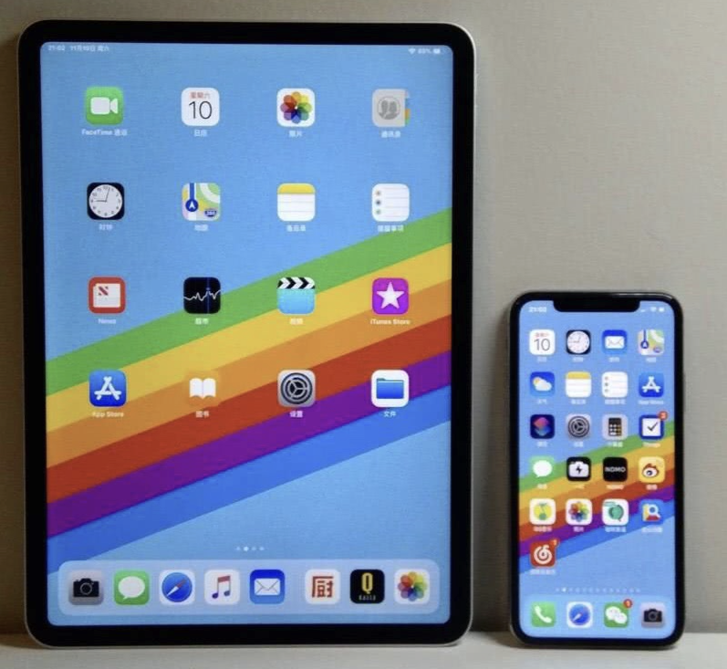

### 1.2.2. 按操作系统

Windows、MacOs、Linux 等

#### 1.2.2.1. Windows 操作系统

由美国微软公司开发和维护，市场占有率最高，是最常见的操作系统。

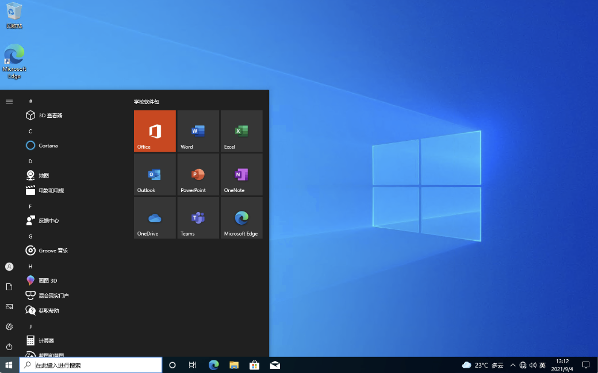

#### 1.2.2.2. MacOS 操作系统

由美国苹果公司专为Mac电脑开发的操作系统，设计美观，与苹果硬件完美结合，流畅稳定，安全性高。

#### 1.2.2.3. Linux 操作系统

一个源代码开放的、免费的操作系统，稳定性、安全性极高，深受程序员和服务器领域的青睐，界面风格多样。

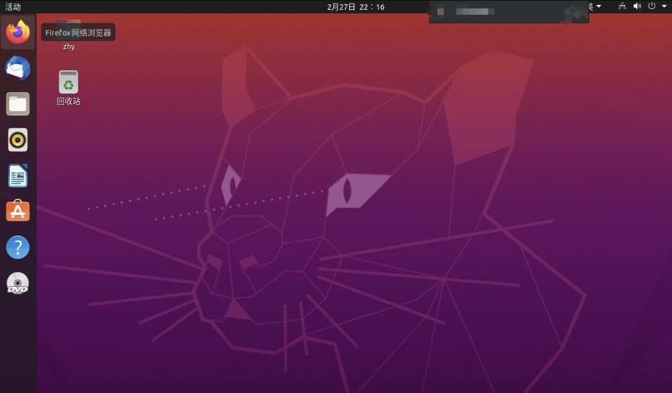

#### 1.2.2.4. 其他

##### 1.2.2.4.1. Android 操作系统

一个源代码开放的、免费的操作系统，广泛应用于手机、平板、智能手表等多种设备。

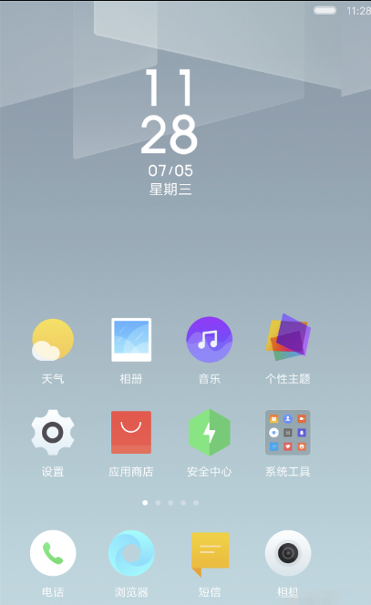

##### 1.2.2.4.2. iOS 操作系统

由美国苹果公司开发的，专用于 iPhone 手机和 iPad 平板。

##### 1.2.2.4.3. Harmoney 操作系统

有华为公司开发研制，搭载在华为、荣耀的设备上。

## 1.3. 计算机的组成

硬件+软件=计算机

主机 + 显示器 + 外设 = 计算机硬件

操作系统 + 驱动软件 + 应用软件= 软件

### 1.3.1. 计算机硬件

看得见摸得着的，可以称为硬件。

#### 1.3.1.1. 主机的组成

主机是计算机的核心组成，我们常见的机箱就是主机。机箱内部通常包含：电源、主板、CPU、内存、硬盘、显卡、散热器。

在早先的计算机中还会有光驱、软驱，但随着科技的发展，它们已经过时被抛弃。

##### 1.3.1.1.1. 主机箱

其他核心配件的保护装置——护甲。

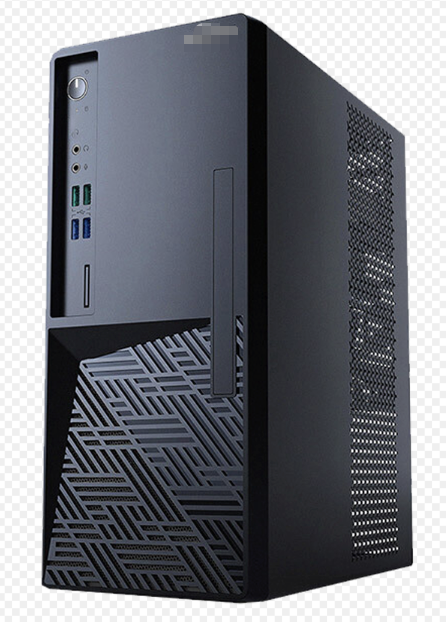

##### 1.3.1.1.2. 电源（power）

将家里的 220V 交流电转换为各配件需要的电压，是能量来源。

不同颜色的电线表示不同的输出电压。

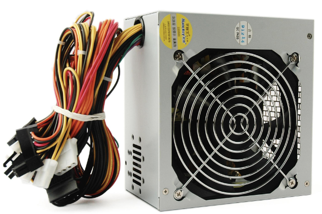

##### 1.3.1.1.3. 主板（motherboard）

计算机内各部件连接的桥梁，它将CPU、内存、硬盘、显卡等部件连接在一起，协同工作。

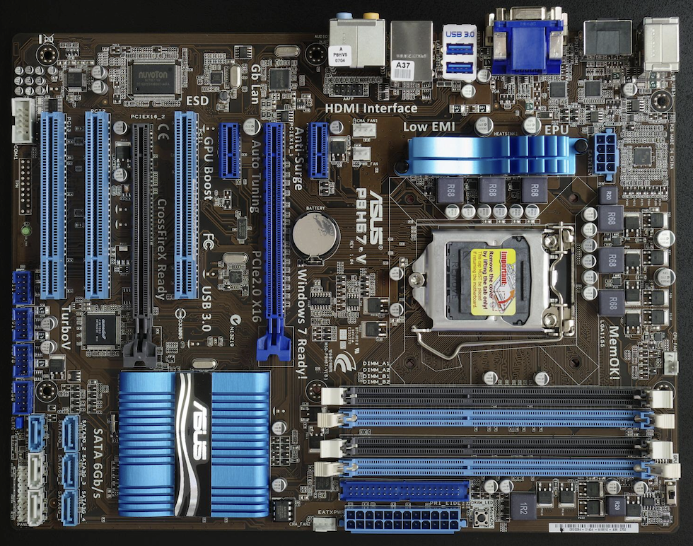

##### 1.3.1.1.4. CPU

又称中央处理器，英文：Central Processing Unit 

计算机的心脏，负责数据的运算和处理，它的性能很大程度上决定了计算机的运行速度。

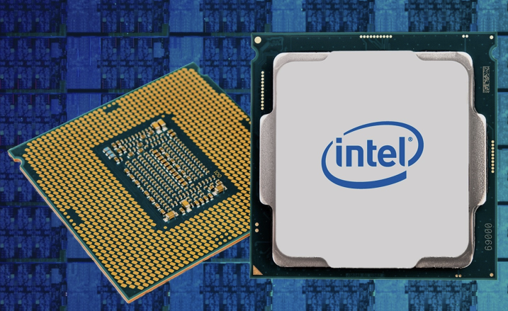

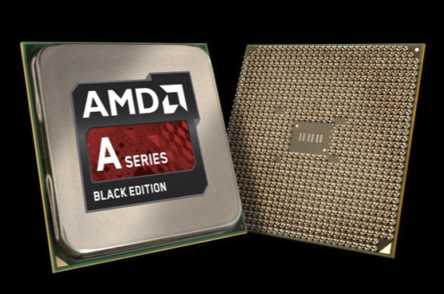

##### 1.3.1.1.5. 内存（memory）

是临时存储容器，存储正在运行的程序及其数据，计算机关机后，存储内容会清空。容量越大，能同时处理的任务越多（多开更强，可以同时运行更多的程序）。

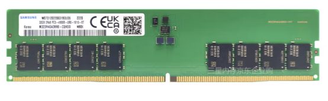

##### 1.3.1.1.6. 硬盘（hard disk）

用于永久性地存储数据，如文档、照片、视频等，分为机械硬盘和固态硬盘。

* 3.5 英寸 SATA 接口机械硬盘，常用于台式机

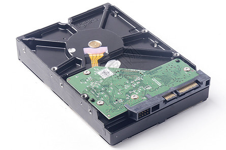

* 2.5 英寸 SATA 接口固态硬盘

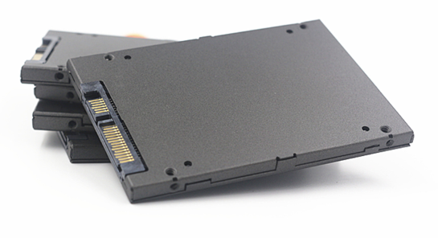

* NVM 接口固态硬盘

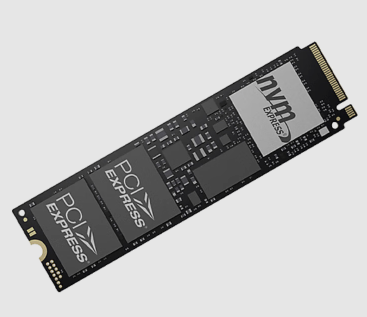

##### 1.3.1.1.7. 显卡（graphics card）

负责处理图形显示，对于玩游戏、看高清视频等需要大量图形计算的任务至关重要。

分为集成显卡和独立显卡。

集成显卡目前多集成在 CPU 内部，能满足日程办公和影视需求。

独立显卡是单独的一个配件模块，能满足大型游戏、超清视频的需求。

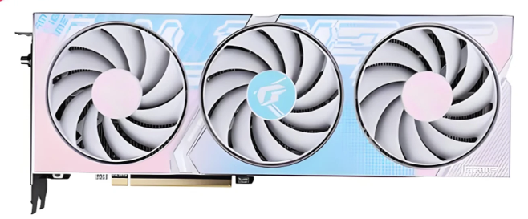

##### 1.3.1.1.8. 散热器

CPU 、显卡等部件在运行时会产生热量，散热器的作用就是给这些部件降温。

###### 1.3.1.1.8.1. CPU 散热器

CPU 散热器可以分为风冷散热器和水冷散热器。

* 风冷散热器通常由散热铜管、散热片、散热风扇三部分组成。价格实惠，比较常见。

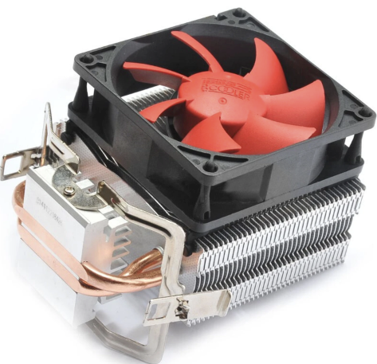

* 水冷散热器通常由冷头、水管、冷却液、风扇组成。价格较贵，但散热效果更佳。

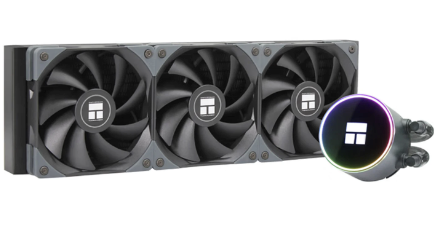

###### 1.3.1.1.8.2. 机箱散热器

机箱散热器通常就是一个尺寸较大的风扇。

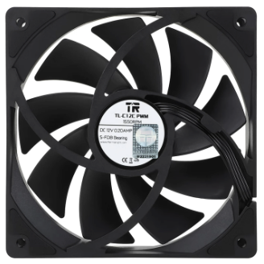

###### 1.3.1.1.8.3. 导热硅脂

在安装 CPU 散热器时，为了让 CPU 和散热器更好的接触，把更多的热量传递给散热器，通常需要在散热器和 CPU 之间涂抹导热硅脂。 

#### 1.3.1.2. 显示器

负责将显卡渲染的图像显示出来，供人们观看。

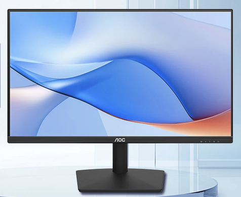

#### 1.3.1.3. 外设

主机的附属设备，被称为外部设备，简称外设。

键盘、鼠标、音响、摄像头、麦克风、外置网卡、外置显卡等

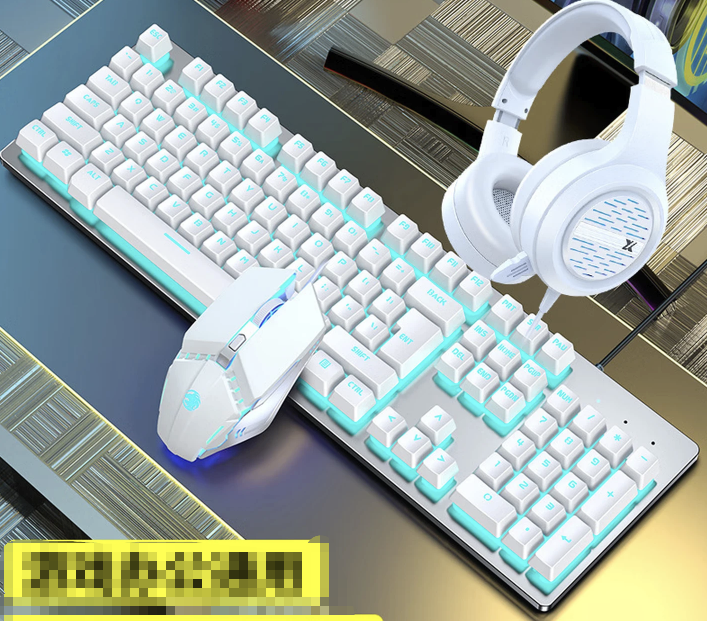

### 1.3.2. 计算机软件

看得见但是无法触摸的，可以称为软件。

#### 1.3.2.1. 操作系统

操作系统类似一个大管家，当我们操作某个应用软件时，操作系统会协调电脑内的CPU、内存等对我们的操作做出正确的处理。

常见的操作系统有 Windows、MacOS、Linux 等。

> 参考 计算机分类-按操作系统分类 中的操作系统。

#### 1.3.2.2. 应用软件

浏览器、办公软件、聊天软件、游戏 等。

* edge 浏览器

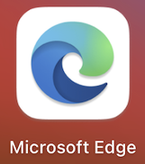

* 办公软件

* 聊天软件

* 游戏软件

#### 1.3.2.3. 驱动软件

各配件要想正常运行，还需要安装合适的驱动软件。

将配件类别为汽车，那么驱动就可以理解为汽油，没有汽油的汽车将无法行驶，没有正确安装驱动软件的硬件将无法正常运行。

通常情况下，操作系统安装好之后会自动安装驱动软件，但网卡、显卡可能需要单独安装。安装时可以到配件官网按具体型号下载。

* Gigabyte 主板驱动下载界面（主板驱动安装包中通常会包含网卡驱动）：

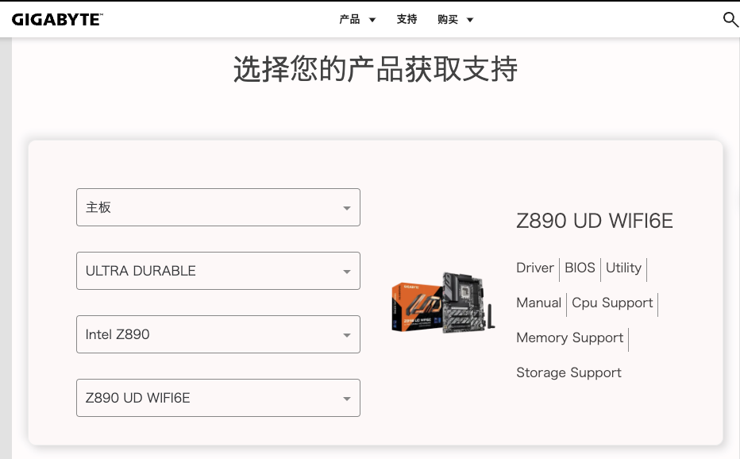

* Nvidia 显卡驱动下载界面：

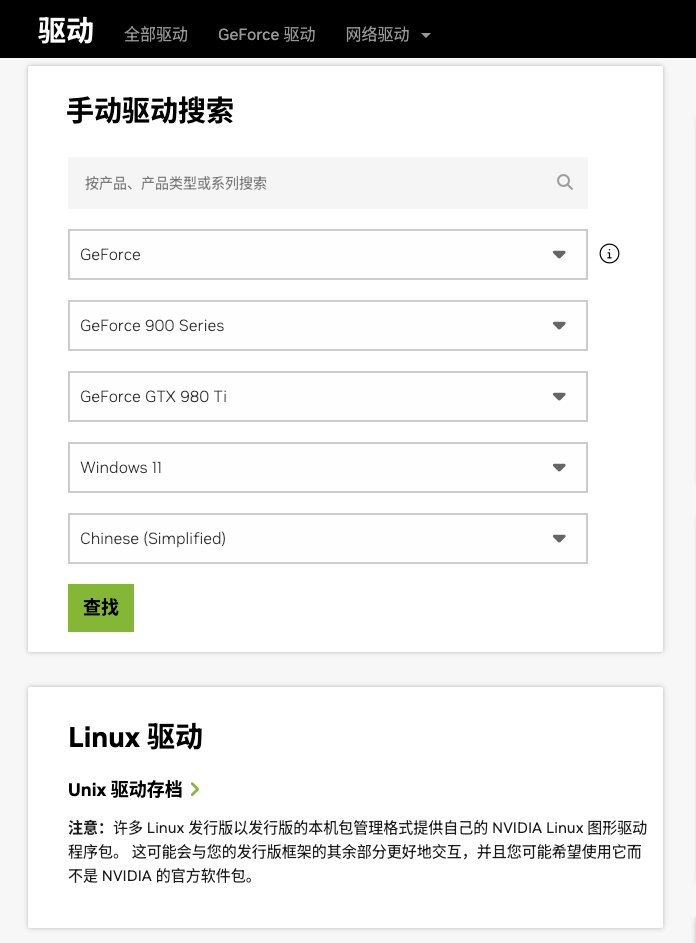