# 1. 001-Java开发环境搭建

## 1.1. 安装JDK

Java Develop Kits 即 java 开发工具集，简称 JDK。

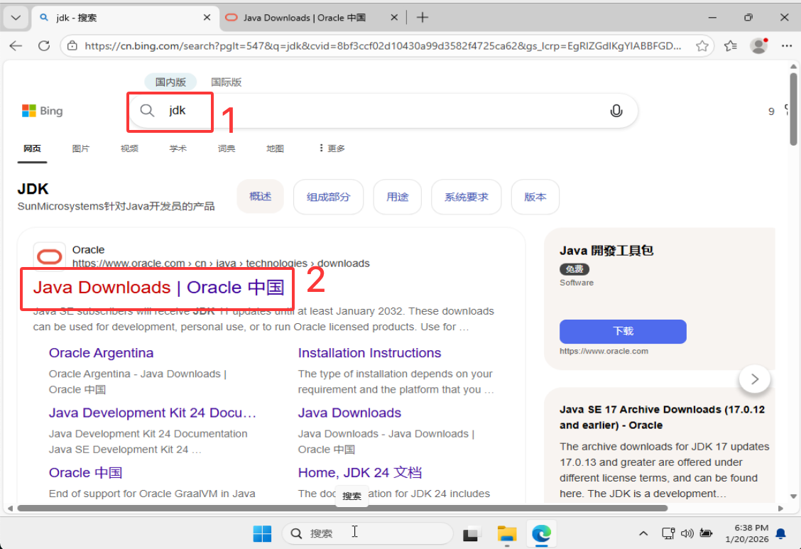
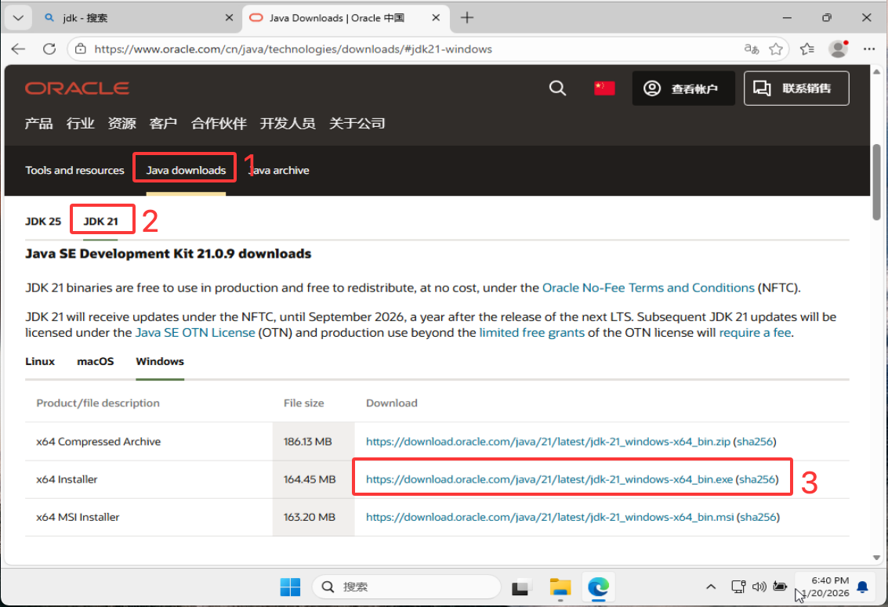
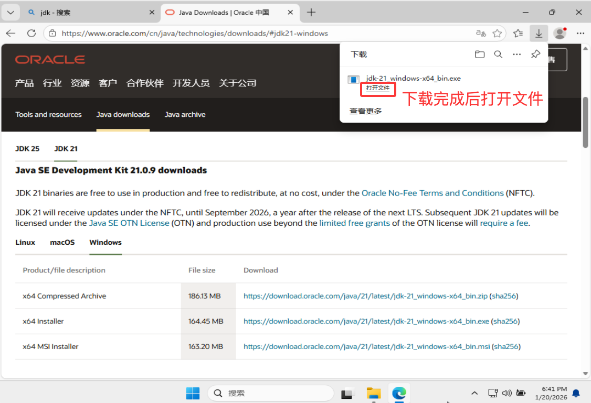
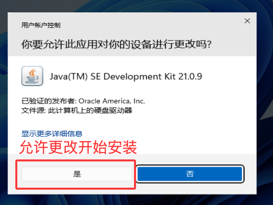
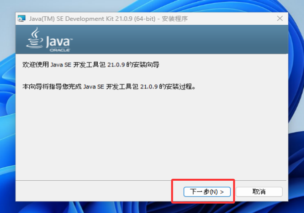
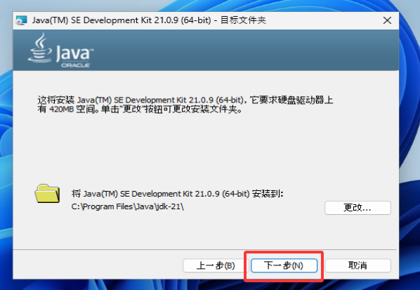
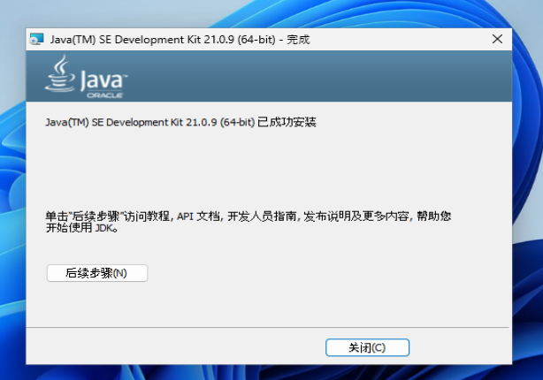
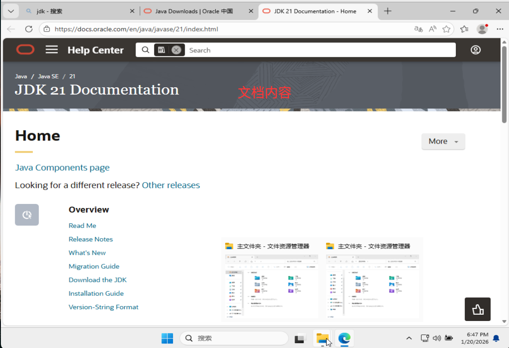

## 1.2. 安装 Intellji IDEA

安装好 JDK 之后，还要安装用于编写 java 代码的软件, 常用的有 ：Intellji IDEA、VisulStudioCode（即 VsCode）。

这里以 IDEA 为例。

### 1.2.1. 安装IDEA

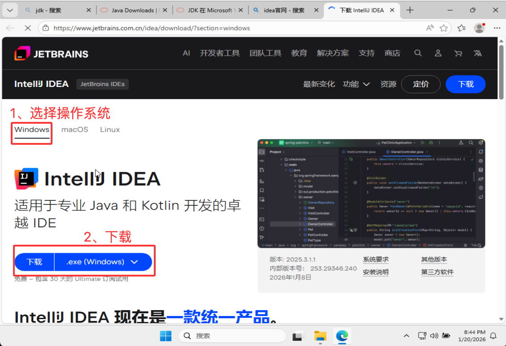

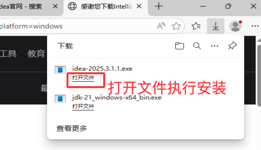

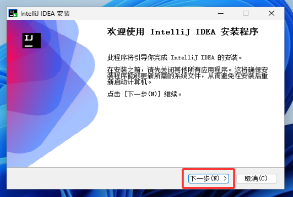
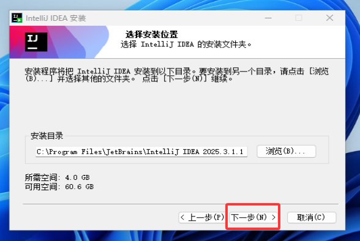

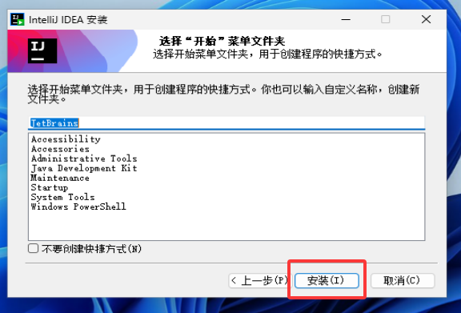
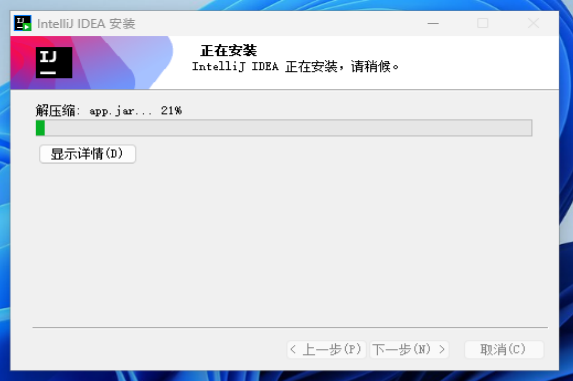
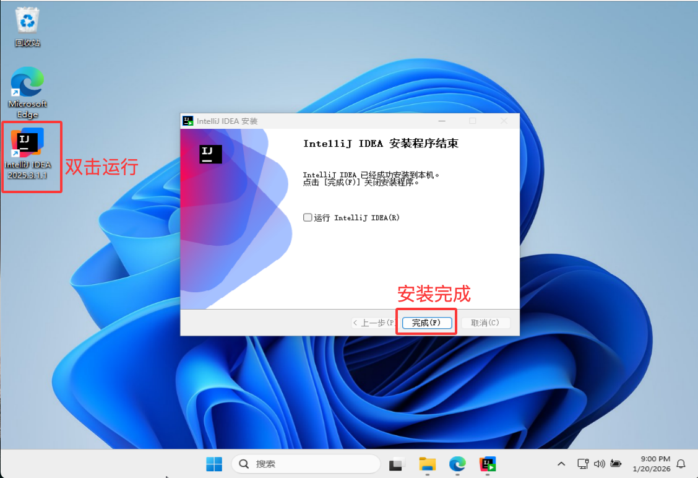

