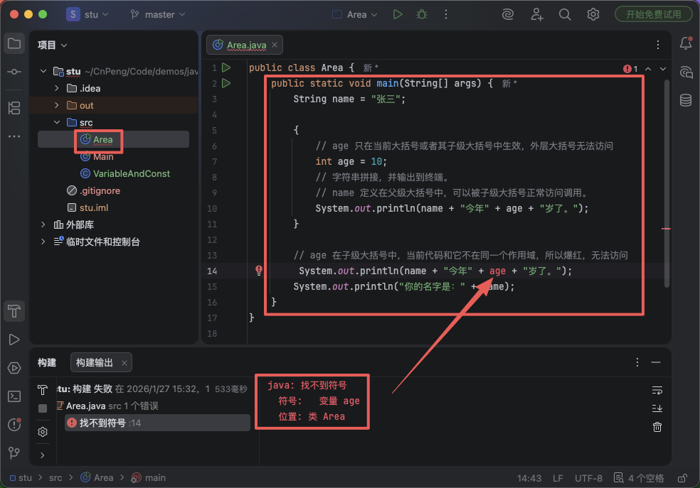
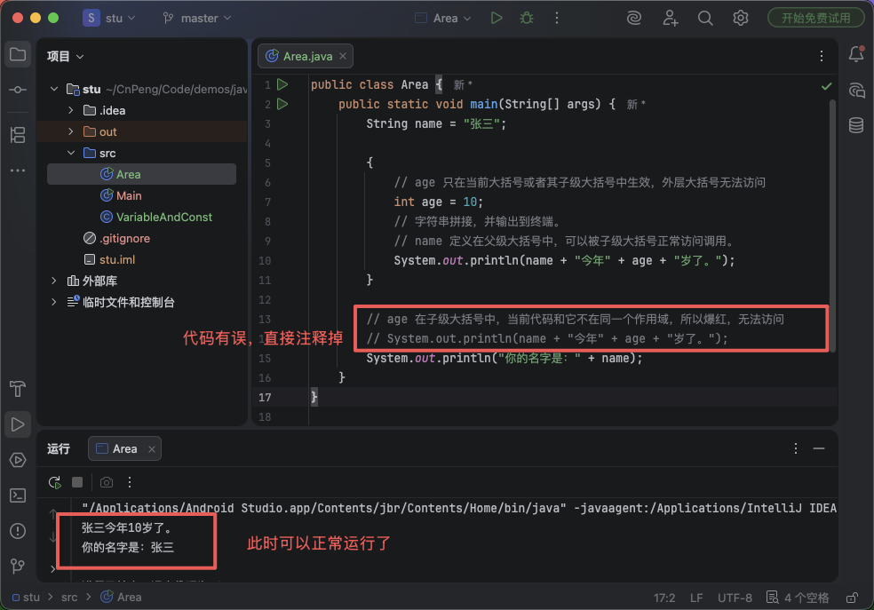

# 1. 004-变量常量和作用域


## 1.1. 变量

在程序运行过程中，某个标识符对应的值如果可以跟随条件发生变化，那么这个值就被称为**变量**，这个标识符就被称为**变量名**。

比如，你想喝果汁，然后你去楼下超市购买，一开始你想买的是桃汁，但由于你带的钱不够，所以你买了苹果汁。在这个例子中，桃汁、苹果汁就是变量，而 `果汁` 就是变量名。

变量定义的格式：`数据类型 变量名 = 变量值;` 。（注意：末尾的 `;` 表示一行代码的结束，这个必须要加上）

示例：

```java
/* 定义一个变量，该变量的数据类型为 String , 变量名为 juice, 变量值为 "桃汁".
 你一开始想喝桃汁，所以我们给变量 juice 的初始值是 "桃汁"。*/
String juice = "桃汁";

// 但你带的钱不够买 "桃汁",所以你买了 "苹果汁"。我们变更 juice 的值为 "苹果汁"。
juice = "苹果汁";
```

或者，就像你的年龄，每一年都会变化。具体的年龄值就是变量，`年龄` 这个标识符就是 `变量名`。

示例：

```java
// 今年你10岁了。年龄是一个数字，所以这里用 int 类型。
int age = 10;

// 明年你的年龄增加了一岁，所以就是 11 岁。
age = 11;
```

## 1.2. 常量

在程序运行过程中，标识符对应的值不会跟随条件变更，那么这个值就被称为**常量**，这个标识符就被称为**常量名**。

比如，你的生日就是一个常量，从你出生那一刻起，你的生日就固定了。它不会随着你长大而变更。

常量定义的格式：`final 数据类型 常量名 = 常量值;`。`final` 表示最终的，不会变更的，定义常量时需要添加该关键字。常量名通常要全大写，多个单词使用下划线连接。

示例：

```java
// 你的生日是 2015年6月5日，这是一个不会再变更的数据。所以定义为常量。
final String YOUR_BIRTHDAY = "2015-06-05";
```

## 1.4. 作用域

对于所有的变量和常量，我们都必须先定义再使用，但它们只在一定的范围内可以被调用，这个范围就称为作用域。

在编写 java 代码时，代码块需要用大括号（`{ }`）包裹，大括号内部可能还会嵌套多个子级大括号。那么，在父级大括号中定义的变量和常量，可以在整个父级及子级大括号中被调用；而在子级大括号中定义的常量和变量，无法被父级大括号中代码调用。

> 一句话概括：爹是无私的，爹的东西可以给儿子、孙子用。但是儿子是自私的，儿子的东西不给爹。——这个不孝子啊。。。

```java
public class Area {
    public static void main(String[] args) {
        String name = "张三";

        {
            // age 只在当前大括号或者其子级大括号中生效，外层大括号无法访问
            int age = 10;
            // 字符串拼接，并输出到终端。
            // name 定义在父级大括号中，可以被子级大括号正常访问调用。
            System.out.println(name + "今年" + age + "岁了。");
        }

        // age 在子级大括号中，当前代码和它不在同一个作用域，所以爆红，无法访问
        // System.out.println(name + "今年" + age + "岁了。");
        System.out.println("你的名字是：" + name);
    }
}
```

* 报错的视图：



* 注释掉有误的代码后，可以正常运行了：

