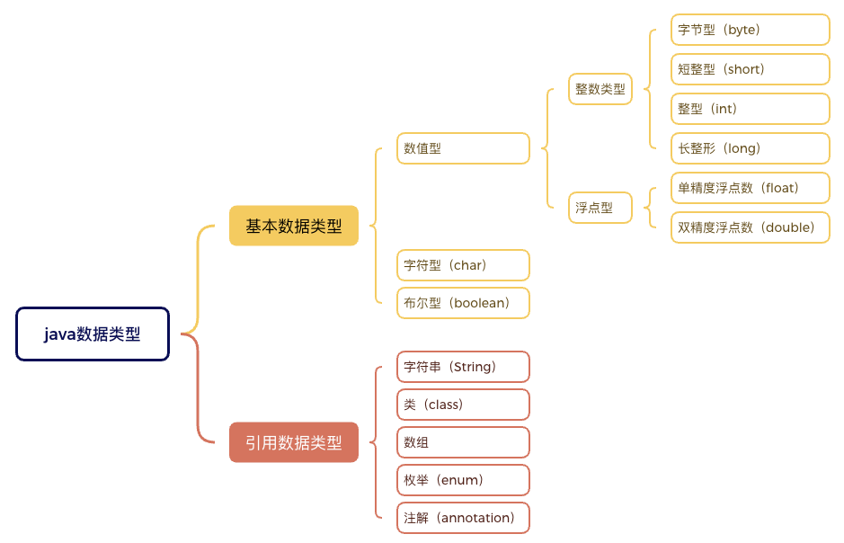

# 1. 005-数据类型

数据类型其实就是对数据的一个分类。数字属于数值类型，文本属于字符串类型，对和错属于布尔类型，类、接口等属于引用类型。

在 java 语言中，数据类型的划分如下：




## 1.1. 基本数据类型

### 1.1.1. 数值型

#### 1.1.1.1. 整数类型

整数类型用于存储整数数值。

根据可表示的数据范围的不同划分为四个子类型：字节型（byte）、短整型（short）、整型（int）、长整形（long）。

类型 | 占用的内存空间 | 可表示的数值范围 | 示例 | 比喻
---|---|---|---|---
byte | 8位（1个字节） | -128 到 127  | byte num = 1; | 铅笔盒
short | 16位（2个字节）| -32,768 到 32,767 | short shorNum = 2; | 小书包
int | 32位（4个字节） | -2,147,483,648 到 2,147,483,647 | int num = 3; | 大书包
long | 64位（8个字节）| -9,223,372,036,854,775,808 到 9,223,372,036,854,775,807 | long bigNum = 3147483647L ; | 行李箱


注意，在为 long 类型的变量赋值时，末尾需要添加 `L` 或 `l`, 说明值是一个 long 类型的数据，示例如下：

```java
// 值 3147483647 超过了 int 的取值范围，后面必须加上 L 或 l
long num = 3147483647L;
// 值 2015 未超出 int 的取值范围，后面的 L 可加可不加。
long num = 2015L;
// 值 2015 未超出 int 的取值范围，后面的 L 可以省略。
long num = 2015;
```

#### 1.1.1.2. 浮点类型（小数）

浮点类型用于存储小数。

根据可表示的数据范围和精确度的不同可以分为两个子类型：单精度浮点数（float）、双精度浮点型（double）

类型 | 占用的内存空间 | 精确度 | 示例 |
---|---|---|---
float | 32位（4个字节）| 小数的整体长度大约为 6-7位| float num = 3.14F;
double | 64位（8个字节）| 小数的整体长度大约为15-16位 | double num = 3.14;

在 java 中，小数会被默认为 double 类型，所以在为 float 类型的变量赋值时，必须在数值后面添加 `F` 或 `f` 后缀。

为了更清晰的区分 float 和 double 类型的数据，在为 double 类型变量赋值时，也可以在数值末尾添加 `D` 或 `d` 后缀。

### 1.1.2. 字符型

字符类型用于存储一个单一的字符。

`char` 类型的值需要使用英文单引号包括，如 `'a'`。

也可以将 `char` 类型的变量赋值为 0~65535 范围内的整数，计算机会自动将这些整数转换为对应的字符。

示例：

```java
// 定义一个 char 类型的变量，变量名为 c, 变量值为 'a'
char c = 'a';

// 定义一个 char 类型的变量，变量名为 c2, 变量值为 97, 在程序编译和运行时计算机会自动转换为 'a'
char c2 = 97;
```

### 1.1.3. 布尔类型

布尔类型用来表示对或错（也可以称为真或假）。

在 java 中，用 `true` 表示 对的，真的；用 `false` 表示错误的，假的。也就是说， boolean 类型的数据只有两个取值，true 和 false 。

示例：

```java
// 定义一个 boolean 类型的变量，变量名为 flag，变量初始值为 true.
boolean flag = true;

// 改变 flag 的值为 false
flag = false;
```

## 1.2. 引用数据类型

### 1.2.1. 字符串

#### 1.2.1.1. 字符串

字符串类型用于存储多个字符，也就是一段文本。

字符串类型的值需要使用英文的双引号进行包裹。

示例：

```java
// 定义一个字符串类型的变量，变量名为 name, 变量初始值为 "张三".
String name = "张三";

// 修改 name 的值为 "李四"
name = "李四";
```

#### 1.2.1.2. 字符串的拼接

在实际编码过程中，我们可能需要将多个内容拼接成一个字符串，常用的拼接方式有如下几种：`+`，`StringBuilder.append()`、`String.format()`

##### 1.2.1.2.1. `+`操作符

这种方式是最简单也是最常用的，但不适合在循环或者数据较大时使用。

示例：

```java
public class StringType {
    public static void main(String[] args) {
        String name = "张三";
        int age = 10;

        System.out.println(name + "今年" + age + "岁了。");
    }
}
```

##### 1.2.1.2.2. StringBuilder.append()

这种方式编写时略微繁琐，但效率高，可以在循环中使用，也能兼容较大数据的处理。

```java
public class StringType {
    public static void main(String[] args) {
        String name = "张三";
        int age = 10;

        StringBuilder sb = new StringBuilder()
                .append(name)
                .append("今年")
                .append(age)
                .append("岁了");
        String msg = sb.toString();
        System.out.println(msg);
    }
}
```

##### 1.2.1.2.3. String.format()

```java
public class StringType {
    public static void main(String[] args) {
        String name = "张三";
        int age = 10;

        // 这里的 %s 、%d 称为占位符，先占个位置，然后后面传递需要展示的变量名称。
        String msg = String.format("%s今年%d岁了", name, age);
        System.out.println(msg);
    }
}

```

不同的占位符代表不同的数据类型，指定了占位符之后，后面传递的变量值类型必须与之匹配。

常用占位符及其代表的类型如下：

占位符 | 代表的数据类型
---|---
`%d` |整数（byte, short, int, long）
`%f` | 浮点数（float, double）
`%s` | 字符串
`%b` | 布尔值
`%c` |字符


### 1.2.2. 其他引用类型

类（class）、接口（interface）、数组（array）、枚举（enum）、注解（annotation）

> 后面再详细说明，此处只需要了解即可。

## 1.3. 基本数据类型和引用数据类型的理解

先讲一个小场景，每年过年你都会收到红包，当你收到的红包积攒的比较多的时候，爸爸妈妈给你留下一部分放在了存钱罐了，其他的存到了银行了。

存钱罐里的钱，你随时可以取用，但银行里的钱必须拿着银行卡去取出来，然后才可以用。

对于存钱罐里的钱，我们就可以类比为基本数据类型——你直接拥有的，随时可以取用的。

对于银行里的钱，我们就可以类比为引用数据类型——你必须先拿着银行卡到银行里取出来，然后才可以用。你手里直接拥有的是银行卡，而不是具体的钱。

对于数据类型，基本数据类型直接存储的是具体的数据值（存钱罐里的钱） ; 而引用类型存储的是一个内存地址，引用类型的数据在使用时必须先找到内存地址（类似于银行卡）, 然后再基于内存地址找到具体的值（去银行取钱）。

