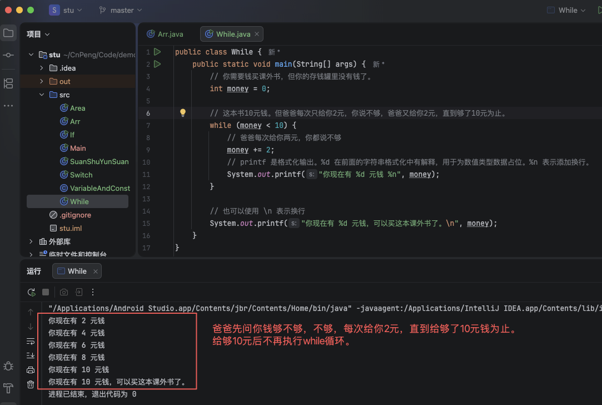
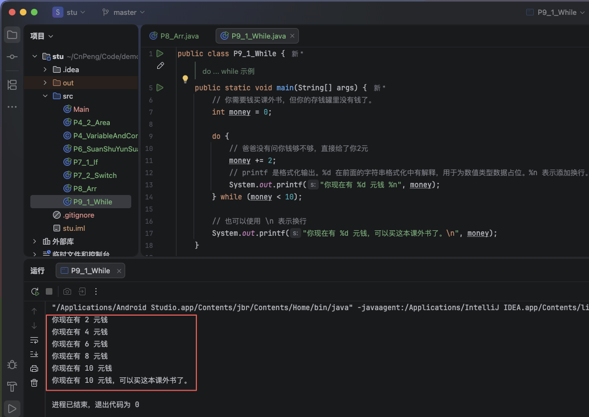
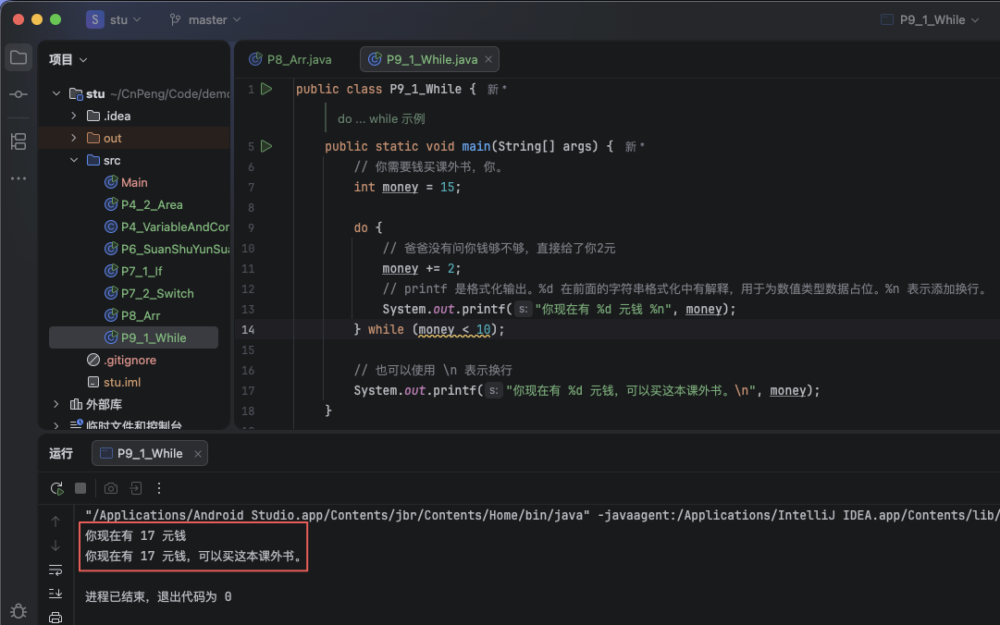

# 1. 09-循环语句

重复执行某个操作，并且满足一定条件后就可以停止，那么这个过程就叫做`循环`。

比如，你周一到周五都要去上学，放学之后要回家，这五天每天都要做同样的事情。一旦到了周六和周天，你就不用去学校了。这就是 `循环`

在 java 语言中，执行循环操作时有三种方式：while 语句、do...while 语句、for 语句。

## 1.1. while

`while` : `/ waɪl /` (conj. 连词)当……的时候。

`while` 语句用于循环执行某些代码，当条件满足时，就一直执行，直到条件不满足时才结束。


### 1.1.1. 格式

```java
while ( 循环条件 ) {
    // 需要执行的代码。这些代码也被称为 循环体。
}
```

### 1.1.2. 示例

你需要买一本10元的课外书，爸爸先问你钱够不够，你说不够，然后爸爸给了你2元，你说还不够，爸爸又给了你2元.....直到爸爸给了你10元，你说够了，爸爸就没有再给你钱。

```java
public class While {
    public static void main(String[] args) {
        // 你需要钱买课外书，但你的存钱罐里没有钱了。
        int money = 0;

        // 这本书10元钱。但爸爸每次只给你2元，你说不够，爸爸又给你2元，直到够了10元为止。
        while (money < 10) {
            // 爸爸每次给你两元，你都说不够
            money += 2;
            // printf 是格式化输出。%d 在前面的字符串格式化中有解释，用于为数值类型数据占位。%n 表示添加换行。
            System.out.printf("你现在有 %d 元钱 %n", money);
        }

        // 也可以使用 \n 表示换行
        System.out.printf("你现在有 %d 元钱，可以买这本课外书了。\n", money);
    }
}
```



## 1.2. do...while

`do` ：`/ duː; də /` (v. 动词)，执行，操作，做，干，行动。

`do...while` 表示先执行一次代码，然后再判断是否满足条件，如果满足条件继续执行，不满足则不再执行。

### 1.2.1. 格式

```java
do{
    // 需要执行的代码。（循环体）
}while(循环条件);
```

注意：`do...while` 语句中，循环条件后面要跟一个英文分号（`;`）

### 1.2.2. 示例

#### 1.2.2.1. 场景1

你需要买一本10元的课外书，爸爸没有问你钱够不够，直接就给了你2元，你说还不够，爸爸又给了你2元.....直到爸爸给了你10元，你说够了，爸爸就没有再给你钱。

```java
public class P9_1_While {
    public static void main(String[] args) {
        // 你需要钱买课外书，但你的存钱罐里没有钱了。
        int money = 0;

        do {
            // 爸爸没有问你钱够不够，直接给了你2元
            money += 2;
            // printf 是格式化输出。%d 在前面的字符串格式化中有解释，用于为数值类型数据占位。%n 表示添加换行。
            System.out.printf("你现在有 %d 元钱 %n", money);
        } while (money < 10);

        // 也可以使用 \n 表示换行
        System.out.printf("你现在有 %d 元钱，可以买这本课外书了。\n", money);
    }
}
```



#### 1.2.2.2. 场景2

你需要买一本10元的课外书，爸爸没有问你钱够不够，直接就给了你2元，你说自己的零花钱已经够了，爸爸就没有再给你更多的钱。——但是刚才给你的 2元 钱也没有要回来。

```java
public class P9_1_While {
    /**
     * do ... while 示例
     */
    public static void main(String[] args) {
        // 你需要钱买课外书，你。
        int money = 15;

        do {
            // 爸爸没有问你钱够不够，直接给了你2元
            money += 2;
            // printf 是格式化输出。%d 在前面的字符串格式化中有解释，用于为数值类型数据占位。%n 表示添加换行。
            System.out.printf("你现在有 %d 元钱 %n", money);
        } while (money < 10);

        // 也可以使用 \n 表示换行
        System.out.printf("你现在有 %d 元钱，可以买这本课外书。\n", money);
    }
}
```




### 1.2.3. 小结：while和do...while区别

通过上面的示例，你是否能发现 `while` 语句 和 `do...while` 语句有什么不同呢？

* `while` 先判断条件，如果满足条件才执行循环体。
* `do...while` 先执行一次循环体，然后再判断条件，如果满足条件再继续执行循环体。


