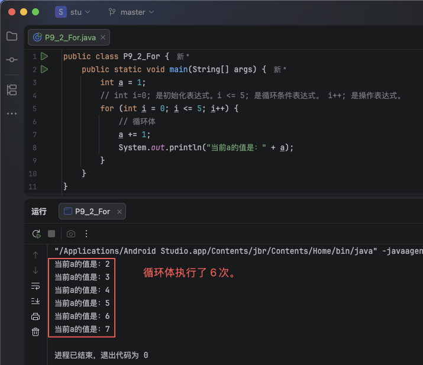
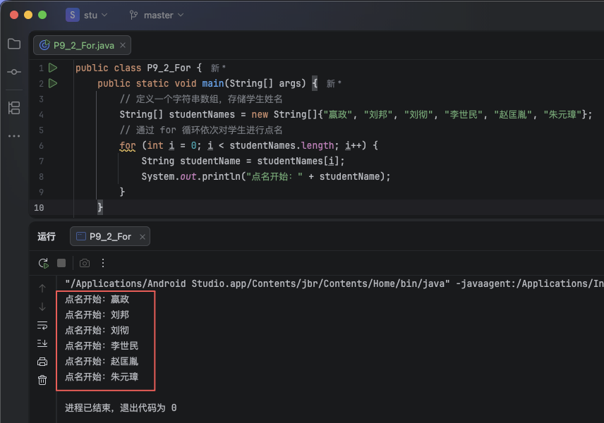
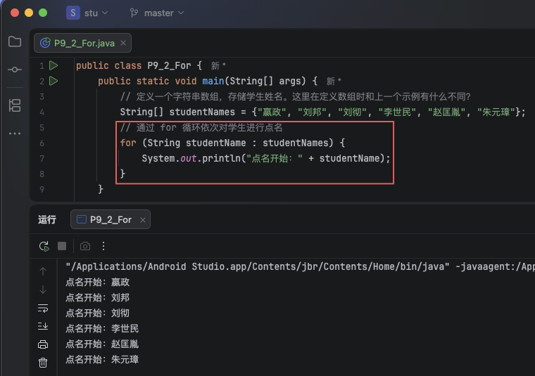
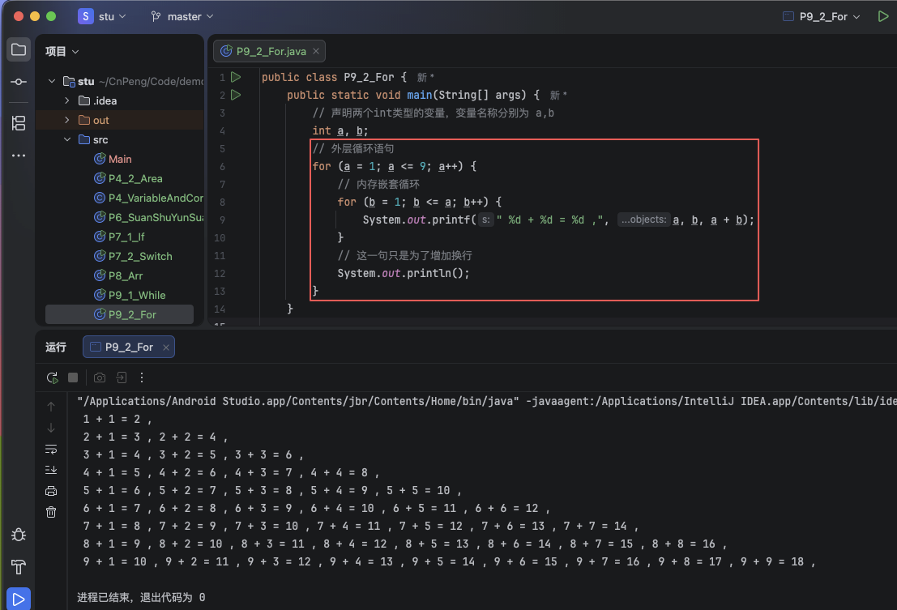

# 1. 10-循环语句-for


`for`：`/ fɔːr; fər /` （prep. 介词）因为，由于，为了，给，对于。

`for` 循环语句是最常用的，通常用于循环次数可知的情况。

## 1.1. 基本for

### 1.1.1. 格式

```java
for(初始化表达式; 循环条件; 操作表达式){
    // 需要执行的代码（循环体）。
}
```

在上面的格式中：

* for 内的三部分内容使用英文逗号 ( `;` ) 分隔。
* 代码在运行时，
    * 会先执行 `初始化表达式`，然后执行 `循环条件`，
    * 如果循环条件满足（结果为 true ），会执行循环体，然后再执行 `操作表达式`
    * 如果循环条件不满足 ( 结果为 false )，本段代码结束。


### 1.1.2. 示例

#### 1.1.2.1. 示例1

```java
public class P9_2_For {
    public static void main(String[] args) {
        int a = 1;
        // int i=0; 是初始化表达式。i <= 5; 是循环条件表达式。 i++; 是操作表达式。
        for (int i = 0; i <= 5; i++) {
            // 循环体
            a += 1;
            System.out.println("当前a的值是：" + a);
        }
    }
}
```




#### 1.1.2.2. 示例2

前面我们学习了数组，知道了数组是一组相同类型数据的集合。

在实际开发中，通常会使用 `for` 循环语句**依次取出**数组中的元素，然后在循环体中使用该元素，这种行为就被称为 `遍历`。

```java
public class P9_2_For {
    public static void main(String[] args) {
        // 定义一个字符串数组，存储学生姓名
        String[] studentNames = new String[]{"嬴政", "刘邦", "刘彻", "李世民", "赵匡胤", "朱元璋"};
        // 通过 for 循环依次对学生进行点名
        for (int i = 0; i < studentNames.length; i++) {
            String studentName = studentNames[i];
            System.out.println("点名开始：" + studentName);
        }
    }
}
```



## 1.2. 增强 for

`增强 for`循环语句可以理解为是对 `基本 for` 循环语句的一种简化。

### 1.2.1. 格式

```java
for(数据类型 变量名;可遍历的数据){
    // 循环体
}
```

* `可遍历的数据` 包含数组、集合等。
* `数据类型` 是指 `可遍历的数据` 中元素的数据类型。
* `变量名` 可以自由定义，循环体中会使用到该变量名。

### 1.2.2. 示例

```java
public class P9_2_For {
    public static void main(String[] args) {
        // 定义一个字符串数组，存储学生姓名。这里在定义数组时和上一个示例有什么不同？
        String[] studentNames = {"嬴政", "刘邦", "刘彻", "李世民", "赵匡胤", "朱元璋"};
        // 通过 for 循环依次对学生进行点名
        for (String studentName : studentNames) {
            System.out.println("点名开始：" + studentName);
        }
    }
}
```



## 1.3. 循环嵌套

循环嵌套是指在一个循环语句中再嵌套一个循环语句。

### 1.3.1. 格式

```java
for(初始化表达式; 循环条件; 操作表达式){
    // 需要执行的其他代码（循环体）。
    for(初始化表达式2; 循环条件2; 操作表达式2){
        // 需要执行的代码（循环体）。
    }
}
```

### 1.3.2. 示例


```java
public class P9_2_For {
    public static void main(String[] args) {
        // 声明两个int类型的变量，变量名称分别为 a,b
        int a, b;
        // 外层循环语句
        for (a = 1; a <= 9; a++) {
            // 内存嵌套循环
            for (b = 1; b <= a; b++) {
                System.out.printf(" %d + %d = %d ,", a, b, a + b);
            }
            // 这一句只是为了增加换行
            System.out.println();
        }
    }
}
```



