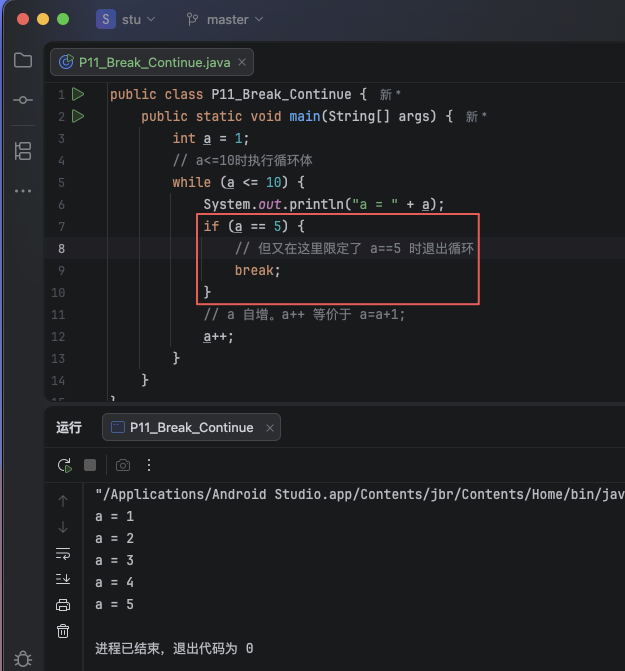
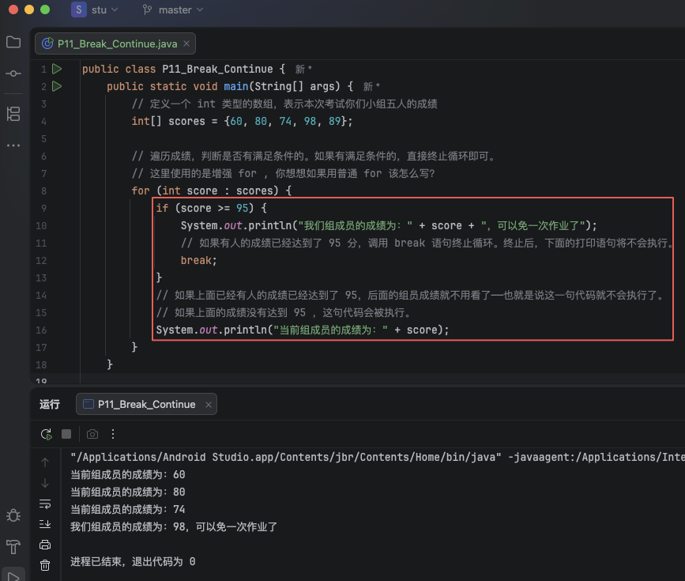
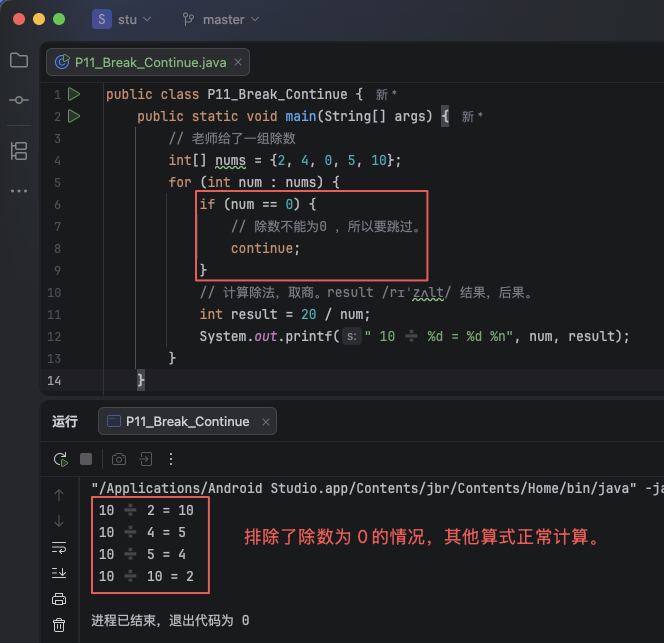

# 1. 11-循环语句-跳转

前面两节我们学习了循环语句，在前面的例子中，当满足条件时循环体会一直执行，直到不满足条件为止。

但在实际编码过程中，有时候我们期望在满足循环条件时的某个特定时机退出或者跳过本次循环，这就需要用到跳转语句。

在 java 中跳转语句分为：break 语句、continue 语句。

## 1.1. break语句

`break`：`/ breɪk /`（v. 动词）打破、打断、终止、断绝、休息。

在前面的 `switch` 选择语句中，我们已经使用过 `break` 语句了。在循环语句中，也可以使用 `break` 语句终止循环。

### 1.1.1. 示例1

```java
public class P11_Break_Continue {
    public static void main(String[] args) {
        int a = 1;
        // a<=10时执行循环体
        while (a <= 10) {
            System.out.println("a = " + a);
            if (a == 5) {
                // 但又在这里限定了 a==5 时退出循环
                break;
            }
            // a 自增。a++ 等价于 a=a+1;
            a++;
        }
    }
}
```



### 1.1.2. 示例2

昨天你们班级举行了数学单元测试，老师说如果你们学习小组有人的成绩不低于 95 分，那么你们小组就可以免一天作业。

```java
public class P11_Break_Continue {
    public static void main(String[] args) {
        // 定义一个 int 类型的数组，表示本次考试你们小组五人的成绩
        int[] scores = {60, 80, 74, 98, 89};

        // 遍历成绩，判断是否有满足条件的。如果有满足条件的，直接终止循环即可。
        // 这里使用的是增强 for , 你想想如果用普通 for 该怎么写？
        for (int score : scores) {
            if (score >= 95) {
                System.out.println("我们组成员的成绩为：" + score + "，可以免一次作业了");
                // 如果有人的成绩已经达到了 95 分，调用 break 语句终止循环。终止后，下面的打印语句将不会执行。
                break;
            }
            // 如果上面已经有人的成绩已经达到了 95，后面的组员成绩就不用看了——也就是说这一句代码就不会执行了。
            // 如果上面的成绩没有达到 95 ，这句代码会被执行。
            System.out.println("当前组成员的成绩为：" + score);
        }
    }
}
```



## 1.2. continue

`continue`：`/ kənˈtɪnjuː /` （v. 动词） 继续，延续。

`continue` 语句在循环语句中表示跳过本次循环，继续执行后面的循环。

### 1.2.1. 示例1

数学课上，考试给了一个被除数和几个除数，然后让你们计算商分别是多少。但是除数中包了 0 ，由于 0 不能作为除数，所以我们需要跳过。

```java
public class P11_Break_Continue {
    public static void main(String[] args) {
        // 老师给了一组除数
        int[] nums = {2, 4, 0, 5, 10};
        for (int num : nums) {
            if (num == 0) {
                // 除数不能为0 ，所以要跳过。
                continue;
            }
            // 计算除法，取商。result /rɪˈzʌlt/ 结果，后果。
            int result = 20 / num;
            System.out.printf(" 10 ➗ %d = %d %n", num, result);
        }
    }
}
```




## 1.3. 对比

* `break` : 终止整个循环。
* `continue` : 跳过本次循环，继续执行后面的循环。

