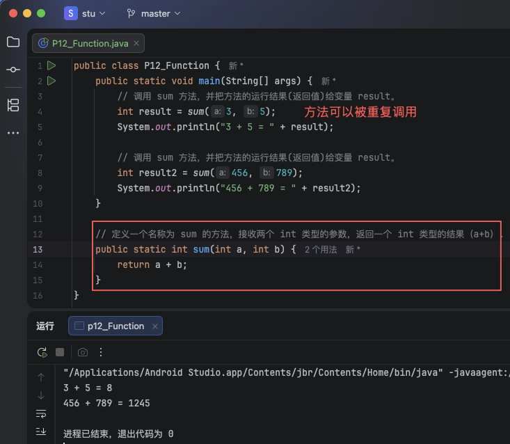
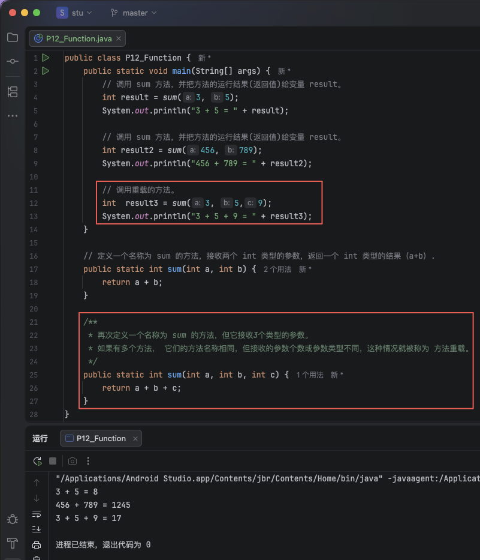
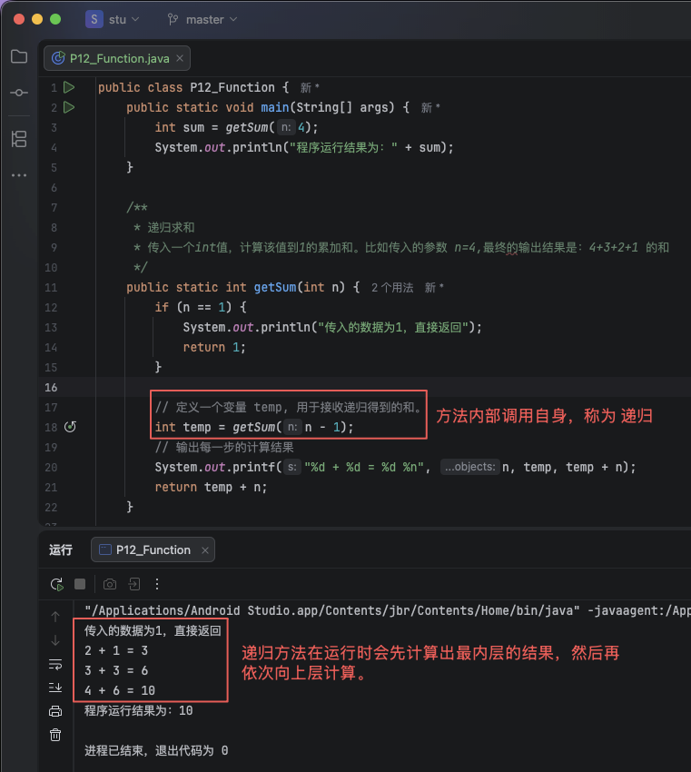
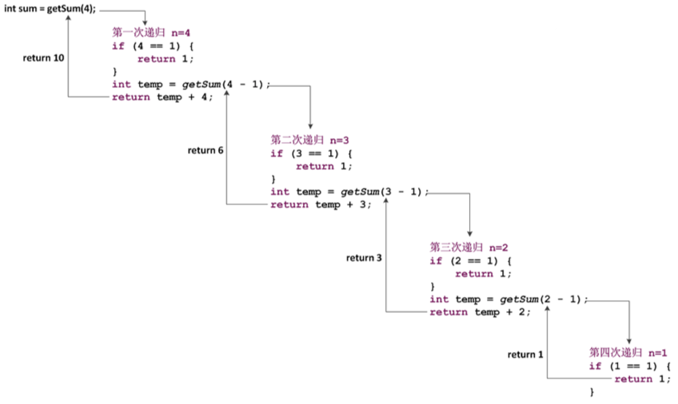

# 1. 013-方法

`方法` 其实就是用于实现特定功能的一段代码。这段代码通常是需要被重复使用的。

## 1.1. 方法定义

### 1.1.1. 方法的定义

一个完整的方法，通常包含：修饰符、返回值类型、方法名、方法参数、方法体、返回值。

方法的格式：

```java
修饰符 返回值类型 方法名(参数类型 参数名){
    // 方法体

    // return 语句
}
```

其实前面我们已经见过了方法，并且一直在使用——`main` 方法:

```java
public static void main(String[] args) {
    // 方法体
}
```

在上述代码中：

* 修饰符：`public static`。用于描述该方法的可见情况（是否可以在别的类中进行调用——类的概念后面的章节在具体讲解）。
* 返回值类型：`void`。表示方法执行后需要暴露的结果是什么类型的，`void` 表示不对外暴露结果。
* 方法名称：`main`。名称可以根据需要自由定义，在使用方法时会根据该名称进行调用。
* 参数类型：`String[]` 字符串数组。参数表示提供给方法的数据，参数类型标识提供给方法的数据的类型。
* 参数名称：`args`。名称可以根据需要自由定义，方法体内部会通过该名称使用传入的参数值。

### 1.1.2. 示例

```java
public class P12_Function {
    public static void main(String[] args) {
        // 调用 sum 方法，并把方法的运行结果(返回值)给变量 result。
        int result = sum(3, 5);
        System.out.println("3 + 5 = " + result);

        // 调用 sum 方法，并把方法的运行结果(返回值)给变量 result。
        int result2 = sum(456, 789);
        System.out.println("456 + 789 = " + result2);
    }

    // 定义一个名称为 sum 的方法，接收两个 int 类型的参数，返回一个 int 类型的结果（a+b）.
    public static int sum(int a, int b) {
        return a + b;
    }
}

```




## 1.2. 方法的重载

如果有多个方法，它们的**方法名称相同，但接收的参数个数或者参数类型不同**，这种情况就被称为**方法重载**。

在调用重载方法时，java 会根据传入的参数个数、参数类型自动判断调用的是哪一个方法。

```java
public class P12_Function {
    public static void main(String[] args) {
        // 调用 sum 方法，并把方法的运行结果(返回值)给变量 result。
        int result = sum(3, 5);
        System.out.println("3 + 5 = " + result);

        // 调用 sum 方法，并把方法的运行结果(返回值)给变量 result。
        int result2 = sum(456, 789);
        System.out.println("456 + 789 = " + result2);

        // 调用重载的方法。
        int  result3 = sum(3, 5,9);
        System.out.println("3 + 5 + 9 = " + result3);
    }

    // 定义一个名称为 sum 的方法，接收两个 int 类型的参数，返回一个 int 类型的结果（a+b）.
    public static int sum(int a, int b) {
        return a + b;
    }

    /**
     * 再次定义一个名称为 sum 的方法，但它接收3个类型的参数。
     * 如果有多个方法， 它们的方法名称相同，但接收的参数个数或参数类型不同，这种情况就被称为 方法重载。
     */
    public static int sum(int a, int b, int c) {
        return a + b + c;
    }
}
```



## 1.3. 方法的递归

`方法的递归`是指**在方法内部调用自身**的过程。

递归必须要有结束条件，否则会陷入无限递归的状态，导致程序无法被结束。

> `recursion` : `/ rɪˈkɜːʃn /` 递归，循环。

```java
public class P12_Function {
    public static void main(String[] args) {
        int sum = getSum(4);
        System.out.println("程序运行结果为：" + sum);
    }

    /**
     * 递归求和
     * 传入一个int值，计算该值到1的累加和。比如传入的参数 n=4,最终的输出结果是：4+3+2+1 的和
     */
    public static int getSum(int n) {
        if (n == 1) {
            System.out.println("传入的数据为1，直接返回");
            return 1;
        }

        // 定义一个变量 temp, 用于接收递归得到的和。
        int temp = getSum(n - 1);
        // 输出每一步的计算结果
        System.out.printf("%d + %d = %d %n", n, temp, temp + n);
        return temp + n;
    }
}
```



递归方法运行过程示意图：



