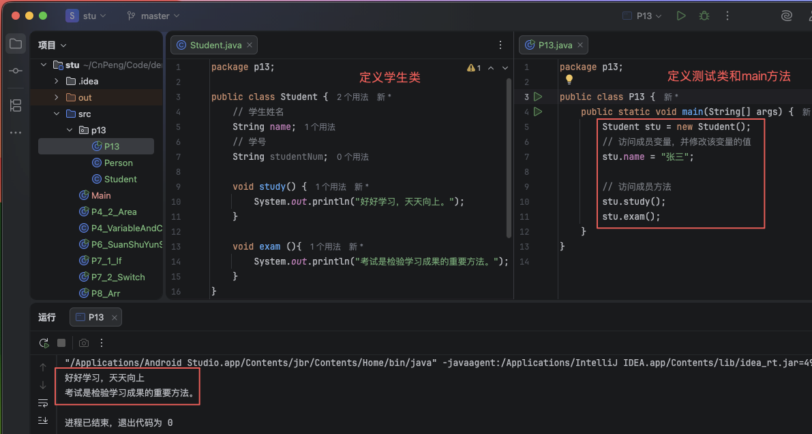
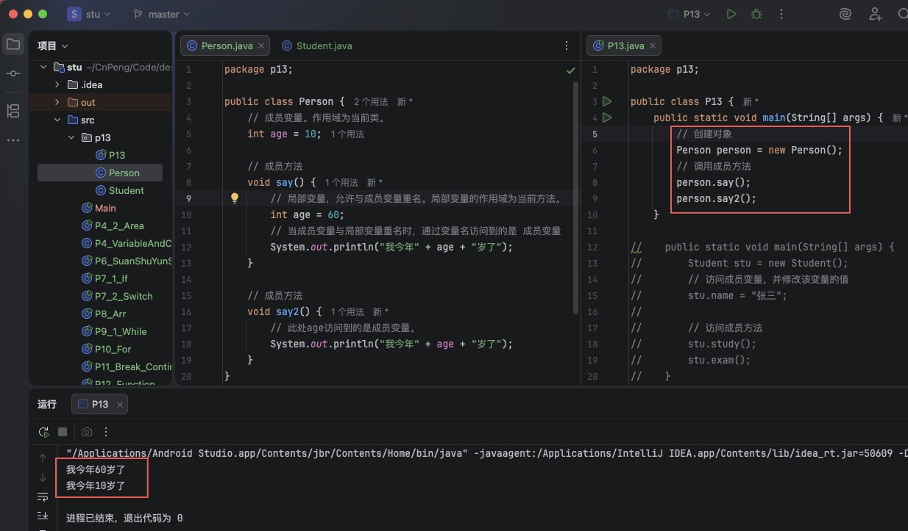
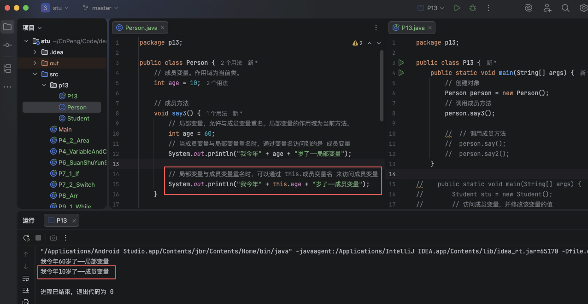

# 1. 013-类和对象

`类` 是对一类事物的概括和描述，该事物具有共同的特征和行为。
`对象` 则是某类事物中的具体个体。

比如，"学生" 这个词就是对正在接受知识教育的人的概括，我们就可以把 "学生" 看做 `类`；而你则就是 "学生" 中的一个具体的个体，那么，你就是这个 `对象`。

## 1.1. 类的定义

一个完整的类通常需要包括三个部分：名称、特征、行为。以 "学生" 为例，

* 名称就是 "学生"，这个名称在 java 中称为 `类名`。
* 特征就是指可以用于描述学生的一些信息，比如学校、姓名、班级、学号等。这些信息在 java 中被称为 `属性`。
* 行为就是指学生可以做的事情，比如上课、背书、考试等。这些行为在 java 中被称为 `方法`。

定义类时的基本格式：

```java
class 类名 {
    属性值类型 属性名称;

    返回值 方法名(参数类型 参数名称){
        // 方法体的具体实现
    }
}
```

示例：

```java
public class Student {
    // 学生姓名
    String name;
    // 学号
    String studentNum;

    void study() {
        System.out.println("好好学习，天天向上。");
    }

    void exam (){
        System.out.println("考试是检验学习成果的重要方法。");
    }
}
```


## 1.2. 对象的创建与使用

### 1.2.1. 对象的创建

我们定义了类之后，要想使用这个类，需要先创建类的具体个体——也就是`对象`。

在 java 中，使用 `new` 这个关键字来创建对象，格式如下：

```java
类名 对象名称 = new 类名();
```

以上面的 Student 为例，通过下面的代码就可以创建对象：

```java
// 声明一个 Student 类型的变量，变量名为 stu
Student stu = new Student();
```

在前面的 `数据类型` 中我们已经知道 类 属于引用数据类型，所以我们通过 `new Student()` 构建了对象之后，实际拿到的是该对象在内存中的地址，然后我们又把这个地址值给了变量 `stu`。


### 1.2.2. 对象的使用

创建对象之后，我们就可以通过对象来访问对象中的成员变量、成员方法。

格式：`对象名称.对象成员`

示例：

```java
// 再定义一个类，并在其中声明 main 方法，在该方法中访问 Student 
public class P13 {
    public static void main(String[] args) {
        // 创建对象
        Student stu = new Student();
        // 访问成员变量，并修改该变量的值
        stu.name = "张三";

        // 访问成员方法
        stu.study();
        stu.exam();
    }
}
```



### 1.2.3. 对象的回收

> 了解即可。

我们前面已经知道，对象创建之后就会占用一定的内存空间，然而计算机的内存是有限的，所以，当对象使用完成之后，就需要回收清理掉，否则就会占满内存。

那么，什么样的对象才会被认为是使用完成了呢？——当接收对象的变量被赋予的新的值时，原先的这个对象就会被认为使用完成了。

回收的过程是自动执行的，不需要人为干预。

回收通常是在内存快满的时候执行，但在某些情况下，我们也可以通过 `System.gc()` 通知系统立即进行垃圾回收。


## 1.3. 成员变量和局部变量

### 1.3.1. 成员变量和局部变量

在类中声明的变量被称为 `成员变量`，在类中声明的方法被称为 `成员方法`；在方法内部声明的变量，被称为 `局部变量`。

* 成员变量的作用域为当前整个类，该类中的任何方法都可以调用成员变量。
* 局部变量的作用域为当前方法，仅在当前方法中有效，其他方法无法调用。
* 成员变量和局部变量允许重名。二者重名时，方法中访问到的将是局部变量。

```java

public class Person {
    // 成员变量。作用域为当前类。
    int age = 10;

    // 成员方法
    void say() {
        // 局部变量，允许与成员变量重名。局部变量的作用域为当前方法。
        int age = 60;
        // 当成员变量与局部变量重名时，通过变量名访问到的是 成员变量
        System.out.println("我今年" + age + "岁了");
    }

    // 成员方法
    void say2() {
        // 此处age访问到的是成员变量。
        System.out.println("我今年" + age + "岁了");
    }
}
```




### 1.3.2. this 关键字

在上面的例子中，成员变量和局部变量重名了，每次我们在 `say()` 中调用 `age` 时访问到的都是局部变量，如果我们想要访问成员变量 `age` 就需要会用 `this` 关键字。

示例：

```java
public class Person {
    // 成员变量。作用域为当前类。
    int age = 10;

    // 修改 `Person` 类，增加 `say3()` 方法：
    void say3() {
        // 局部变量，允许与成员变量重名。局部变量的作用域为当前方法。
        int age = 60;
        // 当成员变量与局部变量重名时，通过变量名访问到的是 成员变量
        System.out.println("我今年" + age + "岁了——局部变量");

        // 局部变量与成员变量重名时，可以通过 this.成员变量名 来访问成员变量
        System.out.println("我今年" + this.age + "岁了——成员变量");
    }
}
```


```java
public class P13 {
    public static void main(String[] args) {
        // 创建对象
        Person person = new Person();
        // 调用成员方法
        person.say3();
    }
}
```



