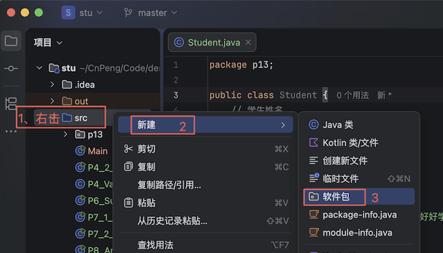
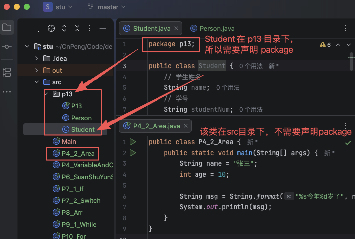
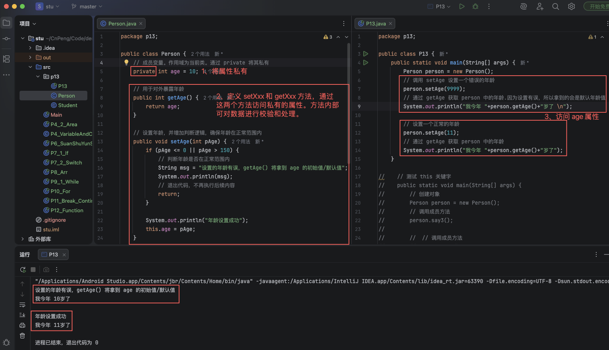
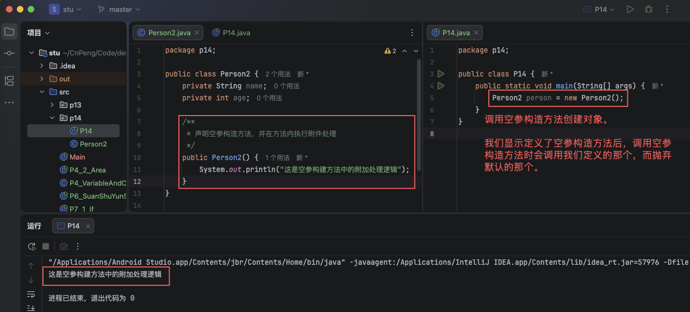
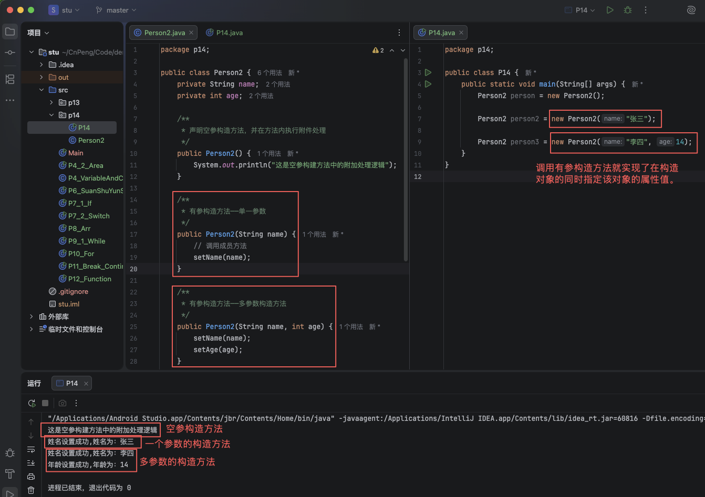

# 1. 014-类的封装

## 1.1. 包

在 java 中存放代码的文件夹（也叫 目录）被称为`包`。

默认情况下，代码存放在 `src` 目录下。当代码比较多时，为了方便管理，我们也可以在该目录下自行新建其他子目录，目录名也需要遵循标识符规则（想不起来了？再看看前面的章节）。



`src` 包中的 java 文件在开头不需要声明 `package` ，但其他包中的 java 文件必须在文件开头声明 `package 包名`。




## 1.2. 可见属性修饰符

在学校里面，你的姓名和班级是公开的，大家都可以知道你在几年级几班叫什么名字；但也有一些是不公开的，比如你心底里的小秘密。

同样的， java 中的 类、属性、方法 也具有这种可见性限制，有一些是别人可以任意获取和访问的，有一些是有条件访问的，还有一些是不公开私有的。

在 java 中，用于描述可见性限制的关键字就被称为 `可见属性修饰符`。可见属性修饰符及其含义如下：

可见属性修饰符| 含义 | 场景类比
---|---|---
private | 私有的，不公开的，只有自己可以访问 | 你心底里的小秘密
default | 同一个包下可以访问 | 爸爸的工资属于家庭财产，家里的成员都可以使用。
protected | 同一个包下可以访问，子类也可以访问 | 等你长大了，有了自己的孩子，你的孩子也可以使用爸爸的工资。
public | 公开的，可以任意访问的 | 公交车是公共的，每个人都可以乘坐。

> `子类` 和 `父类` 类似于生活中的父子，子类继承了父类，子类还可以有自己的属性和方法。java 中使用 `extend` 来表示继承关系。 此处了解即可，具体内容后面再做讲解。

我们在定义类、属性、方法时，如果未指定可见属性修饰符，那么默认就是 `default`。


* private : `/ˈpraɪvət/` （adj. 形容词）私有的，自用的，私立的，私密的。
* default : `/ dɪˈfɔːlt /` （adj. 形容词）默认的，预设的。（n. 名词、v. 动词）违约、弃权、默认
* protected: `/ prəˈtektɪd /` (adj. 形容词) 受保护的。（v. 动词）保护；防卫（ protect 的过去分词）
* public ： `/ ˈpʌblɪk /` （adj. 形容词） 公众的，大众的；公共的，公用的；（n. 名词）公众，大众

## 1.3. 类的封装

为了避免调用方随意设置或修改属性值，确保属性值的正确性，我们需要用到 `类的封装`。（在获取数据时，也可以通过封装来实现对数据的处理。）

`类的封装`是指：将属性定义为私有的（`private`）, 并对外提供两个可以访问的 `public` 方法，一个用于设置属性值的 `setXxx()` 方法，一个用于获取属性值的 `getXxx()` 方法。

在 `setXxx()` 、`getXxx()` 方法中可以对数据进行校验和处理。

我们先来看一段代码：

```java
public class P13 {
    public static void main(String[] args) {
        Person person = new Person();
        person.age = 9999;
        person.say2();
    }
}
```

上面的代码中，设定了 person 对象的 age 为 9999 岁，这显然是不合理的，所以，我们需要在设置年龄时做校验和处理，以确保年龄的正确。

```java
public class Person {
    // 成员变量。作用域为当前类。
    private int age = 10;

    public int getAge() {
        return age;
    }

    public void setAge(int pAge) {
        if (pAge <= 0 || pAge > 150) {
            // 判断年龄是否在正常范围内
            System.out.println("设置的年龄有误");
            // 
            return;
        }

        System.out.println("年龄设置成功");
        this.age = pAge;
    }

    // 成员方法
    void say2() {
        // 此处age访问到的是成员变量。
        System.out.println("我今年" + age + "岁了");
    }
}
```

此时，我们再来设置年龄：

```java
public class P13 {
    public static void main(String[] args) {
        Person person = new Person();
        // 调用 setAge 设置一个错误的年龄
        person.setAge(9999);
        // 通过 getAge 获取 person 中的年龄.因为设置有误，所以拿到的会是默认年龄值
        System.out.println("我今年 "+person.getAge()+"岁了");

        // 设置一个正常的年龄
        person.setAge(11);
        // 通过 getAge 获取 person 中的年龄
        System.out.println("我今年 "+person.getAge()+"岁了");
    }
}
```

运行结果：




## 1.4. 构造方法

在上面的例子中，我们要想改变 Person 对象的 age 就需要先构建对象，然后再通过 `setAge` 方法设置，那么有没有办法在创建对象的时候就直接指定 age 呢？这就需要用到 `构造方法` 了。

在一个类中，如果某个方法的**方法名与类名相同，并且该方法没有返回值**，我们就可以认为这是一个 `构造方法`。

`构造方法` 用于创建类的对象，每个类都默认拥有一个空参构造方法，我们也可以根据实际需要定义具有参数的构造方法。

通过有参数的构造方法， 我们就可以实现在构造对象时直接指定属性值或者进行其他的处理。

### 1.4.1. 空参构造方法

空参构造方法就是指没有参数的构造放法。

空参构造方法通常不需要显示定义，前面的示例中，`new Person()` 就是调用了 Person 默认的空参构造方法。

如果想在创建对象时做一些额外处理，那么也可以显示声明空参构造方法并在方法中增加我们的处理逻辑。

```java
public class Person2 {
    private int age;

    public Person2() {
       System.out.println("这是空参构建方法中的附加处理逻辑");
    }
}
```

```java
public class P14 {
    public static void main(String[] args) {
        Person2 person = new Person2();
    }
}
```



### 1.4.2. 有参构造方法

有参构造方法就是指可以接收参数的构造方法，参数的个数及参数类型可以根据实际需要自行定义。

* 声明有参构造方法：

```java
public class Person2 {
    private String name;
    private int age;

    /**
     * 声明空参构造方法，并在方法内执行附件处理
     */
    public Person2() {
        System.out.println("这是空参构建方法中的附加处理逻辑");
    }

    /**
     * 有参构造方法——单一参数
     */
    public Person2(String name) {
        // 调用成员方法
        setName(name);
    }

    /**
     * 有参构造方法——多参数构造方法
     */
    public Person2(String name, int age) {
        setName(name);
        setAge(age);
    }

    public String getName() {
        return name;
    }

    public void setName(String name) {
        // String 是引用数据类型，默认值为 null 。
        // isEmpty 用于判断字符串是否为空字符串——""。
        if (null == name || name.isEmpty()) {
            System.out.println("姓名不能为空");
            // return 表示退出当前方法， 不执行后续逻辑
            return;
        }
        this.name = name;
        System.out.println("姓名设置成功,姓名为：" + name);
    }

    public int getAge() {
        return age;
    }

    public void setAge(int age) {
        if (age < 0 || age > 150) {
            System.out.println("年龄应在 0~150 之间");
            return;
        }
        this.age = age;
        System.out.println("年龄设置成功,年龄为：" + age);
    }
}
```

* 调用有参构造方法：

```java
public class P14 {
    public static void main(String[] args) {
        Person2 person = new Person2();

        Person2 person2 = new Person2("张三");

        Person2 person3 = new Person2("李四", 14);
    }
}
```

> 注意：因为代码有点长，所以截图中 Person2 中的 setXxx 和 getXxx 方法没有截出来。



### 1.4.3. 构造方法的重载

在前面学习 方法 时，我们知道了方法重载的概念——"同一个类中，方法名相同，参数个数或者参数类型不同"。

这里定义的多个构造方法也是方法重载。

