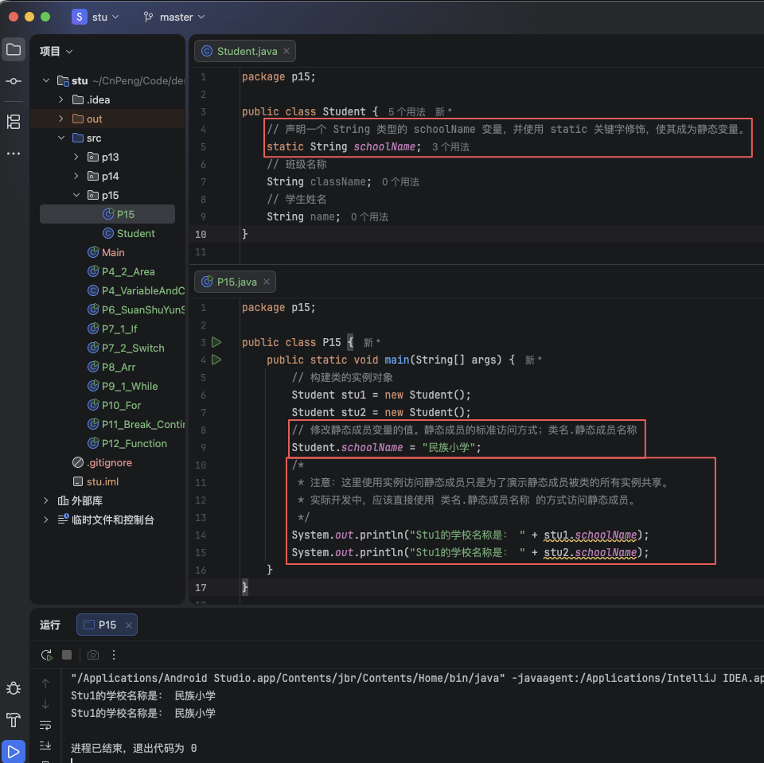
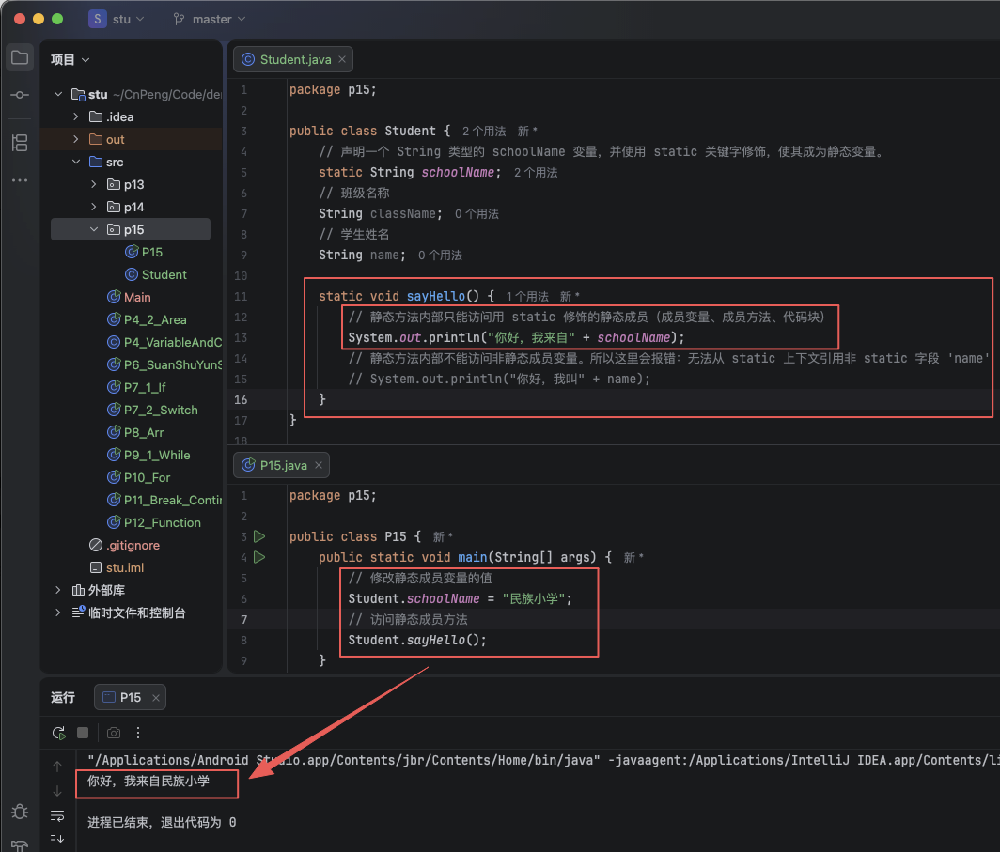
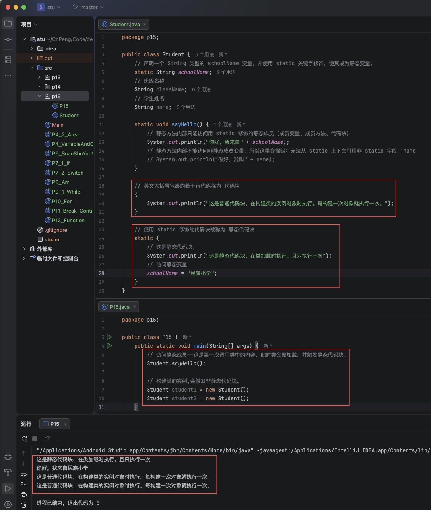
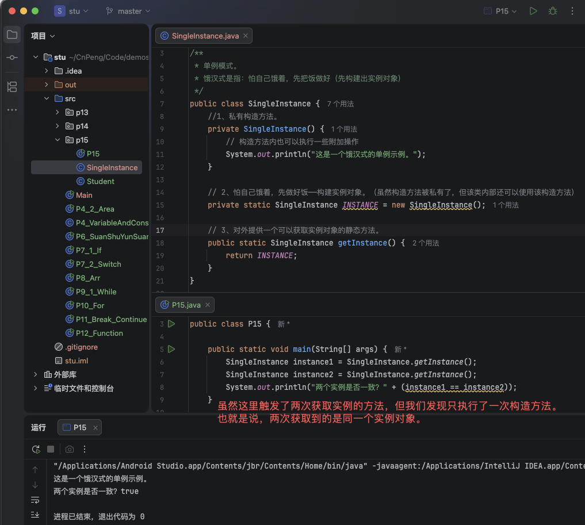
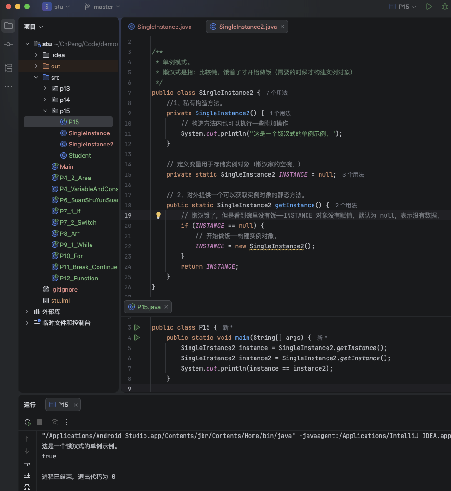

# 1. 015-static关键字


> static : `/ ˈstætɪk /` （ adj. 形容词 ) 静止的，停滞的；静电的；静力的；（计算机）（储存器，储存）静态的；（计算机）（程序，变量）静态的。

在 java 中有一个 static 关键字。用于修饰类的成员，如成员变量(属性)、成员方法以及代码块等。

## 1.1. 静态变量

在学习 《类和对象》 一节时，我们已经知道通过 new 关键字构建出类的实例对象后，才能为对象的成员变量（属性）进行赋值。

但在某些时候，我们期望某些特定的数据在内存中只有一份，并且能被该类的所有实例对象共享。

比如：你和你的朋友们都是民族小学的学生，假设我们定义一个学生类，那么构建了学生实例后，我们没有必要再手动为每个学生指定一次学校。我们完全可以定义一个学校名称变量让所有学生对象共享即可。

上面这种场景就需要用到 `静态变量`。

在 java 中，使用 `static` 关键字修饰的成员变量就被称为 `静态变量`。`静态变量` 被当前类的所有实例共享，可以使用 `类名.静态变量名` 的方式进行赋值或访问。

示例：

```java
public class Student {
    // 声明一个 String 类型的 schoolName 变量，并使用 static 关键字修饰，使其成为静态变量。
    static String schoolName;
    // 班级名称
    String className;
    // 学生姓名
    String name;
}
```

```java
public class P15 {
    public static void main(String[] args) {
        Student stu1 = new Student();
        Student stu2 = new Student();
        // 静态成员的标准方式方式；类名.静态成员名称
        Student.schoolName = "民族小学";
        /*
         * 注意：这里使用实例访问静态成员只是为了演示静态成员被类的所有实例共享。
         * 实际开发中，应该直接使用 类名.静态成员名称 的方式访问静态成员。
         */
        System.out.println("Stu1的学校名称是： " + stu1.schoolName);
        System.out.println("Stu1的学校名称是： " + stu2.schoolName);
    }
}
```



## 1.2. 静态方法

某些情况下，我们期望不用创建类的对象就可以直接使用类中的方法，那么此时就需要使用 `静态方法`。

在 java 中使用 `static` 关键字修饰的方法就被称为`静态方法`。其访问方式为：`类名.静态方法名`。

示例：

```java
public class Student {
    // 声明一个 String 类型的 schoolName 变量，并使用 static 关键字修饰，使其成为静态变量。
    static String schoolName;
    // 班级名称
    String className;
    // 学生姓名
    String name;

    static void sayHello() {
        // 静态方法内部只能访问用 static 修饰的静态成员（成员变量、成员方法、代码块）
        System.out.println("你好，我来自" + schoolName);
        // 静态方法内部不能访问非静态成员变量。所以这里会报错：无法从 static 上下文引用非 static 字段 'name'
        // System.out.println("你好，我叫" + name);
    }
}
```

```java
public class P15 {
    public static void main(String[] args) {
        // 修改静态成员变量的值
        Student.schoolName = "民族小学";
        // 访问静态成员方法
        Student.sayHello();
    }
}
```




## 1.3. 静态代码块

在 java 中，使用一对英文大括号 `{ }` 包裹起来的若干行代码被称为 `代码块`, 每次构建类的实例对象时都会执行一次。

在代码块前面在添加 `static` 关键字进行修饰，那么这个代码块就被称为 `静态代码块`。当类被加载时（比如：首次创建对象、调用静态方法、访问静态字段）），静态代码块就会执行，而且仅执行一次。


示例：

```java
public class Student {
    // 声明一个 String 类型的 schoolName 变量，并使用 static 关键字修饰，使其成为静态变量。
    static String schoolName;
    // 班级名称
    String className;
    // 学生姓名
    String name;

    static void sayHello() {
        // 静态方法内部只能访问用 static 修饰的静态成员（成员变量、成员方法、代码块）
        System.out.println("你好，我来自" + schoolName);
        // 静态方法内部不能访问非静态成员变量。所以这里会报错：无法从 static 上下文引用非 static 字段 'name'
        // System.out.println("你好，我叫" + name);
    }

    // 英文大括号包裹的若干行代码称为 代码块
    {
        System.out.println("这是普通代码块，在构建类的实例对象时执行。每构建一次对象就执行一次。");
    }

    // 使用 static 修饰的代码块被称为 静态代码块
    static {
        // 这是静态代码块。
        System.out.println("这是静态代码块，在类加载时执行。且只执行一次。");
        // 访问静态变量
        schoolName = "民族小学";
    }
}
```

```java
public class P15 {
    public static void main(String[] args) {
        // 访问静态成员——这是第一次调用类中的内容，此时类会被加载，并触发静态代码块。
        Student.sayHello();

        // 构建类的实例,会触发非静态代码块。
        Student student1 = new Student();
        Student student2 = new Student();
    }
}
```




## 1.4. 单例模式

在 java 编码过程中，对于某些特定的需求，有一些标准的写法，这些标准写法就被称为 `设计模式`。

`单例模式` 就是 `设计模式` 的一种。

`单例模式` 是指在设计某个类时，需要确保在整个程序运行期间有且只有一个实例对象。

实现单例模式有两个要点：私有构造、提供返回该类实例对象的静态方法或静态成员。

### 1.4.1. 懒汉式单例模式

懒汉式单例模式，是指先调用私有构造方法把实例对象构建出来，调用的时候拿到的是已经构建好的实例对象。（总怕自己饿着，所以先把饭做好。）


```java

/**
 * 单例模式。
 * 饿汉式是指：怕自己饿着，先把饭做好（先构建出实例对象）
 */
public class SingleInstance {
    //1、私有构造方法。
    private SingleInstance() {
        // 构造方法内也可以执行一些附加操作
        System.out.println("这是一个饿汉式的单例示例。");
    }

    // 2、怕自己饿着，先做好饭——构建实例对象。（虽然构造方法被私有了，但该类内部还可以使用该构造方法）
    private static SingleInstance INSTANCE = new SingleInstance();

    // 3、对外提供一个可以获取实例对象的静态方法。
    public static SingleInstance getInstance() {
        return INSTANCE;
    }
}
```

```java
public class P15 {

    public static void main(String[] args) {
        SingleInstance instance1 = SingleInstance.getInstance();
        SingleInstance instance2 = SingleInstance.getInstance();
        System.out.println("两个实例是否一致？" + (instance1 == instance2));
    }
}
```





### 1.4.2. 懒汉式单例模式

懒汉式单例模式，是指需要的时候再构建实例对象。（比较懒，饿着了才开始做饭。）

```java
/**
 * 单例模式。
 * 懒汉式是指：比较懒，饿着了才开始做饭（需要的时候才构建实例对象）
 */
public class SingleInstance2 {
    //1、私有构造方法。
    private SingleInstance2() {
        // 构造方法内也可以执行一些附加操作
        System.out.println("这是一个饿汉式的单例示例。");
    }

    // 定义变量用于存储实例对象（懒汉家的空碗。）
    private static SingleInstance2 INSTANCE = null;

    // 2、对外提供一个可以获取实例对象的静态方法。
    public static SingleInstance2 getInstance() {
        // 懒汉饿了，但是看到碗里没有饭——INSTANCE 对象没有赋值，默认为 null，表示没有数据。
        if (INSTANCE == null) {
            // 开始做饭——构建实例对象。
            INSTANCE = new SingleInstance2();
        }
        return INSTANCE;
    }
}
```

```java
public class P15 {
    public static void main(String[] args) {
        SingleInstance2 instance = SingleInstance2.getInstance();
        SingleInstance2 instance2 = SingleInstance2.getInstance();
        System.out.println(instance == instance2);
    }
}
```



### 1.4.3. 注意

上述两个实例代码演示了单例模式的基本形式，推荐使用饿汉式单例模式，这种天生就是线程安全的，不用考虑线程问题。而对于懒汉式单例模式，实际开发过程中还要考虑线程问题，具体实现会比上面的代码略微复杂。

线程的相关知识后面章节再做讲解。

> 补充场景类比：
> 假设有一家餐馆，
>
> * 懒汉式单例模式：大厨提前把饭菜做好，顾客来了之后不用等待，直接挑选自己喜欢的饭菜即可就餐。
> * 饿汉式单例模式：顾客到店之后，大厨才开始做饭菜，做好后再端给顾客。但是万一顾客比较多，可能会出现做错的情况（即线程问题）。

## 1.5. 总结

* 类会在被首次使用时加载到系统中，除非关闭系统，否则一直存在。
* 类中的静态成员也会在类加载时加载，并且除非系统关闭，否则一直存在。
* 类中静态变量的值可以发生变化。

场景类比：

类就像一座房子，静态成员就像房子里面的房间，静态变量的值就像房子内的东西。

房子建好之后就会一直存在，房子存在房间就存在，但房间内的东西是可以变化的。


