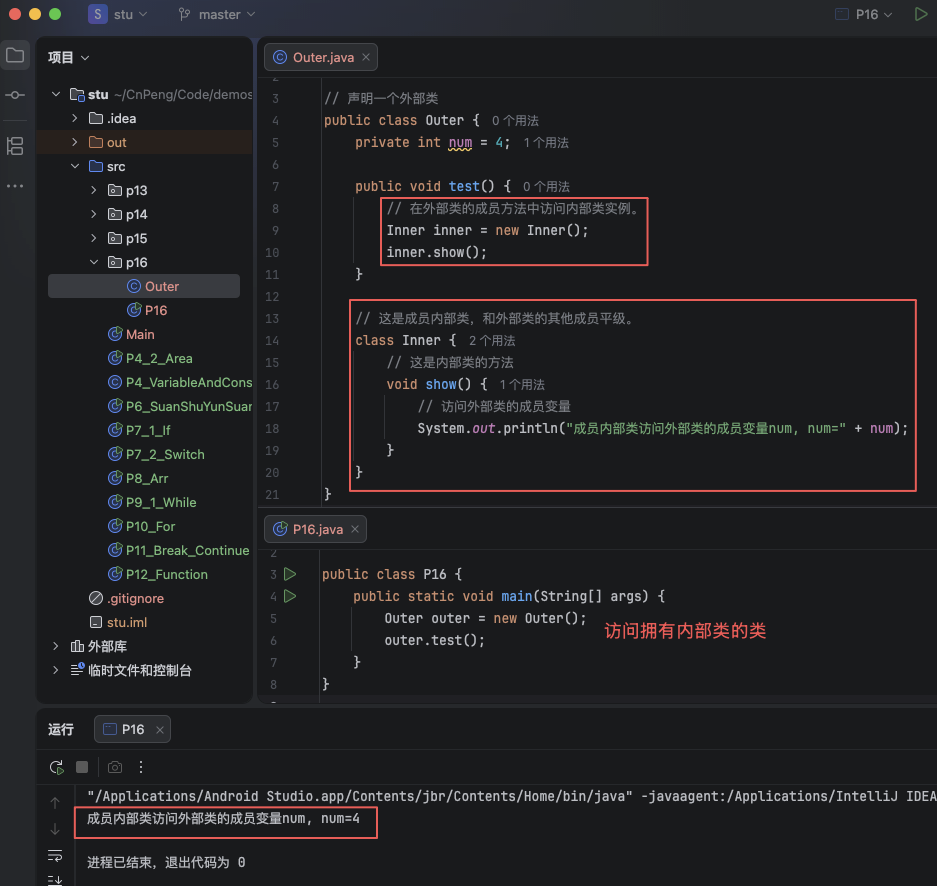
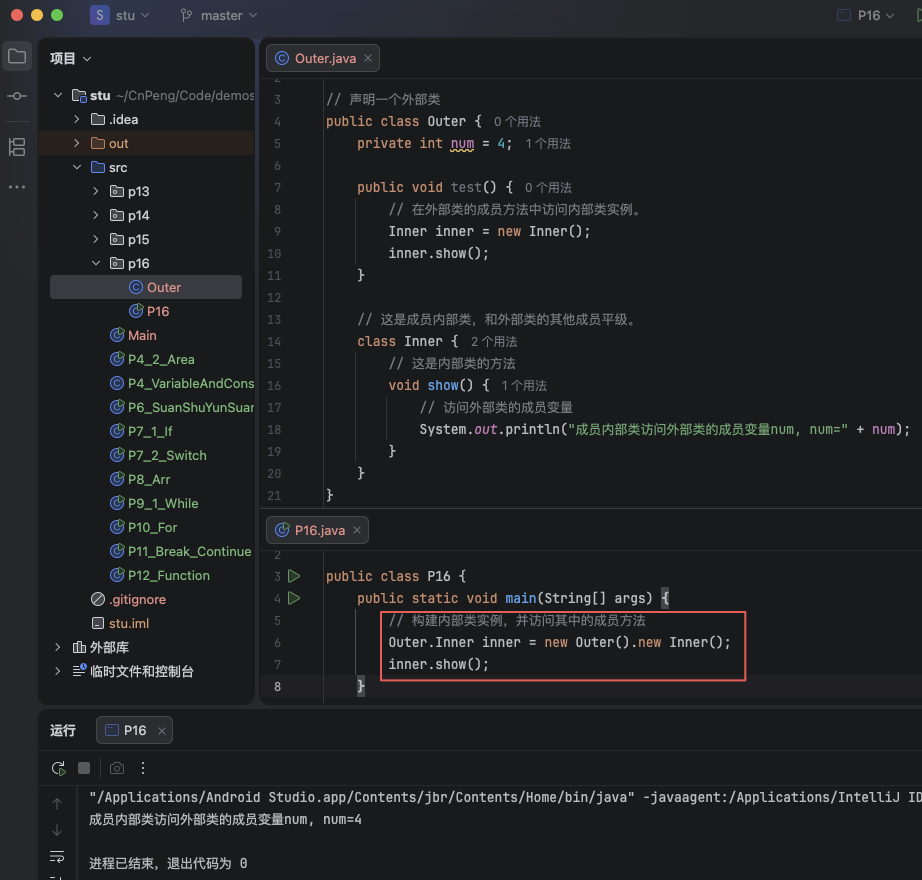
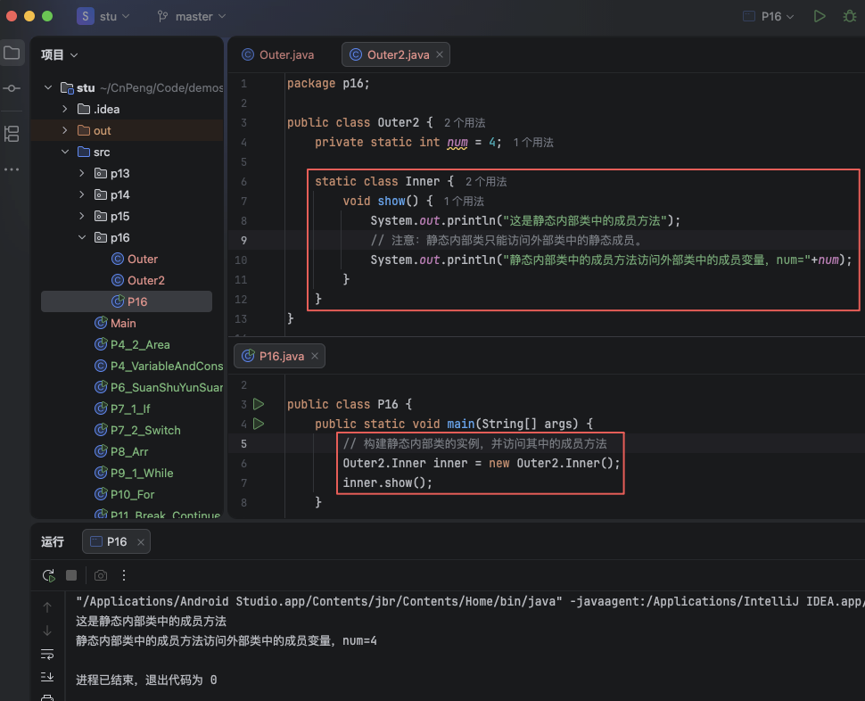
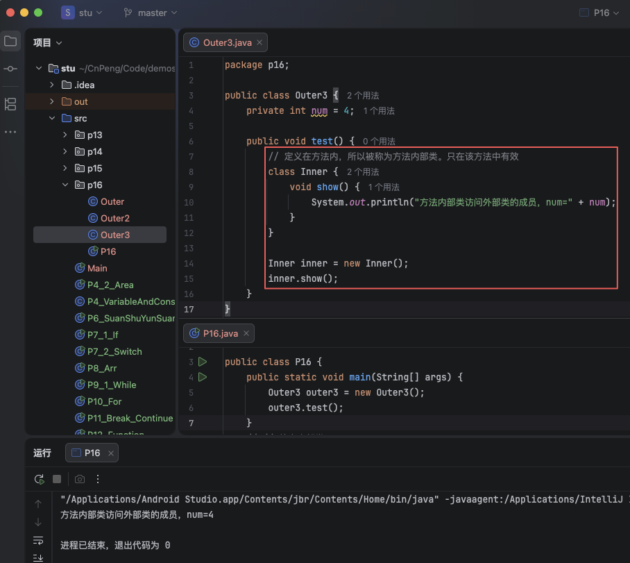

# 1. 016-内部类

在 java 中，允许在一个类的内部定义其他类，这个新定义的其他类就被称为`内部类`，原先的类就被称为 `外部类`。

根据内部类的位置、修饰符和定义的方式可以将内部类划分为：成员内部类、静态内部类、方法内部类。

## 1.1. 成员内部类

和外部类的其他成员平级的内部类被称为 `成员内部类`。

成员内部类可以访问外部类的所有成员。

### 1.1.1. 成员内部类


```java
// 声明一个外部类
public class Outer {
    private int num = 4;

    public void test() {
        // 在外部类的成员方法中访问内部类实例。
        Inner inner = new Inner();
        inner.show();
    }

    // 这是成员内部类，和外部类的其他成员平级。
    class Inner {
        // 这是内部类的方法
        void show() {
            // 访问外部类的成员变量
            System.out.println("成员内部类访问外部类的成员变量num, num=" + num);
        }
    }
}
```

```java
public class P16 {
    public static void main(String[] args) {
        Outer outer = new Outer();
        outer.test();
    }
}
```



### 1.1.2. 在其他类中访问成员内部类

如果想在其他类中访问某个类的内部类实例，必须确保该内部类没有被 `private` 修饰，然后通过如下格式创建其实例：

`外部类名.内部类名 变量名=new 外部类名().new 内部类名();`

也就是说，需要先构建外部类的实例，然后再构建内部类实例。

```java
public class P16 {
    public static void main(String[] args) {
        // 构建内部类实例，并访问其中的成员方法
        Outer.Inner inner = new Outer().new Inner();
        inner.show();
    }
}
```




## 1.2. 静态内部类

被 `static` 修饰的成员内部类就被称为 `静态内部类`。

它可以在不创建外部类实例对象的情况下被实例化。如下：

`外部类名.内部类名 变量名=new 外部类名.内部类名();`

```java
public class Outer2 {
    private static int num = 4;

    static class Inner {
        void show() {
            System.out.println("这是静态内部类中的成员方法");
            // 注意：静态内部类只能访问外部类中的静态成员。
            System.out.println("静态内部类中的成员方法访问外部类中的成员变量，num="+num);
        }
    }
}
```

```java
public class P16 {
    public static void main(String[] args) {
        // 构建静态内部类的实例，并访问其中的成员方法
        Outer2.Inner inner = new Outer2.Inner();
        inner.show();
    }
}
```



注意：

* 静态内部类仅能访问外部类的静态成员。
* 静态内部类中可以定义静态成员，但普通成员内部类中不允许定义静态成员。

## 1.3. 方法内部类

在成员方法中定义的类被称为 `方法内部类`，它只能在当前方法中被使用。

```java
public class Outer3 {
    private int num = 4;

    public void test() {
        // 定义在方法内，所以被称为方法内部类。只在该方法中有效
        class Inner {
            void show() {
                System.out.println("方法内部类访问外部类的成员，num=" + num);
            }
        }

        Inner inner = new Inner();
        inner.show();
    }
}
```

```java
public class P16 {
    public static void main(String[] args) {
        Outer3 outer3 = new Outer3();
        outer3.test();
    }
}
```


