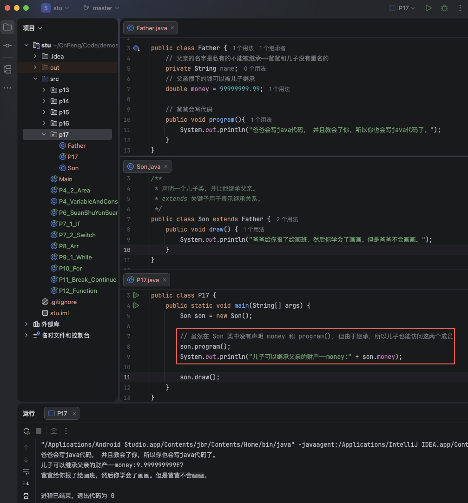
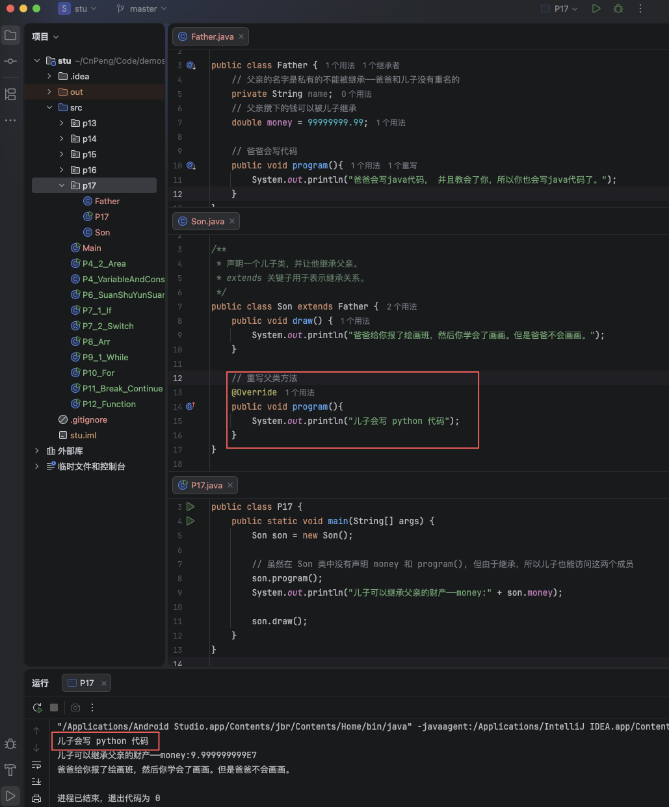
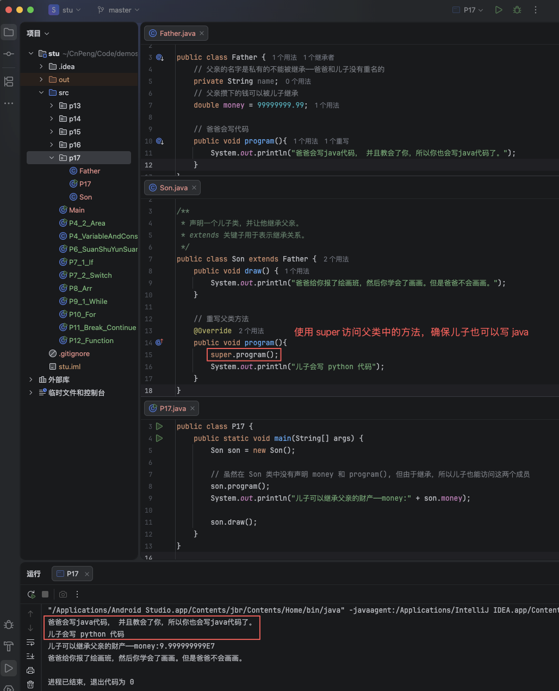

# 1. 017-类的继承


## 1.1. 继承的概念

### 1.1.1. 继承的概念

在现实生活中，继承是指父子、子孙之间的一种关系。父亲拥有的财产可以被儿子、孙子甚至是重孙子继承。

在 java 中，类的继承是指在一个现有类的基础上去构建一个新的类，新构建出来的类被称为 `子类`，而现有的类被称为 `父类` 或  `超类`。`子类` 拥有 `父类` 中所有非 `private` 的属性和方法。

在 java 程序中，如果需要声明一个类继承自另一个类，则需要使用 `extends` 关键字。格式：`class 子类名 extends 父类名`。

* 定义父类：

```java
public class Father {
    // 父亲的名字是私有的不能被继承——爸爸和儿子没有重名的
    private String name;
    // 父亲攒下的钱可以被儿子继承
    double money = 99999999.99;

    // 爸爸会写代码
    public void program(){
        System.out.println("爸爸会写java代码， 并且教会了你，所以你也会写java代码了。");
    }
}
```

* 定义子类：

```java
/**
 * 声明一个儿子类，并让他继承父亲。
 * extends 关键子用于表示继承关系。
 */
public class Son extends Father {
    public void draw() {
        System.out.println("爸爸给你报了绘画班，然后你学会了画画。但是爸爸不会画画。");
    }
}
```

* 使用子类：

```java
public class P17 {
    public static void main(String[] args) {
        Son son = new Son();

        // 虽然在 Son 类中没有声明 money 和 program(), 但由于继承，所以儿子也能访问这两个成员
        son.program();
        System.out.println("儿子可以继承父亲的财产——money:" + son.money);

        son.draw();
    }
}
```




### 1.1.2. 注意事项

* 在 java 中，类只支持单继承。也就是说一个类只能有一个直接父类——儿子只能有一个亲爹。
* 一个类可以有多个子类（或者说多个子类可以继承自同一个父类）——爸爸生了好几个儿子，你是其中一个。
* 可以多层继承——你继承了你爸爸，你爸爸又继承了你爷爷，这就是多层继承。
* 子类拥有父类所有的非 `private` 成员，同时子类也可以拥有自己的成员。——青出于蓝而胜于蓝，儿子学了一些爸爸不会的东西。

## 1.2. 重写父类方法

在继承关系中，子类会自动继承父类中定义的非 `private` 方法， 但有时子类又需要对继承的方法进行一些修改，这就叫做 `重写父类方法`。

注意：

* 重写父类方法时需要在子类中定义一个新方法，该方法的方法名、参数以及返回值必须与父类方法完全一致，然后修改这个新方法的方法体。
* 为了表明是对父类方法的重写，还需要在新方法上方增加 `@Override` 标识。

```java
/**
 * 声明一个儿子类，并让他继承父亲。
 * extends 关键子用于表示继承关系。
 */
public class Son extends Father {
    public void draw() {
        System.out.println("爸爸给你报了绘画班，然后你学会了画画。但是爸爸不会画画。");
    }

    // 重写父类方法
    @Override
    public void program(){
        System.out.println("儿子会写 python 代码");
    }
}
```




## 1.3. super 关键字

在上一节重写父类方法后，我们发现，坏了，儿子为啥不会写 java 代码了？

这是因为，当子类重写父类的方法后，子类对象将无法访问父类中这个被重写的方法。为了解决这个问题，就需要使用 `super` 关键字。

使用格式：`super.父类成员变量`、`super.父类成员方法()`，如果父类成员方法需要传递参数，必须按要求正确传递。 

```java
/**
 * 声明一个儿子类，并让他继承父亲。
 * extends 关键子用于表示继承关系。
 */
public class Son extends Father {
    public void draw() {
        System.out.println("爸爸给你报了绘画班，然后你学会了画画。但是爸爸不会画画。");
    }

    // 重写父类方法
    @Override
    public void program(){
        super.program();
        System.out.println("儿子会写 python 代码");
    }
}
```



注意：如果使用 `super` 调用父类的构造方法，则格式为 `super()`, 如果父类的构造方法是有参构造，则必须传递需要的参数。

## 1.4. final关键字

final : `/ ˈfaɪn(ə)l /` (adj. 形容词) 最终的，结束的，不可变更的。

`final` 可以用于修饰类、变量和方法。

* `final` 修饰的类不能被继承。也就是说不能有子类。
* `final` 修饰方法的方法不能被重写。
* `final` 修饰的变量不能被修改（即 常量）。

