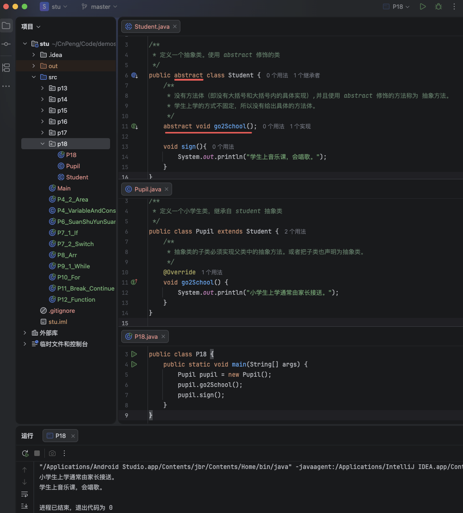
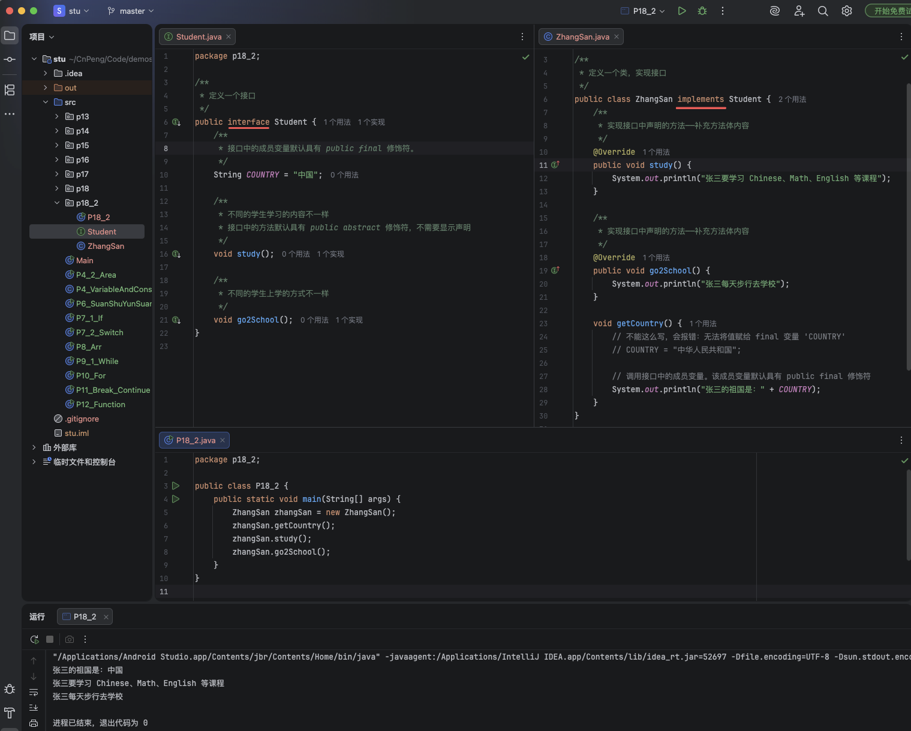
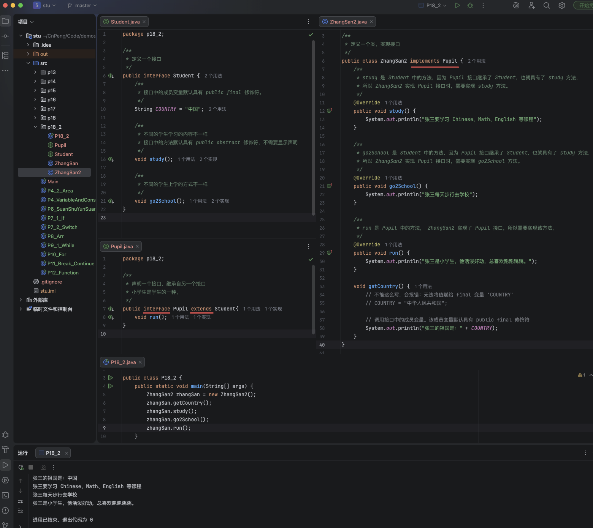
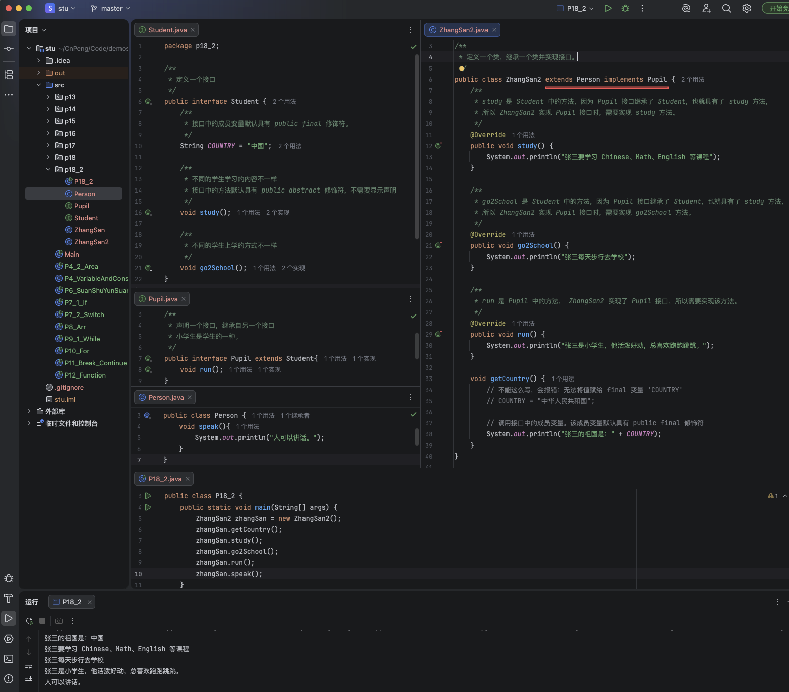

# 1. 018-抽象类和接口

## 1.1. 抽象类 

### 1.1.1. 抽象类的概念

> abstract : `/ ˈæbstrækt /` （adj. 形容词） 抽象的，纯概念的；（n. 名词） 摘要，概述，抽象的概念。

在 java 中定义方法时，允许没有方法体。没有方法体的方法必须使用 `abstract` 关键字进行修饰，这种方法就被称为 `抽象方法`。

包含了 `抽象方法` 的类必须使用关键字 `abstract` 关键字进行修饰，这种类被称为 `抽象类`。

注意：

* 包含抽象方法的类必须声明为抽象类（使用 `abstract` 关键字修饰）。
* 抽象类可以不包含任何抽象方法，也可以包含普通成员变量和成员方法。
* 抽象类可以被继承，但不能被实例化。
    * 抽象类的子类必须实现父类中的抽象方法（即补充方法体）, 或者也声明为抽象类。

### 1.1.2. 示例

* 定义一个抽象类

```java
/**
 * 定义一个抽象类。使用 abstract 修饰的类
 */
public abstract class Student {
    /**
     * 没有方法体（即没有大括号和大括号内的具体实现）,并且使用 abstract 修饰的方法称为 抽象方法。
     * 学生上学的方式不固定，所以没有给出具体的方法体。
     */
    abstract void go2School();

    void sign(){
        System.out.println("学生上音乐课，会唱歌。");
    }
}
```

* 定义一个继承自抽象类的子类

```java
/**
 * 定义一个小学生类，继承自 student 抽象类
 */
public class Pupil extends Student {
    /**
     * 抽象类的子类必须实现父类中的抽象方法。或者把子类也声明为抽象类。
     */
    @Override
    void go2School() {
        System.out.println("小学生上学通常由家长接送。");
    }
}
```

* 使用子类

```java
public class P18 {
    public static void main(String[] args) {
        Pupil pupil = new Pupil();
        pupil.go2School();
        pupil.sign();
    }
}
```




## 1.2. 接口

在 java 中，如果一个抽象类中的所有方法都是抽象的，就可以把这个类用 `接口` 的形式来表示。定义接口时需要使用 `interface` 关键字进行修饰。

* 接口中的方法不需要使用 `abstarct` 关键字修饰，系统会默认该方法的修饰符为 `public abstarct`。
* 接口中的变量默认使用 `public static final` 来修饰，即 `全局变量`。
* 接口可以继承另一个接口，但不能被类继承。
    * 类只能实现接口，使用 `implements` 关键字来表示实现关系。格式：`class 类名 implements 接口名`
    * 类可以实现多个接口，多个借口之间使用英文逗号间隔。格式：`class 类名 implements 接口名1,接口名2`
* 如果类在继承父类的同时又实现了接口，那么需要先声明继承关系再声明实现关系。格式：`class 子类名 extends 父类名 implements 接口名`

### 1.2.1. 类实现接口

当一个类实现接口时，如果这个类是抽象类则可以不实现或者实现部分接口中的方法，如果是非抽象类则必须实现全部的方法。

* 定义接口

```java
/**
 * 定义一个接口
 */
public interface Student {
    /**
     * 接口中的成员变量默认具有 public final 修饰符。
     */
    String COUNTRY = "中国";

    /**
     * 不同的学生学习的内容不一样
     * 接口中的方法默认具有 public abstract 修饰符，不需要显示声明
     */
    void study();

    /**
     * 不同的学生上学的方式不一样
     */
    void go2School();
}
```

* 定义实现接口的类

```java
/**
 * 定义一个类，实现接口
 */
public class ZhangSan implements Student {
    /**
     * 实现接口中声明的方法——补充方法体内容
     */
    @Override
    public void study() {
        System.out.println("张三要学习 Chinese、Math、English 等课程");
    }

    /**
     * 实现接口中声明的方法——补充方法体内容
     */
    @Override
    public void go2School() {
        System.out.println("张三每天步行去学校");
    }

    void getCountry() {
        // 不能这么写，会报错：无法将值赋给 final 变量 'COUNTRY'
        // COUNTRY = "中华人民共和国";

        // 调用接口中的成员变量。该成员变量默认具有 public final 修饰符
        System.out.println("张三的祖国是：" + COUNTRY);
    }
}
```

* 使用类

```java
public class P18_2 {
    public static void main(String[] args) {
        ZhangSan zhangSan = new ZhangSan();
        zhangSan.getCountry();
        zhangSan.study();
        zhangSan.go2School();
    }
}
```



### 1.2.2. 接口间的继承

* 声明一个父级接口

```java
/**
 * 定义一个接口
 */
public interface Student {
    /**
     * 接口中的成员变量默认具有 public final 修饰符。
     */
    String COUNTRY = "中国";

    /**
     * 不同的学生学习的内容不一样
     * 接口中的方法默认具有 public abstract 修饰符，不需要显示声明
     */
    void study();

    /**
     * 不同的学生上学的方式不一样
     */
    void go2School();
}
```

* 声明一个子级接口

```java
/**
 * 声明一个接口，继承自另一个接口
 * 小学生是学生的一种。
 */
public interface Pupil extends Student{
    void run();
}
```

* 让类实现子级接口

```java
/**
 * 定义一个类，实现接口
 */
public class ZhangSan2 implements Pupil {
    /**
     * study 是 Student 中的方法，因为 Pupil 接口继承了 Student，也就具有了 study 方法，
     * 所以 ZhangSan2 实现 Pupil 接口时，需要实现 study 方法。
     */
    @Override
    public void study() {
        System.out.println("张三要学习 Chinese、Math、English 等课程");
    }

    /**
     * go2School 是 Student 中的方法，因为 Pupil 接口继承了 Student，也就具有了 study 方法，
     * 所以 ZhangSan2 实现 Pupil 接口时，需要实现 go2School 方法。
     */
    @Override
    public void go2School() {
        System.out.println("张三每天步行去学校");
    }

    /**
     * run 是 Pupil 中的方法， ZhangSan2 实现了 Pupil 接口，所以需要实现该方法。
     */
    @Override
    public void run() {
        System.out.println("张三是小学生，他活泼好动，总喜欢跑跑跳跳。");
    }

    void getCountry() {
        // 不能这么写，会报错：无法将值赋给 final 变量 'COUNTRY'
        // COUNTRY = "中华人民共和国";

        // 调用接口中的成员变量。该成员变量默认具有 public final 修饰符
        System.out.println("张三的祖国是：" + COUNTRY);
    }
}

```




### 1.2.3. 继承类并实现接口

类在继承父类并实现接口时，要先声明继承关系再声明实现关系。

在上一节代码的基础上，我们在定义一个 Person 类：

```java
public class Person {
    void speak(){
        System.out.println("人可以讲话。");
    }
}
```

然后修改 ZhangSan2 的声明：

```java
public class ZhangSan2 extends Person implements Pupil {
    // 其他代码不做变更
}
```

然后我们再次构建 ZhangSan2 的实例并使用：

```java
public class P18_2 {
    public static void main(String[] args) {
        ZhangSan2 zhangSan = new ZhangSan2();
        zhangSan.getCountry();
        zhangSan.study();
        zhangSan.go2School();
        zhangSan.run();
        zhangSan.speak();
    }
}
```




