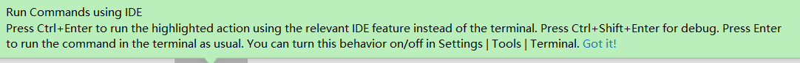

# 1. 待总结

## 1.1. part1

* [Android 12 中的开屏页 SplashScreen](https://www.jianshu.com/p/7b0fddf37bb2)
* [兼容 Android 11 的文件选择](https://www.jianshu.com/p/376f252519b7)
* [迁移到64位应用](https://developer.android.google.cn/distribute/best-practices/develop/64-bit)、迁移到 aab 打包方式

## 1.2. part2

[报错： Failed to install the following Android SDK packages as some licences have not been accepted.](https://blog.csdn.net/qq_30346413/article/details/96137430)

[windows 10 配置Java 环境变量](https://www.jianshu.com/p/9fc41ea941aa)

[找不到.jvm.cfg'的问题](https://blog.csdn.net/m0_37482190/article/details/94414196)