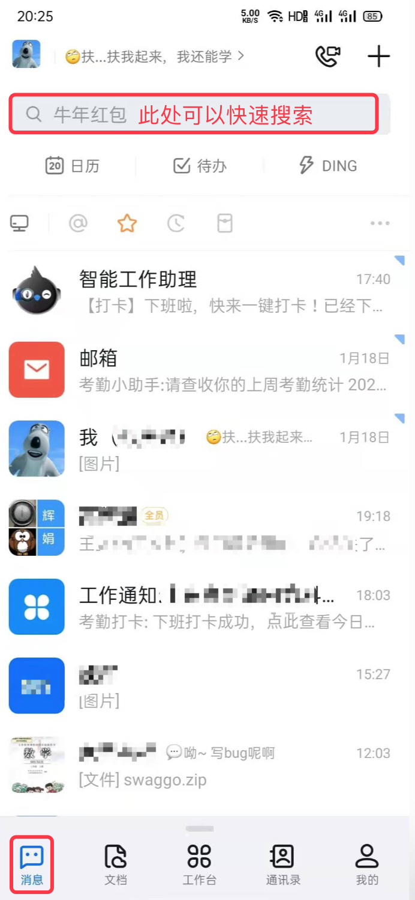

1 月 14 日，在钉钉 6.0 版本的发布会上，阿里云智能总裁张建锋断言：“未来的软件开发一定是碎片化的，`低代码`开发将是 2021 年的行业关键词”。那么，到底什么是 `低代码` ？它的优缺点有哪些？它会对程序员造成什么影响呢？

## 1.1 什么是低代码

**`低代码`** 全称 `Low-Code Development` ，即低代码开发，指的是通过少量的代码或没有代码的方式实现某一项功能或产品。它的本质是将代码内容转化成可视化图形界面，让具有不同经验和水平的人员通过拖拉拽的形式组合出符合自己需求的功能或者程序。

`低代码` 的概念最早可以追溯到 20 世纪 90 年代至 21 世纪初，但直到 2014 年 6月才由 `Forrester` 公司正式提出。

目前，钉钉和腾讯都推出了自己的低代码开发平台。此外，还有宜搭、氚云、简道云、织信、炎黄盈动 等平台。借助这些低代码平台，企事业单位可以根据自己的需求，快速构建应用内容。

钉钉 6.0.2 中整合了宜搭、氚（chuān）云、简道云这三个平台，在 `消息` 页面顶部的搜索框中输入平台名称然后搜索，即可快速进入开发（组合）。

## 1.2 低代码的利和弊

万物都是两面的，有利总会有弊，那么，低代码的利弊点有哪些呢？

### 1.2.1 利

对使用者的利：

* 降低开发门槛：借助低代码平台，非专业人员也可以快速开发出相应的应用。
* 开发快：传统意义的软件开发流程中，涵盖了需求采集、原型绘制、UI设计、软件架构设计、编码、测试、发布部署等诸多环节，环节越多，周期越长。而借助低代码平台，人们可以在一天之内搭建好多款小型应用。
* 定制灵活：低代码平台提供了诸多基础模块，并支持一定程度的自定义，开发人员在开发时可以根据自己的需求向堆积木一样任意组合。
* 节省成本：降低了企事业单位中 IT 团队的培训成本、技术部署的初始成本，以及软件应用的开发成本。
* 加速信息化建设：开发周期变短，成本降低，企事业单位的信息化建设必然会提速。

对软件研发企业的利：

* 倒逼企业优化产品结构：与低代码平台重合或交叉的产品内容可能会因为市场因素而被精简掉，从而让企业可以将人员集中到更多的核心业务中。
* 倒逼企业不断创新：产品结构优化之后，企业可以将部分人员投入到创新领域中，增强创新力度，提升创新进度。
* 倒逼企业向精细化转型：低代码平台承载了普通企业中的通用型业务，但对于有深度定制需求的精细化业务无法触及，这样，软件研发企业就可以向精细化转型，接收或研发针对企事业单位的深度定制化需求。

### 1.2.2 弊

对软件研发企业的冲击

* 利润降低：低代码平台抢占了大批软件市场，软件企业的开发需求会减少，效益和利润必然会缩减，增加了中小企业的生存压力。	
* 竞争加大：在低代码平台不流行时，企事业单位中有软件研发需求时大部分是面向一定地域内的软件企业进行招投标，外地企业很难参与进来，这在一定程度上保护了本地的软件企业。但是低代码平台打破了这种地域限制，企事业单位可以自己在平台上搭建自己的应用，降低了招投标的需求，软件企业为了生存必须向外部区域拓展，这样就必然增加了企业间的竞争。

对使用者的冲击

* 信息安全：传统软件研发中，可以进行企业内部署，数据信息都存储在自己的服务器中。而通过低代码平台搭建应用后，数据是存储在平台方的服务器中，数据难以管控。
* 难以深度定制化：低代码平台提供的仅是通用型的模块，无法触及企业中的精细化需求。

## 1.4 程序员如何应对？

在某些论坛中，有程序员担心低代码平台的发展会让程序员失业。其实不然，我们现在使用的 Windows 和 MAC 操作系统本质上也是低代码的一种体现，早年没有这种图形化操作系统时，人们只能通过纯命令行实现需求，有了图形化操作系统之后呢？随着用户的增多和需求的多样化，程序员群体非但没有消失反而越发壮大。（iOS 开发中的 storyboard 和 Android 开发中的布局编辑器的拖拽模式也都是低代码的体现。）

在我看来，目前的 `低代码` 平台仅是整合了通用业务模块，并且将业务逻辑的控制权转交给了应用的实际使用者。它将软件企业中的产品和研发人员从复杂多样的业务逻辑中解放了出来，让这些人员可以把更多的精力投放在创新和优化中。作为程序员，我们只有不断学习、不断提升自身的综合技术能力，才能更好的应对 `低代码` 快速发展所带来的更复杂更严苛的需求。

## 1.5 附录

* [钉钉开放平台：https://ding-doc.dingtalk.com/](https://ding-doc.dingtalk.com/)
* [腾讯云低代码解决方案 : https://cloud.tencent.com/solution/lowcode](https://cloud.tencent.com/solution/lowcode)