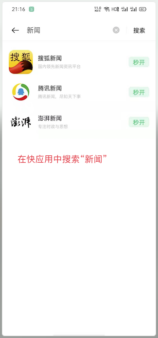
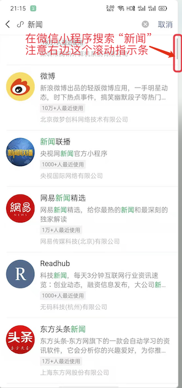
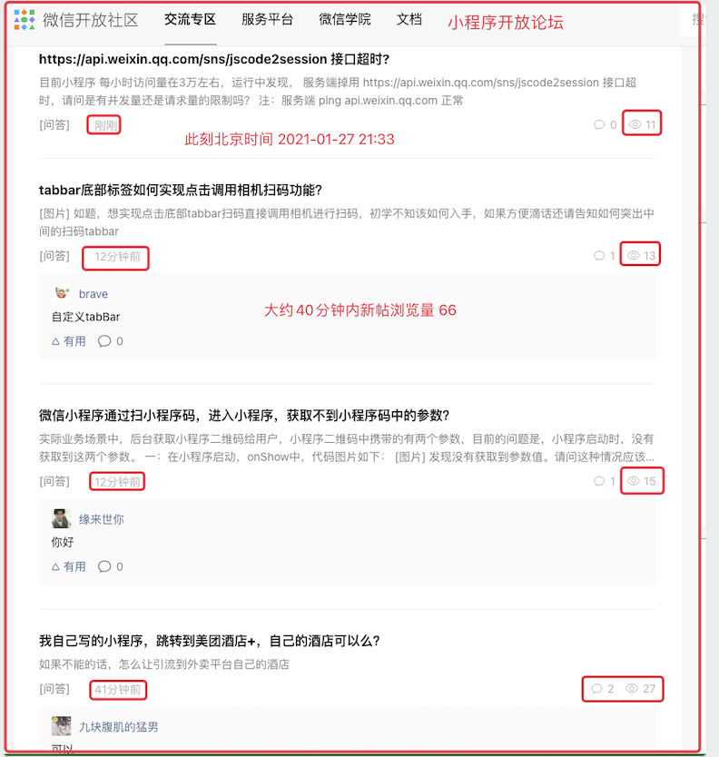

## 3.1 快应用的诞生

2018 年 3 月，在微信小程序诞生一年多以后，九大手机厂商联合推出了**快应用**。这九大厂商分别是：华为、小米、中兴、金立、联想、魅族、努比亚、OPPO、vivo。

快应用本质上也是一种小程序，也具有无需安装、触手可及、用完即走、无需卸载的特点。但是，它的推出主体是手机硬件厂商，厂商的操作系统会针对快应用有一定的优化。而且，在运行时，它无需依附宿主应用（微信小程序的宿主应用就是微信）。

在快应用的官网上我们可以看到，目前快应用联盟的成员有 12 个，如下图：

 

根据手机品牌的不同，快应用在不同手机中的入口也各不相同，但主要是集中在负一屏和菜单栏下拉中。

那么，手机厂商为什么要做快应用呢？

## 3.2 为什么要做快应用？

我们大家都知道，每个品牌的手机都会有自己的应用商店，而且这个应用商店是预置在系统中不可卸载的。Android 开发者开发应用之后，必须在主流厂商的商店上架，否则曝光率可能就会变得很低，从而影响了应用的分发效果和使用效果。

手机厂商基于自己的应用商店可以获取比较可观的收益，收益方式包括但不限于如下几种：

* 付费推广：应用商店 Banner 推广
* 竞价排名：各种新品榜、热门榜、畅销榜等
* 广告分成：比如应用商店的开屏广告
* 游戏收入分成：目前手游厂商和应用商店厂商的利润分成比是 1:1
* 厂商预装：不付费就想实现预装？不可能的！

小米在 2019 年的财报中披露，互联网服务收入达到了 198 亿人民币，其中就包括应用商店的收益部分。

然而，小程序推出以后，由于开发简单，更新快捷等特点，抢占了许多应用市场份额，最终也就动了手机厂商的奶酪。所以，厂商不得不联合起来推出了快应用。

## 3.3 快应用的现状和未来

目前，虽然各厂商依旧在手机负一屏或者下拉菜单中保留有快应用市场的入口，但好像却没有任意一家在卖力推广——总感觉联盟的东西都不大靠谱（Android 统一推送联盟好几年了也没整出一个对开发者开放的API）。

我们来看看快应用和小程序中应用的数量：

通过上面两幅图，我们能明显的看出，快应用中的程序数量远远少于微信小程序中的数量。

我们再看看快应用和小程序开发论坛：

快应用论坛中总用户量 2692，官方发的半个月前的帖子浏览量还在个位数；小程序论坛中用户数量和发帖数虽然看不到，但是 40 分钟内新帖浏览量已经达到了 66。

所以，从应用数量和论坛活跃用户量来看，微信小程序完爆快应用。

要是按照这个趋势发展下去，快应用凉凉的时间点应该不会太远了。

