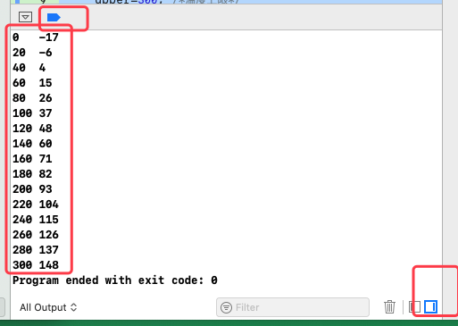
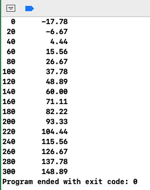
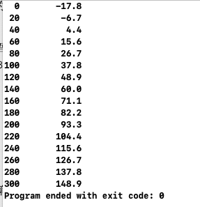
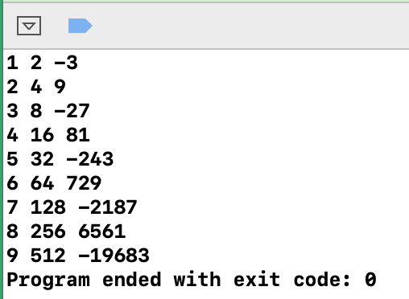
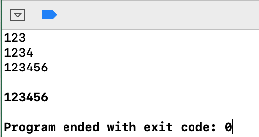
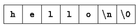
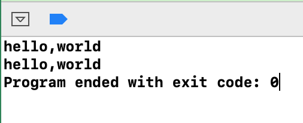

## 一、导言

### 1、入门

```c
#include <stdio.h>

 main() {
    printf("Hello, World!\n");
}
```

* `main()` 函数是程序的入口
* `#include <stdio.h>` 表示导入标准输入输出库

转义字符 | 含义
---|---
`\n` | 换行
`\t` | 制表符
`\b` | 回退符
`\"` | 双引号
`\\` | 反斜杠 `\` 


### 2、变量和算数表达式

#### （1）、变量和算数表达式

```c
#include <stdio.h>

/* 华氏度数和摄氏度数的对应关系*/
main() {
     float fahr,celsius;
     float lower,upper,step;
     
     lower=0; /*温度下限*/
     upper=300; /*温度上限*/
     step=20; /*步进*/

     fahr=lower;
     while(fahr<=upper){
         celsius=5*(fahr-32)/9;
         printf("%d\t%d\n",fahr,celsius);
         fahr=fahr+step;
     }
 }
```



* C 语言中使用 `\* *\` 作为注释符。
* 语句以 `;` 结束。
* 变量必须先声明后使用
* `int` 和 `float` 的具体取值范围取决于具体的机器。
* `float` 通常为 32 位，它至少有 6 位有效数字。取值范围在 10<sup>-38</sup> 到 10 <sup>38</sup> 之间
* `int` 通常为 16 位，取值范围为`-32768 到 32767`；根据机器不同，也有 32 位的 `int`

基本数据类型：

标识 | 含义
---|---
int | 整数
float | 单精度浮点数
char | 字符（一个字节）
short | 短整型
long | 长整型
double | 双精度浮点型


#### （2）、字符串中的格式符说明

```c
#include <stdio.h>

/* 华氏度数和摄氏度数的对应关系*/
main() {
     float fahr,celsius;
     float lower,upper,step;
     
     lower=0; /*温度下限*/
     upper=300; /*温度上限*/
     step=20; /*步进*/

     fahr=lower;
     while(fahr<=upper){
         celsius=5.0*(fahr-32.0)/9.0;
         /* %3.0f 表示待输出的浮点数至少占三个字符宽，并且不带小数位；
           * %6.2f 表示待输出的浮点数至少占6个字符宽，并且包含两位小数。
           */
         printf("%3.0f \t %6.2f\n",fahr,celsius);
         fahr=fahr+step;
     }
 }
```



格式 | 含义
---|---
`%d` | 十进制整数
`%6d` | 十进制整数，并且至少占 6 个字符宽度
`%ld` | long 型数值
`%f` | 浮点数 (单精度和双精度)
`%6f` | 浮点数，并且至少占 6 个字符宽度
`%.2f` | 浮点数，保留 2 位小数，宽度不限
`%6.2f` | 浮点数，保留 2 位小数，并且宽度至少占 6 位。
`%o` | 八进制
`%x` | 十六进制
`%c` | 字符
`%s` | 字符串
`%%` | 百分号（%）本身


### 3、for 语句

```c
#include <stdio.h>

/* 华氏度数和摄氏度数的对应关系*/
main() {
    int fahr;
    for (fahr=0; fahr<=300; fahr=fahr+20) {
        printf("%3d \t %6.1f\n",fahr,(5.0/9.0)*(fahr-32));
    }
 }
```



### 4、符号常量

* `#define` 可以用来将魔法值定义为常量。完整格式为：`#define 常量名 常量值`

```c
#include <stdio.h>

/* 使用 #define 定义符号常量，注意：末尾没有分号*/
#define LOWER 0
#define UPPER 300
#define STEP 20

main() {
    int fahr;
    for (fahr=UPPER; fahr>=LOWER; fahr=fahr-STEP) {
        printf("%3d \t %6.1f\n",fahr,(5.0/9.0)*(fahr-32));
    }
 }
```
### 5、字符输入/输出

无论文本从何处输入，输出到何处，其输入/输出都是按照字符流的方式处理的。

文本流是由多行字符构成的字符序列，而每行字符则由 0 个或多个字符组成，行末是一个换行符。

####  (1)、文件复制

标准库中提供了每次读或写一个字符的函数，其中最简单的是：`getchar()` 和 `putchar()` 

`putchar` 和 `printf` 的作用都是将内容打印到屏幕上。

> 在 C 语言中，`EOF` 表示输入终止符，在 MAC 上按下 `Ctrl+D` 即可（按一次不生效的话就连续按两次）；Window 下是 `Ctrl+Z`。

* 示例：将输入的内容打印在屏幕上V1

```c
#include <stdio.h>
main() {
    int c;
    c=getchar();
    while (c!=EOF) {
        putchar(c);
        c=getchar();
    }
 }
```

* 示例：将输入的内容打印在屏幕上V2

```c
#include <stdio.h>

main() {
    int c;
    while ((c=getchar())!=EOF) {
        putchar(c);
    }
 }
```

#### (2)、字符计数

* 使用 while 实现

```c
#include <stdio.h>

main() {
    long nc;
    nc=0;
    while (getchar()!=EOF) {
        ++nc;
    }
    printf("%ld\n",nc);
 }
```

上述代码中，使用 long 存储计数值，而不是 int 。是因为 long 至少要占 32 位存储单元，在某些机器上 int 和 long 的长度一致，但在某些机器上可能 int 就只占 16 位存储空间。 

* 使用 for 实现

```c
#include <stdio.h>

main() {
    double nc;
    for (nc=0; getchar()!=EOF; ++nc) {
    }
    printf("\n%.0f\n",nc);
 }
```

```c
#include <stdio.h>

main() {
    double nc;
    /* for 循环如果没有函数体，末尾的 分号 ; 不能省略  */
    for (nc=0; getchar()!=EOF; ++nc) ;
    printf("\n%.0f\n",nc);
 }
```

#### (3)、行计数

标准库中输入文本流以行序列的形式出现，每一行均以换行符结束，因此，统计行数等价于统计换行符的个数。

```c
#include <stdio.h>

main() {
    int c,lineNum;
    lineNum=0;
    while ((c=getchar())!=EOF) {
        if (c=='\n') {
            ++lineNum;
        }
    }
    printf("总共输入了 %d 行内容\n",lineNum);
 }
```

上述代码中，我们使用 `c=='\n'` 判断是否为换行符，'\n' 就表示换行符，此处比较实际是用 c 与 `\n` 在 ASCII 码表中对应的值进行比较。

* 用 `‘’` 单引号括起来的内容是字符，当字符参与运算时，实际操作的是其在 ASCII 码表中对应的整数值。
* 用 `""` 括起来的内容是字符串。
* `'\n'` 与 `"\n"` 是不一样的。


#### (4)、单词计数

此处以 `\n` 、`\t` 、`' '` 作为区分单词的标识。

```c
#include <stdio.h>

#define IN 0
#define OUT 1

main() {
    int c,charNum,wordNum,lineNum;
    charNum=wordNum=lineNum=0;
    int status=OUT;
    
    while ((c=getchar())!=EOF) {
        ++charNum;
        if (c=='\n') {
            ++lineNum;
        }
        if (c==' ' || c=='\t' || c=='\n') {
            status=OUT;
        }else if(status==OUT){
            /* 如果不是间隔符，则是正常的字符，并且由于当前的状态是 OUT，
             所以当前读到的字符是一个单词的开始*/
            status=IN;
            ++wordNum;
        }
    }
    printf("\n总共输入了 %d 个单词\n",wordNum);
 }
```

### 6、数组

统计输入的字符，将数字对应的字符值放入到数组中，并统计空白字符和其他字符的数量。

> 注意，`getchar()` 拿到的是字符，不是数字！！所以，假设你输入了 123 ，那么存在数组中的分别是 `‘1’` `'2'` `'3'`  在 ASCII 码表中对应的数值。

```c
#include <stdio.h>

#define ARRSIZE 10
main() {
    int i,c,spaceNum,otherNum;
    spaceNum=otherNum=0;
    /* 声明一个有十个 int 型元素的数组 */
    int digitsArr[ARRSIZE];
    
    for ( i=0; i<ARRSIZE; ++i) {
       digitsArr[i]=0;
    }
    
    while ((c=getchar())!=EOF) {
        if (c>='0' && c<='9') {
            /* 先取出 c-'0' 索引位置对应的值，然后将C的值赋给该索引*/
            digitsArr[c-'0']=c;
            /* 先取出 c-'0' 索引位置对应的值，然后将该值自增1*/
            //++digitsArr[c-'0'];
        }else if(c=='\n' || c=='\t' || c==' '){
            ++spaceNum;
        }else{
            ++otherNum;
        }
    }
    
    printf("\n输入的数字为：");
    for ( i=0; i<ARRSIZE; ++i) {
        printf(" %d",digitsArr[i]);
    }
    
    printf("\n输入的空白字符有：%d 个，输入的其他字符有：%d 个\n",spaceNum,otherNum);
}
```

### 7、函数

实现一个求幂函数。（注意：标准库中提供了 `pow(x,y)` 的求幂函数。我们下面编写的这个仅用于演示函数效果，实际应用时这样写会有问题。）

函数定义的基本格式：

```
返回值类型  函数名（0个或多个参数声明）{
	局部变量的声明
	具体语句
}
```

```c
#include <stdio.h>

int power(int m, int n);
int main(){
    int i;
    for (i=1; i<10; ++i) {
        printf("%d %d %d\n",i,power(2, i),power(-3, i));
    }
    return 0;
}

int power(int base,int power){
    int i,p;
    p=1;
    for (i=1; i<=power; ++i) {
        p=p*base;
    }
    return p;
}
```



* `main()` 末尾增加了一个 `return 0;` ，表示	`main()` 正常终止，如果出现异常返回一个非 0 的值即可。该返回值是向执行环境返回的。（之前的示例中我们都省略了这个返回值，另外，**C 语言中，函数默认返回 int 类型数据。**）
* `main()` 之前的 `int power(int m, int n)` 表示声明一个名称为 `power` 的 **函数原型**。后面在声明 `power(,){ }`  函数体时，必须与函数原型具有相同的**函数名称**和**相同的参数类型**，参数名可以不同。
* 在声明函数原型时，参数名称可以省略，也就是说，上面声明的函数原型可以简写为如下：`int power(int , int);`


### 8、参数——传值调用

* C 语言中，所有函数的参数是**值传递**。也就是说，函数内部的操作不会改变参数的原始值。假如我们需要在函数内部改变参数的值，则可以考虑传递**指针**。


* 当把数组名作为参数是，传递给函数的值是数组起始元素的位置或地址，并不是复制数组元素本身。在函数内部，可以通过数组下表访问或者修改数组元素的值。

### 9、字符数组

```c
#include <stdio.h>
#define MAXLINE 1000

int getLine(char line[],int maxLine);
void copy(char toArr[],char formArr[]);

int main(){
    int curLen;
    int maxLen;
    
    char curLine[MAXLINE];
    char maxLine[MAXLINE];
    
    maxLen=0;
    
    while ((curLen=getLine(curLine, MAXLINE))>0) {
        if (curLen>maxLen) {
            maxLen=curLen;
            copy(maxLine, curLine);
        }
    }
    
    if (maxLen>0) {
        printf("%s \n",maxLine);
    }
}

/*C 中函数默认返回 int , 所以函数声明中的 int 可以省略*/
int getLine(char line[],int maxLine){
    int c,i;
    for (i=0; i<maxLine-1 && ((c=getchar())!=EOF && c!='\n'); ++i) {
        line[i]=c;
    }
    
    if (c=='\n') {
        line[i]=c;
        ++i;
    }
    
    line[i]='\0';
    return i;
}

void copy(char toArr[],char fromArr[]){
    int i;
    i=0;
    while ((toArr[i]=fromArr[i])!='\0') {
        ++i;
    }
}
```



* `\0` 表示空字符，其值为 0，通常用来标记字符串的结束。
* 在 C 语言中出现类似 `hello\0` 的字符串常量时，将以字符数组的形式存储，数组的各个元素分别存储字符串的各个字符，并以 `\0` 标志字符串的结束。具体如下图：




### 10、外部变量与作用域

**局部变量** 也叫 **自动变量**.

除自动变量外，还可以定义位于所有函数外部的变量，即在所有函数中都可以通过变量名访问这种类型的变量。

* 由于外部变量可以在全局范围内访问，所以，函数建可以通过外部变量交换数据，而不必使用参数表。
* 外部变量在程序执行期间一直存在。
* 外部变量必须定义在所有函数之外，且只能定义一次。定义后编译程序将为它分配存储单元。
* **在每个需要访问外部变量的函数中，必须声明相应的外部变量，并指明其类型**。声明外部变量时可以用 **extern** 语句显示声明，也可以通过上下文隐式声明。

```c
#include <stdio.h>
#define MAXLINE 1000

int getLine(void);
void copy(void);

int main(){
   extern int curLen;
    int maxLen;
    
    char curLine[MAXLINE];
    char maxLine[MAXLINE];
    
    maxLen=0;
    
    while ((curLen=getLine())>0) {
        if (curLen>maxLen) {
            maxLen=curLen;
            copy();
        }
    }
    
    if (maxLen>0) {
        printf("%s \n",maxLine);
    }
}

 getLine(void){
    extern char curLine[MAXLINE];
    int c,i;
    for (i=0; i<MAXLINE-1 && ((c=getchar())!=EOF && c!='\n'); ++i) {
        curLine[i]=c;
    }
    
    if (c=='\n') {
        curLine[i]=c;
        ++i;
    }
    
    curLine[i]='\0';
    return i;
}

void copy(void){
    extern char curLine[MAXLINE], maxLine[MAXLINE];
    int i;
    i=0;
    while ((maxLine[i]=curLine[i])!='\0') {
        ++i;
    }
}
```

* 上述代码中 `getLine` 和 `copy` 函数都不带参数，所以可以省略 `(void)`, 我们加上 `(void)` 是为了与老版本的 C 程序兼容。

* 在源文件中，如果外部变量的定义出现在使用它的函数之前， 那么在那个函数中就可以省略 `extern`. 也就是说， **我们通常会把所有外部变量定义在源文件的开始处，这样就可以省略 `extern`**。
* 由于外部变量可能会被多个源文件中的函数调用，所以，我们通常会把变量和函数的 `extern` 声明放在一个单独的文件中——头文件。然后在每个源文件中使用 `#include` 语句把所要用的头文件引入。
* 以 `.h` 为后缀名的文件就是头文件。如 `stdio.h` 就是一个头文件。

> * `define`——定义，表示创建变量并并分配存储单元
> * `declaration`——声明，表示声明变量，但不分配存储单元。


## 二、类型、运算符与表达式

### 1、变量名

* 通常由字母、数字、下划线`_` 组成
* 变量名不要以下划线开头，当变量名较长时通常用 `_` 链接。
* 变量名使用小写字母，符号偿命名全大写。

### 2、数据类型及长度

C 语言中的基本数据类型如下：

类型 | 含义
---|---
char | 字符型，占一个字节
int | 整型。（根据机器不同，位数不同）
float | 单精度浮点型
double | 双精度浮点型

还可以在这些基本数据类型前面加上限定符

* `short` 和 `long`  用于限定整型。如 ：`short int sh`,`long int counter`。
	* 我们通常会省略 `int` ，直接写作 `short sh`, `long counter`。
	*  short 通常为 16 位；long 通常为 32 位；而使用 int 时，编译器会根据硬件特性自动选择长度。
* `signed` 与 `unsigned` 用于限定 `char` 或任何整型。
	* `unsigned` 类型的数总是正值或 0，并遵守算术模 2<sup>n</sup> 定律，其中 n 是该类型占用的位数。如 char 对象占用 8 位，那么 `unsigned char` 类型变量的取值范围为 `0~255`。`signed char` 的取值范围为 `1238~128`。
* `long double` 表示高精度的浮点数。
	* 同整数一样，浮点型的长度也取决于具体的实现。
	* float 、double 、long double 可以表示相同的长度，也可以表示两种或三种不同的长度。

> 这些类型长度定义的符号常量以及其他与机器和编译器有关的属性可以在标准头文件 `<limits.h>` 和 `<float.h>` 中找到


### 3、常量

#### (1)、基本数据类型的常量

* long  类型的常量以字母 `l` 或 `L` 结尾。
* 如果一个整数太大无法用 int 类型表示时，也将被当做 long 类型处理。
*  无符号常量以 `u` 或 `U` 结尾。
*  以 `ul` 或 `UL` 结尾的代表 `unsigned long` 类型。
*  浮点数常量中包含一个小数点（如 123.4）或一个指数（如 1e-2）,也可以两者都有。
*  没有后缀的浮点数常量为 double 类型。
*  后缀 `f` 或 `F` 表示 float 类型。
*  后缀 `l` 或 `L` 表示 long double 类型。
*  整型数可以使用八进制、十进制、十六进制来表示。
*  八进制和十六进制的常量也可以使用 `L` 表示 long 类型，使用后缀 `U` 表示 unsigned 类型。
	* `0XFUL` 是一个 unsigned long 类型的常量，其值等于十进制数 15.
* 一个字符常量就是一个整数，书写时将一个字符括在单引号中，如 `x`。
	* 字符表示的值就是在 ASCII 字符集中对应的编码值，如 `0` 对应的是 48。

#### (2)、转义字符

---

下面这一段没怎么明白！！

* `’\ooo‘` 表示任意的字节大小的位模式。其中 `ooo` 代表 1~3 个八进制数字（0...7）
* `‘\xhh’` 也用来表示位模式，`hh` 是一个或多个十六进制数字（0...9，a...f，A...F）

基于上面两个定义，我们可以用如下形式书写语句：

```c
#define VTAB ’\013‘  /*ASCII vertical tab*/
#define BELL '\007’  /*ASCII bell character*/
```

上面的示例语句也可以用十六进制的形式书写：

```c
#define VTAB '\xb'  /*ASCII vertical tab*/
#define BELL '\x7'  /*ASCII bell character*/
```
---

ANSI C 语言中的全部转义字符序列如下：

转义符|含义
---|---
`\a` | 响铃符
`\b` | 回退符
`\f` | 换页符
`\n` | 换行符
`\r` | 回车符
`\t`|横向制表符
`\v`|纵向制表符
`\\`|反斜杠
`\?`|问号
`\'`|单引号
`\"`|双引号
`\ooo`|八进制数
`\xhh`|十六进制数
`'\0'`|值为0的字符，也就是空字符（null）

* 我们通常用 `'\0'` 的形式代替0，以强调某些表达式的字符属性，但其数字值为 0.

* 常量表达式时仅仅只包含常量的表达式，这种表达式在编译时求值，而不是在运行时求值。如：

```c
#define MAXLINE 1000
char line[MAXLINE+1];
```

或 

```c
#define LEAP 1  /*in leap years*/
int days[31+28+LEAP+31+30+31+30+31+31+30+31+30+31];
```

#### (3)、字符串常量

* 字符串常量也叫字符串字面值，是用双引号括起来的0个或多个字符组成的字符序列。
	* 字符串中也可以使用转义字符。
	* 编译时可以将多个字符串常量连接起来。如：`”hello,“ "world"` 等价于 `hello,world`

```c
#include <stdio.h>
int main(){
    printf("hello,""world\n");
    printf("hello,world\n");
}
``` 



> 字符串常量的连接为将较长的字符串分散在若干个源文件行中提供了支持。

从技术角度看，**字符串常量就是字符数组。字符串的内部表示使用一个空字符 `'\0'` 作为串的结尾。因此，存储字符串的物理存储单元数比括在双引号中的字符数多一个。**这种表示方法也说明，C 语言对字符串的长度没有限制，但程序必须扫描完整个字符串后才能确定字符串的长度。

标准头文件 `<string.h>` 中的 `strlen(s)` 函数可以返回字符串参数 s 的长度，但其长度不包括末尾的 `'\0'` .

下面是我们设计的 `strlen` 函数的一个示例：

```c
int cusstrlen(char s[]){
    int i;
    while (s[i]!='\0') {
        ++i;
    }
    return i;
}
```

#### (4)、枚举常量

枚举是一个常量整型值的列表，如 `enum boolean { NO,YES };`

* 在没有显示说明的情况下， enum 类型中第一个枚举名的值为 0，第二个为 1，以此类推。
* 如果只指定了部分枚举名的值，那么未指定的枚举名的值将按照最后一个指定值向后递增。
* 枚举名不能重复，但是枚举名对应的值可以重复。

```c
/*显示声明枚举名及其值*/
enum escapes{BELL ='\a',BACKSPACE='\b',TAB='\t',NEWLINE='\n',VTAB='\v',RETURN='\r'};
/*仅声明了部分枚举名及其值，其他递增1。即：FEB 的值为2，MAR 的值为3...*/
enum months{JAN=1,FEB,MAR,APR,MAY,JUN,JUL,AUG,SEP,OCT,NOV,DEC};
```

> 推荐使用枚举替代 `#define`


### 4、声明

* 所有变量都必须先声明后使用（部分变量可以通过上下文隐式的声明）。
* 一个声明指定一种变量类型，后面可以跟一个或多个该类型的变量名（也叫变量表），多个变量名之间用  `,` 隔开，末尾添加 ';'。如：

```c
int  lower,upper,step;
char c, line[1000];

/*上面的声明语句也可以写成下面的样子*/
int lower;
int upper;
int step;

char c;
char line[1000];
```

* 也可以在声明的同时对变量进行初始化。如：

```c
char esc=‘\\c’;
int i=0;
int limit = MAXLINE +1;
float eps=1.0e-5;
```

* 如果变量不是自动变量（自动变量也叫局部变量），则只能进行一次初始化操作。
	* 从概念上讲，应该是在程序开始执行之前进行，并且初始化表达式必须为常量表达式。
	* 每次进入函数或程序块时，显示初始化的自动变量（即 局部变量）都将被初始化一次。其初始化表达式可以是任何表达式。
	* 默认情况下，外部变量与静态变量将被初始化为0；
	* 未经显示初始化的自动变量（即 局部变量）的值为未定义值（即无效值）； 

* 任何变量的声明都可以使用 `const` 限定符限定，该限定符指定变量的值不能被修改。
* **对数组而言，`const` 限定符指定数组所有的元素值都不能被修改。**

```c
const double e=2.71828182845905;
const char msg[]="warning:";
```

* `const` 限定符也可以配合数组参数使用，它表明函数不能修改数组元素的值：

```c
int strlen(const char[]);
```

### 5、算数运算符 (二元运算符)

算数运算符包括：`+，-，*，/，%`

* `%` 叫 取模运算符或取余运算符。`x%y` 即计算 x 除以 y 的余数。**取模运算符不能引用于 float 或 double 类型**

> 在有副操作数的情况下，整数除法截取的方向以及取模运算结果的符号取决于具体机器的实现，这和处理上溢或下溢的情况是一样的。

* 二运算符 `+` 和 `-` 具有相同的优先级，它们的优先级比运算符 `*`、`/`、`%` 的优先级低。
* 算数运算符采用从左到右的结合规则。

> 完整的运算符优先级参考本章的第12节：《运算符优先级与求值次序》

### 6、关系运算符与逻辑运算符

关系运算符包括：`> ，>=，<，<=，!=，== `。

* `>，>=，<，<=` 四者具有相同的优先级，它们的优先级高于 `==，!=`；
* 关系运算符的优先级高于赋值运算符 `=`。

逻辑运算符 `&&，||，!`

* `&&` 的优先级比 `||` 高，两者的优先级都比关系运算符低。

### 7、类型转换

* C 语言中没有指定 char 类型的变量时无符号变量（signed）还是有符号变量（unsigned）.
* 进行算数运算时，会自动把较低的类型提升为较高的类型，运算结果为较高的类型。
* **注意：表达式中 float 类型的操作数不会自动转换为 double 类型**
* 强制类型转换的格式：`(类型名)表达式`


### 8、自增运算符与自减运算符

* 自增运算符 `++`，自减运算符 `--`。（自增1或自减1）

```c
if(c=='\n'){
    s[i++]=c;
}

/*上面的示例代码与下面这一段等效*/    
if (c=='\n') {
    s[i]=c;
    i++;
}
```

### 9、按位运算符

位操作符只能作用于整型操作数，即只能作用于带符号或无符号 `char、short、int、long` 类型。 

位操作符如下：

符号|含义
---|---
`&` | 按位与（AND）
`|` | 按位或（OR） 
`^` | 按位异或（XOR）
`<<` | 左移
`>>` | 右移
`~` | 按位求反（一元运算符）

* 按位与运算符 `&` 通常用于屏蔽某些二进制位，如：`n=n & 0177;`, 该语句将 n 中除 7 个低二进制位外的其他各位均置为 0；
* 按位或运算符 `|` 常用于将某些二进制位置为1，例如 `x = x | SET_ON; `，该语句将 x 中对应于 `SET_ON` 中为 1 的那些二进制位置为 1 。7
* 按位异或运算符 `^` 当两个操作数的**对应位不相同时将该为设置为1**， 否则将该位设置为 0；
* `x << 2` 将 x 的值向左移 2 位，右边的空位用 0 填补；
* 对 `unsigned` 类型的无符号值进行右移时，左边空出来的部分用 0 填补；
* 对 `signed` 类型的带符号值进行右移时，某些及其对左边空出来的部分用符号位填补（即算术位移），而另一些机器则对左边空出来的部分用 0 填补（即 逻辑位移）。
*  一元运算符 `~` 用于求整数的二进制反码，即分别将操作数各二进制位上的 1 变为 0，0 变为 1。

 
### 10、赋值运算符与表达式

大多数二元运算符（即 有左、右两个操作数的运算符，比如 +）都有一个相应的赋值运算符 `op=`，其中 `op` 可以是下面这些运算符之一：`+、-、*、/、%、<<、>>、&、^、|`。

赋值运算符可以用在表达式中，如 `while((c=getchar())!=EOF)`, 其他赋值运算符 (如 +=、-=) 也可以用在表达式中。

### 11、条件表达式

* 基本格式：`if (条件){ 表达式 } else { 表达式 }`
* 三元运算：`expr1 ? expr2 : expr3` ,  三元运算符的优先级非常低，仅高于赋值运算符。


### 12、运算符优先级与求值次序

下表中优先级从上到下依次降低，同一行中的运算符具有相同的优先级。

运算符|结合性
---|---
`()、[]、->、.` | 从左至右
`！、~、++、--、+、-、*、(type)、sizeof` | 从右至左
`*、\、%` | 从左至右
`+、-` | 从左至右
`>>、<<` | 从左至右
`<、<=、>、>=` | 从左至右
`==、!=` | 从左至右
`&` | 从左至右
`^` | 从左至右
`|` | 从左至右
`&&` | 从左至右
`||` | 从左至右
`?:` | 从左至右
`=、+=、-=、*=、/=、%=、&=、|=、<<=、>>=` | 从右至左
`‘` | 从右至左

* 一元运算符 `+、-、&、*` 比相应的二元运算符 `+、-、&、*` 的优先级高。
* 位运算符（`&、^、|`）的优先级低于 `==、!=` 。所以，`if((x&mask)==0)` 的表达式中位运算内容需要用括号包裹。

## 三、流控制

### 1、语句与程序块

用一对花括号 `{ }` 把一组声明和语句括在一起就构成了一个复合语句（也叫做程序块），复合语句在语法上等价于单条语句。

### 2、if-else 语句

语法格式如下：

```c
if (表达式){
	语句1;
}else{
	语句2;
}
```

> 上述格式中的 `{ }` 尽量不要省略。

### 3、else-if 语句

```c
if (表达式1){
	语句1;
}else if (表达式2){
	语句2;
}else{
	语句3;
}
```

### 4、switch 语句


### 5、while 循环与 for 循环

### 6、do-while 循环

### 7、break 语句与 continue 语句

### 8、goto 语句与标号

## 四、函数与程序结构

### 1、

### 2、

### 3、

### 4、

### 5、

### 6、

### 7、

### 8、

## 五、指针与数组

### 1、

### 2、

### 3、

### 4、

### 5、

### 6、

### 7、


