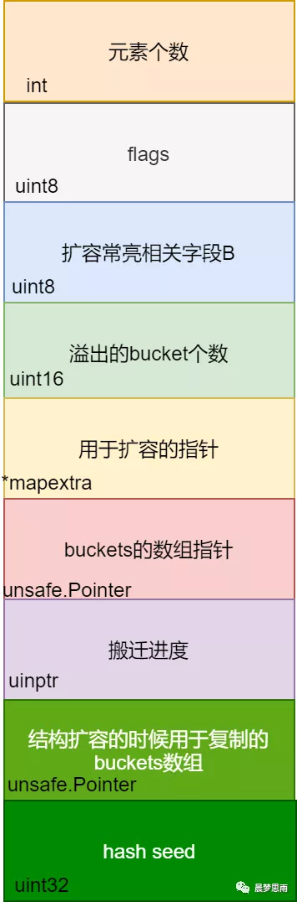

# 1. Golang语法50问

[原文链接](https://mp.weixin.qq.com/s/eOeezYBU8YnqxgGCIb0img)

## 1.1. 使用值为 nil 的 slice、map会发生啥

**允许对值为 nil 的 slice 添加元素.**

**但对值为 nil 的 map 添加元素，则会造成运行时 panic。**

```go
// map 错误示例
func main() {
    var m map[string]int
    m["one"] = 1  // error: panic: assignment to entry in nil map
    // m := make(map[string]int)// map 的正确声明，分配了实际的内存
}

// slice 正确示例
func main() {
     var s []int
     s = append(s, 1)
}
```

## 1.2. 访问 map 中的 key，需要注意啥

当访问 map 中不存在的 key 时，Go 则会返回元素对应数据类型的零值，比如 `nil`、`''` 、`false` 和 `0`，**取值操作总有值返回，故不能通过取出来的值，来判断 key 是不是在 map 中**。

检查 key 是否存在可以用 map 直接访问，检查返回的第二个参数即可。

```go
// 错误的 key 检测方式
func main() {
	x := map[string]string{"one": "2", "two": "", "three": "3"}
	if v := x["two"]; v == "" {
		fmt.Println("key two is no entry") // 键 two 存不存在都会返回的空字符串
	}
}

// 正确示例
func main() {
	x := map[string]string{"one": "2", "two": "", "three": "3"}
	if _, ok := x["two"]; !ok {
		fmt.Println("key two is no entry")
	}
}
```

## 1.3. string 类型的值可以修改吗

不能，可以使用索引遍历字符串中的字符，但不能通过索引去修改字符串中的字符。

**string 类型的值是只读的二进制 byte slice，如果真要修改字符串中的字符，将 string 转为 []byte 修改后，再转为 string 即可**。

```go
// 修改字符串的错误示例
func main() {
	x := "text"
	x[0] = "T"  // error: cannot assign to x[0]
	fmt.Println(x)
}


// 修改示例
func main() {
	x := "text"
	xBytes := []byte(x)
	xBytes[0] = 'T' // 注意此时的 T 是 rune 类型

	x = string(xBytes)
	fmt.Println(x) // Text
}
```

## 1.4. switch 中如何强制执行下一个 case 代码块

switch 语句中的 case 代码块会默认带上 break，但可以使用 `fallthrough` 来强制执行下一个 case 代码块。

```go
func main() {
	isSpace := func(char byte) bool {
		switch char {
		case ' ': // 空格符会直接 break，返回 false // 和其他语言不一样
		// fallthrough // 添加 fallthrough 之后会强制走下一个 case, 从而返回 true
		case '\t':
			return true
		}
		return false
	}
	fmt.Println(isSpace('\t')) // true
	fmt.Println(isSpace(' ')) // false
}
```

## 1.5. 你是如何关闭 HTTP 的响应体的

直接在处理 HTTP 响应错误的代码块中，直接关闭非 nil 的响应体；如果没有错误，则手动调用 defer 来关闭响应体。

```go
// 正确示例
func main() {
	resp, err := http.Get("http://www.baidu.com")

	// 关闭 resp.Body 的正确姿势
	if resp != nil {
		defer resp.Body.Close()
	}

	checkError(err)
	defer resp.Body.Close()

	body, err := ioutil.ReadAll(resp.Body)
	checkError(err)

	fmt.Println(string(body))
}
```

## 1.6. 你是否主动关闭过 http 连接，为啥要这样做

有关闭，**不关闭可能会导致程序消耗完 socket 描述符**。

有如下 2 种关闭方式：

* 直接设置请求变量的 Close 字段值为 true，每次请求结束后就会主动关闭连接。
* 设置 Header 请求头部选项 `Connection: close`，然后服务器返回的响应头部也会有这个选项，此时 HTTP 标准库会主动断开连接

```go
// 主动关闭连接
func main() {
	req, err := http.NewRequest("GET", "http://golang.org", nil)
	checkError(err)

	req.Close = true
	//req.Header.Add("Connection", "close") // 等效的关闭方式

	resp, err := http.DefaultClient.Do(req)
	if resp != nil {
		defer resp.Body.Close()
	}
	checkError(err)

	body, err := ioutil.ReadAll(resp.Body)
	checkError(err)

	fmt.Println(string(body))
}
```

你可以创建一个自定义配置的 HTTP transport 客户端，用来取消 HTTP 全局的复用连接。

```go
func main() {
	tr := http.Transport{DisableKeepAlives: true}
	client := http.Client{Transport: &tr}

	resp, err := client.Get("https://golang.google.cn/")
	if resp != nil {
		defer resp.Body.Close()
	}
	checkError(err)

	fmt.Println(resp.StatusCode) // 200

	body, err := ioutil.ReadAll(resp.Body)
	checkError(err)

	fmt.Println(len(string(body)))
}
```

## 1.7. 解析 JSON 数据时，默认将数值当做哪种类型

在 encode/decode JSON 数据时，**Go 默认会将数值当做 float64 处理**。

```go
func GetUnmarshalType() {
	var data = []byte(`{"status": 200}`)
	var result map[string]interface{}

	if err := json.Unmarshal(data, &result); err != nil {
		log.Fatalln(err)
	}

	//打印结果：status 的值为 200 ,其类型为 float64
	fmt.Printf("status 的值为 %v ,其类型为 %T \n",result["status"],result["status"])
}
```

解析出来的 200 是 float 类型。

## 1.8. 如何从 panic 中恢复

**在一个 defer 延迟执行的函数中调用 recover ，它便能捕捉/中断 panic。**

```go
// 错误的 recover 调用示例
func main() {
	recover()         // 什么都不会捕捉
	panic("not good") // 发生 panic，主程序退出
	recover()         // 不会被执行
	println("ok")
}

// 正确的 recover 调用示例
func main() {
	defer func() {
		fmt.Println("recovered: ", recover())
	}()
	panic("not good")
}
```

## 1.9. 简短声明的变量需要注意啥

* 简短声明的变量**只能在函数内部使用**
* struct 的变量字段不能使用 `:=` 来赋值
* 不能用简短声明方式来单独为一个变量重复声明，` :=` 左侧至少有一个新变量，才允许多变量的重复声明

## 1.10. range 迭代 map是有序的吗

无序的。

Go 的运行时是有意打乱迭代顺序的，所以你得到的迭代结果可能不一致。但也并不总会打乱，得到连续相同的 5 个迭代结果也是可能的。

## 1.11. recover 的执行时机

无，

* recover **必须在 defer 函数中运行**。
* recover 捕获的是祖父级调用时的异常，**直接调用时无效**。

```go
// 直接调用无效
func main() {
    recover()
    panic(1)
}


// 直接 defer 调用也是无效。
func main() {
    defer recover()
    panic(1)
}

// defer 调用时多层嵌套依然无效。
func main() {
    defer func() {
        func() { recover() }()
    }()
    panic(1)
}

// 必须在 defer 函数中直接调用才有效。
func main() {
    defer func() {
        recover()
    }()
    panic(1)
}
```

## 1.12. 闭包错误引用同一个变量问题怎么处理

* **在每轮迭代中生成一个局部变量 i **, 这样就可以结局错误引用的问题。

```
func main() {
    for i := 0; i < 5; i++ {
        // 如果没有 i := i 这行，将会打印同一个变量。即打印的全是 4
        i := i
        defer func() {
            println(i)
        }()
    }
}
```

* 或者是通过函数参数传入 i 。

```go
func main() {
    for i := 0; i < 5; i++ {
        // 将 i 作为参数传入
        defer func(i int) {
            println(i)
        }(i)
    }
}
```

## 1.13. 在循环内部执行 defer 语句会发生啥

defer 在函数退出时才能执行，在 for 执行 defer **会导致资源延迟释放**。

```go
func main() {
    for i := 0; i < 5; i++ {
        // func 是一个局部函数，在局部函数里面执行 defer 将不会有问题。
        func() {
            f, err := os.Open("/path/to/file")
            if err != nil {
                log.Fatal(err)
            }
            defer f.Close()
        }()
    }
}
```

## 1.14. 说出一个避免 Goroutine 泄露的措施

**可以通过 context 包来避免内存泄漏**。

```go
func main() {
    ctx, cancel := context.WithCancel(context.Background())

    ch := func(ctx context.Context) <-chan int {
        ch := make(chan int)
        go func() {
            for i := 0; ; i++ {
                select {
                // 下面的 for 循环中调用 cancel() 后，会触发此处的 ctx.Done()。
                // 如果不 return 就会导致内存泄漏
                case <- ctx.Done():
                    return
                case ch <- i:
                }
            }
        } ()
        return ch
    }(ctx)

    for v := range ch {
        fmt.Println(v)
        if v == 5 {
            // 这是调用了 context.WithCancel(context.Background()) 生成的 cancel
            cancel()
            break
        }
    }
}
```

上述代码中，下面的 for 循环停止取数据时，就用 cancel 函数，让另一个协程停止写数据。

如果下面的 for 已停止读取数据，上面 for 循环还在写入，就会造成内存泄漏。

## 1.15. 如何跳出for select 循环

通常在 for 循环中，使用 break 可以跳出循环。

但是注意在 go 语言中，for select 配合时，break 并不能跳出循环，除非配置了标签。

```go
func testSelectFor2(chExit chan bool){
 // 设置标签，格式为 标签名:
 EXIT:
    for  {
        select {
        case v, ok := <-chExit:
            if !ok {
                fmt.Println("close channel 2", v)
                break EXIT//goto EXIT2
            }

            fmt.Println("ch2 val =", v)
        }
    }

    //EXIT2:
    fmt.Println("exit testSelectFor2")
}
```

## 1.16. 如何在切片中查找

go 中使用 `sort.searchXXX` 方法，在**排序好**的切片中查找指定的元素。有三个注意事项：

* 传入的切片必须是已经排序好的
* 如果元素存在，则返回其索引
* 如果元素不存在，则返回其将要插入的索引

```go
func tempTest10() {
	strSlice := []string{"a", "b", "c", "d"}
	index := sort.SearchStrings(strSlice, "c")
	// 2
	fmt.Println(index)

	index2 := sort.SearchStrings(strSlice, "e")
	// 4
	fmt.Println(index2)
}

func tempTest11() {
	strSlice := []string{"c", "b", "a", "d"}
	index := sort.SearchStrings(strSlice, "c")
	// 2，strSlice 排序之后的元素为{"a","b","c","d","e"}，所以得到的索引是 2
	fmt.Println(index)

	index2 := sort.SearchStrings(strSlice, "e")
	// 4
	fmt.Println(index2)
}
```


可以通过封装如下函数，在判断元素是否存在的同时返回其索引（或将要插入的索引）：

```go
func IsExist(sortedSlice []string, t string) (int, bool) {
    iIndex := sort.SearchStrings(sortedSlice, t)
    // 如果 iIndex==len(sortedSlice), 则表示元素不存在
    bExist := iIndex!=len(sortedSlice) && sortedSlice[iIndex]==t

    return iIndex, bExist
}
```

## 1.17. 如何初始化带嵌套结构的结构体

go 的哲学是**组合优于继承**，使用 struct 嵌套即可完成组合，内嵌的结构体属性就像外层结构的属性一样，可以直接调用。

但是需要注意，初始化外层结构体时，必须指定内嵌结构体名称，如下看到 s1方式报错，s2 方式正确。

```go
type stPeople struct {
	Gender bool
	Name string
}

type stStudent struct {
	stPeople
	Class int
}

var s2 = stStudent{stPeople{false, "JimWen"}, 3}
fmt.Println(s2.Gender, s2.Name, s2.Class)
```

## 1.18. 切片和数组的区别

### 1.18.1. 数组

* 数组是具有固定长度，且拥有零个或者多个相同数据类型元素的序列。
    * **数组的长度是数组类型的一部分**，所以 [3]int 和 [4]int 是两种不同的数组类型。通过内置函数 len(array) 可以获取其长度
    * 数组需要指定大小，不指定也会根据初始化的自动推算出大小，**不可改变**；
    * 数组是值传递。
* 数组是内置类型，它是值类型，通过从 0 开始的下标索引访问元素值。在初始化后长度是固定的，无法修改其长度。
* 当作为方法的参数传入时将**复制**一份数组而不是引用同一指针。

数组定义：

```go
var array [10]int
var array =[5]int{1,2,3,4,5}
```

### 1.18.2. 切片

* 切片表示一个拥有相同类型元素的可变长度的序列。
    * 切片是一种轻量级的数据结构，它有三个属性：指针、长度和容量。
    * 切片不需要指定大小；切片是地址传递；
    * 切片可以通过数组来初始化，也可以通过内置函数make()初始化 。
    * 初始化时len=cap,在追加元素时如果容量 cap 不足时将按 len 的 2 倍扩容。

切片定义：

```go
var slice []type = make([]type, len)
```

## 1.19.  new 和 make 的区别

### 1.19.1. new

* new 的作用是初始化一个指向类型的指针 (`*T`) 。
* new 函数是内建函数，函数定义：`func new(Type) *Type`。
* 使用 new 函数来分配空间。传递给 new 函数的是一个类型，不是一个值。返回值是指向这个新分配的零值的指针。

### 1.19.2. make

* make 的作用是为 slice，map 或 chan 初始化并返回引用 (T)。
* make 函数是内建函数，函数定义：`func make(Type, size IntegerType) Type`；第一个参数是一个类型，第二个参数是长度；返回值是一个类型。

`make(T, args)` 函数的目的与 `new(T) `不同。它仅仅用于创建 Slice, Map 和 Channel，并且**返回类型是 T（不是`T*`）的一个初始化的（不是零值）的实例**。

## 1.20. Printf()、Sprintf()、Fprintf()函数的区别用法是什么

都是把格式好的字符串输出，只是输出的目标不一样。

* **Printf()**，是把格式字符串输出到标准输出（一般是屏幕，可以重定向）。Printf() 是和标准输出文件 (stdout) 关联的，Fprintf  则没有这个限制。

* **Sprintf()**，是把格式字符串输出到指定字符串中，所以参数比 printf 多一个 `char*`，即目标字符串地址。

* **Fprintf()**，是把格式字符串输出到指定文件设备中，所以参数比 printf 多一个文件指针 `FILE*`。主要用于文件操作。Fprintf() 是格式化输出到一个`stream`，通常是到文件。

## 1.21. 说说go语言中的for循环

for 循环支持 continue 和 break 来控制循环，但是它提供了一个更高级的 break，可以选择中断哪一个循环 。

for 循环**不支持以逗号为间隔的多个赋值语句**，必须使用平行赋值的方式来初始化多个变量。

## 1.22. Array 类型的值作为函数参数

在 C/C++ 中，数组（名）是指针。将数组作为参数传进函数时，相当于传递了数组内存地址的引用，在函数内部会改变该数组的值。

但是，**在 Go 中，数组是值。作为参数传进函数时，传递的是数组的原始值拷贝，此时在函数内部是无法更新该数组的**。

```go
// 数组使用值拷贝传参
func main() {
	x := [3]int{1, 2, 3}

	func(arr [3]int) {
		arr[0] = 7
		fmt.Println(arr) // [7 2 3]
	}(x)
	fmt.Println(x) // [1 2 3] // 并不是你以为的 [7 2 3]
}
```

想改变数组，直接传递指向这个数组的指针类型。

```go
// 传址会修改原数据
func main() {
	x := [3]int{1,2,3}

	func(arr *[3]int) {
		(*arr)[0] = 7
		fmt.Println(arr) // &[7 2 3]
	}(&x)

	fmt.Println(x) // [7 2 3]
}
```

直接使用 slice：**即使函数内部得到的是 slice 的值拷贝，但依旧会更新 slice 的原始数据（底层 array）**

```go
func Slice1Test2()  {
	// 将 slice 作为参数
	slice := []int{1,2,3,4}
	func (pSlice []int){
		slice[0]=0
		// [0 2 3 4]
		fmt.Println(slice)
	}(slice)
	//[0 2 3 4]
	fmt.Println(slice)

	// 直接引用 slice
	slice2 := []int{1,2,3,4}
	func(){
		slice2[0]=0
		//[0 2 3 4]
		fmt.Println(slice2)
	}()
	//[0 2 3 4]
	fmt.Println(slice2)
}
```


## 1.23. 说说go语言中的switch语句

* 单个 case 中，可以出现多个结果选项，使用逗号间隔。
* 只有在 case 中明确添加 `fallthrough` 关键字，才会继续执行紧跟的下一个 case。

## 1.24. 说说go语言中有没有隐藏的this指针

方法施加的对象显式传递，没有被隐藏起来。

golang 的面向对象表达更直观，对于面向过程只是换了一种语法形式来表达

方法施加的对象不需要非得是指针，也不用非得叫 this。

## 1.25. go语言中的引用类型包含哪些

切片、字典(map)、通道（channel）、接口（interface）。

## 1.26. go语言中指针运算有哪些

* 可以通过 `&` 取指针的地址；
* 可以通过 `*` 取指针指向的数据。


## 1.27. 说说go语言的main函数

* main 函数不能带参数
* main 函数不能定义返回值。
* **main 函数所在的包必须为 main 包**；
* main 函数中可以使用 flag 包来获取和解析命令行参数。


## 1.28. go语言触发异常的场景有哪些

* 空指针解析
* 下标越界
* 除数为0
* 调用 panic 函数


## 1.29. 说说go语言的beego框架

* beego 是一个 golang 实现的**轻量级HTTP框架**
* beego 可以通过注释路由、正则路由等多种方式完成 url 路由注入
* 可以使用 `bee new` 工具生成空工程，然后使用 `bee run` 命令自动热编译


## 1.30. 说说go语言的 goconvey 框架

* goconvey 是一个支持 golang 的**单元测试框架**
* goconvey 能够**自动监控文件修改并启动测试**，并可以将测试结果实时输出到 web 界面
* goconvey 提供了丰富的断言简化测试用例的编写


## 1.31. GoStub框架的作用是什么

### 1.31.1. GoStub 的作用

* GoStub 可以对全局变量打桩
* GoStub 可以对函数打桩
* GoStub 不可以对类的成员方法打桩
* GoStub 可以打动态桩，比如对一个函数打桩后，多次调用该函数会有不同的行为

### 1.31.2. 补充 GoStub 和 GoMock 的区别

摘自[《Go单元测试:为什么stub叫做桩函数，mock叫做模拟接口》](https://blog.csdn.net/zhghost/article/details/102493554)

> 仅摘录了原文中的定义和区别，没有摘录其中的示例代码。更多内容可查看原文。

GoStub 和 GoMock 都是单元测试工具。

#### 1.31.2.1. 为什么需要 stub 和 mock

对于我们的业务代码来说，函数往往不是独立的，它需要依赖于其他模块、第三方库、数据库、消息交互的结果等等。

对这种业务代码做单元测试，就会变得复杂许多。而对于当前要测试的函数来说，这些被依赖的其他函数，无非就是返回不同的数据而已。所以在做单元测试的时候，我们只需要让这些被依赖的其他函数返回我们期望的数据，就可以继续测试我们当前需要测试的函数。

对于上面这种外部依赖的情况，我们往往采用两种办法来解决，**一种是Mock(模拟)，一种是Stub(桩)**。我们可以通过模拟这些外部依赖的异常行为（例如：数据库不可访问，http消息返回失败)，进而控制被测试的函数走那些分支。

#### 1.31.2.2. 二者的含义

* Mock：是模拟的意思，指的是在测试包中创建一个结构体，满足某个外部依赖的接口 interface{}。
* Stub:   是桩的意思，指的是在测试包中创建一个模拟方法，用于替换生成代码中的方法。

#### 1.31.2.3. 二者的区别

* mock 和 stub 都是采用替换的方式来实现，被测试的函数中的依赖关系，不过 mock 采用的是接口替换的方式，stub 采用的是函数替代的方式。
* mock的实现对功能代码没有侵入性；stub 的侵入性比较强，在实现功能函数的时候，就需要为了测试设置一些**回调函数，也就是这里所谓的桩**。
* 对于控制被替代的方法来讲，mock 如果想支持不同的输出，就需要提前实现不同的分支代码，甚至需要定义不同的 mock 结构体来实现，这样的 mock 代码会变成一个支持所有逻辑分支的一个最大集合，mock 代码复杂性会变高；stub 却能很好的控制桩函数的不同分支，因为 stub 替换的是函数，那么只要需要再用到这种输出的时候，定义一个函数即可，而这个函数甚至都可以是匿名函数。


## 1.32. go语言编程的好处是什么

* 编译和运行都很快。
* 在语言层级支持并行操作。
* 有垃圾处理器。
* 内置字符串和 maps。
* 函数是 go 语言的最基本编程单位。

## 1.33. 说说go语言的select机制

常用于 gorotine 的完美退出。

* select 机制用来**处理异步 IO 问题**，即监听 IO 操作，当 IO 操作发生时，触发相应的动作
* select 机制最大的一条限制就是**每个 case 语句里必须是一个 IO 操作**，确切的说，应该是一个面向channel的IO操作
* golang 在语言级别支持 select 关键字

## 1.34. 解释一下go语言中的静态类型声明

### 1.34.1. 静态类型声明

* 静态类型声明是告诉编译器不需要太多的关注这个变量的细节。
* 静态变量的声明，只是针对于编译的时候, 在连接程序的时候，编译器还要对这个变量进行实际的声明。

### 1.34.2. 静态类型声明和动态类型声明对比

摘自 [《图解：Go语言中的静态类型与动态类型》](https://zhuanlan.zhihu.com/p/258617170)

#### 1.34.2.1. 静态类型

所谓的静态类型（即 static type），就是**变量声明时的类型**。它是你在编码时，肉眼可见的类型。

```go
var age int   // int 是静态类型
var name string  // string 也是静态类型
```

#### 1.34.2.2. 动态类型

所谓的 动态类型（即 concrete type，也叫具体类型）是 **程序运行时系统才能看见的类型**。

这是什么意思呢？我们都知道 `空接口` 可以承接任意类型的值，如 int 、string 等，都可以接收。

比如下面这几行代码

```go
var i interface{}

i = 18
i = "Go编程时光"
```

在上述代码中：

* 第一行：我们在给 i 声明了 interface{} 类型，所以 i 的静态类型就是 interface{}
* 第二行：当我们给变量 i 赋一个 int 类型的值时，它的静态类型还是 interface{}，这是不会变的，但是它的动态类型此时变成了 int 类型。
* 第三行：当我们给变量 i 赋一个 string 类型的值时，它的静态类型还是 interface{}，它还是不会变，但是它的动态类型此时又变成了 string 类型。

所以，不管是 `i=18` ，还是 `i="Go编程时光"`，只有当程序运行到这里时，变量的类型才会发生改变。这就是我们最开始所说的 `动态类型是程序运行时系统才能看见的类型`。

## 1.35. go的接口是什么

在 go 语言中，interface 也就是接口，被用来指定一个对象。接口具有下面的要素:

* 拥有一系列的方法
* 具体应用中用来表示某个数据类型
* 在 go 中使用 interface 来实现多态


## 1.36. Go语言里面的类型断言是怎么回事

### 1.36.1. 类型断言和类型转换

* 类型断言是用来从**一个接口里面读取数值给一个具体的类型变量**。
* 类型转换是指**转换两个不相同的数据类型**。

### 1.36.2. 补充：类型断言的说明

类型断言也叫类型查询

核心是 `value , ok := 实例.(类型)`，如果 ok==true 则表示类型匹配, value 为实例的值

#### 1.36.2.1. 通过if实现类型断言

```go
package main

import (
	"fmt"
)

type Student struct {
	name string
	age  int
}

func main() {
	slice1 := make([]interface{}, 3)
	slice1[0] = 1
	slice1[1] = "abc"
	slice1[2] = Student{"张三", 23}

	for _, data := range slice1 {
		if value, ok := data.(int); ok == true {
			fmt.Printf(" %d 的类型为 int ,值为：%d \n", data, value)
		} else if value, ok := data.(string); ok == true {
			fmt.Printf(" %s 为字符串类型，值为：%s \n", data, value)
		} else if value, ok := data.(Student); ok == true {
			fmt.Printf("类型为Student, name = %s , age = %d \n", value.name, value.age)
		}
	}
}
```

运行结果：

```
cnpeng$ go run day3.go
 1 的类型为 int ,值为：1
 abc 为字符串类型，值为：abc
类型为Student, name = 张三 , age = 23
```

#### 1.36.2.2. 通过switch实现类型断言

核心在于 `value := 实例.(type)` value 为实例的值，type 是个关键字，**此处必须这么用**，表示获取 实例 的类型。

```go
package main

import (
	"fmt"
)

type Student struct {
	name string
	age  int
}

func main() {
	slice1 := make([]interface{}, 3)
	slice1[0] = 1
	slice1[1] = "abc"
	slice1[2] = Student{"张三", 23}

	for _, data := range slice1 {

		switch value := data.(type) {
		case int:
			fmt.Printf(" %d 的类型为 int ,值为：%d \n", data, data)
		case string:
			fmt.Printf(" %s 为字符串类型，值为：%s \n", data, data)
		case Student:
			fmt.Printf("类型为Student, name = %s , age = %d \n", value.name, value.age)
		}
	}
}
```

运行结果：

```
cnpeng$ go run day3.go 
 1 的类型为 int ,值为：1 
 abc 为字符串类型，值为：abc 
类型为Student, name = 张三 , age = 23 
```

## 1.37. go语言中局部变量和全局变量的缺省值是什么

全局变量的缺省值是与这个类型相关的零值。

## 1.38. 模块化编程是怎么回事

模块化编程是指把一个大的程序分解成几个小的程序。

这么做的目的是为了减少程序的复杂度，易于维护，并且达到最高的效率。

## 1.39. Golang的方法有什么特别之处

### 1.39.1. 方法声明

* 函数的定义声明没有接收者。
* 方法的声明和函数类似，他们的区别是：**方法在定义的时候，会在func和方法名之间增加一个参数，这个参数就是接收者**，这样我们定义的这个方法就和接收者绑定在了一起，称之为这个接收者的方法。

### 1.39.2. 方法接收者

Go语言里有两种类型的方法接收者：`值接收者`和`指针接收者`。

* 使用值类型接收者定义的方法，在调用的时候，使用的其实**是值接收者的一个副本，所以对该值的任何操作，不会影响原来的类型变量**。——相当于形式参数。
* 如果使用指针作为接收者，那么就会起作用了，因为**指针接收者传递的是一个指向原值指针的副本，指针的副本，指向的还是原来类型的值**，所以修改时，同时也会影响原来类型变量的值。

## 1.40. Golang可变参数

函数/方法的参数可以是任意多个，这种我们称之为可变参数。比如我们常用的 `fmt.Println()` 这类函数，可以接收一个可变的参数。

我们自己也可以定义可以变参数，可变参数的定义，**在类型前加上省略号 `…` 即可**。

```go
func main() {
     print("1","2","3")
}


func print (a ...interface{}){
     for _,v:=range a{
          fmt.Print(v)
     }
     fmt.Println()
}
```

例子中我们自己定义了一个接受可变参数的函数，效果和 `fmt.Println()` 一样。

**可变参数本质上是一个数组**，所以我们向使用数组一样使用它，比如例子中的 for range 循环。

## 1.41. Golang Slice的底层实现

* 切片（Slice）是基于数组实现的，它的**底层是数组**，它自己本身非常小，可以理解为对底层数组的抽象。
* 因为基于数组实现，所以它的底层的内存是连续分配的，效率非常高.
* 还可以通过索引获得数据，
* 可以迭代以及垃圾回收优化。

切片本身并不是动态数组或者数组指针。它内部实现的数据结构**通过指针引用底层数组**，设定相关属性将数据读写操作限定在指定的区域内。

**切片本身是一个只读对象**，其工作机制类似数组指针的一种封装。

切片对象非常小，是因为它是只有3个字段的数据结构：

* 指向底层数组的指针
* 切片的长度
* 切片的容量

这3个字段，就是Go语言操作底层数组的元数据。


## 1.42. Golang Slice的扩容机制，有什么注意点

### 1.42.1. 扩容策略

Go 中切片扩容的策略是这样的：

* 首先，如果新申请容量大于 2 倍的旧容量，最终容量就是新申请的容量。
* 否则，判断旧切片的长度是否小于 1024，
    * 如果小于 1024，则最终容量就是旧容量的两倍。
    * 如果大于等于 1024，则最终容量从旧容量开始循环增加原来的  1/4 , 直到最终容量大于等于新申请的容量。
* 如果最终容量计算值溢出，则最终容量就是新申请容量。

### 1.42.2. 情况说明

情况一：

* 原数组还有容量可以扩容（实际容量没有填充完），这种情况下，扩容以后的数组还是指向原来的数组，对一个切片的操作可能影响多个指针指向相同地址的Slice。

情况二：

* 原来数组的容量已经**达到了最大值，再想扩容， Go 默认会先开一片内存区域，把原来的值拷贝过来，然后再执行 append() 操作**。这种情况丝毫不影响原数组。

**要复制一个 Slice，最好使用 Copy 函数。**

## 1.43. Golang Map 底层实现

### 1.43.1. Map 的实现

Golang 中 map 的底层实现是一个**散列表**，因此实现 map 的过程实际上就是实现散表的过程。

在这个散列表中，主要出现的结构体有两个，一个叫 `hmap`(a header for a go map)，一个叫 `bmap`(a bucket for a Go map，通常叫其 bucket)。

hmap如下所示：



图中有很多字段，但是便于理解 map 的架构，你只需要关心的只有一个，就是标红的字段：`buckets 数组`。

**Golang 的 map 中用于存储的结构是 bucket数组**。而 bucket(即bmap)的结构是怎样的呢？

bucket：


相比于 hmap，bucket 的结构显得简单一些，**标橙的字段依然是“核心”**，我们使用的 map 中的 key 和 value 就存储在这里。

"高位哈希值"数组记录的是当前 bucket 中 key 相关的"索引"，稍后会详细叙述。

还有一个字段是一个指向扩容后的 bucket 的指针，使得 bucket 会形成一个链表结构。

整体的结构应该是这样的：


Golang 把求得的哈希值按照用途一分为二：高位和低位。

* 低位用于寻找当前 key 属于 hmap 中的哪个 bucket，
* 而高位用于寻找 bucket 中的哪个 key。

需要特别指出的一点是：map 中的key/value值都是存到同一个数组中的。这样做的好处是：在key和value的长度不同的时候，可以消除 padding 带来的空间浪费。


### 1.43.2. Map 的扩容：

当 Go 的 map 长度增长到大于加载因子所需的 map 长度时，Go 语言就会将产生一个新的 bucket 数组，然后把旧的 bucket 数组移到一个属性字段 oldbucket 中。

注意：并不是立刻把旧的数组中的元素转义到新的 bucket 当中，而是，只**有当访问到具体的某个 bucket 的时候，才会把 bucket 中的数据转移到新的 bucket 中**。

## 1.44. JSON 标准库对 nil slice 和 空 slice 的处理是一致的吗

首先 JSON 标准库对 nil slice 和 空 slice 的处理是**不一致**。

通常错误的用法，会报数组越界的错误，因为只是声明了slice，却没有给实例化的对象。

```go
var slice []int
slice[1] = 0
```
此时 slice 的值是 nil，这种情况可以用于需要返回 slice 的函数，当函数出现异常的时候，保证函数依然会有 nil 的返回值。

empty slice 是指 slice 不为 nil，但是 slice **没有值，slice 的底层的空间是空的**，此时的定义如下：

```go
slice := make([]int,0）
slice := []int{}
```

当我们查询或者处理一个空的列表的时候，这非常有用，它会告诉我们返回的是一个列表，但是列表内没有任何值。

总之，nil slice 和 empty slice是不同的东西,需要我们加以区分的。

## 1.45. Golang的内存模型，为什么小对象多了会造成gc压力

### 1.45.1. 为什么会造成 gc 压力

通常小对象过多会导致 GC 三色法消耗过多的GPU。优化思路是，减少对象分配。

### 1.45.2. 补充：Gc和三色标记清除法

摘自[《Golang GC算法》](https://studygolang.com/articles/17432)

go 的垃圾回收，官方形容为：`非分代`， `非紧缩`， `写屏障`，`三色并发标记清理算法`。

* 非分代：不像java那样分为年轻代和老年代，自然也没有 minor 和 majo gc 的区别
* 非紧缩：在垃圾回收之后**不会进行内存整理以清除内存碎片**
* 写屏障：在并发标记的过程中，如果应用程序修改了对象图，就可能出现标记遗漏的可能，**写屏障是为了处理标记遗漏的问题**。
* 并发：可以和应用程序在一定程度上并发执行。
* 三色：将GC中的对象按照搜索情况分成三种：
    * 黑色：对象在这次GC中已标记，且这个对象包含的子对象也已标记
    * 灰色：对象在这次GC中已标记，但这个对象包含的子对象未标记
    * 白色：对象在这次GC中未标记。

标记清理：GC算法分为2步：

* 标记阶段找出要回收的对象
* 清理阶段回收未被标记的对象（要被回收的对象）

## 1.46. Data Race（数据竞争）问题怎么解决？能不能不加锁解决这个问题

**同步访问共享数据**是处理数据竞争的一种有效的方法。

golang在 1.1 之后引入了**竞争检测机制**，可以使用 `go run -race` 或者 `go build -race` 来进行静态检测。其内部实现是：开启多个协程执行同一个命令， 并且记录下每个变量的状态。

竞争检测器基于C/C++的 ThreadSanitizer 运行时库，该库在 Google 内部代码基地和 Chromium 找到许多错误。这个技术在2012年九月集成到 Go 中，从那时开始，它已经在标准库中检测到 42个 竞争条件。现在，它已经是我们持续构建过程的一部分，当竞争条件出现时，它会继续捕捉到这些错误。

竞争检测器已经完全集成到 Go 工具链中，仅仅添加 `-race` 标志到命令行就使用了检测器。

```go
$ go test -race mypkg    // 测试包
$ go run -race mysrc.go  // 编译和运行程序 $ go build -race mycmd 
// 构建程序 $ go install -race mypkg // 安装程序
```

* 要想解决数据竞争的问题可以 **使用互斥锁 sync.Mutex**
* 解决数据竞争(Data race)，**也可以使用管道解决**

**使用管道的效率要比互斥锁高。**


## 1.47. 在 range 迭代 slice 时，你怎么修改值的

在 range 迭代中，**得到的值其实是元素的一份值拷贝，更新拷贝并不会更改原来的元素**，即是拷贝的地址并不是原有元素的地址。、

```go
func main() {
	data := []int{1, 2, 3}
	for _, v := range data {
		v *= 10  // data 中原有元素是不会被修改的
	}
	fmt.Println("data: ", data) // data:  [1 2 3]
}
```

**如果要修改原有元素的值，应该使用索引直接访问。**

```go
func main() {
	data := []int{1, 2, 3}
	for i, v := range data {
		data[i] = v * 10
	}
	fmt.Println("data: ", data) // data:  [10 20 30]
}
```

如果你的集合保存的是指向值的指针，需稍作修改。依旧需要使用索引访问元素，不过可以使用 range 出来的元素直接更新原有值。

```go
func main() {
	data := []*struct{ num int }{{1}, {2}, {3},}
	for _, v := range data {
		v.num *= 10 // 直接使用指针更新
	}
	fmt.Println(data[0], data[1], data[2]) // &{10} &{20} &{30}
}
```

## 1.48. nil interface 和 nil interface 的区别

虽然 interface 看起来像指针类型，但它不是。

**interface 类型的变量只有在类型和值均为 nil 时才为 nil.**

如果你的 interface 变量的值是跟随其他变量变化的，与 nil 比较相等时小心。

如果你的函数返回值类型是 interface，更要小心这个坑：

```go

func Test1() {
	var data *byte
	var in interface{}

	fmt.Println(data, data == nil) // <nil> true
	fmt.Println(in, in == nil)     // <nil> true

	in = data
	fmt.Println(in, in == nil) // <nil> false // data 值为 nil，但 in 值不为 nil
}

func Test2() {
	doIt := func(arg int) interface{} {
		var result *struct{} = nil

		if arg > 0 {
			result = &struct{}{}
		} else {
			return nil // 明确指明返回 nil
		}

		return result
	}

	if res := doIt(-1); res != nil {
		fmt.Println("Good result: ", res)
	} else {
		fmt.Println("Bad result: ", res) // Bad result: <nil>
	}

	if res := doIt(1); res != nil {
		fmt.Println("Good result: ", res) //Good result:  &{}
	} else {
		fmt.Println("Bad result: ", res)
	}
}
```
