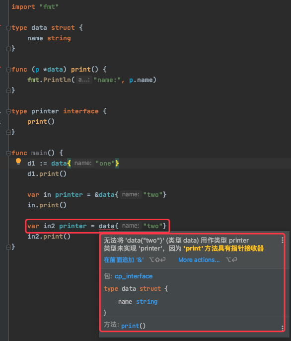

# 1. 14

## 1.1. 问题

### 1.1.1. 问题1

1.同级文件的包名不允许有多个，是否正确？
A. true
B. false

### 1.1.2. 问题2

2.下面的代码有什么问题，请说明。

```go
type data struct {
    name string
}

func (p *data) print() {
    fmt.Println("name:", p.name)
}

type printer interface {
    print()
}

func main() {
    d1 := data{"one"}
    d1.print()

    var in printer = data{"two"}
    in.print()
}
```

## 1.2. 答案

### 1.2.1. 答案1

参考答案及解析：A。一个文件夹下只能有一个包，可以多个.go文件，但这些文件必须属于同一个包。

### 1.2.2. 答案2

参考答案及解析：编译报错。

`var in printer = data{"two"}` 处会报错，错误信息为：cannot use data literal (type data) as type printer in assignment: data does not implement printer (print method has pointer receiver)

结构体类型 data 没有实现接口 printer。



**声明接口类型的变量时，其值需要是实现者的指针值。**
