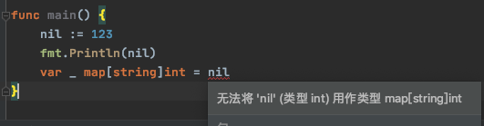

# 1. 33

## 1.1. 问题

### 1.1.1. 下面哪一行代码会编译出错，请说明。

```go
func main() {
    nil := 123
    fmt.Println(nil)
    var _ map[string]int = nil
}
```


### 1.1.2. 问题2

## 1.2. 答案

### 1.2.1. 答案1

参考答案及解析：第 4 行，当前作用域中，预定义的 nil 被覆盖，此时 nil 是 int 类型值，不能赋值给 map 类型。



### 1.2.2. 答案2

参考答案及解析：-128。因为溢出。

