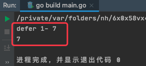

# 1. 65

## 1.1. 问题

### 1.1.1. 下面这段代码输出什么？

```go
func f(n int) (r int) {
    defer func() {
        r += n
        recover()
    }()

    var f func()

    defer f()
    f = func() {
        r += 2
    }
    return n + 1
}

func main() {
    fmt.Println(f(3))
}
```

### 1.1.2. 下面这段代码输出什么？

```go
func main() {
    var a = [5]int{1, 2, 3, 4, 5}
    var r [5]int

    for i, v := range a {
        if i == 0 {
            a[1] = 12
            a[2] = 13
        }
        r[i] = v
    }
    fmt.Println("r = ", r)
    fmt.Println("a = ", a)
}
```


## 1.2. 答案

### 1.2.1. 答案1

参考答案及解析：7。

根据前面提到过的“三步拆解法”，第一步执行 r = n +1，接着执行第二个 defer，由于此时 f() 未定义，引发异常，随即执行第一个 defer，先执行了其中的 r+=n ，然后异常被 recover()，程序正常执行，由于 recover() 后面没有内容了，所以 return，得到 7。

```go
package cp_defer

import "fmt"

func f(n int) (r int) {
	defer func() {
		r += n
		fmt.Println("defer 1-",r)
		recover()
	}()

	var f func()

	defer f()
	f = func() {
		r += 2
		fmt.Println("defer 2-",r)
	}
	return n + 1
}

func Defer7Test1() {
	fmt.Println(f(3))
}
```

运行结果：




### 1.2.2. 答案2

参考答案及解析：

```
r =  [1 2 3 4 5]
a =  [1 12 13 4 5]
```

r**ange 表达式是副本参与循环，就是说例子中参与循环的是 a 的副本，而不是真正的 a**。就这个例子来说，假设 b 是 a 的副本，则 range 循环代码是这样的

```go
for i, v := range b {
    if i == 0 {
        a[1] = 12
        a[2] = 13
    }
    r[i] = v
}
```

因此无论 a 被如何修改，其副本 b 依旧保持原值，并且参与循环的是 b，因此 v 从 b 中取出的仍旧是 a 的原值，而非修改后的值。

如果想要 r 和 a 一样输出，修复办法：

```go
func main() {
    var a = [5]int{1, 2, 3, 4, 5}
    var r [5]int

    for i, v := range &a {
        if i == 0 {
            a[1] = 12
            a[2] = 13
        }
        r[i] = v
    }
    fmt.Println("r = ", r)
    fmt.Println("a = ", a)
}
```

输出：

```
r =  [1 12 13 4 5]
a =  [1 12 13 4 5]
```

修复代码中，使用 `*[5]int` 作为 range 表达式，其副本依旧是一个指向原数组 a 的指针，因此后续所有循环中均是 `&a` 指向的原数组亲自参与的，因此 v 能从 &a 指向的原数组中取出 a 修改后的值。
