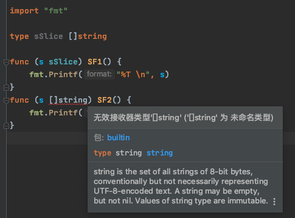

# 1. 7

## 1.1. 问题

### 1.1.1. 问题1

1.下面代码能通过编译吗？

```go
type T int

func F(t T) {}

func main() {
    var q int
    F(q)
}
```

### 1.1.2. 问题2

2.下面代码能通过编译吗？请简要说明。

```go
type T []int

func F(t T) {}

func main() {
    var q []int
    F(q)
}
```

## 1.2. 答案

### 1.2.1. 答案1

不能通过编译，虽然 T 底层也是 int , 但是使用 type 声明之后，它就和 int 的类型不一样了。不同类型的值是不能相互赋值的，即使底层类型一样，所以不能通过编译。

### 1.2.2. 答案2

对于底层类型相同的变量可以相互赋值还有一个重要的条件，即至少有一个不是有名类型（named type）。

这是 Go 语言规范手册的原文：

"x's type V and T have identical underlying types and at least one of V or T is not a named type. "

Named Type 有两类：

* 内置类型，比如 int, int64, float, string, bool 等；
* 使用关键字 type 声明的类型；

Unnamed Type 是基于已有的 Named Type 组合一起的类型，例如：struct{}、[]string、interface{}、map[string]bool 等。

```go
package cp_slice

import "fmt"

type T []int

func F(t T)      { fmt.Printf("%T \n", t) }
func F1(t []int) { fmt.Printf("%T \n", t) }

type S []string

func SF(s S)         { fmt.Printf("%T \n", s) }
func SF2(s []string) { fmt.Printf("%T \n", s) }

type M map[string]string

func mF(m M)                  { fmt.Printf("%T \n", m) }
func mF2(m map[string]string) { fmt.Printf("%T \n", m) }

func SliceTypeTest3() {
	var m1 map[string]string
	var m2 M

	mF(m1)
	mF(m2)

	mF2(m1)
	mF2(m2)
}
func SliceTypeTest2() {
	var as []string
	var ss S

	SF(as)
	SF(ss)

	SF2(as)
	SF2(ss)
}
func SliceTypeTest() {
	var q []int
	var t T

	fmt.Printf("%T \n", q) //[]int
	fmt.Printf("%T \n", t) //cp_slice.T

	F(q) //cp_slice.T
	F(t) //cp_slice.T

	F1(q) //[]int
	F1(t) //[]int

	// 这是错误写法，无效运算: t == q(在 []int 中未定义运算符 ==)
	//fmt.Println(t == q)
}
```

* 传递参数时，上述示例中 T 和 []int 一致
* 但是作为函数接收者时，必须使用具名类型。如下图：

