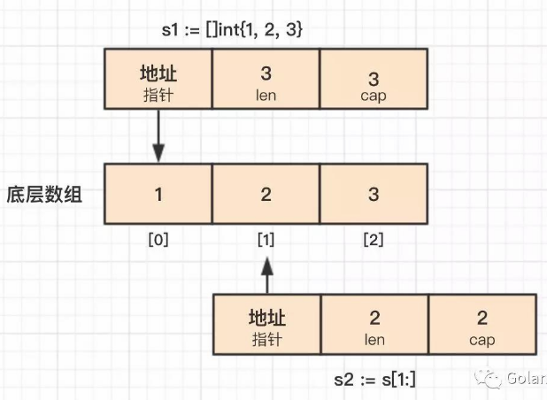

# 1. 72

## 1.1. 问题

### 1.1.1. 这段代码输出什么？为什么？

```go
func main() {
    s1 := []int{1, 2, 3}
    s2 := s1[1:]
    s2[1] = 4
    fmt.Println(s1)
    s2 = append(s2, 5, 6, 7)
    fmt.Println(s1)
}
```

### 1.1.2. 下面选项正确的是？

```go
func main() {
    if a := 1; false {
    } else if b := 2; false {
    } else {
        println(a, b)
    }
}
```

A. 1 2

B. compilation error


## 1.2. 答案

### 1.2.1. 答案1

参考答案及解析：

```
[1 2 4]

[1 2 4]
```

我们知道，golang 中切片底层的数据结构是数组。当使用 `s1[1:] `获得切片 s2，和 s1 共享同一个底层数组，这会导致 s2[1] = 4 语句影响 s1。

**而 `append 操作会导致底层数组扩容，生成新的数组，因此追加数据后的 s2 不会影响 s1`。**

但是为什么对 s2 赋值后影响的却是 s1 的第三个元素呢？这是因为切片 s2 是从数组的第二个元素开始，s2 索引为 1 的元素对应的是 s1 索引为 2 的元素。



### 1.2.2. 答案2

参考答案及解析：A。知识点：代码块和变量作用域。

