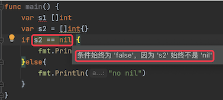

# 1. 80

[原文链接](https://www.topgoer.cn/docs/gomianshiti/mian15)

## 1.1. 问题

### 1.1.1. 问题1

```go
func main() {
    var s1 []int
    var s2 = []int{}
    if __ == nil {
        fmt.Println("yes nil")
    }else{
        fmt.Println("no nil")
    }
}
```

A. s1

B. s2

C. s1、s2 都可以


### 1.1.2. 问题2

```go
func main() {  
    i := 65
    fmt.Println(string(i))
}
```

A. A

B. 65

C. compilation error

### 1.1.3. 问题3

下面这段代码输出什么？

```go
type A interface {
    ShowA() int
}

type B interface {
    ShowB() int
}

type Work struct {
    i int
}

func (w Work) ShowA() int {
    return w.i + 10
}

func (w Work) ShowB() int {
    return w.i + 20
}

func main() {
    c := Work{3}
    var a A = c
    var b B = c
    fmt.Println(a.ShowA())
    fmt.Println(b.ShowB())
}
```

## 1.2. 答案

### 1.2.1. 答案1

A。知识点：nil 切片和空切片。

nil 切片和 nil 相等，一般用来表示一个不存在的切片；空切片和 nil 不相等，表示一个空的集合。



### 1.2.2. 答案2

A。UTF-8 编码中，十进制数字 65 对应的符号是 A。

`string(int)` 会把 int 值转换为对应的 UTF-8 字符，即大写字母 A

### 1.2.3. 答案3

13 23。知识点：接口。

一种类型实现多个接口，结构体 Work 分别实现了接口 A、B，所以接口变量 a、b 调用各自的方法 ShowA() 和 ShowB()，输出 13、23。
