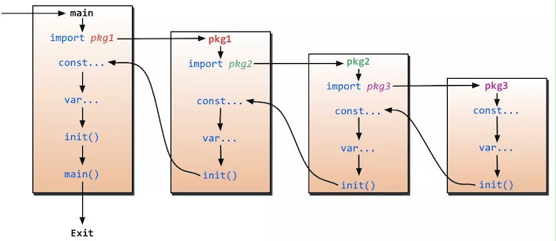

# 1. 87

[原文链接](https://www.topgoer.cn/docs/gomianshiti/mian8)

## 1.1. 问题

### 1.1.1. 问题1

关于init函数，下面说法正确的是()

A. 一个包中，可以包含多个 init 函数；

B. 程序编译时，先执行依赖包的 init 函数，再执行 main 包内的 init 函数；

C. main 包中，不能有 init 函数；

D. init 函数可以被其他函数调用；


### 1.1.2. 问题2

下面这段代码输出什么以及原因？

```go
func hello() []string {
     return nil
 }

 func main() {
     h := hello
     if h == nil {
         fmt.Println("nil")
     } else {
        fmt.Println("not nil")
    }
}
```

A. nil

B. not nil

C. compilation error

### 1.1.3. 问题3

下面这段代码能否编译通过？如果可以，输出什么？


```go
func GetValue() int {
     return 1
 }

 func main() {
     i := GetValue()
     switch i.(type) {
     case int:
         println("int")
     case string:
        println("string")
     case interface{}:
        println("interface")
     default:
        println("unknown")
    }
}
```


## 1.2. 答案

### 1.2.1. 答案1

AB。

关于 init() 函数有几个需要注意的地方：

* init() 函数是用于程序执行前做包的初始化的函数，比如初始化包里的变量等;
* 一个包可以出现多个 init() 函数,一个源文件也可以包含多个 init() 函数；
* 同一个包中多个 init() 函数的执行顺序没有明确定义，但是不同包的 init 函数是根据包导入的依赖关系决定的（看下图）



* init() 函数在代码中不能被显示调用、不能被引用（赋值给函数变量），否则出现编译错误;
* 一个包被引用多次，如 A import B, C import B, A import C，B 被引用多次，但 B 包只会初始化一次；
* 引入包，不可出现死循坏。即 A import B,B import A，这种情况编译失败；


### 1.2.2. 答案2

B。

这道题目里面，**是将 hello() 赋值给变量 h，而不是函数的返回值，所以输出 not nil**。

### 1.2.3. 答案3

编译失败。

考点：类型选择，类型选择的语法形如：`i.(type)`，其中 i 是接口，type 是固定关键字，需要注意的是，**只有接口类型才可以使用类型选择**。
