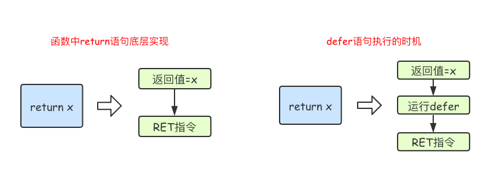

# 1. 10 函数

[原文地址：《Go语言基础之函数》](https://www.liwenzhou.com/posts/Go/09_function/)


函数是组织好的、可重复使用的、用于执行指定任务的代码块。本文介绍了 Go 语言中函数的相关内容。

Go 语言中支持函数、`匿名函数`和`闭包`，并且函数在  Go 语言中属于“一等公民”。

## 1.1. 函数定义

Go 语言中定义函数使用 func 关键字，具体格式如下：

```go
func 函数名(参数)(返回值){
    函数体
}
```

其中：

* 函数名：由字母、数字、下划线组成。但函数名的第一个字母不能是数字。在同一个包内，函数名也称不能重名（包的概念详见后文）。
* 参数：参数由参数变量和参数变量的类型组成，多个参数之间使用 `,`分隔。
* 返回值：返回值由返回值变量和其变量类型组成，也可以只写返回值的类型，多个返回值必须用 `()` 包裹，并用 `,` 分隔。
* 函数体：实现指定功能的代码块。 

我们先来定义一个求两个数之和的函数：

```go
func intSum(x int, y int) int {
	return x + y
}
```

函数的参数和返回值都是可选的，例如我们可以实现一个既不需要参数也没有返回值的函数：

```go
func sayHello() {
	fmt.Println("Hello 沙河")
}
```

## 1.2. 函数的调用

定义了函数之后，我们可以通过 `函数名()` 的方式调用函数。 例如我们调用上面定义的两个函数，代码如下：

```go
func main() {
	sayHello()
	ret := intSum(10, 20)
	fmt.Println(ret)
}
```

注意，调用有返回值的函数时，可以不接收其返回值。

## 1.3. 参数

### 1.3.1. 类型简写

函数的参数中如果相邻变量的类型相同，则可以省略类型，例如：

```go
func intSum(x, y int) int {
	return x + y
}
```

示例2：

```go
func f1(x int, y int) {
	fmt.Println("这是普通的参数声明方式")
}

func f2(x, y int) {
	fmt.Println("参数中多个连续的参数类型一致时，可以省略非最后一个参数的类型")
}

func f3(x, y int, m, n string, a, b bool) {
	fmt.Println("参数中多个连续的参数类型一致时，可以省略非最后一个参数的类型")
}
```


上面的代码中，intSum 函数有两个参数，这两个参数的类型均为 int，因此可以省略 x 的类型，因为 y 后面有类型说明，x 参数也是该类型。

### 1.3.2. 可变参数

可变参数是指函数的参数数量不固定。Go语言中的可变参数通过**在参数名后加`...`**来标识。

注意：**可变参数通常要作为函数的最后一个参数**。

举个例子：

```go
func intSum2(x ...int) int {
	fmt.Println(x) //x是一个切片
	sum := 0
	for _, v := range x {
		sum = sum + v
	}
	return sum
}
```

调用上面的函数：

```go
ret1 := intSum2()
ret2 := intSum2(10)
ret3 := intSum2(10, 20)
ret4 := intSum2(10, 20, 30)
fmt.Println(ret1, ret2, ret3, ret4) //0 10 30 60
```

固定参数搭配可变参数使用时，**可变参数要放在固定参数的后面**，示例代码如下：

```go
func intSum3(x int, y ...int) int {
	fmt.Println(x, y)
	sum := x
	for _, v := range y {
		sum = sum + v
	}
	return sum
}
```

调用上述函数：

```go
ret5 := intSum3(100)
ret6 := intSum3(100, 10)
ret7 := intSum3(100, 10, 20)
ret8 := intSum3(100, 10, 20, 30)
fmt.Println(ret5, ret6, ret7, ret8) //100 110 130 160
```

示例3：

```go
package main

import "fmt"

func main() {
	f4("济南", 1, 2, 3, 4, 5, 6)
}

// ...表示可变长度参数，...int 表示可以传入多个 int 值, 其本质是切片
func f4(x string, y ...int) {
	fmt.Println(x)

	fmt.Println(y)
	fmt.Printf("%T\n", y)
}
```

运行结果如下：

```go
济南
[1 2 3 4 5 6]
[]int
```

**本质上，函数的可变参数是通过切片来实现的。**

* **可变长参数必须写在函数最后**
* go 语言中没有默认参数的概念

## 1.4. 返回值

Go 语言中通过 return 关键字向外输出返回值。

### 1.4.1. 多返回值

Go 语言中函数支持多返回值，函数如果有多个返回值时必须用 `()` 将所有返回值包裹起来。

举个例子：

```go
func calc(x, y int) (int, int) {
	sum := x + y
	sub := x - y
	return sum, sub
}
```

示例2：

```go
package main

import "fmt"

func main() {
	// 定义两个变量分别接收 f1 的两个返回值
	m, n := f1()
	fmt.Println(m, n)

	// 我们仅需要其中一个返回值时，另一个不需要的返回值使用 _ 表示
	_, b := f1()
	fmt.Println(b)
}

// 该函数有两个返回值, int 和 string
func f1() (int, string) {
	return 1, "济南"
}
```

### 1.4.2. 返回值命名

函数定义时可以给返回值命名，并在函数体中直接使用这些变量，最后通过 `return` 关键字返回。

例如：

```go
func calc(x, y int) (sum, sub int) {
	sum = x + y
	sub = x - y

    // 此处直接写 return 即可，不需要后缀返回变量名称
	return
}
```

### 1.4.3. 返回值补充

当我们的一个函数返回值类型为 slice 时，nil 可以看做是一个有效的 slice，没必要显示返回一个长度为 0 的切片。

```go
func someFunc(x string) []int {
	if x == "" {
		return nil // 没必要返回[]int{}
	}
	...
}
```

## 1.5. 变量作用域

### 1.5.1. 全局变量

**全局变量是定义在函数外部的变量，它在程序整个运行周期内都有效。** 

在函数中可以访问到全局变量。

```go
package main

import "fmt"

//定义全局变量num
var num int64 = 10

func testGlobalVar() {
	fmt.Printf("num=%d\n", num) //函数中可以访问全局变量num
}
func main() {
	testGlobalVar() //num=10
}
```

### 1.5.2. 局部变量

局部变量又分为两种： 函数内定义的变量无法在该函数外使用，例如下面的示例代码 main 函数中无法使用 testLocalVar 函数中定义的变量 x：

```go
func testLocalVar() {
	//定义一个函数局部变量x,仅在该函数内生效
	var x int64 = 100
	fmt.Printf("x=%d\n", x)
}

func main() {
	testLocalVar()
	fmt.Println(x) // 此时无法使用变量x
}
```

如果局部变量和全局变量重名，优先访问局部变量。

```go
package main

import "fmt"

//定义全局变量num
var num int64 = 10

func testNum() {
	num := 100
	fmt.Printf("num=%d\n", num) // 函数中优先使用局部变量
}
func main() {
	testNum() // num=100
}
```

接下来我们来看一下语句块定义的变量，通常我们会在 if 条件判断、for 循环、switch 语句上使用这种定义变量的方式。

```go
func testLocalVar2(x, y int) {
	fmt.Println(x, y) //函数的参数也是只在本函数中生效
	if x > 0 {
		z := 100 //变量z只在if语句块生效
		fmt.Println(z)
	}
	//fmt.Println(z)//此处无法使用变量z
}
```

还有我们之前讲过的for循环语句中定义的变量，也是只在for语句块中生效：

```go
func testLocalVar3() {
	for i := 0; i < 10; i++ {
		fmt.Println(i) //变量i只在当前for语句块中生效
	}
	//fmt.Println(i) //此处无法使用变量i
}
```

## 1.6. 函数类型与变量

### 1.6.1. 定义函数类型

我们可以使用 type 关键字来定义一个函数类型，具体格式如下：

`type calculation func(int, int) int`

上面语句定义了一个 `calculation` 类型，它是一种函数类型，这种函数接收两个 int 类型的参数并且返回一个 int 类型的返回值。

简单来说，凡是满足这个条件的函数都是 calculation 类型的函数，例如下面的 add 和 sub 是 calculation 类型。

```go
func add(x, y int) int {
	return x + y
}

func sub(x, y int) int {
	return x - y
}
```

add 和 sub 都能赋值给 calculation 类型的变量。

```go
var c calculation
c = add
```

### 1.6.2. 函数类型变量

我们可以声明函数类型的变量并且为该变量赋值：

```go
func main() {
	var c calculation               // 声明一个calculation类型的变量c
	c = add                         // 把add赋值给c
	fmt.Printf("type of c:%T\n", c) // type of c:main.calculation
	fmt.Println(c(1, 2))            // 像调用add一样调用c

	f := add                        // 将函数add赋值给变量f1
	fmt.Printf("type of f:%T\n", f) // type of f:func(int, int) int
	fmt.Println(f(10, 20))          // 像调用add一样调用f
}
```

## 1.7. 高阶函数

高阶函数分为函数作为参数和函数作为返回值两部分。

### 1.7.1. 函数作为参数

函数可以作为参数：

```go
func add(x, y int) int {
	return x + y
}
func calc(x, y int, op func(int, int) int) int {
	return op(x, y)
}
func main() {
	ret2 := calc(10, 20, add)
	fmt.Println(ret2) //30
}
```

### 1.7.2. 函数作为返回值

函数也可以作为返回值：

```go
func do(s string) (func(int, int) int, error) {
	switch s {
	case "+":
		return add, nil
	case "-":
		return sub, nil
	default:
		err := errors.New("无法识别的操作符")
		return nil, err
	}
}
```

## 1.8. 匿名函数和闭包

### 1.8.1. 匿名函数

函数当然还可以作为返回值，但是在 Go 语言中函数内部不能再像之前那样定义函数了，只能定义匿名函数。

匿名函数就是没有函数名的函数，匿名函数的定义格式如下：

```go
func(参数)(返回值){
    函数体
}
```

匿名函数因为没有函数名，所以没办法像普通函数那样调用，所以**匿名函数需要保存到某个变量或者作为立即执行函数**:

```go
func main() {
	// 将匿名函数保存到变量
	add := func(x, y int) {
		fmt.Println(x + y)
	}
	add(10, 20) // 通过变量调用匿名函数

	//自执行函数：匿名函数定义完加()直接执行
	func(x, y int) {
		fmt.Println(x + y)
	}(10, 20)
}
```

匿名函数多用于实现回调函数和闭包。

### 1.8.2. 闭包

闭包指的是一个函数和与其相关的引用环境组合而成的实体。简单来说，**闭包=函数+引用环境**。 首先我们来看一个例子：

```go
func adder() func(int) int {
	var x int
	return func(y int) int {
		x += y
		return x
	}
}
func main() {
	var f = adder()
	fmt.Println(f(10)) //10
	fmt.Println(f(20)) //30
	fmt.Println(f(30)) //60

	f1 := adder()
	fmt.Println(f1(40)) //40
	fmt.Println(f1(50)) //90
}
```

**变量 f 是一个函数并且它引用了其外部作用域中的 x 变量，此时 f 就是一个闭包。**在 f 的生命周期内，变量 x 也一直有效。

闭包进阶示例1：

```go
func adder2(x int) func(int) int {
	return func(y int) int {
		x += y
		return x
	}
}

func main() {
	var f = adder2(10)
	fmt.Println(f(10)) //20
	fmt.Println(f(20)) //40
	fmt.Println(f(30)) //70

	f1 := adder2(20)
	fmt.Println(f1(40)) //60
	fmt.Println(f1(50)) //110
}
```

闭包进阶示例2：

```go
func makeSuffixFunc(suffix string) func(string) string {
	return func(name string) string {
		if !strings.HasSuffix(name, suffix) {
			return name + suffix
		}
		return name
	}
}

func main() {
	jpgFunc := makeSuffixFunc(".jpg")
	txtFunc := makeSuffixFunc(".txt")
	fmt.Println(jpgFunc("test")) //test.jpg
	fmt.Println(txtFunc("test")) //test.txt
}
```

闭包进阶示例3：

```go
func calc(base int) (func(int) int, func(int) int) {
	add := func(i int) int {
		base += i
		return base
	}

	sub := func(i int) int {
		base -= i
		return base
	}
	return add, sub
}

func main() {
	f1, f2 := calc(10)
	fmt.Println(f1(1), f2(2)) //11 9
	fmt.Println(f1(3), f2(4)) //12 8
	fmt.Println(f1(5), f2(6)) //13 7
}
```

闭包其实并不复杂，只要牢记闭包=函数+引用环境。

## 1.9. defer语句

Go 语言中的 defer 语句会将其后面跟随的语句进行延迟处理。

在 defer 归属的函数即将返回时，将延迟处理的语句按 defer 定义的逆序进行执行，也就是说，先被 defer 的语句最后被执行，最后被 defer 的语句，最先被执行。

举个例子：

```go
func main() {
	fmt.Println("start")
	defer fmt.Println(1)
	defer fmt.Println(2)
	defer fmt.Println(3)
	fmt.Println("end")
}
```

输出结果：

```
start
end
3
2
1
```

由于 defer 语句延迟调用的特性，所以 defer 语句能非常方便的处理资源释放问题。比如：资源清理、文件关闭、解锁及记录时间等。

### 1.9.1. defer 执行时机

**在 Go 语言的函数中 return 语句在底层并不是原子操作，它分为给返回值赋值和RET指令两步**。

而 defer 语句执行的时机就在返回值赋值操作后，RET指令执行前。具体如下图所示：



### 1.9.2. defer 经典案例

阅读下面的代码，写出最后的打印结果。

```go
func f1() int {
	x := 5
	defer func() {
		x++
	}()
	return x
}

func f2() (x int) {
	defer func() {
		x++
	}()
	return 5
}

func f3() (y int) {
	x := 5
	defer func() {
		x++
	}()
	return x
}

func f4() (x int) {
	defer func(x int) {
		x++
	}(x)
	return 5
}

func main() {
	fmt.Println(f1())
	fmt.Println(f2())
	fmt.Println(f3())
	fmt.Println(f4())
}
```

运行结果：

```
5
6
5
5
```

### 1.9.3. defer 面试题


```go
func calc(index string, a, b int) int {
	ret := a + b
	fmt.Println(index, a, b, ret)
	return ret
}

func main() {
	x := 1
	y := 2
	defer calc("AA", x, calc("A", x, y))
	x = 10
	defer calc("BB", x, calc("B", x, y))
	y = 20
}
```

问，上面代码的输出结果是？（提示：defer 注册要延迟执行的函数时该函数所有的参数都需要确定其值）

```
// 运行结果：
A 1 2 3
B 10 2 12
BB 10 12 22
AA 1 3 4

```

## 1.10. 内置函数介绍

内置函数	| 介绍
---|---
close | 主要用来关闭channel
len	| 用来求长度，比如string、array、slice、map、channel
new	| 用来分配内存，主要用来分配值类型，比如int、struct。返回的是指针
make | 用来分配内存，主要用来分配引用类型，比如chan、map、slice
append | 用来追加元素到数组、slice中
panic和recover | 用来做错误处理

### 1.10.1. panic/recover

Go 语言中目前（Go1.12）是没有异常机制，但是使用 panic/recover 模式来处理错误。 

panic 可以在任何地方引发，**但 recover 只有在 defer 调用的函数中有效**。 首先来看一个例子：

```go
func funcA() {
	fmt.Println("func A")
}

func funcB() {
	panic("panic in B")
}

func funcC() {
	fmt.Println("func C")
}
func main() {
	funcA()
	funcB()
	funcC()
}
```

输出：

```
func A
panic: panic in B

goroutine 1 [running]:
main.funcB(...)
        .../code/func/main.go:12
main.main()
        .../code/func/main.go:20 +0x98
```

程序运行期间 funcB 中引发了 panic 导致程序崩溃，异常退出了。这个时候我们就可以通过 recover 将程序恢复回来，继续往后执行。

```go
func funcA() {
	fmt.Println("func A")
}

func funcB() {
	defer func() {
		err := recover()
		//如果程序出出现了panic错误,可以通过recover恢复过来
		if err != nil {
			fmt.Println("recover in B")
		}
	}()
	panic("panic in B")
}

func funcC() {
	fmt.Println("func C")
}
func main() {
	funcA()
	funcB()
	funcC()
}
```

注意：

* recover() 必须搭配 defer 使用。
* defer 一定要在可能引发 panic 的语句之前定义。


