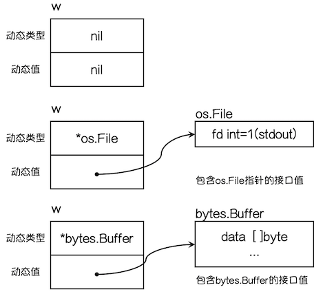

[原文链接：Go语言基础之接口](https://www.liwenzhou.com/posts/Go/12_interface/)

接口（interface）定义了一个对象的行为规范，**只定义规范不实现，由具体的对象来实现规范的细节**。

## 1. 接口类型

**在 Go 语言中接口（interface）是一种类型，一种抽象的类型。**

interface 是`一组 method 的集合`，是 duck-type programming （鸭子类型编程）的一种体现。

接口做的事情就像是定义一个协议（规则），只要一台机器有洗衣服和甩干的功能，我就称它为洗衣机。**不关心属性（数据），只关心行为（方法）**。

为了保护你的 Go 语言职业生涯，请牢记接口（interface）是一种类型。

## 2. 为什么要使用接口

```go
type Cat struct{}

func (c Cat) Say() string { return "喵喵喵" }

type Dog struct{}

func (d Dog) Say() string { return "汪汪汪" }

func main() {
	c := Cat{}
	fmt.Println("猫:", c.Say())
	d := Dog{}
	fmt.Println("狗:", d.Say())
}
```

上面的代码中定义了猫和狗，然后它们都会叫，你会发现 main 函数中明显有重复的代码，如果我们后续再加上猪、青蛙等动物的话，我们的代码还会一直重复下去。那我们能不能把它们当成“能叫的动物”来处理呢？

像类似的例子在我们编程过程中会经常遇到：

比如一个网上商城可能使用支付宝、微信、银联等方式去在线支付，我们能不能把它们当成“支付方式”来处理呢？

比如三角形，四边形，圆形都能计算周长和面积，我们能不能把它们当成“图形”来处理呢？

比如销售、行政、程序员都能计算月薪，我们能不能把他们当成“员工”来处理呢？

Go 语言中为了解决类似上面的问题，就设计了接口这个概念。接口区别于我们之前所有的具体类型，**接口是一种抽象的类型。当你看到一个接口类型的值时，你不知道它是什么，唯一知道的是通过它的方法能做什么。**

## 3. 接口的定义

Go 语言提倡面向接口编程。

每个接口由数个方法组成，接口的定义格式如下：

```go
type 接口类型名 interface{
    方法名1( 参数列表1 ) 返回值列表1
    方法名2( 参数列表2 ) 返回值列表2
    …
}
```

其中：

* 接口名：使用 type 将接口定义为自定义的类型名。Go语言的接口在命名时，一般会在单词后面添加 `er`，如有写操作的接口叫 Writer，有字符串功能的接口叫Stringer 等。接口名最好要能突出该接口的类型含义。
* 方法名：当方法名首字母是大写且这个接口类型名首字母也是大写时，这个方法可以被接口所在的包（package）之外的代码访问。
* 参数列表、返回值列表：参数列表和返回值列表中的参数变量名可以省略。

举个例子：

```go
type writer interface{
    Write([]byte) error
}
```

当你看到这个接口类型的值时，你不知道它是什么，唯一知道的就是可以通过它的 Write 方法来做一些事情。

## 4. 实现接口的条件

### 4.1. 实现接口

**一个对象只要全部实现了接口中的方法，那么就实现了这个接口**。换句话说，`接口就是一个需要实现的方法列表`。

我们来定义一个 Sayer 接口：

```go
// Sayer 接口
type Sayer interface {
	say()
}
```

定义 dog 和 cat 两个结构体：

```go
type dog struct {}

type cat struct {}
```

因为 Sayer 接口里只有一个 say 方法，所以我们只需要给 dog 和 cat 分别实现 say 方法就可以实现 Sayer 接口了。

```go
// dog实现了Sayer接口
func (d dog) say() {
	fmt.Println("汪汪汪")
}

// cat实现了Sayer接口
func (c cat) say() {
	fmt.Println("喵喵喵")
}
```

接口的实现就是这么简单，只要实现了接口中的所有方法，就实现了这个接口。

### 4.2. 嵌套结构体实现接口

一个接口的方法，不一定需要由一个类型完全实现，**接口的方法可以通过在类型中嵌入其他类型或者结构体来实现**。

```go
// WashingMachine 洗衣机
type WashingMachine interface {
	wash()
	dry()
}

// 甩干器
type dryer struct{}

// 实现WashingMachine接口的dry()方法
func (d dryer) dry() {
	fmt.Println("甩一甩")
}

// 海尔洗衣机
type haier struct {
	dryer //嵌入甩干器
}

// 实现WashingMachine接口的wash()方法
func (h haier) wash() {
	fmt.Println("洗刷刷")
}
```

## 5. 接口类型变量

那实现了接口有什么用呢？

**接口类型变量能够存储所有实现了该接口的实例**。 

例如上面的示例中，Sayer 类型的变量能够存储 dog 和 cat 类型的变量。

```go
func main() {
	var x Sayer // 声明一个Sayer类型的变量x
	a := cat{}  // 实例化一个cat
	b := dog{}  // 实例化一个dog
	x = a       // 可以把cat实例直接赋值给x
	x.say()     // 喵喵喵
	x = b       // 可以把dog实例直接赋值给x
	x.say()     // 汪汪汪
}
```

Tips： 观察下面的代码，体味此处 `_` 的妙用

```go
// 摘自gin框架routergroup.go
type IRouter interface{ ... }

type RouterGroup struct { ... }

var _ IRouter = &RouterGroup{}  // 确保RouterGroup实现了接口IRouter
```

## 6. 值接收者和指针接收者实现接口的区别

使用值接收者实现接口和使用指针接收者实现接口有什么区别呢？接下来我们通过一个例子看一下其中的区别。

我们有一个 Mover 接口和一个 dog 结构体。

```go
type Mover interface {
	move()
}

type dog struct {}
```

### 6.1. 值接收者实现接口

```go
func (d dog) move() {
	fmt.Println("狗会动")
}
```

此时实现接口的是 dog 类型：

```go
func main() {
	var x Mover
	var wangcai = dog{} // 旺财是dog类型
	x = wangcai         // x可以接收dog类型

	var fugui = &dog{}  // 富贵是*dog类型
	x = fugui           // x可以接收*dog类型
	x.move()
}
```

从上面的代码中我们可以发现，使用值接收者实现接口之后，不管是 dog 结构体还是结构体指针 `*dog` 类型的变量都可以赋值给该接口变量。

因为 Go 语言中有对指针类型变量求值的语法糖，dog 指针 fugui 内部会自动求值`*fugui`。

### 6.2. 指针接收者实现接口

同样的代码我们再来测试一下使用指针接收者有什么区别：

```go
func (d *dog) move() {
	fmt.Println("狗会动")
}
func main() {
	var x Mover
	var wangcai = dog{} // 旺财是dog类型
	x = wangcai         // x不可以接收dog类型

	var fugui = &dog{}  // 富贵是*dog类型
	x = fugui           // x可以接收*dog类型
}
```

此时实现 Mover 接口的是 `*dog` 类型，所以不能给 x 传入 dog 类型的 wangcai，此时 x 只能存储 `*dog` 类型的值。

### 6.3. 面试题

注意：这是一道你需要回答“能”或者“不能”的题！

首先请观察下面的这段代码，然后请回答这段代码能不能通过编译？

```go
type People interface {
	Speak(string) string
}

type Student struct{}

func (stu *Student) Speak(think string) (talk string) {
	if think == "sb" {
		talk = "你是个大帅比"
	} else {
		talk = "您好"
	}
	return
}

func main() {
	var peo People = Student{}
	think := "bitch"
	fmt.Println(peo.Speak(think))
}
```

## 7. 类型与接口的关系

### 7.1. 一个类型实现多个接口

一个类型可以同时实现多个接口，而接口间彼此独立，不知道对方的实现。 例如，狗可以叫，也可以动。我们就分别定义 Sayer 接口和 Mover 接口，如下： Mover 接口。

```go
// Sayer 接口
type Sayer interface {
	say()
}

// Mover 接口
type Mover interface {
	move()
}
```

dog 既可以实现 Sayer 接口，也可以实现 Mover 接口。

```go
type dog struct {
	name string
}

// 实现Sayer接口
func (d dog) say() {
	fmt.Printf("%s会叫汪汪汪\n", d.name)
}

// 实现Mover接口
func (d dog) move() {
	fmt.Printf("%s会动\n", d.name)
}

func main() {
	var x Sayer
	var y Mover

	var a = dog{name: "旺财"}
	x = a
	y = a
	x.say()
	y.move()
}
```

### 7.2. 多个类型实现同一接口

Go 语言中不同的类型还可以实现同一接口

首先我们定义一个 Mover 接口，它要求必须由一个 move 方法。

```go
// Mover 接口
type Mover interface {
	move()
}
```

例如狗可以动，汽车也可以动，可以使用如下代码实现这个关系：

```go
type dog struct {
	name string
}

type car struct {
	brand string
}

// dog类型实现Mover接口
func (d dog) move() {
	fmt.Printf("%s会跑\n", d.name)
}

// car类型实现Mover接口
func (c car) move() {
	fmt.Printf("%s速度70迈\n", c.brand)
}
```

这个时候我们在代码中就可以把狗和汽车当成一个会动的物体来处理了，不再需要关注它们具体是什么，只需要调用它们的 move 方法就可以了。

```go
func main() {
	var x Mover
	var a = dog{name: "旺财"}
	var b = car{brand: "保时捷"}
	x = a
	x.move()
	x = b
	x.move()
}
```

上面的代码执行结果如下：

```
旺财会跑
保时捷速度70迈
```

## 8. 接口嵌套

接口与接口间可以通过嵌套创造出新的接口。

```go
// Sayer 接口
type Sayer interface {
	say()
}

// Mover 接口
type Mover interface {
	move()
}

// 接口嵌套
type animal interface {
	Sayer
	Mover
}
```

嵌套得到的接口的使用与普通接口一样，这里我们让 cat 实现 animal 接口：

```go
type cat struct {
	name string
}

func (c cat) say() {
	fmt.Println("喵喵喵")
}

func (c cat) move() {
	fmt.Println("猫会动")
}

func main() {
	var x animal
	x = cat{name: "花花"}
	x.move()
	x.say()
}
```

## 9. 空接口

### 9.1. 空接口的定义

空接口是指**没有定义任何方法的接口**。因此**任何类型都实现了空接口**。

空接口类型的变量可以存储任意类型的变量。

```go
func main() {
	// 定义一个空接口x
	var x interface{}
	s := "Hello 沙河"
	x = s
	fmt.Printf("type:%T value:%v\n", x, x)

	i := 100
	x = i
	fmt.Printf("type:%T value:%v\n", x, x)

	b := true
	x = b
	fmt.Printf("type:%T value:%v\n", x, x)
}
```

### 9.2. 空接口的应用

#### 9.2.1. 空接口作为函数的参数

使用空接口实现**可以接收任意类型的函数参数**。

```go
// 空接口作为函数参数
func show(a interface{}) {
	fmt.Printf("type:%T value:%v\n", a, a)
}
```

#### 9.2.2. 空接口作为map的值

使用空接口实现**可以保存任意值的字典**。

```go
// 空接口作为map值
	var studentInfo = make(map[string]interface{})
	studentInfo["name"] = "沙河娜扎"
	studentInfo["age"] = 18
	studentInfo["married"] = false
	fmt.Println(studentInfo)
```

## 10. 类型断言

空接口可以存储任意类型的值，那我们如何获取其存储的具体数据呢？

### 10.1. 接口值

一个接口的值（简称接口值）是**由一个具体类型和具体类型的值**两部分组成的。这两部分分别称为接口的`动态类型`和`动态值`。

我们来看一个具体的例子：

```go
var w io.Writer
w = os.Stdout
w = new(bytes.Buffer)
w = nil
```

请看下图分解：



### 10.2. 类型断言

想要判断空接口中的值这个时候就可以使用类型断言，其语法格式：

```go
x.(T)
```

其中：

* x：表示类型为 interface{} 的变量
* T：表示断言 x 可能是的类型。

该语法返回两个参数，第一个参数是 **x 转化为 T 类型后的变量**，第二个值是一个布尔值，若为 true 则表示断言成功，为 false 则表示断言失败。

举个例子：

```go
func main() {
	var x interface{}
	x = "Hello 沙河"
	v, ok := x.(string)
	if ok {
		fmt.Println(v)
	} else {
		fmt.Println("类型断言失败")
	}
}
```

上面的示例中如果要断言多次就需要写多个if判断，这个时候我们可以使用 switch 语句来实现：

```go
func justifyType(x interface{}) {
	switch v := x.(type) {
	case string:
		fmt.Printf("x is a string，value is %v\n", v)
	case int:
		fmt.Printf("x is a int is %v\n", v)
	case bool:
		fmt.Printf("x is a bool is %v\n", v)
	default:
		fmt.Println("unsupport type！")
	}
}
```

因为空接口可以存储任意类型值的特点，所以空接口在 Go 语言中的使用十分广泛。

关于接口需要注意的是，只有当有两个或两个以上的具体类型必须以相同的方式进行处理时才需要定义接口。不要为了接口而写接口，那样只会增加不必要的抽象，导致不必要的运行时损耗。

## 11. 练习题

使用接口的方式实现一个既可以往终端写日志也可以往文件写日志的简易日志库。