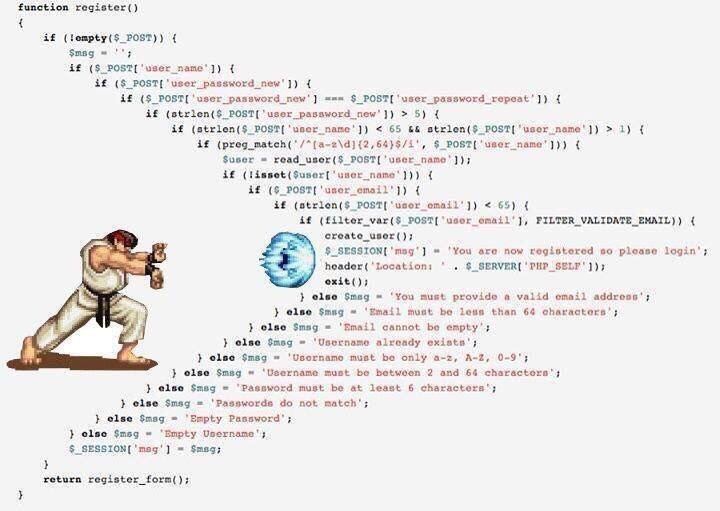

# 1. 13-优化应用结构和实现Redis缓存

> 2022-01-26 10:01

[点击查看原文](https://eddycjy.com/posts/go/gin/2018-06-02-application-redis/)

## 1.1. 前言

之前就在想，不少教程或示例的代码设计都是一步到位的（也没问题）

但实际操作的读者真的能够理解透彻为什么吗？左思右想，有了今天这一章的内容，我认为实际经历过一遍印象会更加深刻

## 1.2. 本文目标

在本章节，将介绍以下功能的整理：

* 抽离、分层业务逻辑：减轻 `routers.go` 内的 api 方法的逻辑（但本文暂不分层 `repository`，这块逻辑还不重）。
* 增加容错性：对 gorm 的错误进行判断。
* Redis 缓存：对获取数据类的接口增加缓存设置。
* 减少重复冗余代码。

## 1.3. 问题在哪？

在规划阶段我们发现了一个问题，这是目前的伪代码：

```go
if ! HasErrors() {
	if ExistArticleByID(id) {
		DeleteArticle(id)
		code = e.SUCCESS
	} else {
		code = e.ERROR_NOT_EXIST_ARTICLE
	}
} else {
	for _, err := range valid.Errors {
		logging.Info(err.Key, err.Message)
	}
}

c.JSON(http.StatusOK, gin.H{
	"code": code,
	"msg":  e.GetMsg(code),
	"data": make(map[string]string),
})
```

如果加上规划内的功能逻辑呢，伪代码会变成：

```go
if ! HasErrors() {
    exists, err := ExistArticleByID(id)
    if err == nil {
        if exists {
    		err = DeleteArticle(id)
    		if err == nil {
    		    code = e.SUCCESS
    		} else {
    		    code = e.ERROR_XXX
    		}
    	} else {
    		code = e.ERROR_NOT_EXIST_ARTICLE
    	}
    } else {
        code = e.ERROR_XXX
    }
} else {
	for _, err := range valid.Errors {
		logging.Info(err.Key, err.Message)
	}
}

c.JSON(http.StatusOK, gin.H{
	"code": code,
	"msg":  e.GetMsg(code),
	"data": make(map[string]string),
})
```

如果缓存的逻辑也加进来，后面慢慢不断的迭代，岂不是会变成如下图一样？



现在我们发现了问题，应及时解决这个代码结构问题，同时把代码写的清晰、漂亮、易读易改也是一个重要指标

## 1.4. 如何改？

在[左耳朵耗子](https://coolshell.cn/articles/17757.html)的文章中，这类代码被称为 “箭头型” 代码，有如下几个问题：

* 我的显示器不够宽，箭头型代码缩进太狠了，需要我来回拉水平滚动条，这让我在读代码的时候，相当的不舒服
* 除了宽度外还有长度，有的代码的 `if-else` 里的 `if-else` 里的 `if-else` 的代码太多，读到中间你都不知道中间的代码是经过了什么样的层层检查才来到这里的

总而言之，“箭头型代码”如果嵌套太多，代码太长的话，会让维护代码的人（包括自己）迷失在代码中，因为看到最内层的代码时，你已经不知道前面的那一层一层的条件判断是什么样的，代码是怎么运行到这里的，所以，箭头型代码是非常难以维护和 Debug 的。

简单的来说，就是**让出错的代码先返回，前面把所有的错误判断全判断掉，然后就剩下的就是正常的代码了**

（注意：本段引用自耗子哥的 [如何重构“箭头型”代码](https://coolshell.cn/articles/17757.html)，建议细细品尝）

## 1.5. 落实

本项目将对既有代码进行优化和实现缓存，希望你习得方法并对其他地方也进行优化

* 第一步：完成 Redis 的基础设施建设（需要你先装好 Redis）
* 第二步：对现有代码进行拆解、分层（不会贴上具体步骤的代码，希望你能够实操一波，加深理解 🤔）

### 1.5.1. Redis

#### 1.5.1.1. 配置

打开 `conf/app.ini` 文件，新增配置：

```ini
...
[redis]
Host = 127.0.0.1:6379
Password =
MaxIdle = 30
MaxActive = 30
IdleTimeout = 200
```


#### 1.5.1.2. 缓存 Prefix

打开 `pkg/e` 目录，新建 `cache.go`，写入内容：

```go
package e

const (
	CACHE_ARTICLE = "ARTICLE"
	CACHE_TAG     = "TAG"
)
```

#### 1.5.1.3. 缓存 Key

* 打开 `service` 目录，新建 `cache_service/article.go`，[写入内容：传送门](https://github.com/EDDYCJY/go-gin-example/blob/master/service/cache_service/article.go)

```go
package cache_service

import (
	"strconv"
	"strings"

	"github.com/EDDYCJY/go-gin-example/pkg/e"
)

type Article struct {
	ID    int
	TagID int
	State int

	PageNum  int
	PageSize int
}

func (a *Article) GetArticleKey() string {
	return e.CACHE_ARTICLE + "_" + strconv.Itoa(a.ID)
}

func (a *Article) GetArticlesKey() string {
	keys := []string{
		e.CACHE_ARTICLE,
		"LIST",
	}

	if a.ID > 0 {
		keys = append(keys, strconv.Itoa(a.ID))
	}
	if a.TagID > 0 {
		keys = append(keys, strconv.Itoa(a.TagID))
	}
	if a.State >= 0 {
		keys = append(keys, strconv.Itoa(a.State))
	}
	if a.PageNum > 0 {
		keys = append(keys, strconv.Itoa(a.PageNum))
	}
	if a.PageSize > 0 {
		keys = append(keys, strconv.Itoa(a.PageSize))
	}

	return strings.Join(keys, "_")
}
```

* 打开 `service` 目录，新建 `cache_service/tag.go`，[写入内容：传送门](https://github.com/EDDYCJY/go-gin-example/blob/master/service/cache_service/tag.go)

```go
package cache_service

import (
	"strconv"
	"strings"

	"github.com/EDDYCJY/go-gin-example/pkg/e"
)

type Tag struct {
	ID    int
	Name  string
	State int

	PageNum  int
	PageSize int
}

func (t *Tag) GetTagsKey() string {
	keys := []string{
		e.CACHE_TAG,
		"LIST",
	}

	if t.Name != "" {
		keys = append(keys, t.Name)
	}
	if t.State >= 0 {
		keys = append(keys, strconv.Itoa(t.State))
	}
	if t.PageNum > 0 {
		keys = append(keys, strconv.Itoa(t.PageNum))
	}
	if t.PageSize > 0 {
		keys = append(keys, strconv.Itoa(t.PageSize))
	}

	return strings.Join(keys, "_")
}
```

这一部分主要是编写获取缓存 KEY 的方法.

#### 1.5.1.4. Redis 工具包

打开 `pkg` 目录，新建 `gredis/redis.go`，写入内容：

```go
package gredis

import (
	"encoding/json"
	"time"

	"github.com/gomodule/redigo/redis"

	"github.com/EDDYCJY/go-gin-example/pkg/setting"
)

var RedisConn *redis.Pool

func Setup() error {
	RedisConn = &redis.Pool{
		MaxIdle:     setting.RedisSetting.MaxIdle,
		MaxActive:   setting.RedisSetting.MaxActive,
		IdleTimeout: setting.RedisSetting.IdleTimeout,
		Dial: func() (redis.Conn, error) {
			c, err := redis.Dial("tcp", setting.RedisSetting.Host)
			if err != nil {
				return nil, err
			}
			if setting.RedisSetting.Password != "" {
				if _, err := c.Do("AUTH", setting.RedisSetting.Password); err != nil {
					c.Close()
					return nil, err
				}
			}
			return c, err
		},
		TestOnBorrow: func(c redis.Conn, t time.Time) error {
			_, err := c.Do("PING")
			return err
		},
	}

	return nil
}

func Set(key string, data interface{}, time int) error {
	conn := RedisConn.Get()
	defer conn.Close()

	value, err := json.Marshal(data)
	if err != nil {
		return err
	}

	_, err = conn.Do("SET", key, value)
	if err != nil {
		return err
	}

	_, err = conn.Do("EXPIRE", key, time)
	if err != nil {
		return err
	}

	return nil
}

func Exists(key string) bool {
	conn := RedisConn.Get()
	defer conn.Close()

	exists, err := redis.Bool(conn.Do("EXISTS", key))
	if err != nil {
		return false
	}

	return exists
}

func Get(key string) ([]byte, error) {
	conn := RedisConn.Get()
	defer conn.Close()

	reply, err := redis.Bytes(conn.Do("GET", key))
	if err != nil {
		return nil, err
	}

	return reply, nil
}

func Delete(key string) (bool, error) {
	conn := RedisConn.Get()
	defer conn.Close()

	return redis.Bool(conn.Do("DEL", key))
}

func LikeDeletes(key string) error {
	conn := RedisConn.Get()
	defer conn.Close()

	keys, err := redis.Strings(conn.Do("KEYS", "*"+key+"*"))
	if err != nil {
		return err
	}

	for _, key := range keys {
		_, err = Delete(key)
		if err != nil {
			return err
		}
	}

	return nil
}
```


在这里我们做了一些基础功能封装

##### 1.5.1.4.1. 初始连接池

设置 `RedisConn` 为 `redis.Pool`（连接池）并配置了它的一些参数：

* `Dial` ：提供创建和配置应用程序连接的一个函数
* `TestOnBorrow` ：可选的应用程序检查健康功能
* `MaxIdle`：最大空闲连接数
* `MaxActive`：在给定时间内，允许分配的最大连接数（当为零时，没有限制）
* `IdleTimeout`：在给定时间内将会保持空闲状态，若到达时间限制则关闭连接（当为零时，没有限制）

##### 1.5.1.4.2. 封装基础方法

文件内包含 Set、Exists、Get、Delete、LikeDeletes 用于支撑目前的业务逻辑，而在里面涉及到了如下方法：

* `RedisConn.Get()`：在连接池中获取一个活跃连接
* `conn.Do(commandName string, args ...interface{})`：向 Redis 服务器发送命令并返回收到的答复
* `redis.Bool(reply interface{}, err error)`：将命令返回转为布尔值
* `redis.Bytes(reply interface{}, err error)`：将命令返回转为 Bytes
* `redis.Strings(reply interface{}, err error)`：将命令返回转为 []string

在 [redigo](https://godoc.org/github.com/gomodule/redigo/redis) 中包含大量类似的方法，万变不离其宗，建议熟悉其使用规则和 [Redis 命令](http://doc.redisfans.com/index.html) 即可

到这里为止，Redis 就可以愉快的调用啦。另外受篇幅限制，这块的深入讲解会另外开设！

### 1.5.2. 拆解、分层

在先前规划中，引出几个方法去优化我们的应用结构

* 错误提前返回
* 统一返回方法
* 抽离 Service，减轻 `routers/api` 的逻辑，进行分层
* 增加 gorm 错误判断，让错误提示更明确（增加内部错误码）

#### 1.5.2.1. 编写返回方法

要让错误提前返回，`c.JSON` 的侵入是不可避免的，但是可以让其更具可变性，指不定哪天就变 XML 了呢？

* 打开 `pkg` 目录，新建 `app/request.go`，写入文件内容：

```go
package app

import (
	"github.com/astaxie/beego/validation"

	"github.com/EDDYCJY/go-gin-example/pkg/logging"
)

func MarkErrors(errors []*validation.Error) {
	for _, err := range errors {
		logging.Info(err.Key, err.Message)
	}

	return
}
```

* 打开 `pkg` 目录，新建 `app/response.go`，写入文件内容：

```go
package app

import (
	"github.com/gin-gonic/gin"

	"github.com/EDDYCJY/go-gin-example/pkg/e"
)

type Gin struct {
	C *gin.Context
}

func (g *Gin) Response(httpCode, errCode int, data interface{}) {
	g.C.JSON(httpCode, gin.H{
		"code": errCode,
		"msg":  e.GetMsg(errCode),
		"data": data,
	})

	return
}
```

这样子以后如果要变动，直接改动 app 包内的方法即可

#### 1.5.2.2. 修改既有逻辑

打开 `routers/api/v1/article.go`，查看修改 `GetArticle` 方法后的代码为：

```go
func GetArticle(c *gin.Context) {
	appG := app.Gin{c}
	id := com.StrTo(c.Param("id")).MustInt()
	valid := validation.Validation{}
	valid.Min(id, 1, "id").Message("ID必须大于0")

	if valid.HasErrors() {
		app.MarkErrors(valid.Errors)
		appG.Response(http.StatusOK, e.INVALID_PARAMS, nil)
		return
	}

	articleService := article_service.Article{ID: id}
	exists, err := articleService.ExistByID()
	if err != nil {
		appG.Response(http.StatusOK, e.ERROR_CHECK_EXIST_ARTICLE_FAIL, nil)
		return
	}
	if !exists {
		appG.Response(http.StatusOK, e.ERROR_NOT_EXIST_ARTICLE, nil)
		return
	}

	article, err := articleService.Get()
	if err != nil {
		appG.Response(http.StatusOK, e.ERROR_GET_ARTICLE_FAIL, nil)
		return
	}

	appG.Response(http.StatusOK, e.SUCCESS, article)
}
```

这里有几个值得变动点，主要是在内部增加了错误返回，如果存在错误则直接返回。

另外进行了分层，业务逻辑内聚到了 `service` 层中去，而 `routers/api（controller）` 显著减轻，代码会更加的直观

例如 `service/article_service` 下的 `articleService.Get()` 方法：

```go
func (a *Article) Get() (*models.Article, error) {
	var cacheArticle *models.Article

	cache := cache_service.Article{ID: a.ID}
	key := cache.GetArticleKey()
	if gredis.Exists(key) {
		data, err := gredis.Get(key)
		if err != nil {
			logging.Info(err)
		} else {
			json.Unmarshal(data, &cacheArticle)
			return cacheArticle, nil
		}
	}

	article, err := models.GetArticle(a.ID)
	if err != nil {
		return nil, err
	}

	gredis.Set(key, article, 3600)
	return article, nil
}
```

而对于 `gorm` 的 错误返回设置，只需要修改 `models/article.go` 如下:

```go
func GetArticle(id int) (*Article, error) {
	var article Article
	err := db.Where("id = ? AND deleted_on = ? ", id, 0).First(&article).Related(&article.Tag).Error
	if err != nil && err != gorm.ErrRecordNotFound {
		return nil, err
	}

	return &article, nil
}
```

习惯性增加 `.Error`，把控绝大部分的错误。

另外需要注意一点，**在 gorm 中，查找不到记录也算一种 “错误” 哦**.

## 1.6. 最后

显然，本章节并不是你跟着我敲系列。我给你的课题是 “实现 Redis 缓存并优化既有的业务逻辑代码”

让其能够不断地适应业务的发展，让代码更清晰易读，且呈层级和结构性

如果有疑惑，可以到 [go-gin-example](https://github.com/EDDYCJY/go-gin-example) 看看我是怎么写的，你是怎么写的，又分别有什么优势、劣势，取长补短一波？

## 1.7. 参考

* [本系列示例代码：go-gin-example](https://github.com/EDDYCJY/go-gin-example)

* 推荐阅读： [如何重构“箭头型”代码](https://coolshell.cn/articles/17757.html)

## 1.8. 补充：

> 摘自原文评论区

* 获取数据的时候加了缓存，修改数据没有缓存，如果数据在缓存期间被修改了呢？——Redis 与数据库的双写一致性了解一下
