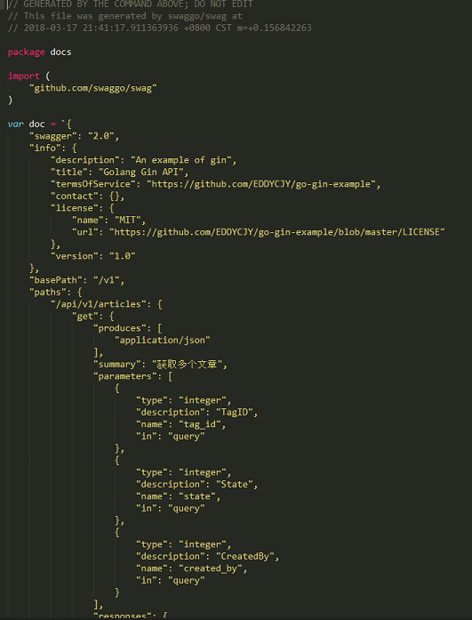

# 1. 8-为它加上Swagger

> 2022-01-21 00：40

[点击查看原文](https://eddycjy.com/posts/go/gin/2018-03-18-swagger/)

## 1.1. 涉及知识点

Swagger

## 1.2. 本文目标

一个好的 API's，必然离不开一个好的 API 文档，如果要开发纯手写 API 文档，不存在的（很难持续维护），因此我们要自动生成接口文档。

## 1.3. 安装 swag

### 1.3.1. 安装

```cmd
$ go get -u github.com/swaggo/swag/cmd/swag@v1.6.5
```

若 `$GOROOT/bin` 没有加入 `$PATH` 中，则需要执行以下命令将可执行文件移动到 `$GOBIN` 下

```cmd
mv $GOPATH/bin/swag /usr/local/go/bin
```

> [mv 表示移动文件或目录](https://www.runoob.com/linux/linux-comm-mv.html)，其基本语法为：`mv [options] source dest`.

### 1.3.2. 验证是否安装成功

检查 `$GOBIN` 下是否有 swag 文件，如下：

```cmd
$ swag -v
swag version v1.6.5
```

## 1.4. 安装 `gin-swagger`

```
$ go get -u github.com/swaggo/gin-swagger@v1.2.0

$ go get -u github.com/swaggo/files

$ go get -u github.com/alecthomas/template
```

注：若无科学上网，请务必配置 `Go modules proxy`。(在第一篇中有介绍如何配置 proxy)

## 1.5. 初始化

### 1.5.1. 编写 swagger 注释

`Swagger` 中需要将相应的注释或注解编写到方法上，再利用生成器自动生成说明文件

`gin-swagger` 给出的范例：

```go
// @Summary Add a new pet to the store
// @Description get string by ID
// @Accept  json
// @Produce  json
// @Param   some_id     path    int     true        "Some ID"
// @Success 200 {string} string	"ok"
// @Failure 400 {object} web.APIError "We need ID!!"
// @Failure 404 {object} web.APIError "Can not find ID"
// @Router /testapi/get-string-by-int/{some_id} [get]
```

我们可以参照 `Swagger` 的注解规范和范例去编写

```go
// @Summary 新增文章标签
// @Produce  json
// @Param name query string true "Name"
// @Param state query int false "State"
// @Param created_by query int false "CreatedBy"
// @Success 200 {string} json "{"code":200,"data":{},"msg":"ok"}"
// @Router /api/v1/tags [post]
func AddTag(c *gin.Context) {
    //...
}
```

```go
// @Summary 修改文章标签
// @Produce  json
// @Param id path int true "ID"
// @Param name query string true "ID"
// @Param state query int false "State"
// @Param modified_by query string true "ModifiedBy"
// @Success 200 {string} json "{"code":200,"data":{},"msg":"ok"}"
// @Router /api/v1/tags/{id} [put]
func EditTag(c *gin.Context) {
   //...
}
```

参考的注解请参见 [go-gin-example](https://github.com/EDDYCJY/go-gin-example)。以确保获取最新的 swag 语法

### 1.5.2. 增加获取 swagger 的路由

在完成了注解的编写后，我们需要针对 `swagger` 新增初始化动作和对应的路由规则，才可以使用。打开 `routers/router.go` 文件，新增内容如下：

```go
package routers

import (
	...

	_ "github.com/EDDYCJY/go-gin-example/docs"

	...
)

// InitRouter initialize routing information
func InitRouter() *gin.Engine {
	...
	r.GET("/swagger/*any", ginSwagger.WrapHandler(swaggerFiles.Handler))
	...
	apiv1 := r.Group("/api/v1")
	apiv1.Use(jwt.JWT())
	{
		...
	}

	return r
}
```

### 1.5.3. 生成 swagger 文档

我们进入到 `gin-blog` 的项目根目录中，执行初始化命令

```go
[$ gin-blog]# swag init

2018/03/13 23:32:10 Generate swagger docs....
2018/03/13 23:32:10 Generate general API Info
2018/03/13 23:32:10 create docs.go at  docs/docs.go
```

完毕后会在项目根目录下生成 docs

```cmd
docs/
├── docs.go
└── swagger
    ├── swagger.json
    └── swagger.yaml
```

我们可以检查 `docs.go` 文件中的 `doc` 变量，详细记载中我们文件中所编写的注解和说明. 如下图：



### 1.5.4. 验证生成的文档

大功告成，访问一下 `http://127.0.0.1:8000/swagger/index.html`， 查看 API 文档生成是否正确。如下图：


## 1.6. 参考

[本系列示例代码：go-gin-example](https://github.com/EDDYCJY/go-gin-example)

## 1.7. 补充

摘自原文评论区。

* 注解 `@success 200 {string} json "{"code":200,"data":{},"msg":"ok"}"` 应该要改为=>`@success 200 {object} gin.H` 或者改为 `@success 200 {string} string "{"code":200,"data":{},"msg":"ok"}"`
* swag 文档怎么发不到 apache 服务器上，我把 go 项目部署到服务器上，用 apache 做反向代理——`ginSwagger.WrapHandler(swaggerFiles.Handler, url)`