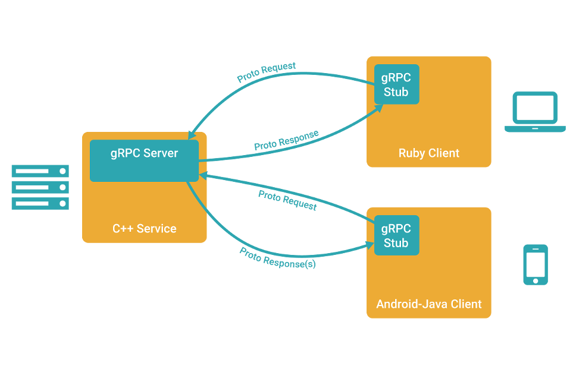

# 1. 1-gRPC及相关介绍

>2022-01-27 11:25

[点击查看原文](https://eddycjy.com/posts/go/grpc/2018-09-22-install/)

[项目地址：https://github.com/EDDYCJY/go-grpc-example](https://github.com/EDDYCJY/go-grpc-example)

作为开篇章，将会介绍 gRPC 相关的一些知识。简单来讲 gRPC 是一个 基于 HTTP/2 协议设计的 RPC 框架，它采用了 Protobuf 作为 IDL（Interface description language，接口定义语言）

你是否有过疑惑，它们都是些什么？本文将会介绍一些常用的知识和概念，更详细的会给出手册地址去深入

## 1.1. RPC

### 1.1.1. 什么是 RPC

#### 1.1.1.1. 定义

RPC 代指**远程过程调用**（Remote Procedure Call），它的调用包含了**传输协议和编码（对象序列号）协议**等等。**允许运行于一台计算机的程序调用另一台计算机的子程序，而开发人员无需额外地为这个交互作用编程。**

#### 1.1.1.2. 使用场景：

有两台服务器，分别是 A、B。在 A 上的应用 C 想要调用 B 服务器上的应用 D，它们可以直接本地调用吗？

答案是不能的，但走 RPC 的话，十分方便。因此常有人称使用 RPC，就跟本地调用一个函数一样简单。

### 1.1.2. RPC 框架

我认为，一个完整的 RPC 框架，应包含**负载均衡**、**服务注册和发现**、**服务治理**等功能，并具有**可拓展性便于流量监控系统等接入**，这样它才算完整的。当然了，有些较单一的 RPC 框架，通过组合多组件也能达到这个标准。

你认为呢？

### 1.1.3. 常见 RPC 框架

* [gRPC](https://grpc.io/)
* [Thrift](https://github.com/apache/thrift)
* [Rpcx](https://github.com/smallnest/rpcx)
* [Dubbo](https://github.com/apache/incubator-dubbo)

#### 1.1.3.1. 比较一下

框架 | 跨语言 | 多 IDL | 服务治理 | 注册中心 | 服务管理
---|---|---|---|---|---
gRPC | √ | × | × | × | ×
Thrift | √ | × | × | × | ×
Rpcx | × | √ | √ | √ | √
Dubbo | × | √ | √ | √ | √

#### 1.1.3.2. 为什么要 RPC

简单、通用、安全、效率

#### 1.1.3.3. RPC 可以基于 HTTP 吗

RPC 是代指**远程过程调用**，是可以基于 HTTP 协议的

肯定会有人说效率优势，我可以告诉你，那是基于 HTTP/1.1 来讲的，HTTP/2 优化了许多问题（当然也存在新的问题），所以你看到了本文的主题 gRPC

## 1.2. Protobuf

[更多内容可参考：《Proto3使用指南》--博客园](https://www.cnblogs.com/lianshuiwuyi/p/12221913.html)

### 1.2.1. 介绍

[Protocol Buffers]([https://github.com/protocolbuffers/protobuf](https://github.com/protocolbuffers/protobuf)) 是一种与语言、平台无关，可扩展的**序列化结构化数据的方法**，常用于通信协议，数据存储等等。相较于 JSON、XML，它更小、更快、更简单，因此也更受开发人员的青眯

### 1.2.2. 语法

```/
syntax = "proto3";

service SearchService {
    rpc Search (SearchRequest) returns (SearchResponse);
}

message SearchRequest {
  string query = 1;
  int32 page_number = 2;
  int32 result_per_page = 3;
}

message SearchResponse {
    ...
}
```

* 第一行（非空的非注释行）声明使用 proto3 语法。如果不声明，将默认使用 proto2 语法。同时我建议不论是用 v2 还是 v3，都应当显示声明该版本
* 定义 `SearchService` RPC 服务，其包含 RPC 方法 `Search` ，入参为 `SearchRequest` 消息，出参为 `SearchResponse` 消息
* 定义 `SearchRequest` 、 `SearchResponse` 消息，前者定义了三个字段，每一个字段包含三个属性：类型、字段名称、字段编号
* Protobuf 编译器会根据选择的语言不同，生成相应语言的 `Service Interface Code` 和 `Stubs`

最后，这里只是简单的语法介绍，详细的请右拐 [Language Guide (proto3)](https://developers.google.com/protocol-buffers/docs/proto3)

### 1.2.3. 数据类型

.proto Type | C++ Type  | Java Type | Go Type	 | PHP Type
---|---|---|---|---
double	 | double	 | double	 | float64	 | float
float	        | float	 | float	 | float32	 | float
int32	 | int32	 | int	        | int32	 | integer
int64	 | int64	 | long	 | int64	 | integer/string
uint32	 | uint32	 | int	        | uint32	 | integer
uint64	 | uint64	 | long	 | uint64	 | integer/string
sint32	 | int32	 | int	        | int32	 | integer
sint64	 | int64	 | long	 | int64	 | integer/string
fixed32	 | uint32	 | int	        | uint32	 | integer
fixed64	 | uint64	 | long	 | uint64	 | integer/string
sfixed32	 | int32	 | int	        | int32	 | integer
sfixed64	 | int64	 | long	 | int64	 | integer/string
bool	        | bool	 | boolean | bool	 | boolean
string	 | string	 | String	 | string	 | string
bytes	 | string	 | ByteString	 | []byte	 | string

### 1.2.4. v2 和 v3 主要区别

* 删除原始值字段的字段存在逻辑
* 删除 required 字段
* 删除 optional 字段，默认就是
* 删除 default 字段
* 删除扩展特性，新增 Any 类型来替代它
* 删除 unknown 字段的支持
* 新增 [JSON Mapping](https://developers.google.com/protocol-buffers/docs/proto3#json)
* 新增 Map 类型的支持
* 修复 enum 的 unknown 类型
* repeated 默认使用 packed 编码
* 引入了新的语言实现（C＃，JavaScript，Ruby，Objective-C）

以上是日常涉及的常见功能，如果还想详细了解可阅读 [Protobuf Version 3.0.0](https://github.com/protocolbuffers/protobuf/releases?after=v3.2.1)

### 1.2.5. 相较 Protobuf，为什么不使用 XML？

* 更简单
* 数据描述文件只需原来的 1/10 至 1/3
* 解析速度是原来的 20 倍至 100 倍
* 减少了二义性
* 生成了更易使用的数据访问类

## 1.3. gRPC

### 1.3.1. 介绍

gRPC 是一个高性能、开源和通用的 RPC 框架，面向移动和 HTTP/2 设计

### 1.3.2. 多语言

* C++
* C#
* Dart
* Go
* Java
* Node.js
* Objective-C
* PHP
* Python
* Ruby

### 1.3.3. 特点

* HTTP/2
* Protobuf
* 客户端、服务端基于同一份 IDL
* 移动网络的良好支持
* 支持多语言

### 1.3.4. 概览



### 1.3.5. 讲解

* 客户端（gRPC Sub）调用 A 方法，发起 RPC 调用
* 对请求信息使用 Protobuf 进行对象序列化压缩（IDL）
* 服务端（gRPC Server）接收到请求后，解码请求体，进行业务逻辑处理并返回
* 对响应结果使用 Protobuf 进行对象序列化压缩（IDL）
* 客户端接收到服务端响应，解码请求体。回调被调用的 A 方法，唤醒正在等待响应（阻塞）的客户端调用并返回响应结果

### 1.3.6. 示例

在这一小节，将简单的给大家展示 gRPC 的客户端和服务端的示例代码，希望大家先有一个基础的印象，将会在下一章节详细介绍 🤔

#### 1.3.6.1. 构建和启动服务端

```go
lis, err := net.Listen("tcp", fmt.Sprintf(":%d", *port))
if err != nil {
        log.Fatalf("failed to listen: %v", err)
}

grpcServer := grpc.NewServer()
...
pb.RegisterSearchServer(grpcServer, &SearchServer{})
grpcServer.Serve(lis)
```

* 监听指定 TCP 端口，用于接受客户端请求
* 创建 gRPC Server 的实例对象
* gRPC Server 内部服务和路由的注册
* `Serve()` 调用服务器以执行阻塞等待，直到进程被终止或被 `Stop()` 调用

#### 1.3.6.2. 创建客户端

```go
var opts []grpc.DialOption
...
conn, err := grpc.Dial(*serverAddr, opts...)
if err != nil {
    log.Fatalf("fail to dial: %v", err)
}

defer conn.Close()
client := pb.NewSearchClient(conn)
...
```

* 创建 gRPC Channel 与 gRPC Server 进行通信（需服务器地址和端口作为参数）
* 设置 DialOptions 凭证（例如，TLS，GCE 凭据，JWT 凭证）
* 创建 Search Client Stub
* 调用对应的服务方法

## 1.4. 思考题

* 什么场景下不适合使用 Protobuf，而适合使用 JSON、XML？
* Protobuf 一节中提到的 packed 编码，是什么？

## 1.5. 总结

在开篇内容中，我利用了尽量简短的描述给你介绍了接下来所必须、必要的知识点 希望你能够有所收获，建议能到我给的参考资料处进行深入学习，是最好的了

## 1.6. 参考资料

* [Protocol Buffers](https://developers.google.com/protocol-buffers/docs/proto3)
* [gRPC](https://grpc.io/docs/)

## 1.7. 补充

> 摘自原文评论区

* 什么场景下不适合使用 Protobuf，而适合使用 JSON、XML？

在调试成本比较高的场景下, 使用 JSON/XML 这种人眼可读的协议, 能够更方便测试人员的理解;
另外, 在不支持 Protobuf 编解码的动态编程语言中, 也可以考虑 JSON/XML;

感觉这篇文章总结的挺全面的：[《序列化和反序列化》——美团技术团队](https://tech.meituan.com/2015/02/26/serialization-vs-deserialization.html)


* Protobuf 一节中提到的 packed 编码，是什么？

```go
message Test4 {
  repeated int32 d = 4 [packed=true];
}
```

赋值:

```go
Test4.d = []int32{3, 270, 86942}
```

d 编码后(16 进制): `22 06 03 8E 02 9E A7 05`
d 编码后(16 进制 -> 二进制):

```/
22 -> 010 0(field number = 4) 010 (wire type = 2)
06 -> payload size = 6
03 -> 第一个元素为 3
8E 02 -> 第二个元素为 270
8E 02 -> 第三个元素为 86942
```