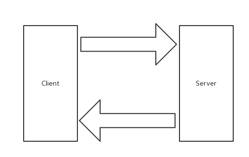
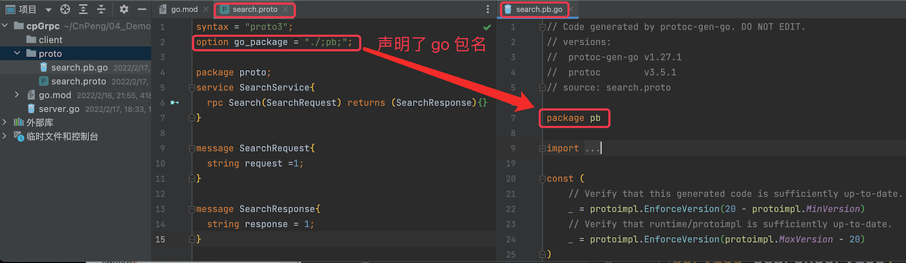
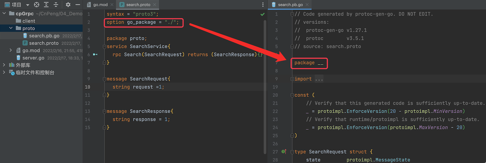

# 1. 2-gRPC的客户端和服务端

>2022-02-16 21：08

[点击查看原文](https://eddycjy.com/posts/go/grpc/2018-09-23-client-and-server/)

## 1.1. 前言

本章节将使用 Go 来编写 gRPC Server 和 Client，让其互相通讯。在此之上会使用到如下库：

* google.golang.org/grpc
* github.com/golang/protobuf/protoc-gen-go

## 1.2. 安装

### 1.2.1. gRPC

在项目目录下执行如下命令：

```cmd
go get -u google.golang.org/grpc
```

### 1.2.2. Protocol Buffers v3

[https://github.com/protocolbuffers/protobuf](https://github.com/protocolbuffers/protobuf)

在系统根目录下依次执行如下 6 条命令：

```cmd
wget https://github.com/google/protobuf/releases/download/v3.5.1/protobuf-all-3.5.1.zip

unzip protobuf-all-3.5.1.zip

cd protobuf-3.5.1/

./configure

make

make install
```

检查是否安装成功

```cmd
protoc --version
```

若出现以下错误，执行 `ldconfig` 命名就能解决这问题

```
protoc: error while loading shared libraries: libprotobuf.so.15: cannot open shared object file: No such file or directory
```


> 补充：
> * `wget` 是一个从网络上自动下载文件的自由工具，支持通过 HTTP、HTTPS、FTP 三个最常见的 TCP/IP 协议 下载，并可以使用 HTTP 代理。`wget` 这个名称来源于 "World Wide Web" 与 "get" 的结合。
> * mac 电脑中在终端中输入 `wget` 时如果提示找不到命令，表示还没有安装，可以执行 `brew install wget` 进行安装。——`brew` 是  [Homebrew](https://brew.sh/index_zh-cn) 的命令，可以通过该命令在 mac 电脑上安装软件。


### 1.2.3. Protoc Plugin

在项目目录下执行如下命令：

```cmd
go get -u github.com/golang/protobuf/protoc-gen-go
```

安装环境若有问题，可参考先前的文章 [《介绍与环境安装》](https://eddycjy.com/posts/go/grpc-gateway/2018-02-23-install/) 内有详细介绍，不再赘述

## 1.3. 编写 gRPC 代码

本小节开始正式编写 gRPC 相关的程序，一起上车吧 😄

### 1.3.1. 图示



### 1.3.2. 目录结构

```cmd
$ tree go-grpc-example
go-grpc-example
├── client
├── proto
│   └── search.proto
└── server.go

```

### 1.3.3. IDL

#### 1.3.3.1. 编写 proto 文件

在 `proto` 文件夹下的 `search.proto` 文件中，写入如下内容：

```go
syntax = "proto3";

package proto;

service SearchService {
    rpc Search(SearchRequest) returns (SearchResponse) {}
}

message SearchRequest {
    string request = 1;
}

message SearchResponse {
    string response = 1;
}
```

#### 1.3.3.2. 生成 `.pb.go` 

> 注意，此处生成时如果报错，可以参考本文最后的 `补充` 一节中的内容。

在 `proto` 文件夹下执行如下命令：

```cmd
$ protoc --go_out=plugins=grpc:. *.proto
```


* `--go_out=.`：设置 Go 代码输出的目录

该指令会加载 `protoc-gen-go` 插件达到生成 Go 代码的目的，生成的文件以 `.pb.go` 为文件后缀

* `plugins=plugin1+plugin2`：指定要加载的子插件列表

我们定义的 `proto` 文件是涉及了 RPC 服务的，而默认是不会生成 RPC 代码的，因此需要给出 `plugins` 参数传递给 `protoc-gen-go`，告诉它，请支持 RPC（这里指定了 gRPC）


* `:` : 冒号在此处充当分隔符的作用，后跟所需要的参数集。

如果这处不涉及 RPC，命令可简化为：`$ protoc --go_out=. *.proto`

>注：建议看看两条命令生成的 `.pb.go` 文件，分别有什么区别.

#### 1.3.3.3. `.pb.go` 内容解析

执行完毕上一小节的命令后，将得到一个 `.pb.go` 文件，文件内容如下：

```go
type SearchRequest struct {
	Request              string   `protobuf:"bytes,1,opt,name=request" json:"request,omitempty"`
	XXX_NoUnkeyedLiteral struct{} `json:"-"`
	XXX_unrecognized     []byte   `json:"-"`
	XXX_sizecache        int32    `json:"-"`
}

func (m *SearchRequest) Reset()         { *m = SearchRequest{} }
func (m *SearchRequest) String() string { return proto.CompactTextString(m) }
func (*SearchRequest) ProtoMessage()    {}
func (*SearchRequest) Descriptor() ([]byte, []int) {
	return fileDescriptor_search_8b45f79ee13ff6a3, []int{0}
}

func (m *SearchRequest) GetRequest() string {
	if m != nil {
		return m.Request
	}
	return ""
}
```

通过阅读这一部分代码，可以知道主要涉及如下方面：

* 字段名称从小写下划线转换为大写驼峰模式（字段导出）
* 生成一组 Getters 方法，能便于处理一些空指针取值的情况
* ProtoMessage 方法实现 `proto.Message` 的接口
* 生成 Rest 方法，便于将 Protobuf 结构体恢复为零值
* Repeated 转换为切片

```go
type SearchRequest struct {
	Request              string   `protobuf:"bytes,1,opt,name=request" json:"request,omitempty"`
}

func (*SearchRequest) Descriptor() ([]byte, []int) {
	return fileDescriptor_search_8b45f79ee13ff6a3, []int{0}
}

type SearchResponse struct {
	Response             string   `protobuf:"bytes,1,opt,name=response" json:"response,omitempty"`
}

func (*SearchResponse) Descriptor() ([]byte, []int) {
	return fileDescriptor_search_8b45f79ee13ff6a3, []int{1}
}

...

func init() { proto.RegisterFile("search.proto", fileDescriptor_search_8b45f79ee13ff6a3) }

var fileDescriptor_search_8b45f79ee13ff6a3 = []byte{
	// 131 bytes of a gzipped FileDescriptorProto
	0x1f, 0x8b, 0x08, 0x00, 0x00, 0x00, 0x00, 0x00, 0x02, 0xff, 0xe2, 0xe2, 0x29, 0x4e, 0x4d, 0x2c,
	0x4a, 0xce, 0xd0, 0x2b, 0x28, 0xca, 0x2f, 0xc9, 0x17, 0x62, 0x05, 0x53, 0x4a, 0x9a, 0x5c, 0xbc,
	0xc1, 0x60, 0xe1, 0xa0, 0xd4, 0xc2, 0xd2, 0xd4, 0xe2, 0x12, 0x21, 0x09, 0x2e, 0xf6, 0x22, 0x08,
	0x53, 0x82, 0x51, 0x81, 0x51, 0x83, 0x33, 0x08, 0xc6, 0x55, 0xd2, 0xe1, 0xe2, 0x83, 0x29, 0x2d,
	0x2e, 0xc8, 0xcf, 0x2b, 0x4e, 0x15, 0x92, 0xe2, 0xe2, 0x28, 0x82, 0xb2, 0xa1, 0x8a, 0xe1, 0x7c,
	0x23, 0x0f, 0x98, 0xc1, 0xc1, 0xa9, 0x45, 0x65, 0x99, 0xc9, 0xa9, 0x42, 0xe6, 0x5c, 0x6c, 0x10,
	0x01, 0x21, 0x11, 0x88, 0x13, 0xf4, 0x50, 0x2c, 0x96, 0x12, 0x45, 0x13, 0x85, 0x98, 0xa3, 0xc4,
	0x90, 0xc4, 0x06, 0x16, 0x37, 0x06, 0x04, 0x00, 0x00, 0xff, 0xff, 0xf3, 0xba, 0x74, 0x95, 0xc0,
	0x00, 0x00, 0x00,
}
```

而这一部分代码主要是围绕 `fileDescriptor` 进行，在这里 `fileDescriptor_search_8b45f79ee13ff6a3` 表示一个编译后的 `proto` 文件，而每一个方法都包含 `Descriptor` 方法，代表着这一个方法在 `fileDescriptor` 中具体的 Message Field

### 1.3.4. 编写 Server

这一小节将编写 gRPC Server 的基础模板，完成一个方法的调用。对 `server.go` 写入如下内容：

```go
package main

import (
	"context"
	"log"
	"net"

	"google.golang.org/grpc"

	pb "github.com/EDDYCJY/go-grpc-example/proto"
)

type SearchService struct{}

func (s *SearchService) Search(ctx context.Context, r *pb.SearchRequest) (*pb.SearchResponse, error) {
	return &pb.SearchResponse{Response: r.GetRequest() + " Server"}, nil
}

const PORT = "9001"

func main() {
	server := grpc.NewServer()
	pb.RegisterSearchServiceServer(server, &SearchService{})

	lis, err := net.Listen("tcp", ":"+PORT)
	if err != nil {
		log.Fatalf("net.Listen err: %v", err)
	}

	server.Serve(lis)
}
```

* 创建 gRPC Server 对象，你可以理解为它是 Server 端的抽象对象
* 将 SearchService（其包含需要被调用的服务端接口）注册到 gRPC Server 的内部注册中心。这样可以在接受到请求时，通过内部的服务发现，发现该服务端接口并转接进行逻辑处理
* 创建 Listen，监听 TCP 端口
* gRPC Server 开始 lis.Accept，直到 Stop 或 GracefulStop

### 1.3.5. 编写 Client

接下来编写 gRPC Go Client 的基础模板，打开 `client/client.go` 文件，写入以下内容：

```go
package main

import (
	"context"
	"log"

	"google.golang.org/grpc"

	pb "github.com/EDDYCJY/go-grpc-example/proto"
)

const PORT = "9001"

func main() {
	conn, err := grpc.Dial(":"+PORT, grpc.WithInsecure())
	if err != nil {
		log.Fatalf("grpc.Dial err: %v", err)
	}
	defer conn.Close()

	client := pb.NewSearchServiceClient(conn)
	resp, err := client.Search(context.Background(), &pb.SearchRequest{
		Request: "gRPC",
	})
	if err != nil {
		log.Fatalf("client.Search err: %v", err)
	}

	log.Printf("resp: %s", resp.GetResponse())
}
```

* 创建与给定目标（服务端）的连接交互
* 创建 SearchService 的客户端对象
* 发送 RPC 请求，等待同步响应，得到回调后返回响应结果
* 输出响应结果

## 1.4. 验证

### 1.4.1. 启动 Server

```cmd
$ pwd
$GOPATH/github.com/EDDYCJY/go-grpc-example

$ go run server.go
```

### 1.4.2. 启动 Client

```go
$ pwd
$GOPATH/github.com/EDDYCJY/go-grpc-example/client

$ go run client.go
2018/09/23 11:06:23 resp: gRPC Server
```

## 1.5. 总结

在本章节，我们对 Protobuf、gRPC Client/Server 分别都进行了介绍。希望你结合文中讲述内容再写一个 Demo 进行深入了解，肯定会更棒 🤔

## 1.6. 参考

本系列示例代码 [go-grpc-example](https://github.com/EDDYCJY/go-grpc-example)

## 1.7. 补充

>内容摘自原文评论区。

### 1.7.1. 问题1

执行 `go get -u github.com/golang/protobuf/protoc-gen-go` 报错，错误如下：

```
go: module github.com/golang/protobuf is deprecated: Use the "google.golang.org/protobuf" module instead.
```

解决方案：`go get -u google.golang.org/protobuf/cmd/protoc-gen-go@latest`

### 1.7.2. 问题2

运行 `protoc --go_out=. *.proto` 报错，错误如下：

```
protoc-gen-go: unable to determine Go import path for "search.proto"
Please specify either:
• a "go_package" option in the .proto source file, or
• a "M" argument on the command line.
```

解决方案：在 `search.proto` 文件加入 `option go_package ="./";`

关于该问题的的其他参考：[点击查看](https://blog.csdn.net/min521fei/article/details/119618837)，在该文章中，其描述内容如下：

在相应的 `.proto` 文件中添加 `option go_package = "./;pb";`，其中：

* `./`表示生成后文件的存放目录；
* `pb` 表示生成的 `.go` 文件的包名。


声明 `option go_package = "./;pb";` 后，生成的 `pb.go` 文件如下：



如果使用 `option go_package ="./";`,结果如下：

