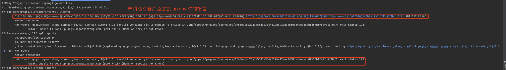

# 1. 001-依赖私有仓库

## 1.1. 依赖私有仓库

将自己公司中编辑的私有仓库作为依赖进行使用时，需要将仓库所属域名添加到配置文件中：


```bash
# 设置私有仓库, 私有仓库需要我们的git服务器启用tls监听443
go env -w GOPRIVATE=gogs.sdgxt.com
```

如果没有添加，则会报出下列错误：




## 1.2. 示例

go.mod 文件示例：


```mod
module hf-ioc-server

require (
	hik-isc-sdk v1.0.0
	// 其他私有仓库内容省略
)

require (
	github.com/BurntSushi/toml v0.3.1 // indirect
	// 其他公共仓库内容省略
)

replace (
	// 指向私有仓库
	hik-isc-sdk v1.0.0 => gogs.sdgxt.com/xinjie/hik-isc-sdk.git v1.3.1
)

go 1.17

```

上述示例中，`gogs.sdgxt.com/xinjie/hik-isc-sdk.git` 是私有的通用 sdk 仓库，当前项目中引用了该仓库的 `v1.3.1` 版本。

当 `hik-isc-sdk` 中的内容发生变化后，需要先从代码仓库中发布一个版本，然后将对应的版本号替换到 `replace` 节点中。

替换完成后，执行 `go mod tidy` 更新依赖内容。

为了方便调试和打包，还可以执行 `go mod vendor` 将依赖信息拉取到本地项目的 `vendor` 目录下。