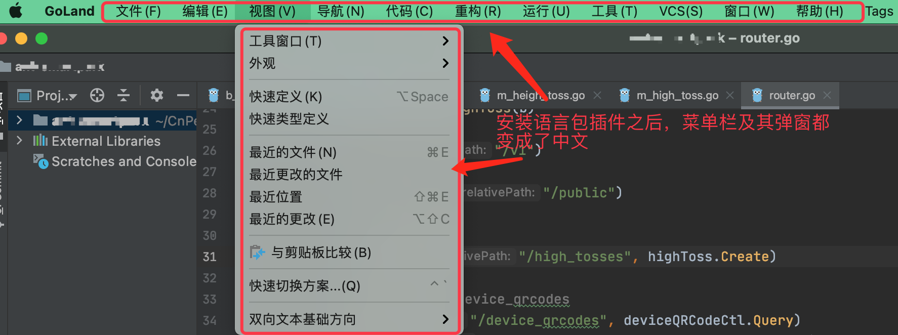

[官网文章：《JetBrains IDE 一直以来仅提供英语版本，现在将本地化为三种语言！》](https://blog.jetbrains.com/zh-hans/2020/05/11/jetbrains-chinese/)

IntelliJ IDEA 系列的产品一直以来都是英文界面，这对我们的使用造成了一定程度的影响。

2020 年开始，IntelliJ 开始推进 IDEA 本地化，提供了中文、日语、韩语的语言包插件。具体安装步骤如下：

我们先打开 `Preferences` 界面（Mac 下的快捷键是  `Command + ,`），然后选择 `Plugins`-`Marketplace`, 在输入框中输入 `chinese` 即可搜索到该语言包（下图中排第二个），然后点击其后面的 `install` 安装即可。

安装完成后会提示重启：

重启之后，我们会看到菜单栏及其对应的弹窗都已经变成了中文：

这样看起来是不是顺眼了很多？