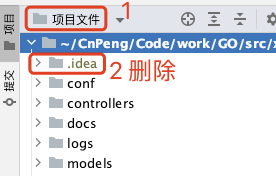
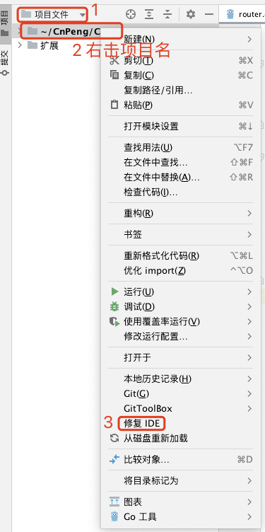
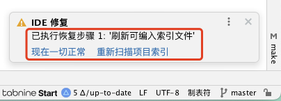

# 1. 0011-GoLand打开项目时全部灰色无法编辑

## 1.1. 问题现象

GoLand 打开项目时，在 `项目` 模式下找不到项目内容，切换到 `项目文件` 模式下虽然能看到内容，但无法编辑，且项目中的依赖关系全部飘红，无法追踪调用关系，项目也无法运行。

## 1.2. 修复

切换到 `项目文件` 模式，在项目根目录下会看到一个 `.idea` 目录，删除该目录，然后重启 GoLand 。

如果上述操作后依旧无法编辑项目，则继续执行下列操作：

执行 `修复IDE` 时，GoLand 右下角会有弹窗提示，按照弹窗内的提示操作即可，如下图：

弹窗内的完整操作有 5 步，但实际可能并不需要 5 步全部执行。