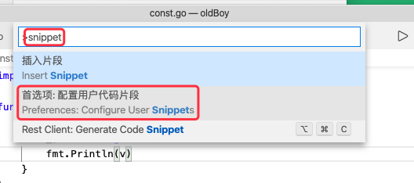
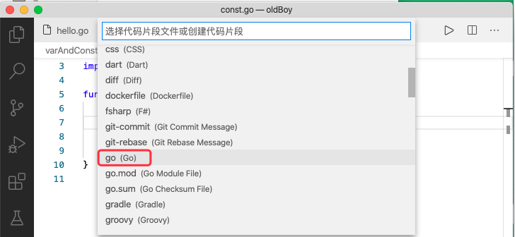

Windows 下按：`ctrl + shift + P` , Mac 下按：`Cmd + shift + P` ,就会打开如下界面：


然后输入 `snippet`, 并选择 `配置用户代码片段`



上一步操作之后会弹出下面的弹窗，选择其中的 `go`



上一步选择之后，就会打开一个 `go.json` 文件, 然后编辑该文件即可：

```json
{
    // Place your snippets for go here. Each snippet is defined under a snippet name and has a prefix, body and 
    // description. The prefix is what is used to trigger the snippet and the body will be expanded and inserted. Possible variables are:
    // $1, $2 for tab stops, $0 for the final cursor position, and ${1:label}, ${2:another} for placeholders. Placeholders with the 
    // same ids are connected.
    // Example:
    // "Print to console": {
    // 	"prefix": "log",
    // 	"body": [
    // 		"console.log('$1');",
    // 		"$2"
    // 	],
    // 	"description": "Log output to console"
    // }

    "pln": {
        "prefix": "pln",
        "body": "fmt.Println($0)",
        "description": "打印内容并换行"
    },

    "plf": {
        "prefix": "plf",
        "body": "fmt.Printf(\"$0\\n\")",
        "description": "带有格式化和换行的打印"
    }
}
```

上述示例中，外层的 `pln` 和 `plf` 是 snippet (片段) 的名字，这个不重要，重要的是 `{ }` 内部的 `prefix` 和 `body`。其中：

* `prefix` 是我们代码片段的关键字/快捷键
* `body` 是关键字／快捷键对应的操作
* `$` 表示光标停放的位置